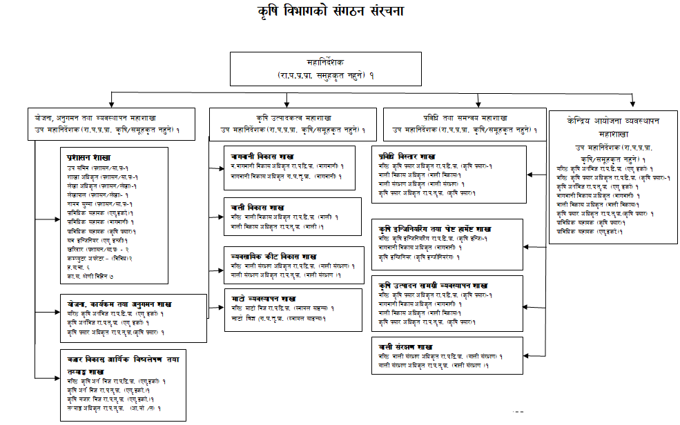
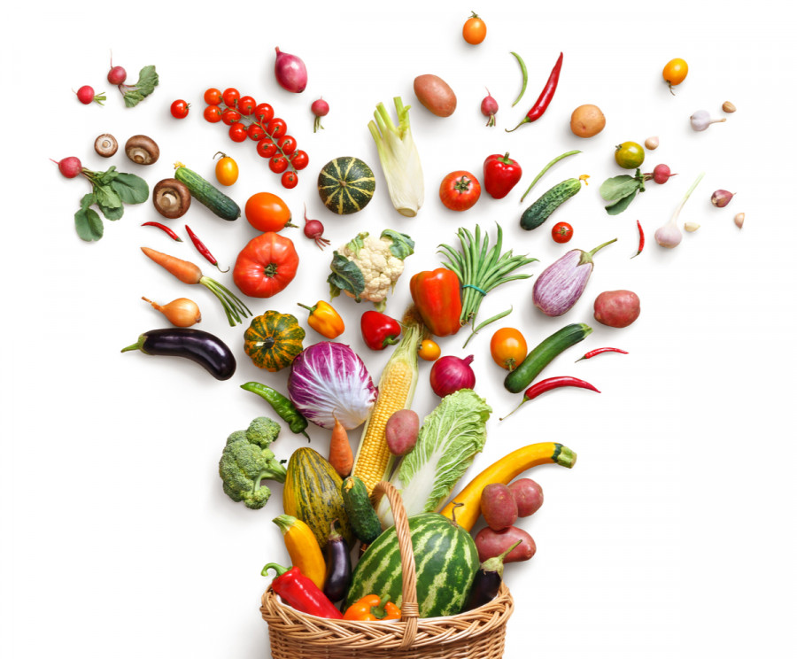
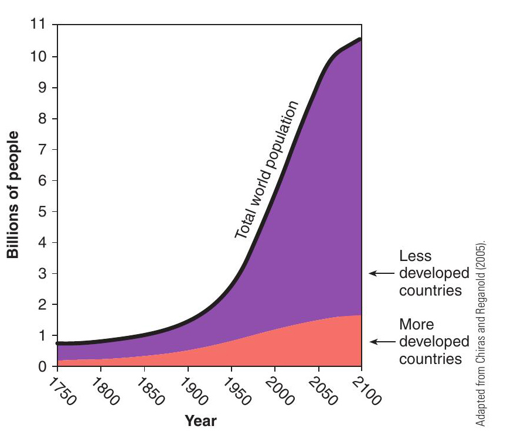
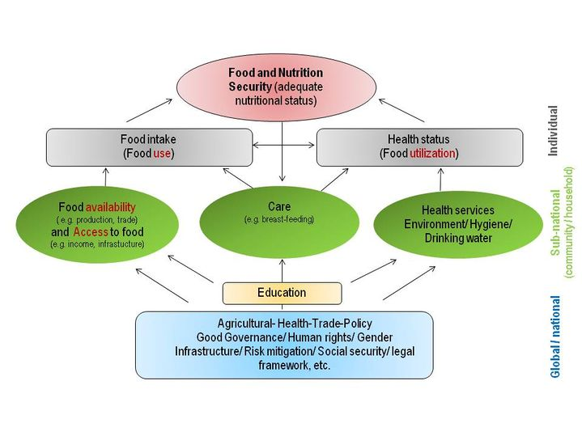
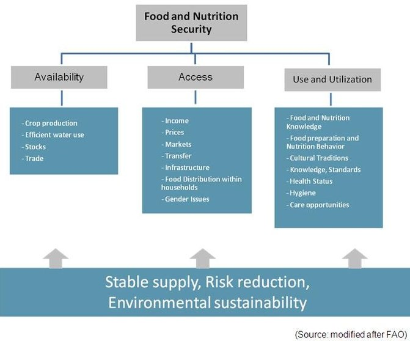
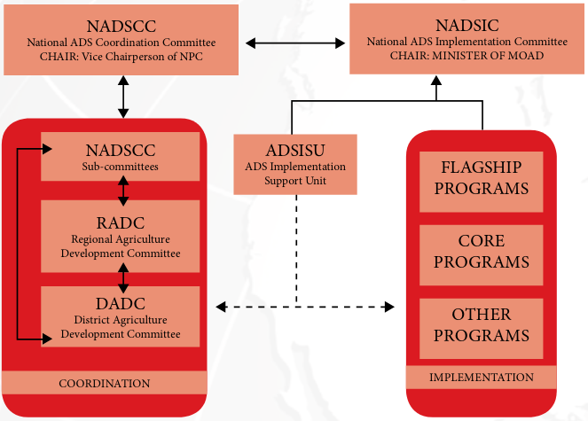

# General agriculture

## Nepal agriculture and geography

**Ecological regions**

- Himalayan region: 35%
- Hilly region: 41.67%
- Terai region: 23.11%

### Land use distribution by use category

```{r land-use-distribution-use}
tribble(
  ~"Category", ~"Area (\'000 hectares)", ~"Percentage",
  "Agricultural land cultivated", 3091, 21,
  "Agricultural land uncultivated", 1030, 6.99,
  "Forest", 4268, 29,
  "Shrubland", 1560, 10.6,
  "Grassland and pasture", 1766, 12,
  "Water bodies", 383, 2.6,
  "Other", 2620, 17.9
) %>% 
  knitr::kable(caption = "Land use distribution of total land area of Nepal by use category; Source: Statistical Information on Nepalese Agriculture, 2018/19", booktabs = TRUE, longtable = TRUE) %>% 
  kableExtra::kable_styling(latex_options = "striped", font_size = 8) %>% 
  kableExtra::column_spec(column = 1:3, width = c("8em", "6em", "6em"))
```


```{r cultivable-land-climaticzones}
tribble(
  ~"Agro-climatic zone", ~"Arable land (percent)", ~"Altitude",
  "Sub-alpine", 0, "3000-4000",
  "Cool-temperate", 8, "2000-3000",
  "Warm-temperate", 12, "1500-2000",
  "Sub-tropical", 19, "1000-1500",
  "Tropical", 61, "<1000"
) %>% 
  knitr::kable(caption = "Arable land of different agro-climatic zones of Nepal", booktabs = TRUE, longtable = TRUE) %>% 
  kableExtra::kable_styling(latex_options = "striped", font_size = 8) %>% 
  kableExtra::column_spec(column = 1:3, width = c("8em", "6em", "6em"))
```

```{r cultivable-land-agro-ecological-zones}
tribble(
  ~"Agro-ecological zone", ~"Arable land (percent)",
  "Terai", 55,
  "Hills", 37.5,
  "Mountains", 7.5
) %>% 
  knitr::kable(caption = "Arable land of different agro-ecological zones of Nepal", booktabs = TRUE, longtable = TRUE) %>% 
  kableExtra::kable_styling(latex_options = "striped", font_size = 8) %>% 
  kableExtra::column_spec(column = 1:2, width = c("8em", "8em"))
```

### Agro-climatic and physiographic zones of Nepal

Nepal's geography makes the country's climate particularly complex. Because of the extreme variations in elevation within short distances, Nepal's climate varies significantly across the country, ranging from alpine and arctic in the north to tropical in the south. The country experiences tropical, meso-thermal, micro-thermal, taiga and tundra types of climate (MoFSC, 2014). As illustrated in Table \ref{tab:climate-nepal}, the temperature and precipitation vary strongly with altitude. 

```{r geographical-region-nepal}
tribble(~"region", ~"elevation", ~"climatic_zone", ~"average_annual_precipitation", ~"average_annual_temperature", 
        "High himal", "Above 5000 m", "Tundra and arctic climate", "150-200 mm", "Less than \\SIrange{3}{10}{\\celsius}", 
        "High mountains", "\\SIrange{3000}{5000}{\\metre}", "Alpine and subalpine", "\\SIrange{150}{200}{\\milli\\metre}", "Less than \\SIrange{3}{10}{\\celsius}", 
        "Middle mountains", "1000-3000 m", "Cool to warm temperate", "275-2300 mm", "\\SIrange{10}{20}{\\celsius}", 
        "Siwalik", "\\SIrange{500}{1000}{\\metre}", "Sub-tropical", "\\SIrange{1100}{3000}{\\milli\\metre}", "\\SIrange{20}{25}{\\celsius}", 
        "Terai (low-laying plains)", "Below 500 m", "Tropical", "\\SIrange{1100}{3000}{\\milli\\metre}", "\\SIrange{20}{25}{\\celsius}") %>% 
  rename_all(function(x)str_replace_all(x, "_", " ") %>% str_to_sentence()) %>% 
  knitr::kable(booktabs = TRUE, escape = FALSE, caption = "Nepal\'s climatic zones (Adapted from MoE, 2010 and MoSTE, 2014)", longtable = TRUE) %>% 
  kableExtra::kable_styling(latex_options = "striped") %>% 
  kableExtra::column_spec(column = 1:5, width = c("7em", "7em", "8em", "10em", "8em"))
```

Alternatively, climate of Nepal is classified into 5 distinct types;


```{r climatic-zone}
tribble(~"SN", ~"Agro-climate", ~"Elevation",
        1, "Tundra or arctic", ">5000 masl",
        2, "Alpine", "3350-5000 masl",
        3, "Cool temperate monsoon", "2100-3350",
        4, "Warm temperate monsoon", "1200-2100",
        5, "Hot monsoon or subtropical", "<1200 masl",
        ) %>% 
  knitr::kable(booktabs = TRUE, caption = "Nepal\'s climatic zones (Adapted from MoE, 2010 and MoSTE, 2014)", longtable = TRUE) %>% 
  kableExtra::kable_styling(latex_options = "striped") %>% 
  kableExtra::column_spec(column = 1:3, width = c("2em", "14em", "8em"))
```


### Macroeconomic indicators

```{r macroeconomic-indicators}
read_csv("./data/macro-economic_indicators.csv",
         skip = 2, show_col_types = FALSE) %>% 
  knitr::kable(booktabs = TRUE, caption = "Macroeconomic indicators of Nepal in recent years", longtable = TRUE) %>% 
  kableExtra::kable_styling(latex_options = "striped", font_size = 8) %>% 
  kableExtra::column_spec(column = 1:9, width = c("8em", "8em", rep("4em", 7)))

# ## for recent data, refer to economic survey of the current year
# https://mof.gov.np/uploads/document/file/Economic%20Survey%202019_20201125024153.pdf
# https://www.mof.gov.np/uploads/document/file/compiled%20economic%20Survey%20english%207-25_20191111101758.pdf

# ## for the year 2012 - 2017
# https://moics.gov.np/uploads/shares/policy/Trade%20Policy%20Review%202018-Nepal.pdf
# 
# ## for 2019/2020
# https://www.nrb.org.np/contents/uploads/2020/08/Current-Macroeconomic-and-Financial-Situation.-English.-Based-on-Annual-data-of-2019.20-1.pdf

```


### GDP contribution, and growth rate of Agriculture and related sector/subsectors

```{r gdp-contribution-growth}

growth_gdp_sectoral <- read_csv("./data/economic_growth_rates_sectors.csv", skip = 1, show_col_types = FALSE) %>% 
  select(-1) %>% 
  mutate(gdp_contribution = ifelse(is.na(gdp_value_percentage), NA, paste0(gdp_value_percentage, "\\% ", "(", gdp_growth_rate_percent,")"))) %>% 
  select(-gdp_value_percentage, -gdp_growth_rate_percent)

growth_gdp_sectoral %>% 
  filter(!is.na(gdp_contribution)) %>% 
  pivot_wider(id_cols = 1, names_from = year, names_prefix = "", values_from = c(gdp_value, gdp_contribution)) %>% 
  rename_all(function(x)str_replace_all(x, "_", " ") %>% str_replace_all("gdp", "GDP")) %>% 
  relocate(6, .after = 2) %>% 
  relocate(7, .after = 4) %>% 
  relocate(8, .after = 6) %>% 
  knitr::kable(caption = "GDP values and contribution (and GDP growth rates) of various sectors in recent years", booktabs = TRUE, longtable = TRUE, escape = FALSE) %>% 
  kableExtra::kable_styling(font_size = 8, latex_options = "striped") %>% 
  kableExtra::column_spec(column = 1:9, width = c("6em", rep("5em", times = 8)))
```

\blandscape

### Production status of crops

```{r cereal-legumes-cultivation}
read_csv("./data/area_production_productivity/cereal_legumes_production_area_nepal.csv",
         skip = 1, show_col_types = FALSE) %>% 
  filter(source %in% c("Agriculture diary, 2076", "Agriculture diary, 2076")) %>% 
  select(-scale, -sn, -source, -remark) %>% 
  mutate(productivity = production/area_total) %>% 
  pivot_wider(id_cols = 1, names_from = year, values_from = 3:5) %>% 
  rename_all(function(x)str_replace_all(x, "_", " ") %>% str_to_sentence()) %>% 
  knitr::kable(booktabs = TRUE, caption = "Area of cultivation, production and productivity of cereal and legume crops in recent years", longtable = TRUE) %>% 
  kableExtra::kable_styling(latex_options = "striped", font_size = 8) %>% 
  kableExtra::column_spec(column = 1:10, width = c("6em", rep("5em", times = 9)))
```


```{r commercial-cultivation}
read_csv("./data/area_production_productivity/commerical_production_area_nepal.csv",
         skip = 1, show_col_types = FALSE) %>% 
  filter(source %in% c("Agriculture diary, 2076", "Agriculture diary, 2076")) %>% 
  select(-scale, -source, -remark, -district) %>% 
  mutate(productivity = production/area_total) %>% 
  pivot_wider(id_cols = 1, names_from = year, values_from = 3:5) %>% 
  rename_all(function(x)str_replace_all(x, "_", " ") %>% str_to_sentence()) %>% 
  knitr::kable(booktabs = TRUE, caption = "Area of cultivation, production and productivity of commercial crops in recent years", longtable = TRUE) %>% 
  kableExtra::kable_styling(latex_options = "striped", font_size = 8) %>% 
  kableExtra::column_spec(column = 1:10, width = c("6em", rep("5em", times = 9)))
```


```{r fruits-vegetable-cultivation}
read_csv("./data/area_production_productivity/vegetable_fruits_production_area_nepal.csv",
         skip = 1, show_col_types = FALSE) %>% 
  filter(source %in% c("Agriculture diary, 2076", "Agriculture diary, 2076")) %>% 
  select(-scale, -sn, -source, -remark, -area_productive) %>% 
  mutate(productivity = production/area_total) %>% 
  pivot_wider(id_cols = 1, names_from = year, values_from = 3:5) %>% 
  rename_all(function(x)str_replace_all(x, "_", " ") %>% str_to_sentence()) %>% 
  knitr::kable(booktabs = TRUE, caption = "Area of cultivation, production and productivity of vegetable and fruit crops in recent years", longtable = TRUE) %>% 
  kableExtra::kable_styling(latex_options = "striped", font_size = 8) %>% 
  kableExtra::column_spec(column = 1:10, width = c("6em", rep("5em", times = 9)))
```

\elandscape

### Classification of districts (LSGA, 2074)

- Endorsed on Ashoj 29. 2074

```{r lsga-district-classification}
read_csv("./data/district_classification.csv",
         show_col_types = FALSE) %>% 
  separate_rows(District, sep = ", ") %>%
  group_by(`Agro-ecology`) %>% 
  summarize(District = paste0(District, collapse = ", "), 
            count = n()) %>% 
  knitr::kable(booktabs = TRUE, longtable = TRUE) %>% 
  kableExtra::kable_styling(font_size = 8, latex_options = "striped") %>% 
  kableExtra::column_spec(column = 2, width = "30em")
```

- Political division of Nepal constitutes 753 local levels amongst which,
  - Metropolitan city: 6
  - Sub metropolitan city: 11
  - Municipality: 276
  - Vilage municipality: 460

- Population: 28.71 million (2073/74 estimate)
- Population growth rate: 1.35 (Census, 2068)

### Poverty related key indicators (NPC, 2020)

```{r poverty-related-key-indicators-2020}
read_csv("./data/poverty_related_key_indicators_2020.csv",
         skip=2, show_col_types = FALSE) %>% 
  knitr::kable(booktabs = TRUE, caption = "Poverty related key indicators (NPC, 2020)", longtable = TRUE) %>% 
  kableExtra::kable_styling(latex_options = "striped")
```


### Key employment indicators

```{r employment-indicators-labor-survey-2020}
read_csv("./data/key_employment_indicators_2020.csv",
         skip=2, show_col_types = FALSE) %>% 
  knitr::kable(booktabs = TRUE, caption = "Key employment indicators (Labor Survey, 2017; CBS, 2020)", longtable = TRUE) %>% 
  kableExtra::kable_styling(latex_options = "striped")
```

### Commodities and minimum support price

```{r commodities-minimum-support-price-2020}
read_csv("./data/minimum_support_price_commodities_2020.csv",
         skip = 3, show_col_types = FALSE) %>% 
  select(-2) %>% 
  knitr::kable(booktabs = TRUE, caption = "Commodities and minimum support price (MoICS, 2020)", longtable = TRUE) %>% 
  kableExtra::kable_styling(latex_options = "striped")
```

### Status of agriculture crops production (MoALD)

```{r agricultural-crop-production-2020}
read_csv("./data/status_of_agricultural_crops_production_2020.csv", skip = 3, show_col_types = FALSE) %>% 
  knitr::kable(caption = "Status of agricultural crops production (Potato and honey is included in cash crops. Sugarcane, jute, tea, coffee, fishery and cotton are included in industrial crops.)", longtable = TRUE, booktabs = TRUE) %>% 
  kableExtra::kable_styling(latex_options = c("striped"), font_size = 8) %>% 
  kableExtra::column_spec(column = 1:5, width = c("6em", rep("7em", 4)))
```

### Status of remittance inflow

```{r remittance-inflow}
read_csv("./data/status_of_remittance_inflow_2020.csv", skip = 2, 
         show_col_types = FALSE) %>% 
  knitr::kable(longtable = TRUE, booktabs = TRUE, caption = "Status of remittance flow during 2020") %>% 
  kableExtra::kable_styling(font_size = 8, latex_options = "striped") %>% 
  kableExtra::column_spec(column = 1, width = "10em")
```


### Per head meat and egg availability

```{r meat-egg-availability}
read_csv("./data/meat_and_egg_availability_2020.csv", skip = 3, 
         show_col_types = FALSE) %>% 
  knitr::kable(booktabs = TRUE, longtable = TRUE, caption = "Per head meat and egg availability during last few years") %>% 
  kableExtra::kable_styling(font_size = 8, latex_options = "striped") %>% 
  kableExtra::column_spec(column = 1:5, width = c("6em", rep("8em", 4)))
```


### Status of credit services to livestock and vegetable crops

```{r credit-livestock-vegetables}
read_csv("./data/status_of_credit_services_to_livestock_and_vegetables_2020_edited.csv", skip = 2,
         show_col_types = FALSE) %>% 
  knitr::kable(booktabs = TRUE, longtable = TRUE, caption = "Status of credit services to livestock and vegetable crops") %>% 
  kableExtra::kable_styling(font_size = 8, latex_options = "striped") %>% 
  kableExtra::column_spec(column = 1:8, width = c("12em", rep("4em", 7)))
```

### Province wise status of forest sector (Ministry of Forest and Environment, 2020)

```{r forest-sector-status}
read_csv("./data/province-wise_distribution_of_forest_sector_2020.csv", skip = 2,
         show_col_types = FALSE) %>% 
  knitr::kable(booktabs = TRUE, longtable = TRUE, caption = "Provincewise status of forest area") %>% 
  kableExtra::kable_styling(font_size = 8, latex_options = "striped") %>% 
  kableExtra::column_spec(column = 1:5, width = c("12em", rep("6em", 4)))
  
```


### Industry registration and investment as per classification

```{r industries-registered}
read_csv("./data/industry_registration_and_investment_as_per_classification_2020.csv", skip = 2,
         show_col_types = FALSE) %>% 
  knitr::kable(booktabs = TRUE, caption = "Industry registration and investment (investment in Rs ten million); Source: Department of Industry, 2020", longtable = TRUE) %>% 
  kableExtra::kable_styling(latex_options = "striped", font_size = 8) %>% 
  kableExtra::column_spec(column = 1:6, width = c("8em", rep("6em", 5)))
```

### Province wise details of micro, cottage and small industries

```{r provincewise-industries}
read_csv("./data/province-wise_details_micro_cottage_small_industries_2020.csv", skip = 3, 
         show_col_types = FALSE) %>% 
  knitr::kable(booktabs = TRUE, caption = "Province-wise details of micro, cottage and small industries", longtable = TRUE) %>% 
  kableExtra::kable_styling(font_size = 8, latex_options = "striped") %>% 
  kableExtra::column_spec(1:3, width = c("8em", "10em", "10em"))
```


### Doing business in Nepal

```{r doing-business}
read_csv("./data/doing_business_report_2020.csv", skip = 2, 
         show_col_types = FALSE) %>% 
  knitr::kable(booktabs = TRUE, caption = "Doing business report rankings and score of Nepal in recent years; Source: WB, 2020", longtable = TRUE) %>% 
  kableExtra::kable_styling(font_size = 8, latex_options = "striped") %>% 
  kableExtra::column_spec(1:5, width = c("6em", rep("6em", 5)))
```


### Province-wise access to electricity

```{r electricity-access}
read_csv("./data/province-wise_access_to_electricity_2020.csv", skip = 2,
         show_col_types = FALSE) %>% 
  knitr::kable(booktabs = TRUE, caption = "Province-wise access to electricity as of mid-March, 2020, Souce: NEA", longtable = TRUE) %>% 
  kableExtra::kable_styling(font_size = 8, latex_options = "striped")
```


### Total hydropower generation

```{r hydropower-generation}
read_csv("./data/province-wise_total_hydropower_generation_2020.csv", skip = 4,
         show_col_types = FALSE) %>% 
  knitr::kable(booktabs = TRUE, caption = "Province-wise hydro-electricity generation", longtable = TRUE) %>% 
  kableExtra::kable_styling(latex_options = "striped", font_size = 8) %>% 
  kableExtra::column_spec(column = 1:4, width = c("10em", "8em", "8em", "6em"))
```


### Road expansion by federal government

```{r road-expansion}
read_csv("./data/road_expansion_by_federal_government_2020.csv", skip = 3,
         show_col_types = FALSE) %>% 
  knitr::kable(booktabs = TRUE, caption = "Road expansion by federal government (in KM) as of mid-March 2010; Source: Ministry of Physical Infrastructure and Transport", longtable = TRUE) %>%
  kableExtra::kable_styling(latex_options = "striped", font_size = 8) %>% 
  kableExtra::column_spec(column = 1:8, width = c("6em", rep("5em", 7)))
```


### Indicators of educational achievements

```{r educational-achievement}
read_csv("./data/indicators_of_educational_achievements_2020.csv", skip = 2,
         show_col_types = FALSE) %>%
  mutate_at(c("Heading", "Indicators"), function(x)str_replace_all(x, "\\(|\\)", ",")) %>%
  mutate_at(c("Heading", "Indicators"), function(x)str_replace_all(x, "\\s,", ",")) %>% 
  mutate_at(c("Heading", "Indicators"), function(x)str_replace_all(x, ",$", "")) %>% 
  mutate_at(c("Heading", "Indicators"), function(x)str_squish(x)) %>% 
  kableExtra::kbl(caption = "Educational achievements of recent years; Source: Economic Survey, 2019/20", format = "latex", longtable = TRUE, booktabs = TRUE, escape = FALSE) %>%
  kableExtra::kable_styling(font_size = 8) %>%
  kableExtra::column_spec(column = 1:8, width = c("5em", "8em", rep("5em", 6))) %>%
  kableExtra::collapse_rows(columns = 1:2, row_group_label_position = "stack",
                            headers_to_remove = 1, valign = "middle")
```

### Other meta information

- Nepal's first comprehensive poverty assessment was published in 1991 and was based on the Multi-Purpose Household Budget Survey conducted in 1984/85 (2041 BS).
- Nepal Living Standard Surveys (NLSS) was first conducted in 1995/96.

## Season and climate

```{r cumulative-seasonal-rainfall}
tribble(
  ~"season", ~"duration", ~"rainfall", ~"alternative_name", 
  "Monsoon", "June-September", 79.84, "Summer", 
  "Post-monsoon", "October-November", 4.2, "Autumn", 
  "Winter", "December-February", 3.5, "Winter", 
  "Pre-monsoon", "March-May", 12.5, "Spring"
) %>% 
  knitr::kable(booktabs = TRUE, caption = "Average cumulative seasonal rainfall of Nepal", longtable = TRUE) %>% 
  kableExtra::kable_styling(latex_options = "striped", font_size = 8)
```

**Precipitation**

- Monsoon starts from 2nd week of June and ends at 4th week of September (12 June - 21 September)
- Normal period of monsoon in Nepal is 102 days.
- July is the wettest month.
- November receives the lowest precipitation of any year.
- Rainfall ranges from 150-5000 mm per annum.
- Most precipitation occurs during night.
- Mean annual precipitation of Nepal is 1858.4 mm (2012 AD)
- Lowest rainfall occurs at Upper Mustang (less than 150 mm annually)
- Highest rainfall occurs at Lumle, Kaski (Around 5500 mm annually)
- Highest and lowest precipitation area lie in Annapurna area.
- Winter precipitation is high in western region of Nepal.
- Annual precipitation reduction is projected to be 10-20 percent across the country.
- As elevation increases, precipitation also increase up to about 2500 masl in Nepal.
- More than 70% of the monsoon rain water goes waste.

**Temperature**

- Lowest temperature occurs at Winter during December-January.
- Temperature starts decreasing from October.
- Highest temperature recorded in Nepal is \SI{46}{\celsius} in Chisapani, Bardiya and lowest temperature recorded is - \SI{26}{\celsius} in Thakmarpha, Mustang.
<!-- - Based on data (1975-2005 AD), maximum temperature was found to be increasing at a greater rate \SI{0.058}{\celsius \per \year} than minimum temperature \SI{0.03}{\celsius \per \year}. -->
- Average annual maximum temperature over Nepal is \SI{22.4}{\celsius}
- Average annual maximum temperature over Terai region of Nepal is \SI{30.8}{\celsius}.
- Average annual minimum temperature over Nepal is \SI{11.4}{\celsius}.
- Year 2006 AD was the warmest year recorded.
- A study conducted by Nepal Country Vulnerability Study Team in 2009 has projected that Nepal's mean annual temperature may rise by:
  - \SIrange{0.5}{2.0}{\celsius} or \SI{1.4}{\celsius} by 2030 AD
  - \SIrange{1.3}{3.8}{\celsius} or \SI{2.8}{\celsius} by 2060 AD
  - \SIrange{1.8}{5.8}{\celsius} or \SI{4.7}{\celsius} by 2090 AD
- Annual rise in Nepal due to climate change is estimated to at \SI{0.06}{\celsius} (\SI{0.04}{\celsius} when considered Terai region only.)
- Average annual global temperature rise: \SI{0.025}{\celsius}
- Monsoon extremities have been observed in recent years. For example, Nepalgunj in the south-western Nepal recorded rainfall of 336.9 mm within 24 hours on the 27th August 2006, which is the highest for last 123 years.
- The average temperature of the world has increased by \SI{0.74}{\celsius} over the last 100 years.
- Average global precipitation has increased by 0.5-1\% annually. It is decreasing in the equatorial region and increasing in higher latitudes, and especially during the cold season.
- In Nepal, total precipitation has been receding at the rate of 9.8 mm every ten years. However, it is project to increase 3.9-5.1\% in annual precipitation, and increase in number of consecutive dry days (2017).


```{r nepal-climate-scenario}
tribble(
  ~"sn", ~"indicator", ~"value_type", ~"value",
  1, "Vulnerability to climate change (2017)", "rank", 4,
  2, "Vulnerability to earthquake (2017)", "rank", 11,
  3, "Vulnerability to flood (2017)", "rank", 13,
  4, "Contribution to GHG emission (2017)", "percent", 0.027,
  5, "GHG Emissions Growth (2020)", "percentage", 7.06
  ) %>% 
  knitr::kable(booktabs = TRUE, caption = "Climate change scenario in Nepal and some indicators", longtable = TRUE) %>% 
  kableExtra::kable_styling(latex_options = "striped", font_size = 8) %>% 
  kableExtra::column_spec(1:4, width = c("3em", "12em", "5em", "4em"))
```

- For every 100 m rise in altitude, the mean annual temperature drop by -\SI{0.5}{\celsius}.
- Latitude also affects the temperature; for every \SI{3}{\celsius} north, the mean temperature would fall by \SI{1}{\celsius}.

- The lowest layer of atmosphere is the trophosphere which ranges from 8-18 kilometers from earth's surface (average 12 km). 75-80 \% of the atmospheric mass lies in this layer.

**Stratification of atmosphere**

```{r atmosphere-layers}
tribble(
  ~"Layer", ~"Spread (in km distance from surface)",
  "Exosphere", "700-10000",
  "Thermosphere", "80-700",
  "Mesosphere", "50-80",
  "Stratosphere", "12-50",
  "Trophosphere", "0-12 km"
) %>% 
  knitr::kable(booktabs = TRUE, caption = "Layers of atmosphere", longtable = TRUE) %>% 
  kableExtra::kable_styling(latex_options = "striped", font_size = 8) %>% 
  kableExtra::column_spec(1:2, width = c("6em", "20em")) %>% 
  kableExtra::add_footnote("The trophosphere is wider at the equator (16km) while much shallow near the poles (8-10km)")
```


- Generally, the atmosphere extends upto about 1600 km from the earth's surface.

```{r relative-contribution-ghg}
tribble(
  ~"Component", ~"Emmission percentage",
  "Energy production (thermal plant)", 24.5,
  "Industries and manufacturing units", 19.4,
  "Deforestation and degredation", 17.4,
  "Agriculture", 13.5,
  "Transport", 13.1,
  "Residence and business concerns", 9.9,
  "Waste water disposal", 2.8
) %>% 
  knitr::kable(caption = "Worldwide emmission estimates of different sectors of economy. Source: IPCC, 4th Assessment Report 2007", booktabs = TRUE, longtable = TRUE) %>% 
  kableExtra::kable_styling(latex_options = "striped", font_size = 8)
```

- Upto \SIrange{1}{3}{\celsius} temperature, cereal production in low latitude decrease and that in hilly areas increase.
- \SI{1}{\celsius} rise in day time maximum temperature during ripening phase increase rice harvest by \SI{27}{\kilo\gram\per\hectare} up to cut off point of \SI{29.9}{\celsius}.
- Each degree \si{\celsius} increase in the global mean temperature would an average, reduce global yields of,
  - Wheat by 6\%
  - Rice by 3.2\%
  - Maize by 7.4\%
  - Soybean by 3.1\%
- Of the total cultivable land, 30\% of the acerage are in the risk of drought and 15\% of it is in the risk of flooding.
- According to MoAD, out of 75 districts, following district are prone being affected by respective natural disasters:
  - landslides: 29 districts
  - drought: 22 districts
  - glacial lake outburst flood: 12 districts
  - flooding: 9 districts

- Rainfed rice field emits \SI{28}{\kilo\gram\per\hectare}/season methane gas.
- Nepal is party to at least 21 climate change related international policy papers.
- National Adaptation Program of Action (NAPA), 2010 (2067) recognized 6 different sectors that are affected by climate change;
  1. Agriculture and food security
  2. Water and bio-diversity
  3. Water and energy
  4. Urban development and housing
  5. Health
  6. Climate

## Chronology of Agriculture development in Nepal

```{r agriculture-chronology}
readxl::read_xlsx("./data/agriculture_development_chronology.xlsx", skip = 1) %>% 
  select(-1) %>% 
  rename(`Year (BS)` = `Year_BS`) %>% 
  relocate(Title, .before = 1) %>% 
  arrange(Title, as.numeric(str_extract(`Year (BS)`, "\\d{4}"))) %>% 
  kable(caption = "Chronology of Agriculture development in Nepal", booktabs = TRUE, longtable = TRUE) %>% 
  kableExtra::kable_styling(latex_options = c("striped", "HOLD_position"), font_size = 8) %>% 
kableExtra::column_spec(column = 1:5, width = c("2em", "3em", "2em", "2em", "22em")) %>%
  kableExtra::collapse_rows(1:2, row_group_label_position = "stack", custom_latex_hline = 1:2)
```

## Institutional development of public sector Agriculture

### Agriculture sector in the past

- Establishment of "Krishi Adda": 1978 BS (1921 AD)
- Office of Agriculture established: 1982 BS (1925 AD)
- Nepal became member of UNFAD: 2007 BS (1950 AD)
- "Tribhuvan Gram Bikas" program implemented: 2008 BS (1951 AD)
- Department of Agriculture established: 2008 BS (1951 AD)
- 4-H club established: 2011 BS (1954 AD)
- First cooperative initiative "Rapti Dun" established in Chitwan district: 2013 BS (1956 AD)
- School of agriculture established: 2014 BS (1975 AD)
- Broadcast of agriculture radio program for the first time: 2016 BS (1959 AD)
- Cooperative act enforced: 2017 AD (1960 BS)
- First national agriculture census conducted: 2018 BS (1961 AD)
- Department of food established: 2018 BS (1961 AD)
- Land improvement act endorsed: 2020 BS
- District agriculture development offices (DADO) established in each of 75 districts: 2020 BS
- Agriculture input supply corporation and food management corporation established: 2022 BS
- Broadcast of agriculture program from radio nepal made regular: 2023 BS
- Food act enforced: 2023 BS
- Agriculture development bank (ADBL) established: 2024 BS
- College of agriculture established: 2027 BS (1972 AD)
- 4 regional agriculture directorates (RADs) established: 2027 BS
- 6 commodity based national level program of NARC launched: 2027 BS
- Plant quarantine program started and six check posts: 2027 BS
- Collage of agriculture shifted to Rampur, Chitwan from Jagadamba bhawan, Pulchowk, Lalitpur: 2027 BS
- Plant protection act endorsed: 2027 BS
- Department of Irrigation merged with Ministry of Food and Agriculture: 2027 BS
- Agriculture supply corporation (ASC) and Agriculture Input Supply (AIC) merged to AISC: 2031 BS
- Training and visit system (T and V) of extension launched in Bara and Parsa district with assistance of World Bank: 2032 BS
- Agriculture year celebrated: 2032 BS
- Integrated hill development approach (IHDA) initiated in Rasuwa and Nuwakot with assistance of WB: 2033 BS
- Commercial tea and coffee farming started: 2033 BS
- Silkworm rearing started in Khopasi, Kavre: 2032/33 BS.
- APP prepared and implemented: 2051 BS
- Chandra Dangi Seed and Dairy Development Committee formed: 2051 BS
- Chemical fertilizer control directives: 2055 BS (1998 AD)
- Farmers' field school started: 2056 BS (1999 AD)
- National Seed Policy endorsed: 2056 BS (1999 AD)
- National Tea act enforced: 2057 BS (2000 AD)
- Seed quality control center (SQCC) established: 2059 BS (2002 AD)
- AICL, National seed company limited (NSCL) established: 2059 BS
- Potato production by tissue culture intitated in Khumaltar, Lalitpur: 2041 BS
- Kalimati fruit and vegetable wholesale market established: 2042 BS
- Implementation of "SinKaLaMa" project with the financial aid of ADB: 2043 BS
- Apiculture development related activity with ADB financing: 2044 BS
- Establishment of NARSC: 2044 BS
- Seed act endorsed: 2045 BS
- 20 year vision of horticulture development: 2047 BS
- NARC act, Cooperative act, Pesticide act, Irrigation act: 2048 BS (1991 AD)
- National tea and coffee development board: 2049 BS
- National cooperatives association established: 2050 BS
- Pesticide regulations implemented: 2050 BS
- Kalimati fruits and vegetable market development committee formed: 2051 BS (1994 AD)

### Current form of agricultural governance

Nepal's choice for federal system aims for drastic change in governance system. The government's local self-government Act (LSGA), 1999 tried to provide decentralization authority to local elected government and civil servants working under VDCs and municipalities were directed to function locally. Provisionally, three sectors agriculture extension, education and health were devolved with the objective of prioritizing local needs through local planning and budgeting. The government's inability to hold local election mainly due to maoist insurgency led to non-functioning of LSGA and thus local development officer appointed by MoFALD started acting as elected body, which practically violated the decentralization. The selected civil servants were responsible to central ministry and development offices including District Agriculture Development Office, District Livestock Development Offices, District Education Offices and District Health Offices practiced their development functions with central budget and central priorities. Following the endorsement of new constitution and election of three government, the existing set up will have to be changed completely.

Although unitary system, the structure of agriculture sector was much decentralized. Ministry of Agricultural Development was divided into Ministry of Agricultural Development and Ministry of Livestock Development in later stages. Despite Ministry of Agriculture Land Management and Cooperative was formed by merging then Ministry of Agricultural Development, Ministry of Livestock Development, Ministry of Land Management and Ministry of Cooperative and Poverty alleviation; the temporary adjustments have been set up with three secretaries leading the sectors. Under the secretary for agriculture development, it has two departments namely Department of Agriculture (DoA) and Department of Food Technology and Quality Control (DFTQC); three other central offices namely Nepal Agriculture Research and Development Fund (NARDF), Agriculture Information and Communication Center (AICC) and Seed Quality Control Center (SQCC); Nepal Agriculture Research Council, one board, two companies and four committees. The department of agriculture has a deep rooted structure which includes 12 technical program directorates, 9 national programs, 5 regional directorates, 5 regional training centers, 1 agriculture development plan (JADP), 75 district agriculture development offices, 378 service centers, 15 regional laboratories, 40 farm centers and 15 quarantine offices. The farm centers comprise of vegetables, fruits, fisheries, sericulture, and honeybee development farms. Similarly, Department of Food Technology and Quality Control 11 regional laboratories and inspection offices, one central lab attached with department. The NARC has research stations throughout the country with national and regional research centers.

Now, in attempt to align these structures with the constitutional provision, several breaking changes have been made in the network based on the legislative power provided by Constitution of Nepal (2015). Now the government has 3 tiers, hence the constitution of Nepal has clearly demarcated roles and responsibilities of each government.

Constitutionally agriculture is more state matters although it has also been the concurrent function of all central, state and local government. The authority of agriculture extension lies with local and state while regulatory and policy are the central matters. The constitutional provisions for agriculture sector are listed in \ref{tab:constitutional-provision-agriculture}

```{r constitutional-provision-agriculture}
tribble(
  ~"Article", ~"Constitutional provision",
  "25.4 -- Right to property", "State has right to use public property for land productivity, agriculture modernization and commercialization, environment protection under the provision of law",
  "36 -- Food related rights", "
 \\begin{itemize}
 \\item Each citizen have right to food
 \\item Each citizen have right against food deficiency
 \\item Each citizen have right to food soverignty under law
 \\end{itemize}",
 "42 -- Right to social justice", "Each farmers have right to access to land for farming and have right to use indigenous and local seed and variety and their protection",
 "51.e Land and land management policy", "
 \\begin{itemize}
 \\item Scientific land management for the benefits of farmers and to avoid dual ownership
 \\item Discourage absentee landlordism and fragmentation to increase production and productivity
 \\item Implement land use policy to protect peasants rights and for land management, and agriculture commercialization, industrialization, diversification and modernization
 \\item Regulation, management and judicious use of land to achieve land productivity, through balance in nature and environment
 \\item Management of agriculture inputs, ensure appropriate product pricing and increase farmers' access to market
 \\end{itemize}",
 "51.j -- Civil fundamental needs related policy", "Encourage production based on suitable climatic and soil condition and enhance investment in agriculture sector in accordance with food sovereignty to ensure sustainable production, supply, storage, secured and effective distribution system",
 "57 -- Distribution of state power in three level of governments", "Annex 5. Absolute central function
 \\begin{itemize}
 \\item Central projects related to agriculture (Appendix 5, SN 5)
 \\item International treaty and agreement related to agriculture (Appendix 5, SN 7)
 \\item Central statistics related to agriculture (National and international indicators and quality) (Appendix 5, SN 13)
 \\item Quality control and monitoring (Appendix 5, SN 16 and 13),
 \\item International trade related to agriculture (Appendix 5, SN 18)
 \\item Quarentine (Appendix 5, SN 18)
 \\item Intellectual property rights, Patent (Appendix 5, SN 24)
 \\item International Climate Mangement (Appendix 5, SN 27)
 \\item Insurance policy (Appendix 5, SN 28)
 \\item Land use policy, climate resilience (Appendix 5, SN 29)
 \\item National commission, farmers commission being formulated (Appendix 5, SN 33)
 \\item Social security and poverty alleviation (Appendix 5, SN 32)
 \\item Those issues not listed in exclusive functions of central, state and local government or concurrent functions
 \\end{itemize}
 Annex 6: Absolute province function
 \\begin{itemize}
 \\item State statistics (Appendix 6, SN 6)
 \\item State trade (Appendix 6, SN 11)
 \\item State research (Appendix 6, SN 13)
 \\item Land management (Appendix 6, SN 16)
 \\item State level environment management (Appendix 6, SN 19)
 \\item Agriculture and livestock development
 \\item Agriculture income tax
 \\end{itemize}
 Annex 7: Concurrent functions of central and province level
 \\begin{itemize}
 \\item Quality control and monitoring (Appendix 7, SN 2)
 \\item Contract, cooperatives, partnerships (Appendix 7, SN 7)
 \\item Environment protection and biodiversity (Appendix 7, SN 13)
 \\item Veterinary service and other services (Appendix 7, SN 12)
 \\item Insurance service operation and management (Appendix 7, SN 20)
 \\item Poverty alleviation (Appendix 7, SN 21)
 \\item Scientific research and human resource development (Appendix 7, SN 22)
 \\item Land policy and act (Appendix 7, SN 24)
 \\end{itemize}
 Annex 8: Absolute functions of local level
 \\begin{itemize}
 \\item Local level statistics
 \\item Local level development projects
 \\end{itemize}"
) %>%
  separate_rows(`Constitutional provision`, sep = "\\\\item") %>% 
  mutate(`Constitutional provision` = stringi::stri_replace_all_fixed(`Constitutional provision`, 
                                                                      c("\\begin{itemize}"), replacement = ""), 
         `Constitutional provision` = stringi::stri_replace_all_fixed(`Constitutional provision`, 
                                                                      c("\\end{itemize}"), replacement = "")) %>% 
  mutate(`Constitutional provision` = str_squish(`Constitutional provision`)) %>% 
  mutate(`Constitutional provision` = na_if(`Constitutional provision`, "")) %>% 
  filter(!is.na(`Constitutional provision`)) %>% 
  knitr::kable(caption = "Constitutional provisions for agriculture sector", booktabs = TRUE, escape = TRUE, longtable = TRUE) %>% 
  kableExtra::kable_styling(latex_options = "striped", font_size = 8) %>% 
  kableExtra::column_spec(column = 1:2, width = c("3em", "24em")) %>% 
  kableExtra::collapse_rows(1:2, row_group_label_position = "stack") %>% 
  kableExtra::add_footnote(label = "Source: \\url{http://www.doanepal.gov.np/downloadfile/Final%20Report%20Inter-Provincial%20Dependency%20on%20Agriculture%20-%20DVN%202018_1548834926.pdf}")
```

The government expedited the restructuring process immediately after passing the constitution. Ministry of General Affairs accomplished the functional analysis of major 5 sectors with the UNDP supported PREPARE (Project to prepare public administration for state reform) project. The functional analysis was made on the basis of 5 principles; subsidiarity principle, economies of scale, social inclusion and national priority, equity and economic stability and unbundling for achieving clear assignment.

Government had formed a high powered federal administration restructuring committee in the chair of Honorable Kashi Raj Dahal of Administrative court to ease the state restructuring process. This high level committee recommended 15 ministries in the central which included Ministry of Agriculture and Land Management by merging existing Ministry of Agricultural Development, Ministry of Livestock Development, Ministry of Land Management and Ministry of cooperatives and poverty reduction. This committee worked quite independently and the recommendations are more practical.

After local election, government formed a high level mechanism to expedite the state restructuring process. This mechanism included 2 high level committee and 6 clusters. The composition of the committees is as following;

A. High level federalism implementation and state restructuring steering committee

```{r hl-federalism-implementation}
tribble(
  ~"sn", ~"Individual", ~"Position",
  1, "Rt. Honorable Prime-minister", "Chairperson",
  2, "Honorable Deputy Prime-ministers", "Member",
  3, "Honorable Minister, MoFALD", "Member",
  4, "Honorable Minister, Defence", "Member",
  5, "Honorable Minster, Home", "Member",
  6, "Honorable Minister, Finance", "Member",
  7, "Honorable Minister, MoGA", "Member",
  8, "Honorable Minister, MoLJPA", "Member",
  9, "Honorable VC, NPC", "Member",
  10, "Chief Secretary, GoN", "Member-secretary"
) %>% 
  knitr::kable(booktabs = TRUE, caption = "High level federalism implementation and state restructuring steering committee", longtable = TRUE) %>% 
  kableExtra::kable_styling(font_size = 8, latex_options = "striped") %>% 
  kableExtra::column_spec(column = 1:3, width = c("3em", "14em", "6em"))
```

B. Federalism implementation and administration restructuring coordination committee

C. Different clusters and their working areas

1. Social cluster -- Education, Women children and social welfare, Health, Population and Environment, Forests and Soil Conservation, Peace and Reconstruction, Culture, Youth and Sports
2. Economic cluster -- Finance, Commerce Supply and Industry, Agriculture and Livestock, Labor and Employment, National Planning Commission, Cooperative and Poverty Reduction, Tourism and civil aviation
3. Infrastructure cluster -- Water resources, Physical Infrastructure and Transport, Urban Development, Drinking water and Sanitation, Information and Communication, Science and Technology
4. Security and Governance Cluster -- Office of Prime ministers and council of ministers' related area, Home, Defence, Foreign Affairs, Public Administration, Local Development and Federal Affairs, Land Management
5. Constitutional Agency, Parliament, Law and Others-Constitutional agencies, Parliament, Law and others.

Each of the clusters was led by the Joint secretaries of the Office of the Prime minister and council of ministers and members were the other joint secretaries from relevant ministries and agencies. The cluster team prepared and finalized the unbundling of the functions provisioned by the constitution. The functions for agriculture sector are^[Source: Federalism Implementation and Administration Restructuring Coordination Committee, Report, OPMCM]:

Exclusive Powers of Federation on agriculture (Schedule 5 of the Constitution)

\begin{enumerate}
\item National policy, law and standardization and regulation relating to agriculture
\item National policy and standardization and regulation relating to biological diversity and biological technology
\item Relation and coordination with multilateral and bilateral agencies and organizations relating to agriculture
\item Statistic system of national standard, study, research, resource protection, development and expansion relating to agriculture
\item Development and management of international accreditation relating to agriculture and food
\item International trade facilitation and regulation relating to agriculture and food
\item Coordination and regulation relating to imported fertilizer supply
\item International epidemic control of agriculture and livestock
\item National policy, standardization relating to veterinary
\item Registration, permission, renew, dismissal and regulation of veterinary doctor
\item Inter-development and promotion of agriculture, industrialization, livestock industry business
\item Determination of national quality and regulation relating to seed and breeding
\item Policy, law, and regulation relating to inland pasture land and barren land
\item National food security, food rights and food sovereignty 
\item Policy, law, standards, implementation and regulation relating to quality of food stuffs quarantine and hygienic food
\item Policy, law, standards, implementation and regulation relating to animal and botanical quarantine
\item Policy, laws, standards, planning and regulation relating to use of land
\item Food security, food rights and food sovereignty
\item Federal food nutrition policy formulation and monitoring 
\item Agriculture and livestock relating drugs and pesticides
\begin{itemize}
  \item Policy, law, standards and regulation relating to agriculture and livestock relating drugs, utilization and management of micro nutritional and pesticides
  \item Information collection and information delivery of permitted and restricted pesticides in international level
  \item Relation, coordination and cooperation with international organizations relating to pesticide control and management
  \item Import permission and regulation of drugs and pesticides
\end{itemize}
\end{enumerate}

Exclusive Powers of province on agriculture

\begin{enumerate}
\item Provincial policy, law, standards, planning, implementation and regulation relating to agriculture, livestock development and food nutrition
\item Agriculture and livestock related diseases, insects and epidemic control
\item Matters relating to agricultural industrialization, development of livestock related industry occupation and promotion
\item Matters relating to agriculture and livestock mechanization and development of developed equipmentand expansion 
\item Registration, permission, renewal, dismissal and regulation of para vet according to national policy and state
\item Management and regulation of curing laboratory for agriculture and livestock diseases
\item Quality determination and regulation of agriculture product, livestock, livestock related materials and animal product materials
\item Affiliation, standardization, determination of quality and certification of agricultural materials, services and technology
\item Quality control and regulation relating to seed and breeding
\item Provincial policy, law, and regulation relating to grazing land and barren field
\item Matters relating to provincial food security, food rights and food sovereignty
\item Matters relating to agriculture related provincial statistic system, study, research, source protection, development and expansion and common agriculture system
\item Study, research, development and promotion relating to agriculture, and livestock related and food technology
\item Matters relating to agriculture fertilizer, seeds and pesticides supply management and regulation
\item Development and management of provincial laboratory relating to agriculture livestock and food
\item Matters relating to agriculture extension, farmer training and capacity development and empowerment
\item Minimum price implementation of agricultural products
\item Planning and implementation relating to agriculture and livestock insurance
\item Matters relating to agriculture market and infrastructure development and operation
\item Development and management of agriculture firm centre
\item Provincial policy, law, standards, implementation and regulation relating to use of drugs and pesticides
\item Permission and regulation relating of sale and distribution according to the pesticides standards
\item Standard implementation of agriculture related micro nutritional goods and pesticides
\item Production and regulation of livestock medicine
\item Monitoring and control of production, sale and use of pesticides
\end{enumerate}

Rights and the Functions of the municipal government on agriculture

\begin{enumerate}
\item Agriculture and animal husbandry, agro-product management and animal health
\item Local policy, law, standards, planning, implementation and regulation relating to agriculture and animal husbandry, agro-product management and animal health
\item Matters relating to agriculture and livestock market information, market and market day ( \textit{Haat Bazaar}), infrastructure construction, construction of small irrigation, trainings, technology expansion, technical support, supply of agriculture materials and farmer capacity, implementation and regulation of development programs
\item Control of agriculture and livestock related natural hazard and epidemic disease
\item Management of livestock medical services
\item Matters relating to agriculture environment protection, bio-diversity protection and promotion
\item Promotion, development and marketing of high value agriculture related materials
\item Development and management of animal breeding improvement system
\item Management of local pasture and barren land
\item Quality regulation and animal food/stuff
\item Data management and information system in local level
\item Management and regulation of slaughter house and cold storage
\item Insurance and loan facilitation relating to agriculture and livestock
\item Construction and improvement of small irrigation
\item Local policy, law, standards, planning, implementation and regulation relating to agriculture extension
\item Projection, management and mobilization of agriculture extension and manpower in local level
\item Capacity building, technical service, support, skill development and empowerment of farmers
\item Supply, use and regulation of seeds, breeding, fertilizer and chemical and medicines
\item Coordination, management and regulation of farmer groups, cooperatives and local organizations
\item Technology protection and handover relating to agriculture in local level
\item Information publicity relating to agriculture
\item Development and management of resource centers of local level
\end{enumerate}

(for province-wise production status of various agricultural commodities, trade and aggregated status of foreign trade, agriculture exports and major imports, refer to Final Report on Inter-provincial Dependency on Agricultural Development^[\url{http://www.doanepal.gov.np/downloadfile/Final\%20Report\%20Inter-Provincial\%20Dependency\%20on\%20Agriculture\%20-\%20DVN\%202018_1548834926.pdf}])

### Federal ministry of agriculture and livestock development (MoALD)


- 7 Division, 2 Council
- 1 Board (National Tea and Coffee Development Board)
- 3 Department
  - Department of Agriculture
  - Department of Livestock Services
  - Department of Food Technology and Quality Control
- 2 Company
  - Agriculture Inputs Company Limited
  - National Seed Company Limited

```{r moad-bodies}
# readxl::read_xlsx("./data/doa_institution.xlsx", "division-section", skip = 1)
# readxl::read_xlsx("./data/doa_institution.xlsx", "directorate", skip = 1)
# readxl::read_xlsx("./data/doa_institution.xlsx", "section", skip = 1)
# readxl::read_xlsx("./data/doa_institution.xlsx", "commodity-development-programs", skip = 1)
# readxl::read_xlsx("./data/doa_institution.xlsx", "quarantine", skip = 1)
# readxl::read_xlsx("./data/doa_institution.xlsx", "laboratory")
# readxl::read_xlsx("./data/doa_institution.xlsx", "training-center", skip = 1)
```


Sections

(functions and duties)

Directorates

```{r institutional-mechanism-moald, fig.cap = "Organogram of Department of Agriculture; Source: MoALD, 2020"}

```

### Issues, opportunities and current needs for agricultural development

As agriculture sector contributes to largest portion to GDP, the engagement of the population in the sector has not resulted the growth as anticipated. Efficiency of the sector is around 0.5 as it contributes 27% to GDP with more than 60% of population engaged in this sector. It shows low level of productivity of the sector as a whole. But agriculture sector continues to be the most important sector not only because of its contribution to GDP but also reliance of other sector like Industry and service sectors on it heavily. Agriculture provides major raw materials to agro based industries; tourism and other agribusiness flourish with agriculture growth. APP had already assumed 1.5 multiplier effect of agriculture growth to other sectors of economy. The recent study shows to achieve 10% of GDP growth, Agriculture sector needs to grow by at least 6%. As simply input output relationship may not exist in agriculture production, it requires skills, technology, Knowledge and other parameters like environment conducive for agriculture growth.

Major issues in agriculture sector have been the same since a decade. Agriculture Development Strategy identifies major factors needed to increase productivity as 

i) effective agricultural research and extension 
ii) efficient use of agriculture inputs 
iii) efficient and sustainable practices and use of natural resources (land, water, soils and forests) and 
iv) increased resilience to climate change and natural disaster.

Timely availability of major inputs like fertilizer, seed and irrigation are important for improving productivity; which has not been at proper way. Likewise, management of land is another critical issue in overall agriculture productivity. Land and labor are principal factor inputs whose productivity are of major importance not only in classical economic theory but also in practical base. Average land size is decreasing in Nepal which affects on achieving economy of scale. While at the same time land size in India and China is increasing and they are having good productivity. There is positive correlation between land size and productivity and also with trade balance or export. Tenancy, fragmentation, land degradation and land use planning are critical land issues identified by ADS. Moreover our practice of land ownership transfer to the sons has exacerbated the fragmentation. Likewise use of agricultural land for other purposes like housing and plotting has worsen the case. The then Ministry of Agricultural Development tried to impose policy to distract fallowing of land but never been successful because of the different authorities on land governance. Fortunately, the ministry agricultural development and ministry of land reform has now been merged to form Ministry of Agriculture Land and Cooperative and is expected to impose a strict policy to correct land use planning for enhanced land productivity. The government has forced new policy to avoid fragmentation land by correcting frequent selling of land by plotting is expected to solve this issue temporarily. Moreover it requires economic parameters to avoid such problems. Like in South Korea, any individual wishing to use agricultural land for other purposes have to pay more than current market price of that land to the government as tax.

Prevalence of small landowners resulting subsistence farming is another major issue for agriculture development. The commercialization of subsistence growers is required to lift large mass of population out of poverty. As many of such farmers live in rural areas and existence of poverty in that area is directly correlated with lack of commercialization. However commercialization demands a lot on policy changes like conducive investment environment; enforcement of laws and acts that support contractual arrangements, leasing and land utilization; development of value chains, capacity development of all the actors in forward and backward linkages; availability of quality input in good price, technical backstopping and assured market. The production cost is high in one hand while market margin is huge in other hand and thus has indicated the need for radical improvements in supply chains and market management. The improved connectivity, market information and market intelligence support the commercialization.

Increased competitiveness of the farmers are prerequisite for the continuing engagements in agriculture sector. With the accession to WTO, the consumer‘sright is the first priority and consumers need the quality produce in competitive price regardless of the country of origin. The country need to subsidize the primary major inputs to be able to compete with Indian and Chinese productions. We find very few commodities with absolute competitive advantage with Chinese and Indian production; thus we need to focus on commodity with relative comparative advantage and encourage niche production. The two way strategy are required for import substitution and export promotion. The monetary incentives and subsidies are important to make farmers competitive. High subsidies are required for the crops with comparative advantages while suitable policy, trade facilitation and infrastructure support are required for the crops with relatively competitive advantages and such commodities should be promoted for export.

Absentee landlordism and fallowing of land are increasing and needs to be solved with appropriate policy measures. Low competitive agriculture and increased unemployment has forced millions of youths out of country in search of better source of livelihood which on the other hand evacuating the major labor force required for agriculture works. Such chain effect will ruin the economy and make more dependent on remittances and external aids which are not sustainable. Thus retaining youth in agriculture sector by making it more profitable and competitive is burning issue in Nepal. Likewise addressing the climate issue are important as climate change is already a reality and it has affected the agriculture system heavily. Nepalese agriculture is highly vulnerable to natural disasters and climatic uncertainties.

As a matter of fact, agriculture is a private sector business. But, it has not been the attractive to private sector in Nepal. It needs to be profitable to attract private sector. Government policy should ease private sector investments. The land tenancy issues and unavailability of land contract or land leasing act, private sector find it more tedious business. The poultry, floriculture and seed sub sector has attracted private sectors in recent years, however there are equally other sub sectors that can flourish with suitable policy guide. Nepal has been implementing some donor funded projects like PACT, HVAP, RISMFP, KUBK which emphasize on developing small and medium agro enterprises. Such efforts have been beneficial in attracting private sector investment in agriculture sector.

(for other important issues in federal institutionalization and agriculture as well as topics like,

- Interdependency of provinces in agriculture and its allied sector
- Interdependency of Nepalese economy and agriculture
- Sharing the natural resources for agriculture development
- Growth interdependence among provinces
- Center-province relations for economic dependency
- Economic conditions for a stable federal states
- Economic pre-conditions of stable provinces
- Competitiveness among the provinces
- Implications for the government of the agricultural sector in federalism (including comparative tabulation of constitutional changes, prior to and since 2072 constitution, and implications for agriculture)
- Interdependency between three tiers of government driving agriculture in federalization
- Opportunities of new government for implementation of federalization

Also for details on province-wise policy, programs and future direction, refer to final report on Inter-provincial Dependency for Agricultural Development.

)

## Development of cooperatives in Nepal

- Traditionally, custom of _Parma_, _Mankakhal_, _Dharmabhakari_, _Dhikuri_/ _Dhukuti_ were on place very early.
- In 2010, Cooperative development department was established.
- In 2013, government implemented executive guidelines.
- In 2016, Cooperative organization act came into force.
- In 2018, Cooperative organization regulations came into force.
- In 2019, Cooperative training center was established.
- In 2020, Cooperative bank was established.
- In 2024, "Village return campaign" was initiated under cooperative program.
- In 2027, Agriculture development bank started managing cooperative organizations.
- In 2033, "Sajha" program was implemented in 30 districts establishing multipurpose cooperatives in VDCs.
- In 2035, Agriculture development bank handed over the managerial responsibility of cooperatives to management board.
- In 2041, Cooperative ("Sajha") organization act came into force.
- In 2048, National cooperative development board was set up.
- In 2048, Cooperative act came into force (new)
- In 2049, National Cooperative Association was established.
- In 2069, Ministry of cooperative and poverty alleviation was formed.

- Cooperative campaign was first initiated when implementing first five year plan (In 2013), wherein Rapti Dunn Project was launched and 378 cooperative organizations were established in the course.

Principles by which cooperatives put their values into practice are:

1. Voluntary and open membership
2. Democratic member control
3. Member's economic participation
4. Autonomy and independence
5. Education, training and information
6. Cooperation among cooperatives
7. Concern for society

Importance of cooperatives

- Poverty alleviation
- Social and economic support to low income households
- Combines efforts of small producers and consumers and leads them to a larger scale commercial operation
- Reduces transaction cost, when compared to individual efforts
- Reduces chances of suppression and exploitation by large scale acting merchants
- Effective utilization of available resources and supplies
- Empowerment of local community
- Qualitative development of labor
- Improves bargaining power
- Has a bigger role in operationizing in market demand and supply forces
- Members have ownership in rural development
- Promotion of community welfare
- Community development based on justice and equality
- Produce can have more accessible market
- Quality service could be delivered
- Effective mobilization of consumable goods
- Support in national economy

- 10th five year plan focused on emphasized agriculture based commerce and industries, cooperative farming, cooperative based agriculture input supply, and cooperative based small farmer irrigation project implementation, dairy collection and supply and other cooperative based approach to community development.
- The plan promoted active participation of cooperative groups and private sectors for the efforts.
- National agriculture policy, 2061 has prioritized cooperative based agriculture industries and commerce promotion, farmer group cooperative formation and agriculture wholesale market and haat bazzar established and management via cooperatives.
- To legalize a cooperative organization establishment, it should be registered:
  - Under Organization act in District Administration Office, or
  - According to Cooperative act and regulations under Cooperative Division Office.

### Current status of cooperatives in Nepal

```{r cooperatives-nepal}
cooperatives_nepal <- read_csv("./data/cooperatives_nepal.csv", trim_ws = T, skip = 1, 
                               show_col_types = FALSE)

cooperatives_nepal %>% 
  select(year, nature, number_of_cooperatives) %>% 
  pivot_wider(names_from = "year", values_from = "number_of_cooperatives") %>% 
  janitor::adorn_totals(where = "row") %>% 
  knitr::kable(booktabs = TRUE, col.names = c("Nature of cooperative", "FY 2069", "FY 2074"), longtable = TRUE) %>% 
  kableExtra::kable_styling(position = "center", font_size = 8, latex_options = "striped")
```


## Budget speech, 2076-77 BS

Total budget announced was Rs 1.53 trillion for fiscal year 2019/20 (76/77). Economic growth rate was set at 7% as target. The budget focuses on social justice, increment of export to reduce trade deficit and increase in general productivity.

NRs 130 billion is to be distributed from revenue between provincial and local levels. Education will be freed upto secondary level. In terms of literacy, 70 districts will be designated the status of fully literate districts. To that end, NRs 2 billion will be appropriated for colorful textbooks for primary level. Day meals for 2.2 million school children will be provisioned and sanitary pads will be free for female students attending public schools.

Over 10 billion was allocated for Madan Bhandari science and technology university. It is also stated that science and technology laboratory will be established in each province.

NRs 6 billion will be allocated for free insurance in all districts.

Health grants will be increased for treatment of 8 types of severe illnesses. Likewise, NRs 2.2 billion is appropriated for new-mothers travel expenses. 52000 female community health volunteers will be provided Rs 3000 annual allowance. NRs 5 billion is dedicated to establish health service providing facilities at local levels. Similarly, Rs 400 milion is allocated for Ramraja Prasad Singh Hospital in Rajbiraj. Rs 400 million appropriated for betterment of Bir Hospital.

Addressing issue of public health, smoking and drinking will be banned in public places. 92% of the population will be provided full access to drinking water in coming fiscal year. NRs 7 billion is allocated for completion of Melamchi drinking water project. Over 43 billion NRs is allocated for drinking water and hygiene.

Social security allowance to pregnant women and elderly senior citizens allowance sees an increment of Rs 1000 (increased from Rs 2000 to 3000). There have been betterment of employment schemes for the peoples with disabilities.

Coming fiscal year to marked as youth mobilization year. Youth scientists conference to be held in the coming year.

In agriculture, grants will be provided for purchase of agricultural products and technology. Schemes for achieving self sufficiency in dairy, poultry and fresh vegetables will be prepared and implemented. Grants will be provided for fertilizer input purchase. Organic farming wil be encouraged. With the doubling of fruit cultivation in next 5 years, food quality labs will also be set in every province. Rs 500 million is appropriated for community farming. Rs 34 billion is allocated for agriculture.

A budget of 23.6 billion is allocated for irrigation programmes. 960 million allocated for irrigation programmes in Terai. Sunkoshi Marine to be developed as a national pride project, with 2.05 billion NRs allocated for program initiation. NRs 5.6 billion is allocated for construction of dams.

Next fiscal year will be marked as tree plantation year. Security to be beefed up in forest areas. Newer programs/practices to be launced in livestock management. Rs 1 billion is dedicated for 'Rastrapati Chure Programme'.

Under land management, a revised land management act will be introduced for sustainable utilization of land. Encroached public lands will be brought under government management within next fiscal year. Online issuance of land ownership certificate will have been started by next two years.

Tourism sector will be prioritized, with stress on infrastructure development of main tourist areas. Trail connecting Darchula to taplejung to be developed. Operation of cable cars will be encouraged in mountainous regions.

Government officials will be mandated to only gift homemade (domestic) products as and when needed.

Private and cooperative sector to be encouraged for production of necessary commodities. Local cement and wire frames to be encouraged in construction. To be self sufficient in production of at least 2 dozen products.

- Hetauda and Udayapur cement factories to be made more efficient 
- Local products will be promoted in construction inputs
- Import of luxury goods and health unfriendly products to be discouraged
- Economic zone to be established in Kavre and Nuwakot. 50% concession to Nepali textile industry on electricity.

Infrastructure development at trade transit points in the north. Business with third countries to begin via Chinese port. Completion of pending works on pipeline by the next year to facilitate import of petroleum products.

In energy, at least two big hydropower projects will be embarked on in all seven provinces. NRs 13 billion is allocated for Budigandaki, 2.02 for Budhiganga-Tamor project to be a national pride project. Province 2, Karnali province and Sudurpaschim province to have full access to electricity. Rs. 4.5 billion allocated for rural electrification. Waste-to-energy programmes will be encouraged.

Rs 163 billion is appropriated for railway and waterways. Digital payment system will be installed in public transport. 1.5 billion for transport management. Electric buses to be introduced in "major" cities. NEA to install charging stations. Additional budget is allocated for development of Narayani and Koshi waterways.

Under urban development, feasibility study will be conducted for development of mega-city and smart city. 530 million allocated to replace thatched roofs of 20000 houses. 4.3 billion for construction of 30000 houses under housing project.

Convention center with a capacity to accomodate 3000 people to be constructed in the valley, this year. City halls to be constructed in local levels. Compulsory footpath, underground cable management. Rs 47.7 billion allocated for housing and urban development. MP's constituency budget (MP fund) increased to Rs 60 million. 1 billion for Dharahara reconstruction (to be completed within the next two years). 141 billion appropriated for reconstruction. Rs 9 billion isolated for infrastructural development in each electoral constituency.

Online visa services will be furnished for foreign nationals. National Defence University to be established. 18-20% (non-gazetted and gazetted) increment in salaries of public service personnel. National knowledge centre to be established at Khumaltar, Tribhuvan International Airport to be upgraded to a boutique airport. Gautam Buddha International airport to come into operation next year. Contractors to be held responsible for the upkeep of their projects for years after completion.

VAT and other taxes to be made more effective through improved taxation system VAT rates to stay intact changes in customs rate. Import reliance will be significantly reduced. 

The budget size is 1.53 trillion, recurrent budget is 957.1 billion, capital expenditure is 408.59 billion and financing 167.5 billion.

## Food security

```{r nutritious-food, out.width="50%"}

# source: https://kathmandupost.com/columns/2020/01/15/achieving-zero-hunger-in-nepal
```


Food is a fundamental human right. That leads to food security being one of the greatest challenges facing the world today. 

:::: {.center data-latex=""}

::: {.minipage data-latex="{.5\linewidth}"}

\textit{"Food security is the issue of our time."}
:::

\hfill--- Hillary Clinton

::::

It is predicted that food production must increase by at least 70% before 2050 to support continued population growth, although the size of the world's agricultural area will remain essentially the same [@connor2011crop]. It is projected that global population will reach from 6.8 billion in 2010 to 9.2 billion by 2050. The exponential patterns of world population growth since the 1800s are due to better nutrition resulting from increased food availability, combined reduction of mortality due to improved sanitation, water purification, and medicine. This increased demand for food must be met mostly from yield (productivity) increase on existing cropland.

```{r world-pop, fig.cap="World population projections", fig.width=5, cache=TRUE, out.width="75%"}
# pdftools::pdf_convert("./../Introduction-to-Agronomy-Food-Crops-and-Environment.pdf", pages = 85, format = "jpeg", dpi = 250)

```

Though localized famine has occurred in some regions of the world, the global catastrophic events predicted by Malthus and Ehrlich have not occurred. This is due in part to continued advancements in agriculture that have increased food supplies. Still, more recently, Norman Borlaug (1904-2009), a leader of developing improved wheat varieties to feed the world, declared in his 1970 Nobel Peace Prize speech, 

:::: {.center data-latex=""}

::: {.minipage data-latex="{.5\linewidth}"}

\textit{"If the world population continues to increase at the same rate, we will destroy the species."}
:::

\hfill--- Norman Borlaug, 1904-2009

::::

In a world where we produce enough food to feed everyone, 815 million people - one in nine - still go to bed on an empty stomach each night^[[FAO, IFAD and WFP 2014](http://www.fao.org/publications/sofi/2014/en/)]. Though the world has an abundance of food, not everyone has the opportunity to purchase it. More than a billion people in the world live in poverty, which is concentrated in developing countries. Although at a global scale the rate of food production is high, the food available for consumption is not evenly distributed, and 1.02 billion people in 2009 -- 17% of world's population -- face food insecurity. Cereal production in 2008 was at record highs, while at the same time a record number of the world's population was hungry. Food insecurity is pervasive, everywhere.

**What is Food security?**

Food security is defined by the Food and Agriculture Organization [FAO](http://www.fao.org/) as:

:::: {.center data-latex=""}

::: {.minipage data-latex="{.5\linewidth}"}

\textit{"when all people, at all times, have physical, social and economic access to sufficient, safe and nutritious food that meets their dietary needs and food preferences for an active and healthy life."}
:::

\hfill--- Rome Declaration agreed at the World Food Summit

::::

**Why is Food security concerning?**

- There is also a more insidious type of hunger, a *hidden hunger* caused by deficiencies in micronutrients such as iron, Vitamin A and Zinc affecting two billion people. The economic costs of micronutrient deficiencies are considerable, reducing gross domestic product (GDP) by 0.7-2% in most developing countries.
- Global losses in economic productivity due to macronutrient and micronutrient deficiencies reach more than 2-3% of GDP.
- GDP growth generated by agriculture is up to four times more effective in reducing poverty than growth generated by other sectors^[[IFAD 2012](http://www.ifad.org/hfs/index.htm)]
- A 1% increase in agricultural yields leads to a 0.6-1.2% reduction in the number of people living below $1 per day^[[Thirtle 2003](http://www.sciencedirect.com/science/article/pii/S0305750X03001682)].
- Nepal is enlisted as one of the world's most productive food production systems [@connor2011crop]. Although it highlights the role of Nepal and regions-alike in leading global food security movement, challenges remain that farmers themselves are the most vulnerable communities in developing countries, with regard to fulfillment of food secure status.

### Nutrition aspect of food security

The nutritional aspect of food and nutrition security is achieved when secure access to food is coupled with a sanitary environment, adequate health services, and knowledgeable care to ensure a healthy and active life (free from malnutrition) for all household members.

In their 1998 paper^[[The state of world's children: Focus on nutrition](https://www.unicef.org/sowc98/silent4.htm)], UNICEF has highlighted the nutrition aspect of food security. The nutritional dimension is integral to the concept of food security^[[Committee on World Food Security (CFS), Global Strategic Framework for Food Security and Nutrition, 2011](http://www.fao.org/fileadmin/templates/cfs/Docs1011/WG_GSF/GSF_annotated_outline_formatted_Rev1_22_Jun_11.pdf)].

```{r nutrition-aspect, fig.width=6, fig.cap="Aspects of food and nutrition security", cache=TRUE, out.width="75%", fig.fullwidth = TRUE}

```

Different factors and sectors on the global/national level. At global level some or all of the following have prominent role: 

1. The extent of agricultural production
2. Existing infrastructure
3. International policies
4. Gender issues 
5. Trade facilitation

Some factors impact more or less directly the community and household. At national and sub-national level, following factors determine the state of food and nutrition security: 

1. Education
2. Health services
3. Environmental condition
4. Hygienic conditions
5. Local infrastructure
6. Harmonization of national agricultural policies
7. Support to the national Special Programs for Food Security.

Improved food availability and access to food, along with aspects of care, determine the individual's food intake (*food use*); whereas care and questions of health and hygiene influence the individual's health status (*food utilisation*). Food intake and health status are closely related to each other and both determine the level and overall goal of food and nutrition security.

### Regionality of food security

At regional and national levels, the key objective is to ensure the availability of food of acceptable quality. Food availability may be assured through a combination of domestic production and regional and international trade. Successful overall development is the best way of promoting overall food availability. 
National level food security is not synonymous with food self-sufficiency and the promotion of self-sufficiency may run counter to improving food security.

At the household level, the key objective is to ensure sufficient access to food by all households. Access is a function of the demand and purchasing power of both urban and rural consumers. Lack of access to food is basically an outcome of poverty. With 70 per cent of the world's extremely poor and food insecure people living in rural areas, the role of agriculture is crucial to the eradication of poverty. The rural poor depend on agriculture both for their incomes and food entitlements. Chronic food insecurity can be tackled most effectively through policies that promote agricultural productivity, rural incomes and food production (FAO, 2001).

At the individual level, the key objective is to ensure food use and nutritional adequacy. Use of food relates to issues of consumption and nutrition and is affected by nutritional practices, the intra-household distribution of food, mother-child feeding practices and food preparation.

## Dimensions of Food and Nutrition Security^[[Definition and Dimensions of Food Security](https://wocatpedia.net/wiki/Definition_and_Dimensions_of_Food_Security#cite_note-2)]

Four elements build the framework of food and nutrition security: 

1. Availability 
2. Access
3. Use and utilization
4. Stability

The graph below illustrates the three dimensions describing the food flow from availability and access to use and utilization as well as the aspect of sustainability. These aspects are listed in the bottom rectangle in the graph below, representing the temporal determinant, as well as aspects of an enabling environment or frame conditions of Food and Nutrition Security. Stability fundamentally affects all other elements from the basis.

```{r dim-foodsec, fig.cap = "Dimensions of food security", warning=FALSE, cache=TRUE, out.width="60%"}

```

### Availability

Availability is about food supply and trade, not just quantity but also the quality and diversity of food. Improving availability requires sustainable productive farming systems, well managed natural resources, and policies to enhance productivity.

Availability refers to the physical existence of food. On national level, food availability is a combination of domestic food production, commercial food imports and exports, food aid and domestic food stocks. On household level food could be from own production or bought from the local markets. Regarding food production, water resources are required to produce the crops. Due to population growth and climate change, the pressure on existing natural resources, namely land and water, increases. Impacts of climate change are often leading to land degradation, lack of irrigation water, reduced soil moisture and therefore losses of economic livelihoods. Together with an increase in conflicts over usage of water resources (cultivation of crops for energetic use vs. cultivation of crops for nutritional use, use by other sectors like drinking water, industry and environment), this may be a threat for long-term food security. With suitable adaptation measures to soil such as irrigation systems improving water-use efficiency through cultivation methods and technologies, or infrastructure development for water harvesting and (re)use of marginal quality water and treated waste water, or improved soil-water management in rain fed systems like, the resilience of agricultural systems can be strengthened, risks reduced and livelihoods secured. Support of local water user groups and strengthening their planning and management skills can help minimize risks of scarce resources and reduce conflicts.

### Access

Access covers economic and physical access to food. Improving access requires better market access for smallholders allowing them to generate more income from cash crops, livestock products and other enterprises.

Access is ensured when all households have enough resources to obtain food in sufficient quantity, quality and diversity for a nutritious diet. This depends mainly on the amount of household resources and on prices. In addition, accessibility is also a question of the physical, social and policy environment. 

Access are of types:

- Physical
- Social
- Economic

Drastic changes in these dimensions may seriously disrupt production strategies and threaten food access of affected households. As an example, developing countries may be affected by severe droughts or floods more and more frequently. Accordingly, the harvest volume shrinks and the prices for food increase, affecting on the availability and accessibility of food for households. To prevent such negative developments, different technical adaptation measures exist. The construction of infrastructure such as small dams and reservoirs or water spreading weirs to hold back water and raise the shallow groundwater tables is one of them, dykes and improved drainage systems for floods are other ones.

### Use and Utilization

Utilization is about how the body uses the various nutrients in food. A person's health, feeding practices, food preparation, diversity of their diet and intra-household distribution of food all affect a person's nutrition status. Improving utilization requires improving nutrition and food safety, increasing diversity in diets, reducing post-harvest loss and adding value to food.

Use describes the socio-economic aspects of household food and nutrition security, determined by knowledge and habits. Assuming that nutritious food is available and accessible, the household has to decide what food to purchase and how to prepare it as well as how to consume and allocate it within the household.

Another aspect is the biological utilization. This relates to the ability of the human body to take food and convert it. This gained energy is very important when it comes to daily physical activities, for example working in agriculture. Beside that utilization requires a healthy physical environment and adequate sanitary facilities as well as the understanding and awareness of proper health care, food preparation, and storage processes. In this context safe drinking water plays an important role, especially for preparing food and creating a healthy environment for the population. Safe drinking water is connected to groundwater which is often contaminated through human, industrial or agricultural waste water in combination with other factors 884 million people worldwide have no access to adequate drinking water.

### Stability

Stability is about being food secure at all times. Food insecurity can be transitory with short term shocks the result of a bad season, a change in employment status, conflict or a rise in food prices. When prices rise, it is the poor who are most at risk because they spend a much higher portion of their income on food. Poor people in Malawi spend nearly 78% of their income on food, while poor in the US, spend just 21%^[[CCAFS 2014](https://cgspace.cgiar.org/bitstream/handle/10568/35215/IPCC_info_note-3April14.pdf)]. Social nets can play an important role is supporting people through transitory food insecurity.

Stability describes the temporal dimension of food and nutrition security, respectively the time frame over which food and nutrition security is being considered. Stability is given when the supply on household level remains constant during the year and in the long-term. That includes food, income and economic resources. Furthermore it is important to minimize external risks such as natural disaster and climate change, price volatility, conflicts or epidemics through activities and implementations improving the resilience of households. Such measure include insurances e.g. against drought and crop failure as well as the protection of the environment and the sustainable use of natural resources like land, soil and water.

- FAO defined food security in 1996 A.D. 
- In 1996, convention held in Rome approved seven points of food soverignty. 
- Nepal has been a member of FAO since 2007 BS (1950 AD).

McMichael's projection:

- 2 billion people suffer hidden hunger
- 1.5 billion people suffer over nutrition related problems

Since 1981 (2038 BS), FAO started celebrating World Food Day on October 16th. In Nepal, 34th World Food Day was celebrated in 2014 with the slogan: "Feeding the world, caring for the earth".

According to FAO's projection, 52% of the population in South Asia are dependent on Agriculture while agriculture contributes 22% to the total GDP in the region.

**Nepal's status on indicators of food security**

1. Food availability
2. Food access
  - Nepal's poverty rate in 2001/2002 AD: 30%
  - Nepal's poverty rate in 2010 AD: 26%
  - Nepal's poverty rate at the end of 12th plan: 23.8%
3. Food utilization
  - Per person per day recommendation by WHO: 250 ml milk (91 ltr per year)
  - Nepal's aim for per day milk consumption: 156 ml (57 ltr per year)
  - Nepal's aim for per year meat consumption: 14 kg
  - Nepal's aim for per year egg consumption: 48
  - 30% of total daily protein requirement should be met by animal sources.
4. Food stability
  
- In 2011 AD, Nepal ranked 157th among 187 nations in HDI
- In 2014 AD, Nepal ranked 145th in HDI
- Poverty rate at village/rural areas: 27% (Survey, 2012)
- Poverty rate at cities: 15% (Survey, 2012)
- Monthly poverty:
  - Maximum at Chaitra-Baisakh
  - Minimum at Mangsir-Poush
  
State of food security in Nepal:

- Untill 2042 BS (1985), production was twice that satisfied the population's need.
- Upto 2047 BS, food insufficieny was absent.
- Currently 40 districts are declared food minimum and more than 27 districts of high hill and mountain districts are food insecure (when ??).
- Calorie deficiency is prevalent in 41% of population.
- In 19 districts of Midwestern Development Region and Eastern Development Region, food security project is launched.
- 46% of the total cultivated area is under rice.
- Of the total food production, contribution of respective crops are:
  - Rice: 56%
  - Maize: 24%
  - Wheat: 17%
  - Millet: 3.6%
  - Barley: 0.29%

One worrying aspect related to poverty is malnutrition. Indicators of malnutrition, particularly of children are still high not only in traditionally food deficit areas but increasingly also in food surplus areas. About 42% of children less than 5 years old suffer from stunting (NLSS 2010/11).

Three and half million people in Nepal, 13% of the population, are considered to be moderately to severely food insecure, and 42 out of 75 districts are classified as food insecure with respect to food grains (Draft Food and Nutrition Security Plan, MOAD, 2012).

The national cereal balance witnessed surplus of about 886,000 tons (equivalent to over 17% of total requirement) in 2011/12 ?? but in the past decade Nepal's average food grain import was about 5% of domestic production annually. Despite surplus, about 1.8 million people received staple food supplements from government.

### The Right to Food and Food Soverignty Act, 2075 (2018)

"Food soverignty" means the following rights which are used or exercised by the farmers in the food production and distribution system:
1. To participate in the process of formulation of policy relating to food
2. To make choice of any occupation relating to food production or distribution system
3. To make choice of agricultural land, labor, seeds, technology, tools,
4. To remain free from adverse impacts of globalization or commercialization of agricultural business.

"Food security" means physical and financial access of every person to the food required for the active and healthy human life.

#### Right to food and protection from food insecurity

**Respect, protection and fulfillment of the right to food**: It ensures every citizen shall have the right to food and right to food security through making necessary arrangements, with mutual coordination of the Government of Nepal, Provincial Government and Local level.

It ensures,

(a) to have regular access, without discrimination, to adequate, nutritious and quality food.
(b) to be free from the hunger,
(c) to be safe from the state of being in danger of life from the scarcity of food
(d) to obtain sustainable access to food and nutrition support by the persons or families vulnerable to famine or food insecurity
(e) to use culturally acceptable food

**Prevention and control of famine**: It defines the following role of the Government of Nepal, Provincial Government and Local Level for the prevention and control of famine on the basis of prioritization, with mutual coordination as follows:

- To regularly identify famine or the person, families, communities and zones vulnerable to the famine; and to maintain its records,
- To make provisions of food required for controlling famine and the risk of famine,
- To make provision of food distribution for controlling the famine or the risk of famine,
- To adopt immediate short-term and long-term measures for the prevention and control of the famine.

**Identification of targeted households**

- Targeted households -- that are vulnerable to food insecurity due to poverty, geographical inaccessibility, disaster or similar other reasons.
- Role of the local level -- maintain records in the prescribed form, send the inventory to the Provincial Food Council
- Federal Ministry -- develop necessary system to maintain the records

**Food support identity card**

1. Local Level -- issue food support identity cards on the basis of updated details of the targeted households.
2. The food support identity cards shall be issued as prescribed in the name of the senior most female member of the targeted households if there are female members over 18 years of age.

**Provision of food for free or concessional price**

1. GoN, Provincial Government and Local Level -- provide food support to the targeted households for concessional price and to the targeted households of particular nature for free as prescribed.
2. If GoN declares disasterous zone -- food support, for free or at the concessional price will be provided.
3. Food provided will be of prescribed standard.

**Emergency food and nutrition security**

1. "Emergency situation" means the period declared by the GoN as a situation of emergency at any zone affected by the disaster such as earthquake, flood, landslide, snowfall, cold wave or inferno.
2. The GoN, Provincial Government and Local Level shall adopt necessary measures with mutual coordination in order to reduce adverse impact likely to occur in food and nutrition security for any reason and to provide food immediately in the emergency situation.

**Food crisis zone may be declared**: If there arises a food crisis in any zone due to reasons such as earthquake, excessive rainfall, low rainfall, flood, landslide, inferno, epidemic, famine, the GoN may declare such zone as a food crisis zone for a certain period.

**To give priority to local food**: Traditional food produced in the Local Level shall be prioritized and distributed.

#### Protection and promotion of right to food soverignty

**Respect, protection and fulfillment of right to food sovereignty**

1. Every farmer shall have the right to food sovereignty. It ensures following rights to food sovereignty,
- To have identity and respect of every farmer or food producer,
- To participate in food and agro-production system,
- To have access to means and resources required for agricultural business,
- To make choice of local seeds, technology, tools and agro-species and to obtain the protection of intellectual property, thereof,
- To protect traditional and indigenous food,
- To obtain protection against the deprivation of agricultural occupation arbitrarily

**Protection of agricultural occupation and promotion of livelihood of farmer**

The Government of Nepal, Provincial Government and Local level shall make the following arrangements with mutual coordination, on the basis of available resources and means in order to promote the livelihoods of the farmers, by protecting agricultural occupation.

- Identification and respect of farmers
- Sustainable use of agricultural land
- Promotion of local agro-crops and livestock products
- Responsibility of sustainable management of agricultural land (local level)
- Operation of targeted agricultural development program
- Mitigation of impact likely to be caused from climate change
- To provide compensation

### Implementation of right to food

- Availability, supply and distribution system of food: Provision for reservation of food, transport and distribution is of responsibility of federal and provincial government.
- Formation of National Food Council, Provincial Food Council and Local Food Coordination Committee

### Offences and punishment

**Acts constituting offence**

- Any act done to inflict serious harm or create the state of famine by depriving anyone of the access to the essential food,
- Any act of capturing, destroying or abusing the food hoarded or collected for the purpose of emergency support,
- Creating obstruction in the emergency food support distribution,
- Creating obstruction, in an organized or unorganized manner, in the transport, supplies, distribution and marketing of the basic food,
- Rendering one homeless in such a manner as to deprive him or her of the basis of livelihood,
- Not to distribute the food to the targeted class or backwarded class,
- Doing any other act contrary to this act or the rules framed under this act.

### SDG chapter in Nepal

- SDG 2 concerns ending hunger, achieving food security, improving nutrition, and making agriculture sustainable. With 10 years to achieve these targets, Nepal’s National Planning Commission and several international institutions joined hands to discuss this agenda in December 2019.
- The government mainstreamed the SDGs into national plans and programs, including the 14th Three Year Plan and major sectoral plans.
- The Zero Hunger plan for Nepal is set to be achieved through National Action plan, 2016-2025 within 2025 AD.
- The SDG codes are also assigned to all programs in the national budget. The formulation of the ten-year Zero Hunger Challenge National Action Plan (ZHCN) and Food and Nutrition Security Plan of Action (FNSPA) has added further to these national preparations. The government envisages the FNSPA to become instrumental in reducing the high rates of chronic malnutrition and its outcomes such as stunting, underweight, wasting, and obesity, which will be complimented by the MSNP II (2018-2022).

## Fertilizer policy in Nepal

During 1966–1972, cost-plus basis of fertilizers pricing policy was adopted in Nepal. That policy resulted into higher price in hills than in terai proportional to actual transportation cost incurred. As the international price of fertilizer increased following the oil crisis of 1972, the policy was slightly amended to adopt a more uniform pricing system when Nepalese government fixed the maximum retail price across the country. The subsidy policy aimed to encourage farmers to use fertilizers by providing it at a relatively low price and also to discourage fertilizer flow from Nepal to India by keeping the price 15–20% higher than that of India. Price and transportation subsidies were introduced in some selected high hill and mid-hill districts in 1973/74. For which, the AICL was paid the difference between the actual cost and selling price. With this new pricing system, the hill farmers got fertilizers below the actual cost, whereas terai farmers paid more than the actual cost to cover transportation cost.

With the growing demand for fertilizer and the continuous rise in international fertilizer prices, the government was forced to bear an increasing financial burden as a subsidy allocation. Being a politically sensitive issue, the government was also hesitant to make price adjustments. As a result, this situation aggravated the AICLs losses and that became unable to import fertilizers as per the demand. To partially recover the fertilizer shortages during that period, Nepal obtained additional fertilizer as foreign aid from several countries including Japan, Germany, and Finland. In 1997, the government announced policy reforms in the fertilizer sector eliminating subsidy on non-urea fertilizers and phase-wise withdrawal on urea. Subsidy was completely phased out in 1999. However, deregulation policy largely failed to bring desirable impact on improving supply situation and quality control. High price in international market and heavy subsidy in India cause fertilizer prices in Nepali markets often more than 100% higher than in Indian markets. The porous border and low price in India together resulted into illegal inflow from India to Nepal. The new policy thus worsened the situation unexpectedly.

After the deregulation of 1997, supply from formal sources (AICL and private importers) improved only up to 1998/99. The reasons were retention of partial subsidy in urea before November 1999 and relatively favorable price situation existing in international market. Fertilizer supply after 1999/2000 decreased because both AICL and private importers could not import large quantity due to price fluctuation in international market. Further, both government and private sectors were in trouble in selling fertilizers as heavily subsidized cheap Indian fertilizers, and other adulterated and substandard fertilizers were easily available in the free markets of accessible areas, especially in terai of Nepal. Farmers, however, did not worry about the quality of fertilizers, but they were happy to receive fertilizers at lower price than that were supplied by AICL and authorized private importers. In addition to that, overall supply situation in remote areas was not improved due to high cost of transportation. Therefore, as supply situation was not improved as per the expectation and quality suffered the farmers, amendment on deregulation policy was invited.

Between 2002 and 2009, legal free trade continued to fall due to highly subsidized fertilizer products entering Nepal illegally from India. Vast gap in price and quality of fertilizer through legal and illegal channels were observed at that time. However, farmers paid same prices for both products imported legally or entered illegally. After deregulation of 2002, private sector was encouraged and their supply had increased remarkably. During 2001/02–2008/09, private sector supplied fertilizers dominated the public sector supply. Average share of private sector supply was estimated to be 74% during that period. Finally, GON decided to provide limited subsidy on chemical fertilizers in March 25, 2009, targeting small farmers. Silent features of fertilizer policy (2009) are as follows:

- AICL will be the sole agency to import fertilizers under subsidy scheme.
- Provision of a high-level "subsidy allocation management committee" under the chairmanship of Secretary of MOAC.
- The committee is mainly responsible for fixing retail price and subsidy reimbursement to AICL.
- Subsidized fertilizers will be available for up to 0.75 ha and 4 ha in the hills and terai, respectively, for three crops a year.
- Fertilizers will be retailed through AICL field offices (depots) and cooperatives.
- Sell price in the five entry points (Biratnagar, Birgunj, Bhairahawa, Nepalgunj, and Dhangadi) was set 20–25% above Indian prices at border.
- Retail fertilizer price for farmers through the AICL was set at 20–25% above Indian prices at the border plus transportation cost.

With the partial phaseout of subsidy in 1997, supply from private sector increased continuously with contribution highest to the total supply in 2003/04 (more than 85%). Total supply from both the private and public sector decreased thereafter and reached to the minimum ever in 2008/09 due to illegal flow from India combined with policy uncertainty. With the introduction of subsidy in 2009, total supply increased abruptly and continued to increase until 2013/14. Following the devastating earthquake of 2015, government investment on subsidy decreased resulting into fall in total supply.

### Organic fertilizer production and supply in Nepal

Due to Nepal's constraints to supply quality chemical fertilizers on time, the production and use of organic manures including compost, farmyard manure (FYM), and other biofertilizers seemed compulsory. There were about 30 organic fertilizer producers with total capacity of 100,000 MT/year (2012/13). Of total registered organic fertilizer producing companies in Nepal, 25 got 50\% subsidy in purchasing machine from the department of agriculture. The total capacity of those 25 plants was estimated to be 90,000 MT/year. Some international companies are also working in production and distribution of organic fertilizers in Nepal.

GON has started providing subsidies for biofertilizer production and use from 2011 when \$100,000 was allocated for subsidizing organic fertilizer, particularly vermin compost. Initially, 50% subsidy was provided in purchase of machine used in organic fertilizer production. In addition, MOAD provided price subsidy at the rate of NRs 10/kg of product or 50% of the sell price whichever is less to the farmers for maximum of 1500 kg to a farmer at 50 kg/kattah or 75 kg/ropani.

Bulkiness of product and difficulty in transportation and lack of quality assurance are the major issues for low consumption of organic fertilizers at farmers' level. Slow effect and use of locally produced FYM rather than purchased organic fertilizer are other reasons behind the ineffectiveness of the subsidy policy of organic fertilizer in the country. Due to ineffectiveness of subsidy in organic fertilizer reported from different sectors operating all over the country as well as some unfair trading reported, Supreme Court had announced stay order in the year 2017 after which there is no distribution of subsidized fertilizers from government sector in Nepal.
 
Major policies, orders, and directives related to fertilizer procurement, distribution, and use in Nepal are as follows:

- Fertilizer Control Order 1999
- Chemical Fertilizer Directives 2000
- The National Fertilizer Policy 2002
- National Fertilizer Policy Revisited 2009
- Fertilizer Supply and Distribution Management (District Level) Procedure 2012 (2069)

## Agricultural Perspective Plan (2052/53 -- 2071/72 BS)

The Agricultural Perspective Plan (APP), finalized with the technical assistance of ADB in 1995 was designed to increase agricultural growth whereby per capita AGDP will grow from its 1995 level of 0.5% to 4% per year. This growth was expected to stimulate nonagricultural growth in employment-intensive goods and services in both urban and rural areas. This would open up job opportunities for the poor, particularly poor women, and thereby help reduce the number of rural poor. With implementation of the APP the incidence of poverty was expected to come down from 42% in 1991/92 to 14% in 2014/15, whereas the latter figure without the APP would have been 29%. Poverty in 2011 is estimated at 25%, which is still far from the APP target. The increase in agricultural productivity was also expected to help protect the environment by removing the most fragile land resources from agriculture and putting them under suitable forest cover and other sustainable uses.

The overall objectives of APP were as follows:

1. Accelerate the growth rate in agriculture through increased factor productivity;

2. Alleviate poverty and achieve significant improvement in the standard of living through accelerated growth and expanded employment opportunities;

3. transform agriculture from subsistence to commercial orientation through diversification and realization of comparative advantage; 

4. Expand opportunities for overall economic transformation by fulfilling the preconditions of agricultural development; 

5. Identify immediate, short-term and long-term strategies for implementation, and provide clear guidelines for preparing future periodic plans and programs.

The APP strategy is to accelerate the agricultural growth rate sufficiently to obtain strong multiplier effects on growth and employment, in both the agricultural and non-agricultural sectors. This growth would occur through technological change to be achieved through investment in research and extension. The APP aims for a broad-based participatory growth across regions and income classes and emphasizes sub-sectors particularly important to women.

The following six strategic thrusts are identified as essential to achieve APP objectives: 

1. A technology-based green revolution in agriculture which becomes the initial engine of accelerated growth;
2. Accelerated agricultural growth which creates a demand-pull for the production of high-value commodities in agriculture, as well as for non-agricultural commodities, with consequent large multiplier effects on other sectors of the economy;
3. Broadly based high employment growth, which then becomes the mechanism for achieving societal objectives;
4. Public policy and investment focus on a small number of priorities, building on past investment in human capital and physical and institutional infrastructure;
5. A package approach to development, which would be different for the Terai, Hills and Mountains and would recognize the powerful complementation between public and private investment and priorities, and would ensure their co-ordination;
6. A regionally balanced and gender-balanced approach that explicitly ensures the participation of women and therefore achieves broad participation.

Targets

1. Increase country's agricultural growth by 2% (3% -- 5%)
2. Reduce poverty povery from 49% to 14%
3. Increase per person agriculture income from 0.5% to 3% (6 folds)
4. Increase contribution of livestock farming from 31% to 45%
5. Increase in livestock products growth rate from 2.3 to 6.2%
6. Contribution of agriculture in GDP was expected to decrease from 41.7% to 25%.
7. HVC production rate increase from 4.8% to 5.8%
8. Full unemployment decrease from 4.7% to 3% and half unemployment decrease to 10% from 47%.
9. Crop growth rate increase from 3.17% to 3.71%.
10. Horticulture production increase from 4.84% to 5.8%.
11. Fruit production increment per year from 5.13% to 6.29%.
12. Vegetable production increment from 4.63% to 5.4%.

- Priority animal production: 1. Milk, 2. Meat, 3. Fish
- Priority crop production: 1. Fruits, 2. Vegetables, 3. Ornamentals
- Priority production according to geography:
  - High hills: Apple, livestock raising, bee farming, NTFPs and potato seed production
  - Mid hills: Citrus and livestock raising
  - Terai: Offseason vegetables, cereals, cash, industrial crops and livestock

### Priority inputs of APP

**Irrigation**

- Irrigate from 459,000 ha at the base year to 1126,000 ha by the completion of plan.
- Annual increase in 34,000 ha of year round irrigated area.
- Share to terai 70-79% in well controlled year round irrigation.
- Increase in groundwater 141,000 --> 612,000 ha (24,000 ha per year of which 22,000 ha will be irrigated by shallow tube well and 2000 by deep tube well).
- On average, 8800 shallow tube wells and 40 deep wells per year will be established.
- Coverage:
  - Shallow tube well: 2-5 ha
  - Deep tube well: 50 ha
- Decrease unirrigated area from 57% to 14% (in terai)
- Decrease unirrigated area from 76% to 67% (in hills)
- Total cropped area will increase from 4103,000 ha to 4815,000 ha.
- Annual addition of 35,000 ha area to cropped area due to cropping intensification.

**Fertilizer**

- Increase use from 101,000 mt to 628,000 mt (26,000 mt/year increase).
- Increase use:
  - In terai: from 70,000 mt to 436,000 mt.
  - In hills and mountains: 31,000 mt to 192,000 mt

- At the end of plan fertilizer used per crop area:
  - Terai: 152 kg/ha
  - Hills: 101 kg/ha
  - Mountain: 38 kg/ha

**Road and power**

- Terai: 20 km per 100 sq km of mapped agricultural land (50% higher than base year)
  - length of agriculture road in terai: 34,000 km.
- Hill: 11 km per 100 sq km of mapped agricultural land
  - length of agricultural road in hill: 1950 km
- Mountain: 4 km per 100 sq km of mapped agricultural land
  - length of agricultural road in mountain: 850 km
  
- By the end of 2014/15 total length of Agricultural road in Nepal will be 6200 km
- 22 districts without road will need 1837 km of roads to connect their headquarters
- Electrification: Total length of rural electrification will be 9496 of distribution length.

**Technology**

- Green revolution (developing, improving and disseminating technology suitable for Nepal)
- Improved technology brings increased specialization and requires low transaction costs
- Production oriented applied research program on increse in fertilizer efficiency through proper timing and placement, complementary use of organic fertilizer, proper balance of nutrients, attenuation of trace elements' deficiencies, keyed to the different land utilization categories.

### Priority outputs

1. Livestock

- Share of livestock to AGDP: 31 % --> 33 % by the end of plan.
- Per capita livestock GDP of hills and mountains two times as much as in terai (Livestock growth rate: 2.9 % --> 6%)

2. High value crops (HVCs)

- The income from HVCs will be three times by the end of the plan.
- Annual growth rate: 4.8% - 5.8%
- Share of AGDP: 13% - 15%
- Commodity priorities:
  - Mid hills: Citrus
  - High hills/inner himalayan zone: Apple
  - Hill and mountain: Vegetable and flower seed
  - Hill and mountain: Bee keeping
  - Hills: Raw silk
  - Hill and terai: Off season vegetable

3. Agribusiness

- Provides opportunity for women to achieve some degree of independence.
- Dominant subsectors: Sericulture, dry ginger processing, cardamom drying, fruit processing, cut flower and saffron
- Target: Institutional development and private investment.

4. Forestry

- Top four forestry priorities:
  i. Community forestry in hills and mountains
  ii. Commercial management in terai
  iii. Private and leasehold forestry
  iv. Training, research and development
- Share of forestry will be 2.3% of AGDP through establishment of Community Forest User Groups (CFUGs).

- Cropping intensity to be increased from 150 to 250
- Fertilizer used per cropped area will be increased from 24 nutrients/ha to 94 nutrients per ha.
- Number of people below poverty line will be reduced from 9.8 million to 3.8 million.

### Progress summary

APP design gave priority to certain key inputs (i.e., irrigation, fertilizer, technology, roads and power, and financial credit for agriculture), and key outputs (i.e. livestock, high value crops, agribusiness and forestry). Agricultural sector growth has been less than the APP target of 4 % annual AGDP growth, achieving an average of 3.0 %, slightly below the national GDP average growth of 3.5% in the past decade and rising only after 2010 (National Accounts Estimates, Nepal, 2012). 

The agricultural sector in Nepal has made progress in several indicators of well-being and development. For example, income per capita and productivity of agricultural labor has increased, poverty has reduced, and malnutrition has declined. The road network has considerably expanded and irrigation cover has increased as well. In almost all agriculture subsectors (crop, livestock, fishery, and agroforestry) there has been progress in terms of production or/and productivity. However, the sector is in a low development stage as highlighted by a number of indicators including labor productivity, productivity gaps, trade and competitiveness, poverty and malnutrition, and infrastructure. There are however positive signals that show not only the potential for growth but also opportunities that the ADS should build upon.

```{r app-performance-indicators}
options(scipen = 20)
readxl::read_xlsx("./data/app_targets_performance_indicators.xlsx", sheet = "app_base_2010") %>% 
  knitr::kable(booktabs = TRUE, escape = FALSE) %>% 
  kableExtra::kable_styling(font_size = 10, latex_options = "striped") %>% 
  kableExtra::column_spec(column = 1, width = "12em")

readxl::read_xlsx("./data/app_targets_performance_indicators.xlsx", sheet = "app_base_2014") %>% 
  rename_all(function(x)str_replace_all(x, "_", " ") %>% 
               str_to_sentence()) %>% 
  knitr::kable(booktabs = TRUE, escape = FALSE) %>% 
  kableExtra::kable_styling(font_size = 10, latex_options = "striped") %>% 
  kableExtra::column_spec(column = 1, width = "12em")
```


Growth of agricultural GDP since the beginning of the APP (1995/96) has been slow (about 3%), highly variable from year to year, and with a slight upward trend due to stronger growth in 2011 and 2012. With a growth of population of around 2 percent over the same period, the increase in agricultural GDP per capita has been too slow to create strong dynamics leading to sustained poverty reduction and structural transformation from subsistence to commercialization.

Over the period of APP, agriculture sector (and overal economy, in general) has seen slow growth when compared to neighboring countries, most of which had considerably faster GDP growth then Nepal. 

Agriculture absorbs the majority of the labor force (61% self-employed in agriculture, 3% earning wages from agriculture) (NLSSIII, 2010/11). But this labor force is characterized by low productivity relatively to the rest of the economy. The estimate of labor productivity in agriculture in Nepal ($794/unit of agricultural labor) is about one fourth of the productivity in the rest of the economy. The weak performance of agriculture has created strong incentives for a large part of the most productive labor force (the ones in 20-40 age group) to seek employment abroad. The departure of migrants reached the level of almost 300000 in 2010.

Agricultural land per capital also decreased as the combined effect of several factors including inheritances, loss of agricultural land to urbanization, and degradation of land. Smaller size and more fragmented farms make it more difficult to realize economics of scale and also to provide sufficient livelihood for smallholder farm families. Even though GDP per hectare of cultivated land is about \$1800, the average farm size is only about 0.7 ha per household on average and more than 50% of households have farm size less than 0.5 ha. Although, it should be noted that, aggregate land productivity does not compare too badly with several neighbors of Nepal. During 2011 Nepal had 0.082 ha arable land per capita which yielded 2481 kg of cereal per hectare and fetched ADGP equivalent of \$2651 per hectare (India had \$2139 per hectare).

```{r app-holding-classification}
tribble(
  ~"Selected variables", ~"1995/96", ~"2003/04", ~"2010/11", 
  "Average size of agricultural land (in hectares)", 1.1, 0.8, 0.7, 
  "Holdings operating less than 0.5 hectare (% of total holdings)", 40.1, 44.8, 51.6
  ) %>% 
  knitr::kable(booktabs = TRUE)
```

Among several factors reported to contribute towards low productivity, low adoption of improved agricultural technology remains a key one. The productivity gap between current and potential production is significant and this related to high level of farming for subsistence, access and adoption of suitable technology (both on farm and post-harvest), availability of inputs (planting material, breeds, feed, plant and animal health protection, irrigation, electricity, finance), and limited investment in the sector. Nepal has an estimated 44.7% of agricultural entities commercialized and 55.3% under subsistence farming entities. Staple commodities such as rice, wheat, potato and vegetables have higher commercialization rates (30-50%) than maize and fruits (15-25%).

Huge productivity gaps are noticed in several subsectors of agriculture including fish (Current production: 3.6 t/ha/year, Potential production: 10 t/ha/year), timber (CP: 0.337 cum/year, PP: 13.4 cum/year), paddy (CP: 2.72 t/ha/year, PP: 10-12 t/ha/year).

One set of constraints to the realization of such potential is the availability of inputs. For example feed ingredient supply is the major input to poultry and 60% is imported at relatively high cost.

The use of chemical NPK fertilizer (nitrogen, phosphorous, and potassium) in Nepal 2011/12 was 422,547 MT of which only about 25% is imported and officially declared to customs. This amount is sold on a subsidized rate by the state only through agricultural cooperatives. However, price does not substantially affect farmers' demand, and the other 75% is imported informally.

SRR has remained very low. Against the desirable SRR for crops at 25% to 30%, average SRR is only 4% to 8% for wheat followed by 4.4% in rice, 3.8% in maize and 1.6% for pulses.

Nepal's agricultural trade is in deficit. The growth of imports has outpaced exports and the agricultural trade deficit has increased over the years from \$124 million to \$373 million (TEPC, 2009/10). Nepal imports primary and industrial raw materials (due to declining domestic raw material production), and processed agriculture products (due to limited investment and competitiveness in high-quality, high-value agro-processing). The range of exports is concentrated in a narrow set of manufactured and agricultural products, such as carpets, ready-made garments, pashmina, handicrafts, lentils, tea, cardamom, fruit, ginger, vegetable ghee and medicinal and aromatic plant products (MAPs).

Nepal's agricultural import and export trade comprises about 15.6% of total trade, which includes items such as petroleum, construction materials, vehicles and equipment, consumer goods and others. Export value of the top three high value crops exceeds the value of cereal and diary imports.

Nepal has comparative advantages in export markets in resource- and labor-intensive low technology agriculture products such as dried vegetables, coffee, tea, vegetable and roots, ginger, and cardamom.

The Industrial Policy, 2010 has prioritized agriculture and agro-forestry industries for investment, and provides additional incentives and facilities to these industries. Foreign investment in agriculture sector (including processing and retailing) is less than 1% of total foreign investment.

The overall performance of APP has been mixed. The implementation of the APP was not helped by the conflict that plagued the country during approximately the first 10 years of the APP period. In addition to the reduced government and donors' support there are other factors that contributed to the weak performance of the APP including:

- Lack of Coordination
- Withdrawal of Subsidies on Fertilizer and Tube Wells (shallow and deep tube wells)
- Faults in the Design and Economic Assumptions of the APP
- Weak institutional capacity on project/program implementation
- Lack of Attention to Legal Issues
- Lack of Attention to Social and Geographic Inclusiveness
- Low Attention to Land Management Issues
- Inadequate Consideration of Regional Trade

Broadly, the explanation of the slow progress is based on eight sets of interrelated factors: Implementation, legal aspects, design aspects (rigid targets, simplistic view of technology, narrow green revolution perspective, emphasis on guiding inputs and outputs, lack of systems for re-planning), conflict, politics and policies, investment, capacity and human resources, and plans.

## Agriculture Development Strategy (ADS)

- Was developed by MoAD with support from technical assistance of ADB, Rastriya Kishan Sanjal (National peasants' coalition) comprising a technical team of 12 other development co-partners in preparation (IFAD, EU, FAO, SDC, JICA, AUSAID, DANIDA, WFP, DFID, USAID, WB, UN women).
- The ADS report includes a 10-year Action Plan and Roadmap and a rationale based on the assessment of the current and past performance of the agriculture sector.
- Key issues for the ADS: Productivity; competitiveness; trade; commercialization; infrastructure; credit, insurance and taxes; subsidies; land; food and nutrition security; institutions and human resources; climate change and natural resource management; social and geographic inclusion; and legal.

- Vision (7 sub heads):
  - Self reliance
  - Sustainability
  - Competition
  - Inclusive
  - Economic growth
  - Improved livelihood
  - Food and nutrition security

- There are 16 indicators and corresponding targets for ADS vision (last 4 indicator labels in table below \ref{tab:ads-indicator-targets} are grouped under single indicator).

```{r ads-indicator-targets}
readxl::read_xlsx("./data/ads_indicators_targets.xlsx") %>% 
  select(-7, -8) %>% 
  knitr::kable(booktabs = TRUE, caption = "Preliminary indicators and targets for ADS vision (ADS final report, 2014)", longtable = TRUE, format = "latex") %>% 
  kableExtra::kable_styling(font_size = 6, latex_options = "striped") %>% 
  kableExtra::column_spec(column = 1:6, width = c("3em", rep("12em", 5))) %>% 
  kableExtra::collapse_rows(1:2, row_group_label_position = "stack", custom_latex_hline = 1)
```

**Institutional arrangements for ADS**

```{r ads-institutions, out.width="50%", fig.cap="Institutional arrangements for ADS collaboration and implementation"}

```

## One village one commodity (OVOP)

- Community centered, demand driven rural economic development program.
- Originated in Japan in 1979.
- Fiscal year budget plan of 2063 BS announced the OVOP plan.
- PPP program was launched with joint support of FNCCI and Government of Nepal.

**Principles**

- Think globally, act locally
- Self-reliance and creativity
- Fostering human resources

**Main objectives**

- Alleviate poverty in local community
- Benefit local through entrepreneurship development

**Specific objectives**

- To develop local product and to add value as per market demand using local peoples' skills.
- To develop competitive product identifying the export potentiality.
- To alleviate the local community poverty and to help enhancing economic development.
- To develop and to promote the branding of the product.

```{r ovop-districts-commodity}
# read_csv("./data/npl_ovop_districts_and_commodities_old.csv")
read_csv("./data/npl_ovop_districts_and_commodities_recent.csv", 
         show_col_types = FALSE) %>% 
  knitr::kable(booktabs = TRUE, longtable = TRUE) %>% 
  kableExtra::kable_styling(latex_options = c("striped", "hold_position"), font_size = 8) %>% 
  kableExtra::column_spec(column = 2, width = "30em")
```

## One district one commodity (ODOP)

## History of academic instiutions for Agriculture in Nepal

Institute of Agriculture and Animal Science (IAAS)

- Began as a school of Agriculture under ministry of Agriculture in 1957 to train JTA's in agriculture.
- School of agriculture was upgraded to college level in 1968.
- It was entitled IAAS in 1972 as a constituent institute of Tribhuwan University and located the specific place at Rampur in the same year.
- The institute has 230 ha of land for its academic and research programs at Rampur.
- Lamjung Campus located at Sundarbazar, Lamjung was established in 1975 and has about 18 hac of land.
- Paklihawa Campus at Rupandehi established in 1978 with area of about 22 hac of land.
- In 1998 the institute started M.Sc.Ag program.
- In 2001 the semester system of study in bachelor level was introduced.
- Ph.D degree course started in 2002.
- IAAS day: 4th of Bhadra
- Logo of IAAS was designed by Thakur Prasad Mainali
- Far western university was established at Mahendranagar, Kanchanpur on 2010 AD.
- CTEVT was established on 2045 BS.

Agriculture and Forestry University (AFU)

- The first agriculture university in Nepal.
- Established in June 2010 at Rampur Chitwan.
- University formed merging the then IAAS Rampur and the then IOF Hetauda.
- Rampur academic complex extends to an areas of 280 hac
- Hetauda forestry campus has an area of 95 hac.
- 17th June (3rd Ashad) is celebrated as AFU day.
- Chancellor: Prime Minister of Nepal.
- 1st VC of AFU: Prof.Dr Kailash Nath pyakural
- 1st Registrar: Dr.Surya Kant Ghimire
- Vice-Chancellor: Ishwori Prasad Dhakal
- Registrar: Man Raj Kulakshyapati

## Nepal Agricultural Research Council (NARC)

- NARC was established with the enforcement of NARC act, 2048 (Chaitra 25, 2048; 7 April, 1992)
- NARC act, 2048 was first amended on Falgun 3, 2053 (February 14, 1997)
- The council is the highest authority with autonomous empowerment as a body corporate with perpetual succession.

### The Council

**Objectives of NARC Council**

- To do, or cause to be done, high-level study and research works on agriculture. 
- To find out problems in the field of agriculture and measures to resolve them and do investigative studies on necessary technology, knowledge and skills for the enhancement of agro-products or quality of such products. 
- To render necessary assistance to Government of Nepal for the formulation of national agricultural policies.

**Constitution of Council**

```{r narc-council}
tribble(
  ~"Authority", ~"Position", ~"Number",
  "Minister or Minister of State for Agriculture", "Chairperson", 1,
  "Member (lookign after agricultural sector), National Planning Commission", "Member", 1,
  "Secretary, Ministry of Agriculture", "Member", 1,
  "Secretary, Ministry of Finance", "Member", 1,
  "Secretary, Ministry of Forests and Soil Conservation", "Member", 1,
  "Secretary, Ministry of Science and Technology", "Member", 1,
  "Secretary, Nepal Academy of Science and Technology", "Member", 1,
  "Dean, Institute of Agriculture and Animal Science", "Member", 1,
  "One person nominated by Government of Nepal from amongst the experienced agro-scientists serving in the Council", "Member", 1,
  "Two persons nominated by Government of Nepal from amongst the scientists who have rendered contribution to the field of agricultural research and are serving in the concerned organizations", "Member", 2,
  "Two persons nominated by GoN from amongst the renowned professional farmers or scientists retired from the service of the Council", "Member", 2,
  "One person nominated by GoN from amongst the entrepreneurs involved in the agricultural sector", "Member", 1,
  "One person nominated by GoN from amongst the persons involved in non-governmental organizations in the field of agricultural research", "Member", 1,
  "Executive director", "Member secretary", 1
) %>% 
  knitr::kable(booktabs = TRUE, caption = "Membership constiution of NARC Council", longtable = TRUE) %>% 
  kableExtra::kable_styling(font_size = 8, latex_options = "striped") %>% 
  kableExtra::column_spec(column = 1, width = "18em")
```

- The term of office of the members of the council is 2 years and they may be re-nominated.
- The council holds its meeting at least twice a year.

**Functions, duties and powers of Council**

- To formulate such policy as may be required to carry out study and research works on agriculture, subject to the national agricultural policy. 
- To determine the priority of study and research works on agriculture.
- To approve such annual program and budget as may be required to carry out study and research works on agriculture.
- To approve the organizational structure and positions of employees of the office of the Council. 
- To appraise research works on agriculture done in Nepal.
- To identify problems on agriculture and give suggestions to GoN for the formulation of the national agricultural policy.
- To give necessary direction to the committee.

### Executive committee

```{r narc-executive-committee}
tribble(
  ~"Authority", ~"Position",
  "Executive director", "Chairperson",
  "Joint Secretary, MoF", "Member",
  "Joint Secretary, MoA", "Member",
  "Joint Secretary (looking after agriculture sector), National Planning Commission", "Member",
  "Director General, Department of Agriculture", "Member",
  "Director General, Department of Livestock Services", "Member",
  "One person nominated by GoN from amongst the chiefs of regional level offices of the Council", "Member",
  "One person nominated by the executive director from amongst the program directors of the Council", "Member secretary"
) %>% 
  knitr::kable(booktabs = TRUE, caption = "Constitution of Executive Committee of NARC", longtable = TRUE) %>% 
  kableExtra::kable_styling(font_size = 8, latex_options = "striped") %>% 
  kableExtra::column_spec(column = 1, width = "18em")
```


### Organizational structure

- Executive director
- Director, Planning and cooperation
- Director, Crop and horticulture research
- Director, Livestock and fisheries research
- Director, Employee administration
- Director, Economic adminsistration
- Head, Planning commission
- Communication, publication and inventory commission
- Socio-economic and agricultural research policy commission
- External research directorate
- Agriculture environment directorate
  
**Programs under Agronomic and horticultural crop research programs**

- Rice crop research program, Baniniya, Dhanusha
- Maize research program, Rampur, Chitwan
- Wheat crop research program, Bhairahawa, Rupandehi
- Legume crop research program, Nepalgunj
- Oil crop research program, Nawalpur, Sarlahi
- Hilly crop research program, Kavre, Dolakha
- Sugarcane research program, Jitpur, Bara
- Potato research program, Khumaltar
- Ginger research program, Salyan
- Orange variety research program, Dhankuta
- Jute crop research program, Itahari, Sunsari
- National commercial agriculture research program, Pakhribas, Dhankuta

- Divisions situated in Khumaltar
  - Crop science division
  - Crop disease science division
  - Entomology science division
  - Soil science division
  - Agri-engineering division
  - Agri-botany division
  - Horticulture research division
  - Food research division
  - Biotechnology division
  - Commercial crop division
  - Seed science and technology research division

### Regional agriculture research centres and programs

1. Regional agriculture research centre, Nepalgunj
  - ARC, Surkhet
  - ARC, Doti
  - ARC, Jumla, Bijayanagar
  - ARC, Jumla, Rajikot
  - ARC, Dolakha

2. Regional agriculture research centre, Lumle
  - ARC, Baidam, Pokhara $\rightarrow$ Aquaculture
  - ARC, Begnas, Pokhara $\rightarrow$ Aquaculture
  - ARC, Malepatan, Pokhara $\rightarrow$ Horticulture
  - ARC, Bandipur, Tanahun $\rightarrow$ Goat

3. Regional agriculture research centre, Parwanipur
  - ARC, Rasuwa $\rightarrow$ Pasture
  - ARC, Ranighat, Birgung, Parsa $\rightarrow$ Agri-machinery
  - ARC, Trishuli $\rightarrow$ Acquaculture
  - ARC, Belachhapi, Dhanusha $\rightarrow$ Tobaccoo

4. Regional agriculture research centre, Tarahara
  - Pakhribas, Dhankuta
  - Tarahara $\rightarrow$ Aquaculture

### National Commodity Research Programs under NARC and their locations

- National Rice Research Program; Hardinath, Dhanusa
- National Wheat Research Program; Bhairahawa, Rupandehi
- National Maize Research Program; Rampur, Chitwan
- National Grain Legume Research Program; Khajura,Banke (recently transferred from Rampur, Chitwan)
- National Potato Research Program; Khumaltar, Lalitpur
- National Swine and Avian Research Program; Khumaltar, Lalitpur
- National Sheep and Goat Research Program; Jumla
- National Oil Seeds Research Program; Nawalpur, Sarlahi
- National Sugarcane Research Program; Jitpur, Bara
- National Citrus Research Program; Paripatle, Dhankuta
- National Jute Research Program; Itahari, Sunsari
- National Ginger Research Program; Kapurkot, Salyan
- Hill Crop Research Program; Kavre, Dolakha
- National Bovine Research Program; Khumaltar, Lalitpur
- National Tobacco Research Program; Belachapi, Janakpur
- Apple Processing Centre; Jumla
- Cotton Research Centre; Khajura, Banke

## Ministry of Agriculture

### History

The Government of Nepal established the early form of this ministry, the Department of Agriculture, in 1952, dissolving the Agricultural Council, which was the highest governing body until that time. In 1974, the department was developed into a ministry and the portfolio of Irrigation was included resulting in the Ministry of Agriculture and Irrigation. After further restructuring, the Ministry of Irrigation was formed separately. It was in 1991 that the Government decided to strengthen cooperatives throughout Nepal and between 1999 and 2001, the ministry was named the Ministry of Agriculture and Cooperative. When the portfolio of cooperatives was outsourced again, the ministry gained was known under the names of Ministry of Agriculture or Ministry of Agricultural Development depending on the current administration.

In 2018, under the second Oli cabinet, the portfolio of the ministry was enlarged and the portfolio of Land Management was added to the then Ministry of Agricultural Development and the portfolio of Cooperatives was returned to the ministry, while the Ministry of Land Reform and Management was discontinued.

In August 2018, the ministry's portfolio was adjusted again, due to a cabinet expansion, the Ministry of Land Management, Cooperatives and Poverty Alleviation was reopened while the agriculture-related portfolio was changed to Ministry of Agriculture and Livestock Development.

## Department of Agriculture

Major objective

- To ensure food security and contribute to poverty reduction through diversification and commercialization of agriculture.

Specific objectives

- To bring about increase in production and productivity of agricultural commodities in order to meet domestic as well as external demand.
- To increase production and productivity of raw materials required by the industries based on agriculture.
- To contribute to reduction of poverty by conducting production and employment oriented programs for small-scale, marginal and women farmers.
- To implement sustainable agriculture development programs while maintaining balance between the agricultural development and environmental protection.

<!-- Objective (Old)  -->

<!-- - Raise agricultural production based on geographical features -->
<!-- - To increase internal availability of food supply, contribute to working in production and productivity increment. -->
<!-- - Expand agriculture based business and increase availability of required raw material through production and productivity increment. -->
<!-- - Market management of agricultural products and competitive advantage based pricing mechanism. -->
<!-- - Import substitution of agricultural goods and export promotion -->
<!-- - Increase employment opportunities for marginalized, small and women farmers thus contributing to alleviation of poverty -->
<!-- - Conduct adaptive research and technology verification -->
<!-- - Maintain the balance between agricultural development and environmental protection -->

- World food day (16th October 2018) was celebrated the 38th occasion in Nepal.
- The theme for the celebration was 'Our Actions are Our Future'. The occasion happens to be the 7th anniversary of UN's Agriculture Organization's (FAO).

### Scope of Department of Agriculture

- Programs for production
  - Crop development (Food, cash, seed crop technology)
  - Horticulture development (Fruits, vegetables, spices, tea, coffee, potato)
  - Fisheries development
  - Commercial entomology development (including mushroom)
- Service oriented programs
  - Agriculture extension
  - Crop protection
  - Small irrigation projects
  - Agricultural training
  - Post harvest loss management
  - Agricultural market development
  - Seed supply and quality control
  - Soil testing
  - Agricultural engineering

### Strategies

- Implementation of extension programs through farmers' group approach
- Identification of crop pockets and increase in production and productivity of potential crop based on potentials of certain areas.
- Emphasis to be laid on potential crop pocket development and promotion of HVCs in irrigated areas, but with low cost technologies in hilly areas without access to irrigation.
- Upliftment of backward farmers and women and prioritizing them while implementing agricultural programs.
- Upbringing and expansion of source and supply centers through participatory interface between entrepreneurs, farmers and private sectors to stabilize supply and availability of agricultural commodities.
- Collection and analysis of agricultural prices and market information and their publication as well as establishment of appropriate infrastructures for market management.
- Lay emphasis on increasing food production for achieving food security.
- Linking of production and agricultural industry in order to maintain a balance between them.
- Through maximum utilization of geographical potential foster crop diversification, agricultural commercialization and agribusiness promotion.
- Empasize on integrated pest management (IPM) approach to promote environmental welfare through optimal utilization of agricultural production inputs and natural resources.


## Department of Food Technology and Quality Control

Department of Food Technology and Quality Control (DFTQC) is one of the three departments under the Ministry of Agriculture and Livestocks Development of Government of Nepal. It was established in 1961 AD as Department of Food and placed in Singha Durbar, which later in 1965 was shifted to present location of Babarmahal, Kathmandu. In 1966, the Department of Food then was renamed as Food Research Laboratory. The laboratory later in 1980 was again converted to Central Food Research Laboratory (CFRL) and known by this name until it became the present department in 2000 under MoAD.

DFTQC played a pioneer role to lay down foundation stone for food quality control system, research and development in the field of food science and technology and nutrition support program. As mandated by Government of Nepal, DFTQC is the apex organization responsible for the enforcement and implementation of of Food Act and Regulations. The main aim is to ensure and enhance the quality and safety of food and feed products in the country. Further, the department has a paramount role in augmenting appropriate food processing and post harvest techniques to promote agribusinesses. Similarly, the department has been implementing various food and nutrition activitie for the reduction of various forms and types of malnutition in the country. DFTQC, as has been entrusted as CODEX contact point for Nepal for more than three decades, has also been given the role of National SPS enquiry point in 2004.

Organization structure

Currently DFTQC has the following Divisions/sections in the central level:

1. Food and feed safety and quality control division
2. Food technology development and nutrition division
3. National food and feed reference laboratory
4. Planning, monitoring and evaluation section
5. SPS enquiry point
6. Codex and Infosan secretariat
7. Administration section

The structure of DFTQC also accompanies:

- 6 offices at Biratnagar, Janakpur, Hetauda, Bhairahawa, Nepalgunj and Dhangadhi; 
- 24 Division offices
- 12 food Import-Export Quality Certification Offices at various districts and custom points all over Nepal.

**Vision**

Create environment for availability of wholesome, safe and nutritious food to all Nepali citizens and facilitate food trade.

**Mission**

- Safeguard and protect the health of consumers by assuring the availability of safe and nutritious food with the creation of awareness among producers, traders as well as consumers and facilitate food trade in a coordinated and collaborative approach based on scientific evidence with the updated regulatory framework.
- Promote food businesses by developing appropriate food processing technology through R and D and disseminating and adopting the outcome of research for the development of food processing enterprises.
- Promote nutritional status of people through the development of food based nutritional approaches.

**Goal**

- Ensure availability of wholesome, safe and nutritious food to the consumers by assuring the quality in food production and trade.
- Develop and disseminate appropriate food processing technology to promote entrepreneurship.

**Objectives**

DFTQC has the following three major objectives:

- Maintain safety and quality of food and feed products in the country by implementing updated food (2023) and feed act (2033) and regulations.
- Promote entrepreneurship by developing and disseminating appropriate technologies.
- Improve nutritional status of the people through food-based approaches.

**Activities of DFTQC**

- Food and feed quality regulation
  - Recommendation for establishment of food and feed production industry, or withdrawl of such recommendation and monitoring.
  - Food import-export and quality certification
  - Food nutritional status regulation and dietary recommendation
  - Categorization of food and feed materials and making changes to that.
  - Food safety and quality related training and promotion
  - Market inspection of food and feeds, sample collection and testing and legal action to offenders.
  - Monitoring and inspection of hotel, restaurant and confectionery stores.
  - Awareness programs on food safety and quality for consumers.
  - Quality certification of food and feed materials.
  - Organization of special programs related to food safety in auspices of festivals and celebrations.
  
- Development of food technology and nutrition
  - Conduct research on food technology and nutrition
  - Provide food technology and nutrition laboratory facilities
  - Training, promotion and communication programs on food processing and nutrition
  - Food technology development program
  - Determination of nutritional attributes of food
  - Skill training programs for self employment
  - Development of entreprise technologies and advisory services to entrepreneurs.
  - Development of food items (mainly for infants/children)
  - Food and nutrition radio program
  - Community nutrition improvement program, identification and promotion of locally available nutritious food items, recommendations for healthy eating habits, and conduction of exhibition and fairs.
  
- Central food and feed reference laboratory
  - Testing and analytic service for domestic food and feed materials
  - Testing and analytic serive for imported and exported food and feed materials (Physical and chemical testing laboratory, microbiological testing laboratory, dietary food and feed laboratory, food residue and chemical adultration testing laboratory, reference laboratory related activities)
  - Laboratory training and skill development programs
  - Internal and external laboratory testing and analysis
  - Development of analytical procedure and protocols and method validation program
  - Laboratory accreditation program

## Crop and livestock insurance

There is a recent realization that agriculture sector needs investment initiative from both government and private sector as well as risks and uncertainty associated with both agriculture and livestock enterprises  need to be mitigated while attracting more and more farmers to agriculture. In order to address the aforementioned setbacks Nepal government has implemented governance and economic reform working policy, 2069. Eleventh point of the policy paper outlines provision for insuring against risk in fisheries, poultry and agricultural commodities as well as for granting subsidies. "Crop and livestock insurance", formally, in a normative manner initiated from Magh 1, 2069 BS. All crop commodities currently in cultivated (Cereal, legumes, fruits, vegetable, spices and oilseed, mushroom, etc), poultry rearing, apiary and fisheries can be insured. Likewise, any other crops and livestock declared by insurance committee in the form of insurance policy can also be insured. At least 20 non-life insurance companies registered to insurance committee in Nepal have uptaken the initiative of insuring under such schemes. Each company have been assigned 3-5 districts by the insurance committee for delivery of business to the accessible service of farming communities.

- Number of insurers: 40
  - Life insurance: 19
  - Non-life insurance: 20
  - Re-insurance: 1
- Proportion of population with access to insurance service: 20%
- Government of Nepal is providing 75% as subsidy in the value of policy amount.
- **Insurer**: Registered insurance service provider companies
- **Insured**: Individual person, farming household, farmers' group or farmers' cooperative providing insurance service.
- **Insured amount**: (also called the policy amount) It is the valuation of the property that is to be insured.
- **Insurance premium**: It is the amount owed to the insurance company for accepting the risk.
- **Insurance policy**: A document issued upon agreement reached between the insurer and insured contracting the transfer or risk.

```{r insurance-companies}
tribble(
  ~"sn", ~"name_of_company", ~"working_area", ~"sn", ~"name_of_company", ~"working_area", 
  1, "United Insurance Company Limited", "Humla, Bajura, Accham", 11, "Nepal Insurance Company Limited", "Dadeldhura, Darchula, Baitadi, Kanchanpur", 
  2, "Everest Insurance Company Limited", "Kalikot, Bardiya, Surkhet, Dailekh", 12, "Siddhartha Insurance Company Limited", "Rupandehi, Palpa, Kaski, Manang", 
  3, "Sagarmatha Insurance Company Limited", "Jajarkot, Mugu, Humla", 13, "Lumbini General Insurance Company Limited", "Sankhuwasabha, Udayapur, Bhojpur, Khotang",
  4, "NLG Insurance Company Limited", "Salyan, Dolpa, West rukkum, Banke", 14, "Prabhu Insurance Company Limited", "Mustang, Myagdi, Baglung, Syangja", 
  5, "National Insurance Company Limited", "Pyuthan, Rolpa, Dang, Arghakhanchi", 15, "Prudential Insurance Company Limited", "Tanahun, Gorkha, Lamjung, Nawalparasi", 
  6, "Oriental Insurance Company Limited", "Terhathum, Dhankuta, Sunsari, Saptari", 16, "National Insurance Company Limited", "Kailali, Bajhang, Doti", 
  7, "Himalayan General Insurance Company Limited", "Sindhupalchowk, Kaverpalanchowk, Lalitpur, Bara", 17, "Neko Insurance Company Limited", "Taplejung, Panchthar, Illam, Jhapa", 
  8, "Premier Insurance Company Limited", "Dolakha, Sarlahi, Sindhuli, Ramechhap", 18, "Sanima General Insurance Company Limited", "Morang, Nawalpur, Kapilvastu", 
  9, "Sikhar Insurance Company Limited", "Chitwan, Makawanpur, Nuwakot, Dhading", 19, "Ajodh Insurance Company Limited", "Gulmi, Parbat, East rukkum, Rautahat", 
  10, "IMEI General Insurance Company Limited", "Dhanusha, Mahottari, Okhaldhunga, Solukhumbu", 20, "General Insurance Company Limited", "Rasuwa, Siraha, Parsa"
) %>% 
  knitr::kable(booktabs = TRUE, col.names = rep(c("SN", "Name of company", "Working area"), times = 2), longtable = TRUE) %>% 
  kableExtra::kable_styling(latex_options = "striped", font_size = 8) %>% 
  kableExtra::column_spec(column = c(2,3,5,6), width = rep(c("10em", "8em"), times = 2))
```

Minimum acerage of land covered by insurance:

- Hill: 8 ana (0.5 ropani)
- Terai: 1 kattha

Provisions for compensation:

- Death of livestock: 90% of the insured amount
- Livestock permanently disabled: 50% of the insured amount
- Complete loss of crop or poultry: 90% of the insured amount

**Forms of losses/damage covered by insurance**

Fire, flood, submergence, earthquake, drought, landslide and soil erosion, hailstorm, hurricane, snowstorm, accidental injuries, pest and disease associated loss, damage related to other risk factors.

**Insurance period**

- Livestock: 1 year
- Poultry and birds: 1 batch or 1 year
- Crop: 1 cropping cycle or 1 year at maximum

**Insurance premium**

- Livestock: 5% of insured amount (3.75% paid up by Government of Nepal)
- Bird and poultry per year: 5% of insured amount (3.75% paid up by Government of Nepal)
- Bird and poultry per batch: 5% of insured amount (3.75% paid up by Government of Nepal)
- Crop: 5% of cost of production per crop (3.75% paid up by Government of Nepal)
- Fishery: 2% of insured amount (1.5% paid up by Government of Nepal)
- Mushroom: 5% of insured amount (3.75% paid up by Government of Nepal)
- Ostrich: 2% of insured amount (1.5% paid up by Government of Nepal)
- Beekeeping: 5% of insured amount (3.75% paid up by Government of Nepal)

**Age limit for animals to be insured**

- Local and improved cattle: 2 years (or first lactation) - 10 years
- Local and improved buffalo: 3 years (or first lactation) - 12 years
- Calf and heifer: 6 months - 2 years
- Breeding stock bull or male buffalo: 3-12 years
- Sheep, goat and pig: 3 months - until sales

**Time period for compensation**

In case of loss posed to crop, livestock or poultry, farmer should inform insurance agent or farmer group representative within 3 days. Within 15 days of the accorded damage, the case should be endorsed by the technician and the farmer/group should obtain certificate. Compensation will be provided within 30 days upon completion of process, including presenting original policy paper and report with details of damage incurred. Policy should be renewed once the insurance period is over, otherwise the insurance claim will not be obliged for compensation.

**Conditions for policy to be deemed void**

Policy will be invalidated if it could be established that any relevant details about the insured animal, poultry or crop is forged. Likewise, if the insurer is not notified about transfer of ownership of the animal or crop until insurance has matured, the policy will be deemed void. In case when the crop or animal is loaned from banks, if and when the loan is repayed and the crop/animal is sold, the policy will automatically be terminated.

**Conditions when the claim against insured crop/animal is unwarranted**

1. The claim is not initiated within the defined period
2. The insurance premium of the insured crop/animal is not paid or the insurance policy that has expired hasn't been renewed with the premium payment.
3. The identification tag borne on the body of the insured livestock/foul is missing.
4. The incident of lost identification tag is not reported to the insurer or defined agency.
5. Livestock met with accident 5 kilometers away from the shed for grazing, veterinary treatment or breeding purpose only.
6. Animal/foul is used for alternative purposes other than assigned in the insurance contract without the agreement of the insurer.
7. Occurrence of bird flu in foul.

## Agriculture related Policy, Programs and future direction of the Province 3

Almost 90% of area falls in the hills and high hills. It does not contain core terai but have some agricultural flat lands in Chitwan, Makwanpur and Sindhuli. This region is high food deficit region not because small production but highly populated metropolitan like Kathmandu, Lalitpur and Bharatpur lie in this province and other major cities like Hetauda Sub metropolis, Bhaktapur municipalities, Dhulikhel and Banepa also situated in the region. Thus the Land Management Agriculture and Cooperative ministry of the province has huge responsibilities of feeding its population. The per capita income of this province is highest among all provinces and provides highest share of revenues as well. Thus the demand for food in this province ischaracterized by high quantity and better quality.

It is estimated that the cereal production in the province is 699,901 Mt per year while in case of milk it is 459,702 Mt. The availability of milk is around 83 liters against the requirement of 91 litres percapita. Likewise meat and eggs availability are 19 kg and 97 pcs respectively against the requirement of 24 kg and 104 pcs per capita per annum. So the provincial ministry has declared for self sufficiency in eggs milk and meat within 1 year, 2 years and 3 years respectively (MoLAC province 3, 2018).

With the vision of achieving sustainable development, food sovereignty, self-sufficiency and prosperous province, the provincial ministry has forwarded following action plan and commitments;

- The unified action of agriculture, livestock, forestry and tourism for climate smart, organic and sustainable agriculture. Developing agriculture as commercialized and competitive; the multidimensional works of agriculture production will be enhanced. The pockets for specialized commodities will be developed and encouraged to grow according to specialized crop areas.
- Achieving self-sufficiency in fruits, vegetables, flowers, and meat and milk products within 3 years; and cereals within 5 years. At the same time, the crops having export potentials will be emphasized highly.
- Minimum of 3 areas will be declared as agro-industrial capital; the agro based industries will be established in such areas in public private cooperative collaboration and cooperation.
- The OVOP and ODOP program will be scaled up for the agro and livestock commodities having comparative advantages, export potentialities.The value chains of such commodities will be developed enhancing the forward and backward linkages. The trade deficit will be reduced through such commodities where the principles of both import substitution and export promotion will be applied. Such value chains will also be linked to international markets and thus regional and global value chain will be focused.
- The food commodity reserve will be maintained based on the requirements to address crisis caused by regional food deficit and other disasters.
- The farmers' rights will be addressed through execution of farmers' identity card, farmers' pension and farmers' commission in close coordination with federal and local governments.
- Continuation of specialist services provided by DADO and DLSO through Agriculture knowledge center and Livestock specialist service center. Such centers will be used as technical backstopping to the local level and implementing development activities of province level and also implementing central level project as well.
- Distribution of farmers' identity card by categorizing them into commercialized, semi commercialized, subsistence, marginalized and landless farmers. The incentives and subsidies from province government will be provided based on the farmers' category level; the mechanism will be established to support each and every categories of farmers. The farmers group will be mandatorily registered into local level.
- The crop and livestock insurance scheme will be continued. The additional support from provincial will be provided for insurance scheme of federal government.
- The agriculture loan will be provided at 5% interest rate for commercial farmers. The project collateral scheme will be enforced into action.
- Exemption of tax scheme for agriculture income of maximum five hundred thousand per annum. It will promote semi commercial farmers for commercialized production.
- The climate smart agriculture will emphasized through early warning system and agriculture service information system.
- The Rapid Bioassay of Pesticides Residue (RBPR) service will be extended to each big agriculture markets of the province. The pesticide testing laboratories will be established in every border points to examine and control pesticides use in vegetables and fruits. Integrated Pest Management and other alternative practices will be applied in place of chemicals and pesticides in agriculture production system. Good agriculture practice standards will be followed for agriculture production.
- The genetic improvement of the neglected and underutilized crop species will be carried out to improve the productivity and production. Food product diversification will be used as key to solve food and nutrition security problems.
- Land fragmentation, dual land ownership and fallowing of land will be highly discouraged through enactment of land use related acts and regulations.
- The agriculture research centers, government farms, agriculture and livestock related fisheries, soil, sericulture, pesticides, veterinary and food laboratories under province will be modernized and scaled up in terms of physical facilities, equipment, human resources and coverage.
- The veterinary hospitals will be established in each districts.
- The programs such as genetic improvements of livestock, feed management, and livestock health services and livestock market development will be continued in unified manner.
- Development of standards for dairy industry, dairy shops, slaughter house and meat shop and execution of such standards strictly for maintaining quality and standard of meat and milk related products.
- The provincial milk policy will be developed and implemented for marketing of the milk production at rural areas. Price of milk and milk related products will be reviewed in each years and appropriate measures will be taken for fair price.
- Livestock and agriculture related farms and centers, quarantine services will be treated as emergency services. The special package of insurance will be implemented for the civil servants working with hazardous chemicals; annual health checkup package for such employee will be executed.
- Incentive package will be provided to the youths, returnee youths from foreign countries, agriculture graduates and pensioners retired from agriculture service for developing and operating agriculture commercial farms or model farms.
- Management of agriculture and livestock related technicians in each wards of local bodies.
- Cooperative and community commercial farming through land consolidation approach will be emphasized.
- Establishment of provincial Dairy Development Board
- Establishment and operation of at least one powder milk industry within 5 years.
- Farmers field school will be operated in each districts to promote organic farming.
- Provincial involvement in implementation of Prime Minister Agriculture Modernization Project will be ensured
- Promotion of mechanization in agriculture and livestock to reduce cost and improve efficiency
- Conservation, promotion and utilization of agro-biodiversity
- Implementation of small irrigation scheme as a mission program
- Rainbow trout fish production promotion program
- Fisheries cultivation program for nutrition security
- Ensuring agriculture production input like fertilizer and seed. Infrastructure development in input management
- Establishment of livestock breeding laboratories and emphasize the production of liquid nitrogen and semen
- Promotion of Chaite and winter season rice to reduce rice import
- One house one kitchen garden will be promoted

(Source: \url{http://www.doanepal.gov.np/downloadfile/Final%20Report%20Inter-Provincial%20Dependency%20on%20Agriculture%20-%20DVN%202018_1548834926.pdf})
