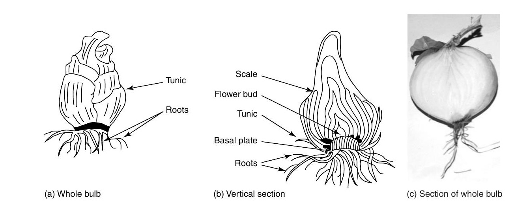
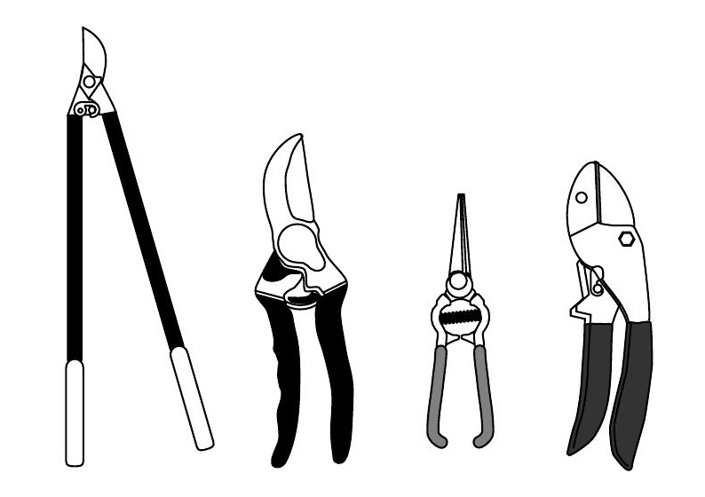
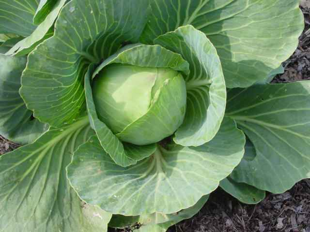
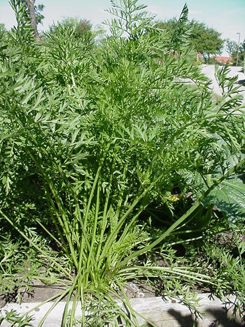

# Horticulture

## Classification

Classification mkes it easy to understand the nature, growth habit, morphology, culture and use of respective crops. Horticultural crops are classified on several basis, some of which are described below.

### Based on climage

1. Temperate: All the temperate fruit are deciduous and require a period of cold (chilling temperature). e.g. Grape, pear, plum, apricot, walnut, almond, peach, cherry, etc.

- Small fruits -- Raspberry, strawberry, grapes, mulberry
- Tree fruits -- Oak, apple, pear, quince
- Drupe or stone -- Peach, plum, apricot, mango, coconut, almond, jamun, cherry and plum
- Nut -- Walnut, chestnut
- Pome -- Apple, pear, quince

2. Tropical and sub-tropical: These fruits are deciduous or evergreen, usually able to withstand light and frost. e.g. Mango, litchi, papaya, pineapple, avocado, coconut, jackfruit, cashewnut, mangosteen, sapota, etc.

- Herbaceous -- Pineapple, banana, papaya
- Tree fruit -- Citrus, sweet orange, mandarin, lime, lemon, pummelo
- Nut -- Cashewnut, litchi, macademica nut
- Miscellaneous -- Fig, mango, paapya, avocado

### Based on uses

1. Vegetable

i. Ariel portion -- The edible portion is the ariel portion in these group of vegetables. e.g. cole crops, cauliflower, cabbage, chinese cabbage, broccoli, legumes, solanaceous fruits, cucurbits, salad crops, etc.

ii. Underground portion

- Root crops -- Radish, carrot, turnip
- Tuber crops -- Potato, sweet potato
- Bulb -- Onion, garlic
- Corm -- Colocassia

2. Fruits

- Temperate or deciduous
- Tropical and sub-tropical

### Based on lifespan

1. Annual: Mature seeds during same season in which the seedlings are started of the same year. e.g. Bean, watermelon, petunia, zinnia, coleus, etc.
2. Biannual: Plant that develops only vegetative phase in one season or year nand produces seed in the second year and remain dormant in winter. e.g. mustard, cabbage, onion, hollyhock, sweet william, etc.
3. Perennial: These plants live more than 2 years without producing seeds and even do not die immediately after producing seeds. e.g., fruit trees, asparagus, artichoke, dahlia, chrysanthemum, rose, begonia, etc.

### Based on method of culture

1. Lawn or turf grass: They are perennial and are used for turfing purpose. e.g. Bermuda grass, blue grass, etc.
2. Ground cover: They are either the herbaceous or woody plants used to cover the ground for landscaping purpose. e.g. Sedum, periwinkle, etc.
3. Vines and lianas: They are perennials. e.g. Grapes, rangoon creeper, pelican flower, etc.
4. Shrubs and trees: These shrubs and trees are grown for landscaping. e.g. Shrubs, poinsettia, myrtle and hibiscus, etc.
5. Trees: Rhodendron, gulmohar, pagoda tree, bottlebrush, etc.

### Based on use or purpose

1. Herbs, spices, condiments and drugs

These plants provide special flavors, scents and color to the food and also include the crops with curative, laxative and pesticide properties. e.g. vanilla, dill, nutmeg, quinine, spearmint and black pepper.

2. Beverage crop

These crops are used for brewing drinks and are non-alcoholic. e.g. coffee, tea, cocoa, etc.

3. Oil yielding crops

These crops are grown for their oil content. e.g. sunflower, castor, etc.

4. Plants yielding rubber, latex and gums

The product of the sap of these plants are obtained by tapping from the bark. e.g. rubber, sweet gum, papaya.

## Climatic factors affecting horticultural crop production

Climate is the average condition of weather of an area, comprised of attributes such as temperature, light, rain, humidity, hailstone and wind. It largely determines which plants can be grown in a region and where and when they should be planted. Hence the knowledge of climatology is essential for a person working with horticultural crops.

Climatic factors affecting horticultural crops are light, temperature, rainfall and humidity.

### Light

Light is electromagnetic radiation which is also a from of kinetic energy. Plants respond to a broader light wavelength 300-800 nm. Light particles are called photons are quanta. Light influences several aspects of plant development and physiology, most notably the photosynthesis. The photosynthesis increases with light intensity upto a certain limit provided other conditions are favorable.

- Ultraviolet wavelength of light (\SIrange{100}{400}{\nano\meter}) tends the plants to be dwarf.
- Based on duration of light response, the plants are classified as:
  - Long day plants: Requiring 8-10 hours of dark period. e.g. Bean, cowpea, radish, spinach, lettuce.
  - Short day plants: Requiring long night length (10-14 hours). e.g. Onion, sweet potato
  - Day neutral plants: Photoinsensitive plants. e.g. most perennial fruit trees.

- Besides growth, light also affects the quality of developing fruit and its attributes post-harvest.
- Although, beyond the control of the grower, it may be manipulated to some extent by altering the planting season or by cropping inside a green house facility; the latter can control intensity, quantity and the duration of light.

### Temperature and heat budget

Temperature affects important physiological functions like respiration, photosynthesis, transpiration, etc. The activity of enzymes is doubled with every \SI{10}{\celsius} rise in temperature upto \SIrange{20}{30}{\celsius}.

The maximum and minimum temperature to support crop growth lies between \SIrange{5}{36}{\celsius}. Temperature affects seed germination, flowering, pollination, fruit set, quality of production, seed production, seed dormancy, and disease and pest occurrence.

Some horticultural crops such as temperate fruit require chilling hours (250-1500) at temperature below \SI{7}{\celsius} for breaking bud dormancy and to promote flowering. So the fruits like apple, peach, pear, strawberry, apricot, etc cannot be grown in tropics. Vegetables, especially biennial crops like onion, carrot and cabbage require chilling temperatures (\SIrange{0}{7}{\celsius}) to produce flower and to produce seeds (vernalization). On the other hand, tropical fruits like mango, banana, jackfruit and pineapple require a long growing season and high temperature without any frost and snow.

Head budget (heat unit) is the total hours of temperature that is required for that maturity of a particular crop. Head budget is very much useful for the detection of right time for harvesting.

### Rain

Majority of living cell is made of water (60-95\%). Terrestrial animals contain 60-90\% water by weight of their body and aquatic organisms may contain upto 95\% water by weight. Blood plasma, a fluid system of living organisms, is composed 95\% of the water. Water has essential role to play in photosynthesis, in the step of photolysis. It serves as a solvent system of a cell and provided medium of transfer within the plant.

The amount of rainfall an area receives determines the kind of crops that could be grown with success. If rainfall is distributed evenly throughout the year, most fruit need not be irrigated, otherwise special arrangements should be made to prevent dessication as well as to promote growth. While also regulating atmospheric conditions such as humidity and temperature, the soil moisture conditioned by rain affects several physiological processes of a crop, including the plant-pest interactions.

### Humidity and moisture

The influence of humidity depends upon the type of the plants as well as on the availability of soil moisture. Xerophytic plants tolerate reduced soil moisture and relative humidity, whereas plants of tropical origin like banana, mango and jackfruit require high humidity. The primary effect of humidity is on the transpiration rate. Increased transpiration and too low relative humidity causes wilting and desiccation in plants. Water loss can be minimized by maintaining high relative humidity, around the nursery to establish the newly propagated plants. Dry weather and low humidity are suitable for seed maturity and harvestign in most of the crops. Most of the seeds store well under low humidity.

### Hailstone

When the air containing high humidity reaches the low temperature in the high atmospheric region, the water vapor turns into small, solid ball shaped pallets and falls to the earth as hail. It causes severe damage to crops, breaking branches of trees, killing small and tender crops and fruit saplings. Hail is dangerous especially to fruit crops, particularly if it occurs after the flowering.

### Wind

Wind helps in pollination and dispersal of seeds. Too high and too low velocity is harmful for fruit set. High winds can interfere with pollination and may cause premature dropping of flowers and fruits. High wind velocity enhances soil erosion. Severe winds are harmful at the time of flowering and fruit set. Planting one or more rows of wind breaks at right angle to the prevailing winds may reduce the wind velocity. Trees used for windbreaks are eucalyptus, sisoo, mulberry, gulmohar, etc. The effectiveness of windbreaks trees depend upon weight and thickness of trees.

## Important niche of different horticultural crops

```{r niche-crops}
tribble(
  ~"Crop", ~"District",
  "Citrus", "Dhankuta, sindhuli, ramechhap, dhading, okhaldhunga, gorkha (manakamana), lamjung (dhimire, chiti, syaut), tanahun, syangja, kaski, gulmi, dailekh",
  "Apple", "Solukhumbu, jumla, humla, rasuwa, dolpa, mugu, manang, mustang",
  "Mango", "Bara, parsa, sarlahi, mahottari, dhanusa, sunsari, bardia, kailali, saptari, chitwan, nawalparasi",
  "Pineapple", "Dhading, nuwakot, chitwan, jhapa, morang, udaypur",
  "Banana", "Kavre, dhanusha, chitwan, parsa, rautahat, jhapa, tanahun, gorkha, surkhet, dang",
  "Walnut", "Jumla, kalikot, mustang, manang, doti, humla, mugu, dolpa, rukkum, achham, bajura",
  "Pear", "Taplejung, panchthar, bhaktapur, lalitpur, kathmandu (pharping), makawanpur, nuwakot, rasuwa, tanahun",
  "Papaya", "Chitwan, bara, nawalparasi, dang, banke, bardia, kailali",
  "Grape", "Manang, mustang, kathmandu, lalitpur, bhaktpur",
  "Arecanut", "Jhapa, sunsari, morang",
  "Coconut", "Jhapa, sunsari, morang",
  "Radish", "Myagdi (Todke), pyuthan, rukkum",
  "Chilli/carrot", "Bhaktapur, lalitpur",
  "Ginger", "Salyan (malneta), gulmi, nawalparasi, syangja",
  "Coffee", "Gulmi, lamjung, arghakhanchi, tanahun, gorkha, palpa",
  "Brinjal, tomato, cauliflower, onion", "Sarlahi (lalbandi), dhanusha, dhanding, kavre",
  "Pointed gourd", "Sunsari, morang",
  "Yam", "Dhanusha"
) %>% 
  knitr::kable(booktabs = TRUE, caption = "Important niches of different horticultural crops", longtable = TRUE) %>% 
  kableExtra::kable_styling(latex_options = "striped", font_size = 8) %>% 
  kableExtra::column_spec(column = 1:2, width = c("8em", "20em"))
```


## Plant growth hormones

Plant growth regulators (PGRs) are organic substances other than nutrients, which in minute quantity can modify (enhance or inhibit) physiological processes in plants.

Phytohormones are organic substances which are produced naturally in plants, synthesized in one part and usually translocated to other part where in very small quanity affect the growth and other physiological functions of the plants.

```{r natural-synthetic-phytohormones}
tribble(
  ~"group", ~"function", ~"naturally_found", ~"synthetic", 
  "Auxin", "Promoter", "IAA, IBA", "IBA, 2, 4-D, 2, 4, 5-T, PCPA, NAA", 
  "Gibberellins", "Promoter", "Various forms", "Gibberellic acid (GA)", 
  "Cytokinin", "Promoter", "Zeatin", "Kinetin, BA, Methyl adenine", 
  "Ethylene", "Retardant", "Ethylene", "Ethrel, Ethephon (ethylene releasing products)", 
  "ABA", "Retardant", "ABA", NA
) %>% 
  knitr::kable(booktabs = TRUE, caption = "Natural and synthetic phytohormones of various groups used as growth promoters and retardants", 
               col.names = str_to_sentence(str_replace_all(colnames(.), "_", " "))) %>% 
  kableExtra::kable_styling(latex_options = "striped")
```

In addition to the five group of phytohormones mentioned in \ref{tab:natural-synthetic-phytohormones}, there are some more groups of PGRs. THere are synthetic compounds and when applied exogenously, regulate, physiological processes. These are; growth retardant, morphactins, antiauxins, auxin antagonist, auxin synergists etc.

### Auxin

Auxin is a generic term used for the compounds, which are characterized by their capacity to induce cell elongation. Usually, chemical structure of auxin contains an indole ring.

- Experimental evidence of the presence of auxin was first given by Went (1926-28). He performed the Avena coleoptile test and showed that a substance was produced in the tip of coleoptile which could be extracted by using tiny agar block and which could cause curvature of coleoptile to which it was applied.

Auxin is synthesized in shoot-tip region particularly in young expanding leaves of the apical region, developing embryo adn developing fruits. Amino acid tryptophan is known as precursor of IAA. The chemical name of IAA is Indole-3-acetic acid (first discovered auxin). Auxin has polar movement i.e., apex to basal region (basipetal).

Physiological role or functions

1. Apical dominance: Auxin inhibits laterl bud formation. When apical bud is removed lateral buds begin to sprout. Such phenomenon is known as 'apical dominance'.
2. Shoot and root growth: Auxin increases the growth of shoot (linear and radial) as well as root. In tissue culture, proportion of auxin and cytokinin plays the key role for the proliferation of root and shoot.
3. Cell division and cell enlargement: Auxin stimulates cell division, cell enlargement, adn cell elongation in the apical region. The elongation of cell is due to increasing osmotic pressure and permeability of cytoplasm of water.
4. Abscission: The formation of abscission causing enzymes i.e., cellulase and pectinase in some plant is prevented by the application of auxin.
5. Xylem differentiation: Callus which is undifferentiated mass of parenchymatous cell when treated with auxin, xylem is dedifferentiated into callus tissue.
6. Plant growth movement: The cellular growth is responsible for any type of growth movement in plants. Level of auxin determines the plant movement. e.g., phototrophism and geotrophism.
7. Nucleic acid activities: IAA increases the NA and the synthesis of specific enzymes.

Application of auxin

1. Root induction: IBA is useful in inducing rooting in cutting, layering and micro-propagation.
2. Weed control: Higher concentrations of 2,4-D; 2,4,5-T; MCPA etc are effective in controlling weed.
3. Fruit development (Fruit set and control of drop): In the abscence of pollination the ovary abscises and falls. Pollination supplies the necessary stimulus for the development of fruits -- auxin. So development of fruit is controlled by a number of hormones among which auxin plays a key role.
4. Flowering: Auxin caused flowering in some plants like pineapple but the action is not direct. It is mediated through formation of ethylene. e.g., NAA 5-10 PPM helps the flowering.
5. Sex expression: Application of auxin in cucurbits increases the number of female flowers and hastens the arrival of female flowers so that these are shifted down to lower nodes.
6. Parthenocarpy: The development of parthenocarpic fruit with the application of pollen extract to cucumber flowers have been demonstrated. The analysis of the extract showed the presence of auxin. It accelerates the cell enlargement and thus swelling of the ovary leading to development. Application of auxin stimulated the parthenocarpic fruit development. e.g., 20 PPM NAA and 10 PPM 2, 4-D control fruit drop is Nagpur Santra.


### Gibberelic acid

### Abscissic acid

Physiological effects of ABA

1. Induction of dormancy of plant organs
2. Water balance of plants through stomata regulation. ABA concentraion increases in water stressed leaves during the lag period prior to stomata closure. ABA is produced in chloroplast and remains there in unstressed leaves. When the plant is water stressed, the permeability of the chloroplast membrane to ABA increases and allows movement of the hormones to the epidermal cell including the guard cells. ABA then signals the guard cells to promote stomatal closing.
3. Bud dormancy is frequently correlated with increase in ABA concentration. In woody temperate species, bud dormancy is controlled by the ratio of ABA and GA. Inhibition of seed germination by ABA may be reversed by GA application.
4. Seed development and germination: ABA builds in embryo of developing seeds. It has been observed that ABA in developing ovules inhibits the formation of germination enzymes.
5. Abscission of fruits and flowers
6. Leaf senescence: ABA promotes leaf senescence independently of ethylene
7. Root growth promotion

- Additionally, ABA plays roles as antagonist of other phytohormones.
- Stratification causes reduction in ABA content and so promotes germination (eg. walnut)
- ABA induces formation of storage proteins in seed.
- During vernalization, however, ABA content falls.
- ABA regulates water balance (causes stomatal closure and increase in root growth and hydraulic conductivity rise in water deficit).

### Cytokinin

### Ethylene

## Physiological disorders

```{r physiological-disorders}
read_csv("./data/physiological_disorders.csv", skip = 1) %>% 
  rename_all(function(x)str_to_sentence(str_replace_all(x, "_", " "))) %>% 
  knitr::kable(booktabs = TRUE, longtable = TRUE, escape = FALSE) %>% 
  kableExtra::kable_styling(latex_options = "striped", font_size = 8) %>% 
  kableExtra::column_spec(column = 3:5, width = c("6em", "12em", "12em"))
```


```{r physiological-disorders-calcium}
read_csv("./data/calcium_related_disorders_fruit_vegetables.csv", col_names = FALSE) %>% 
  knitr::kable(booktabs = TRUE, caption = "Physiological disorders related to calcium in fruit and vegetable crops", col.names = c("Crop", "disorder"), longtable = TRUE) %>% 
  kableExtra::kable_styling(font_size = 8) %>% 
  kableExtra::column_spec(column = 2, width = "22em")
```


### Chilling injury

Sequence of events leading to chilling injury

1. Primary events: Physical changes in membrane lipids, dissociation of enzymes/proteins.
2. Secondary events: Impaired metabolic processes (respiration, protein synthesis, etc.), imparied ion movements through membranes, impaired protoplasmic streaming.
3. Chilling injury: Membrane breakdown, necrosis, visible symptoms of injury

- Highly chilling-sensitive plants such as bananas and pineapples, have relatively high critical temperature of around \SI{12}{\celsius} or higher. It has even been suggested that for some pineapple cultivars the critical temperature may be greater than \SI{20}{\celsius}.
- Chilling insensitive plants such as apples and pears have much lower critical temperatures of around \SI{0}{\celsius} or below. 
- Storage below about \SI{-1}{\celsius} is not possible for fresh produce because of freezing damage.

## Plant propagation methods

Special vegetative parts

- Bulbs: Onion, garlic

```{r onion-bulb, fig.cap="Onion and sections of its bulb", out.width="60%"}

```

- Runner: Strawberry, sweet potato
- Rhizome: Ginger, turmeric, ground apple
- Sucker: Banana
- Slip: Pineapple
- Crown: Pineapple

### Cutting

**Root**

- 3-5 cm in length of root portion
- Pencil size diameter
- Popularly practiced in citrus and guava

**Stem**

- 10-30 cm in length stem
- 1-2.5 cm in diameter
- Popularly practiced in grape and pomegranate

**Leaf cutting**

- Propagation of plants having thick and wide leaves
- Example crop: Bryophyllum, cactus

**Leaf bud cutting**

- Leaf buds are used for propagation
- Example crop propagated by leaf bud cutting: Lemon, rhododendron

### 3-G cutting

This is a well established in commercial gardern of vines and climber crops, such as cucumber, bottlegourd, bittergourd, pumpkin, sponge gourd, etc; tomato and chilly. This system of pruning promotes female flower and larger fruit size development.

**Vines and climbers**

- In pumpkin, trim off any branches arising at positions below lower 5-7 leaves, or for crops which require stakes remove any branches below the height of 1 m above ground. This procedure is called 1G.
- After 30-35 days of planting cucurbits/vines, trim 2 cm segment off the top with the help of a razor or scissors. (2G)
- Allow new shoots to grow from the upper portion of the cut tips, and as the newly arising branches reach 30-35 cm in length, follow the practice of trimming off of apical 2cm portion, again. (3G)

It is claimed that with 3G cutting practice, fruit size and overall production of the crop can be increased 2-3 times the original.

**Tomato**

- Cutting is practiced once the crop starts flowering with the help of a sharp razor.
- Lower and senescent leaves should are removed.
- While maintaining branches with flowering buds only, remove all lower branches.
- Discard branches offshooting from the same node with flowering branch. With this practice, the nutrient mobilization to the fruiting branch could be improved by checking unncessary vegetative growth.

## Planning and layout of orchard

Orcharding is a long term investment and needs lot of planning and expertise. While planning and planting a new orchard, one should give utmost attention and care to various aspects like selection of location and site, nature of soil and subsoil, planting of suitable kinds and varieties of fruits, proper planting distance and purchasing of fruit plants from reliable nurseries. Besides wastage of time and energy, mistakes committed initially on any aspect reduce the returns greatly from investment. Thus one should give utmost attention and care, while planning a new orchard.

### Preparation of land {-}

The land should be cleaned properly for free movement of man and machinery. All the trees, bushes and creepers should be removed. The stubble should be uprooted to avoid regeneration of growth and obstruction for movement of machines. The soil of the area destined for growing fruit plants needs thorough preparation. A virgin land requires a deep ploughing and harrowing. The land should be repeatedly ploughed and bring the soil to a fine tilth and pulverise the weeds or other undesirable herbs under the soil. The land should be thoroughly harrowed and levelled. While preparing the land, the subsoil which is usually less fertile than the surface soil, should not be disturbed as far as possible. If possible, green manuring crop like daincha, sunhemp, cowpea etc, may be raised and ploughed down during land preparation to enrich the orchard soil and improve its physical condition. In the hills, terraces should be made along the contours.

### Layout plan {-}

Layout: The marking of position of the plant in the field is referred as to layout.

The layout plan of the orchard should be prepared carefully, preferably in consulation with horticultural experts. The orchard layout plan includes the system of planting, provision for orchard paths, roads, water channels and farm building. A sketch of the proposed orchard should be prepared on a paper before the actual planting is taken in hand.

### Systems of planting {-}

The following are the important systems of planting generallly followed on the basis of agro-climatic conditions.

1. **Square system**

It is the most commonly used method and easy to layout in the field. In this system, plant to plant and row to row distance is the same. The plants are at the right angle to each other, every unit of four plants forming a square. This system facilitates the interculture in two directions after the orchard is planted.

2. **Hexagonal system**

In hexagonal system, the trees are planted in the corners of equilateral triangles. Six trees thus form a hexagon with another tree at its centre. This system, though a little difficult for execution but accommodates 15% more plants. Cultivation of land between the tree rows is possible in three directions with this system. This system is generally followed where the land is costly and very fertile with ample provision of irrigation water.

3. **Rectangular system**

In this system, the plot is divided into rectangles instead of squares and trees are planted at the four corners of the rectangle in straight rows running at right angles. Like square system, this system also facilitiates the intereulture in two directions. The only difference is that in this system more plants can be accommodated in the row keeping more space between the rows.

4. **Triangular or Alternate system**

In this sytem, trees are planted as in the square system but the plants in the 2nd, 4th, 6th, and such other alternate rows are planted midway between the 1st, 3rd, 5th, and such other alternate rows. This system provides more open space for the trees and for intercrops. However, it becomes difficult to carry out intercultural operations.

5. **Quincunx or diagonal system**

This system is exactly like the square system but one additional tree is planted in the centre of each square. The number of plants per acre by this system is almost doubled than the square system. Fruit trees like peach, plum, papaya, kinnow, phalsa and guava can be planted as fillers in the permanent orchard of mango, litchi and pear. The planting of filler trees provides an additional income to the grower in the early life of the orchard. The filler trees are uprooted when the main orchard trees start commercial fruiting.

6. **Contour system**

This system is usually followed in the hilly areas with high slepes but it is very much similar to the square/reetangular system. Under such circumstances, the trees may be well planted in lines following the contour of the soil with only a slight slope. Irrigation and cultivation are then practised only across the slope of the land as this practice reduces the chances of soil erosion. In this system layout is done as in square/rectangular system, first by establishing the base line at the lowest level and then marking for the trees should be done from the base to the top. Bench terraces are used where the slope is greater than 10 per cent.

7. **Hedgerow system **

In this system, the distance between the trees in a row is half to one third the distance between rows. This system of planting is followed in Italy where dwarf apple trees are planted in double offset rows due to higher intensity of light.

**Adjacent planting**
\newline In this system, two plants are placed closely keeping a double space the rows and the next set of plants. This system is followed in the arid zone where moisture supply is limited as well as in the less fertile soils where both moisture and nutrients are not easily available to the plants. This system provides large areas between rows for intercropping.

### Method of layout {-}

For laying out an orchard, according to square system, a base line is first established and the position of the trees is marked along this line putting wooden stakes in the ground. Another base line at right to the first base line, is then marked along with the other edge of the field with the help of a carpenter square or a cross staff.

The right angle can also be drawn with the help of measuring tape. One end of this tape is fixed at 3 m distance from the corner along the first line and the tape is then stretched along the second base line for a distance of 4 m. The diagonal distance between these two points should be 5 m. The wooden stakes are put in the ground at the desired distance along the second line. All the four rows are thus established and staked. Three men, one putting the pegs in the field and other correcting alignment while moving along the base line, can easily stake the whole field.

For laying out of an orchard according to the triangular system, a base line is set on one side of the field as in the square system. A large triangle with a ring in each corner is used. The sides of this triangle are equal to. the distance to be kept of the plants in the orchard. Two of these rings are placed on the stakes of the base line. The position of the third ring indicates the position of the plant in the second row This row is then used as a base line. The whole area is laid out in a similar manner.

### Digging and filling of pits {-}

Marking of pits and planting should always be done with the help of planting board, The guide pegs are installed at both the ends. One metre deep pits of one metre diameter should be dug. Top 30 cm soil should be kept on one side which is used for refilling, the pits as it is considered the fertile soil. Bottom 70 cm soil should be kept on other side which is discarded. The pits should be left exposed for a few days before actual planting. These pits should be refilled with a mixture of top soil, 2-3 baskets of silt and 2-3 baskets of well rotten farmyard mixture. The refilled pits should be watered a few days before planting the tree. To each pit, add 30 g of Lindane 5% dust or 5 ml of Chlorpyriphos 20 EC mixed in about 2 kg soil against white ants.

### Method of planting {-}

Bore holes of suitable size in the centre of the filled pits with the help of planting board. Place the earth ball of a plant in it in such a way that the upper surface has the same level as the ground. Fill loose earth around the bull and press it firmly with the handle of a spade or khurpa. Apply irrigation soon after setting the plants in the pits.

### Planting distance of fruit plants {-}

The spacing given to the fruit trees is generally governed by the different factors like climate and soil, choice of varieties, growth habit of tree, rootstock used, nature of irrigation and pruning technique followed. The spacing may vary according to different systems of planting. Provision of optimum spacing to fruit trees is one of the most important aspect of successful fruit Culture. The fruit plants grow poorly in close spacing, thus, produce small quantity of fruits of inferior quality and suffer heavily from insects-pests and diseases. In case of widerly spaced plantation, there is wastage of valuable orchard land without having any direct benefit on ultimate yield of the orchard. Therefore, optimum spacing is required so that the fruit trees may grow and bear crop properly. Optimum spacing regulates the proper utilization of sunlight, avoids competition in the uptake of nutrients caused by the collision of root systems, and facilitates proper irrigation. The latest technology on high density plantation system where trees are planted at critical spacings for maximum utilization of space is becoming popular.

Although, It is difficult to suggest exact spacing for fruit trees which will suit every locality or soil, given below in Table \@ref(tab:tree-spacing) is the spacing of some important fruit plants which serve the basic guideline for establishing a new orchard.

```{r tree-spacing}
knitr::kable(readxl::read_xlsx("./data/fruit_cultivation.xlsx", sheet = "orchard_spacing", skip = 1),
             escape = FALSE, booktabs = TRUE, longtable = TRUE,
             caption = "General spacing of fruit trees in layout of orchard") %>%
  kableExtra::kable_styling(latex_options = c("striped")) %>%
  kableExtra::column_spec(1:3, width = "4cm") %>%
  kableExtra::add_indent(c(4,5,6,15,16))
```

### Planting season {-}

The planting season of different fruit crops vary on the basis of their evergreen or deciduous nature.

**Evergreen fruit plants**: There are two planting times for evergreen fruits viz. February-March (spring) and August-September (rainy season). The fruit plants such as citrus, mango and litchi should preferably be planted during september or in the beginning of october when the weather becomes mild and favorable and there is enough moisture in the soil. Kinnoe and ber plants can be transplanted bare rooted during December to february. Guava can also be planted bare-rooted during February-March or August-September. The plants should be defoliated and the roots covered with moist material.

Most of the sub-tropical and tropical evergreen fruit plants are suitably transplanted during the rainy season when the atmospheric humidity is high and sufficient supply of soil moisture is obtained. During this active period of growth, the plants easily penetrate their roots in the soil and get established. High atmospheric humidity during the rainy season helps them to minimize the transpiration loss.

The evergreen plants can also be transplanted during the onset of spring with equal success provided an ample quantity of irrigation water is available. Early regeneration of rootlets due to high temperature and available moisture during this period helps in early establishment of the plants in most of the cases.

**Deciduous fruit plants**: The deciduous fruit plants are planted during the winter when they are dormant. Their planting must be completed before the start of new growth i.e, upto middle January in case of peach and plum and upto middle of February in case of pear and grapes. The bare rooted ber can also be planted during January and up to middle of February.

It would be wise, if the planting operation in deciduous fruit plants could be done well before the dormancy is broken and the plants start their growth afresh during the subsequent period.

Planting should be avoided during hot and dry spells of weather. The fruit trees should preferably be planted in the afternoon and on cloudy and humid days rather than in bright sunshine and dry weather.

### Purchasing fruit plants from nursery {-}

The fruit trees, unlike annual crops, are expected to remain in the field for many years. The choice of kind of fruit shall, however, depend largely on the location of orchard. The varieties, of course, must be selected depending upon the consumer's preference. Since the poor selection of trees may often lead to headaches and bankrupcy. The following points need to be kept in view while purchasing fruit plants.

1. **Health of plant**

- The fruit plants should be healthy, vigorous and free from diseases and insect-pests.
- True-to-type 0f piants on suitable rootstocks should be purchased.
- They must have been propagated from progeny trees of proven merit in regard to yield and quality.

2. **Age of plants**

- The age of the plant is usuaily reckoned from the age of scion but it does not imply that these should have been buddeed on old stock.
- One or two year old fruit plants are ideal for planting.
- Older plants should not be purchased as they do not establish easily, particu1arly the evergreen fruit plants where the shock of transplanting is greater as compared to the young plants. The prolonged stay in the nursery beds or pots reduces their vigour. The roots become pot bound, especially in the older plants and thus they have a poor transplanting success.

3. **Size of plants**

- The trunk size of one or two years old citrus plants should be 1-5 to 2.5 cm in diameter.

- The budded or grafted plants with weak stock scion union should also be rejected.

4. **Source of supply**

- Never purchase the fruit plants from private nurseries and footpath sellers as they prove to be a very expensive investment in the long run because these plants are generally from poor strains. The growers come to know about the yield and quality of the fruit several years when the plants start bearing.

- The fruit growers should always purchase plants from a nursery of known reputation and honesty, preferably the nurseries of the agricultural university, department of horticulture and government approved nurseries.

- The plants should be reserved well in advance of the actual planting.

- Always purchase 10-20 percent more plants than the actual requirement. These plants should be kept in nursery to fill up gaps which may develop subsequently due to the death of plants.

- The plants should preferably be purchased from nearest nursery as it greatly facilitates their transport, avoids delay in transit and reduces the transport charges.

### Handling and Transportation of Nursery Plants {-}

Plants should be carefully handled during transportation to avoid breakage of earth balls as the plants with broken earth balls are likely to dry up. Before loading the plants (with earth butt) in the vehicle a layer of cushioning material such as paral (rice straw), dried grass or sand should be spread at the bottom. Then place the plants carefully in the vehicle. During long transportation sprinkle water on the foliage to keep these turgid.

Bare rooted plants may be packed in small bundles. The root portion of these bundles should be given mud coating and then wrapped with moist material such as wet gunny bags, paral or polythene sheet to avoid dehydration of feeder roots during transit.

### Care of plants on arrival {-}

The plants should be given utmost care when received. The shock of digging from the nursery is rather severe and they must not be further exposed to the hot sun or the wind. The packing of the plants should be opened or loosened as soon as they are received, otherwise they may be injured due to heating within these packages. The plants should be placed in shade and sprinkled with water until they are planted in the field.

### After Care of Young Plants {-}

The newly planted young fruit plants, being very tender need lot of care and attention for their better survival and growth. The plants should be watered at frequent intervals. However, heavy irrigation should be avoided as stagnation of water in their basins may do more harm than good.

The yound plants need staking so as to make them grow upright and straight. The support should be strong, preferably of bamboo or other wooden logs and should be well fixed in the soil.

Keep examining the young plants and remove all the growth which has taken place below the bud-union. The tying materials still tied at the graft union may also be removed carefully.

Training of the young plants should be given utmost altention for developing proper framework and shape. Remove dead and diseased portions by careful pruning.

The young plants should always be protected against diseases and insects by proper and timely sprays of suitable fungicides/inseclicides. The white ant attack if noted, should be checked by applying chlorpyriphos @ half liter per acre followed by light irrigation.

Nitrogenous fertilizers which are required for growth, should always be given in small split doses to young fruit trees.

Provide adequate protection against vagaries of summer and winter season.

### Hedges/Windbreaks for protection {-}

A good windbreak should be provided on the windward side of orchard well before the orchard is established. Eucalyptus, Jamun, Seedling mango, Mulberry etc. and good windbreak plants. In the spaces between windbreah trees: a hedge may also be planted. _Inga dulcis_ (Jungli julebi), _Lawsonia alba_ (Mehndi), Bouganvillea, Jatti khatti, galgal, karonda, etc. are a few good hedges. Never plant a hedge of citrus species around the citrus orchard.

## Crop propagation

```{r difference-stem-cutting}
tribble(
  ~"Feature", ~"Hardwood cutting", ~"Semi-hardwood cutting", ~"Softwood cutting", ~"Herbaceous cutting",
  "Nature of wood", "One year old and mature shoot must have passed one growing season", "4-9 montsh old (partially matured semi-hard shoot) is selected", "Shoot of 2-3 month age, very tender", "They are non-woody and are 1-2 months old",
  "Stage of cutting", "Dormant (winter) season", "Summer season i.e. beyond dormancy", "Summer, as sprouting occurs", "Summer, spring or anytime of the year", 
  "Shoot or stem part", "Healthy and possess at least 2-3 buds or is 10-45 cm long", "Generally terminal branch, vigorously growing under full sunlight 7-20 cm long", "Always terminal shoot, vigorously growing under full sunlight", "Terminal position of stem cutting should be prepared just before they are prepared in rooting media.",
  "Leaf", "Leafless", "Leaf from basal position is removed", "Shoot with intact leaves", "Leaf from basal position is removed",
  "Example", "Grape, fig, apple, mulberry, plum, roses, peach, pear, pomegranate, poinsettia", "Camelia, lemon, roses, poinsettia, croton, bougainvillea", "Guava, marigold, peach, ornamental trees, poinsettia", "Chrysanthemum, dahlia, geranium, sweet potato, carnation"
) %>%
  knitr::kable(booktabs = TRUE, caption = "Difference between different types of stem cutting", longtable = TRUE) %>% 
  kableExtra::kable_styling(latex_options = "striped", font_size = 8) %>% 
  kableExtra::column_spec(column = 1:5, width = c("5em", rep("8em", 4)))
```


## Training and pruning

Plants have different growth habits and produce different adult forms. Uncontrolled, plants produce vegetative growth in response to the environmental provisions for growth. Branches form profusely and grow upward in search of light. Strong winds may twist limbs of plants and sometimes even break them off of the stem. 
<!-- The general appearance of plants under such conditions is neither appealing nor productive.  -->
Management of plant growth entails removing excessive and undesirable growth and structures by cutting, a procedure called **pruning**.

Pruning is an art and a science. Manipulating the growth of plants in this way requires an understanding of plant botany and physiology. It is important to know plant structure and growth habits, as well as how plants respond to their environment and to removal of vegetative growth. Pruning is a standard cultural practice in orchards and vineyards, as well as in landscape management. The principles of pruning are generally the same in all situations. However, the specific methods or techniques are varied, depending on the species and the goal of pruning; that is, apples, citrus, grapes, and roses are pruned in different ways.

Pruning is sometimes done in conjunction with another horticultural procedure called training. **Training** is a practice in which tree growth is directed into a desired shape and form. It involves cutting, repositioning, and guiding the course of development of branches and limbs of plants according to a specific objective. During training, limbs may be bent and tied to support structures or even removed altogether, resulting in creative and attractive shapes. 
<!-- In the landscape, aesthetics appears to be more important than productivity, whereas the reverse is true in orchard management. -->

Historically, fruit tree form and structure have been maintained by pruning. Tree training is a more recent technique. It is much more efficient and desirable way to develop form and structure. Training young fruit trees is ideal for proper tree development. It is better to direct tree growth with training than to correct it with pruning. Pruning is most often done during the winter, commonly referred to as dormant pruning. Training includes summer training and summer pruning as well as dormant pruning.

### Training {-}

Although the goal of tree training is to direct tree growth and minimize pruning, specific goals of training a fruit bearing tree include the following:

1. To develop strong branches to bear the weight of fruits.
2. To properly space and retain an appropriate number of branches for enhanced productivity.
3. To control the time of first fruiting. While fruiting should not be delayed, the quality of fruits and the duration of fruiting period are increased when trees. are not allowed to fruit in the early years (three to five years). The heavy weight of fruits may injure young plant limbs and jeopardize productivity in later years.
4. To facilitate production operations such as harvesting, pruning, and spraying.
5. To produce attractive tree shapes, which is particularly important if fruit trees occur in the landscape.
6. To provide physical support for weak stems. In dwarf and semidwarf fruit trees, some kind of support system is needed to aid the tree in bearing the weight of heavy fruits. The limbs may be propped with a notched-end piece of wood.
7. To confine the tree to the space available.

**Forms of training**

1. Central leader system

- Characterized by one main, upright trunk, referred to as the leader. 
- Practiced in apple, cherry, pear, plum, etc.

2. Modified central leader system

3. Open center/vase system

- It is conducted in Baisakh/Jestha during the period when flushing appears.
- While removing apical 30-60 cm portion, only 3-4 outward orienting new shoots are maintained.
- Example: Peach, plum

**Training systems for fruit trees**

Trellis training system: Trellis training involves tying limbs of plants to wires strung between posts or constructed against a wall or fence. Common trellis systems are (Shown in Figure \@ref(fig:training-systems) and \@ref(fig:training-systems2)):

  - Espalier
  - Horizontal espalier
  - Palmette
  - Cordon

```{r training-systems, fig.cap = "Training systems of fruit crops", fig.subcap=c("Cordon system", "Horizontal espalier system", "Kniffen system", "Candelabra palmette system"), fig.ncol = 2, out.width="45%"}
# pdftools::pdf_convert("E:/DD/Teaching_s/Horticulture Texts/Horticulture - Principles and Practices 4th ed. (intro txt) - G. Acquaah (Pearson, 2009) WW.pdf", format = "jpeg", pages = c(624, 625), dpi = 300)

knitr::include_graphics(c("./images/fruits/cordon.jpg",
                        "./images/fruits/kniffen.jpg"))
knitr::include_graphics(c("./images/fruits/horizontal_espalier.jpg", 
                          "./images/fruits/candelabra_palmette.jpg"))

```


**Training in vine crops**

- Pole system: Vines trained to single pole; height of pole: 2.5 m; width between poles: 2 m.
- Telephone system: Under this system, iron or bamboo poles are connected to each other using rope/wires in a horizontal fashion; height of pole: 2.5 m; width between poles: 8 m.
- Kniffin system: This is most widely used system. Iron or bamboo poles connected to each other using rope/wires in a "V" shaped fashion are used as stakes for support.
- Flat system: Although initial investment is high, this support system is durable. Poles of height 6ft are spaced at 50 cm distance and roof made of fencing wires or wooden branches are laid over the resulting structure. The roof will function to support growth of vines and creepers.

### Pruning {-}

Uncontrolled, plants produce vegetative growth in response to the environmental provisions for growth. Branches form profusely and grow upward in search of light. Strong winds may twist limbs of plants and sometimes even break them off of the stem. The general appearance of plants under such conditions is not always appealing to humans. 

Management of plant growth entails removing excessive and undesirable growth and structures by cutting, a procedure called pruning. The attractiveness of plants after pruning depends on the gardener’s creativity and understanding of plant form and texture. Pruning is a standard cultural practice in orchards and vineyards, as well as in landscape management.

**Uses**

- Removal of old, impaired and broken branches
- Removal of branches lying inwards, which accumulate shade
- Removal of narrow angle branches
- Removal of water sprouts

**Types of pruning**

1. Heading back: "Heading back" refers to pruning off the terminal, or "head," growth of a tree or shrub branch down to just above a lateral bud. Trimming off of 3-4 cm segment of the tip of every branches. This form of pruning promotes later shoot growth thereby giving the plant a bushy appearance once foliage return.

2. Thinning out: Removal of an entire shoot. In order to allow freer flow of air and incidence of sunlight, the a tree/shrub will dense branches will be pruned to contain fewer number of branches.

3. Pinching and disbudding: This is a common practice in flowers. In young shoots, 1-2 inches of apical part consisting of terminal bud is removed to promote lateral bud growth (pinching). It is a common practice in basil plant.

Disbudding is removal of lateral buds that arise in excess numbers. This form of pruning promotes vigorous terminal bud or flower growth. It is a common practice in chrysanthemum plant.

4. Bench Cut: Removal of vigorous, upright shoots back to outward growing side branches.

For pome fruit (apple, pear, etc.) and pecans, the fruit are borne primarily on the terminal buds of shoots and spurs (short branches). If many heading cuts are used on these trees the fruit is being removed. However, in most stone fruit the fruit are borne on lateral buds on one-year-old wood and heading cuts are used to stiffen the branches to bear the fruit load as well as to thin the crop to a management level for the coming season.

Broadleaf evergreen fruit trees are pruned only lightly, especially once established. Species such as citrus and avocado are rarely pruned.

Small fruit trees may be trained and pruned to be standard sizes, thereby bearing fruits at a higher level for easy picking. Small fruit trees require some pruning to bear quality, large fruits and have high yield.

General rule of pruning

1. Pruning of deciduous fruits is best done during dormant season or fall (winter season during poush/magh).
2. Evergreen fruits should be pruned only after harvest of the fruits or before initiation of flowering.

Although the manner of pruning varies, the general objectives remain similar. The four general purposes of pruning are:

1. Plant sanitation: Pruning may be undertaken to remove plant parts that create an unsanitary condition, potentially to stop spread of disease/infection.
2. Aesthetics: In ornamental horticulture, the visual appeal of plants is important, especially if plants are in the landscape. Pruning is employed for shaping the form of the plant.
3. Reproduction: Pruning may be undertaken to enhance the reproductive capacity of the plant in several ways.
4. Physiology: Pruning may be employed to manipulate plant physiology in a variety of ways to enhance the performance of a plant.

<!-- A detailed description of each of the above purpose is stated in Table \@ref(tab:pruning-purposes). -->

```{r pruning-purposes, results="asis", eval=FALSE}
prun_object <- readxl::read_xlsx("./data/fruit_cultivation.xlsx", sheet = "prun_object", 
                  col_names = TRUE, skip = 1)

prun_object %>%
  knitr::kable(caption = "Purposes of pruning", 
               format = "latex", booktabs = TRUE, escape = FALSE, longtable = TRUE) %>% 
  kableExtra::kable_styling(latex_options = c("striped", "repeat_header"), full_width = FALSE, 
                            position = "center", font_size = 11) %>% 
  kableExtra::row_spec(row = 0, bold = TRUE, hline_after = TRUE) %>% 
  kableExtra::column_spec(1:4, "5cm") %>% 
  kableExtra::landscape()
```


### Difference between training and pruning

```{r training-pruning}
tribble(
  ~"Training", ~"Pruning",
  "It is done in the initial stage of growth of plant", "Pruning is done in the later stage i.e. at bearing stage",
  "It is done to develop a strong framework or shape or size", "Pruning is done to improve the function of a plant",
  "Training is more art to get a fine and strong shape; it requires more practice for perfection", "Pruning is more science because here we should know the physiology of plant"
) %>% 
  knitr::kable(caption = "Difference between training and pruning", booktabs = TRUE, longtable = TRUE) %>% 
  kableExtra::kable_styling(latex_options = "striped", font_size = 8) %>% 
  kableExtra::column_spec(column = 1:2, width = c("16em", "16em"))
```


### General guidelines for training and pruning {-}

1. Evaluate the whole plant
2. Think before you cut
3. Apical dominance is broken when a stem is cut
4. Pruning invigorates regrowth
5. Pruning can be used to direct growth
6. Timing is critical
7. Pruning can be used to create special effects
8. Use sharp tools and make clean cuts
9. Prune the parts that must be pruned first.

### Tools and equipments for pruning {-}

Most pruning tools are handheld and operated manually. Cuts are made by either sawing or scissor action of cutting tools.

1. **Shears**

- Hand pruners\newline Held in one hand and uses the cutting action design.
- Loopers\newline Designed to cut larger branches (upto 2 inches or 5.2 cm in diameter) by two-handed action. (Figure \@ref(fig:looper-shear))
- Hedge shears\newline Designed for trimming and shaping hedges and ground covers. Electric models are available.

```{r looper-shear, fig.cap="Different types of pruning shears (looper (left), hand pruners and hedge shears)"}
# pdftools::pdf_convert("E:/DD/Teaching_s/Horticulture Texts/Horticulture - Principles and Practices 4th ed. (intro txt) - G. Acquaah (Pearson, 2009) WW.pdf", format = "jpeg", pages = c(595), dpi = 300, filenames = "looping-shear.jpeg")


```

2. **Saws**

A saw may be designed to cut only on the forward stroke and thus make it easier to maneuver when cutting limbs located high on a tree. A saw may also be fine toothed for smooth, close cuts and is especially appropriate for cutting deadwood. Coarse-toothed saws are easier to use on greenwood. Common horticultural saws can be placed into four general categories: manual saws, power saws, pole saws, and pole pruners.

3. **Pruning knife and rasp**

The pruning knife is very sharp and is used when minor pruning involving a few small branches is needed. The knife may also be used to clean and smooth large cut surfaces. A rasp is like a file and is used for shaping or smoothing tree wounds.

4. **Ladders**

Ladders are for extending the reach of an operator during pruning. They should be used with care. They must be set up properly to ensure good stability. Leaning while standing on a ladder should be avoided. Of the different types of ladders available, those most recommended include the following: 

1. Orchard ladder 
2. Extension ladder

## Fruit crop planting method

1. First prepare a standard size pit of dimension \SI{3}{\feet} x \SI{3}{\feet} x \SI{3}{\feet}.
2. Fill it with soil and FYM at 2:1 or 1:1 ratio.
3. Irrigate it so that it replaces air, soil particles cohese each other, and the resulting depression after irrigation should be refilled.
4. While planting saplings on the pit, use planting board (2.5 m long) to locate the pit centre and plant them at the centre.
5. While planting saplings, keep graft union above the soil surface.
6. Irrigate immediately after planting in order to,
  - Replace air otherwise roots may dry
  - For better contact of roots with soil particles
7. Staking is required for the saplings which are very young and tender, or if the graft union is not yet stout.

## Characteristics and identification of vegetable crops

Vegetable crops are generally annual plants with a short growing period. They are cultivated for their edible herbaceous vegetative parts -- Leaf, shoot, stem, root, inflorescence, fruits etc., or their modifications. Some crops valued for their modified vegetative parts, and consumed as vegetables are enlisted in Table \@ref(tab:vegetative-mod).

```{r vegetative-mod, results="asis"}
veg_mod <- readxl::read_xlsx("./data/field_preparation.xlsx", sheet = "modification", 
                  col_names = TRUE) %>% 
  mutate_at(vars(starts_with("modifi")), as_factor)

veg_mod %>% 
  mutate_at(.vars = vars(contains("modif")), 
            function(x) kableExtra::cell_spec(x, "latex", color = "white", align = "c", angle = 15,
                                  background = factor(x, levels = levels(x), 
                                                      RColorBrewer::brewer.pal(n = length(levels(x)), 
                                                                               name = "Paired")))) %>%
  knitr::kable(caption = "Modification of plant parts used as vegetables", 
               format = "latex", booktabs = TRUE, escape = FALSE, longtable = TRUE) %>% 
  kableExtra::kable_styling(latex_options = c("striped", "repeat_header"), full_width = FALSE, 
                            position = "center", font_size = 10) %>% 
  kableExtra::row_spec(row = 0, italic = TRUE, bold = TRUE, hline_after = TRUE) %>% 
  kableExtra::column_spec(1, "5cm") %>% 
  kableExtra::column_spec(2:3, c("8em", "8em"))
```

### Asparagus (_Asparagus officinalis_ L.){-}

The edible asparagus shoots are called "spears" and are harvested while they are still immature. The shoot has distinctive triangular shaped scales. The tip of the shoot has tightly clustered, overlapping scales (Figure \@ref(fig:asparagus-spear-2)). The tops are sometimes tinged with purple. Most asparagus cultivars are green and some are purple. Sometimes you will see white spears.  These are genetically identical to the green spears but are simply blanched or grown in the dark. After harvesting is complete, the spears grow into a mature plant with fern-like foliage.

```{r asparagus-spear, fig.cap="Spear of asparagus (modification of stem)", fig.ncol = 2, out.width="48%", fig.subcap=c("Growing shoot (spear)", "Harvested spears")}
knitr::include_graphics(c("./images/vegetables/Asparagus_shoot.jpg", 
                          "./images/vegetables/Asparagus.JPG"))
```

```{r asparagus-berry-plant, fig.cap="Reproductive and vegetative parts of Asparagus", fig.subcap = c("Berry fruit of asparagus", "Asparagus plant showing foliage"), fig.ncol = 2, out.width="48%"}
knitr::include_graphics(c("./images/vegetables/Asparagus_berry.jpg", 
                          "./images/vegetables/Asparagus_leaf.JPG"))
```

### Garlic (_Allium sativum_ L.) {-}

The bulb, the part of the garlic plant that is consumed, protected by several layers of white, papery coverings. The bulb is composed of a group of wedge-shaped cloves. Each individual clove is also protected by a white, papery covering (Figure \@ref(fig:garlic-bulb)).

```{r garlic-bulb, fig.cap="A bulb of garlic, with papery coverings", out.width="60%"}
knitr::include_graphics(c("./images/vegetables/Garlic_bulb.jpg"))
```


### Cabbage (_Brassica oleracea_ var. _capitata_) {-}

Cabbage plants grow in a rosette near the ground or on a short stalk. As the plant grows, the leaves increase in number, forming a ball-shaped "head" in the center of the plant. The head of the cabbage plant is made up of several layers of overlapping leaves. Head cabbage and head lettuce are similar in appearance, but cabbage leaves are usually more tightly wrapped on the head (Figure \@ref(fig:cabbage-head)).

Cabbage plants can vary in size, shape, color, and texture. For example, some cabbages are purple in color and certain cultivars have pointed heads.

```{r cabbage-head, fig.cap="An immature cabbage head", out.width="60%"}

```

The leaves of cabbages can range from smooth to crinkled, green to red. They are usually very broad and cupped, with a network of veins that connect to a central mid-vein. The central mid-vein is largest at the bottom center of each leaf.

### French Bean (_Phaseolus vulgaris_ L.) {-}

Beans grow in an elongated, straight or slightly curved pod. Some pods are cylindrical and some are flattened. Bean pods are usually green, but there are also yellow, purple, and mottled cultivars. Beans have compound leaves divided into three oval or heart-shaped leaflets that are dark green and rough in texture. The leaves are arranged alternately on the stem.

### Carrot (_Daucus carota_ var. _sativus_ (Hoffm.)) {-}

The part of the carrot plant that is eaten is the root. It is usually orange, elongated and pointed at the tip, although some cultivars can be short, round, red, purple, or yellow in color and have a blunt tip. The carrot plant forms a cluster of feathery leaves that originate from the base of the plant. The plant stands 1 or 2 feet tall. Carrot leaves are compound with each leaf consisting of several finely divided leaflets (Figure \@ref(fig:carrot-plant)).

```{r carrot-plant, fig.cap="A carrot plant showing compound leaves"}

```

### Cucumber (_Cucumis sativus_ L.) {-}

The dark green fruit of the cucumber is elongated and cylindrical with rounded ends and slightly bumpy skin. There are both straight and curved cultivars. Some grow over a foot long and some are very short such as pickling cucumbers. Cucumber fruits develop in the leaf axils (where the leaves join the stem). There are vine and bush cucumber cultivars. Vine cultivars commonly spread across the ground but they can also be trained to grow up a trellis.

Cucumber leaves are triangular in shape with pointed lobes. The leaves are large, dark green, and have a slightly rough texture.

Cucumber plants have small yellow flowers that are either male or female. When successfully pollinated, the female flower produces the cucumber fruit. It is easily identified by a miniature fruit at the base of the flower. The male flower sheds its pollen and then falls off the plant.

### Watermelon (_Citrullus lunatus_ (Thunb.)) {-}

Watermelon fruit is very large, smooth, and oval to round. The skin can be solid green or green striped with yellow. The edible flesh is usually pink with many flat, oval, black seeds throughout. Seedless varieties also exist, as well as types with orange, yellow, or white flesh.

### Tomato (_Lycopersicon escutentum_ Mill.) {-}

Tomatoes are grown for their edible fruit. The fruit is usually red to red-orange, but it can also be pink, yellow, green, white, or striped. They vary in size from about one inch to the size of a softball. Most tomato fruits are round with an indentation at the top where the stem attached.

Tomato fruit shape varies from round, to oblong, pointed, and pear shaped. They all have smooth, shiny skin and are easily bruised.

### Potato (_Solanum tuberosum_ L.) {-}

The part of the potato plant we eat is called the tuber, which is actually an enlarged underground stem. Each plant will produce multiple tubers. Potato tubers come in a variety of colors, but most common are red and white. Their shape can be round, oblong, flattened, or elongated.

An identifying feature of potato tubers is their "eyes," which are small nodes with buds. If placed in a warm location the buds will sprout.  If tubers are exposed to light, the buds will turn green as well as the tuber itself.

### Squash (_Cucurbita pepo_ L.) {-}

There are many different varieties of squash. They all share the common plant characteristics of broad, dark green leaves and bright yellow to orange trumpet-shaped flowers that are separate male and female flowers.

Summer squash tends to be more of a compact vine or bush type, while winter squash is more often a sprawling vine.

Squash leaves vary in size and shape, but typically have 3 to 5 lobes and are rather large in size.

Squash flowers are large, yellow flowers with fused corolla (petals).  Squash have separate male and female flowers (Shown in Figure \@ref(fig:squash-flowers-1) and \@ref(fig:squash-flowers-2)). The stigma can be seen on the female flower. The male flower supplies the pollen grains. Like the other vine crops, the female blossoms can be easily identified by the small fruit (ovary) attached below the petals.

```{r squash-flowers, fig.cap="Squash flowers", fig.subcap=c("male flower", "female flower"), fig.ncol = 2, out.width="45%"}
knitr::include_graphics(c("./images/vegetables/Squash_male.jpg", 
                          "./images/vegetables/Squash_female.jpg"))
```


### Pumpkin (_Cucurbita moschata_ (Duch. Poir)) {-}

Pumpkin fruits are usually shaped like a flattened globe, though they also come in other shapes such as oblong or pear. They are yellow-orange to orange in color, and sometimes white. The skin is somewhat smooth and sometimes has vertical lines down the side of the fruit. Pumpkin fruits can vary greatly in size from less than five pounds to more than one hundred pounds.

The pumpkin plant is a rambling vine that is grown for its familiar orange fruit. They have large, dark green leaves, orange trumpet-shaped flowers, and prickly hairs on the stems and leaves. Like cucumbers, corn, and muskmelons, the pumpkin has separate male and female flowers on the same plant. 

Pumpkin plants have large, dark green, lobed leaves. Pumpkin vines have large, yellow flowers that are 4 to 5 inches in diameter. The vine has separate male and female flowers. The fruit is beginning to form at the base of this female flower.

### Radish (_Raphanus sativus_ L.) {-}

Radish plants are grown for their crisp, peppery-tasting roots. Radishes can look similar to beets, but radishes are usually smaller, smoother, and brighter in color. Radishes are typically red and round, but other colorful cultivars include white, pink, or purple. The shape may also vary from round to oblong.

## Field preparation of vegetable crops

Vegetables are grown on a small scale as well as a large commercial scale. Some vegetables are grown on commercial scale in greenhouses. Small-scale vegetable production is an activity that may be undertaken year-round by people in a wide variety of situations (either as hobby or to provide for small family needs). The size of the project depends on what is available in terms of land and how much time and effort one is willing to devote to the activity. Larger-scale vegetable farming may be used to produce more than one needs so that the surplus can be marketed for supplemental income. Most vegetable production occurs outdoors in the field, in a relatively large scale. Among various factors that determine the success of field cultivated vegetable crops are:

1. Fertility of soil and terrain that is conducive to mechanization.

2. Field crops are relatively more tolerant of wide variations in meteorological/climatic factors than vegetables. Vegetables are intolerant of large fluctuations in temperature.

3. Vegetables comprise large amounts of water. Successful production of quality produce depends on the availability of water throughout the growing season.

4. Vegetable production is labor intensive. Human labor is essential for some operations that are still challenging to automate or mechanize in some crops. Vegetable production is hence economical in regions where cheap labor is plentiful.

5. Vegetables are in high demand year-round. Regions where crop production is possible year-round are suitable for vegetable production.

Aside from the above mentioned factors, human mangement of land devoted to cultivation is also an important enabling factor for successful production. The amount of human intervention in checking growth hampering factors and in promoting the health and vigor of crop is crucial to mantaining production and productivity. One of the foremost such factors, the soil fertility, comes as a result of regular fertilization/manuring and good tilth.

Good tilth refers to the favourable physical conditions for germination and growth of crops. Tilth indicates two properties of soil viz., the size distribution of aggregates and mellowness or friability of soil. The relative proportion of different sized soil aggregates is known as size distribution of soil aggregates. Mellowness or friability is that property of soil by which the clods when dry become more crumbly.

### Importance {-}

- To prepare ideal seed bed favourable for seed germination, growth and establishment;
- To loosen the soil for easy root penetration and proliferation;
- To remove other sprouting materials in the soil;
- To control weeds;
- To certain extent to control pest and diseases which harbour in the soil;
- To improve soil physical conditions;
- To ensure adequate aeration in the root zone which in turn favour for microbial and biochemical activities;
- To modify soil temperature;
- To break hard soil pans and to improve drainage facility;
- To incorporate crop residues and organic matter left over;
- To conserve soil by minimizing the soil erosion;
- To conserve the soil moisture;
- To harvest efficiently the effective rain water;
- To assure the through mixing of manures, fertilizers and pesticides in the soil;
- To facilitate water infiltration and thus increasing the water holding capacity of the soil, and
- To level the field for efficient water management.

### Classification {-}

Field preparation (also called preparatory tillage) can be divided into three types, viz.,

- Primary tillage: It is normally the deepest operation performed during the period between two crops. The main objective is to control weeds to incorporate crop stubbles and to restore soil structure.
- Secondary tillage: It refers to shallow tillage operation that is done after primary tillage to bring a good soil tilth. Incorporation of manures and fertilizers, leveling, mulching, forming ridges and furrows are the main objectives. It includes cultivating, harrowing, pulverizing, raking, leveling and ridging operations.
- Seed bed preparation:  It refers to a very shallow operation intended to prepare a seed bed or make the soil to suit for planting. Weed control and structural development of the soil are the objectives

### Importance {-}

- To prepare ideal seed bed favourable for seed germination, growth and establishment;
- To loosen the soil for easy root penetration and proliferation;
- To remove other sprouting materials in the soil;
- To control weeds;
- To certain extent to control pest and diseases which harbour in the soil;
- To improve soil physical conditions;
- To ensure adequate aeration in the root zone which in turn favour for microbial and biochemical activities;
- To modify soil temperature;
- To break hard soil pans and to improve drainage facility;
- To incorporate crop residues and organic matter left over;
- To conserve soil by minimizing the soil erosion;
- To conserve the soil moisture;
- To harvest efficiently the effective rain water;
- To assure the through mixing of manures, fertilizers and pesticides in the soil;
- To facilitate water infiltration and thus increasing the water holding capacity of the soil, and
- To level the field for efficient water management.

### Steps and types {-}

Field (also called preparatory tillage) can be divided into three types viz., 

- Primary tillage: It is normally the deepest operation performed during the period between two crops. The main objective is to control weeds to incorporate crop stubbles and to restore soil structure.
- Secondary tillage: It refers to shallow tillage operation that is done after primary tillage to bring a good soil tilth. Incorporation of manures and fertilizers, leveling, mulching, forming ridges and furrows are the main objectives. It includes cultivating, harrowing, pulverizing, raking, leveling and ridging operations.
- Seed bed preparation:  It refers to a very shallow operation intended to prepare a seed bed or make the soil to suit for planting. Weed control and structural development of the soil are the objectives

### Radish and turnip

Sweet potato, carrot, radish, taro, yam, beet, cassava are some of the important root vegetables grown in Nepal. Most root crops are hardy to frost. 

A heavy clay soil hinders the development of roots. Therefore, the best quality crops are be obtained in sandy loam, sandy or silty soils, with a high organic content, that are deep, well drained, and rich in plant nutrients. The entire dose of farmyard manure should be given at the time of land preparation, while the inorganic fertilizers are applied at the time of sowing.

Radish and turnips are susceptible to heat injury, and have relatively low tolerance for soil salinity. radish can be grown on a wide range of soils, but a deep, friable, well-drained, and rich sandy loam or alluvial soil produces the best quality crop. The presence of ample humus and the ability of the soil to retain moisture are the important factors to be considered in radish production. Radish crops tolerate slightly acid conditions and a soil pH between 5.5 and 6.8 is suitable. Heavier soils such as clay or silt clay produce small, misshapen, and fibrous roots. A general compound fertilizer can be applied during site preparation at a rate of 30 $g\ m^{-2}$ but excessive nitrogen should be avoided as leaves will be produced at the expense of the radish 'root'^[the radish 'root' is a swollen hypocotyl].

Field preparation should include repeated ploughings, harrowings, and leveling to achieve fine tilth. Old debris or the remains of a previous crop should be removed completely before final preparation.

In _R. sativus_ crops, the seed is generally broadcasted over a prepared bed and raked in, followed by a light watering. A light mulch of a material such as rice straw can be applied to reduce weed emergence and to reduce surface water loss.

The seeds can be mixed with sand or ash to make sowing easy. Seed is sown in rows 30 - 45 cm apart, the young plants are thinned to approximately 20-25 cm apart within the rows depending on the vigour of the cultivar once the germination is complete to maintain the desired plant population. Adequate water should be available during the crop's production as required when rainfall is not sufficient. Approximately 10-12 kg of seeds are required for each hectare.

### Beet

Beet can be grown in a wide range of soils, but light soils produce better crops than heavier ones. The pH range most suitable for production is around 6.0-7.0, but beet can be grown even in more alkaline (pH 9-10) soils.

The seeds are sown by broadcasting, drilling, or dibbling. They are sown in rows that are 30-45 cm apart. A plant-to-plant distance of 5-20 cm is maintained, depending upon the variety and soil type. When the seeds are broadcasted, thinning of seedlings may be necessary. In general, about 12-15 kg of seed may be needed per hectare.

### Taro

Taro is a tropical crop and can be grown even in heavy soils. It prefers abundant water supply and can withstand waterlogging. The optimum soil pH range is 5.5-7.0.

Taro is vegetatively propagated. About 1 cm corm tips with 15-20 cm petioles are used which produce higher yields than corms as planting material. Cormels are also used as planting material in many areas. The cormels are preferred in places where winter is severe for the convenience of storing till the next planting season.

Land preparation varies from place to place. The land may be puddled, or ridges and furrows may be constructed or beds may be made for planting. The distance of planting ranges from 5 to 10 cm. A spacing of 60 x 45 cm is followed in India. Spacing can be closer in lowlands than in uplands because water may not be a limiting factor. The planting is done during the rainy season, but it can be done any time if irrigation facilities are available. In temperate regions, planting is avoided during the winter.

### Yam

Yam is mainly grown in tropical and subtropical regions. However, the major yam-growing areas are in the tropical regions. The optimum temperature for yam growth is between 25 and 30 \si{\celsius}. High rainfall favors good growth of tubers. Tuber growth depends on the texture and preparation of the soil; Well-drained, loose friable soil containing adequate organic matter is preferred for yam cultivation.

Yam is propagated vegetatively using tuber pieces or small whole tubers as planting material. The size and weight of tuber pieces at planting influence the yield. Multiplication of yams by vine cuttings is also possible, but tuber production by this method is low. Tissue culture has been used for clonal propagation of yams.

Yams are planted in flat or raised beds or mounds formed over pits. The seed tubers are planted at a depth of 10-15 cm. Seed tubers weighing 10-250 g are used for planting. A spacing of 75 x 75 cm or 90 x 90 cm is followed for optimum yield.

The plant requires a high dose of nitrogen and potassium. The FYM at 30 t/ha is applied during planting. Economic fertilizer dose as described in some study was, 25 tons of FYM and 40 kg of N, 40 kg of P, and 80 kg of K per hectare. A first application at planting with a full dose of P and half-dose of N and K along with FYM encourages rapid development at the early stage. A second application of the remaining N and K should be done 60-70 days after emergence of shoots.

### Broad leaf mustard

Crop is sown and transplanted in high hills in between Falgun and Ashar, while in terai Ashoj-Mangsir sowing/transplanting is practiced.

Land is initially ploughed 2-3 times, plods are broken, weeds and stubbles are removed. Since the seeds are very fine, a well prepared seed bed should be free of large chunks of soil and be well levelled. When grown as rainy season crop, good drainage system should be ensured by planting in ridges, and using furrows as drainage channels.

30 g of seed is enough for planting a ropani of land. A planting distance of 45 x 30 cm is usually mantained.

### Spinach

Spinach grows best in sandy loam or alluvial soils. However, it can be grown in any good soil with pH between 7.0 and 10.5. Spinach is propagated by seed. The crop sown in spring-summer usually has a greater tendency to bolt. The seeds are either broadcast or sown in rows, with a row-to-row spacing of 20-22 cm to encourage optimum plant growth. The recommended sowing depth is about 3.5-4.0 cm for both kinds of seeds. The seed rate varies with the method of sowing and species. In spinach about 1-1.5 kg of seeds are required for one acre. Due to its dioeceous nature and because male plants grow poorly, spinach requires a higher seed rate than spinach beet ( _palak_ ). Proper land preparation and adequate soil moisture are needed to ensure satisfactory germination.

Spinach beet can tolerate slightly alkaline soil. It is a highly salt-tolerant vegetable and can be grown successfully in saline soils. After preparing soil thoroughly, seedbeds of convenient size and irrigation channels are prepared. Seeds are soaked in water overnight to hasten germination. The sowing is done either by broadcasting or in rows 34 cm deep. If optimum soil moisture and temperature are present, seeds will germinate about 10 days after sowing. In case of insufficient soil moisture, a light irrigation should follow the sowing to ensure good germination.

### Amaranthus

The soil should be brought to a fine tilth by repeated ploughing and working and beds of desirable size (3 m x 2 m) are made, keeping in mind the irrigation facilities. The seeds are sown by broadcasting or in rows 20-30 cm apart to get 75 or 45 plants per $m^2$, respectively. About 1.5-2.0 kg of seeds are required for one hectare of land. Amaranths need ample soil moisture and timely hoeing and weeding.

### Fenugreek

Methi, particularly the Kasturi methi, is a cool season crop. Its growth is affected under warm climate. Therefore, in the plains, it is grown during winter. Successful methi production needs ample water supply and rich medium heavy soils. The seeds are sown in beds by broadcasting or in rows. The common bed size for methi is 3 x 2 m and the recommended row-to-row spacing is about 20-25 cm. The seed rate for Kasturi methi is 11.3-14.00 kg/acre and for common methi about 18.0 kg for the same area. The soil moisture level should be adequate to ensure satisfactory germination.

### Potato

The soil factors that influence tuber growth are structure, water-holding capacity, aeration, temperature, drainage, and the nutrient-supplying capacity of the soil. Potatoes can be grown in all types of soil except saline and alkaline soils. Sandy loam and loamy soils rich in organic matter are most suitable for potato cultivation. In general, loam soil produces high-specific gravity tubers, probably because they have optimum soil moisture and uniform temperature and structure relationships for potato production than heavy-textured soils. Sandy soils are conducive to rapid growth, provided sufficient nutrients and moisture are present, resulting in early maturity of the crop. Soils that are too sandy and especially those low in organic matter usually are not desirable for high yields, as a result of their low water-holding capacity. To obtain high yields, soil should be loose and friable with good drainage and aeration. Potatoes do not grow well on heavy textured or undrained soils. Potatoes grown on some fertile clay soils may produce good yields, but not on sticky soils that hinder digging and marketing of potatoes due to the soil adhering to them.

Potatoes require a uniform supply of moisture throughout the growing season for maximum yields. The most critical period is at the beginning of tuberization. Excess soil moisture may, however, produce low dry matter yields. Fluctuation in soil moisture tends to promote unequal growth in vines and tubers, resulting in lower yields. The soil moisture should be maintained at about 60% of field capacity for optimum yields. To obtain potatoes high in dry matter, water is withheld late in the season to help them become mature at harvest. The specific gravity of the tubers is reduced when they are supplied with excessive irrigation late in the season.

The sensitivity of potato plants to soil aeration has been well demonstrated. Potato plants respond well in soils that have 50% or more pore or air space. The optimum soil pH for potatoes is about 5.05.5. Acidic soil conditions tend to limit potato scab disease, which is favored by alkalinity. Successful production of potatoes can be achieved on soils with neutral or alkaline pH. The effects of soil pH on potato yield are probably associated with the availability and uptake of plant nutrients.

### Garlic

A wide range of soils with good drainage can be employed for garlic cultivation. The soil depth should be at least 45-60 cm. Garlic requires medium black, well-drained loamy soils, rich in humus with fairly good potash content. Crops raised on sandy or loose soils have poor keeping quality and the bulbs produced are lighter in weight. Bulbs produced in heavy soils are deformed and during harvest many bulbs are broken and bruised. Bulbs become badly discolored ill-drained soil. Acidic soils are not good for clove development, however, a pH range between 5 and 7 had little effect on growth and yield.

Garlic is propagated by planting cloves that have been stored at 5?C for several months. The size of the seed clove is important larger cloves give higher yield. The seed should be virus-free. Cloves for planting should weigh 3.6-5.8 g. Bigger bulbs may be produced for consumption and small bulbs for planting purposes. The size of bulbs can be regulated by plant spacing. Close spacing produces smaller bulbs. It is recommended that 400-500 kg of cloves be used per hectare for tropical regions. 

Planting of garlic is done by different methods, which includes dibbling, furrow planting, broadcasting, and transplanting. Soaking garlic cloves in 0.01, 0.05, or 0.1% solutions of $ZnSO_4$ or $MnSO_4$ induced more vigorous growth of the aerial parts than soaking in distilled water. $MnSO_4$ at 0.01% and $ZnSO_4$ at 0.1% produced the highest yields. The highest yield was produced from 5.0 g of cloves planted at 30 x 6 cm, and the best quality crop was obtained from 5.0 g of cloves planted at 30 x 12 cm. The highest yields (16.2 t/ha) of autumn-planted garlic were obtained by planting aerial bulbils of >5 mm diameter with the scapes removed; a yield of 12.8 t/ha was obtained from bulbils planted with the scapes attached.Numerous studies show that both yield and the size of harvested bulbs increases with planted clove weight.

Garlic responds well to organic manure. A good yield was achieved with an application of 40-50 t of farmyard manture (FYM) per hectare. Nitrogen plays an important role in early vegetative growth.

### French bean

French bean is a crop that grows and yields best on loamy or sandy loamy soils. However, it can be easily grown on many other soil types both lighter or heavier than loamy soils. Soils that are very rich in organic matter promote more vegetative growth at the cost of pod production. The soil pH should never be lower than 5.5. The ideal pH range is 6.0-6.8.

The land is prepared by ploughing 20-25 cm deep, followed by harrowing and leveling. The best time for sowing French bean depends upon the place and the weather conditions. In general, in plains they are sown from August to October (autumn-winter), and in hills they are typically sown from April to June. The seeds are broadcast, drilled, or dibbled. The recommended spacing for French bean is 45-90 cm between rows by 7.5-10 cm within the row. The tall and spreading varieties are sown further apart. Two to three seeds are sown together about 2.5-5.0 cm deep. The total seed requirement varies with the variety, spacing, and seed size. In general, about 40-50 kg of seeds of small-seeded types or 60-90 kg of seeds of larger-seeded types are needed for one hectare. Some growers maintain a plant-to-plant distance of 20-30 cm within the row and 60-95 cm between rows. The trailing type of French beans are sown 1.0 x 1.0 m apart. This crop can also be grown as a mixed crop with field crops like cotton, sugarcane, turmeric, etc.

### Cucumber and melons

Cucumber can be grown successfully on many kinds and classes of soil from sandy to heavy clay. Sandy loams are considered best for early crops, whereas heavy clay soils produce high yields. Soil should be well drained. Cucumber can be grown successfully on slightly acid soils. Optimum soil pH varies from 5.5 to 6.8. Cucumber seed does not germinate at \SI{11}{\celsius}, but it may remain in cold soil for a long time and then germinate when temperature becomes favorable. A very good crop can also be raised on river beds, provided sufficient organic manure is applied.

Field is ploughed 2-3 times, and soil is made friable. Beds of 1.5 m width in summer season crop, and 2 m width in rainy season crop are suitable for conducting interculture operations, and for managing irrigation. 30 cm space should be left between two beds, which themselves are raised 15 cm above the surface.

Sowing can be done on raised beds, in furrows, or in pits according to the system followed. Two seeds per hill are generally sown on both sides of the beds. In garden soil, furrows are made at 1-1.5 meters spacing (row-to-row distance 1-1.5 m; plant-to-plant 50-60 cm). In case of a pit system, pits 45 x 45 cm (about 60 cm deep) are dug at proper spacing and filled with farmyard manure (FYM) or cattle manure and earth in equal proportions. Three to four seeds per pit are sown.

For pumpkin, a bit wider beds (2m wide) are prepared. The seeds can be sown directly or in the pits.

For bitter gourds, two row beds (each 2-2.5 m wide) are prepared, where pits (30x30x30) are dug and the seed drilled in at spacing of 100-150 x 100 cm R-R x P-P.

### Asparagus

Asparagus is one of the few perennial vegetables. As the crop continues to spear for long period after establishment, initial land preparation and subsequent soil mananagement operations have considerable importance for a good yearly production.

Well-drained, light-textured soils with high contents of organic matter are most suitable for asparagus cultivation. The spears should emerge from the soil without damage. A cool season with a mean air temperature of \SIrange{16}{24}{\celsius} favors crop growth. The crop should be protected from freezing. 

The asparagus crop is either direct-seeded or one-year-old crowns are transplanted in the field. Seeds are drilled 2.5-5 cm deep in furrows 15-20 cm below ground level for direct seeding. Crowns are transplanted 20-25 cm below ground level and 30 cm apart. The distance between rows is 1.8 m for green asparagus and 2-2.5 m for white asparagus.

Seedlings are raised from good-quality seeds and used for planting. Young plants seeded the previous year, called crowns, are removed in the spring before growth start and planted in the field within a few hours. Potassium and phosphorus are added to the soil before planting the crowns. Nitrogen is used for top-dressing. A fertilizer dose of 65-90 kg of N, 35 kg of P, and 35 kg of K per hectare has been recommended.

## Cultivation of cole crops

Cultivated vegetable cole crops are:

- _Brassica oleracea_ var. _capitata_ L. -- Cabbage
- _Brassica oleracea_ var. _botrytis_ L. -- Cauliflower
- _Brassica campestris_ L. -- Turnip and related crops
- _Brassica campestris_ subsp. _rapifera_ Metz. -- True turninp
- _Brassica campestris_ subsp. _chinensis_ Jusl. -- Chinese mustard, pak-choi
- _Brassica campestris_ subsp. _perkinensis_ (Lour.) Rupr. -- Chinese cabbage, pe-tsai
- _Brassica juncea_ (L.) Czern. and Coss. -- Indian or brown mustard, leaf mustard
- _Brassica nigra_ (L.) Koch -- black mustard
- _Sinapis alba_ L. -- white mustard

### Field preparation and cultivation

Both sandy and heavy clay soils are suitable for cultivation of Cauliflower and Cabbage, but the former are preferred for early varieties while the latter are preferred for late ones. A provision for good drainage is a must, particularly for autumn or winter crops, as the young seedlings that overwinter in the field are very sensitive to an excess of soil moisture. The plants are also sensitive to soil reactions that should be between pH 6.0 and 6.5. In saline soils with pH above 6.5, the foliage becomes dark but the leaf margins die back and the plants are highly susceptible to blackleg diseases in such soils. These soils are especially unsuitable for summer crops since the salt level rises under drought conditions and high temperatures. As often as possible, the soil should be tilled shallow to maintain good tilth. The soil for cabbage crops should have a uniform texture to its 30-cm depth. It is also seen that moisture supply and cultivation practices influence the root development.

Field preparation is started one month prior to sowing. Initially the field is ploughed deep with a soil turning plough followed by, crust breaking, stubble and weed removal.

The seeds are sown in raised nursery beds. Under ideal conditions, 85% seed germination is very common. Seedlings with three to four true leaves become ready for transplanting within 3-4 weeks of sowing.

Seedlings of early sown crops should be planted on low ridges, otherwise, heavy rains can easily destroy all the tender plants. Rainy season planting beds, if constructed, should be raised 15-20 cm from surface; each bed of 80-120 cm width is appropriate for provisioning of drainage. The seedlings should be hardened, spacing them at 6.5 ? 6.5 cm both row to row and plant to plant for final transplanting. They should be transplanted in the fields according to the soil, season, and variety. The seedlings should be transplanted in the bottom or on the side of the furrow according to the soil type in such a way that they will not be flooded by irrigation water. The plants produce heads prematurely when kept too long in seed beds or under moisture stress. The gaps resulting from the death of seedlings should be filled in as promptly as possible.

### Growth stages of cabbage (9 distinguishible)

1. Cotyledons: No true leaves present
2. Seedling: Upto 5 true leaves
3. 6-8 true leaf
4. 9-12 true leaf: Base of stem still visible from above
5. Precupping: Approximately 13-19 leaves. By the end of this stage, the base of stem and the bases of all leaves are concealed when plant is viewed from above. The innermost heart leaves are growing in an upright fashion and are visible without moving any of the surrounding leaves.
6. Cupping: Approximately 20-26 leaves. The innermost heart leaves, which are still growing in an upright fashion, are concealed by the larger, older leaves surrounding them. All visible leaves will later become the frame leaves (leaves not touching the mature head) of the mature plant.
7. Early head formation: Approximately 2.5-4 inch diameter head. The inner heart leaves, now quickly developing as a ball-like structure of overlapping leaves, are concealed by the surrounding larger leaves. These leaves do not press tightly against the developing head and will later unfold to become frame leaves.
8. Head fill: Approximately 3-8 inch diameter head. A firm round head is visible within the wrapper leaves (the 4 outer loose leaves that touch the mature head). The head has not yet fully developed and thus, is not of harvestable size.
9. Mature: Approximately 6-12 inch diameter head. No new visible leaf production will occur after the head has attained maximum hardness and size. The head is ready for harvest and may split if not harvested in time.

## Cultivation of cucurbit and gourd crops

- Consist several genera indigenous to Africa, India, Asia, and the Americas.
- Generally eaten when immature, some edible as they ripe.
- Cylindrical, discoid, or bottle-shaped.
- Seeds found in the central cavity.
- Mostly grown in Asia and parts of Africa.

```{r gourds-intro, include=TRUE, results='asis', echo=FALSE}
gourd_crops <- readxl::read_xlsx("./data/cucurbitaceae.xlsx", sheet = "gourds")

gourd_crops %>% 
  mutate(`Scientific Name` = str_replace(string = `Scientific Name`, 
                                         pattern = "(^[:alpha:]*\\s[:alpha:]*)", 
                                         replacement = "\\\\textit{\\1}")) %>% 
  knitr::kable(format = "latex", caption = "Nomenclature of gourds", booktabs = TRUE, escape = FALSE) %>%
  kableExtra::kable_styling(latex_options = "striped")
```

**Uses**

- Sponge gourd upon maturing is fibrous and  can be used as rough sponge or scrub pad.
- Airtight container (Calabash gourd)
- Can be stored after slice drying for later use as vegetable.
- Some are even eaten raw.

```{r cultivation-outline, include=TRUE, results='asis', echo=FALSE}
cucurbits_cultivation <- readxl::read_xlsx("./data/cucurbitaceae.xlsx", sheet = "planting")

cucurbits_cultivation %>% 
  knitr::kable(format = "latex", 
               caption = "Cultivation outline of gourds", booktabs = TRUE) %>% 
  kableExtra::kable_styling(latex_options = "striped", 
                            font_size = 6) %>% 
  kableExtra::column_spec(1:9, width = c("5em", "6em", "8em", "8em", "8em", "5em", "5em", "5em", "5em"))
```

### Bottle gourd

- Common in Nepal and India, but grown in Ethiopia, Africa, Central America and warmer regions.
- Fruits' shape resemble to that of a bottle.
- Mostly yellowish-green or cream colored, relatively soft in texture, with white pulp and large white seeds.
- Used for making sweets and pickles.
- Beneficial for jaundice patients, in those with digestive problems, cough, nightblindness, etc.
- Monoecious annual vine with large oxalate oval leaves and branched tendrils spreading or climbing 3-15m.
- Foliage pubescent and emits musky odor when bruised.
- Flowers large white, borne on slender peduncles, open in the evening and may remain open until the middle of the following day.
- Fruits vary in shape and sizes(10-90cm in length)

**Climate**

- Tropical crop(hot and humid climate)
- Optimum temperature: \SIrange{24}{27}{\celsius}
- Highly sensitive to photoperiod
- Short day and humid climate promote femaleness

**Soil**

- Best on sandy loam with high OM content
- Well drained
- pH: 6-7
- River bed farming is also successful

**Propagation**

- Seeds(450-500/100g)
- Seed retains viability for long periods(upto 34 years)

**Cultural Practices**

- Shallow rooted crop
- Fine bed preparation
- Direct sowing on raised beds, in furrows, or trenches or pits
- Two seeds per hill on either sides of raised beds or furrows
- Spacing: 2.5\*2m or 2-3\*1.5m
- Pit: 90\*90\*60cm deep, filled with FYM and topsoil
- 3-4 seeds per pit
- 45 t/ha FYM
- 40-60:40-60:60-80 kg/ha NPK
- Nitrogen in split doses(Basal and at vining stage)
- Pruning to exert favorable effects on fruit yield

**Interculture**

- Shallow interculture operations needed
- Hand weeding(2-3 times)
- Pre-emergence herbicide: linuron \@ 0.5kg/ha or alachlor 2.5 kg/ha

**Irrigation**

- Immediately after seed sowing to promote germination
- High humidity promotes prolific bearing
- Irrigation every 3-4 days in warm weather

**Maturity and Harvesting**

- Fruit setting increased by maleic hydrazide spray(400 ppm), boron(3 ppm) and calcium (20 ppm)
- Ready for harvest approx. 60 DAS
- 12-15 days after fruit set to reach marketable size
- Picking every 4-5 days

### Bitter gourd

**Climate and Soil**

- Grown in tropical or subtropical climates, but warm and hot climate best for growth
- Most resistant to low temperatures than other cucurbits
- Optimum temp: $24^\circ C-27^\circ C$
- Short day promotes female flower production
- Grow on sandy to loamy soils
- Optimum pH: 6-6.7

**Varieties**

- Pusa do-mausami, 
- Kalyanpur barhamasey,
- Coimbatore long,
- Pusa vishesh,
- Pusa hybrid-1

Some of the Features of Pusa hybrid-1 are:

1. Vines are medium in growth with broad leaves and dark in color
2. Fruits are attractively green, medium-long and medium-thick (length: 13.5 cm, breadth: 5 cm, flesh thickness: 7.3 mm) with irregular smooth tubercles on the surface and on average weighs about 100 g.
3. Average yield: \SI{21.8}{\tonne\per\hectare}

**Propagation**

- Seed propagated commercially
- Have hard seed coat, impermeable to water
- Heavy seeds, and retain viability for upto 45 years
- Cultural Practices
- Seeds sown in raised beds or pits
- Raised beds: 1.2-1.5m wide beds, 60 cm wide furrows between beds
- Spacing: 1.5-2m between rows, 60-120cm between plants

- Pit planting: 60\*60\*45 cm deep, plants spaced at 1.8-2.4cm apart with two seeds per hill
- Seed rate: 4.5-6kg/ha
- Training or staking required, mostly when grown as rainy season crop
- Bowers erected 6 ft. from ground level using wooden poles. Strong poles 10 ft. in length and 4 cm in diameter fixed 45 cm deep in soil, 5 m apart. All poles connected by wire. 16-gauge wires stretched over the 10-gauge wires 60 cm apart, crosswise.
- Kniffens may also be prepared by wooden poles and wire

**Fertilization and manuring**

- 60-80 kg N, 70-90 kg P, 60-70 kg K per hectare
- Nitrogen best applied in split doses(latter half \@initial fruit-set stage)

**Irrigation**

- First, Immediately after sowing
- At regular intervals of 5-7 days

**Weed management**

- Interculture to ensure proper spread of crop
- Weedicides: alachlor and butachlor \@2.5 kg ai/ha

**Maturity and harvest**

- Crop takes about 55-110 days from seed sowing to first harves
- Fruits picked while still tender
- Picking done every 2-3 days
- Yellowing of fruit indicated ripening, which is unfit for consumption
- Fruits storable for 35 days under cool and shady conditions

### Pointed gourds

- Crop is dioecious
- Vegetatively propagated with vine cuttings (preferably from the lower end of vine) and root suckers.
- Seed propagation has poor germination
- 50% plants may be non-fruiting(male) types
- 10-12% male plants is adequate. Plantation ratio of Male-Female: 10:90.
- Generally, early maturing varieties with fewer nodes bear pistillate flowers
- The flowers bloom in the morning and the pollination is most effective during morning hours upto 12 PM.
- Cuttings are transplanted in August in upland and November in riverbeds
- Spacing: 2 * 2 m
- For each ropani of land, 150-200 cuttings are required.
- Root cuttings are transpalnted in second half of October.
- Vine cuttings of length 1-1.5m are cut and folded in a figure of "8" or ring, and planted in pits with mixture of FYM and soil and buried 10 cm deep.

### Snake gourds

### Sponge gourds

### Ash gourds

## Cultivation of solanaceous crops (Tomato and potato)

### Tomato ( _Lycopersicon esculentum_)

#### Background

- Poor man's orange
- Immediate ancestor: _L. esculentum_ Var. _cerasiforme_
- Varieties can broadly be classified into: 
  - Determinate: Terminal portion of stem ending in flowering shoot; Each node produces flower
  - Indeterminate: Terminal portion of stem is growing and growth is unchecked. Flowers are produced every 3rd internode.
- Tomato is winter season crop for terai region and summer crop for mid hills
- Color pigments for tomato:
  - Red: Lycopene
  - Yellow: Carotenoid
  - Prolycopene: Tangerine

- Tomato receives attention from the National Seed Vision with regard as crop that have importance for import substitution (Srijana Hybrid and Lapsigede) and export promotion.
- Asia-Pacific Seed Association (APSA) has initiated harmonization process of seed regulations at the regional level in Asia. APSA has selected 10 crops, which include maize, rice, sunflower, cabbage, cauliflower, cucumber, eggplant, hot pepper, tomato and watermelon for harmonization. Although, Nepal has not fully participated in the harmonization process yet.

#### Climate

- Optimum temperature: $20^\circ C$ for night and $30^\circ C$ for day
- Red and yellow pigments develop at $10-25^\circ C$
- It has been reported that lycopene formation is favoured at temperatures ranging from $16-21^\circ C$ and unfavoured at temperature values above $30^\circ C$
- Lycopene is destroyed above $40^\circ C$.

#### Soil

- pH of 6.7 is ideal.
- Soil of Sarlahi district is very well suited because of loamy texture with high organic matter content.

#### Cultivation

- Seedling is raised in beds of 2 x 1m. A single bed suffices for a ropani of planting.
- Spacing:
  - Pusa ruby: 60 x 60 sqcm
  - Pusa early dwarf: 60 x 60 sqcm
  - Roma: 60 x 45 sqcm
  - Monprecos: 75 x 60 sqcm
  
#### Manuring and fertilization

- 1 mt FYM and 5:3:4 kg NPK/ropani

#### Varieties

- A detailed listing of tomato varieties can be assessed at Wikipedia^[https://en.wikipedia.org/wiki/List_of_tomato_cultivars]
- National Seed Vision, 2013-25^[http://extwprlegs1.fao.org/docs/pdf/nep147056.pdf] enlists NCL, Lapsigede, Monprecos, and Pusarubi varieties for variety maintenance and seed production pocket/zone specification. Midhills, inner terai and terai regions are mentioned.
- Hybrid variety of tomato (Srijana) was registered in 2010.
- Pusa Ruby
  - Indeterminate type (IARI)
  - Early maturing (60 DAT)
  - Released: 2046 BS
- Pusa Early Dwarf
  - Determinate
  - Early maturing
  - Terai and mid-hills
- Coimbatore-1
  - Tamil Nadu Agricultural University
  - Determinate type
- Mangala
  - F1 hybrid determinate type
  - For hills
- Best of all
  - Indeterminate
  - IARI
- Roma
  - IARI, determinate type
  - Early (Midhills and terai)
  - Suitable for processing
  - Released: 2051
- Monprecos
  - Indeterminate type, OP
  - Medium maturing
  - Tolerant to late blight disease
  - Mid and high hills
  - Released: 2051

- NCL-1 (CL-1131)
  - OP
  - Head and wilt resistant
  - Released: 2051 BS
  - Indeterminate type
- Srijana
  - National hybrid
  - Maturity: 70-80 DAT
  - Bacterial wilt resistant
  - Released: 2066 BS
- Swaraksha
  - Hybrid
  - Registered: 2066 BS

- NS-2535
  - Hybrid
  - Released: 2066 BS
  - Production: 140-150 mt/ha
- Dalila
  - Hybrid
  - Terai, mid hills and high hills
  - Released: 2067 BS
- Others: Haryana Selection 102 (OP), Ceres, NS-53, Ahmita, Nova, Xiw, Sens, NS-515, VLHH3, Spectra, Gaurav-555, Marina, Astra-717, Savera, Eureka, NS-719
- Varieties registered in 2067 BS: Madhuri, Makis, Jamuna, Opel
- OPVs: Roma (Determinate), Pusa Ruby (Indeterminate), Monprecos (Indeterminate), NCL-1

#### Time of planting

- High-hills: 
  - Chaitra-Baisakh (Sowing)
  - Baisakh-Jestha (Transplanting)
- Mid-hills:
  - Falgun-Chaitra (Sowing)
  - Chaitra-Baisakh (Transplanting)
- Lower-hills:
  - Magh-Falgun (Sowing)
  - Falgun-Chaitra (Transplanting)
- Terai:
  - Ashwin-Kartik (Sowing)
  - Kartik-Mangsir (Transplanting)

- Indeterminate types are also called staking type
- Yield almost double than unstaked
- Fruits are attractive, uniform and high quality
- Insect-pest and diease also minimized
- Staking utmost necessary when growing in rainy season
- Yield: 1000-1500 kg

#### Seed production

- Extraction has 3 methods:
  a. Fermentation method
  b. Alkali treatment
    - Slime mass is scooped out and treated with 300 gm of washing soda in 4 ltr of boiling water in equal volume.
  c. Acid treatment
    - Slime mass + Acid HCL (0.1 N) \@ 75 ml/12 kg of fruit material
- Seed yield: 100-120 kg/ha

#### Disease

- Damping off
  - Pythium, Phytophthora, Sclerotinia (Active in low temperatures)
  - Rhizoctonia (Severe in high temperatures)
- Control
  - Sparse planting, light irrigation, decomposed manure
  - Burning of 6-12 inches of farm trash on seed bed
  - Drenching of nursery bed with Dithane M-45 \@ 3 gm/ltr of water.
  - Seed treatment with Agrosan GN, Captan or Thiram \@ 2.5 gm/kg of seed.
- Fusarium wilt
  - _Fusarium oxysporum_ f.sp. _lycopersici_
  - Symptom: Upward and inward wilting of leaves
  - Advanced stage: Browning of vascular system seen in cross-section of lower stem
- Control
  - Seed treatment with Bavistin 2.5 gm/kg of seed
  - Crop rotation for long period
  - Trash burning
- Bacterial diseases
  - Bacterial wilt ( _Pseudomonas solanacearum_)
  - Symptom: Wilting, stunting and yellowing of foliage and collapse of plants

### Brinjal (Aubergine, Eggplant)

- Self pollinated
- Winter season crop for terai and summer and rainy season crop for hills
- Can't produce fruit below temperature of \SI{17}{\celsius} and above \SI{35}{\celsius}
- Silt loam and clay loam are the most preferred soil types

#### Varieties

- Nurki
  - OPV (60 - 65 DAT)
  - Terai and mid-hills
  - Registered: 2051 BS
  - Bears fruits in cluster
- Arka Keshav
  - OPV (70-75 DAT)
  - Registered: 2066
  - Terai and mid-hills

- Early maturing: Pusa purple long (PPL), Pusa kranti
- Mid season: Pusa cluster, Nurki
- Late variety: Sarlahi green

#### Field preparation

Eggplant can be grown on a wide variety of soils. The major soil considerations are texture, drainage, fertility, and depth. Rich and well-drained loamy soils are ideal for eggplant cultivation, but it also grows very well in silt-loam and clay-loam soils. The ideal pH range is between 5.5 and 6.0. Since the crop remains in the field for nearly 4-5 months, soils rich in organic matter and nutrients are preferred.

The soil needs to be well prepared by repeated ploughing and harrowing. Beds of convenient length and width or ridges and furrows are prepared and seedlings about 10-15 cm tall are transplanted. The spacing depends on the variety, soil fertility, and location. In general, the most common spacing used is 60-90 ? 45 cm and tall varieties are planted further apart. Seedlings take about 8-10 days for reestablishment. Some growers transplant the seedlings in raised beds.

The seedlings are raised in nurseries on raised beds. The seeds are sown in shallow rows across the length of the bed. The first irrigation is given immediately after sowing, with subsequent irrigation given as necessary. In general, regular irrigation are performed until seedlings are about 5 cm tall, after which frequent irrigation should be avoided to harden the seedlings. Irrigating the nursery bed every 11th or 12th day increases the productivity of the plants when transplanted.

In the plains, eggplant can be grown almost throughout the year. The first crop is sown during February-March, the second crop in May-June, and the third during October-November. The ideal sowing time in the hills is April-May.

#### Seed rate, cultivation and yield

- Seed rate: 25-30 gm/ropani
- Spacing
  - Tall varieties (Sarlahi Green, Nurki, Pusa Kranti): 75 x 45 sqcm
  - Medium and short varieties (PPL, Pusa cluster): 60 x 45 sqcm
- Yield: 1500-2000 kg/ropani
- Average seed yield: 100-120 kg/ha
- Pusa purple long is a photoinsensitive type
- Nurki (Hard skinned)

### Hot pepper and sweet pepper

- _Capsicum frutescens_ and _Capsicum annum_
- Plant annual and fruits borne singly, _Capsicum annum_
- Plant perennial and fruits borne in goups, _C. frutescens_
- Seed rate: 3 kg/ha

#### Cultivars

1. Sweet pepper
  - Californe (California wonder)
    - OPV (80-90 DAT)
    - 16-20 mt/ha yield
    - Suitable for terai, mid-hills and high-hills
    - Registered: 2051 BS
  - Sagar
    - OPV (65-75 DAT)
    - 76.8 mt/ha

## Maturity indicators of some vegetable and fruits

```{r maturity-indicator}
read_csv("./data/crop_vegetable_fruits_maturity_indicators.csv", skip = 1) %>% 
  knitr::kable(booktabs = TRUE, caption = "Maturity indicators of some of the fruits and vegetables popular in Nepal", longtable = TRUE) %>% 
  kableExtra::kable_styling(font_size = 10, latex_options = "striped") %>% 
  kableExtra::column_spec(column = 2, width = "16em")
  
```

## Spacing requirement of vegetable and fruit crops

```{r spacing-vegetable-fruit}
read_csv("./data/crop_vegetable_fruits_spacing.csv") %>% 
  mutate(`R-R` = ifelse(!is.na(`R-R_upper`), paste0(`R-R_lower`, "-", `R-R_upper`), `R-R_lower`), 
         `P-P` = ifelse(!is.na(`P-P_upper`), paste0(`P-P_lower`, "-", `P-P_upper`), `P-P_lower`)) %>% 
  select(`Crop`, `R-R`, `P-P`) %>% 
  knitr::kable(booktabs = TRUE, caption = "Spacing (R-R x P-P) for vegetable and fruit crops", longtable = TRUE) %>% 
  kableExtra::kable_styling(latex_options = "striped", font_size = 8) %>% 
  kableExtra::footnote(
    number = c(
    "Grapes: Head -- 2.0 x 1.3 (3300 plants per hectare), Kniffin system -- 3.0 x 3.0 (100 plants per hectare), Bower system -- 3.0 x 6.0 (550 plants per hectare)",
    "Banana: Tall variety -- 2.7 x 3.0 (1210 plants per hectare), Dwarf variety: 1.8 x 1.8 (3052 plants per hectare)"), 
    number_title = "Different spacing and plant population under various training system", escape = FALSE, threeparttable = TRUE)
```

## Optimum temperature and elevation for fruit and vegetable crops

```{r optimum-temperature}
read_csv("./data/crop_vegetable_fruits_temperature.csv", skip = 1) %>% 
  knitr::kable(booktabs = TRUE, escape = FALSE, longtable = TRUE) %>% 
  kableExtra::kable_styling(latex_options = "striped", font_size = 10) %>% 
  kableExtra::column_spec(column = 2, width = "16em")
```

```{r optimum-elevation}
read_csv("./data/crop_vegetable_fruits_elevation.csv") %>% 
  knitr::kable(booktabs = TRUE, escape = FALSE, longtable = TRUE) %>% 
  kableExtra::kable_styling(latex_options = "striped")
```

## Plans and policies in Horticulture development

Q. Government plans and policies have given priority on horticulture. However, the potentiality of fruit sector (an important component of horticulture) has not been exploited properly. In this context, discuss the current problems relating to fruit crop development in Nepal.

A. $\longrightarrow$ Although the long term Agriculture Perspective Plan fared well with the set target in horticulture sector (along with roads and community forest) during the implementation period of 1995-2015, overall history of horticulture sector is less than satisfying in Nepal.

The total area, productive area, production and productivity of fruits in the Fiscal Year (FY) 2014/15 are 150387 ha, 110802 ha, 992703 mt and 8.96 mt/ha respectively (Table \ref{tab:horticulture-fruits-veg}). Recent data shows that contribution of horticulture sector amounts to 15% of the Agriculture GDP. Fruit sub-sector contributes 5.24 ??(when) percent in Agricultural GDP. Besides government engaging in active production of fruit seedlings and provisioning gardening tools, many private firms are working on production of quality planting materials. 

Out of total area occupied by fruits 57% are tropical, 26% are citrus and only 17% are temperate fruit species. Similarly, total area covered by fruits is 4.79% of total cultivated area. It was found that the productivity trend is increasing from 2005/06 (9.47mt/ha) to 2011/12 AD (10.17 mt/ha) and decreasing in 2012/13 (9.25 mt/ha) and in 2013/14 (8.77mt/ha). There is huge gap between exported (24812.17 mt) and imported (2,27,00,266 mt) scenario of different fruits which indicates the immense scope of fruit development in Nepal. Out of 470 fruit nurseries 272 were registered and 198 were non registered.

Currently, more than 90% of the citrus seedlings are annually distributed by private fruit nurseries. Technical support services to the fruit growers are also being provided by government farms in their command areas and to the pocket areas of the targeted districts through the extension service.

For the tabulation of cultivation status of fruits and vegetables in Nepal, refer to \ref{tab:fruits-vegetable-cultivation}.

About 3-4 percent of cultivated land is under fruit acreage. This could be observed from the table below showing the annual cultivation trend since 2005-06 AD. There is an increasing trend in area coverage and fruit production but the yield per hectare is low in comparison with other fruit producing countries. The fruit production needs to be increased to meet the increasing demand for domestic consumption and for exports as well. There are some important issues like infrastructure, physical and environmental, agronomic and technical support post harvest losses, problem oriented research and transfer of technology, which need to be addressed to promote fruit development in the country.

There are 45 species belonging to 37 genera of wild edible fruits. Even seasonal fruits harvested from forests can be seen in several local markets. Despite of increasing area and production and huge potential of fruit cultivation in the country, the quantity and value of foreign import of fruits is increasing in recent years due to higher rate of the increasing internal demand in comparison to rate of increasing domestic production and supply. The per capita availability of fruit in the fiscal year 2014/15 was 34 kg/year.

Major problems relating to development of fruit crops in particular, and horticulture sector in general, are as follows:

1. Despite immense potential of hoticultural crops, upto 80% of the cultivated land in Nepal is used to grow cereal crops. Out of remaining 20% cultivated land, most of which are located in more northern latitudes, suitability of fruit farming in those lands is fringe. Most are rocky terrains with steep slopes and young soil. In addition, hilly regions of Nepal suffer a major setback on soil moisture management, which is critical for a fruit orchard. Without a proper buffer against hailstorm and snowfall, substantial amounts of fruit drops and wastage have been noted.

2. Since a long time past, unavailability of inputs like inorganic fertilizers, progagation materials have hindered progressive farming. Rural farmers are forced to opt for low input management which only give marginal yields and limits the productivity improvement. Furthermore, as fruit crops are given an inferior status relative to cereals, farmhold themselves are negligent about timely provisioning of agricultural inputs for fruit orchard.

3. Irrigation management

4. Postharvest handling

5. Marketing and transport

6. APP was based on a narrow viewpoint of technology -- excessively focused on green revolution perspective that is not appropriate for large parts of Nepalese agroecology. Horticulture sector in particular is largely hurt by this conservative view point of technology adoption. This sector has poorly prospered in terms of access to infrastructure and is one of the least industrially benefitting ones. As hills and rural parts of country are infact the major hubs of vegetable and fruit production, policy emphasis on adoption of more capital intensive technology i.e., that which characterizes green revolution, is just a dream chase afterall. On the other hand, Nepal has areas where specialized farming systems, such as organic citrus and apple production system, could flourish. These regions would have sought mostly technical support for quality assurance, policy support for certification, and basic resource support. All of this were lacking in places such as Mustang, Dolpa and Jumla, where organic apple production could have comparative advantage.

7. With the diverse agroecology, we have southern terai regions suited for cultivation of tropical fruits while mid-hills and high-hills towards north being suitable for sub-tropical to warm and cold temperate fruit and nut species. Research and development programs are not found to have exerted impact on all agroecologies, mostly that of Far Western Development Region of Nepal.

8. There still are several fruit and nut crops that have a greater local demand but are not being integrated into mainstream research and crop development process. Fruit nuts such as chestnut ( _Castanea_ spp.), Sapota, Rubus berry are underutilized while some are at best only identified. Thus, in meeting increasing need of human nutrition and feeding urban population, these minor fruits could play an important role.

Policy level and action oriented strategies that have been or could potentially be taken by Government to uplift horticulture sector include improvement in mainly following aspects:

1. The Decentralization strategy of ADS foresees a decentralized structure of Nepalese Agricultural Research, with establishment of new national research institutes (eg, a National Horticultural Research Institute, National Animal Health Research Institute, and National Aquaculture and Fisheries Research Institute), establishment of a National Agricultural Research Fund (NARF) under NARC, and the establishment of research stations in all regions, including the far western region.

2. Nutritional aspect of food security has a prominent role of hoticultural crops. Because fruits and vegetables supply the bulk of fiber, minerals and vitamins, meeting nutritional need of growing urban cummunity is possible only through empowering of horticulture sector.

3. ADS highlights following key strategies in improvement of fruit sub-sector of horticulture:
  - Formulation and implementation of appropriate land use policy which will significantly help area expansion of horticulture and plantation crops.
  - Rejuvenation of old, unproductive, senile plantations through substitution of old varieties with improved high yielding varieties.
  - Development of demand-driven technology on improved varieties, cultural operations, pest management, harvesting, post-harvest handling, marketing and processing; promotion of value chain approach in extension and development.
  - Public private partnership in developing irrigation schemes including the micro-irrigation, collection centers, wholesale markets, cold storage, processing industries, and encouragement and promotion of packaging and grading centers
  - Planning and prioritization of HHVCs' development in the form of projects on the basis of domestic and external demands, economic viability, comparative advantage, employment and income generation, environmental sustainability and use of local resources.
  - Enforcement of laws and regulations to ensure adherence to safety, hygiene and other standards as per SPS through relevant public institutions and local authorities.
  - Strengthening of present organizations responsible for horticultural and HVC development in the country to be made more accountable to carry out the work responsibilities with new vision, or preferably a separate competent horticulture authority established to coordinate inter and intra ministerial, institutional and departmental agencies and programs.
  - Deployment of technically skilled and capable manpower in adequate numbers on the basis of research, extension and training in relation to area of operation and volume of production; and
  - Formulation of long-term commodities development plans with program wise investment plans and encouraging significant participation and investment of private sectors in promotion, processing and marketing of HHVCs.
  - Increased productivity of fruit proposed for ADS implementation period is from 10 to 15 Mt/ha

## Environmental stress factors in horticulture

Q. What are the important climatic factors that are considered as extreme environmental stress? Suggest their possible control measures.

A. $\longrightarrow$ Climate is a combination of aboveground environmental factors -- temperature, moisture, sunlight and air -- and is characteristic of a region. It determines what crops can be cultivated in a given area. However, alike climate belowground environmental factors -- soil temperature, soil moisture, soil physical characteristics, soil chemical properties, organic matter, etc., also play a role in determining success of a crop in a given agricultural region.

Environmental stresses play crucial role in the productivity, survival and reproductive biology of fruit plants as well as crops. Biotic and abiotic stresses, including drought, extreme temperature, scarcity of water, reducing quality of irrigation water and salinity in soil and water are problems which are becoming really acute. Due to their rapid and unpredictable effects, it is becoming very difficult for horticultural scientists and farmers to respond to challenges posed by biotic and biotic stresses.

Some of the climatic parameters and the stress associated with them, influencing crop development and yield are:

- Water and moisture stress: Required in several stages of crop's life cycle -- germination. Much of the water requirement is met from the precipitation (including the rain and the snow) and evaporation. Lack of moisture in the aboveground environment makes the air less humid, thereby increasing its drying power. The rates of plant processes such as transpiration, diffusion, and evaporation are affected directly by the vapor pressure of the air (the part of the total air pressure attributable to the water molecules present in the air). As previously indicated, if air temperature is increased but the amount of water vapor in the air stays the same, the relative humidity of the air decreases. Excessive moisture in the microclimate of plants predisposes them to disease.

- Temperature and temperature stress: Temperature is the intensity of heat energy and very vital in regulating the plant's biological, chemical and physiological processes, mostly by regulating rate of chemical reactions. Several crops show temperature dependent growth periodicity, i.e. some crops tend to flower in higher temperature of summer season while fruits like apple and ornamental bulbs such as daffodil ( _Narcissus_) and hyacinth ( _Hyacinthus_)require a period of chiling temperature to break the dormancy and initiate flowering. Similarly hardiness of a crop is defined for various temperature scales within a range of $0-50 ^\circ C$. Extremely high temperature kills plants ouright or reduces production severely, when such prevalence coinicides with flowering and fruiting periods. actively growing, succulent tissue in plant parts such as flower buds are more susceptible than dormant tissue to cold damage. Frost damage is critical when flower buds start to open. Warm-season crops are more prone to frost damage.

- Light and light associated stress: The role of light in the growth and development of horticultural plants depends on its quality, quantity, and daily duration. olar radiation is electromagnetic in nature. Radiant energy is described by its wavelength and frequency. The shorter the wavelength and higher the frequency, the higher the energy transmitted. Sunrise and sunset patterns differ from one season to another. Incident light angles are wider in summer than in winter and hence the light intensity is higher in summer months. Even the daily light-dark duration varies over an annual cycle. In winter months dark hours are longer and light hours are shorter, and vice versa for summer months. This gives rise to a physiological behavior in some plants called photoperiodism, which is characterized by the flowering time variation of crop plants based on the light-dark period. One one extreme end, plants exposed continually to very low light intesities exibhit tall statures, yellowing of leaves and lean stem, a condition called etiolation. Likewise light quality affects color development and tillering and branching behavior in grass crops.

Four photoperiodic responses in plants are a basis for classifying horticultural plants:

  - Short-day plants (or long-night plants). Short-day plants will not flower under continuous light. They require a photoperiod of less than a certain critical value within a 24-hour daily cycle. For example, strawberry (Fragaria x ananasia) requires 10 hours of light or less and violet (Viola papilionacea) requires 11 hours. Poinsettia (Euphorbia pulcherrima) requires 12.5 hours of daylight and cocklebur (Xanthium strumarium) requires about 16 hours or less of light. When planted in the field, short-day plants flower in early spring or fall.
  
  - Long-day plants (or short-night plants). Long-day plants are plants that flower only when light periods are longer than a certain critical length. These plants flower mainly in summer and include annuals such as henbane (Hyoscyamus niger), which requires more than 10 hours of light, and spinach (Spinacia oleracea), which requires 13 hours of light. Baby’s breath (Gypsophila paniculata) requires 16 hours or more of daylight in order to flower.
  
  - Day-neutral plants. Day-neutral plants are not responsive to photoperiod and flower according to the developmental stage. Plants in this category include tomato, corn, and cucumber.
  
  - Intermediate-day plants. Certain grasses such as Indian grass do not flower if the days are too short or too long. These plants are said to have two critical photoperiods and are categorized as intermediate-day plants.

Some strategies can be duely adopted to minimize the effects of climate associated stress. There are many approaches like:

- Growers should make use of weather forecast,
- Stubble/plastic mulching to check competative weed growth and conserve moisture.
- Drip and sprinkler irrigation to continually maintain required moisture
- Mist irrigation to maintain appropriate level of atmospheric humidity
- Physiological drought resistance of plants through the use of growth retardants, and anti-transpirants
- Construction of specialized structure such as hot beds, hot caps, polyethylene tunnels, shelterbelts, wind machines, etc. based on necessity.
- Proper orchard geometry and nutrient management, and
- Use of rootstocks tolerant to physiological stresses.

Beside climatic factors themselves, geographical processes such as relief, orientation and exposure of the fruit orchard, presence or absence of water bodies and vegetation in the vicinity, etc. vastly influence growth of fruit crops. As an example, Colder and heavier air occurring at higher altitudes moves down and pushes the warmer and lighter air upward. This air convection leaves the higher band of land warmer. This thermal belt is warm and permits the culture of frost-sensitive crops on certain parts of slopes in areas that are normally too cold for growing crops.

## Vegetable nursery bed preparation

Vegetables may be cultivated either by direct seed sowing in the production plots or by first sowing seed into the nursery bed and then transplanting those to permanent field for vegetable production.

Directly sown vegetables commonly include:

- Garden cress (Chamsur)
- Spinach
- Cowpea
- Bean
- Radish

Some of the field crops requiring nursery bed preparation before transplanting could be done in the main field are:

- Cauliflower
- Cabbage
- Broccoli
- Khol-knol
- Mustard
- Onion
- Tomato
- Brinjal
- Chilly

Advantages of nursery bed preparation over direct sowing are:

- Economic use of seed/propagule
- Maximum use of available field space with dense nursery bed sowing
- Optimal plant density can be maintained in the field
- It is convenient to manage and protect nursery bed rather than field plots
- Seedlings can be grown even in adverse environments

### Steps of nursery bed preparation

**Land selection and preparation**

- Soil rich in organic matter, loamy in texture
- Site fetching ample sunlight
- Absence of shades and trees
- Well drained and irrigated
- Close to residence

**Bed preparation**

- Width: 1 m, length: 3m (or as per requirement)
- Drainage alley 30-40 cm wide between beds should be constructed.
- After initial field plowing seed bed is given a fine tilth 1-2 times to render pulvarized soil. In the process, stubbles, large debris and soil moulds should be removed.
- FYM is applied \SI{10}{\kilogram\per\meter\squared}
- Urea: \SI{5}{\gram\per\meter\squared}, DAP: \SI{5}{\gram\per\meter\squared}, MoP: \SI{5}{\gram\per\meter\squared}
- After mixing of fertilizer, preferably, cover the the soil with \SIrange{3}{4}{\centi\meter} layer of well rotten fine textured compost manure.

**Types of nursery bed**

1. Raised nursery beds

Raised bed of 1 m and height 15-20 cm from the ground is prepared for raising seedlings in the rainy season. The nursery bed should be smooth and slightly raised in the center compared to the margin for easy drain of the bed. It is best to orient the length of bed in the east-west direction with rows/lines facing north south.

Where adverse weather conditions prevail, nursery beds raising in open field condition is not possible. For example, during periods of continuous heavy rainfall seedling should be raised in the glass house, shade or poly house in small structure like earthen pot, potting pugs, polythene bags and curd tray by using soil, sand and compost mixture. During the raining hours these plots are transferred to the protected place.

2. Hot bed

In general, flat beds are prepared for the winter and summer seasons. However, during too low or too high temperature conditions, the artificial temperature adjustment should be done in order to successfully raise the seedlings. 

A hot bed is a pile of decaying organic matter that is warmer than the surrounding. The idea being that biological and enzymatic activities of the micro-organisms causing degradation releases heat which to some extent heats the seed bed. Hot bed is also called the heated green house.

In winter months, seedlings are raised inside a glass house or poly house. In case glasshouse and high tech greenhouse facilities are unavailable, a traditional method of hot bed preparation (placing decomposing FYM or compost in a 60 cm deep trench well beneath the seedbed) is suggested.

For the preparation of the hot bed, a plot of 60 cm depth and 1 m width in field condition is preferable. While digging the trenches the soil of upper 30 cm is kept separate and the similarly the remaining 30 cm of the soil depth is stored in isolation. In the base or the bottom portion of the trench, one layer of straw or the grass is placed. Then, undecomposed cattle dung or poultry litter is spread as the second layer. If possible, 1kg agriculture lime is sprayed. Rest of the trench is covered by initially dug and separately kept upper 30cm deep soil and only then by the another lower 30cm soil. After seeding, the bed is covered by plastic sheet. The decomposition of the cattle dung, grass, lime generates heat inside the trench which supposedly helps in the germination of the seeds.

**Soil treatment**

- Solarization treatment of soil for about 4-5 weeks on the ploughed soil while covering itself with transparent plastic. 
- Drenching of the soil 15-20 days earlier of sowing with \@4-5 liter of water with 1.5-2% formalin solution per square meter and cover with the plastic sheet.
- Application of the fungicide like Captan and Thiram.
- Insecticide such as Furadon or Heptachlor may be mixed in the dry soil at the rate of \SIrange{4}{5}{\gram\per\meter\squared} upto the depth of 15-20 cm.
- Treatment of hot steam for at least 4 hours continuously under the covered polythene sheet may be practiced for soil sterilization.

Requirement of seed and seedling area

The seeds and areas for raising the seedling may vary according to the soil, crop, seasons and methods of the nursery raising. The detail are given below.

```{r seed-rate-area-vegetables}
tribble(
  ~"Vegetables", ~"Seed rate (gm)", ~"Area required (\\si{\\meter\\squared})",
  "Tomato (hybrid)", "200-250", "75-100",
  "Tomato (OP)", "400-500", "100-125",
  "Brinjal", "400-500", "75-100",
  "Chillies", "500-600", "75-100",
  "Capsicum", "400-600", "100-150",
  "Early flower", "700-750", "100-150",
  "Mid late flower", "400-500", "100-150",
  "Cabbage", "450-500", "75-100",
  "Kohlrabi", "700-750", "100-150",
  "Onion", "8000-10000", "500"
) %>% 
  knitr::kable(booktabs = TRUE, caption = "Seed and area requirement for nursery bed establishment of common vegetables", escape = FALSE) %>% 
  kableExtra::kable_styling(latex_options = "striped")
```

**Sowing of seeds in the nursery**

After the seed bed is prepared, the seed can be sown in a variety of different way. Some of those methods are as follows:

1. Broad cast methods: Seeds are broadcasted in the prepared nursery bed and later on are covered with well rotten fine sieved and treated FYM or compost. The major disadvantage of this method is there is uneven distribution of seeds in the nursery becomes dense but this methods is the commonly used and practiced.

2. Line Sowing

Line sowing is the best method of sowing in the nursery. Lines are made 0.5-1 cm deep parallel to the width at the distance of 5 cm from the line. The seeds are sown or placed singly at the distance of about 1cm apart. Cover the seeds with the fine mixture of soil, sand and FYM in the ratio of 1:1:1. After covering, light irrigation must be given with a fine rose can.

The advantage of the line sowing are as below:

- Each and every seedling will be healthy, bold and uniform.
- Less seeds are required as compared to the broadcasting method.
- Every seedling will get uniform light and air.
- Weed management of seedbeds will be easy.
- Easy to look after the seedling if there is any disease or insect causing damage.

In hot weather condition, organic mulched shading nets are used to protect the nursery from the direct sunlight.

```{r germination-days}
tribble(
  ~"Vegetables", ~"Germination(days)",
  "Tomato", "5-7 ",	"Sovay cabbage", "4-5",
  "Brinjal", "5-6 ",	"Kale", "3-4",
  "Chillies", "7-8 ",	"Brussels sprouts", "3-4",
  "Cabbage", "3-4",	"Celery", "10-15",
  "Kholrabi", "3-4",	"Chinese cabbage", "3-4",
  "Onion", "7-10",	"Broccoli", "3-5",
  "Endive", "3-4",	"Sweet  Marjoram", "10-12",
  "Chicory", "3-4",	"Lettuce", "4-5",
  "Cauliflower", "3-4 ",	"Sorrel", "8-10"
  ) %>% 
  knitr::kable(booktabs = TRUE, caption = "Number of days taken for germination of different vegetables") %>% 
  kableExtra::kable_styling(latex_options = "striped")
```

Seed cover

After seed sowing, a mixture of sand, soil and FYM in the ratio of 1:1:1 is used to cover the nursery bed. This is thought to protect germinating seed and seedlings from pest damage, as well as provide a good emergence.

Use of mulch to cover seed bed

A thin layer of mulching of paddy straw or sugarcane trash or sarkanda or any organic mulch during hot weather and by plastic mulch in cool weather is done to maintain the soil moisture for proper seed germination. The advantages of mulching are:

- It maintains the soil moisture and temperature for the better seed germination
- It suppresses the weeds.
- Protect from direct sunlight and raindrops.
- Protects against bud damage.

Removal of the mulch

As and when the white thread like structure is seen above the ground level, remove the mulch carefully to avoid any damage to emerging plumules. Always remove mulch in the evening hours to avoid harmful effect of the bright sunlight on the newly emerging seedlings.

Use of shedding nets

During the seedling growth, if the temperature regime is very high (>\SI{30}{\celsius}) the beds should be covered by 50-60% shedding nets of green/green+black colour about 60-90 cm above the ground by the use of suitable support.

Watering

The nursery bed requires light irrigation with the help of rose can till seed germinate. Excess rainwater or irrigated water should be drained. If the temperature is high, open irrigation is applied. Bed requires no irrigation during the rainy days.

Thinning

It is important operation to remove weak, unhealthy/diseased, insects, pests damaged and dense plants from the nursery beds keeping distances of about 0.5-1 cm from plant to plant. The thinning facility balances light and air to each and every plant.

Weed control

Timely weeding in nursery is very important to get the healthy seedling. Therefore, manual removal is followed or, alternatively, application of pre-emergence herbicides such as stomp \SI{3}{\milli\liter\per\liter} of water should be sprayed on the nursery bed after the seed sowing and seed covering with the mixture.

Plant protection

Wet nurseries frequently encounter damping off of seedling and foliar blight disease. Likewise, problem of leaf minor and borer insects are also common in Nepal.

Hardening of the plant in the nursery

The term hardening includes any treatment that makes the tissue firm to endure better during unfavorable environment like low temperature high temperature and hot dry wind. Hardening is the physiological process whereby plant accumulates more carbohydrates reserve and produces an additional cuticle on the leaves. In the process seedling are given some artificial shocks at least 7-10 days before uprooting and transplanting. Seedling are exposed to the full sunlight, polythene sheet is removed and irrigation is stopped gradually.

Hardening can be done by following ways.

- By holding watering to the watering to the plant by 4-5 days before transplanting
- Lowering the temperature also retards the growth aids to the hardening process.
- By application of 4000 ppm Nacl with the irrigation water or by spraying of 2000 ppm of cycoel.

Following effect must be observed by the hardening

- Hardening improves the quality and modify the nature of colloids ion the plant cell enabling them to resist the loss of water.
- Hardening improves the presence of dry  matter and regards in the plant but decrease the percentage of feasible water and transpiration per unit area of leaf.
- Decrease the rate of growth in the plant.
- Hardened plants can better withstand unfavorable weather conditions like excessive heat day, wind and low temperature. Hardening of plants increases the waxy covering the leaves of cabbage.

## River basin/bed farming and guidelines

Q. If a farmer from a river basin area (600 m) comes to you and request for summer season cucumber cultivation technology what would be your advice to him ?

A. $\longrightarrow$ Riverbed farming can be used to increase household income and to improve the food security of landless and land-poor households in the Terai area of Nepal. As of 2019, 60000 hectares of riverbed land all across the country is considered suitable for the farming. It is estimated that about 8,000 hectares of riverbed land would be suitable for agricultural cultivation in the Kailali and Kanchanpur Districts in the Western Terai areas of Nepal. However, only 6000 ha of such land is in use. GoN promote riverbed farming under supervision of National Center for Potato, Vegetable and Spice Crops development and to be implemented by Agriculture Knowledge Centre. 

After the river water recedes in the post-monsoon season, vegetables are planted in ditches dug into the seasonal sand banks; the crops are harvested before the onset of the next monsoon. 

General guidelines for performing riverbed farming:

- On average, the water table should not be lower than 1 m; when the water table is lower than this, too much labor is required.
- Ditches are up to 1 m deep and 1 m wide. The length depends on how much land is available.
- A row-to-row spacing of 2-3 m (between the ditches) and plant-to-plant spacing of 0.5-1 m is required depending on the crop.
- The ditches are dug in an east-west orientation to maximize the amount of sunshine they receive and to minimize the collection of sand carried by the prevailing winds.
- Farmers may build shelter close to their plots so that they can be close at hand to fend off thieves and wild animals.
- Apply fertilizer: farmyard manure/compost about 12 tonnes; urea about 100 kg; di-ammonium phosphate (DAP) about 120 kg; and potash about 30 kg per ha.
- Plant seeds/seedlings using the appropriate row-to-row (RXR) and plant-to-plant (PXP) distance for at least one crop. Following planting distances are applicable for the crops mentioned herein:

  - 3 m x 1 : Bottle gourd, pumpkin, and water melon and 
  - 2 m x 0.5: Bitter gourd and cucumber
- Following establishment and maintenance inputs are required (per hectare):

  - Labor to prepare plots, irrigation, and to collect mulching materials (165 person days)
  - Equipment: Sprayers, watering can, spades
  - Materials: Polythene bags, sheets, mulching materials
  - Agricultural seeds, chemical fertilizer, farmyard manure, compost, bio-pesticides, micronutrients.

### Selection of crop in Riverbed farming

Crops like bottlegourd, spongegourd, watermelon, muskmelon, cucumber and bitter gourds are best suited for riverbed farming. In addition, root and tuber crops including groundnut, colocassia and potato can be cultivated successfully in river-beds. Table \ref{tab:river-bed-varieties} lists some varieties of aforementioned crucifer and vine crops suitable for the farming.

```{r river-bed-varieties}
tribble(
  ~"Crop", ~"Varieties",
  "Watermelon", "Pusa shakti, Punjab sunhari, Hasmadhuh, Pusa madhuras, Arka rajhansh",
  "Muskmelon", "Arka manik, Pusa bedana, Arka jyoti, Sugar baby",
  "Bottle gourd", "Pusa summer prolific long, Pusa summer prolific round, Meghdut, Pusa naveen, Pant lauka hybrid-1, Kalyanpur long green",
  "Cucumber", "Kalyanpur, Japanese long green, Priya",
  "Pumpkin", "Arka chandan, CO-1, CO-2, Pusa bikash, Pusa bishwas",
  "Sponge gourd", "Pusa chennai, Kalyanpur, Pant suraj hybrid-1",
  "Bitter gourd", "Pusa do-mausami, Kalyanpur barhamasey, Coimbatore long, Pusa vishesh, Pusa hybrid-1"
) %>% 
  knitr::kable(booktabs = TRUE, caption = "Crop varieties of crucifer crops suitable for river bed farming", longtable = TRUE) %>% 
  kableExtra::kable_styling(latex_options = "striped", font_size = 8) %>% 
  kableExtra::column_spec(column = 1:2, width = c("5em", "20em"))
```

### Land preparation

- Sandy soil have inherently low water retaining capacity. Therefore ample organic matter should be incorporated. Thus cultivation requires preparation of compost during Kartik-Mangsir months after recession of monsoon.
- FYM: 9-10 quintal FYM/kattha
- Chemical fertilizers recommendation:
  - Watermelon, pumpkin, bottle gourd: 3.3:2:1.3 kg NPK
  - Cucumber: 2:1.3:1.3 NPK
- Half of the Nitrogen is top dressed spread across 15-20 days intervals.

### Seed treatment and planting

- Seek soaking for 18-24 hours improves sprouting.
- Treatment with Bavistin, \SI{1.5}{\gram\per\kilogram} seed.
- In order to hasten seed germination in winter months, seeds may be wrapped in castor leaves ( _Adir_) and buried in warm compost pits laid with and covered with straw; or alternatively, pits may be dug close by to the site where fire is lit to heat the surface. Seeds may be left for 5-10 days to promote early sprouting in the aforementioned condition.
- Germination takes,
  - Cucumber, watermelon, muskmelon and pumpkin: 4-5 days
  - Bittergourd, bottlegourd and sponge gourd: 8-10 days
  
In the months of Mangsir-Poush, 5-6 sprouted seeds are sown in hills on a spot. Once seedlings are 2-4 leaved, best 3-4 are selected for growing while culling out the rest. To prevent chilling injury in winter and from scaring effects of wind carrying sand particles, the crop is housed with thatched roof constructed from vegetation. Likewise, to prevent injury associated with sand corrosion to crawling shoots as well as to the growing fruits of the vines and creepers, it is best to fence north-west facing side of the plot.

### Irrigation

When crop is still young, provision of water for irrigation may be made by excavating the banks of the river, the pits dug in such a way act as reservoir. Water may be carried to irrigate young growing seedlings. Later, once plants have developed sound root system, supplemental watering may not be necessary.

### Mulching

While shoots are extending on the ground, it is necessary to cover the surface with straw and grass residues in order to prevent sand injury and sun scortching to the developing parts.

### Disease and pest management

**Diseases**

1. Powdery mildew ( _Erysiphe cichoracearum_)

The white powdery spots of fungal growth appear on upper surface of the leaves, stem and succulent parts of the plant. Later these spots become powdery and enlarge into patches. Under severe infection, fruits may be covered with powdery mass. The fruit remain undersized and sometimes become deformed. The humid weather is favorable for the spread of this disease.

Control
1. Follow 2-3 years crop rotation
2. Remove the infected leaves and destroy
3. 2-3 sprays of Dinocarp (Karathene; \@ 0.1\%) 1 ml.

2. Downy mildew ( _Pseudoperonospora cubensis_)
3. Foot rot ( _Fusarium moniliforme_)

**Insects**

1. Red pumpkin beetle

Both grub and adult attack the crop at seedling stage and make holes in the cotyledonary leaves. Besides feeding on leaves, stem and roots, this insect carry fungus, which causes _Fusarium_ wilt.

Control

1. Follow phytosanitary measures
2. Spray the crop with garlic, ginger, or chilli extract \@ \SIrange{50}{100}{\milli\liter\per\liter} of water.
3. Spray spinosad 45 SC (\SIrange{0.5}{0.7}{\milli\liter\per\liter} of water), dimethoate 30 EC (\SIrange{1.5}{2}{\milli\liter\per\liter} of water) or malathion 50 EC (\SIrange{1.5}{2}{\milli\liter\per\liter} of water).
4. Apply Furadon 3G Granule 3-4 cm deep into the soil near base of germinated seedlings.

2. Cucurbit fruit fly ( _Bacterocera cucurbitae_, _Dacus cucurbitae_)

The maggot burrows into the fruits. As a result, the infested fruits start decaying and drop off from the plant. The flies mainly prefer tender fruits to lay eggs. The ovipositional punctures caused by adults also cause injury to the fruit, which results in distortion and malformation of fruit. The maggots feed on fruit pulp as well as on immature seeds and cause pre-mature dropping of fruit.

Control

1. Collect and destroy infested fruits on the plant.
2. Grow a few lines of maize around the cucurbit field, as flies rest on such tall plants.
3. Cover developing fruits with paper or polythene cover immediately after pollination.
4. To prevent egg-laying, flytraps (pheromone traps) can be set up in the field with 1\% methyl eugenol or citronella oil.

### Harvesting

Pouch-Magh planted watermelon, cucumber, bottlegourd, muskmelon are generally ready for harvest in late falgun to chaitra. Generally following amounts of harvest may be obtained,

```{r river-bed-harvest}
tribble(
  ~"Crop", ~"Yield (\\si{\\tonne\\per\\hectare})",
  "Bottle gourd", "28-30",
  "Bitter gourd", "90-120",
  "Sponge gourd", "24-27",
  "Pumpkin", "30-33",
  "Cucumber", "15-18"
) %>% 
  knitr::kable(booktabs = TRUE, caption = "Expected harvestable yield of cucurbitaceous fruits on river bed farming.", escape = FALSE)
```


## Potato cultivation 

Potato ranks 5th in terms of area of cultivation (194115 ha) with the average annual production of 2691037 mt. The major potato growing districts are Kavre, Bara, Jhapa, Solukhumbu, Illam, Khotang, Kailali, Bardiya, Bhojpur, Makawanpur, Nuwakot, Rupandehi, etc.; the largest of all is the Kavrepalanchowk. Currently Kavre also hosts the potato superzone.

Potato is advantageous from the health perspective to patients of high blood pressure, anaemia and gastritis as it contains highly digestible starch, protein and fat.

The crop is native to South America. It is propagated by seeds and tubers (stolon). Eyes on potato are buds that develop on stem and leaves. Leaves are compound with opposite leaflets. Stem are green. Roots are shallow and extend only upto 2 feet. Flowers are 1 inch in diameter, corolla white or purple in color. The fruit type is berry but does not commonly develop. Seeds are similar to Mustard but are highly heterozygous.

Varieties

1. Kufri Jyoti: Medium maturing variety (110-120 days in hills and 100-110 days in mid-hills). It is resistant to late blight. Tubers are large, oval with white smooth skin. The crop has dormancy period of 6 weeks and yields on average 20-25 tons/ha.
2. Kufri Sindhuri: Late maturing variety (110-130 days). Moderately resistant to early blight. Tubers are medium sized and round shape with red smooth skin. The tubers are dormant for about 8 weeks and on average their yield is 25-30 tons/ha.
3. Dejire: Early variety (70-90 days). The plant is susceptible to blight. Tubers are medium sized, oval with smooth red color skin.
4. Janak Dev: The cropping period is about 100-120 days with medium maturity duration. It is suited for all area -- Terai, midhills and highhills. The tuber is medium to large sized, red colored. The dormancy holds for 6-8 weeks and tuber yield is attainable upto 23 tons/ha.
5. Khumal Seto-1: Medium term of maturing (100-120 days). Resistant to viral diseases. Round tubers, small and large size white. 6-8 weeks dormancy. Yield: 25 tons/ha.
6. Khumal Rato-2: Medium maturing (100-120 days). Medium sized, round shape, smooth skin and light red color tuber. Average yield: 20-25 tons/ha. Resistant to Y-virus.
7. Kufri Bahar: Medium maturing, large size, round shaped oval, white skin variety. Susceptible to all major diseases.

Indian varieties: Kufri lamlima, Kufri chandramukhi, Local red round, Magnum bonum, up-to-date.

```{r recommended-varieties}
# potato varieties recommended in nepal "publicdata" repo.
```

**Climate**

- Cool season, crop is moderately tolerant to frost. Germination occurs at \SI{8}{\celsius} ideally.
- Day temperature of \SIrange{30}{35}{\celsius} and night temperature of \SIrange{20}{25}{\celsius} is ideal for growth.
- Tuber formation occurs at \SIrange{18}{20}{\celsius}$, ideally.
- If temperature is >29 at night, no tuber formation occurs.

**Soil and fertilizer**

- Well drained sandy loam to clay loam soil rich in OM is optimal.
- Ideal pH: 5-7
- Alkaline soil leads to development of Scabies disease
- 20-30 ton FYM per hectare
- 220 kg N2, 140 kg P, 140 kg K, 90 kg CaO and 30 kg MgO
- Potato is heavily fertilized as they have a high nutrient requirement and high gross value per unit area
- Full dose of P, K and 1/2 N2 is applied during land preparation and remaining 1/2 N2 is applied during earthing up by side line or point dressing.

```{r planting-time}
dplyr::tribble(~"Planting season", ~"Harvesting month", 
               "Terai (Sept-Oct)", "Feb", 
               "Lower hills (Nov)", "March", 
               "Mid hills (Aug-Nov)", "Nov-Feb", 
               "High hills (Dec-Feb)", "April-May") %>% 
  knitr::kable(caption = "Planting time of potato in different agro-ecological regions", booktabs = TRUE)
```

**Selection of seed**

- Vegetatively propagated crop. Pure, healthy and disease free tubers are selected.
- Seed treatment: Dip tuber in 0.2% solution of Captan or Dithane M-45 for 20-30 minutes to prevent attack of fungal disease.
- To break dormancy, treat whole seed tubers with ethylene chlorohydrins at 3% for 72 hours. Then cut the tubers and dip in 1% solution of thiourea for one hour. Before planting, tubers are dried in shade.
- Cutting the seed: Cut the large sized tubers with sterilized knife. During cutting, keep 2-3 healthy eyes on the cut piece. Average weight of cut piece should be 30-40 g. Small seed tubers are prone to decay.

**Method of planting**

1. Flat bed planting

- Use of light sandy soil
- Tubers are planted in very shallow furrow. This method requires two earthing up

2. Furrow planting

- Tubers are planted in furrows of 5-7 cm deep and adopted in areas having light sandy soil.

3. Planting on ridges

- Ridges of 30 cm height are made at 60 cm spacing and tubers are planted opposite on the ridges.

**Seed rate and spacing**

- Line to line spacing: 60-70 cm
- Plant to plant distance: 25-30 cm
- 40 g seed with 4 buds are preferred
- 2.5 ton seed tubers are required to plant a hectare.

**Irrigation**: Presowing/pre-emergence irrigation and second irrigation after 30 days (Crop water requirement: 300-636 kg).

**Intercultural operation**

- Weed management: At early stage, when plant is small, noe hand weeding and hoeing is helpful to reduce competition with weeds. When the plant is 10-15 cm, small growing weeds are controlled at the time of earthing.
- Chemically, weeding is done by:
  - Pendimethalin (0.5 kg/ha) as pre-planting or a pre-emergence spray
  - Alachlor (1-1.5 kg/ha)
  - Simazine (0.5 kg/ha) is used
- Earhing up is done when the plant is 15-20 cm tall.

**Harvesting**

- Dehaulming (before 7-10 days of harvest) helps avoid insect vectors carrying virus.
- Stop irrigation before 10-15 days of harvest.
- Yield: 25-35 tons/ha

**Disorder**

- Greening: Sunlight exposure causes production of Solanine. Proper earthing up operation maintains tubers are not exposed to sunlight.
- Black or hollow heart: When stored at high temperature (\SIrange{35}{40}{\celsius}) the inner tissue breaks down and becomes dark grey or black which is due to lack of O2, accumulation of CO2 and high temperature. Control: Close spacing, removal of foliage and avoidance of over fertilization; Proper ventilation in storage and transport; Store tubers in cold storage at \SIrange{2.2}{3.3}{\celsius}.

\bquestions

\question Describe various types of storage systems used in Nepal to store potato tubers.

\bsolution
$\longrightarrow$ Potato is one of the important food crops and a major source of income for smallholder farmers of high mountain regions of Nepal. Potato is cultivated in all regions of Nepal, although the timing of planting and management system differ.

Of its fresh weight, approximately 80\% of the content is water. With such a high moisture content in the tuber, it requires elaborate techniques and specific precautions for its preservation, unlike rice, wheat or millet. 

Potato is stored for both food and seed purpose. While storing, care should be taken to protect against insect, pest and disease. While seed potato should be specially taken care of, to maintain germination capacity, food potato storage should maintain taste and flavor of the tubers for use by consumers. Following factors affect storability and storage quality of the potato post-harvest;

1. Temperature

```{r potato-temperature-storage}
tribble(
  ~"Purpose", ~"Temperature (\\si{\\celsius})",
  "Seed potato", "2-4",
  "Food potato", "4-5",
  "Chips potato", "7-10",
  "French fries potato", "5-8"
) %>% 
  knitr::kable(booktabs = TRUE, caption = "Temperature suitable for various end use of potato", longtable = TRUE, escape = FALSE) %>% 
  kableExtra::kable_styling(latex_options = "striped", font_size = 8) %>% 
  kableExtra::column_spec(column = 1:2, width = c("8em", "8em"))
```

Cold storage units are constructed in Terai in order to stave off high temperature stress during summer. In himalayan region, rustic store utilizing natural cold air circulation is constructed.

Following temperature profile indicator of various physiological conditions should serve as reference in maintaining quality of harvest potato:

- Potato starch turns sweet: \SIrange{7}{8}{\celsius}
- No sweetness in potato: \SIrange{17}{18}{\celsius}
- Freezing of potato and decay: \SI{2}{\celsius} or below.

2. Ventillation

Needed in both rustic storage (provision of inlet and outlet) as well as in automated cold storage facility.

3. Relative humidity

It is best maintained at 92-95\%. Too less RH causes shrinkage of tubers and too high RH increases change of disease development.

4. Diffused light

Seed potato is transferred to store in light one month before sowing.

5. Potatoes should be cured, graded and packaged during storage.

Seed is the is the main cost of the potato cultivation, accouting for almost 50\% of the total cost. The potato seed is one of the major sources of potato disease as well. Unavailability of good quality potato seed at the right time is another problem of potato cultivation. Therefore, is a potato grower is able to store his own potato seed in a well conditioned manner for the season following, several problems may be averted as well as reducing the cost of cultivation.

Best method of storing seed in the hills of Nepal should not require farmers to change their traditional practices. Diffused light storage (DLS) meets the critera for storing seed potato in the hills and it can be adapted to any existing on-farm storage.

**Principle of Diffused Light storage (DLS)**

It is based on the use of natural indirect sunlight and good ventilation or air flow instead of low temperature, to control excessive sprout growth and associated storage loss. Two basic element of DLS principles are:
- Light (diffused), so that spout are short, colored and stout than white
- Ventilation, provides tuber the Oxygen as they respire while also reducing temperature of the storage, otherwise tubers may shrink and become physiologically old.

\textbf{Storage methods}

The storage system of potato adopted differ in different parts of Nepal from hills to terai. Mostly, traditional system of storage are in use. In the terai, potato can be stored for 3 montsh in open field conditions, although they may be stored 4-5 months while kept spread open in floor. The potato is stored traditionally in Bhakari, Doko, Basket, pit or open field. Rustic storage and cold storage are popular amongst the methods in hills and terai regions, respectively.

1. \textit{Bhakari}

Potato can be stored in \textit{Bhakari} in places above 2400 masl in high hills of Nepal. The sprouting problem does not occur in cold places at such altitude. Potatoes can be stored for 5-6 month in \textit{Bhakari} in fresh and non-sprouted condition.

2. Pit storage

It is also popular method among the farmers of high hills, residing above 2400 masl where rainfall is minimal. In districts like manang, mustang, jumla, humla, farmers store potato harvested in Shrawan-Bhadra in pits near house before snowfall in Falgun-Chaitra melts. The pits are dug before temperature rises and care is taken that moisture does not enter into the pit during storage.

3. Open field storage

In high hills, some farmer do not harvest potato in Shrawan-Bhadra and leave them in open field. They harvest potato only from Kartik-Poush according to their nee. If farmers have no storage facility or lack recruits for labor, this is the preferred alternative. Losses of upto 25\% may be expected if the crop is left in field.

4. \textit{Perungo} (Bamboo basket)

This basket, locally called \textit{perungo} is traditionally used to store seed potatoes in th hills. The perungo can be installed at diffused light systems (DLS) making layers inside. They may be staked safely at any place hanging to prevent from light or rain.

5. Wooden tray

Wooden tray may vary in size according to need of farmers. The tray is another technique to store seed potatoes under diffused light system. Trays can be placed where there is diffused light or air flow.

6. Rack or shelves inside or outside the house

They may be placed at the site of convenience with arrangements for nets and wires to exclude rats and rodents.

7. Rustic storage

8. Cold storage

(refer to the section on Rustic storage)

\esolution

\equestions

Q. Define True Potato Seed (TPS). Do you see its scope in supplementing the requirement of potato seeds in Nepal ? Is so, how can it be improved ?

A. $\longrightarrow$ Potatoes are most often propagated from vegetative tissues, either whole tubers or cut pieces of tubers. Tubers used for propagation are typically called seed tubers, seed potatoes, or seed pieces. Potato plant can be produced from botanical or sexual seeds, but these "true" potato seeds (TPS) are seldom used, because they are genotypically variable and give rise to plants with traits thay may be completely different from those of the parent plants.

A single plant may produce 50-100 berries and single berry contains about 150-200 seeds. TPS is mainly used to develop new potato cultivars and now gaining popularity to raise the commercial crops. About 100-150 g of seed is required to raise the crop in 1 hectare of land. 

**Scope**

- Non-availability of good quality seed tuber, 
- High seed cost, 
- Virus infilteration in seed tubers causing degeneration of seed stocks 
- Problem of long distance transport of tuber seeds from seed producing areas 
  
All these constraints have led to the development of TPS technology of crop production. Further benefits TPS technology are:

- Unlike seed tuber, stocking density of TPS seed much more, hence from the same parcel of land, more of TPS can be recovered than seed tuber.
- An additional benefit with the use of TPS is process to obtaining application ready seed is substantially shortened as several post-harvest processess such as curing and tuber treatment can be avoided.

**Guidelines regarding cultivation of potato for TPS in Nepal**

- Seed tuber requirement: 25-30 kilogram per ropani
- Planting time:
  - High hills: Falgun-Chaitra
  - Mid hills: Poush-Magh
  - Terai, inner terai and low-lying basins: Ashoj-Mangsir

```{r potato-seed-production}
readr::read_csv("./data/potato_seed_crop_production_specification.csv", skip = 1) %>% 
  pivot_longer(cols = starts_with(c("Recommended")), 
               names_to = "Region", 
               values_to = "Time of year") %>% 
  mutate(`Region` = str_replace_all(`Region`, "Recommended time_", "")) %>%
  dplyr::select(-1) %>%
  dplyr::select(`Crop`:`Production tons per ropani`, `Region`, `Time of year`, `Remarks`) %>%
  rename_all(function(x)str_replace_all(x, "_", " ")) %>%
  knitr::kable(caption = "Potato production technology for various purposes", booktabs = TRUE) %>% 
  kableExtra::kable_styling(font_size = 8) %>% 
  kableExtra::column_spec(1:13, width = c(rep("4.8em", 10), "5.5em", "5.5em","11em")) %>% 
  kableExtra::landscape(margin = "1.2cm")
```


Q. What is PBS ? Differentiate PBS and TPS. How is PBS is produced in Potato ?

$\longrightarrow$ Pre-basic seed (PBS) potatoes are disease free potato minitubers produced by transplanting pathogen free in vitro potato plantlets under protected condition in aphid-proof glasshouse and/or screen house.

Potato crop variety is very susceptible to degeneration as it is vegetatively propagated, and tends to accumulate virus load over generation of cropping. Therefore, routine maintenace of seed should be carried out to ensure variety stands to the promised useful features. Following set of steps are usually carried out for production of PBS:

- Virus elimination
  - Tubers are allowed to sprout for 2-3 weeks under thermal treatment at  $37^\circ$
  - Shoot tips excised from the sprouts and washed in detergent water
  - Under laminar airflow chamber, shoot surface are sterilized (treated with 70% Ethanol for 30 seconds, washed with sterile distilled water and then sterilized with 2% sodium hypochlorite solution for five minutes and again washed at least three times with sterile distilled water). 
  - The apical meristem (with one or two leaf premordia, about 0.2-0.3 mm in diameter) are excised from the shoot tip by viewing under a stereoscopic microscope, and placed on top of a filter paper bridge on a liquid MS medium (Murashige and Skoog 1962) supplemented with $0.5 mg l^{-1}$ IAA, $0.4 mg l^{-1}$ Kinetin and $0.1 mg l^{-1}$ $GA 3$ (Mellor and Stace-Smith 1977). 
  - The meristem are then cultured in an incubation room under $20\pm 2^\circ C$ with proper illumination (2000 lux) and 16 h photoperiod. 
  - After few weeks of culturing, when green pigmentation and stem and leaf tissues are observable, it is transferred to a solid MS medium for proper rooting and shooting. 
  - These plantlets can be multiplied into several clones by nodal cuttings.
- Virus testing: ELISA or related techniques to screen for virus free clones. Assayed clones are further validated for them being virus free with field tests of standing crops in greenhouse.
- Germplasm maintenance: Virus free clones could be maintained with subsequent subcultures after testing in germplasm laboratory.
- Rapid propagation: Maintained mother plantlets can be propagated by single nodal cutting on modified MS solid media with supplement. To enhance differentiation and production of apical part including leaves, culture should be incubated in growth chamber with culture conditions of 16 h photoperiod, 2000 lux light intensity and $20 \pm 2^\circ C$ temperature.
- PBS production under controlled conditions: Four to six weeks old in-vitro plantlets are transplanted into sterile mixture of 2:1 sand and soil substrate under aphid-proof glasshouse. Special cultivation techniques assure the quality of propagules. They include:
  - 20 x 10 cm spacing
  - UV sterilized water irrigation and proper irrigation schedule
  - Precise dose fertilizer application
  - Earthing up
  - Plant protection

Since the technique used in producing PBS focuses on maintenance of asceptic environment and provides minimum nutrients for early stage plant development, the tuber produce are expected to be low. First generation culture will generally produce small sized tubers. However, a large number of seedlings could be recovered from a tissue cultured plantlets.

Since 1990, National Potato Research Program has been producing about 200,000 pre-basic seeds annually. So far, PBS of 19 different recommended and released potato cultivars has been produced. There cultivars have been tested for major potato viruses like PLRV, PVS, PVX, PVY, PVA and PVM.

**Raising of crops from transplanted seedlings**

TPS is sown in nursery beds to produce seedlings. The best substrate for nursery beds is a mixture of 1:1 FYM and soil. Soak the seeds in water from 24 hours before sowing. TPS germinates well when night temperature drops to about $20^\circ C$ in the plains and shade is provided over nursery bed areas during day time. In plains the best sowing time is October.

The seedlings raised in nursery can either be transplanted in field to produce aware/seed crop or alternatively allowed to tuberize in the nursery beds to produce small seedlings tubers which can be used for field planting next year. The method of raising the crop using small seedlings tubers produce in nursery bed is successful in all the potato growing regions of the country. Seedlings will be ready for transplanting in field in about 20-25 days of germination.

The seedlings are planted at the distance of: 60 x 20, 60 x 15, 60 x 10 and 60 x 5. It is desirable that larger tubers are planted with sparser spacing.


## Tomato production

- Lycopersicon esculentum (2n = 24). It is a warm season crop.
- Presence of lycopene causes development of red color in tomato. Orange color coloration is caused by Prolycopene.
- The fruit is also known as poor man's apple.
- Tomato is native to Tropical America.

**Botany**

- Herbaceous annual; Sexually propagated; Bisexual flower.
- _L pimpinellifolium_ is wild tomato.
- Self pollinated, tap rooted with berry fruit type.
- The crop occurs in determinate and indeterminate variants. Determinate types are dwarf because the plant terminates into a flower bud (self toping/self pruning type). Indeterminate types are tall because the terminal portion of stem is growing and flower is produced at every third internode. Determinate types can be harvested 2-3 times but indeterminate types can be harvested much longer.

**Varieties**

Determinate: These are generally early type in bearing. Roma, NS-2535, NS-815, NS-719, NCL-1 etc.
Indeterminate: They are mostly late bearing type. These varieties are suitable for home consumption or local market. Srijana, Nabin-2000, Marina, etc.

- Srijana variety was developed from the cross of Female HRD-1 and Male HRD-17. It is recommeded for Midhills and Terai region. The plants are 4.5-5 m tall.

## Monthly crop calendar

- Baisakh

  - Intercropping of spring season rice, irrigate it and fertilizer application
  - In order to improve soil fertility status of rice field where previously wheat was grown, raise green manuring crop Dhaincha 50 kg per hectare.
  - For establishment of evergreen fruit and flower orchard, perform layout, pit preparation, fertilizer and soil mixing.
  - Okhle-1 and Kavre kodo-1 nursery bed establishment in upper hills.
  - Interculture, earthing up fertilization and irrigation of maize in hills.
  - Application of botanical pesticides (Neem, Timur, Bojho, Artemisia, Thyme, Mustard oil) for control of storage pests.
  - Planting of rainy season maize in terai and inner terai.
  - Planting of forage grass like Teosinte, sorghum, sudan grass, bajra and dinanath grass.
  - Since this time of the year is conducive to spead of Brucellosis and _Bhyakute rog_, case should be taken to prevent the infection from occuring in cattle shed.

- Jestha

  - Nursery bed raising of rice
  - Transplanting fingermillet as mixed crop in standing maize field in mid hills
  - Desuckering of fruit orchard
  - Spraying of fungicides in evergreen flowers and fruits
  - Broadcast seed of perinnial grassess in terai and mid hills
  - Control of gundhi bug in spring season rice
  - Planting of Hill, Seti, Ransom and Lumle-1 variety of soybean in hils.
  - Citrus orchard sanitation by application of bordeaux paste in Mandarin and Sweet orange.
  
## Offseason onion production

Owing to the lack of Cold storage facilities and due to reigning high temperature during the months of Ashoj and Kartik, the onion harvested during months of Bhadra and Ashoj months is unlikely to meet demands for later Mangsir and later months. This shortcoming can conveniently be avoided if offseason cultivation of Onion could be done. When onion is grown for fresh leaves and bulbs during the Kartik and Mangsir, such seasonal demand meeting produce is often called offseason. Adding to the availability feature, when sold around these months, produce fetches premium price in the market.

Off season onion farming could be done in regions ranging from terai to mid-hills (upto elevation of 1600 masl), however profitable production is being done on lower hills (at 500-1600 masl). Offseason onion farming could basically be done in following ways:

  1. Seed to set and set to bulb
  2. Seed to bulb

Vegetative onion can be obtained directly from seedling cultivation, which is generally established in bulk in nursery bed and disseminated among growers. For simplicity, here is discussed the method of fresh leaf onion and bulb onion production:

1. Selection of land: Onions will grow satisfactorily on soils with a pH of 6.0-6.8. The ratio of N:P:K applied during seedbed preparation is 1:2:2, although some bulb producers increase the nitrogen ratio according to the soil status. Work by Ahmed (1982) showed that N, P and K applications equivalent to 150 kg/ha produced the largest bulbs and highest total bulb yield at the end of the first year, and that supplementary nitrogen application not exceeding 100 kg/ha in the second year applied during anthesis enhanced seed quality. The higher potassium levels during bulb production were carried over to the second year and also enhanced seed quality.

Additionally, the land should not permit water stagnation and should drain as early as possible to avoid fungal diseases.

2. Selection of off season cultivar: The best cultivar for raising crop directly from seed is the Agrifound Dark Red. But Nasik-53 is favored when sets are to be raised to obtain bulbs.

3. Seedling raising: Seedling is ready for transplanting within 30-40 day of sowing.
  
```{r offseason-onion-seed-bed}
tribble(~"Region", ~"Seedling raising time", ~"Transplanting time", 
        "Lower hills", "Early Ashar", "Early Shrawan", 
        "Mid hills", "Jestha", "Ashar") %>% 
  knitr::kable(booktabs = TRUE, caption = "Timing of seed seed preparation and seedling transplanting for offseason onion production.") %>% 
  kableExtra::kable_styling(font_size = 10, latex_options = "striped")
```
  
4. Seed requirement: 500 g per ropani
5. Raising of seedling bed:
  - 10 msq of seed bed is enough to raise seedlings for 1 ropani of land. Each meter square of bed optimally receives 50 g.
  - For healthy seedling raising, bed should be 1 m wide and be raised 30 cm above the ground.
  - Application of 5 kg: 10 g: 10 g: 10 g FYM:Urea:DAP:MoP per 1 msq seed bed.
  - If the seed bed is moisture deficit, irrigate it 2-3 days prior to seed placement.
  - Seed placement in rows of 8-10 cm apart in the bed.
  - Seed should be thoroughly covered with FYM or fine soil after sowing. Bed should be mulched and be moistened to avoid dessication of seeds underneath.
  - Healthy seedlings can be obtained if they are primed in sugar+jathropa solution (5:5 g in 20 ml water) and dried.
  - To prevent seed borned diseases, like seedling rot, spray solution of 2.5 g Dithane-M45, 1 g Bavistin and 1 g Nuvan in 1 ltr water after 1-2 days in seed bed.
  - Seed bed should always be kept moist.
  - Apply Micronutrients for healthy and vigorous seedlings.
  - Seed bed shoudld have provision of drainage to let excess of water.
  - If early bed is to be constructed in rainy season, bed should be protected from spattering rain by sheltering with polythene.
  6. Seedling transplanting
  - Seedlings become ready for transplantation 30-40 DAS. Only healthy seedlings should be selected for planting. This is fulfiled by roguing out unhealthy ones.
  - Prior to seedling uprooting, bed should be softened with water.
  - Based on moisture reign of the land where seedling will be further grown, provision of irrigation or drainage should be made. Land should be parcelized (into beds) in order to ease operation.
  - R-R: 20 cm x P-P: 10-15 cm

## Offseason tomato production

## Offseason cucumber production

## Offseason production of vegetable crops

Vegetable production after or before their normal season is called off-season vegetable production.

### Advantages

- Farmers can learn specific techniques on vegetable production
- Growers can get higher returns for unit quantity of their produce from off-season sales.
- Consumers can get fresh vegetables during lean season.
- It may be possible to export the produce and earn foreign currency.
- Farmers can develop confidence and through commercial scale cropping improve their earning and livelihoods.
- It creates employment for farm labor.

### Disadvantages

- It requires highly specific techniques to produce vegetables in off-season.
- The production is often risky due to possibility of incidence of disease and pests.
- It is only possible to perform farming on commercial scale in areas where marketing is not a problem.
- Due to farmers' tendency to use increased amounts of chemical pesticides in order to avert pest problem, off-season farms are generally source of pollutants.
- Mainly inert role of government for market establishment and development.

### Approaches of off-season vegetable production

1. **Adjustment of planting time**

- With the adjustment of planting time, the vegetables can grow in off-season.
- Example: summer vegetables are sown about 2 months earlier than normal season for early crop.

```{r planting-season}
tribble(
  ~"season", ~"sowing_time", ~"harvesting",
  "Normal season", "March-May", "June-August",
  "Off-season", "January-February", "April-June"
) %>% 
  rename_all(function(x)str_to_sentence(str_replace_all(x, "_", " "))) %>% 
  knitr::kable(booktabs = TRUE, caption = "Planting date adjustment for respective seasonal crops under off-season cultivation", longtable = TRUE) %>% 
  kableExtra::kable_styling(font_size = 8, latex_options = "striped")
```

- Generally, the cururbits are forced in late winter at seedling stage and transplanted in open field for early crop.
- Similarly, tomato, brinjal, sweet potato, cucumber and squash are also forced at young stage during late winter in mid hills and high hills.
- 40 days variety radish can be sown one month earlier than other varieties.

2. **Use of improved varieties**

Use of improved varieties which can avoid or tolerate limiting factors can prolong the production and supply.

_Example in cauliflower_

- An early variety cultivar: Pusa Deepali becomes ready to harvest in September when planted early
- Mid season variety Kathmandu local is ready for harvest in November-December.
- Late variety: Snowball-16 becomes ready for harvesting in January-February.

_Example in radish_

- Early variety: 40 days
- Mid-season variety: Minnow early, white neck
- Late season variety: Pyuthane red and Tokinase

_Example in cabbage_

- Early variety: Pride of india, Golden acre
- Mid season: Copenhagen market
- Late season: Pusa drum head, Danish ball head

- In tomato, Srijana hybrid is known to be cultivable all around the year.

3. **Use of different agro-ecological climatic conditions**

Generally, vegetables are grown during normal season in one climatic region and marketed as off-season in another climatic region.

**Example**

- In high altitudes of Tistung, Plaung and Daman, farmers can produce cabbage, leafy vegetable and peas during summer and rainy seasons and supply to the markets of KTM valley, pokhara and terai regions.
- Farmers of low hills and terai region can produce tomato, brinjal, sweet pepper and cucumber during spring season and winter season and can suppply to the market of mid-hills nad high-hills.

4. **Creation of controlled environment**

By creating controlled environment, vegetable crops can be grown during off-season and the produce can be supplied at premium price at nearby markets. In absence of well-equipped green house facilities, plastic house and plastic tunnel cultivation are popular among Nepalese farmers for manipulating, to some extent, the growing environment. Plastic of following types are mostly used:

- Super thin films: The thickness of plastic is less than 10 microns. Such plastics are used to minimize the plastic pollution.
- Yellow/brown plastic: The upper yellow sides attract insect/pests and lower brown prevents light penetration and inhibits weed growth.
- Silver/brown plastic: The silver sides repel the insects/pests by reflecting the light and brown sides prevent light penetration and inhibit weed growth.
- Brown plastics: The brown plastics prevent light penetration and inhibit weed growth.
- Black plastics: This plastic helps to maintain low soil temperature and checks weed growth.

### Construction of plastic house

A plastic house of any size can be constructed by using polythene sheets, bamboo stakes or galvanized iron pipes. The tall growing plants like tomato and cucumber are suited to grow in plastic house.

**Dimension of plastic house**

- Length: 20 m
- Breadth: 5 m
- Plastic length: 21 m
- Plastic breadth: 5.6 m
- Plastic gaze: 300-400 m
- Length of the middle horizontal stick (Balo): 21 m
- Length of side pole/stick: 5.6
- Height of middle pole ( _dhuri khambo_): 2.5 m
- Interval of middle stick: 3 m
- Height of side stick: 2 m
- Parallel cross stick: 0.5 m
- Gap between one to another plastic house: 1 m

### Constuction of plastic tunnel

Making use of polythene sheets is the easiest and cheapest method of controlling environment. About 1 m wide raised beds are prepared and bamboo stakes are bent over it to make semi-circular shape and polythene sheet put over it. It is generally practiced for raising seedlings for summer crops during the winter season -- a technique called forcing.


5. **Agronomic practices and their modification**

- Hardening of seedling
- Mulch, cover crops, shelter belts
- Smoking techniques
- Use of suitable irrigation practice
- Application of organic matter
- Netting (for shade and hailstorm protection)
- Mist cultivation
- Training and pruning
- Staking

6. **Plant growth regulators**

## Nutrient mangement in fruits and vegetable crops

### Classification of nutrients

- Out of 60 identified nutrients in plant tissue analysis, only 16 are knonw to be essential.

**Essential nutrients**

1. Macro nutrients

  - Structural nutrients: C, H, O
  - Primary elements: N, P, K
  - Secondary elements: Ca, Mg, S
  
2. Micronutrients: Mn, Zn, Mo, Cl, Fe, Cu, B(, Ni)

### Classification of vegetable based on lime requirement

- May or may not require lime: Potato, radish, tomato, turnip
- Require lime: Carrot, cucumber, knol-khol, pea, pumpkin
- Requires high concentration of lime: Brinjal, cabbage, cauliflower, celery, chillies, letce, onion, spinach, turnip.

### Classification of vegetable crops based on nutrient requirement

- Heavy feeders (require high does of basal fertilizer application as well as frequent side dressing) -- Celery, melons, tomato, corn, pepper, cucumber, pumpkins, eggplant, squash, bitter gourd, sponge gourd, bottle gourd, etc.
- Medium feeders (require intial good start but may not need side dressing) -- Broccoli, cabbage, spinach, brussels sprout, kale, swiss-chard, lettuce, cauliflower, braod leaf mustart.
- Light feeders -- Beet, onion, carrot, radish, leek, turnip.

### Nitrogen

Nitrogen is present in structure of protein and amino acids. It is found in purines, pyrimidines, and co-enzymes. It is also essential in RNA and DNA. The porphyrin structure is found in chlorophyll and the cytochrome enzymes, which are essential for photosynthesis and respiration. Other compounds such as vitamins also contain nitrogen. 

When nitrogen is deficient in young plants, plants show stunted growth with yellowish green leaves. Older leaves become light green followed by yellowing, drying or shriveling. Shoots become short, thin an spindly upright in growth.

#### Deficiency symptoms of Nitrogen

- Apple and peach: Fruits are highly colored and are small when mature
- Sweet pepper and turnip: Yellowing of leaves
- Tomato:
  - Retarded vegetative growth
  - Yellowing of flower bud and falling off
  - Comparatively smaller fruits are set
  - Tomato seedlings have small upper leaves and plants appear triangular in shape
  - Does not grow well after transplanting, and shows lowered production
- Spinach: Yellowing of leaves becomes prominent in lower leaves than in upper.
- Radish:
  - Poor plant growth and development
  - Lower leaves start yellowing, leaves become small, narrow and thin
  - Root size is smaller and underdeveloped
- Brinjal:
  - Poor plant growth, light coloration of leaf and lower leaves start yellowing
  - Middle portion of the vein of the lower leaves seem yellowing 
- Cole crops:
  - Older leaves change to orange red to purple color
  - Leaves fall off
  - Young leaves change into pale green color
  
#### Toxicity symptoms of Nitrogen

- Leaves turn into dark green color and vegetative growth rate is high
- Abnormal growth or high rate of photosynthesis and vegetative growth affects floral bud formation and differentiation. Shape of tomato plants become irregular and holes are observable on the stem of tomato.

### Phosphorus

It is constituent of nucleic acid, phospholipids, sugar-phosphates and co-enzymes (NAD and NADP). Phosphorus is the most important constituent of the ATP, which is involved in many metabolic reactions as energy transfer molecule. It is essential mostly in the growing meristematic regions where the element is involved in the synthesis of nucleoproteins. It also activates the aminoacids for protein synthesis. In young plants, its deficiency causes stunted growth, leaves become dark blue or purple in color. The stem becomes slender and leaves and veins contain more anthocyanins. Meristematic growth ceases in potato and fruit ripen slowly.

Maximum availability of phosphorus is in the form $\mathrm{H_2 PO_4}$ and genrally occurs in a pH range of 6-7. This pH range favors the presence of $\mathrm{H_2 PO_4^-}$ ions which are readily absorbed by plants than $\mathrm{HPO_4^-}$. The latter occurs at pH value above 7. In order to uptake P by plants, energy is expended. In case of low temperature and low root activity active absorption is retarded. Plant root growth also helps in utlization of P present in the soil. So, young plants cannot utilize P properly.

#### Deficiency symptoms of Phosphorus

- P deficiency symptoms always appear in older leaves. According to need of the plant, P moves from older leaves to new leaves.
- Yellowing (sometimes whitening) of lower leaves.
- In strawberry, brinjal and capsicum, leaves turn into dull pale green color.
- In tomato and cabbage, leaves turn into red violet color.
- Delay in fruit ripening in several fruits.

#### Toxicity symptoms of Phosphorus

- Soft and smooth onion bulbs, basal root development is excessive.
- Yellowing of lower and older leaves with excess accumulation of P.

### Potassium

- K enhances the synthesis and translocation of Carbohydrates (CHO) thereby increasing the thickness and stalk strength.
- It increases the starch storage in crops.
- It provides more osmotic pull and that draw water from the roots. So, the plants can withstand water stress in K availability.
- It helps in closing and opening of stomata through regulation of guard cells.
- Catalytic role by activating a number of enzymes and co-enzymes by incorporation of amino-acids in protein synthesis.
- More than 80\% amino acids require K for their activation.
- It encourages the root growth, winter hardiness and disease resistance.
- It improves the quality of fruits and seeds by enhancing the flavor and color.

Clay soil with organic matter and in the pH range of 6-7 are considered best to ensure adequate availability of the soil potassium.

### Deficiency symptoms of potassium

- K is a higly mobile element in the plants system.
- Deficiency occurs first at lower leaves then moves towards younger parts.
- Mottling, spotting, streaking or coring of the leaves starting from the lower leaves.
- Scratched margin of the pea, grain and grasses.
- Appearance of burning on the edges of the tip of the older leaf.
- In general, leaves show following symptom:
  - Yellowing of leaves starting from the margin, covering the whole leaves and eventually dying
  - Irregular spots in the leaves
  - Abnormal spots on the vein of the leaves
- In fruits, metabolic imbalance occur due to disrupted photosynthetic processes. Taste and flavor of the fruits like tomato and strawberry are affected due to lower production of sugar, amino acids, organic acids and vitamin C.
- In tomato:
  - Yellowing of leaf margin and tip of lower leaves
  - Inner portion of fruits appear white and outer skin shows browning
- In cucumber:
  - Yellowing starts from leaf but vein remain initially green.
  - In severe condition, irrregular white spots and net like structure appear on leaf.
- In brinjal, irregular white spots (blotch) appear on the leaf.
- In onion:
  - Large leaf spots appear on the older leaf from middle to tip portion
  - Sunken spots and downly mildew appear on leaves.
- In spinach, white spots appear in leaves
- In cabbage, lower leaf become yellow at the time of head formation
- In pepper, lower leaf appear rough and abscise readily
- In soybean, yellowing occurs in between portion of veins
- In watermelon, initially leaves roll inwards and later black spots appear in the tip.

#### Toxicity of potassium

- Rolling of leaf margins and uneven surface developed
- Lack of green pigments in between vein of leaf. This is due to definency of Magnesium and excess of Potassium.

### Calcium

- This element is consituent of middle lamella of plant cell walls; it is present in the form of calcium pectate that cements the cell wall.
- It is also important for formation of cell membranes and lipid structures.
- Small amount of Ca is required for normal mitosis as it has role in stabilizing chromatin fibers.
- It is essential for amylase, a starch-digesting enzyme and is an activator of the phospholipase in cabbage leaves.
- It acts as an antidote against toxicity of sodium, potassium and magnesium.
- It neutralizes organic acids in cell vacuoules and maintains differential permeability of cell membranes.
- Calcium is also essential for the growth of apical meristems and roots.
- The deficiency symptoms of calcium are chlorotic, rolled, and curled leaves. The meristematic tissues in stems and roots break down resulting into death of plants in acute cases. Roots are poorly developed and lack fiber. Symptoms appear near the growing points. Fruiting may not occur at all.

### Magnesium

- Important in photosynthesis and carbohydrate metabolism as it is a constituent of the chlorophyll molecule.
- It is activator of enzymes involved in the synthesis of RNA and DNA from nucleotide phosphates. Magnesium is also present in anthocyanin pigment and protein molecule.
- May have role in protein synthesis or as an important binding agent in microsomal particles, where protein synthesis takes place.
- Mottled chlorosis with green veins and yellow or white leaf web tissues appear first on old leaves of magnesium-deficient plants. Severely affected leaves may wilt and shed. Brittleness of leaves is common and necrosis usually occurs.

### Sulfur

- This element is a constituent of sulfur-bearing aminoacids such as cystine, cysteine and methionine.
- It is also a component of sulfur bearing vitamins (Biotin and Thiamin) and co-enzyme. Sulfhydryl groups, present in many enzymes, are necessary for enzyme activity.
- It helps in stabilizing protein structure by sulfur cross-links.
- The volatile compounds that give characteristic odor in mustard and onions have sulfur.
- Sulfur is rarely deficint in plants, because this element is applied in the form of fungicide lime-sulfur and also is applied to soils in the form of other fertilizers containing sulfur.

### Iron

- In chlorophyll synthesis, iron is essential element.
- It is a component of various flavoproteins that are active in biological oxidation.
- The element is also found in cytochromes, peroxidases, catalases, ferrodoxin.
- Upon deficiency of this mineral, the interveinal white chlorosis appears first on young leaves. They may often become necrotic. In some cases, tips and margins are scorched.

### Manganese

- It acts as an enzyme activator in respiration and nitrogen metabolism.
- Manganese is essential for chlorophyll synthesis.
- In sugar metabolism, this element activates many enzymes such as malic dehydrogenase, oxalosuccinic decarboxylase.
- Manganese is involved in the destruction or oxidation of indole-3-acetic acid.
- Fatty acid synthesis and RNA and DNA synthesis need managanese.
- Involved in electron transport and in hydrolysis of water in photophosphorylation.
- Manganese deficincy causes mottled chlorosis with veins green and leaf web tissues yellow or white. Symptoms appear first on young leaves and may spread to old leaves. Stem is often hard and woody. Carotene content is reduced.

### Zinc

- Involved in the biosynthesis of indole-3-acetic acid through involvement in the synthesis of tryptophan, a precursor of auxin.
- Zinc is activator of several enzymes, most of which play a role in synthesis of amino-acids and proteins.
- Necessary for chlorophyll synthesis.
- Zinc deficient leaves are chlorotic and necrotic. Young growth is first affected. Rosetting of leaves and twigs and premature shedding of leaves occur. Whitish chlorotic streaks between veins in older leaves appear. Leaves become thick and undersized margins of mature leaf curl upward or downward. In citrus, fruit size is reduced and multiple seed formation occurs.

### Boron

- Involved in carbohydrate transport within plant. Borate ion may be associated with the cell membrane where it complexes with the sugar molecule.
- Boron helps calcium movement in plants.
- It is necessary for cell division and cell enlargement of root tips in _Faba_ bean.
- Boron is associated with flavonoid synthesis in leaves of the oil palm.
- Deficiency symptoms are necrotic terminal leaves, shed prematurely. Internodes become short. Plants become dwarf, stunted and rosetted. Apical meristem are blackened and die. Roots are short and stubby. Flower and fruit development are impaired. In citrus, juice content is low with low sugar. Seed fail to develop or poorly develop with black dots. Internal browning of cauliflower and blossom blast of pear occurs.

### Copper

- Component of phenolases, lactase, and ascorbic acid oxidase.
- Chloroplast contains copper, which may function in photosynthesis, specifically forming the plastocyanin compound which is essential for the electron transport system.
- Also a part of polyphenol oxidase and nitrate reductase.
- Deficiency symptoms include wilting of terminal shoots, frequently followed by death of the plant. Leaf color is often faded. Carotene and other pigments are reduced. Tip necrosis and bark discoloration are often evident. Twisted leaves as well as die-backs have also been reported.

### Molybedenum

- Plays a role in nitrogen metabolism of nitrogen fixing bacteria.
- Molybdenum has some role in concentration of ascorbic acid.

## Tissue culture

### Significance in Nepal

Q. What do you understand by tissue culture? Describe it's role in fulfilling the need of seed requirement to Nepalese farmers.

A. $\longrightarrow$ The branch of biology in which tissues or cells of higher animals and plants are grown artificially in a controlled environment.

As a method of propagation of horticultural crops, from amongst a range of options available to propagate a plant, tissue culture is one of the major biotechnology activity of public as well as private sectors. Protocols have been developed for in vitro propagation of different species (both animals and plants) elsewhere in the world to be used readily or with some modifications.

The first extracted tissue (also called _explant_) changes into a mass of undifferentiated cells called callus, from which differentiation into shoot and root or embryos may later occur. This method of propagation is commercially adopted in herbaceous (e.g., strawberry, banana, gladiolus, tobacco, carnation, and gloxinia) and woody plants (e.g., apple, rose, and rhododendron).

In several asexually reproducing crops, maintenance of their quality and adequate quanity over period has been a challenge. This amounts to a large number of seed material (propagule) import from neighboring countries for instant use of Nepalese farmers. However, this situation of excessive reliance on import of basic input can be remedied if tissue culture of relevant crops were practiced in Nepal itself.

- Mainly focusing on propagule generation of high value and bulky propagule seems to be a profitable venture as fruit and flower crops like those mentioned above can be successfully regenerated in a simply established tissue culture laboratory. 
- A tissue culture laboratory can host seedling at a very small storage space
- Large number of planting materials can be obtained by establishing cultures and subcultures of different varities/cultivars of crops at the same time, on demand. Typically within a couple of weeks thousands of usable seedlings can be recovered from a single explant.
- Tissue culture laboratory can be operated at a relatively cheap cost if basic infrastructure like culture medium, sterilants, working and housing facility could be assured.
- Tissue culture technology using meristem culture can be used to raise virus and pathogen free seedlings, which is not guarenteed by conventional plant part based propagation.
- Development of hybrid cultivars i.e., that of _Brassica napus_ and _B calabrese_, exploits an use case of tissue culture called embryo rescue to obtain viable hybrids.

### Principles and techniques

## Breeder seed production of Onion

## Seed formation

## Post-harvest horticulture

### Causes of post-harvest deterioration of fruits and vegetables and remedies

Every year horticultural crops suffer significant losses attributed to storage, warehouse, processing unit, transportation and other post-harvest operations mainly due to insect-pest damage or mechanical injury. An estimate of average post harvest losses in some of the commonly marketed crops (including cereal crops) is provided in Table \ref{tab:post-harvest-loss-table}.

```{r post-harvest-loss-table}
tribble(
  ~"Crop", ~"Loss (percentage)",
  "Commercial vegetable (average)", "25", 
  "Potato (including seed potato)", "32", 
  "Cereals", "20 (15-20)", 
  "Cauliflower and cabbage", "10-15", 
  "Fruits", "20", 
  "Ginger", "5-10", 
  "Tomato", "22"
  ) %>% 
  knitr::kable(booktabs = TRUE, format = "latex", caption = "Post harvest loss (estimates) in common crops")
```

## Developmental and research programs in vegetable production

1. Vegetable Development Directorate (VDD), Khumaltar

Vegetable Development Directorate is one of the twelve technical directorates of Department of Agriculture mandated for vegetable sub-sector. It was established in 2057. This directorate is supported by 2 national level technical wings namely, National Potato Development Program and National Spice Crops Development Program. Under this directorate there are 9 farms/center at different agro-ecological zones. The directorate serves as a vegetable sub-sector focal point for national and international level insitutes of related fields. It helps Department of Agriculture and associated Ministry in formulating national policy, strategy, periodic plan and annual program. It also prepares guidelines for the implementation of program. It supervises and monitors the district level vegetable program and gives technical backstops to the district and resource centers in solving their problems especially in technical aspects. It also maintains necessary information required for vegetable sub-sector and also maintains national level database of the vegetable sub-sector.

The programs under VDD are:

1. Mission onion
2. Offseason vegetable production pocket program
3. Vegetable seed production program
4. Buffer seed management
5. Agro-biodiversity protection and promotion program

2. National Potato Crop Development Program, Khumaltar

It includes different programs, the major of which are:

1. Ware potato, Seed potato and TPS production program
2. Seed potato self sufficient program
3. Potato program in Karnali area and high hills area
4. Seed potato certification

3. National Spice Crop Development Programme, Khumaltar

The programs under this program are:

1. Commercial spice crop production program
2. Spice crops seed production program
3. Export promotion program
4. Black pepper promotion program
5. Survey on spice crops

4. Nepal Agriculture Research Council

Following research centers and stations dealing with vegetable crops have been established under NARC:

- Directorate of crops and horticulture
  - Horticulture research program
- Agriculture research stations
  - Agriculture research station (Horticulture, Dailekh)
  - Agriculture research station (Horticulture, Malepatan, Pokhara)
- Commodity research program
  - National grain legumes research program
  - National ginger research program
  - Hill crops research program
  - National potato research program

## Constraints and problems of vegetable production in Nepal

1. Poor people

- Financial status of Nepalese farmer is poor as compared to developed countries.
- Small farmers cannot afford installation cost of technology intensive infrastructure and managerial resources.

2. Small land holding and acerage

- Fragmented and scattered land
- Average land size per household is 0.789 ha (old), with following holding size for each of the regions:
  - Terai: 0.944 ha
  - Mid-hills: 0.655 ha
  - High-hills: 0.633 ha
- Small size of land holding limits commercialization of vegetable cultivation

3. Geophysical situation

- Nepal with distinct geophysical and topographical features presents problems with transportation.

4. Climate situation

- Proper climatic condition is required for proper growth and development
- Often frost, freeze, hailstone, speedy winds, thunderstorm occur in various parts of the country and cause serious losses in vegetable production.

5. Biological phenomena

- Self-incompatibility, heterostyly, dichogamy, male steriliy, etc are the biological mechanisms that enforce lesser seed set and hence the vegetable production.

6. Plant protection measures

- All vegetables are affected with insects, pests and diseases at different growth stages.
- There are several such problems which are reduce yield severely, if not completely, for example late blight of potato, blight of tomato and mustard aphid.

7. Lack of extension support staff

- Trained persons on programs, policies and activities of vegetable crop extension are lacking to disseminate the knowledge that helps expand cultivation of vegetable crops in Nepal.

8. Varietal improvement

- Varietal improvement programs in Nepal have not yet taken off for vegetables.
- Some of the newly released varieties are not well adapted to local conditions of farmers' field, mainly because they have been imported from the foreign and been notified without much testing and validation rigor.

9. Social constraints

- Vegetables are not commonly sold commodity in rural areas.
- Some tribes deliberately avoid some vegetables due to their cultural steadfastness. i.e. garlic and onion by Brahmin. This belief had hindered development of commercial vegetable production of such crop in hills, where Brahmin populace dominate, for a long time.

10. Seasonal price fluctuation

- The extent of seasonality in individual vegetable price varies greatly. for example, cauliflower and cabbage prices reduce 4-5 times in main season as compared to off-season.
- The average seasonality in the price of all vegetables as a group is about 200\% which is much higher than any other category of crops.

11. Labor intensive business

- Labor inputs to vegetable cultivation are higher than to that for cereal cultivation, mainly because of the higher labor requirement at the time of harvesting.
- Major segment of active workforce of Nepal have sought foreign as target of full time employment resulting in labor shortage in peak period of vegetable farming.

12. Urban migration of agricultural labor force

- Agriculture has not been perceived as prestigious work, instead as menial job.
- Major trend in rural areas has been the migration of youth leaving their villages for the labor work to urban areas. This has created a shortage of labor, while also increased dependency on senior citizen, women and children as labor providers to farming activities, including vegetable.

13. Marketing constraints

- No special vehicle are used to transport vegetables.
- Infrastructures like integrated market centers, wholesale markets, collection centers, and warehouses and processing centers are lacking.
- Lack of marketing information system to inform farmers about the prevailing price at different market for various commodities.
- Linkage and coordination among farmers, transporters, middlemen, wholesaler and retailers is not formally recognized and regulated.

14. Lack of credit

- Studies show that only 24\% of the farm families have access to credit facitlities from financial insitutions. The rest have to resort to non-formal sector for assistance.
- Among those who borrow from institutional sources, large farmers have disproportionately better access to credit than small and marginal farmers.

15. Poor irrigation facilities

- Most irrigation networks developed so far rely on greater river flow in summer and monsoon, while in the winter sources of water supply are limited.

16. Shortage of good quality seed

- Climatically adapted and disease free seeds and seedlings are not readily available.
- Annual requirement of vegetable seed is estimated to be 500 tonnes but as of current, the supply owing to domestic seed production is only 200 tonnes. Rest of the demand for seed is met either through informal sources with untrustworthy seed supply or by self maintained seeds of deteriorated genetic quality.

17. Support for the cold storage industry
18. Trade restriction and elaborate provision at customs
19. Pesticide regulations
20. Lack of input (fertilizer and service) support system
21. Inadequate production planning
22. Adverse impacts due to climate change

## Vegetable seed production

Vegetable seeds have been identified as high value commodity; low volume product that if effectively implemented can be used to address issues of both food security and self sufficiency, as well economic development of rural areas. It has both the comparative and competitive advantage for the local markets as well as exports to nearby Indian markets and Bangladesh (AEC, July 2003 and AEC, 2004).

The demand for improved seeds is increasing every year due to increase in the area under fresh vegetables both for main season and off-season. The agro-climatic diversity of Nepal (ranging from tropical low lands in the south to high mountains in the north, to Himalayan elevation) has an advantage of producing different kinds of vegetable seeds.

Commercial production of vegetable seed started formally only in FY 1974/75 in Bhaktapur with radish seed, and since then has progressed with support of various governmental and non-governmental organizations in Nepal. Although, it is disheartening to acknowledge that momentum has declined in export oriented production of vegetable seeds. One of the major set-backs being that vegetable seed production are more labour intensive and technical activity with a longer payback time period, compared to the fresh vegetable farming.

Seed production of traditional vegetables like broad leaf mustard, local beans, pumpkin, etc. have been practiced by farmers since time immemorial. It got a formal structure when government horticulture farms were established in early sixties.

A Swiss-funded project with FAO technical assistance, named "Fresh Vegetable and Vegetables Seed Production Project" was launched in 1981 in association with the then Vegetable Development Division of the DoA, which started focused intervention into vegetable seed sector. The project lasted till 1996, and provided inputs on introduction, improvement, recommendation and release of commercial varieties of vegetable seeds. Other projects also followed suit and are credited to have made important contributions in developing physical infrastructures and human resources for the vegetable seeds sector. Some of the terminated projects such as KOSEVEG an ODA/ UK funded project), VFC Rapti, MARD (an USAID funded project); and some of the recent projects such as Li-Bird, CBED/ CECI, CEAPRED/ DANIDA,CEAPRED/ SDC and SSSP - a DFID funded seed sector project active during early 1990s to early 2000s have worked towards commercialization of vegetable seed sector.

The varied micro-climatic zone across the country due to altitude variation right from the sub-tropical to temperate growing conditions, isolated valleys and cost of the labour are considered the governing factors that makes promotion of vegetable seed production in Nepal, feasible. Vegetable seed production has been traditionally considered to be concentrated in across different areas with the following 4 special production areas:

1. Thak Khola, Marpha in the Western Development Region - cabbage, carrot, cress, peas, turnip, broad leaf mustard; 
2. Rukum in the Mid-Western Development Region - onion, radish, cauliflower, peas, turnip, spinach, capsicum; 
3. Kathmandu Valley and surrounding districts in the Central Development Region - cauliflower, cress, spinach, turnip, radish, broad leaf mustard; 
4. Sarlahi and surrounding districts in the Central Development Region - tomato, egg plant, cucurbits, capsicum, spinach, peas and okra. 

The major vegetable seeds produced in Nepal include radish, onion, mustard, cauliflower, cabbage, carrot, cress, beans, squash and Swiss chards. Table \ref{tab:vegetable-production-areas} provides a picture of major varieties of vegetable seeds and productions areas. Among these areas, Rapti Area (Rukum, Salyan, Rolpa and Pyuthan) in Mid Western Region is the highest contributor of vegetable seed production in the country. Rukum district is considered to the highest contributor among the districts. 

```{r vegetable-seed-production-areas}
read_csv("./data/vegetable-seed-production-areas.csv") %>% 
  knitr::kable(booktabs = TRUE, caption = "Vegetable seed production areas of Nepal", longtable = TRUE) %>% 
  kableExtra::kable_styling(latex_options = "striped", font_size = 8) %>% 
  kableExtra::column_spec(column = 1:3, width = c("4em", "24em", "14em"))
```

### Vegetable Seed Production and Current Situation in Nepal

- Over the last decade (1990-2000), around 50% of the domestic demand for the vegetable seeds was met by the domestic formal (government and private seed companies) sector.
- The gap in demand of vegetable seeds is mostly met by imports and to some extent domestic informal sector (farmer to farmer exchange, saved seeds, cross border informal seed supply).
- Of the 2,000+ MT of vegetable seeds demand, around 3/4th of the total domestic demand in volume term is accounted by peas, (French) bean, onion, radish, cow pea and okra.
- Cauliflower, cabbage, onion, radish and tomato are the top five vegetables in terms of area under cultivation, account for around 50% of the total area cultivated for vegetables in Nepal. 
- Radish and onion are important (in terms of vegetable seeds); in terms of cultivated area for vegetables and potential volume demand of commercial seed.
- The current production of vegetable seeds (formal sector) would be less than half of the mentioned figure of around 950 mt (in 2008/9), i.e., around 400-450 mt. A trade survey in 2008/9, carried out by CEAPRED indicates that Kathmandu–based seed businesses bought not more than 340 mt of domestically produced vegetable seeds.
- If five crops namely radish, broadleaf mustard, cress, peas and bean are excluded then it is estimated that over 80% of the domestic demand for seeds is met through imports. 
- Informal sources could account for anywhere from 30%-45% of the total vegetable seed consumed in Nepal, depending upon situation and circumstances
- Most of these are introduced varieties of vegetables (cabbage, carrots, coriander, onion, spinach, tomato and zucchini) depend highly on imports. Indigenous varieties such as peas, cowpeas, radish, cucurbit crops, beans and rayo are lesser dependent on imports for seeds supply. 

Taking an example of 2008/09:

- Total estimated demand was 1,932 mt (VDD/ DoA), 
- Private / government sector supply was 957.3 mt (49.5%) (VDD/ DoA), 
- Formal imports: 407.8 mt (21.1%) (TEPC), 
- Data Gap comes to  566.9 mt (29.3%), which is met by informal channels and cross-border imports.
