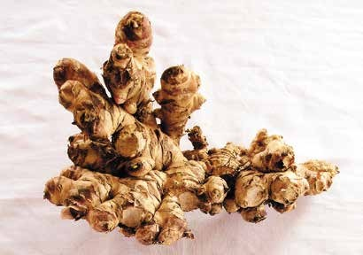
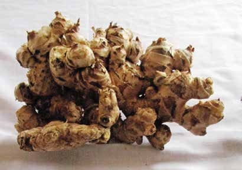
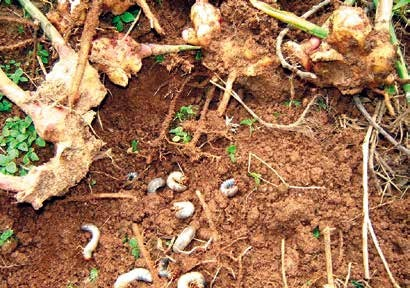
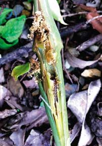
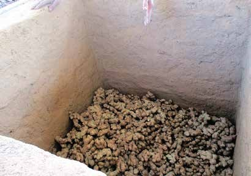
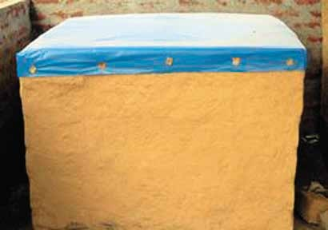
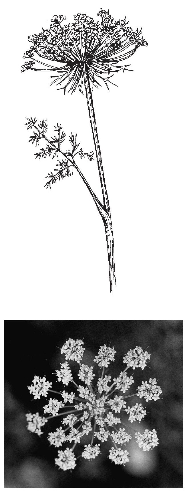
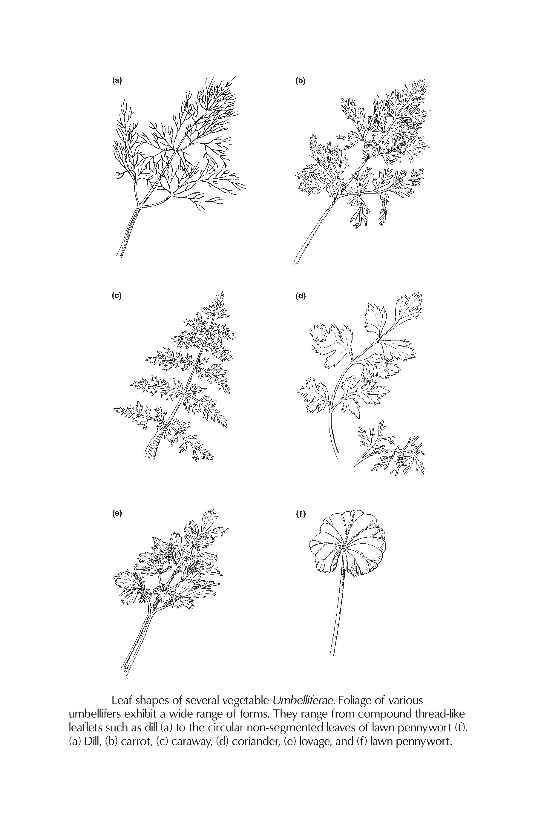
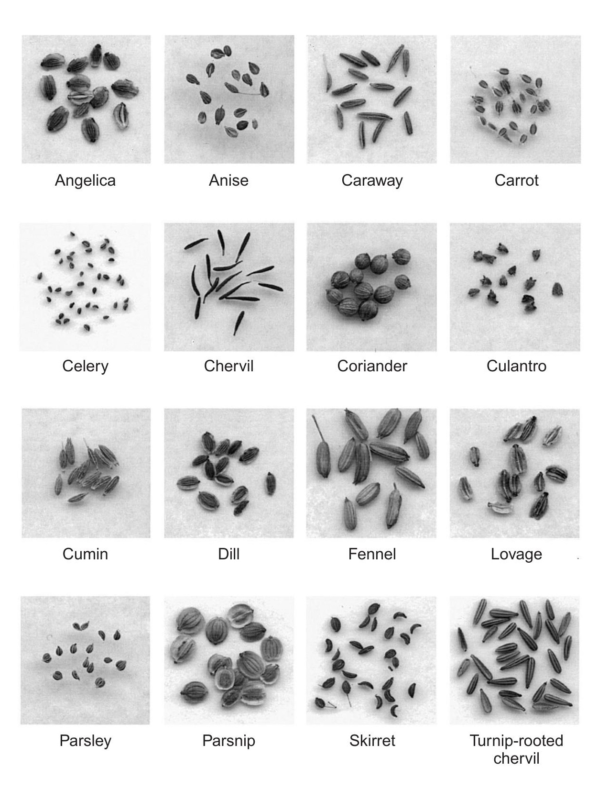

## Tea

World drinks more of tea than any other beverage. It is made from the tender or young leaves and unopened buds of the evergreen tea-plant (*Camellia spp.*), popular as a 'healthful herb'. It was known to Chinese as early as 2737 BC, but attained the status of popular drink in England in 1964 AD. Major tea growing countries of the world are India, China, Srilanka and Indonesia.

The tea plant is commonly referred to the species Camellia sinensis (L.) ). Kuntze, while tea botanists distinguish three taxa,

- C sinensis (L.) ). Kuntze: Chinese type
- C. assamica (Masters) Wight ("Assam type"), and
- C. assamica ssp.. lasiocalyx (Planch.) Wight ("Southern form" or "Cambod type")

In field population, however, wide spectrum of tea populations, particularly in leaf form and other morphological characters arise. Generally, the "China type" bear the small leaves whereas the "Assam type" have large leaves.

### Botany of tea (Camellia sinensis (L.) O. Kuntze)

Shrubs, 1-3 m tall, with virgate branches arising from ground. Leaves 4-8.2 x 1.5-3.2 cm, elliptic, erect, bluntly serrulate with incurved and black-tipped teeth along the margins, thickly coriaceous, dark green, non-punctate, strongly matted and glabrous above, pale green and appressed villous but glabrescent with age below, obtuse or rarely subacute at apex, cuneate to acute at base, garnet-brown to purple when young. Flowers paired, solitary or very rarely fascicled in axils; bracteoles 2-3, inserted slightly below the middle of pedicel, subopposite, concave, broadly ovate, caducous; sepals 5-6, orbicular-deltoid, obtuse, somewhat membranous and ciliolate along margins, glabrous or sometimes sparsely hairy without, velutinous within; petals 7-8, adnate to androecium at base, suborbicular, outer smaller, concave; fillaments of outer stamens united at base; ovary densely white hairy; styles 3, free up to base or to a great part, geniculate distally. Capsules 3-loculed or 2- or 1- loculed by abortion, each locule with 1 or 2 dull brown to reddish-brown seeds.

As a highly cross pollinated crop, modern day seedling populations of tea are mixture of both _C. assamica_ and _C. sinensis_ as hybrid -- C. asamica ssp. Lasiocalyx. However, from their major share of characters -- Assam or China type can be distinguished by the following characters:

```{r tea-comparison}
tribble(
  ~"Assamese", ~"Chinese", 
  "It is a tree", "It is a shrub", 
  "Few robust branches", "Branches abundant and whippy", 
  "Large glossy leaves", "Small leathery leaves", 
  "Light ot medium green", "Dark green color", 
  "High yield and medium quality", "Low yield but good quality", 
  "Susceptible to drought and frost", "Hardy and resistant", 
  "Sparse flowering", "Profuse flowering"
) %>% 
  mutate(sn = row_number()) %>% 
  relocate(sn, .before = 1) %>% 
  knitr::kable(booktabs = TRUE) %>% 
  kableExtra::kable_styling(latex_options = "striped")
```

### History of tea

Documented history of tea cultivation began with the establishment of Ilam Tea Estate in the Hills of Ilam District in 1863. However, it is believed by historians that the first Tea bushes in Nepal were grown from seeds which were given as a gift by the Chinese Emperor to the then Prime Minister and de facto ruler of Nepal, Jung Bahadur Rana. It is believed that Tea plantation in Nepal started within the same decade, when it was introduced in Darjeeling Hills of India. Mr. Gajaraj Singh Thapa is the remarkable name in Nepalese Tea history who planted Tea first time in Ilam District of Nepal. Visioning better future prospects of the Tea industry in Nepal, in 1965 a second Tea plantation, Soktim Tea Estate was set up in the plains of Jhapa district. It's the same decade when Tea plantation had also started in Darjeeling.

However, the nascent Tea industry of Nepal failed to grow. At a time period when the Darjeeling Tea industry was beginning to do very well in the global mercantilist market, the Tea industry of Nepal failed to provide even for the domestic consumption. The reason for the setback of the Nepal’s young Tea industry was mainly due to political turmoil and resulting economic policies of that period, under the reign of the Rana Dynasty.

After the democratic movement of 1950, floor was opened for investment in the industry. As a result, the stagnant Tea industry witnessed an inflow of public and private investment. First Tea Plantation at private Tea sector in Terai was established in 1959 and was registered with the name of Bhudhakaran Tea Estate.

Nepal Tea Development Corporation was established in 1966 by Government of Nepal to aid the development of Tea industry.  Originally Tea leaves produced in Nepal were sold to factories in Darjeeling. Only in 1978 first factory was set up in Ilam for the processing of Tea leaves and a few years later another factory was set up in Soktim, Jhapa district.

From 1978 to the 1990s, various efforts were made by the Nepal Tea Development Corporation to encourage the participation of small and marginal farmers in the growth and production of Tea as a cash crop. Slowly, the stagnant Tea industry was evolving into a fully commercialized industry, benefiting the country’s economic and socio-economic development. To further aid in the development of its Tea industry, in 1982, Government of Nepal under the reign of the then King Birendra Bir Bikram Shah Dev, declared five districts - Jhapa, Ilam, Panchthar, Dhankuta and Terhathum as Tea Zones of Nepal.

Since Nepal Tea Development Corporation was a profit-oriented organization, for the further development of Tea industry, need of non-profit public organisation was felt. And hence National Tea and Coffee Development Board was formed by Government of Nepal in 1993.

```{r tea-cultivated-districts}
tribble(
  ~"sn", ~"district", ~"cultivated_area", ~"production", 
  1, "Jhapa", 11453, 19108, 
  2, "Illam", 8865, 5096,
  3, "Panchthar", 1339, 185,
  4, "Dhankuta", 952, 91, 
  5, "Bhojpur", 456, 0.4
) %>% 
  knitr::kable(booktabs = TRUE, col.names = str_to_sentence(str_replace_all(colnames(.), "_", " "))) %>% 
  kableExtra::kable_styling(latex_options = "striped", font_size = 10)
```

### Tea varieties

The varieties of tea raised in Nepal are mainly Assamese types.

- CTC: TV series 1-30, Hilika, Manohari, Tinaali, Nagarjli
- Orthodox: Gumti Selection, Phuwachiring-312, Takda-78, Takda-83, Takda-246, Aambari-2

### Climate and soil requirement

Tea is a extracting (requiring too much) in its climatic requirements. In a fine tea producing region, The annual rainfall varies from 210-290 cm. The monthly average maximum temperature varies between \SIrange{22}{28}{\celsius} during October-March, but it may be upto \SI{37}{\celsius} between April-September. The minimum temperature does not go below \SI{7}{\celsius}. The atmospheric humidity should be around 80\% during most of the time. Very dry condition is not congenial for tea cultivation. It can be grown up to 2000 masl. Tea can be grown in lateritic, alluvial and peaty soils. Optimum soil pH is ranges 5.4-6 and depth should be 1-1.5 m.

### Propagation

Tea can be propagated by seed and by cuttings. Seed propagation is seldom practiced currently.

Seed propagation: The plant will start flowering and fruiting from the 3rd year of planting and seeds may be harvested when they become brownish. Seeds collected from the fruit (berries) are soaked in water and only heavy seeds which sink are alone used in bed sowing. Germination occurs in 20-30 days. At that stage they are carefully lifted and transplanted in polythene bags. They will be ready for transplantation in about 9 month.

Vegetative propagation: The cutting from roots are collected from mother bushes which are well maintained near the nursery area. Such mother bushes are pruned well in advances to induce juvenile shoots. These juvenile shoots are collected in morning hours and 3 cm cutting each with a healthy mother leaf and active bud is prepared. Cuttings from the top tender and bottom brown wood should be avoided. These cuttings are planted in polythene bags. The cuttings are carefully planted in the bags in such a way that the petiole should not touch the soil and they are watered. Callusing starts in 4-6 weeks and rooting occurs in 10-12 weeks.

### Planting

Earlier, up and down system of planting at 1.2 x 1.2 m were popularly followed but currently, counter planting either in a single hedge or double hedge system is followed.

```{r tea-planting}
tribble(
  ~"style", ~"spacing_m", ~"population_per_ha", 
  "Up and down", "1.2 x 1.2", 6800, 
  "Counter planting single hedge", "1.2 x 0.75", 10800, 
  "Counter planting double hedge", "1.35 x 0.75 x 0.75", 13200
) %>% 
  rename_all(function(x)str_to_sentence(str_replace_all(x, "_", " "))) %>% 
  knitr::kable(booktabs = TRUE) %>% 
  kableExtra::kable_styling(latex_options = "striped") %>% 
  kableExtra::column_spec(1, width = "12em")
```

The counter planting double hedge system has many advantages over the first two viz. early and high yield, better soil conservation, less weed growth, arrangement in hedge, adn efficient cultural practices. Planting season normally coincides with June-July and September-October. Pits of 30 x 30 x 45 cm size are dug and plants of 12-15 months old are planted. Immediately after planting, plants are staked to prevent wind associated damage.

### Shading

Tea requires filtered shade and if it is exposed to direct sun, will sustain impaired growth. Advantages of a shade cover in tea canopy are following:

- It regulates the temperature
- It minimizes the effect of drought and radiation injury
- It increases the soil fertility
- It helps in recycling of nutrients
- It serves as wind break
- It reduces the incidence of pest
- It generates additional income by production of timber and fuel

The main drawbacks of the shade are:

- It increases the incidence of blister blight
- Competition for main crop for moisture and nutrients
- Reduced response to applied fertilizer

The trees recommended for permanent share are: _Albizia chinensis_, _A odoratissima_, _A lebbek_, _Derris robusta_, _Grevillea sencea_, _Grevillea robusta_ (Silver oak).

### Weed control

Weeds will be problem in young and pruned fields. It is estimated that Dicot weeds can casue about 12\% loss in crop, grasses are responsible for about 21\% crop loss. Manual weeding is never recommended for tea lost more soil erosion and damage to surface roofs and collar regions. Following chemical weed control is alone recommened for tea:

```{r tea-weed-control}
tribble(
  ~"type_of_weeds", ~"herbicides", ~"doses", 
  "Dicots", "Paraquat 24% (Gramoxone)", "1.2 ltr/ha", 
  "Dicots", "2,4-D Sodium Salt 80% (Ferroxone)", "1.4 kg/ha", 
  "Grasses", "2,2-Dichloro propionic acid (Dalapon)", "5-6 kg/ha", 
  "Grasses", "Glyphosate", "2-3 ltr/ha") %>% 
  rename_all(function(x)str_to_sentence(str_replace_all(x, "_", " "))) %>% 
  knitr::kable(booktabs = TRUE) %>% 
  kableExtra::kable_styling(latex_options = "striped")
```

### Training and pruning

In the young tea, when it has established well, centering i.e. removing the growing point leaving 8-10 mature leaves from the bottom is done to induce secondaries. When secondaries reach more than 60 cm, they are tipped at 50-55 cm height by removing 3-4 leaves and bud to induce teriaries. It takes nearly 18-20 months from planting to reach regular plucking field stage.

Pruning is done in tea for the following reasons:

- To maintain the convenient height for plucking
- To induce more vegetative growth
- To remove dead and defunct wood
- To remove the knots and interlaced branches

Pruning is normally done at 4-6 yeas interval depending upon the altitude of the garden, nature of the tea materials. The bushes marked for pruning should have adequate starch reserved in root otherwise the sprouting following pruning will be less. Prunign is carried out in the pre-monsoon and post-monsoon periods since adequate soil moisture is pre-requisite for pruning. A pruning height of 30-40 cm is termed as hard pruning while medium style of pruning refers to pruning between 45-55 cm. When primary frames are healthy and if secondary have numerous knots and cankers, a hard or medium pruning is necessary. In such cases, pruning is done in the secondary wood. Cleaning of branches which are less than pencil thick in diameter and removal of snags is often undertaken while carrying out this type of pruning.

When the bushes are pruned at a height of 60-70 cm, it is referred to as light pruning. This can be adopted if the primary and secondary branches are healthy. Cleaning of branches is not recommended in this style of pruning. If the bushes are pruned about 75 cm, it is reffered to as skiffing which is the lightest form of pruning. The criteria for determining the height of the pruning should be the thickness of branches. Good frame should be developed with correct tipping.

The recovery of bushes after pruning depends on the height of the pruning, type of wood, time of pruning, health of bushes, carbohydrate reserves and elevation of the garden. The periodic shorts developing on pruned bushes are tipped at an appropriate height. Height of the tipping decreases with increase height of pruning. The first plucking of recovery bushes is called tipping. The objective of the tipping is to establish a level plucking surface, to provide adequate maintenance foliage and for quick production of secondary branches.

### Fertilization and Manuring

Manuring in tea starts from the nursery stage itself. Once they strike roots (after 4 months) 30 gram of solube mixture (ammonium phosphate 35 parts, potassium sulphate and magnesium each 15 parts and zinc sulphate 3 parts) is dissolved in 10 litres of water and is applied with rosecan for about 900 plants. This must be repeated at 10 days intervals.

Generally, 100-140 kg N, 20-50 kg P2O5 and 80-140 kg K20 per hectare are recommended for sustaining yield of 2300 kg made tea/hectare. Half dose of N and full doses of P and K are applied in November/December and remaining half N is applied at May-June.

Micronutrients: Zinc deficiency is often manifested in young shoots characterized by reduced leaf size, rosetting, chlorosis, etc. Application of Zinc Sulphate \@ 6-8 kg/ha for high yielding varieties every year is a generally recommended. The above quantity can be given in 4-5 split application during the high cropping months i.e. during April/May and September/October. It has been found beneficial to combine other micro nutrients such as manganese sulphate \@ 15 g/10 ltr and boric acid \@5.5 g/10 ltr of spray volume along with zinc sulphate sprays.

Liming is applied by broadcasting prior to pruning once in a pruning cycle if the soil is acidic in nature. First manuring followeing liming can be had after 6 weeks and minimum of 15 cm rainfall should have been received during the period. Liming is recommeneded only for matured tea plants which are under regular plucking. Roughly lime \@ 1.5 mt/ha for a pH between 4.5-4.9, 3 mt/ha for a pH between 4-4.4 and 4 mt/ha for pH less than 4 is suggested.

### Irrigation

Tea is a rain fed crop, therefore, scope of irrigation is rather limited. There is definite increase in crop due to irrigation, either by sprinkler or by drip system. In tea, sprinkler irrigation is the most common but drip irrigation is suitable for the areas which are newly planted or replanted. In areas which are not planted in contours, drains are necessary.

### Plucking

Plucking consists of harvesting 2-3 leaves and bud. It is a labor intensive operation and also decides the yield and quality the tea makes. Normally a pluckable shoot takes 60-90 days for harvesting. When the shoot is plucked up to mother leaf, it is known as light plucking and if it is plucked below mother leaf it is called hard plucking. The plucking intervals and plucking standard in relation to cropping is given below:

```{r plucking-tea}
tribble(
  ~"cropping_pattern", ~"months", ~"plucking_interval", 
  "High cropping or rush cropping (60% of total crop)", "April-June; October-December", "7-8 days", 
  "Low cropping or lean cropping", "July-September; January-March", "12-15 days") %>% 
  rename_all(function(x)str_to_sentence(str_replace_all(x, "_", " "))) %>% 
  knitr::kable(booktabs = TRUE, caption = "Cropping pattern and plucking cycle of tea") %>% 
  kableExtra::kable_styling(latex_options = "striped")
```

It is essential to add one tier of active maintenance foliage to the bush every year. This is done by mother leaf plucking during January to March. During the rest of the period level plucking can be carried out.

### Yield

Generally, in tea industry, a field which yields upto 2000 kg of made tea/ha is considered as low yielding, 2000-3000 kg as medium yielding and above 3000 kg as high yielding field.

### Diseases

1. Blister blight ( _Exobasidium vexans_)

Symptom

Infected tender leaves and stem and develops transluscent spots. Cloudy and wet weather favor infection.

Control measures

- Copper oxychloride 350 g in 67 ltr of water with power sprayer for pruned field at 3-4 days intervals.
- In the plucking field 210 g copper oxychloride + 210 g nickel chloride in 45 ltr of water/hectare at 7 days intervals.

2. Black root disease ( _Rosellinia arcuata_)

Symptom

Infected root show black mycelium, white star shaped mycelium between bark and wood and black lead shot like perithecia seen on collar region.

Control measures

The soil may be drenched with Dithane M-45 \@30 g/10 ltr of water.

3. Red root disease ( _Poria hypolateritia_)

Symptoms

Infected roots exhibit blood red mycellium on washing. It spread fast but kills slowly.

Control measures

Take trenches of 1.2 m deep and 45 cm wide surrounding the infected bushes and uproot and burn the bushes insitu.

4. Brown rot disease ( _Fomes noxius_)

Symptoms

Infected root wood turn soft and spongy. It spread slowly but kills quickly.

Control measures

Rehabilitation of soil with gautemala grass.

### Pest

1. Tea aphid

It is a menace attacking the tender buds and causing delays in elongation of buds to shoots. This can be easily controlled by spraying one or two rounds of Basudin (Daiazinon) or Malathion at 1:1000 dilution.

2. Tea mosquito bug

This insect damages the shoot of tea bush by sucking the sap. The bush becomes distorted. This pest can be controlled by spraying Trithion 1:1000, Tolant 1:250, etc.

3. Nettle grubs or Lobster caterpillar

This pest damages the leaves of the tea. But in severe cases the bushes may be completely stripped of their foliage whether young or old. The pest may be easily controlled by spraying Malathion.

### Manufacturing tea

Basically there are 2 types of tea processing methods:

#### Orthodox method

In this method, the rolling operation is done in a series of rollers. The rollers have rotary tables with batterns, jacket for loading the leaf and a pressure cup.

#### CTC (Cutting, tearing and curling) method

In this method, CTC machine consisting of series of a pair of rollers mounted in such a way they rotate in opposite directions and the clearance between them is so adjusted to crush and tear the leaves. Irrespective of the method, manufacturing of the tea involves the following steps:

1. Withering: The objective of the withering is to reduce the moisture contentn of leaves by spreading them in troughs which receive artificial air from the fan fitted on one end. At the end of withering, the leaves attain a flaccid condition for which it may take 12-18 hours depending upon the weather condition.
2. Rolling: This operation is carried out by a series of machine or a single roller, during which the cells in the leaves are broken to liberate the sap containing the polyphenol oxidase, an enzyme, which in the presence of oxygen, oxidizes the polyphenols to produce theaflavins and thearubigens. These are responsible for coloring of tea and is pre-requisite for next process, i.e. fermentation. Rolling take place for 30-40 minutes.
3. Fermentation: Rolled tea materials are either spread in concrete floors or kept in aluminium trays. In the presence of high humidity and proper temperature, the properly fermented tea will take golden red color. This step decides the quality i.e. strength, color, briskness of tea. Fermentation requires one hour or two hours depending upon the environmental condition.
4. Drying: This step aims at stopping the fermentation process and slowly removing the moisture content without a burnt smell but preserving the inherent quality. This is achieved by passing the fermented tea in thin layers though conveyors into a drier in which the inlet temperature is maintained around $250-280^\circ F$ and outlet temperature around $150-200^\circ F$. Proper drying takes 30-40 minutes.
5. Grading: Before grading, the dried tea is removed of the stalky fibers, which affect the quality of the tea, by passing through fiber separator machine. This bulk tea is passed through different sized meshes which aid in separation into different grades.

## Coffee

The word coffee is derived from the Arabic word 'quahweh' which originally some people say was poetic term for wine. Since wine is forbidden to strict Muslims the name was transferred to coffee, and through its Turkish equivalent kahweh became cafe (French), caffee (Italian), Kaffee (German), Koffie (Dutch) and coffee (English) and the Latin _coffea_ for the botanical genus.

Coffee is considered one of the most prestigious beverages. Some of the uses of the coffeine in coffee which will perhaps explain its popularities are:

- It stimulates respiratory, gastric and renal activities;
- Assists in assimilation and digestion;
- Reduces the amount of blood circulation in the brain;
- Allays the sense of prolonged mental or physical fatigue;
- Staves of sleep;
- Relieves tobacco poisoning;
- Serves as spasmodic for asthma, whooping cough, remedy for diarrhoea, typohoid in the early stages and vomitting after a surgical operation.

### History of coffee

Coffee plantation is still a new adventure in Nepal. In 1938 AD, a hermit Mr Hira Giri had brought some seeds of Coffee from Sindu Province of Myanmar (the then Burma) and had planted in Aapchaur of Gulmi District for the first time in Nepal. The crop remained unnoticed as a curiosity crop until 1970s. Then it spread from one farmer to another as a curiosity plant for about 4 decades.

In late seventies, expansion of Coffee as commercial crop to some extent took place when Government of Nepal imported Coffee seed from India for distribution. The major shift to commercial Coffee production took place in mid-eighties. After the establishment of Nepal Coffee Company (NeCCo) in Manigram, Rupandehi district, in 1983/84, the Coffee producers were able to sell Coffee. NeCCo used to collect dry cherry from the Coffee producers and processed the Coffee for domestic market. Until early 2000, Coffee producers were not very sure of Coffee being a source of income or income generating crop due to the market problem. However, after the year 2002, substantial increase in the export and also increase in domestic market consumption to some extent motivated Coffee producers to consider Coffee as a major income generating crop.

Respecting the interest of people on Coffee and favorable climatic conditions for its cultivation. Ministry of Agriculture decided to launch Coffee Development Programme in the country. The Government provided technical and financial support to the farmers; its cultivation has gradually spread to about 40 districts of the middle hills of Nepal. Lalitpur, Gulmi, Palpa, Shyangja, Kaski, Sidhupalchowk, Kavre, are some districts known for Coffee production.

### Coffee cultivation in Nepal

Coffee is a high value cash crop with environmental importance and is being popular among Nepalese since last few decades. It has been spreading in over 40 districts of the middle hills of Nepal.

All Nepali Coffee is of Arabica variety, mix of bourbon and typical, grown above 1000 meters up to 1600 meters altitude with organic and eco-friendly practices by small farmers. Selective hand picking of fully ripen cherries is done and pulped right after harvesting with mini hand pulper (wet processing) with necessary additional procedures. However, for domestic and home consumption dry processing method is also adopted where cherries are harvested and dried in sun at the farm level.

Nepal Coffee is considered specialty Coffee for its distinct flavor aroma and body as it is grown in higher altitude, away from the main Coffee growing Capricorn and Cancer belt (beyond 230 latitude). Coffee produced in Nepal is Organic and Fair-trade and is readily accepted as a Specialty Coffee in specific international markets.

Coffee can be commercially produced in many parts of the country. However, there is great potentiality in mid hilly region for organic Coffee production as it has got suitable climate, topography, soil, relative humidity, temperature and rainfall for Arabica Coffee. Some districts like Gulmi, Palpa, Argakhanchi, Lalitpur, Tanahu, Kavre, Sindhupalchowk, Lamjung, Kaski, Gorkha, Syangja, Parbat and Baglung are successfully growing and producing Coffee beans and is increasing gradually. This will certainly help in diversifying process and will increase the income of the farmers as well as other individuals involved in Coffee processing and marketing enterprise.

Nepal is Exporting Coffee beans mostly in Japan, America and European countries. This has been extended to other parts of the world.

```{r coffee-area}
tribble(
  ~"District", ~"Area", ~"Production", 
  "Syangja", 324, 46,
  "Kavre", 199, 31, 
  "Nuwakot", 184, 38, 
  "Gulmi", 178, 37, 
  "Kaski", 159, 36
) %>% 
  knitr::kable(booktabs = TRUE, caption = "Top districts producing coffee during 2075/76") %>% 
  kableExtra::kable_styling(latex_options = "striped")
```

```{r tea-coffee-2075/76}
tribble(
  ~"particular", ~"tea", ~"coffee", 
  "Cultivated area", 28732, 2761,
  "Production", 25205.86, 530,
  "Export volume (mt)", 15043.8, 84.13,
  "Import volume (mt)", 342.35, 1262.41,
  "Export value (in '000 NRs)", 3203904, 99616.16,
  "Import value (in '000 NRs)", 117732.3, 98014.24,
  "Growers", 15234, 33984
) %>% 
  rename_all(function(x)str_to_sentence(str_replace_all(x, "_", " "))) %>% 
  knitr::kable(booktabs = TRUE, caption = "Tea and coffee statistics for year 2075/76 (Source: Tea and Coffee Development Board, 2076)")
```

- Optimum height for cultivation of coffee: 800-1500 masl
- Optimum temperature for cultivation of coffee: \SIrange{15}{25}{\celsius}
- Currently, more than 40 districts are cultivating coffee

### Botany

Though the genus _Coffee_ consists of about 70 species only three species are economomically importance. They are:

- _C. Arabica_ (Arabica coffee)
- _C. cenephora_ (Robusta coffee)
- _C. liberica_ (Tree coffee)

The Arabica and Robusta species are extensively cultivated. The differences between the two are:

```{r coffee-species-differences}
tribble(
  ~"Character", ~"\\textit{C. arabica}", ~"\\textit{C. caenephora}", 
  "Ploidy", "Tetraploid (2n = 44)", "Diploid (2n = 22)", 
  "Adoptability", "Higher elevation (1000-1500 masl)", "Lower elevation (500-1000 masl)", 
  "Plant status", "A small tree, a shrub or a bush under training", "A bigger tree than Arabica", 
  "Leaves", "Dark green", "Pale green", 
  "Flowers", "Scaly, small bracts, per axil 4-5 inflorescence of 1-4 flowers", "Leafy and expanded bracts with 5-6 flowers per inflorescence", 
  "Berries", "10-20 per node, oblong to round shaped", "40-60 or more per node, small", 
  "Fruit development period", "8-9 months", "10-11 months", 
  "Root system", "Small but deep", "Large but shallow", 
  "Pollination", "Self pollination and self fertile", "Cross pollination and self fertile"
) %>% 
  knitr::kable(booktabs = TRUE, caption = "Differences between Arabica and Robusta coffee", escape = FALSE) %>% 
  kableExtra::kable_styling(latex_options = "striped") %>% 
  kableExtra::column_spec(2:3, width = c("12em", "12em"))
```

Coffee plant is a perennial, evergreen small tree or shrub. It has prominent vertical stem with horizontal primary branches arising from it in pairs opposite to each other. The primary branches give rise to secondary laterals, which in turn produce tertiary and quarternary branches. The upright shoot known as "sucker" arises from the main stem. It arises in between the primary lateral branch and the leaf. The sucker grows vertically like main stem, which should be cut.

Generally coffee has shallow root system; in particular the Robusta has feeder roots concentrated very close to the surface of the ground. The spread of the root depends on the type of soil and cultural practices. Flower buds are produced at the leaf axil at mature green wood on short peduncles, the stalks of the inflorescence.

### Climate

```{r coffee-optimum-temperature}
tribble(
  ~"Arabica", ~"Robusta",
  "\\SIrange{15}{25}{\\celsius}", "\\SIrange{25}{30}{\\celsius}"
) %>% 
  knitr::kable(booktabs = TRUE, escape = FALSE) %>% 
  kableExtra::kable_styling(latex_options = "striped")
```

Above, \SI{25}{\celsius}, the photosynthesis rate is reduced and leaves are damaged and develop chlorotic symptoms. Low temperature produces a white or yellow discoloration of the leaves. Rainfall of about \SIrange{1600}{2500}{\milli\meter\per\year} is optimal for coffee.

### Site aspect and topography

In the sub tropics, north or south facing slopes, depending on the hemisphere, will receive more sun, which is usually beneficial for disease free crop development. Areas with the risk of frost should be avoided, and planting on slopes will assist the movement of cold air away from the coffee orchard. Faces exposed to windward side need wind breaks. Moreover, planting of trees will impart shade that is beneficial for coffee plantation.

### Soil

The soil should provide good drainage since water logging will reduce yield by substantial amount and kill trees, if it is sustained for prolonged period of time. Locations with low rainfall and long dry season should have deep soil profile, ideally 3 meters. The coffee roots explore the profile extensively down to 3.5 m. Soil pH of 6-6.5 is considered best for the coffee plantation.

Soil management practices aimed at conserving soil and water and in general to make the soil perform its functions satisfactorily, includes following practices in an orchard:

1. Digging
2. Scuffling or soil stirring
3. Trenching: Trench and pits are dug or renovated in a staggered manner between rows of coffee along the contour during August-October when the soil is fairly easy to work. These are 50 cm wide and 25 cm deep and can be of any convenient length.
4. Mulching
5. Weed control: Mechanical or chemical control is practiced. Chemical weedicides such as Gramoxone \@1.25 ltr in \SI{450}{\litre\per\hectare} of water are used for best results.

### Shade and its management

Generally Robusta coffee requires more shade than Arabica coffee. Shade breaks the intensity of light. i.e. in high latitudes and in some special locations, frequent clouds and persisting mist might give the same effect.

Ever green fruit plants, Badahar ( _Artocarpus lacucha_), Chuletro, Kaeo, Uttis, Pakhuri, Tanki, Kauro, Rai, Khaniyo and other fodder trees can be grown as permanent shade trees.

### Spacing

- Arabica: 2.5 x 2.5 m, 3 x 2.5 m, 3 x 3 m
- Robusta: 3 x 3 m, 4 x 4 m, 4 x 5 m, 5 x 5 m

### Training and pruning

Training of bush is necessary to have a strong framework which promotes production of bearing wood.

Coffee is trained in two system:

1. Single stem system: When plant reach a desirable height of 69 cm topped in the growing apex of the main stem at the height of 53 cm. This topping restricts the vertical growth, facilitates lateral spreading of coffee plant and increases the fruit bearing area. This practice usually performed 2-3 times. Initially, at knee height stage of the seedling and later at waist height. If pruned the third time, it is best done at chest high stage. In Arabica type coffee, single trunk is maintained with the height not taller than 1.5 to 2 metres.

2. Multiple stem system: This practice is common in Brazil, Kenya, Tanzania and Latin America, but not in India and Nepal. When old coffee branches have exhausted over years, old stem are stumped (heading back) and new shoots are allowed to grow in its place.

Trees of the Robusta, Kouilou and Petit Indenie varieties, however have several main stems. Fruiting behavior in Robusta has following features:

- The wood of a branch has berries only for one year.
- The next year, that part of the branch bears no fruit.
- The berries grow on the new wood which has grown during the year.
- A branch yields fruit for several years, but it is always a different part of the branch that bears fruit.

Pruning system includes following steps:

1. Bend down the first stem and tie it to a stake.
2. Let 3-5 main stems develop (they will bear fruit).
3. Cut off the bent stem (a new stem will grow in its place)
4. On the main stems, branches will grow and bear fruit. After two years of harvests, fruits will grow only on the tips of the branches (Cut down these branches)
5. When a main stem has borne fruit for three to five years, cut it off. In the place of the stem, a new shoot will grow and bear fruit.
6. Every year cut off one of the main stems.

### Harvesting

In general fruit should be picked when seed pops out easily while gently squeezing the berry. To maintain standard, it is important that yellow drought cherry, green unripe cherry, dry or insect damaged and overripe rotting cherry should not be accepted for processing. The fruits must be immediately processed to prevent fermentation. Any contamination by foreign bodies especially microorganisms like brown blight must be avoided and it should be processed separately as well as kept separate during drying and forwarding to the mills. It is very important that pulping work should not be delayed to prevent from spoil and to maintain its quality. Faulty processing can bring about deterioration of even the best quality coffee.

### Methods of processing

1. Wet method

Parchment coffee is prepared with wet method. And the former is regarded better than the cherry coffee. Steps involved in the wet method are:

\begin{enumerate}
\item Pulping: Pulping is done with the help of pulping machine within 12-14 hours of harvesting. Coffee seed obtained after pulping is called parchment.
\item Demucilaging and washing: The mucilage on the parchment skin can be removed by using any one of the following methods:
\begin{enumerate}
\item Natural fermentation: Mucilage on the parchment skin can be removed in specially designed vats by allowing fermenting by itself or by using pectinolytic enzyme. Natural fermentation completes in 24-32 hours for Arabica and 72-80 hours for Robusta. When correctly fermented, the mucilage comes out easily and the parchment does not stick to the hand after washing.
\item Treatment with alkali: Parchment obtained after pulping are drained off excess water and spread out in the vats uniformly and furrowed with woodden ladle. A 10\% solution of NaOH is evently applied to the furrows, using a rose can. The parchment is agitated thoroughly with ladle. Demucilaging completes when the parchment is no longer slimy and rattles. Alkali treatment completes in 1 hour for Arabica and 1.5 hours-2 hours for Robusta.
\end{enumerate}
\item After completion of natural fermentation or alkali treatment, the parchment is washed and cleaned with water 3-4 times. The washed parchment should be soaked in water for 12-24 hours and then final wash is given.
\item Drying: In the next stage of processing, the parchment is dried in the sun (for 7-10 days) untill the moisture content is sufficiently reduced upto 10\%.
\item Hulling/curing/shelling: Shell of the seed is removed by Huller machine
\end{enumerate}

2. Dry method: It includes following steps:

- Preparation of cherry: Fruits should be picked when they ripen. Green, under-ripe, diseased, insect damaged, floating beans should be sorted out and dried separately. The fruits should be spread evenly to a thickness of about 8 cm (3 inches) on clean drying ground. It is desirable that drying is carried out on tilled or concrete floor. Coffee should be stirred at least once every hour. It may be covered at night time and spread again the next morning after the mist clears. The cherry is dry when a fist full of drying cherry produces rattling sound when shaken and a sample fort records the same weight on two consecutive days. The cherry should be fully dry at the end of 12-15 days under bright weather conditions.
- Storing: Stores should be kept well ventillated and dry without letting in moisture or rain water. The bags containing dried parchment or cherry should be stored on a raised wooden plank to ensure circulation of air underneath the bags. Parchment and cherry coffee should not be stacked together and it should not be stored in fertilizer pesticides containing room.

### Insect pests

1. **White stem borer** ( _Xylotrechus quadripes_)

Grubs feed on wood of the stem and thick primaries, tunneling some times right down to tap root. The attacked plants can be easily detected by the presence of ridges appearing on the smooth surface of the stem. The affected plant shows wilting and yellowing of leaves. The young infested plants succumbs while older infested plant becomes unproductive and succumbs if continuously attacked.

Control measures

1. Building up of good shade
2. Regularly trace, uproot or stump and burn infested plants. Do not store the affected cut stems.
3. Swab the main stem and thick primaries once in April/May and once or twice in October/December with Lindane 20 EC at 1300 ml, or Chlorodane \@ 4 kg in 200 ltr of water. The swabbing should coincide with the flight periods. The swabbing method may not be possible to untrained farmers. Therefore, shade management and regular supervision must be done in order to kill the larvae as well as to collect infected coffee branches to burn.

2. **Shoot holeborer** ( _Xylosandrus compactus_)

Attacks tertiary twigs, young primaries and suckers. The damage is caused by tunneling within the branch thus limitting the flow of sap. The attacked branched dry up. The presence of withering and dead branches with shoothole, is diagnostic of attack. Incidence starts by mid June and reaches the peak by September-December.

Control measures

- No chemical gives effective contorl of this pest mainly due to the fact that the grub live inside the tunnels and it is extremely difficult for the chemicals to reach the target.
- Prune and burn infested twigs, young primaries and suckers.
- Desucker and burn infested suckers during summer.
- Maintain thin shade and good drainage.

3. **Mealybugs** ( _Plannococcus lilacinus_)

- Damages the coffee plant by sucking the sap from the tender parts.
- The continuous sucking of sap from the nodes, tender branches, leaves, spikes, berries and roots debilitates the plant.
- Infested leaves become chlorotic.
- Infestation on spikes results in blossom abortion or poor development of fruit initials.
- Shooty mold (black fungus) develops on the honey dew secreted by the bugs and the leaves and twigs of the infested plants become black. If extensively developed, the mold can prevent photosynthesis.
- A number of species of ants are attracted to the honey dew secreted by the mealybugs and offer protection to the bug from natural enemies. They also help in disseminating the bugs.

Control measures

1. Ants should be controlled by dusting BHC 10\% or Ekalux 1.5\% or Metacid 2\% or Malathion 5\%. Dust around the base of the bushes and shade trees. Destroy the ant nests.
2. Remove and burn weeds which harbor mealybugs.
3. Optimum shade should be maintained on the estate since exposure favors the build up of the pest.
4. For biological control of mealybugs, release the lady bird beetle, ( _Cryptolaemus montrouzieri_) on the infested coffee farm.

4. **Green scale** ( _Coccus viridis_)
5. **Hairy caterpillar** ( _Eupterote spp_)
6. **Red borer** ( _Zeuzera coffeae_)

### Diseases

1. **Leaf rust** ( _Hemileia vastatrix_)

Infects foliage of coffee. Pale yellow spots on the lower surface of leaves, later turning orange yellow powdery mass consisting of urediospores are reniform, with spines on the dorsal side and measure 25-35 x 15-30 mm. Pear shaped non-resting hyaline, teliospores reproduced from November to January.

In a favorable year, disease damage is so devastating that only dead twig could be seen devoid of branches for the succeeding year. The crop loss may go up to 70\%.

**Control measures**

1. Spary either freshly prepared Bordeaux mixture or systemic, curative and eradicant fungicide plantvax 20EC (Oxycarboxin) as prophylactic.
- February-March: 0.5\% Bordeaux mixture (pre-blossom)
- May-June: Plantvax 20 EC (pre-monsoon); 0.03\% a.i. for high volume and 0.075 \% a.i. for low volume.
- July-August: Plantvax 20 EC or 0.5\% Bordeaux mixture (mid-monsoon)
- September-October: Plantvax 20 EC or 0.5\% Bordeaux mixture (post-monsoon)

2. Grow rust resistant/tolerant cultivars

2. **Black rot** ( _Koleroganoxia donk_)
3. **Pink disease** ( _Corticium salmonicolor_)
4. **Anthracnose** ( _Colletotrichum gloeosporioides_)
5. **Berry blotch** ( _Cercospora coffeicola_)

## Cultivation of spices

### Ginger (*Zingiber officinale*) (Sanskrit: _Singabera_)

- Nepal has adopted National trade integration strategy (NTIS, 2010). The strategy has prioritized export promotion of 7 crops, among which spices (Cardamom, ginger) form a major portion.
- The aroma/flavor of zinger is due to volatile oils found in the rhizome.
- Ginger cultivation has primarily been a small farmer's cash incentivized approach in Nepal. However, ours is the fourth largest producer country of Ginger ($6^{th}$ based on export).
- The crop is traded as a fresh or dried product.

Health benefits of ginger includes beneficial to patients of diabetes, indigestion, arthritis, high cholesterol, fractures and due to its anti-pyrretic and blood-thinning properties. In Nepal, 40\% is domestically consumed and 60\% is exported to neighboring countries, mostly India.

The crop performs well in warm and shaded place, with well drained soil and plenty of organic matter. Sandy loam soils are the soil types of choice. Heavy soils are not preferred because they may lead to prolonged water logged conditions during rain. The crop is nutrient exhaustive, so fertilizer enrichment of the soil during each crop cycle is essential.

A gentle slope that allows for good drainage is preferred for the selection of site. The compost/FYM should be incorporated at the time of final land preparation, generally at the start of rainy season. In places where acceptable moisture prevails, crop can be successfully raised even during early summer (in mid-hills).

#### Morphology and Botany

- Monocotyledonous
- Although a perennial crop, the crop's development occurs intermittently throughout its life cycle (typical of herbaceous perennials). They survive the unfavorable season as dormant underground structures.
- The pattern of above-ground vegetative growth makes it seem like a crop that has annual growth habit.
- The crops' rhizome is the economic part.

```{r ginger-bot, out.width=c("78%", "20%"), fig.ncol = 2, fig.cap="Ginger crop and uses", fig.subcap=c("Rhizome", "Aromatic oil extract of ginger")}
# pdftools::pdf_convert("E:/DD/Teaching_s/Horticulture Texts/Horticulture - Principles and Practices 4th ed. (intro txt) - G. Acquaah (Pearson, 2009) WW.pdf", format = "jpeg", pages = 99, dpi = 200)

knitr::include_graphics(c("./images/vegetables/Ginger_rhizome.jpg", 
                        "./images/vegetables/Ginger_perfumery.jpg"))
```


#### Uses

- Cash crop for income generation of peoples in midhills.
- Easiness of mixing with other crop as intercrop.
- Fresh ginger is used as condiment in food.
- Dried ginger is used for medicinal purposes.
- Antiemetic, digestion enhancer, anti-cold, anti-bacterial, beneficial for diabetic patients, Gall stones, Arthritis, Hypertensive, and
cholesterol patients.
- Ingredient in many biscuits, beverages, candies, chocolates, perfumes, shampoo, etc.

#### Varieties

- Two broad categories: "Nasay" and "Bosay"

```{r ginger-vars, results='asis'}
ginger_vars <- data.frame(Varieties = c("Kapurkot-1", "Kapurkot-2"), Released_date = c(2058, 2073))

pander::pander(ginger_vars, 
                     style = "rmarkdown", 
                     justify = "lr", 
                     split.tables = 120,
                     split.cells = c(10, 20),
                     col.names = c("Varieties", "Released date"), 
                     caption = "Ginger varieties released till date",
                     use.hyphening = TRUE,
                     missing = "")
```


```{r kapurkots, out.width="48%", fig.ncol = 2, fig.cap="Varieties of ginger", fig.subcap=c("Kapurkot-1", "Kapurkot-2")}


```

#### Climate and soil

- Warm and humid climate with average temperature of \SIrange{25}{30}{\celsius} favors better growth.
- Requires relatively less rainwater during germination, and a more frequent and intense one afterwards.
- Grown successfully areas with elevation of 2000 masl where annual rainfall ranges 1500-2700 mm.
- Requires relatively warmer temperature for initial vegetative growth.
- Growth is checked at temperature below \SI{15}{\celsius}.
- Loam, sandy loam with ample organic matter content is preferred.
- Soil pH: 6-7

#### Manuring and fertilization

- Nutrient exhaustive crop, so crop rotation should be followed.
- NPK: 12:9:7 \si{\kilogram\per\ropani} (Blanket recommendation for Nepal: NPK 4:2.5:2.5 \si{\kilogram\per\ropani})
- Mustard cake (if available): 100 \si{\kilogram\per\ropani}
- FYM: 1500 kg (60 _Doka_)

#### Propagation

**Rhizome**

- They are the storage organ of the plant.
- Are spread horizontally along the surface.
- Reach 15cm and 5cm in length and width respectively.
- Suckers arise from the buds of rhizomes.
- Rhizome contains 1-2% oil.

**Suckers**

- Psuedostem sucker, since the erect form is due to leaves.
- Leaves arise from the base of the stem.
- Suckers vary in length and numbers based on variety.

#### Land preparation and planting

- Planted after the end of winter season or at spring (2nd week of Falgun to 2nd week of Jestha).
- In lowlands/"besis", where soil moisture is not a problem, planting may be done on Falgun-Chitra.
- Plouging 3-4 times.
- FYM incorporated into the soil at the time of final ploughing.
- Rhizome yield is less if planting is delayed beyond Basisakh 15.
- Although the crop flowers, no fruit is formed.
- Rate of seed rhizome (20-60 g, 5-7 cm length):
  - Large types: 300 kg per ropani
  - Small types: 200 kg per ropani
- In poorly drained areas, beds of 2 lines (20-25 cm height) are constructed. 100 hills may be accommodated in a ropani.
- In well drained area with slope, beds of 4 line (3 x 1 x 0.15 m each of length breadth and height) are prepared.
- Line-line distance: 30 cm
- Plant-plant distance: 25 cm
- Sowing depth: 3-4 inch
- Drainage channels of width 40 cm between the beds is considered suitable.

#### Planting and spacing

- 50\% cost of production borne by planting material, although planted rhiome may be re-sold/used.
- Rhizome size varies generally 20-60 g, 5-7 cm length and have at 2 nodes at the least.
- Rhizome should be prepared by manually breaking with hands.
- Required rate varies between \SIrange{120}{360}{\kilogram\per\ropani}
- Seed rhizomes of dimension 50-60 cm are planted 300 kg (for large seed rhizomes), 200 kg (for small seed rhizomes) in a ropani of land.
- Only one plantlet arise from one of the nodes however many nodes the rhizome may contain.
- Practice of hot water dipping (\@ \SI{51}{\celsius} for 10 minutes) prior to planting enhances the germination.
- Fungicide dipping or rhizome setts one day prior to planting in Dithane-M45 + Endofil-M45 \@ \SI{25}{\gram} + \SI{10}{\gram} in 10 ltr of water for 30 minutes and shade drying for a day increases chances of healthy crop establishment.
- Use of _Trichoderma viridae_ or the effective micro-organism (EM) cultures have been found to be beneficial against broad range of fungal and bacterial pathogens.
- R-R: 30 cm, P-P: 25 cm
- Rhizome is placed 3-4 inches below the surface.
- Drainage channels 10 cm deep and 40 cm wide are dug in between ridges.
- However many nodes are present, only one will produce actively growing bud, when planted.

#### Mulching

- Soon after planting, field is mulched with 8-10 cm thick mulch.
- Mulching is best done with sawdust. Other materials: dry leaves, rice hull, fresh leaves, grasses straw, etc.
- Advantages of mulch: erosion control, protection against extremes of environmental factors, protection against pest and diseases.
- Earthing up to support the growing crop after each Urea top dressing at 40-90 days of planting.

#### Maturity and yield

- Harvested when maximum price can be fetched for given stage of ginger in between 7-9 months.
- For dried ginger production harvest can be delayed, but fibrousness increases as time passes. 
- Harvesting delayed to even later for seed rhizome production.
- One month prior to harvest, moisture supply should be halted.
- Early stage fresh ginger: \SI{600}{\kilogram\per\ropani}
- Dried ginger: \SI{1000}{\kilogram\per\ropani}

#### Diseases

- Upto 40\% yield loss is due to diseases.
- Rhizome rot is highly pervasive, can infect any stage. New emerging buds have water soaked spots, Yellowing starts from the base of pseudostem and goes along the both margins of leaves. In advanced stages, rhizome shows soft rot.
  - Is caused by *Pythium aphanidermatum*, *Pythium graminicolum* and other Pythium species.
  - Control: Select rhizomes with signs of healthy pith, use of resistant cultivars: ZI-9721, Crop rotation, provision of good drainage, seed treatment, Spray of Bavistin + Redomil 0.2\% a.i (1:1) + Brassica oilseed cake at the rate of \SI{2}{\tonne\per\hectare}.
- Yellowing disease: *Fusarium oxysporium f.*sp. *zingiberi*
- Leaf spot: _Phyllosticta zingiberi_
- Wilt: _Ralstonia solanacearum_
- Storage diseases: *Alternaria*, *Aspergillus*, *Rhizoctonia*
- _Pratylenchus coffeae_, _Meloidogyne spp._ -- Dry rot


#### Insects

- Borer: 
  - Drills hole in the pseudostem and progresses to top. Dead heart symptom. For chemical control, Thiomethoxam 25% w.g \SI{0.2}{\gram\per\liter} water, or imidachloprid 17.8% s.l \SI{0.25}{\milli\liter\per\liter} at an interval of 15 days at least twice. Light traps can control population of mature Moths.
- Rhizome fly: 
  - Maggots are the damaging stage.
- White grub
- Red ant

```{r ginger-insects, out.width="48%", fig.cap="Insect infestation in ginger", fig.ncol = 2, fig.subcap=c("White grub", "Borer")}


```

#### Storage

- Crop is harvested on 5-9 months after planting
- Care should be taken that rhizome is protected from cuts and bruises while harvesting.
- Wilting of 75-100\% of the standing shoots indicates the maturity of rhizome.
- For seed rhizome production, harvest is delayed. However, a too late a harvest causes increase in fibrousness.
- Cold storage compartment is set at 90\% relative humidity and \SIrange{10}{12}{\celsius} temperature for better storage outcomes.
- Cellar storage is an alternative when controlled condition facility is unavailable.

```{r ginger-store, out.width="48%", fig.ncol = 2, fig.cap="Traditional storage systems used in ginger storage", fig.subcap=c("Zero energy compartment", "Covering and entry proofing of the storage compartment")}


```

### Turmeric (*Curcuma longa*)

- Regarded as third major spice crop of Nepal.
- Originated in China or south-east asia.
- Bara district has the highest productivity.

#### Climate and soil

- In both tropics and subtropical environments, utpo elevation of 1500 masl.
- Temperature requirement: \SIrange{20}{30}{\celsius}.
- High humidity considered favorable for vegetative growth.
- Cultivated in soils ranging from loam to black to red cotton soils.
- Best growth in sandy loam soil with high OM.

#### Land preparation

- Planted in Chaitra, so one month before that field should be ploughed and soil be pulverized, drainage channels laid in fixed intervals.

#### Manuring and fertilization

- 200 kg Neemseed cake + 25 kg N + 60 kg P + 60 kg K.
- With every earthing up operation, done on 30, 60, 90 and 120 days after planting, Nitrogen is applied.

#### Planting method

- Shade loving plant, so shaded places with trees like Castor, Sesbania are preferred.
- Seed rhizome(35-45 g) should contain at least 2 buds.
- Seed is treated with 0.3% Dithane M-45 solution + 0.5% Malathion for 0.5 hours.
- Planted in pits, ridges or any method appropriate for locality.
- R-R: 50 cm, P-P 25 cm

#### Seed rhizome requirement

- 2500 $kg\ ha^{-1}$.
- Continuous moisture since planting. Water supply stopped 1 month prior to harvest.

#### Varieties

- C.O-1 (285 days maturing, relatively drought tolerant)
- Sagun
- Subarna

#### Harvest and storage

- Crop becomes ready in 7-9 months.
- Yield: 1 $t\ ropani^{-1}$
- For seed purpose, stored in well ventillated, shaded place/hut in heaps. May be covered with soil, or even stored in pits.

#### Diseases

- Root and rhizome rot: Ceresan 0.1% liquid @2 ml at the base.
- Leaf rot

#### Insects

- Stem borer
- Rhizome scale insect
- Nematodes

### Cumin (*Cuminum cyminum*)

Family: Apiaceae

- Annual short day plant growing upto 30-40 cm high.
- Grown as winter crop in areas having mild temperatures and low humidity.
- Umbellifer grown for flavor imparting seed.
- Cuminaldehyde, limonene, pinene, dipentene, other monoterpenes.
- Ingredient in curries and chilli powder preparations, and for flavoring sausages, chutneys, pickles, breads, cakes, cheese, meat, etc.
- Native of the eastern Mediterranean and northern Africa region, has an ancient history of use as far back as 5000 BC.
- Major production, much of which is exported, occurs in India and Iran.

#### Botany

- Typical of Umbelliferae family: Compound umbel inflorescence.
- The flowers occur in umbellets where pedicels of each flower radiate from a common point. The umbellets in turn arise on pedicel rays originating from the apex of the inflorescence stalk.
- The bluish dark green thread-like bipinnate compound leaves have narrow and sharply tapered linear segments 8-10 mm in length.
- Mostly white to red, flowers are bisexual with a five-lobed calyx, five petals and stamens, and a two celled inferior ovary.
- Fruit are ovoid-oblong, hairy and about 8 mm long and 2-3 mm in width, and strongly ribbed.
- Fruits are dry schizocarps consisting of two ribbed or winged mericarps that can separate at maturity, each of which are the true seed.
- Cotyledons assume long shapes.
- The stems are erect, hollow, smooth, cylindrical and branching.
- The tap roots do not enlarge, unlike carrot.
- The aromatic finely dissected foliage has a blue-green appearance.

```{r umbel-flower-leaf, out.width=c("25%", "72%"), fig.ncol = 2, fig.cap="Defining features of Umbelliferae family", fig.subcap=c("Inflorescence of a carrot", "Variation in leaf shape of umbellifers")}
# pdftools::pdf_convert("./../../../Crop Production/Carrots and Related Vegetable Umbelliferae (Volume 10)-CABI (1999).pdf", format = "jpeg", pages = 33, dpi = 250)



```


```{r umbellifer-seeds, fig.cap="Variation in seed shape and form of umbellifers", out.width="90%"}

```

#### Climate and soil

- Optimum temperature \si{\celsius}: 9-26/17
- Soil type: Well drained sandy loam
- pH: 6.0
- Light: Full sun loving
- Requires moderate to high amount of soil nutrients.

#### Land preparation

- Well prepared seedbeds, raised or flat, improve uniformity of sowing depth, subsequent emergence and seedling development.
- Raised beds contribute to increase temperatures in cold seasons, and can reduce growing periods.

#### Propagation

- By seeds.
- May also be transplanted apart from raising direct seeded, if germination conditions are not suitable. Not necessary, typically.

#### Seed handling and sowing

- In order to result uniform plant stand, seeds are coated with fine clay, to result in pellets of uniform size, shape and weight.
- A period of dormancy necessitates that seed be stored (usually for 1 years) before sowing. Germination is improved by low temperatures and higher light intensity.
- Sown at shallow depth (10-12 mm) in order to hasten emergence and minimize soil impedance.
- Spacing: 60-70 cm (R-R) x 5-10 cm (P-P)

### Coriander (*Coriandrum sativum*)

Family: Apiaceae

- Umbellifer crop prized for its flavor.
- Leaves and seeds are the economically important parts.
- Produces fragrant, warm, slightly pungent, orange, lemon sage, flavor. Leaves have sour taste.
- Origin is uncertain, suggestions of Near East is frequently found.
- The vegetative product (leaf) is also called cilantro.

#### Botany and morphology

- Annual usually reaching 30-50 cm in height when vegetative, but about 1 m in height when the plant is in the reproductive state. 
- Leaf colour varies from dark green to yellowish green with leaf under-surfaces having a shiny waxy appearance.
- Basal leaves are ovate, although somewhat lobed to tri-pinnatifid with deeply cut segments. 
- The higher the leaves are inserted, the more pinnate they are.
- Taproots are pale brown, long and thin, and are used as a vegetable in China.
- Stem is nearly cylindrical, relatively thin, hollow and well branched. Stem colour usually changes from green to reddish purple.
- As plant progressesses to reproductive stage, the foliage becomes bitter.
- Compound inflorescence is short and small with three to ten primary rays of unequal lengths that form a flat umbel.
- Umbellets may contain 10-20 flowers.
- Central flowers are staminiferous or sometimes sterile. Flowers generally pollinated by insects.
- Fruit shattering is common.

#### Climate and soil

- Seed oil crops are better suited to slightly warmer climates than the vegetable-type crops.
- Crops is more generally adapted to warmer temperatures in the 21-25 \si{\celsius} range.
- Temperature: 7-27/20 \si{\celsius}.
- Soil type: Well drained loam to sandy loam soil.
- pH: 6.6
- Full sun loving crop.
- Nutrition requirement is moderate to high.

#### Propagation

- Seed propagated
- Sowing depth: 5-12 mm.
- Spacing: 50-60 cm (R-R) x 10-15 cm (P-P)

### Cardamom
