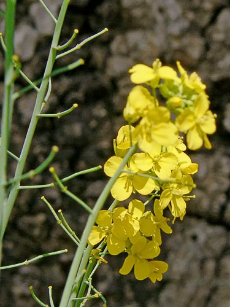
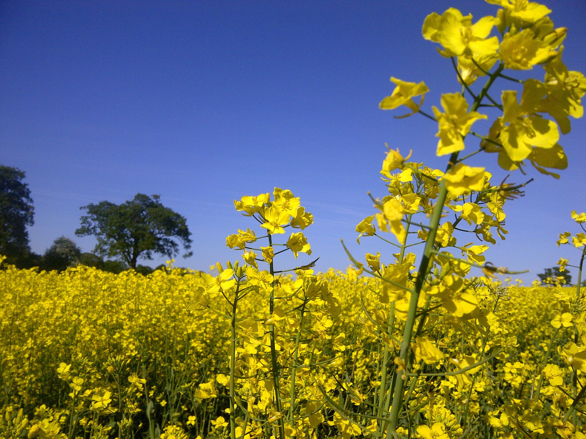
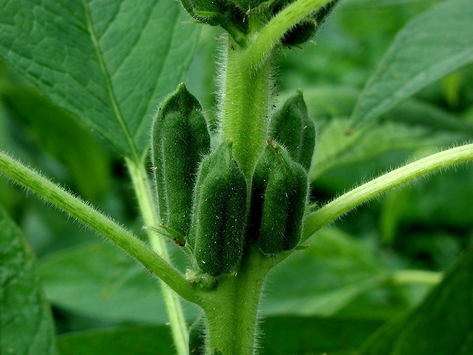
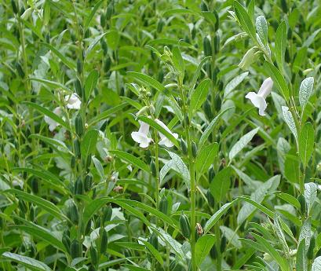
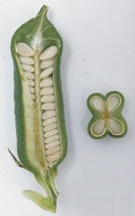
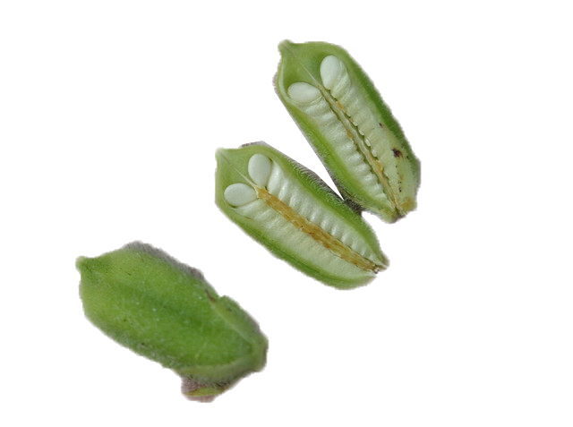
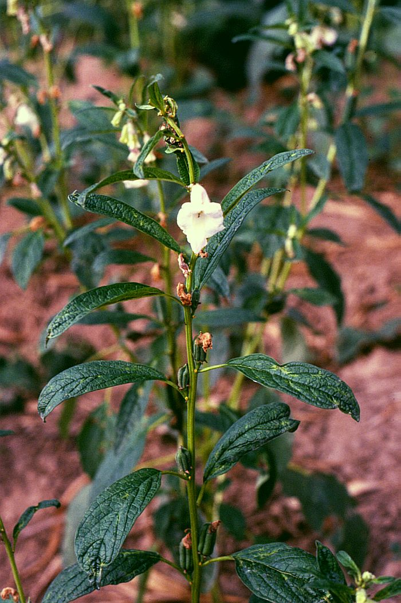
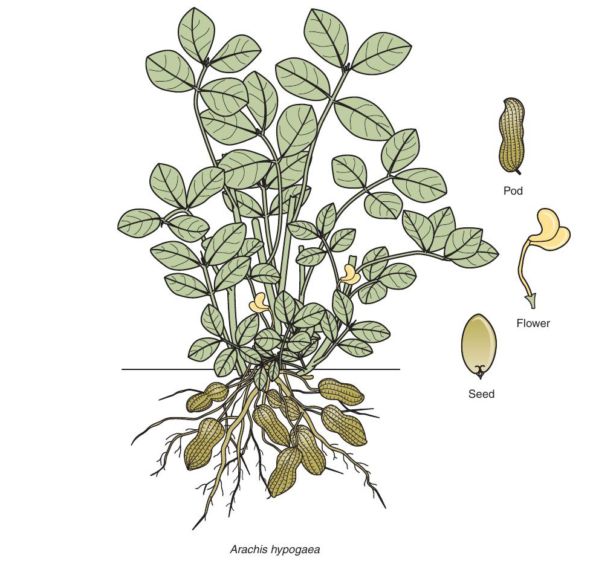
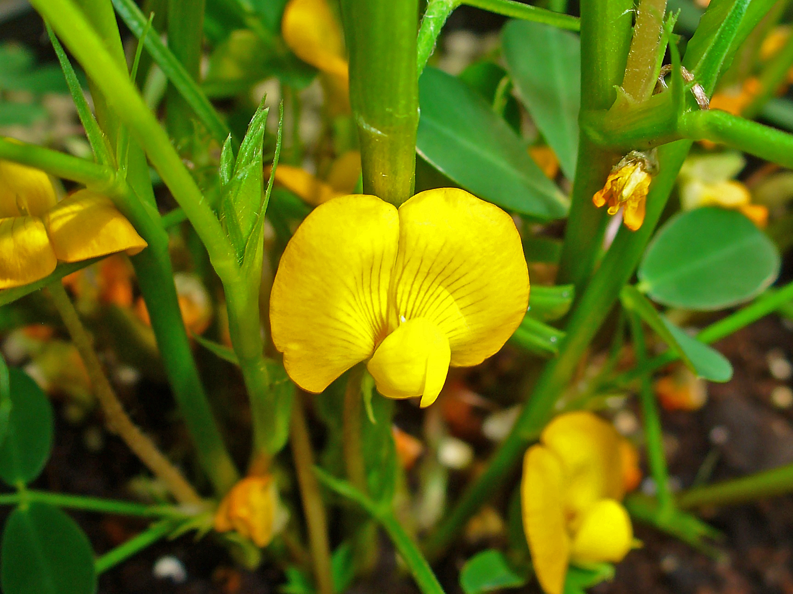
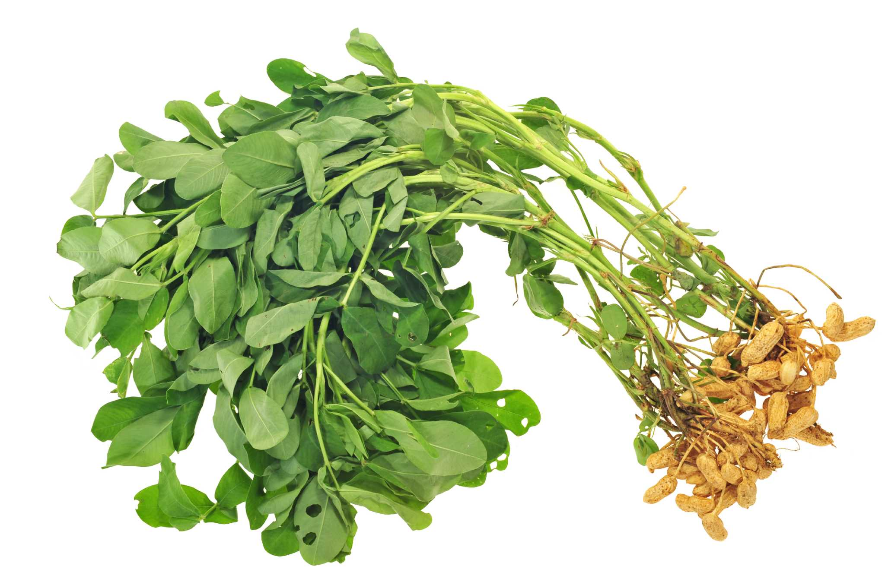

# Agronomy

## Farming system

Farm is a piece of land with specific boundaries, where (...283 pp)

## Effects of climatic factors on crops

Weather refers to the state of atmosphere at any give time denoting the short-term variations of atmosphere in terms of temperature, pressure, wind, moisture cloudiness, precipitation and visibility. It is highly variable, constantly changing, sometimes from hour to hour and at other times from day to day. The afore-mentioned properties of the atmosphere are subject to constant change and their state at any time determines the state of the weather. However, weather elements are not separate rather they are closely related with each other.

Climate on the other hand, is the sum or total of the variety of weather conditions of place or an area. It may be defined as the sum of all statistical weather information of a particular area during a specified interval of time, usually several decades. The WMO has suggested standard period of 31 years for calculating the climatic averages of different weather elements.

The Earth has three spheres viz., 

1. Hydrosphere -- the water portion,
2. Lithosphere -- the solid portion, and 
3. Atmosphere -- the gaseous portion.

The principal gases comprising dry air in the lower atmosphere is given in Table \ref{tab:gases-atmosphere}.

```{r gases-atmosphere}
tribble(
  ~"Constituents", ~"\\% by volume",
  "Nitrogen", 78.08,
  "Oxygen", 20.94,
  "Argon", 0.93, 
  "Carbon dioxide", 0.03,
  "Neon", 0.0018,
  "Helium", 0.0005,
  "Ozone", 0.00006,
  "Hydrogen", 0.00005
) %>% 
  knitr::kable(booktabs = TRUE, caption = "Composition of gases in lower atmosphere by volume", longtable = TRUE, escape = FALSE) %>% 
  kableExtra::kable_styling(font_size = 8, latex_options = "striped") %>% 
  kableExtra::column_spec(1:2, width = c("5em", "4em")) %>% 
  kableExtra::footnote(general = "Besides mentioned, Krypton, Xenon and Methane gas are found in trace amounts in the atmosphere.", threeparttable = TRUE)
```


### Solar radiation

The radiant energy that comes from the sun to earth surface is called solar radiation.

#### Photosynthetic effect

- Solar radiation of wavelength \SIrange{400}{700}{\nano\meter} are most efficiently used in photosynthesis. Also called photosynthetically active radiation (PAR).

- Photosynthesis increases with increasing light intensity upto light saturation point.

- Light compensation point (LCP): The quantity of light where net photosynthesis is zero is called light compensation point.
- Light saturation point (LSP): The quantity of light where photosynthesis is maximum is called light saturation point.

- LSP > \SI{1500}{\micro\mole\per\meter\squared\per\second} PPFD $\longrightarrow$ $\mathrm{C_4}$ plants can utilize.
- LSP == \SIrange{1000}{1500}{\micro\mole\per\meter\squared\per\second} PPFD $\longrightarrow$ $\mathrm{C_3}$ plants can utilize.
- LSP == \SIrange{100}{200}{\micro\mole\per\meter\squared\per\second} PPFD $\longrightarrow$ shade-loving plants can utilize.

The enzymes responsible for photosynthesis are rubisco and PEP-carboxylase. Higher light intensity increases activity and amount of these enzymes. The infrastructure of photosynthesis like Chlorophyll, leaf area and their exposure are governed by light intensity.

- Light of wavelengths <250 and >750 are not useful to plants.

#### Photoperiodic effect

The time period during which any plants are exposed to sunlight is known as photoperiod. The response of plant to photoperiod is known as photoperiodism. Plants flower in response to photoperiod.

- Long day plants: Require longer days, > 12 hours photoperiod for flowering. e.g., Wheat, oat, barley.
- Short day plants: Require short day length < 12 hours photoperiod for flowering. e.g., Rice, maize, soybean.
- Day neutral plants: Plants that have no effect of photoperiod on flowering are day neutral plants. e.g. Sunflower, cotton, buckwheat.

#### Thermal effect

- \>75\% of solar radiation incident on plants is converted to heat.
- This heat is utilized for transpiration and for convective heat exchange with surrounding.
- These exchanges determines the temperature of leaves and other plant parts.

#### Assimilation of nutrients, dormancy and germination

- Utilization of $\mathrm{N_2}$ is higher in light than in dark.
- Uptake of potassium (K) is higher in Barley under high light intensity.
- Accumulation of Phosphorus is higher in Maize in light than in dark.
- Seed dormancy and germination: Lettuce and tobaccoo seeds (photoblastic plants) germinate in presence of light.
- Seeds of onion and amaranthus (non-photoblastic) will remain dormant when exposed to light.

**Other**

- In normal plants, stomata opens under normal light condition, but in CAM plants, stomata opens only at night.
- Plants growing in low light intensity or in dark or in dense spacing are taller and weak. Shading increases auxin (IAA) synthesis and as a result, shaded plants have excessive stem elongation which are prone to lodging.
- Plants grown under low light intensity have more barren spikelets because of reduced grain filling (photosynthesis).

### Temperature

Both the longer wavelengths of earthward solar radiation and long-wave terrestrial radiation, i.e. reflected radiation from the ground, are insufficiently energetic to drive pigment systems such as photosynthesis.

For germination to occur, seeds must be viable, non-dormant and adequately supplied with water and oxygen. For most of the major crop plants so far examined, the initiation of germination in each species requires a minimum base temperature ($\mathrm{T_b}$). Thereafter, germination rate increases linearly with temperature to an optimum value ($\mathrm{T_o}$), above which the rate declines linearly to a maximum temperature ($\mathrm{T_m}$). In some species, this optimum temperature may cover a range of several degrees rather than a single temperature. When the temperature, T, is above $\mathrm{T_b}$ and below $\mathrm{T_o}$ the relation between T and 1/t is given by,

$$
\frac{1}{t} = \frac{T-T_b}{\theta_1}
$$
and when T is above $\mathrm{T_o}$ and below $\mathrm{T_m}$ the relation is given by,

$$
\frac{1}{t} = \frac{(T_m-T)}{\theta_2}
$$
The constants $\theta_1$ and $\theta_2$ represent the thermal duration for the developmental process of germination to occur.

#### Thermal time

Because the quantity $\theta$ is the product of temperature and time it is measured in degree days (\si{\celsius} days) and is called thermal time. In practice, the value of $\mathrm{T_b}$ is usually similar for different developmental processes within a species and thus the thermal time for any process can be defined as,

$$
\theta = \sum^{i = n}_{i = 1}{T-T_b}
$$
where n is the number of days experienced by a plant at a mean daily temperature, T, above $T_b$. Thus, on a day when the temperature remains below $T_o$, the thermal time accumulated by a crop is simply the difference between the mean daily temperature and the value of $\mathrm{T_b}$.

```{r cardinal-temperature-major-crops}
read_csv("./data/weather/agronomy_cardinal_temperature_major_crops.csv",
         show_col_types = FALSE) %>% 
  knitr::kable(booktabs = TRUE, caption = "Cardinal temperature of major agronomical crops", longtable = TRUE) %>% 
  kableExtra::kable_styling(latex_options = "striped", font_size = 8) %>% 
  kableExtra::column_spec(column = 1:4, width = rep("5em", 4))
```

```{r rice-temperature-growth-stages}
read_csv("./data/weather/agronomy_optimum_temperature_requirements_rice_stages.csv",
         show_col_types = FALSE) %>% 
  knitr::kable(booktabs = TRUE, caption = "Optimum temperature requirements for rice", longtable = TRUE, 
               col.names = c("Growth stages", "", "Temperature in \\si{\\celsius}", ""), escape = FALSE) %>% 
  kableExtra::kable_styling(latex_options = "striped", font_size = 8) %>% 
  kableExtra::column_spec(column = 1:4, width = rep("5em", 4))
```

**Effect of temperature on biochemical reaction**

From $\mathrm{T_{min}}$ to $\mathrm{T_{opt}}$ rate of process increases with temperature but after increase from $\mathrm{T_{opt}}$, it decreases rapidly. It is because increase in temperature increases the velocity of enzymes from $\mathrm{T_{min}}$ to $\mathrm{T_{opt}}$. As temperature further increases, the enzyme structure is damaged and rate of reaction is reduced.

$$
\mathrm{Q_{10}} = \frac{\textrm{Rate of reaction at T + 10 \si{\celsius}}}{\textrm{Rate of reaction at T \si{\celsius}}}
$$

**Effect on photosynthesis and respiration**

- Photosynthesis and rate of respiration increase with temperature.
- Above optimum temperature photosynthesis declines but respiration continues to increase.
- Temperature has considerable influence on chlorophyll synthesis and leaf area development.
- Temperature enhances the production of chloroplasts.
- At lower temperature, leaf becomes chlorotic due to degradation of chlorophyll.

### Rainfall

```{r precipitation-classification}
read_csv("./data/weather/agronomy_rainfall_classification.csv", show_col_types = FALSE) %>% 
  knitr::kable(caption = "Rainfall classification rainfall pattern", escape = FALSE, longtable = TRUE, booktabs = TRUE) %>% 
  kableExtra::kable_styling(latex_options = "striped", font_size = 8) %>% 
  kableExtra::column_spec(column = 1:2, width = c("6em", "6em")) %>% 
  kableExtra::footnote(general = "The mentioned classification is true for Southern India; For Nepal, rainfall values are 250 mm less for each climatic region.", threeparttable = TRUE)
  
```

## Weather normals for agricultural crops

```{r weather-normals-food-cash}
read_csv("./data/weather/agronomy_crop_weather_normals.csv", show_col_types = FALSE) %>% 
  select(-1) %>% 
  knitr::kable(caption = "Weather normals for agronomic crops", escape = FALSE, longtable = TRUE, booktabs = TRUE, align = "l") %>% 
  kableExtra::kable_styling(latex_options = "striped", font_size = 8) %>% 
  kableExtra::column_spec(column = 2:7, width = c("8em", "6em", "8em", "6em", "5em", "6em"))
```

(for a brief discussion on Weather Forecasting, including its types, refer to "A textbook of Agronomy")

## Clouds

Clouds have been defined as a visible aggregation of minute water droplets and/or ice particles in the air, usually above the general ground level.

### Classification of clouds (WMO classification, 1957)

Clouds are usually classified according to their height and appearance into 10 categories. From the height, clouds are groped into 4 categories ( _viz_. family A, B, C and D), and there are sub categories in each of these main categories.

**Family A**: High clouds (mean heights 5-13 km) (Mean lower level 2000 ft.)

**Cirrus (Ci)** -- In these clouds, ice crystals are present. It looks like wispy and feathery, and it is delicate, desist, white fibrous, and silky appearance. Sunrays pass through these clouds and sunshine without shadow. It does not produce precipitation.

**Cirrocumulus (Cc)** -- Like cirrus clouds, ice crystals are present in these clouds also. It looks like rippled sand or waves of the seashore. It contains white globular masses and transparent with no shading effect. The sky is mackerel sky.

**Cirrostratus (Cs)** -- Like the above two clouds, ice crystals are present in these clouds also. It looks like whitish veil and covers the entire sky with milky white appearance. It produces "Halo".

**Family B**: Middle clouds (Mean heights 2–7 km) (6500–20000 ft.)
- Altostratus (As)
- Altocumulus (Ac)

**Family C**: Low (clouds mean heights 0–2 km) (Close to earth’s surface–6500 ft.)
- Nimbostratus (Ns)
- Stratocumulus (Sc)
- Stratus (St)

**Family D**: These clouds form due to vertical development i.e. convection. The mean low level is 0.5 km and mean upper level goes upto 16 km. In this families, there are 2 sub-categories;

- Cumulus (Cu): These clouds are composed of water with white majestic appearance with flat base. Irregular dome shaped and looks like cauliflower with wool pack and dark appearance below due to shadow. These clouds usually develop into cumulo-nimbus clouds with flat base.
- Cumulonimbus(Cn): The upper levels of these clouds possess ice and water is present at lower levels. These clouds have thunderhead with towering anvil top and develop vertically. These clouds produce violent winds, thunderstorm, hails and lightening, during summer.

## Released, registered and denotified varieties overview

```{r overview-seeds}
readxl::read_xlsx("./data/varietal_notification_status.xlsx") %>% 
  select(SN:Denotified) %>% 
  knitr::kable(caption = "Overview of released, registered and denotified varieties of crops", booktabs = TRUE, longtable = TRUE, col.names = c("SN", "Crop", "Released", "Registration", "Total number (as of 2074-12-12)", "Total number (as of 2075-08-24)", "Denotified")) %>% 
  kableExtra::kable_styling(latex_options = c("striped", "HOLD_position"), font_size = 8) %>% 
  kableExtra::column_spec(column = 2:7, width = c("6em", "5em", "5em", "8em", "8em", "6em"))
```

## Recent addition to notified varieties

## Recently denotified varieties

- For a more complete listing, refer to publicdata repository for the [list of denotified varieties](https://raw.githubusercontent.com/DeependraD/publicdata/master/crop_varieties/denotified_varieties.csv).
- Also the [Seed Quality Control Centre](http://sqcc.gov.np/en) is the authentic government body that routinely updates by enlisting crop variety database and publishing seed related information.

## Varietal description of some common rice and maize varieties

```{r rice-varieties}
read_csv("./data/rice_variety_description.csv", skip = 2,
         show_col_types = FALSE) %>% 
  knitr::kable(booktabs = TRUE, caption = "Varietal description of recently released rice varieties", escape = FALSE) %>% 
  kableExtra::kable_styling(font_size = 8, latex_options = "striped") %>% 
  kableExtra::column_spec(column = 3:11, c(rep("5em", times = 7), "8em", "12em")) %>% 
  kableExtra::landscape(margin = "1.5cm")
```

<!-- \scalebox{0.7}{\begin{minipage}{1.0\textwidth} -->

```{r maize-varieties}
read_csv("./data/maize_variety_description.csv", skip = 2,
         show_col_types = FALSE) %>% 
  knitr::kable(booktabs = TRUE, caption = "Varietal description of recently released maize varieties", escape = FALSE) %>% 
  kableExtra::kable_styling(font_size = 8, latex_options = "striped") %>% 
  kableExtra::column_spec(column = 3:12, rep("5em", times = 10)) %>% 
  kableExtra::landscape(margin = "1.5cm")
```

<!-- \end{minipage}} -->

## Crop production status and ranking

```{r crop-production-status}
read_csv("./data/crop_production_rankings.csv", skip = 1,
         show_col_types = FALSE) %>% 
  arrange(Region, Crop) %>% 
  select(-SN) %>% 
  relocate(Region, .before = 1) %>% 
  knitr::kable(booktabs = TRUE, caption = "Production status rankings of major crops", longtable = TRUE) %>% 
  kableExtra::kable_styling(font_size = 8) %>% 
  kableExtra::collapse_rows(columns = 1, row_group_label_position = "identity") %>% 
  kableExtra::column_spec(column = 1:4, width = c("3em", "4em", "10em", "12em"))
```


## Challenges and opportunities of enhancing rice production in Nepal

Rice supplies about 40% of the total calorie intake for people. In Nepal, approximately 70% of agricultural holdings were planted with paddy. Fertilizer was used by 20% of the holdings. Chemical fertilizer was used in 41% of the total area under rice (CBS, 2013).

- Fully or partially irrigated rice ecosystem: 63.6%
- Rainfed rice ecosystem: 36.4%
- Production distribution for different agroecologies, in general is:
  - Terai: 75%
  - Hills: 23%
  - Mountain: 2%

### Constraints and challenges

1. Biotic and abiotic stress
- Abiotic: Drought, submergence, heat and flooding in terai region
- Biotic: Bacterial leaf blight, Blast, Brown plant hopper, Stem borer
- These factors account for about 25% of the yield reduction
- Nepal had drought problem in years: 1964, 1967, 1973, 1974, 1977, 1979, 1980, 1992, 1994, 2001, 2002, 2005, 2006 and 2009 (MoPE, 2002 and MoHA, 2009)
- Dry spells occured during: 2000, 2002, 2004, 2005, 2006, 2009, 2010, 2011, 2013

2. Rainfed farming
- Planting and production dependent upon timing and intensity of monsoon rainfall (during mid June untill mid September)
- To produce 1 kg of rice, 2500 ltr of water needs to be supplied over the growing period.
- Depleting ground water level in terai region

3. Low level of productivity
- In past 30 years, rice area and yield increased annually by only 0.35 and 1.65% respectively (only 83% from yield increase, and 17% from area increase)
- Area growth has been highest in hills during 1984-2013 while yield growth has been the lowest in the same region.
- Although the area covered by modern varieties is over 90%, growth in yield has been very slow and marginal.

4. Soil degradation and soil nutrient management
- Nutrient imbalance, multi-nutrient deficiency, water logging, Zinc and Iron toxicity, soil salinity and alkalinity and development of hard pans at shallow depths
- Low nitrogen use efficiency (70% is lost and only 30% of the applied nitrogen is available)
- Prospects for use of organic matter, biological nitrogen fixation and Integrated Plant Nutrient Management System (IPNMS) seem advantageous.
- Chemical fertilizer associated environmental damage due to inadequacy or due to oversaturation.
- Zinc deficiency in lowland rice fields with soil of neutral to alkaline pH levels.

5. Climate change
- Frequent drought, flooding and erratic rainfall
- Increase in temperature above current mean temperature for condition cetaris paribus are expected to reduce yields by 7% for every \SI{1}{\celsius} increase in temperature
- However, increasing concentration of $CO_2$ is expected to increase yield and water productivity (number of panicles and grain filling percentage)
- Rice field has higher $\mathrm{CH_4}$ emission and low $\mathrm{N_2O}$ emission.

6. Declining production resources

- As a consequence of economic growth, rice cultivation areas are expected to be lost to urban expansion, land conversion to other purposes and diversification into other agricultural products.
- Rice area declined from 1,544,604 ha in 2001 to 1,456,000 ha in 2001 (6% decline).
- This adds urgency for the need to improve productivity.

7. Investment in research
- Historically, research has received low priority
- Research institutions for rice research have very limited resource and insufficient technical capacity to conduct and coordinate research activities.
- Overall research cost has declined for Rice, wheat and maize in real terms over the past 10 years.

8. Infrastructures and service delivery

- Total number of farming household is 3.8 million
- Ratio of JT/JTA to farm household: 1:2300
- Deputation of specialized technicians to field level is not in practice.
- Agronomist or general agriculturist takes care of extension related to rice production and post-harvest related matters.
- Market centers developed in different parts of country are mostly used for perishables (vegetables, fruits and milk)
- Facilities of private owners are operated in their own convenience, and do not provide safeguard against post-harvest losses.
- Major constraint is on linking rice produce from farmers' field in rural areas to markets and to home.
- Nepal's road density is the lowest in South asian region (Only 0.6 km of road per 1000 people, compared to 6.5 km in Bhutan, 4.7 km in Srilanka andd 3.0 km in India) (ADB, 2009)

9. Fragmentation of land holding and poor mechanization
- Total land holding in Nepal has increased from 1654,000 ha in 1971 to 2522,000 ha in 2011.
- Average size of holding decreased from 1.13 ha in 1981 to 0.68 ha in 2011.
- Land availability is becoming limited due to competition for industrilization, urbanization and expansion of residential areas to production field.

10. Markets and prices
- Lack of marketing infrastructures, non-provision of minimum support price (MSP), Lack of storage facilities, price fluctuation due to open border, etc.

11. Variety release and adoption
- Share of specified new improved varieties (released after 1990) in total area is only around 35%. (CBD, 2015)

12. Profitability of rice production
- Gross margin varies with price per unit of input and per unit of output. There has been sharp increase in the wage rate and price of inputs compared to increase in yield and farm gate price.
- During last 13 years,
  - Wage rate has increased 339%
  - Price of seed has increased 345%
  - Price of fertilizer increased between 53%-140%
  - Yield increased 46% 
  - Farm gate price increased 126%

## Oilseed crops production

### Mustard (*Brassica napus*)

#### Introduction

```{r names-oilseeds, results="asis"}
b_name <- readxl::read_xlsx("./data/oilseeds.xlsx", sheet = "names", col_names = TRUE)
knitr::kable(b_name, align = "l", caption = "Oilseed crops", booktabs = TRUE, longtable = TRUE) %>%
  kableExtra::kable_styling(latex_options = c("striped", "HOLD_position"), position = "center") %>%
  kableExtra::column_spec(column = 2, italic = TRUE, color = "blue") %>% 
  kableExtra::column_spec(column = 4, width = "12em")
```

- Domestication took place in Asia
- The leftover meal after pressing out the oil has also been found to be an effective pesticide
- Used in production of biodiesel
- White mustard (*Sinapis alba*) is useful crop for supression of nematodes
- Crops of genus Brassica are called cole crops
- *B. carinata*, *B. juncea*, *B. oleracea*, *B. napus*, *B. nigra*, and *B. rapa*, all evolved by combination of chromosomes from three earlier species.
- They provide high amounts of vitamin C and soluble fiber and contain nutrients with anticancer properties: 3,3'-diindolylmethane, sulforaphane and selenium.
- Contain modulator of the innate immune response system with potent antiviral, antibacterial and anticancer activity.
- Contain goitrogens

#### Botany

```{r rape-flowers, out.width="40%", fig.ncol = 2, fig.cap="Inflorescence and flowering field of brassica", fig.subcap=c("Inflorescence of Brassica plant", "Blooming field of Brassica crop")}


```

- The plants and seeds of all brassica oilseeds contain glucosinolates, which are secondary metabolites that serve as chemical protectants.
- In the warmer semitropical regions, *B. juncea* and *B. rapa* predominate
- In cooler temperate regions, *B. napus* and *B. rapa* predominate.
- Natural hybridization occurs readily between different species.

#### Climate and Soil

- Grown as winter season crop in Nepal and India.
- Requires \SIrange{18}{25}{\celsius}, low humidity.
- Rainfall during flowering is undesirable.
- High RH and rainfall increase incidence of insects and diseases.
- Excessive cold and frost harmful.
- Thrive best in medium or heavy loam soils.
- Sensitive to water logging.
- Good tolerance to saline and alkaline soils.

#### Varieties

```{r rapeseed-vars, results='asis'}
rapeseed <- readxl::read_xlsx("./data/oilseeds.xlsx", sheet = "rape_vars", skip = 1)

knitr::kable(rapeseed, align = "l", 
             caption = "Rapeseed varieties released till date", booktabs = TRUE, longtable = TRUE) %>%
  kableExtra::kable_styling(latex_options = "striped", position = "center") %>% 
  kableExtra::column_spec(c(3, 5), width = c("6em", "16em"))
```

### Sesame (*Sesamum indicum*)

#### Introduction

```{r sesamum-fruit, out.width="60%"}

```


```{r sesamum-tax, results="asis"}
structure(list(V1 = structure(c(4L, 1L, 1L, 1L, 5L, 2L, 3L, 6L
), .Label = c("Clade", "Family", "Genus", "Kingdom", "Order",
"Species"), class = "factor"), V2 = structure(c(7L, 2L, 4L, 3L,
5L, 6L, 8L, 1L), .Label = c("\\textit{S. indicum}", "Angiosperms", "Asterids",
"Eudicots", "Lamiales", "Pedaliaceae", "Plantae", "Sesamum"), class = "factor")), .Names = c("V1",
"V2"), class = "data.frame", row.names = c(NA, -8L)) %>%
  knitr::kable(caption = "Scientific classification of Sesamum", col.names = NULL, booktabs = TRUE, escape = FALSE, longtable = TRUE) %>%
  kableExtra::kable_styling(latex_options = c("striped"))
```

- Derived from Latin "sesamum" or Greek "sesamon"
- Annual flowering plant, also called *benne*
- Wild relatives occur in Africa and India, with the origin of cultivated *S. indicum* traced India.
- Natural crop of tropical regions, cultivated for its edible seeds, which grow in pods or "buns"
- One of the oldest oilseed crops known
- Oil has nutty flavor, and is ingredient in cuisines across the world
- Often sold decorticated (seed coat removed) for baking

```{r sesame-nutrition, results="asis", warning=FALSE, message=FALSE}
readxl::read_xlsx("./data/oilseeds.xlsx", sheet = "sesame_nutrient", skip = 1, col_names = TRUE) %>%
  knitr::kable(col.names = NULL, booktabs = TRUE, caption = "Nutrient content of sesame seeds (per 100 g serving)", longtable = TRUE) %>%
  kableExtra::kable_styling(latex_options = "striped")
```

#### Botany

```{r sesame-bot, out.width="60%"}

```

- Grows upto 50-100cm
- Has opposite leaves 4-14cm with entire margin; lanceolate, narrowing at the base of the plant to just 1 cm.
- Flowers are yellow, tubular, 3-5cm long with four-lobed mouth; flowers vary in color(white, blue, or purple).
- Seeds occur in many colors.
- Fruit is capsule, normally pubescent, rectangular in section, typically grooved with a short, triangular beak.
- Length of the fruit capsule varies from 2-8 cm.
- Number of loculi varies from 4 to 12.
- Fruit is dehiscent, splitting along the septa.
- Seeds 3-4mm long by 2mm wide, ovate, slightly flattened.

```{r sesamum-bot, fig.ncol = 2, fig.cap = "Vegetative and reproductive parts of sesamum", out.width="30%", fig.subcap = c("Sesamum fruit", "Sesamum plant")}

# 

# 
```

#### Climate and Soil

- Tolerant to drought-like conditions.
- Adapted to many soil types. Best on well-drained, fertile soils of medium texture and neutral pH.
- Low tolerance to salinity, and water logging.
- Require 90-120 frost free days. Warm conditions above \SI{23}{\celsius} favor growth and yields.
- Flowering initiation is sensitive to photoperiod, as is the oil content.
- Oil content is inversely proportional to its protein content.
- Rainfall late in the season is particularly harmful (prolongs growth and increases dehiscence loss).

#### Varieties

```{r sesame-vars, results='asis'}
sesame <- readxl::read_xlsx("./data/oilseeds.xlsx", sheet = "sesame_vars", skip = 1)

knitr::kable(sesame,
             align = "c",
             caption = "Sesame varieties released till date", 
             booktabs = TRUE) %>% 
  kableExtra::kable_styling(latex_options = c("striped", "scale_down"), position = "center")
```

#### Field preparation

- Ploughed with tractor twice or 3-4 times with country plough.
- In rice fallows, ploughing done once to retain residual moisture and sown immediately.

#### Fertilizer and manuring

### Groundnut (*Arachis hypogea*)

```{r peanut-full, out.width="60%"}

```

#### Introduction

- Originated either in Africa or Brazil of South America.
- Introduced to other parts of world by the Spanish and Portuguese.
- Dug, extracted, processed and consumed as a snack food, peanut butter, and a candy.
- Seed contains 45-50% oil content.
- Pressed for oil extraction. Oil used for margarine, salad dressings, and cooking oil.
- Cake fed to livestock.
- Manufacture of paint and cosmetics.
- The perennial species (*Arachis glabarata*) is used as a forage legume, or as cover crop.
- Some people are allergic.

#### Botany

- Plant is decumbent, with stems extremely inclined, and with the tips raised, reach upto 18 inches in height.
- Pinnately compound leaf with two pair of leaflets.
- Flowers yellow in color, borne in leaf axils of the stems.
- After pollination, the ovary elongates to produce a **peg** that buries the ovary into the soil, which matures and hardens into a shell containing the peanuts.

```{r groundnut-bot, fig.cap="Floral part and economic parts of Groundnut", fig.ncol = 2, out.width="40%", fig.subcap=c("Flower of groundnut", "Groundnut plant")}


```

#### Climate and Soil

- Grows best in tropical and subtropical climates, having warm growing-season temperature, adequate rainfall, and long growing season.
- Well-drained, sandy soils that allow formation of the peanut are required.
- Needs about $70-90^oF$ temperature during its growing period with cold nights for maturity.
- Areas receiving well distributed annual rainfall of 500-1250 mm.
- Requires plenty of calcium in soil.
- pH: 5.0-8.5

#### Varieties

```{r groundnut-vars, results='asis'}
groundnut <- readxl::read_xlsx("./data/oilseeds.xlsx", skip = 1, sheet = "groundnut_vars")

knitr::kable(groundnut, align = "c",
             caption = "Groundnut varieties released till date", 
             booktabs = TRUE) %>% 
  kableExtra::kable_styling(latex_options = c("striped", "scale_down"), position = "center")
```

#### Land preparation

- Require weed free well pulverized, open and aerated, levelled seed-bed for sowing.
- 2 tills with a local plough, followed by two harrowings and  planking required.
- Fields infested with white grubs need to be remedied with Heptachlor or Chlordane (\@ \SI{25}{\kilogram\per\hectare}) before final harrowing.

#### Manuring

- Does not require high does of chemical fertilizers.
- FYM/compost
  - Rainfed: \SI{6.25}{\tonne\per\hectare}
  - Irrigated: \SI{12.5}{\tonne\per\hectare}
  - 10-20, $P_2O_5$: 40, $K_2O$: \SI{40}{\kilogram\per\hectare}
- Nitrogen applied best as $(NH_4)_2SO_4$ or Calcium ammonium nitrate, P as SSP and K as MOP.
- Nitrogen applied in splits in very light soils.
- Correction for B, Mo, S, Zn and Ca deficiencies by 5 kg Borax, 1 kg Ammonium molybdate, 15-20 kg $ZnSO_4$ and 200-500 kg gypsum per hectare. While others are basally applied gypsum is band placed 30 DAS.
- Gypsum (\SI{400}{\kilogram\per\hectare}) applied on second hoeing/interculture (40-45 DAS).

#### Seed treatment

- Seeds should be free from diseases and of damage.
- Kernels treated with Captan or Thiram (Slurry made by mixing 125 g Thiram/100 kg kernel in 500 ml water)
- Some varieties have a dormancy state, therefore a storage requirement.
- Rhizobium biofertilizer: For 50 kg of kernels, 10% solution of gum Arabic is prepared in water, Jaggary is added to make a solution of 5%. When it dissolves, 2-3 packets (200 g each) of peat based culture is added, groundnut kernels are poured and agitated with the content to make a slurry. As all kernels coat the slurry uniformly, they are spread out on newspaper sheets in the shade.

#### Sowing

- Time of sowing:
  - Irrigated: April-July
  - Rainfed: June 20-July 31
- Seed rate
  - Spreading type: \SIrange{60}{70}{\kilogram\per\hectare}
  - Bunching type: \SIrange{85}{90}{\kilogram\per\hectare}
- Method of sowing: Either by dibbling the seeds behind the plough or by using a seed drill. In irrigated crops, ridges and furrows and better prepared.
- Sowing depth: 5-8 cm in light soils, 4-6 cm in moderate to heavy soils.
- Spacing:
  - Spreading type or irrigated: 50 cm x 15-20 cm
  - Bunching type or rainfed: 20-30 cm x 8-10 cm

#### Irrigation

- When grown as kharif season crop (April-July): 500-700 mm water.
- At frequency of 8-12 days.
- Critical stages: flowering pegging and pod formation.
- Stopped 20-25 days prior to maturity.

#### Weed management

- May cause yield reductions to extent of 20-40%.
- First hand weeding on 20-25 DAS, next 15 days later.
- The bunching type should be given a light earthing to facilitate maximum peg penetration into the soil.
- TOK-E-25 or Lasso (5 ltr of commercial material dissolved in 500 ltr water) as pre-emergence soil spray within 2-3 DAS.

#### Harvesting

- Indicators:
  - Yellowing and shedding of leaves
  - Development of proper color of shell and a dark tint on the inner side of the shells.
  - Usually takes 120-140 days to mature.
- Usually carried out in October-November.
- Bunching types are hand-pulled, spreading types are dug.
- Storage time moisture should not be more than 5%.
- Higher moisture favors fermentation and development of *Aspergillus flavus* mould in the kernel.

#### Yield

- Irrigated: \SIrange{3}{3.5}{\tonne\per\hectare}
- Rainfed: \SIrange{1.5}{2.0}{\tonne\per\hectare}
- Shelling percentage: 70-75\%

## Cereal and commercial crops production

```{r crop-cultivation-cereal-commercial-remarks}
read_csv("./data/crop_production_technology_cereal_commercial.csv",
         show_col_types = FALSE) %>% 
  knitr::kable(booktabs = TRUE, caption = "Summary of production remarks on cultivated crops (Cereal and commercial)", longtable = TRUE) %>% 
  kableExtra::kable_styling(font_size = 5, position = "center", latex_options = "striped") %>% 
  kableExtra::column_spec(column = 1:12, width = c("12em", "12em", rep("10em", 10))) %>% 
  kableExtra::landscape(margin = "1cm")
```

## Oilseed and legume crops production

```{r crop-cultivation-legume-oilseed-remarks}
oil_joined <- tibble(`Production remark` = c("Time of sowing", "Seed rate (kg/ha)", 
                                             "Spacing (cm)", "NPK (kg/ha)", "Seed yield (ton/ha)"), 
                     `Mustard/rapeseed/sarsoon` = c("Mid September - Mid October", 
                                                    "5-8", "30 x 7.5 - 10", "60:40:20", "1.5-2.0"), 
                     Groundnut = c("Mid June - 1st Week of July", 
                                   "Spreading type: 60-80; Bunchy type: 80-100", "45-60 x 10-15; 30 x 10 - 15", 
                                   "20-40:50-60:20-40", "1.5-2.0"), 
                     Sesamum = c("First week of June - First week of July", 
                                 "2.5-5.5", "30-45 x 15-22", "30:60:30", "0.2-0.6"), 
                     Sunflower = c("Rainy, 1-15 July; Spring, 1-15 March", 
                                   "8-10", "60 x 20", "60-80:40-60:20-40", "1.5"), 
                     Niger = c("Mid July (June-August)", 
                               "6-8", "30 x 15", "20:20:10", "0.3-0.4"), 
                     Linseed = c("First week of October - Mid November", 
                                 "30-35", "22-30 x 5-6", "50:40:30", "1.0-1.9"))

leg_oilseed <- read_csv("./data/crop_production_technology_legume_oilseed_other.csv",
                        show_col_types = FALSE)

leg_oilseed %>%
  left_join(oil_joined) %>%
  rows_upsert(oil_joined %>% # update the values in x from y and and also insert missing rows from y.
                left_join(leg_oilseed)) %>%
  select(`Production remark`, Lentil, Blackgram, Moongbean, Pigeonpea, Cowpea, Chickpea, Pea, Soybean) %>% 
  knitr::kable(booktabs = TRUE, caption = "Summary of production remarks on cultivated crops (Legume)", longtable = TRUE) %>% 
  kableExtra::kable_styling(font_size = 6, latex_options = "striped", position = "center") %>% 
  kableExtra::column_spec(column = 1:9, width = c("14em", rep("11em", 8))) %>% 
  kableExtra::landscape(margin = "1cm")

leg_oilseed %>%
  left_join(oil_joined) %>%
  rows_upsert(oil_joined %>% # update the values in x from y and and also insert missing rows from y.
                left_join(leg_oilseed)) %>%
  select(`Production remark`, `Mustard/rapeseed/sarsoon`, Cotton, Sunflower, Groundnut, Linseed, Sesamum, Niger) %>% 
  knitr::kable(booktabs = TRUE, caption = "Summary of production remarks on cultivated crops (Oilseeds)", longtable = TRUE) %>% 
  kableExtra::kable_styling(font_size = 6, latex_options = "striped", position = "center") %>% 
  kableExtra::column_spec(column = 1:8, width = c("14em", rep("12em", 7))) %>% 
  kableExtra::landscape(margin = "1cm")
  
read_csv("./data/crop_production_technology_legume2.csv",
         show_col_types = FALSE) %>% 
  knitr::kable(booktabs = TRUE, longtable = TRUE) %>% 
  kableExtra::kable_styling(font_size = 6, latex_options = "striped", position = "center") %>% 
  kableExtra::column_spec(column = 1:9, width = c("10em", rep("12em", 8))) %>% 
  kableExtra::landscape(margin = "1cm")
```

## Optimum pH range for some crops

```{r crop-cultivation-ph}
readr::read_csv("./data/crop_production_ph_optimum.csv",
                show_col_types = FALSE) %>% 
  mutate(half_sep = ifelse(row_number() < ceiling(nrow(.)/2), 1, 2)) %>% 
  group_by(half_sep) %>% 
  mutate(row_id = 1:n()) %>% 
  ungroup() %>% 
  pivot_wider(names_from = half_sep, names_glue = "{.value}_{half_sep}", values_from = c(pH, crop), values_fill = list(value = 0)) %>% 
  select(-row_id) %>% 
  relocate(pH_1, .after = crop_1) %>% 
  relocate(pH_2, .after = crop_2) %>% 
  knitr::kable(booktabs = TRUE, col.names = rep(c("Crop", "pH"), times = 2), longtable = TRUE) %>% 
  kableExtra::kable_styling(latex_options = "striped", font_size = 8)
```


## Crop varieties remarks

### Crop varieties with special characteristics

```{r crop-notable-varieties}
readr::read_csv("./data/crop_notable_varieties.csv",
                show_col_types = FALSE) %>% 
  rename_all(function(x)str_to_sentence(str_replace_all(x, "_", " "))) %>% 
  select(-1) %>% 
  knitr::kable(booktabs = TRUE, longtable = TRUE) %>% 
  kableExtra::kable_styling(font_size = 8) %>% 
  kableExtra::collapse_rows(1) %>% 
  kableExtra::column_spec(column = 1:3, width = c("8em", "10em", "24em"))
```

## Seed certification system

- Seed act was first enacted in 2045 BS. Since then it's first amendment came into being in 2064.
- Organized seed production program intitiated in Nepal in 1973 (Wheat)
- 90\% of the seeds are supplied through informal sector (SQCC, 2011).
- Seed replacement rate of cereals: 9.75\% (SQCC, 2011)
- SRR for vegetable crops was as high as 66% in 2009 (NSV)
- Seed vision, 2013-2025 published by SQCC, Nepal has envisioned improvement in SRR during the implementation period, with
  - Cereals: 25% SRR
  - Vegetables: 90% SRR

```{r seed-replacement-rate-crops}
tribble(~"Crop", ~"SRR (percent, 2009)", ~"SRR (percent, 2010)", 
        "Paddy", 9.14, 11.38,
        "Maize", 6.54, 9.03,
        "Wheat", 9.4, 11.0,
        "Millet", 1.97, 2.35,
        "Lentil", 3.08, 3.26,
        "Oilseeds", 2.62, 2.86,
        "Vegetables", 66.3, 68.3,
        "Potato", 5, 5.5,
        "Average (cereals)", 8.78, 10.68) %>% 
  knitr::kable(booktabs = TRUE, caption = "Seed replacement rate of different crops (SQCC, 2010).") %>% 
  kableExtra::kable_styling(latex_options = "striped") %>% 
  kableExtra::add_footnote(label = c("Source: SQCC, 2011 as cited in Seed vision, 2013-2025."))
```


- Establishment of agriculture input corporation: 1974
- In 1960, High yielding variety of wheat Lerma-52 was released.
- In 1962, Seed testing laboratory was established under Agronomy Division, Khumaltar.
- In 1964, Central Seed Lab of Nepal was designated membership with International Seed Testing Association (ISTA).
- In 1966, Seed testing laboratory moved to Agri-Botany Division.
- In 1966, Rice variety CH-45 was released.
- In 1974, AIC established under Corporation Act, 1965.
- In 1980, Seed production and input storated project (SPISP, USAID) launched
- In 1982, Seed technology and improvement programme
- In 1984, Central seed science and technology division established
- In 1988, Seed act enacted
- In 1997, National seed policy approved
- In 1998, Seed production guidelines published
- In 2001, Seed quality control center established
- In 2002, National seed company limited established
- In 2010, Seed science and technology division revived as central disciplinary division of seed in NARC
- In 2013, Promulgation of seed regulation, 2013
- In 2004, First hybrid of maize -- Gaurav, was officially released.
- In 2010, First hybrid of tomato -- Srijana, was registered
- Upto 2010, 231 hybrids were registered for cultivation in Nepal.


Two step certification/authentication system is practiced in Nepal:

1. Seed certification: Official body responsible for certifying seed in the SQCC. Three classes of seeds are identified: Foundation, Certified-I, Certified-II and Improved under this system.

Following activities are carried out in various stages of a crop are crucial for inspection by a seed inspector:

  - Standing crop: By licenced inspector, for field inspection check for crop's source and seed class, purity, isolation distance, seed affecting diseases, weed and type of varieties.
  - At harvest: Threshing, processing, transporation and storage.
  - After processing: To verify that minimun quality meets, insect damage (In legume: and maize: 1% and other crops: 0.5%), seed moisture, weed and off type seeds, germination percentage
  - Seed is sampled and taken to lab
  - Lab should return results within 30 days of receiving a sample.
  - If suspected, sample may be subjected to grow out test by the tester.
  - If farmer isn't convinced of the results of the seed testing, s/he may file for re-certification.

- Tagging storage container with certification tag, with signature of certifying inspector.
- If the seed is to be stored for more than 1 season, the storage sample must be re-certified for quality standards.
- There are some steps to be followed in prolonging the validity of certification. 

- There are two main types of certification:
  1. Minimum standard certification:
    - Location and land requirement fulfilment certification
      - In terai, a minimum of 1 hectares is required for cereal and cash crops.
      - In terai, for vegetables, a minimum of 0.25 hectares is required.
      - In hills, for cereal, a minimum of 0.25 hectare is the necessary criterion.
      - In hills, for vegetables, a minimum of 0.1 ha land should be cultivated with seed under the question.
      - Maximum distance between plots of same certification lot should not exceed 50 m.
  2. Location and locality of specification
  3. Source of seed verification
  4. Timing of inspector assignment

### Seed classes

1. Breeder seed
  - Genetic purity of the variety: 99.9%
  - Golden yellow tag (as of new seed certification guidelines, it is ?brown) with breeder's signature.
2. Foundation seed
  - Not available for sales/purchase at farmer's level
  - SQCC or specialized organization having granted permit from the SQCC performs the field inspection and certification
  - White colored tag with black letters
2. Certified seed
  - In self pollinated crops two generations may be grown, however only one generation is allowed in cross pollinated species
  - CS-I and CS-II (Blue letters in white tag and blue border, and green letters in white tag with green borders, respectively)
3. Improved seed
  - In cross pollinated and highly CP species, direct production of improved seed from foundation seed is also practiced (Maize, vegetable, pigeonpea).
  - Production takes place in farmer's field or by seed producing organizations.
  - Yellow colored tag

- Normally, genetic purity of FS is 99.5 and that of CS is 99%.
- For longer storage in cereals, vegetables, legumes and oilseeds, and orthodox seeds, optimum moisture content: 12% or less.
- In recalcitrant seeds, moisture content is best kept close to 20%.
- In the moisture regime between 5-14%, for every drop in 1% storage life of the seed is doubled (Jems F Herington)
- Forbidden diseases of crops:
  - Cauliflower: Black rot, Alternaria leaf spot

```{r number-of-seed-per-ten-g}
tibble::tribble(~"Crop", ~"Number of seeds", 
        "Carrot", 8280, 
        "Chinese cabbage", 6480,
        "Turnip", 5400, 
        "Tomato", 4140,
        "Onion", 3420, 
        "Pea", 3263,
        "Cabbage, cauliflower", 3240,
        "Brinjal", 2340,
        "Capsicum", 1620,
        "Radish", 1440,
        "Chukandar", 576,
        "Muskmelon", 470,
        "Cucumber", 400,
        "Okra", 180,
        "Watermelon", 75,
        "Luffa gourd", 40
        ) %>% 
  knitr::kable(booktabs = TRUE, caption = "Number of seeds per 10 gram of vegetable crops", longtable = TRUE) %>% 
  kableExtra::kable_styling(latex_options = "striped")
```

\blandscape

### Certification standards

```{r certification-standards-field}
readxl::read_xlsx("./data/seed_certification_requirements.xlsx", sheet = "field_standards") %>% 
  rename_all(function(x)str_replace_all(x, "_", " ")) %>% 
  knitr::kable(caption = "Field standards of standing crop for certification", booktabs = TRUE, longtable = TRUE) %>% 
  kableExtra::kable_styling(latex_options = "striped", font_size = 8) %>% 
  kableExtra::column_spec(column = 1:9, width = c("8em", rep("6em", times = 8)))
```

```{r certification-standards-seed}
readxl::read_xlsx("./data/seed_certification_requirements.xlsx", sheet = "seed_standards") %>%
  select(1:9) %>% 
  rename_all(function(x)str_replace_all(x, "_", " ")) %>% 
  knitr::kable(caption = "Minimum seed standards for certification", booktabs = TRUE, longtable = TRUE) %>% 
  kableExtra::kable_styling(latex_options = "striped") %>% 
  kableExtra::column_spec(column = 1:9, width = c("4em", rep("5em", times = 14)))

# kableExtra::landscape(margin = c("1cm", "1cm", "1cm", "1cm"))

readxl::read_xlsx("./data/seed_certification_requirements.xlsx", sheet = "seed_standards") %>% 
  select(1,10:15) %>% 
  rename_all(function(x)str_replace_all(x, "_", " ")) %>% 
  knitr::kable(caption = "Minimum seed standards for certification", booktabs = TRUE, longtable = TRUE) %>% 
  kableExtra::kable_styling(latex_options = "striped") %>% 
  kableExtra::column_spec(column = 1:9, width = c("4em", rep("6em", times = 14)))
```

\elandscape

## Constraints in Seed Production

1. Climatic and edhapic factors:
- Subtropical type climate range ($26^\circ 22'' - 30^\circ 27''$ N).
- Mean daily temperature: $27-28^\circ C$ during summer and $17-18^\circ C$ during winter.
- 750-2250 mm annual rainfall, large interannual variability, frequent drought, unimodal rainfall distribution
- fragile ecosystem, remoteness, extensive soil mining

2. Weeds
3. Market and trade
- Indian seed market
- Price instability

4. Agronomical
- Seed treatment, seed availability, knowledge of good production package, irrigation facility, fertilizer insufficiency/unavailability, haphazard use of chemical fertilizer.

5. Socio-economic
- Government policy does not prioritize local production.
- Devalued currency and price instability
- Tragedy of free trade policy
- Infrastructure drudgery
- Poor technology adoption
- Low extension workers: farmer ratio
- Government budget allocation and planning for agriculture showing gaps

6. Pests and diseases
- Upto 80% loss due downy mildew in Maize.

#### Insects and diseases of major crops

```{r insect-pests-major}
tibble::tribble(
  ~"Crop", ~"Major insects", ~"Major disease",
  "Rice", "Rice bug, rice hispa, yellow stem borer, stripped stem borer, rice gall midge, mole cricket, plant hopper", "Bacterial blight (Xanthomonas oryzae), Blast (Pyricularia oryzae), False smut (Ustilaginoides virens), Brown leaf spot (Helminthosporium oryzae)", 
  "Wheat", "Armyworm, cutworm, shoot fly, stem borer, termites", "Leaf spots (Helminthosporium spp), rust, leaf streak (Xanthomonas spp), loose smut", 
  "Maize", "Stalk borer, shoot fly, cutworm, jassid, armyworm", "Rust, leaf blight (Helminthosporium maydis), smut (Specealothica reliana)", 
  "Barley", "Green bug, corn sawfly, fruitfly, wheat bulb fly", "Barley yellow dwarf virus, powdery mildew (Erysiphe graminis sp. hordii), Net blotch (Helminthosporium sativum)"
) %>% 
  knitr::kable(caption = "Major disease and insect pests of major cultivated crops in Nepal", booktabs = TRUE) %>% 
  kableExtra::kable_styling(latex_options = c("striped", "HOLD_position")) %>% 
  kableExtra::column_spec(column = 2:3, width = c("12em", "12em"))
```

7. Other factors
- Poor education and low literacy rate
- Customary use of conventional tools; lack of mechanization
- Improper finance
- Storage facilities

### Scope of seed production in Nepal

- Climate variability
- More demand and less supply of seed and seed materials
- Rapid expansion of road and urban infrastructure
- Extensive reach of irrigation projects
- Development of seed enterprises
- Employment opportunities
- Seed exporting opportunities
- Increaseing productivity of cereal and legume crops

## Seed vision 2013-25

### Crop varieties with potential for import substitution and export promotion (Seed vision, 2013-25)

```{r seed-vision-varieties-import-substitution-prospects}
tribble(~"Crop", ~"Varieties", ~"Trade potential", 
        "Rice", "Khumal-4, Shambha mahasuri sub-1, Jethobudho, Sunaulosugandha", "Import substitution", 
        "Lentil", "Shishir, simrik", "Export promotion", 
        "Tomatoes", "Srijana hybrid, Lapsigede", "Import substitution", 
        "Radishes", "Minnow early, 40 days, Tokineshe, Pyuthane, Rocky-45 (Bangladeshi)", "Import substitution and export promotion", 
        "Broccoli", "Green sprouting and calabrese", "Import substitution", 
        "Peas", "Arkel, Sikkim, Azad", "Import substitution and export promotion", 
        "Cowpea", "Prakash, akash, khumal tane, some selected lines of Chinese origin", "Import substitution", 
        "Onion", "Red creole, Agrifound dark red", "Import substiution and export promotion", 
        "Garlic", "Chinese and local", "Import substitution", 
        "Carrot", "Nantes and newkuroda", "Import substitution and export promotion", 
        "Egg plant", "Nurki, Sarlahi green, Pokhara lurke", "Import substitution", 
        "Cucumber", "Bhaktapur local and kushle", "Import substitution and export promotion", 
        "Squash", "Gray zuchhini", "Import substitution", 
        "Bean", "Trishuli, four season, contender, some lines of Chinese origin", "Export promotion", 
        "Mung bean", "Pusabaisakhi, Kalyan, Pratiksha", "Import substitution", 
        "Pigeon pea", "Bageshwori and Rampur arhar-1", "Import substitution", 
        "Potato", "Khumal laxmi, Kufri jyoti, Khumal rato", "Import substitution"
        ) %>% 
  relocate(3, .before = 1) %>% 
  arrange(`Trade potential`) %>% 
  knitr::kable(booktabs = TRUE, longtable = TRUE) %>% 
  kableExtra::kable_styling(position = "center", font_size = 8) %>% 
  kableExtra::collapse_rows(1) %>% 
  kableExtra::column_spec(column = 1:3, c("10em", "12em", "18em"))

```

### Expected outcomes

1. 10 lakh farm families will have access to quality seeds upon demand prior to planting season. The country will be self-sufficient in food crop seeds.
2. 88 mt breeder, 2,978mt foundation and 92,527 mt improved seeds will be produced through formal system by 2025. 
3. 750mt Nepal produced high quality seeds will have improved access to export by 2025.
4. Seed replacement rates will be increased up to 25 percent for cereals and over 90 percent for vegetables.
5. Good quality seeds will be available in market through quality assurance with genuine label.
6. Four hundred twenty-three open pollinated varieties and 60 hybrids will be released by 2025.
7. 40,000 seed samples will be tested and analyzed annually by seed laboratories. 
8. Seed production and marketing will be done through structured and efficient seed system.
9. Yield of rice and vegetable crops will be increased up to 3.8 mt/ha and 19 mt/ha respectively. 
10. Enhanced participation of private sector will increase availability of quality seeds in the market.Private sector will establish or strengthen four big seed companies.
11. 293 highly skilled seed specialists will be developed in private and public sectors.
12. Farmers' rights will be protected and breeders will get incentive for developing better varieties.
13. Seed import and export regulations will be harmonized in line with WTO and SAARC.
14. All the stakeholders will be accountable to farmers and be responsible participants of Nepalese seed system.
15. 255 thousand people will get additional full time employment upon the implementation of Seed Vision 2013 -2025.
16. Seed Vision will contribute to food security. Edible food availability by 2025 will reach 8 million mt,worth around 200billion rupees at current price. 17. Agro-based industries will have adequate raw materials from increased production.
18. Nepal's seed sector will be able to share its experience and knowledge to other countries.

## Seed production

- Sampling of the variety to btian nucleus seed
- Not more than 15 new varieties in one crop at station in one year

- Seeding breeder's stock: 1.2 ha for Wheat, 3 ha for Rice (transplanted)
- Roughing should be done before flowering.
- Purity: 99.9% for breeder's seed.

### Oilseed crops

For seed and crop production practice of oilseed crops, refer to Table \ref{tab:crop-cultivation-legume-oilseed-remarks}.

### Sugarcane

- Area cultivated: 58,101 ha
- Production: 2354412 tonne
- Productivity: 40.52 tonne/ha

**Isolation**

- 5 m all around from sugarcane field.
- Time of planting;
  - Mainly October and Spring planting
  - Seed crop harvest: 8-10 months in tropics, 10-12 months in sub-tropics

**Field inspection**

- 1st inspection: 2 months of planting
- 2nd inspection: 2 months before harvest

**Harvest and seed yield**: \SIrange{40}{60}{\tonne\per\hectare}

### Cotton

- Area cultivated: 100 ha
- Production: \SI{59}{\tonne} (2008/09)
- Productivity: \SI{0.59}{\tonne\per\hectare}
- Variety: Tamcot-SP-37 released upto 2010

**Isolation requirements**

- Foundation seed: 50 m
- Certified seed: 25 m
- It is commonly self pollinated crop, but natural cross-pollination occurs.
  - 10-50% in _G. hirsutum_
  - 1-2% in _G. arborum_
  - 1-5% in _G. herbaceum_
  - 5-10% in _G. barbadense_
  
- Time of sowing: May-June
- Seed rate: 15-25 kg/ha (American type), 12-16 kg/ha (Desi type)
- Fertilizer: 100:50:50 kg NPK kg/ha
- Inspection: Before anthesis and at full flowering
- Seed yield: 300-600 kg/ha

### Radish/carrot

1. Seed to seed method

- This method is also called in-situ seed production technique because seed is produced in crop production plot itself. Although good production can be obtained from this method, high quality seed cannot be ensured. This method allows for quick harvest in expense of purity of the seed produced.
- 600-800 kg of seed may be produced per hectare.

2. Root to seed method

- This method is employed to produce quality seeds.
- Fully mature radish roots are harvested during mid November to mid December.
- Well developed, uniform, true to the type (based on root color, shape and size) tap root are harvested and transferred to seed production plots.
- A small portion of above ground part and some of the below ground portion is trimmed off while maintaining only 8 cm long root stubs.
- The stubs are then strored for 8-10 days in a cold storage facility maintaining $0^\circ$ C and 90-95% relative humidity.
- The root stubs are called stalks and the process of preparing those is called stalking.
- Stalks are planted in seed production plots at a spacing of 15 x 15 cm R-R x P-P distance.
- Irrigation is provided immediately after transplanting and subsequently provided at 7-10 days intervals, till pods are well formed.
- Spraying of GA3 at 100 ppm after transplanting increases percentage of flowering in Pusa Himali, Japanese White etc.
- Since there is no natural dehiscence, the pods are allowed to mature and ripe fully in the field before they are harvested, generally in April.


### Onion

1. Seed to seed method (similar to radish/carrot)
2. Bulb to seed method

- Bulbs are dug/pulled out when 75\% of the top portion of onion topples.
- Those harvested bulbs are cured for 10-15 days in natural condition
- 2-3 cm upper portion of the bulb is removed.
- Desirable bulb size: 50-80 kg
- The bulb is then planted at 10-15 x 10-15 cm distance in seed production plot.
- With this method, high quality seed material with desirable purity can be maintained.

### Cabbage

1. Seed to seed method (similar to radish/carrot)
2. Head to seed method

- Once healthy fully mature upper portion of it is given a cross shaped out (i.e., cut to center from all directions).
- Heads are stored in shade for 5-7 days
- Thenafter, heads are planted at 15-20 x 15-20 cm distance on seed production plot
- Seed production of quantity 100-200 seed/ha could realized.

### Cauliflower

1. Seed to seed method (similar to radish/carrot)
2. Curd to seed method

Central part of the curd is cut and removed giving it a both 3-4 cm deep and wide cut -- a practice called scooping. Scooping helps in the earlier emergence of the flower stalk. On 5-7 days of scooping the curds are transferred to seed production plot and planted at a spacing of 15-20 x 15-20 cm.
- Seed production of quantity 200-600 kg/ha could be realized in this way.

### Information contained in truthful label tag

1. Year of production
2. Date of testing
3. Crop name
4. Crop variety
5. Minimum germination percentage
6. Minimum purity percentage
7. Weight
8. Logo
9. Recommended domain

### Seed quality attributes

1. Physical purity
2. Genetic purity
3. Germination percentage
4. Moisture
5. 1000 kernal weight
6. Vigor
7. Seed health
8. Viability
9. Uniformity and lusture

### Scope of seed production in Nepal

1. Climate variability
2. Greater demand and lesser supply of seed and seed materials
3. Development of road and infrastructures
4. Irrigation startups and construction
5. Development of seed enterprises
6. Employment opportunity
7. Seed exporting opportunity
8. Increasing productivity of any crop to have higher gains

### Causes of deterioration of variety

- Developmental variation
- Mechanical admixture
- Mutation
- Natural crossings
- Minor genetic variation
- Selective influence of disease
- Premature release of variety
- Interspecific hybridization


## Grain legume production

- "Legume" comes from "legere" meaning "to gather".
- Soybean cultivation recorded in China 3000 to 2000 BC
- Globally 70.6 million hectares (production: 61.5 million mt) of legumes are planted
- In Nepal, 0.32 million hectares producing 0.26 million mt was grown (when ?)
- Consumption trend of legumes in Nepal is 9 kg per person per year. However, the recommended annual intake is 36 kg.
- Legumes are an important part of natural soil fertility maintainance system -- fixing atmospheric nitrogen.
  - Cowpea: 73-354 kg
  - Chickpea: 103 kg
  - Lentil: 88-114 kg
  - Pigeon pea: 168-280 kg
  - Broad bean: 45-552 kg
- Energy expended per gram of seed (i.e. gram photosynthate):
  - 0.74-0.96 in cereals
  - 2.03-2.09 in pulses/oilseeds
  
## Sugarcane production

### Status of production

- According to MoALD, 2075/76 statistics, out of total cultivable agricultural land, 71625 hectares are dedicated to sugarcane with production of 3557934 tons.
- Average productivity (per hectare): 49.67
- Currently 41 districts of Nepal grow sugarcane, out of which only 11 districts of terai grow the crop commercially.
- Sugarcane processing mills of Nepal consumed raw sugarcane equivalent to 20,812,089 quintals during 2075/76 producing 1,825,443 quintals of sugar.

```{r sugarcane-varieties}
tribble(
  ~"sn", ~"variety", ~"maturity_group", ~"sugar_recovery",
  1, "Co-0238", "early", 14,
  2, "Co-0232", "early", 13.64,
  3, "CoS-96268", "early", 10.91,
  4, "CoSe-98231", "early", 11.37,
  5, "CoJ-85", "early", 14,
  6, "CoJ-64", "early", 11.5,
  7, "BO-139", "early", 10.3,
  8, "Co-0233", "mid to late", 11.66,
  9, "CoS-07250", "mid to late", 11.55,
  10, "CoSe-01434", "mid to late", 13.01,
  11, "BO-141", "mid to late", 11.7,
  12, "UP-9530", "mid to late", 12.5,
  13, "CoJ-88", "mid to late", 12.92,
  14, "BO-147", "mid to late", 10.61
) %>% 
  rename_all(function(x)str_to_sentence(str_replace_all(x, "_", " "))) %>% 
  knitr::kable(booktabs = TRUE, longtable = TRUE, caption = "Cultivars of popular sugarcane cultivars in Nepal; Source: National Sugarcane Research Program, Jitpur, Bara (2075/76)") %>% 
  kableExtra::kable_styling(latex_options = "striped") %>% 
  kableExtra::column_spec(column = 1:4, width = c("3em", "6em", "8em", "6em")) %>% 
  kableExtra::add_footnote(label = "Early type cultivars mature within 10-12 months and late to medium type cultivars mature in 12-14 months of planting.")
```


```{r sugarcane-production-top-districts}
tribble(
  ~"district", ~"area_hectares", ~"production_mt", ~"yield_mt_per_hectares",
  "Sarlahi", 22153, 1101915, 49.76,
  "Rautahat", 9112, 438925, 48.17,
  "Kanchanpur", 8042, 397114, 49.38,
  "Mahottari", 7642, 392493, 51.36,
  "Sunsari", 4812, 283282, 58.87
) %>% 
  rename_all(function(x)str_to_sentence(str_replace_all(x, "_", " "))) %>% 
  knitr::kable(booktabs = TRUE, longtable = TRUE, caption = "Area production and productivity of top sugarcane producing districts of Nepal; Source: MoALD, 2020 (2075/76)") %>% 
  kableExtra::kable_styling(latex_options = "striped") %>% 
  kableExtra::column_spec(column = 1:4, width = c("6em", "6em", "8em", "6em"))
```

- Processing of 100 kg of raw sugarcane results in:
  - 4.5 kg of molasses
  - 3 kg of press mud
  - 35 kg of bagasse
  - 12.5 units of heat energy
- 100 kg of molasses results in 2.1 ltr ethanol.

- Nepal Government repealed the prevailing payment scheme to the sugarcane producer farmers, in which sugar mills provided farmers the sum based on the sugar sales with addition of the government subsidized amount (Rs 65.28 per quintal) and since declaring in the budget speech of 2075/76, government provisioned payment of the subsidy directly to respective producer farmers (ministerial level decision on 2075/04/18).

```{r sugarcane-price}
tribble(
  ~"sn", ~"fiscal_year", ~"price_per_quintal", 
  1, "2070/71", 476,
  2, "2071/72", 461,
  3, "2072/73", 448,
  4, "2073/74", 531.20,
  5, "2074/75", 536.56,
  6, "2075/76", 536.56
) %>% 
  rename_all(function(x)str_to_sentence(str_replace_all(x, "_", " "))) %>% 
  knitr::kable(booktabs = TRUE, caption = "Price of sugarcane fixed by government for various fiscal years.", longtable = TRUE) %>% 
  kableExtra::kable_styling(latex_options = "striped") %>% 
  kableExtra::add_footnote(label = "As of 2074/75 and 75/76, out of price set by government, Rs 65.28 per quintal is paid due government and Rs 471.28 is paid by the respective sugar mill purchasing the cane.")
```

(for further details, refer to booklet on Sugarcane production^[\url{https://s3-ap-southeast-1.amazonaws.com/prod-gov-agriculture/server-assets/publication-1595229803338-cb578.pdf}])

## Biological nitrogen fixation

```{r biological-nitrogen-fixation}
tribble(~"crop", ~"nitrogen_kg_ha", 
        "Pea", "52-77", 
        "Cowpea", "73-345", 
        "Soybean", "60-168", 
        "Bean", "40-70", 
        "Chickpea", "103", 
        "Lentil", "88-114", 
        "Pigeonpea", "168-280", 
        "Forage soybean", "168", 
        "Stylo", "200", 
        "Lucerne", "290", 
        "White clover", "128", 
        "Vetch", "110", 
        "Centro", "125-400", 
        "Horsegram", "45-52") %>% 
  rename_all(function(x)str_replace_all(x, "_", " ") %>% str_to_sentence()) %>% 
  knitr::kable(booktabs = TRUE, caption = "Amount of nitrogen (in kilogram) fixed by different leguminous crops", longtable = TRUE) %>% 
  kableExtra::kable_styling(latex_options = "striped")
```

Globally, weeds cause upto 40% reduction in yields of all major cultivated crops. Even crop plants can be serious weeds in other crops, e.g. volunteer potatoes or weed beet.

There have been numerous definitions of weeds. Older ones include: 

> _"a plant not valued for its use or beauty"_

and 

> _"a plant whose virtues have yet to be discovered"_

However, most modern definitions convey an opinion that these are the plants which are considered undesirable in some way^[for illustrated review of major weeds, refer to review note on Identification and Characterization of Major Weeds of Selected Field Crops].

## Characteristics of weed

```{r weedification}
readxl::read_xlsx("./data/weeds.xlsx", sheet = "reasons", skip = 1) %>% 
  mutate_at("Examples", list(~str_replace_all(., "\\*([:alpha:]+\\s?[:alpha:]*)\\*", "\\\\textit{\\1}"))) %>% 
  knitr::kable(caption = "Qualifications of a plant as a weed", format = "latex", 
               longtable = TRUE, booktabs = TRUE, 
               escape = FALSE) %>% 
  kableExtra::kable_styling(position = "center", latex_options = c("HOLD_position", "repeat_header", "striped"), font_size = 8) %>% 
  kableExtra::row_spec(0, bold = TRUE) %>% 
  kableExtra::column_spec(1:3, width = c("8em", "14em", "14em"))
```

## Chemical control of weeds

**Common weed control chemicals and their description**

```{r chemical-weed-management-general}
readxl::read_xlsx("./data/weed_management.xlsx", sheet = "herbicides_common") %>% 
  rename_all(function(x)str_to_sentence(str_replace_all(x, "_", " "))) %>% 
  knitr::kable(booktabs = TRUE, longtable = TRUE, caption = "Some common weed control chemicals (Atrazine, Pendimethalin, Pretilachlor)", escape = FALSE) %>% 
  kableExtra::kable_styling(font_size = 8, latex_options = "striped") %>% 
  kableExtra::column_spec(column = 1:4, width = c("6em", "10em", "10em", "10em"))
```

**Herbicides classification based on application timing**

```{r chemical-herbicides-classification}
readxl::read_xlsx("./data/weed_management.xlsx", sheet = "herbicide_class_applied") %>% 
  rename_all(function(x)str_to_sentence(str_replace_all(x, "_", " "))) %>% 
  knitr::kable(booktabs = TRUE, longtable = TRUE) %>% 
  kableExtra::kable_styling(font_size = 8) %>% 
  kableExtra::column_spec(column = 1:4, width = c("8em", "8em", "8em", "8em"))
```

**Herbicide classification based on selectivity of weed targets (Broad spectrum herbicides)**

```{r chemical-broad-spectrum-herbicides}
readxl::read_xlsx("./data/weed_management.xlsx", sheet = "herbicide_broad_spec") %>% 
  rename_all(function(x)str_to_sentence(str_replace_all(x, "_", " "))) %>% 
  knitr::kable(booktabs = TRUE, longtable = TRUE, caption = "Selectivity, use and remarks on chemical herbicides") %>% 
  kableExtra::kable_styling(font_size = 8, latex_options = "striped") %>% 
  kableExtra::column_spec(column = 1:4, width = c("5em", "10em", "12em", "10em"))
```

```{r herbicide-crop-dose-application}
bind_rows(
  read_csv("./data/agronomy_herbicide_classification_major1.csv",
           show_col_types = FALSE) %>% 
    rename(SN = 1), 
  read_csv("./data/agronomy_herbicide_classification_major2.csv",
           show_col_types = FALSE) %>% 
    rename(SN = 1)
) %>% 
  # mutate(SN = row_number())
  tidyr::fill(Crop, .direction = "down") %>% 
  select(-1) %>% 
  knitr::kable(booktabs = TRUE, longtable = TRUE, caption = "Herbicides useful in weed management of major crops and application information") %>% 
  kableExtra::kable_styling(font_size = 8) %>% 
  kableExtra::collapse_rows(1) %>% 
  kableExtra::column_spec(column = 1:5, width = c("4em", "8em", "8em", "8em", "8em"))

```


## Major weeds and their management

### Major weeeds of wheat

```{r maize-weeds}
readxl::read_xlsx("./data/weeds.xlsx", sheet = "weeds_maize", skip = 1, col_names = FALSE) %>% 
  mutate_at(1, list(~str_c("\\textit{", ., "}"))) %>% 
  knitr::kable(caption = "Major weeds of Maize crop", 
             col.names = c("Scientific name", "Local name"), 
             format = "latex", longtable = TRUE, booktabs = TRUE, escape = FALSE) %>%
  kableExtra::row_spec(0, bold = TRUE) %>% 
  kableExtra::kable_styling(latex_options = c("HOLD_position", "repeat_header", "striped"), full_width = FALSE)
```

**Narrowleaf weeds**

1. Phalaris minor ( _Ragatey jhar_); a major weed in about 80% cases
2. Avena fatua ( _Jangali jai_)
3. Poa annua ( _Padey ghans_)

**Broadleaf weeds**

1. _Chenopodium album_ ( _Bethe_)
2. _Melilotus alba_ ( _Jangali methi_)
3. _Fumaria spp._ ( _Ban gajar_)
4. _Vicia sativa_ ( _Kutilkosa_)
5. _Lathyrus aphaca_ ( _Bankhesari_)

#### Chemical control of weeds of wheat

1. 2, 4- Dichlorophenoxyacetic acid

- Controls broadleaf weeds
- Post-emergence application
- Apply 0.5 kg a.i. of the herbicide mixed with 400-600 ltr of water in 1 hectare of land.
- Field application at 30-35 days of sowing.

2. Isoproturon

- Controls both broadleaf and narrowleaf weeds.
- Post-emergence application
- Apply 0.75-1.25 kg a.i. of the herbicide mixed with 400-600 ltr of water in 1 hectare of land.
- Field application at 32-35 days of sowing.

3. Sulfofuran

- Controls narrowleaf weeds
- Post-emergence application
- Apply 0.02 kg a.i. of the herbicide mixed with 400-600 ltr of water in 1 hectare of land.
- Field application at 35-40 days of sowing.

4. Metribuzin

- Controls narrowleaf weeds
- Post-emergence application
- Apply 0.21 kg a.i. of the herbicide mixed with 400-600 ltr of water in 1 hectare of land.
- Field application at 35-40 days of sowing.

5. Pendimethalin

- Controls both narrowleaf and broadleaf weeds
- Pre-emergence application
- Apply 2 kg a.i. of the herbicide mixed with 400-600 ltr of water in 1 hectare of land.
- Field application at 3-4 days of sowing.

```{r chemical-weed-management-wheat}
tribble(
  ~"pre_emergence_weedicide", ~"post_emergence_weedicide", 
  "Applied prior to weed emergence", "Applied over the standing weeds", 
  "Example: Alachlor, butachlor, atrazine, simazine", "Example: 2, 4-D, Glyphosate, Sulfofuran, Metribuzin, Isoproturon"
  ) %>% 
  rename_all(function(x)str_to_sentence(str_replace_all(x, "_", " "))) %>% 
  knitr::kable(booktabs = TRUE) %>% 
  kableExtra::kable_styling(font_size = 8, latex_options = "striped") %>% 
  kableExtra::column_spec(column = 1:2, width = c("12em", "12em"))
```

### Major weeds of rice

```{r rice-weeds}
readxl::read_xlsx("./data/weeds.xlsx", sheet = "weeds_rice", skip = 1, col_names = FALSE, .name_repair = "universal") %>% 
  mutate_at(1, list(~str_c("\\textit{", ., "}"))) %>% 
  knitr::kable(caption = "Major weeds of Rice crop", 
             col.names = c("Scientific name", "Local name"), 
             format = "latex", longtable = TRUE, booktabs = TRUE, escape = FALSE)  %>%
  kableExtra::row_spec(0, bold = TRUE) %>% 
  kableExtra::kable_styling(latex_options = c("HOLD_position", "repeat_header", "striped"), full_width = FALSE)
```

**Narrowleaf weeds**

1. _Echinochloa crusgalli_ ( _Thulo sama_)
2. _Eragrostis spp._ ( _Kush ghans_)
3. _Paspalum spp._ ( _Janai ghans_)

**Broadleaf weeds**

1. _Eleusine indica_ ( _Kodey jhar_)
2. _Setaria glauca_ ( _Ban kauli_)
3. _Panicum spp._ ( _Banso_)
4. _Cyperus rotundus_; _C. irris_; _C. deformis_ ( _Mothey_)

#### Chemical control of weeds of Rice

```{r rice-chemical-herbicides}
readxl::read_xlsx("./data/weed_management.xlsx", sheet = "herbicides_rice", skip = 1, col_names = TRUE) %>% 
  knitr::kable(caption = "Herbicidal control of rice weeds", booktabs = TRUE) %>% 
  kableExtra::kable_styling(latex_options = c("striped"), font_size = 8) %>% 
  kableExtra::row_spec(0, bold = TRUE) %>% 
  kableExtra::column_spec(column = 1:2, width = c("14em", "14em"))
```


1. Butachlor

- It is effective against grasses, sedges and broadleaves.
- Pre-emergence application
- Rate of application: \SIrange{0.75}{1.0}{\litre\per\hectare}
- Time of application: 2-5 DAS
- Apply to moist and puddled soil. Control water normally after applying without submerging seedlings; Spray volume is \SI{200}{\litre\per\hectare}. Maintain \SIrange{2}{5}{\centi\meter} water after land levelling. Broadcast seeds 4 days after herbicide application. Drain excess water from the field. Irrigate at 6-8 DAS and maintain water at 2-3 cm for 1-2 days. Irrigate the field 1 day after application. Maintain water at 2-3 cm 1-3 days. Do not submerge rice seedlings.

2. Propanil

- Contact herbicide and, when used alone, generally requires a second application before the permanent flood is established for complete grass control.
- Weed foliage must not be covered with water at the time of application for the effective control.
- Does not have any residual activity for weed control from application to the soil.
- Activity is dependent upon temperature. At lower temperature weed control activity is lower.

### Major weeds of Millet

```{r millet-weeds}
readxl::read_xlsx("./data/weeds.xlsx", sheet = "weeds_millet", skip = 1, col_names = FALSE) %>% 
  mutate_at(1, list(~str_c("\\textit{", ., "}"))) %>% 
  knitr::kable(caption = "Major weeds of Millet crop", 
               col.names = c("Scientific name", "Local name"), 
               format = "latex", booktabs = TRUE, escape = FALSE) %>%
  kableExtra::row_spec(0, bold = TRUE) %>% 
  kableExtra::kable_styling(latex_options = c("HOLD_position", "striped"), full_width = FALSE)
```

### Major weeds of Pigeonpea

```{r pigeonpea-weeds}
readxl::read_xlsx("./data/weeds.xlsx", sheet = "weeds_pigeonpea", 
                  skip = 1, col_names = TRUE) %>% 
  mutate_at(1, list(~str_c("\\textit{", ., "}"))) %>% 
  knitr::kable(caption = "Major weeds of Pigeon pea crop", 
               format = "latex", 
               booktabs = TRUE, escape = FALSE, longtable = TRUE) %>% 
  kableExtra::row_spec(0, bold = TRUE) %>% 
  kableExtra::kable_styling(latex_options = c("HOLD_position", "striped"))
```

#### Chemical control of weeds of Pigeonpea

```{r pigeonpea-chemical-herbicides}
readxl::read_xlsx("./data/weed_management.xlsx", sheet = "herbicides_pigeonpea", skip = 1, col_names = TRUE) %>% 
  knitr::kable(caption = "Herbicidal control of Pigeonpea weeds", booktabs = TRUE) %>% 
  kableExtra::kable_styling(position = "center", latex_options = c("striped"), font_size = 8) %>% 
  kableExtra::row_spec(0, bold = TRUE)
```


### Major weeds of Lentil

```{r lentil-weeds}
readxl::read_xlsx("./data/weeds.xlsx", sheet = "weeds_lentil", skip = 1, col_names = TRUE) %>%   
  mutate_at(1, list(~str_c("\\textit{", ., "}"))) %>% 
  knitr::kable(caption = "Major weeds of Lentil crop", 
               col.names = c("Scientific name", "Local name"), 
               format = "latex", booktabs = TRUE, escape = FALSE) %>% 
  kableExtra::kable_styling(latex_options = c("HOLD_position"), full_width = FALSE) %>% 
  kableExtra::row_spec(0, bold = TRUE)
```


### Major weeds of Soybean

```{r soybean-weeds}
readxl::read_xlsx("./data/weeds.xlsx", sheet = "weeds_soybean", 
                  skip = 1, col_names = TRUE) %>% 
  mutate_at(1, list(~str_c("\\textit{", ., "}"))) %>% 
  knitr::kable(caption = "Major weeds of Soybean crop", 
               format = "latex", 
               booktabs = TRUE, escape = FALSE) %>% 
  kableExtra::kable_styling(latex_options = c("HOLD_position", "striped"), full_width = FALSE) %>% 
  kableExtra::row_spec(0, bold = TRUE)
```

#### Chemical management of Soybean weeds

```{r soybean-chemical-herbicides}
readxl::read_xlsx("./data/weed_management.xlsx", sheet = "herbicides_soybean", skip = 1, col_names = TRUE) %>% 
  knitr::kable(caption = "Herbicidal control of soybean weeds", format = "latex", booktabs = TRUE) %>% 
  kableExtra::kable_styling(position = "center", full_width = FALSE, 
                            latex_options = c("HOLD_position", "striped")) %>% 
  kableExtra::row_spec(0, bold = TRUE) %>% 
  kableExtra::column_spec(1, color = "black", background = "#97767d") %>% 
  kableExtra::column_spec(2, color = "black", background = "#67161d")
```

## Sloping Agricultural Land Technology (SALT)

- SALT is otherwise known as contour hedgerow intercropping (agroforestry) technology CHIAT.
- Under this system dense hedgerows of fast growing perennial nitrogen-fixing trees or shrub species are planted along contour lines thus creating a living barrier that traps sediments and gradually transforms the sloping land to terrraced land.
- The technology was developed by the Mindanao Baptist Rural Life Centre, internationally known by the name of its sister affiliate Asian Rural Life Development Foundation (ARLDF), on a marginal site in Kinua Kusan, Mindanao Island, in the Philippines originally during 1971-80 AD.
- SALT can be established on farmland slopes with gradients ranging from 5 to 25 per cent or more.
- Cropping alley: 4-6 m
- Double hedge rows: 30-50 cm

**Types of SALT techniques**

1. SALT-1 (75\% Cereal crops + 25\% Cash crops)
2. SALT-2 (20\% Cereal crops + 20\% Cash crops + 20\% Forest trees + 40\% Fodder trees)
3. SALT-3 (20\% Cereal crops + 20\% Cash crops + 60\% Wood and timber)
4. SALT-4 (40\% Cereal crops + 60\% Fruit and cash crops)

## Safe use of pesticides

Pesticides are toxic to both pests, animals and human. However, they need not be hazardous to human and non-target animal species if suitable precautions are taken.

Most pesticides causes adverse effects if intentionally or accidentally ingested or if they are in contact with skin for a long time. Pesticide particles may be inhaled with air while they are being sprayed. So special precautions should be taken during transport, storage and handling. Spray equipment should be regularly cleaned and maintained to prevent leaks.

### Precutions

1. Pesticides should be packed and labeled according to WHO specifications. Labels should indicate the contents, safety instructions (warning) and possible measures in the event of swallowing or contamination.
2. Pesticides should be stored in a place that can be locked and is not accessible to unauthorized people or children, they should never be kept in a place where they might be mistaken for food or drink.
3. Left-over insecticide suspension can be disposed off safely by pouring it into specially dug hole in the ground or a pit latrine.
4. The reuse of pesticide containers is risky and not recommended.
5. Do not eat, drink or smoke while using insecticides.
6. Spray workers should wear overalls or shirts with long sleeves and trousers. Paper mask or surgical mask and hand globes should be worm while spraying.

## Sprayer, duster and seed treatment equipments

### Sprayer

1. Air compression knapsack sprayer
2. Hydraulic knapsack sprayer
3. Foot sprayer
4. Pneumatic hand sprayer
5. Rocking sprayer
6. Stirrup pump
7. Bucket pump
8. Atomizer
9. Mistblower

### Parts of sprayer

1. Tank
2. Pump barrel
3. Pressure chamber
4. Valve
5. Pressure gauge
6. Delivery tube/pipe
7. Trigger cut-off cork
8. Nozzle
  - Disc
  - Whirl plate
  - Whirl chamber
9. Packing turbine

### Duster

1. Hand pump duster
2. Plunger duster
3. Hand rotary duster

# Breeding

## Center of origin and estimated time of cultivation

```{r center-of-origin-cultivation}
tribble(
  ~"Crop",	~"Length of time domesticated (years)",	~"Possible region of origin",
  "Maize, Zea mays",	"7000",	"Mexico, Central America",
  "Rice, Oryza sativa",	"4500",	"Thailand, Southern China",
  "Wheat, Triticum spp.",	"8500",	"Syria, Jordan, Israel, Iraq",
  "Barley, Hordeum vulgare",	"9000",	"Syria, Jordan, Israel, Iraq",
  "Sorghum, Sorghum bicolor",	"8000",	"Equatorial Africa",
  "Soybean, Glycine max",	"2000",	"North China",
  "Oil palm, Elaeis guineensis",	"9000", "Central Africa",
  "Coconut palm, Cocos nucifera",	"100", "Southern Asia",
  "Rapeseed, Brassica napus",	"500",	"Mediterranean Europe",
  "Sunflower, Helianthus annus",	"3000",	"Western United States",
  "Beans, Phaseolus spp",	"7000",	"Centra America, Mexico",
  "Lentil, Lens culinaris",	"7000",	"Syria, Jordan, Israel, Iraq",
  "Peas, Pisum sativum",	"9000",	"Syria, Jordan, Israel, Iraq",
  "Potato, Solanum tuberosum",	"7000",	"Peru",
  "Cassava, Manihot esculenta",	"5000",	"Brazil, Mexico",
  "Sweet potato, Ipomoea batatas",	"6000",	"South Central America",
  "Sugar beet, Beta vulgaris",	"300",	"Mediterranean Europe",
  "Tomato, Lycopersicum esculentum",	"3000",	"Western South America",
  "Cabbage, Brassica oleracea",	"3000",	"Mediterranean Europe",
  "Onion, Allium spp.",	"4500",	"Iran, Afganistan, Pakistan",
  "Orange, Citrus sinensis",	"9000",	"South-east Asia",
  "Apple, Malus spp.",	"3000",	"Asia Minor, Central Asia",
  "Grape, Vitis spp.",	"7000",	"Eastern Asia",
  "Banana, Musa acuminata, M. balbisiana",	"4500",	"South-east Asia",
  "Cotton, Gossypium spp.",	"4500",	"Centra America, Brazil",
  "Coffee, Coffea spp.",	"500",	"West Ethiopia",
  "Rubber, Hevea brasiliensis",	"200",	"Brazil, Bolivia, Paraguay",
  "Alfalfa, Medicago sativa",	"4000",	"Iran, Northern Pakistan",
) %>% 
  knitr::kable(booktabs = TRUE, longtable = TRUE) %>% 
  kableExtra::kable_styling(position = "center", latex_options = "striped", font_size = 8) %>% 
  kableExtra::column_spec(column = 1:3, width = c("14em", "12em", "12em"))

```


### Crops of indian origin

```{r indian-main-center-origin}
indian_origin_crop <- bind_rows(
    read_csv("./data/agronomy_crops_origin_indian_main_center1.csv", col_names = c("Group", "Crops"), show_col_types = FALSE) %>% 
      tidyr::fill(Group, .direction = "down"),
    read_csv("./data/agronomy_crops_origin_indian_main_center2.csv", col_names = c("Group", "Crops"), show_col_types = FALSE) %>% 
      tidyr::fill(Group, .direction = "down"))

indian_origin_crop %>% 
  separate(col = "Crops", sep = ", ", into = c("Common name", "Scientific name")) %>% 
  mutate(`Scientific name` = paste0("\\textit{", `Scientific name`, "}")) %>% 
  knitr::kable(booktabs = TRUE, caption = "Crops with their origin in Indian Main center", escape = FALSE, longtable = TRUE) %>% 
  kableExtra::kable_styling(font_size = 8) %>% 
  kableExtra::column_spec(column = 2:3, width = c("8em", "8em")) %>% 
  kableExtra::column_spec(column = 1, width = "8em") %>% 
  kableExtra::collapse_rows(1, row_group_label_position = "identity")
```

```{r indian-indo-malayan-origin}
read_csv("./data/agronomy_crops_origin_indo_malayan_center.csv", col_names = c("Group", "Crops"), show_col_types = FALSE) %>% 
  tidyr::fill(Group, .direction = "down") %>% 
  separate(col = "Crops", sep = ", ", into = c("Common name", "Scientific name")) %>% 
  mutate(`Scientific name` = paste0("\\textit{", `Scientific name`, "}")) %>% 
  knitr::kable(booktabs = TRUE, caption = "Crops with their origin in Indo-Malyan center", escape = FALSE, longtable = TRUE) %>% 
  kableExtra::kable_styling(font_size = 8) %>% 
  kableExtra::column_spec(column = 2:3, width = c("6em", "8em", "8em")) %>% 
  kableExtra::collapse_rows(1)
```

```{r indian-central-asiatic-origin}
read_csv("./data/agronomy_crops_origin_central_asiatic_center.csv", col_names = c("Group", "Crops"), show_col_types = FALSE) %>% 
  tidyr::fill(Group, .direction = "down") %>% 
  separate(col = "Crops", sep = ", ", into = c("Common name", "Scientific name")) %>% 
  mutate(`Scientific name` = paste0("\\textit{", `Scientific name`, "}")) %>% 
  knitr::kable(booktabs = TRUE, caption = "Crops with their origin in Central Asiatic center", escape = FALSE, longtable = TRUE) %>% 
  kableExtra::kable_styling(font_size = 8) %>% 
  kableExtra::column_spec(column = 2:3, width = c("8em", "8em")) %>% 
  kableExtra::column_spec(column = 1, width = "8em") %>% 
  kableExtra::collapse_rows(1, row_group_label_position = "identity")
```

## Modes of reproduction

```{r}
# # inflorescence types
# pdftools::pdf_convert("/home/deependra/ddhakal/000readables/general/2011_Introductory Plant Biology_12th Edition.pdf",
#                       format = 'png', filenames = "inflorescence_types.png", pages = 148, dpi = 200)

# # life cycle of flowering plants
# pdftools::pdf_convert("/home/deependra/ddhakal/000readables/general/2011_Introductory Plant Biology_12th Edition.pdf",
#                       format = 'png', filenames = c("life_cycle_left.png", "life_cycle_right.png"),
#                       pages = c(455, 456), dpi = 200)

```

### Gametophyte

- Fertilization requires Nicking to occur.
- Perfect, complete, monoecious/dioecious flower types.
- Male gametophyte:
  - Each anther is bilobed (has two pollen sacs)
  - Pollen sac (microsporangium) is filled with number of large sized cells called sporogenous cells or microsporocytes.
  - Microsporocytes produce microspore mother cells by mitotic division.
  - Microspore mother cell or pollen mother cells undergo meiotic division to produce microspores at the end of second division.
  - Anther contains exine, intine, generative nucleus and vegetative nucleus.
- Female gametophyte:
  - Within ovary, starts as small outgrowth (tiny knob) within nucellus.
  - Nucellus is multilayered main body of ovule which encloses one or two protective layers called integuments, except for a small pore at one end. Integuments are outer and inner, outer layer eventually becomes testa.
  - Developing ovule attached to placenta by funiculus, scar called hilium forms after detachment.
  
**Agents of pollination**

- Wind/anemophily: Maize, oats, coconut palm, cannabis, etc.
- Water/hydrophily: Hydrilla, zostera marina, etc.
- Insect/entomophily: Mustard
- Bird/ornithophily: Red silk cotton, bottle brush, etc.
- Bat pollination/chiropterophily: Adansonia

**Endosperm development**

- Endosperm is well developed in Maize, tobaccoo, coconut, lettuce, and grasses
- In grasses, generally, endosperm cell wall does not form
- Nucellus is the primary source of food in sugarbeet, spinach and other crops of Chenopodiaceae and Amaranthaceae family. The remaining nucellus is called perisperm, at the time of seed maturity.
- Exalbuminous non-endospermic (lacking or possessing minimal endosperm or perisperm): Fabaceae, cucurbitaceae, asteraceae, orchidaceae.
- Types of endosperm development:
  - Nuclelar endosperm
  - Cellular endosperm
  - Helobial endosperm
- Laws of embryogeny (Soueges and Johansen)
  1. Law of parsimony
  2. Law of origin
  3. Law of numbers
  4. Law of destination
  
### Factors affecting seed development

1. Mineral nutrition

- Pea and other large seeded legumes grown in Manganese (Mn)- deficient soils produce seeds with brown, necrotic areas on the inside surface of cotyledons, called marsh syndrome.
- Peanut plants grown in Calcium deficit soils produce seeds that exhibit hypocotyl necrosis when germination and seedling emergence initiates.
- Nitrogen application to crops during seed filling results in seeds with low germination when crops are harvested late.

2. Soil moisture and rainfall

- In abundant rainfall condition, and in under-irrigated condition, protein content of the seed is low, but P, K and Ca contents are high.

3. Temperature

- In rapeseed and soybean, high temperature during maturation increases oil quality and content; converse is true in flax and sunflower as they perform well at temperature conditions of \SIrange{13}{18}{\celsius}.
- High night temperature increases size of aleurone and bran layers, causes enhanced seed development.
- High temperature is beneficial to reducing per-harvest sprouting.
- In tomato, although a tropical crop, fruit set is poor when night temperature is high. (optimum temperature: \SIrange{15}{18}{\celsius}).

4. Light

- Legumes are photoperiod sensitive with respect to flowering (no flowering occurs during long light hours -- short day requiring). e.g., beans (soybean, winged beans), cowpea, tropical leafy vegetables like amaranthus.
- Temperate vegetables flower under long day conditions and tropical vegetables flower under short day conditions only.
- Photoperiod affects bulbing and seed production in bulb crops like onion.
  - Low temperature (< \SIrange{13}{26}{\celsius}) + short day $\longrightarrow$ induce/favors vegetative growth.
  - High temperature (> \SIrange{16}{25}{\celsius}) + long day $\longrightarrow$ induce/favors bulbing
  - Bolting takes place rapidly when bulb gets to \SIrange{10}{12}{\celsius} and naturally occuring condition in Poush (in terai).
- High light intensity enhances hardseededness in legumes.

5. Wind

- Affects mostly pollination and transpiration.

### Asexual reproduction

A. Vegetative

a. Underground stem: Tuber, bulb, rhizome, corm.
b. Sub aerial stems: Runner, stolon, sucker, e.g. mint, date palm, etc.
c. Bulbils: Modified flower, e.g. garlic.
d. Artificial vegetative propagation using plant parts

B. Apomixis (Facultative/obligate; Recurrent/non-recurrent)

1. Adventitious embryony: From nucellus, integument, chalaza. e.g. Mango, citrus, orchid, etc.
2. Gametophytic apomixis: From egg cell or other cells of embryo sac
  a. Apospory (meiosis avoided)
  b. Diplospory (unreduced megaspore due to resititution following meiosis)
    - Parthenogenetic embryo development
      - Gonial parthenogenesis: from egg cell
      - Somatic parthenogenesis
    - Pseudogamy (pollination occurs but fertilization does not)
      - Gonial pseudogamy
      - Somatic pseudogamy

## Seed dormancy

- All seeds do not germinate, even when optimal conditions are provided. A physiological or structural adaptive mechanism called dormancy imposes restrictions on the requirements for germination.
- Dormancy is desired in the wild, where plants depend entirely on nature for survival. It prevents germination in the face of adverse weather, which will kill the vulnerable seedlings after emergence.
- Structural dormancy is imposed via the seed coat (seed coat dormancy) (e.g., Camellia and redbud). Hard seed coats are impermeable to the much needed moisture that is critical for germination. The seed coat may be softened before planting by one of several methods, such as scarification, a method of mechanically scratching the seed coat (by, for example, tumbling seeds in a drum containing coarse material). Seeds may also be scarified by soaking them in concentrated sulfuric acid or household bleach for a period.
  - Water impermeability: Leguminosae, malvaceae, chenopodiaceae and solanaceae
  - Gas impermeability: Xanthium and compositae family
  - Mechanical resistance: Amaranthus and capsella
- Physiological dormancy (embryo dormancy) occurs when the embryo requires a special treatment to induce it to start active growth. A cold temperature application (called stratification) of about \SIrange{1}{7}{\celsius} is commonly required to break the dormancy. Woody species like holly ( _Ilex_ spp.) and magnolia ( _Magnolia grandiflora_) require this treatment. Seed to be stratified is soaked in water for about twelve to twenty-four hours prior to placement in a sterile medium container such as a polyethylene bag to hold in moisture. The medium should permit good aeration to occur. Effective media include coarse vermiculite, sphagnum moss, coarse sand, or a mixture of equal volumes of peat and perlite.
- A number of chemicals in plants inhibit germination of seeds while they are still embedded in the pulp of the fruit (e.g., in tomato and strawberry). In some species, such as Pinus and Ranunculus, the fruits are shed before the embryo fully matures. Such physiologically immature seeds must undergo certain enzymatic and biochemical changes to attain maturity. These changes are collectively called after ripening.
- Seeds of ancient origins have been reported to germinate after the hard seed coat was weakened. The sacred lotus (Nelumbo nucifera) is reported to have germinated after 2,000 years, and the arctic lupine (Lupinus articus) germinated in forty-eight hours after being dormant for 10,000 years.
- Light is required by many weed species and some small seeds such as lettuce ( _Lactuca sativa_) before germination can occur. Soil tillage exposes buried seeds to light. Small seeds should be sown in loose soil and to a shallow depth to expose them to light. The light requirement to stimulate germination must be of a certain quality (wavelength). Exposure of lettuce to red light (about 660 nanometers) induces germination, but far red light (730 nanometers) inhibits it. It was discovered that if seed received red light after exposure to far red light, germination occurred. In fact, germination occurred as long as the last treatment before sowing was red light.

## Genetic variability in plant breeding

Q. Why and how can a plant breeder increase genetic variability in crop plants ? Explain.

$\longrightarrow$ Breeding objectives are realized by combining the favorable genes of different sources (parents). That is, one cannot breed, for example, disease resistance if the gene conferring resistance of disease of interest does not occur in the base population.

As genetic variation is heritable and results in permanent change in phenotype (trait) of organism, it is the variability of interest of breeder, since breeder can predictably control it through selection. Moreover, genetic variation is detectable at molecular as well as gross morphological level but the variation due to environment cannot be. It is also possible for the source of variation to be channeled through carefully designed mating system.

Primarily there are 3 types of sources of genetic variability:
  1. Gene recombination
  2. Modification of chromosome number
  3. Mutation
  
Plant breeder can increase genetic variability by use of following tools:

1. Hybridization: Crossing un-identical plants to transfer genes or achieve recombination (creating non-parental type through physical exchange of chromosomal segments). In hybridization, effects of segregation and indepenent assortment in crosses between individual heterozygous for given number of gene pairs is evident. If we take 2 alleles for any 'n' of genes, following indicators of variation can be deduced:

  - Different number of gametes produced by $F_1$ heterozygotes: $2^n$
  - Number of combinations of $F_1 \times F_1$ gametes (perfect population size): $4^n$
  - Different kinds of genotypes in $F_2$ = $3^n$
  - Different kinds of $F_2$ genetypes that are homozygous: $2^n$
  - Different kinds of $F_2$ genotypes that are heterozyous: $3^n-2^n$
  - Different types of phenotypes in $F_2$ (complete dominance): $2^n$
  

2. Wide crossing: Crossing of distantly related individuals for desirable gene introgression. Generally wild relatives of native agricultural crops contain such genes for biotic and abiotic stress tolerance. For example in tomato breeding, program resistance to Oidium neolycopersici (powdery mildew of tomato) monogenic resistance was found in _S peruvianum_ accession, _S habrochaites_ accession and polygenic resistance in _S neorikii_ accessions.

Both of these breeding methods depend upon the number of allele variants per loci. In a gene system involving two alleles, 3 genetic variants (genotypes) are possible, while for a triallelic system 6 individuals may arise from hybridization.

3. Polyploidization: It is accomplished through chromosome doubling, which can occur naturally (through modification of chromosome number as a result of hybridization or abnormalities in nuclear division process) or can be induced using spindle disrupter Colchicine. 

4. Mutagenesis: Also known as ultimate source of biological variation, mutation may arise spontaneously in nature of as a result of errors in cellular process such as DNA replication (or duplication) and by chromosomal abberations (deletion, duplication, inversion and translocation). Mutations may too be induced artificially by using mutagenic agents: irradiation and chemicals. Commonly occuring mutations are those for dwarfing and nutritional quality. However, most mutations being deleterious in nature are selected against. Although, recessive mutations may remain hidden until much later, when they are expressed in homozygous combination.

Q. What are the different factors that affect the amount of natural crossing or selfing ? Explain about the mechanisms that enforce self and cross pollination in field crops.

$\longrightarrow$ Species differ in the degrees to which they self pollinate or cross pollinate. Mechanisms promoting self pollination or autogamy are:

1. Cliestomgamy (flowers fail to open), or flowers open only after pollination (chasmogamy)
2. Close proximity of anthers to stigma

Mechanisms that prevent autogamy:

1. Self-incompatibility: In spite of viable and normal pollen and ovule development pollen from a flower is non receptive on the stigma of the same flower, hence incapable of setting seed. This mechanism of reproduction control is conditioned by a single locus "S" with multiple alleles. There are two main type of self incompatibility systems:

  - Heteromorphic: Differences in lengths of stamen and style (heterostyly).
  - Homomorphic:
    1. Gametophytic incompatibility: Ability of the pollen to function is determined by its own genotype and not the plant that produces it.
    2. Sporophytic incompatibility: Incompatibility character of pollen are determined by plant (sporophyte) that produces it.
    
    The self incompatibility mechanism promotes heterozygosity.
    
2. Male sterility: Anther or pollen are non-functional.
  1. Genetic (nuclear/genic): Barley, cotton, soybean, tomato, potato, etc. The system is under control of "ms" gene.
  2. Cytoplasmic male sterility: Controlled by mitochondrial gene. Transmitted only through maternal line.
  3. Cytoplasmic genetic male sterility: Presence of "Rf" gene (nuclear) that overcomes cytoplasmic MS.

3. Dichogamy: Maturing of pistils and stamens of a flower at differnt times. Reduces intensity of self pollination and fertilization. It includes protandry and protogyny.

Factors that affect cross and self pollination are:

1. Environment: 
  - Pollinators: Wind, water, insect, animals (Anemophily, hydrophily, entomophily, zoophily)
  - Temperature: High temperature or low temperature may temporarily overcome SI
  - Light: It induces pollen inviable.
2. Flower appearance: Shape of petal, color radiance, size of flower, olfactory cues, chemical signaling, etc.


## Gene action and methods of breeding

- Self pollinated species: When additive gene action predominates in a self-pollinated species, breeders should consider using selection methods such as pure line selection, mass selection, progeny selection and hybridization. However, when non-additive gene action predominates, effective methods of breeding are the exploitation of heterosis in breeding hybrid cultivars.

- Cross pollinated species: When additive gene action predominates in a cross-pollinated species, recurrent selection may be used to achieve general combining ability (GCA). Specific breeding products to pursue include synthetic varieties and composites. In the case of non-additive gene action, heterosis breeding just like in self pollinated species is recommended for breeding hybrid cultivars. Alternatively, breeders may consider recurrent selection for specific combining ability (SCA) for poulation improvement. Where both additive and non-additive gene action occur together, reciprocal recurrent selection may be used for population improvement.

### Synthetic cultivar and its development

A synthetic cultivar is a result of open pollinated population improvement, although a synthetic cultivar cannot be propagated without changing the genetic make-up of the population.

A synthetic cultivar must be reconstructed from its parental lines or clones. In case of maize, synthetic cultivars are developed using inbred lines as a three-stage process;
1. Develop a number of inbred lines
2. Progeny test the inbred lines for GCA
3. Identify the 'best' parent and intercross these to produce the synthetic cultivar

The process is almost identical to procedure for developing hybrid cultivars, and only differs in the last stage where many more parents will be included in a synthetic population development than in development of hybrid.

In developing synthetics from clonal selections, following procedure is followed;
1. Establishment of clonal nursery
2. Selection of phenotypically best clones
3. Randomized mating trial
4. Evaluation of progeny to determine genotypically best clones
5. Select parents in synthetic.

In the 4th stage, a test cross or polycross technique will be used to genetically test the best clones identified from colonal screen. The aim of this genetic test is to determine the general combining ability of each clonal line in cross-combinations with other genotypes in the selected group of clones.

If a test cross (often called a 'top cross') is used, all the selected clones are hybridized to one (or more test parent). The test parent will have been chosen because it is a desirable cultivar or it may be chosen because of past experience of the individual breeder. The test parent is a heterozygous clone that produces gametes of diverse genotypes. This diversity of gametes produced from the tester will help an assessment of the average ability of each clone to produce superior progeny when combined with alleles from many different individuals.

