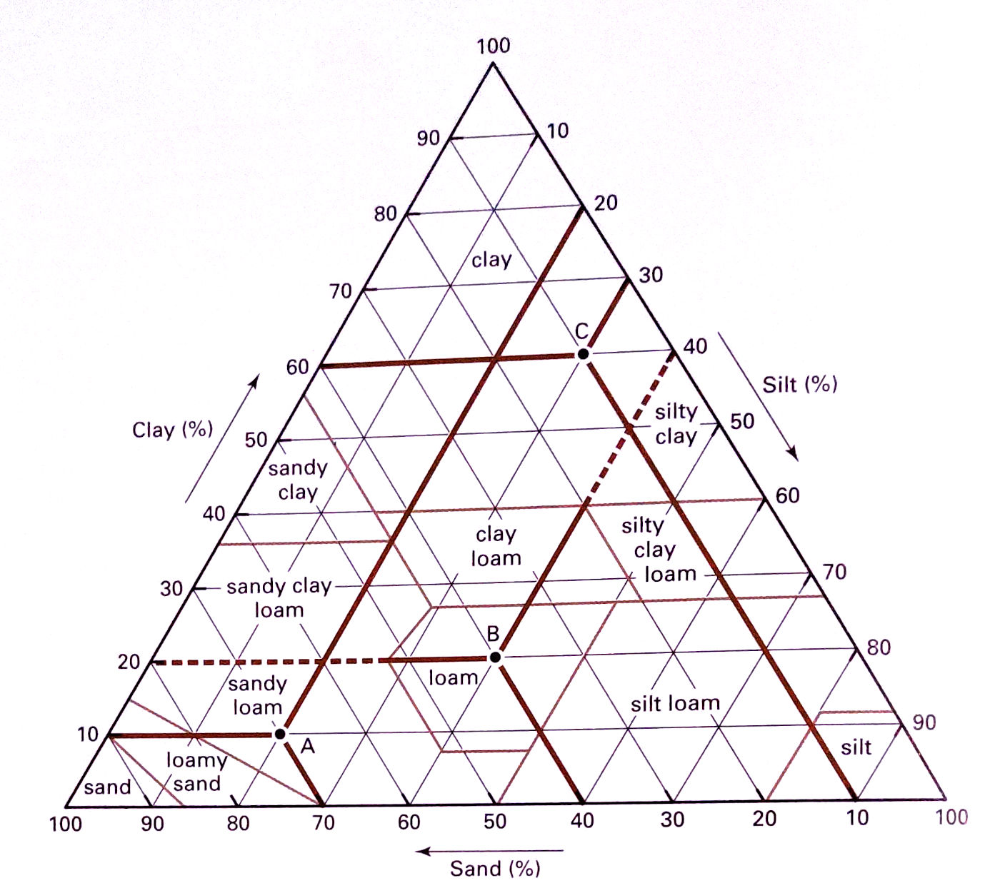

# Soil and irrigation

## Introduction

- Study of soil is known as pedology
- Water holding capacity is highest in clayey soil but better aeration in sandy soil.
- Soil = 5% of OM(organic matter) + 25% soil water + 25% soil air + 45% mineral/inorganic matter
- Study of soil: pedology (soil genesis)/ edaphology (soil in relation to plant production)
- Clayey soil is the bank of plant nutrient.
- Naturally formed soil aggregate is ped and artificially formed soil aggregate is clod.
- Red soil is due to presence of Fe.

### Soil textural classes

Few soils consist of mineral particles of single class. Usually soils are a mixture of sand, silt, and clay, whose relative proportions determine the soil's texture.

A textural class is a defined range of particle size distributions with similar behavior and management needs. The USDA soil textural triangle was designed so that any combination of particle size could be included within a textural class (Figure \ref{fig:usda-soil-texture-triangle}). Each corner of the textural triangle represents 100 percent of a size fraction: sand, silt or clay. Within the triangle are areas that represent the allowable combinations of the three size separates -- sand, silt and clay -- for each textural class name. For example, a sandy loam (A) may have no more than 20 percent clay or 85 percent sand or 50 percent silt.

Loam and clay each have a specific range of sand, silt, and clay, just as sandy loam does. A clay texture must have at least 40 \% clay and may have as much as 40 \%
silt or 45 \% sand. A loam may have from 7-27\% clay, from 28-50\% silt, and 23-52\% sand.

```{r size-fraction-soil-particles}
tribble(
  ~"Fraction group", ~"Fraction name", ~"Diameter (mm)",
  "Sand", "very coarse", "2.00-1.00",
  "Sand", "coarse", "1.00-0.50",
  "Sand", "medium", "0.50-0.25",
  "Sand", "fine", "0.25-0.10",
  "Sand", "very fine", "0.10-0.05",
  "Silt", "coarse", "0.05-0.02",
  "Silt", "medium", "0.02-0.005",
  "Silt", "fine", "0.005-0.002",
  "Clay", "coarse", "0.002-0.0002",
  "Clay", "fine", "<0.0002"
) %>% 
  knitr::kable(booktabs = TRUE, caption = "Size fractions of soil particles", longtable = TRUE) %>% 
  kableExtra::kable_styling(font_size = 8) %>% 
  kableExtra::column_spec(column = 2:3, width = c("6em", "8em")) %>% 
  kableExtra::column_spec(column = 1, width = "5em") %>% 
  kableExtra::collapse_rows(1, row_group_label_position = "identity")
```


```{r usda-soil-texture-triangle, fig.cap="Three soil textures shown on standard USDA textural triangle; (A) Sandy loam, (B) Loam, (C) Clay. To determine the texture class, read in the direction of each tick mark until the lines intersect. Clay is read horizontally from left, silt diagonally from the right, and sand diagonally from the bottom of the triangle.", out.width="70%"}

```


### Bulk density

```{r bulk-density}
tribble(
  ~"Soil type", ~"Bulk density ($gcm^{-3}$)", 
  "Sand soil", 1.6,
  "Loam soil", 1.4,
  "Silt loam", 1.3,
  "Clay", 1.1
) %>% 
  knitr::kable(booktabs = TRUE, caption = "Soil types and their respective bulk densities.", escape = FALSE) %>% 
  kableExtra::kable_styling(latex_options = "striped")
```


## Fertiliers and/or extracts and their chemical composition

**Nutrient content of Green manuring crops**

```{r nutrient-green-manure}
tribble(~"Crop", ~"Nitrogen (percent)", ~"Phosphorus (percent)", ~"Postassium (percent)", 
        "Dhaincha", 3.5, 0.6, 1.2, 
        "Sirish", 2.9, 0.7, 2.6, 
        "Asuro", 4.3, 0.9, 4.5, 
        "Titepati", 2.4, 0.4, 4.1, 
        "Sanai", 3.2, 0.8, 1.8, 
        "Taramandal", 5.0, 0.9, 4.2, 
        "Khirro", 2.8, 0.7, 2.9, 
        "Banmara", 2.4, 0.7, 4.0) %>% 
  knitr::kable(booktabs = TRUE, caption = "Nutrient content of green manuring crops") %>% 
  kableExtra::kable_styling(latex_options = "striped", font_size = 8)
```


**Nutrient composition of vermicompost**

```{r nutrient-vermicompost}
tribble(~"Chemical", ~"Content", ~"Unit",
        "Nitrogen", 5.3, "percent",
        "Phosphorus", 3.8, "percent",
        "Potassium", 4.3, "percent",
        "Manganese", 645, "ppm",
        "Zinc", 580, "ppm",
        "Copper", 106, "ppm",
        "Sulfur", 0.4, "percent", 
        "Calcium", 1.5, "percent", 
        "Magnesium", 0.4, "percent", 
        "Iron", 0.7, "percent", 
        "Born", 23, "ppm", 
        "Molybdenum", 47, "ppm") %>% 
  mutate(Content = paste0(Content, " ", Unit)) %>% 
  select(-Unit) %>% 
  knitr::kable(booktabs = TRUE, longtable = TRUE) %>% 
  kableExtra::kable_styling(position = "center", latex_options = "striped")
```

**Nitrogen fixation capacity of different leguminous crops**

```{r n-fixation-legume}
tribble(~"Crop", ~"N-fixation (kg/ha)", 
        "Horsegram", "45-52", 
        "Pea", "52-77", 
        "Soybean", "60-168", 
        "Chickpea", "103", 
        "Cowpea", "73-354", 
        "Bean", "40-70", 
        "Lentil", "88-114", 
        "Pigeonpea", "168-280"
        ) %>% 
  knitr::kable(booktabs = TRUE, longtable = TRUE) %>% 
  kableExtra::kable_styling(position = "center", latex_options = "striped")
```

## Crop nutrients, roles, deficiency, excess and control

```{r crop-nutrients-role-deficiency-excess}
read_csv("./data/soil/nutrient_role_deficiency_control.csv", show_col_types = FALSE) %>% 
  rename("SN" = 1) %>% 
  knitr::kable(booktabs = TRUE, caption = "Role of crop nutrients, deficiency, control of deficiency and toxicity", longtable = TRUE, align = "l") %>% 
  kableExtra::kable_styling(latex_options = "striped", font_size = 8) %>% 
  kableExtra::column_spec(column = 1:6, width = c("2em", "4em", "10em", "8em", "7em", "7em"))
```

## Soil-plant analysis equipments and working

1. Spectrophotometer

- "Workhorse" of modern laboratory
- Both ultraviolet and visible spectrophotometry is possible.
- Identification and measurement of organic and inorganic compounds.
- Measures amount of photons absorbed, after it passes through sample solution.
- To determine content of: Carbon, P, NO3-Nitrogen, NH4-Nitrogen, S, and B.
- Classification:
  - UV-visible spectrophotometer: Uses light over UV range (185-400 nm) and visible range (400-700 nm)
  - IR spectrophotometer: Uses light over infrared range (700-1500 nm)

- Type 2 classification
  - Double beam spectrophotometer (2 samples; reference and test simulataneously)
  - Single beam spectrophotometer
- Parts
  - Spectrometer
  - Collimator (lens)
  - Monochromator (prism)
  - Photometer (detects the photons and sends to galvanometer for display)
  - Light source

2. Flame photometer

- To determine Potassium (K), Na, Li, Barium (Ba) and Calcium (Ca) (Alkali metals)
- Low temperature flame photometry is the most reliable and convenient way (\SIrange{1500}{2000}{\celsius}). Suitable fuel for low temperature photometry are propane/air, butane/air and methane.
- Components
  - Nebuliser (transports a homogenous solution to flame at steady rate)
  - Mixing chamber
  - Atomizer burner (Pre-mix/Lundegarh burner and total consumption burner)
  - Simple color filters
  - Photo detector
  - Amplifier and read out device

```{r flame-color-flame-photometer}
tribble(
  ~"Element", ~"Emission wavelength", ~"Flame color",
  "Na", 589, "Yellow",
  "K", 766, "Violet",
  "Ba", 554, "Lime green",
  "Ca", 622, "Orange",
  "Li", 670, "Red"
) %>% 
  knitr::kable(caption = "Flame colors produced by different elements in flame photometer", booktabs = TRUE) %>% 
  kableExtra::kable_styling(font_size = 8, latex_options = "striped") %>% 
  kableExtra::column_spec(column = 1:3, width = c("4em", "4em", "5em"))
```


3. Atomic absorption spectrophotometer

- It was first introduced in 1960s and is used to determine concentration of over 62 different metals in a solution.
- Mostly used for determination of Fe, Mn, Cu, Zn and Mo.
- Types: Flame AAS and Graphite furnace AAS, later is more responsive to more apart range of detection.
- Components:
  - Radiation source
  - Atomizers
  - Monochromator
  - Detector
  - Read out device

Working principle of Atomic absorption spectrophotometer

1. Homogenous solution of representative sample is obtained
2. Sample is sprayed into flame (Airy-acetylene/Acetylene-$\mathrm{N_2O}$)
3. Absorb energy and undergo transition in states when light source is used to excite the free atoms in flame.
4. Decrease in energy (photon) emitted by cathode lamp and absorbed by atoms is measured according to Lambert-Beer's law.
5. Amount of light absorbed is proportional to number of analyzed atoms. Using known concentration samples for calibration exact concentration of unknown samples can be determined.

Principle of nitrogen determination by Kjeldahl method

- Determines N-content from both organic and inorganic substances
- Steps:
  1. Digestion

$$\mathrm{Organic~nitrogen + H_2SO_4} \rightarrow \mathrm{(NH_4)_2SO_4 + H_2O + CO_2 + Other~sample~matrix}$$

  2. Neutralization and distillation: $(NH_4)_2SO_4$ is first diluted with distilled water.
  
$$
\mathrm{(NH_4)_2 SO_4} + \mathrm{2 NaOH} \rightarrow \mathrm{2NH_3 + Na_2 SO_4 + 2H_2O}
$$
Produced ammonia is distilled into a boric acid solution to give ammonium and borate ion.

$$
\mathrm{NH_3 + H_3 BO_3} \longrightarrow \mathrm{NH_4^+ + H_2 BO_3^{-}} (\text{color changes})
$$

  3. Titration

$$
\mathrm{H_2BO_3^{-} + H^{+}} \longrightarrow \mathrm{H_3 BO_3} (\text{color change is reversed})
$$

### Principle of phosphorus determination

1. Modified olsen method

- Applicable in slightly acid, neutral, alkaline and calcareous soils.
- Steps: Soil is shaken with 0.5 M $\mathrm{NaHCO_3}$ (PH: 8.5) in the presence of Darco-G 60 (which absorbs the dispersed OM in sample and thus helps yield a clear extract). At high pH, P is held by Ca as,

$$
\mathrm{Ca_3(PO_4)_2} \xrightleftharpoons{} \mathrm{3 Ca^{2++} + 2PO_4^{3-}}
$$

If $\mathrm{Ca^{2+}}$ is removed, more $\mathrm{Ca_3(PO_4)_2}$ will be dissociated to counteract the effect of the removal (Le-chaterlier's principle) here Ca is removed by by $\mathrm{NaHCO_3}$. Even Ca, has a strong affinity for $\mathrm{CO_3^{2-}}$ to form $\mathrm{CaCO_3}$ hence more $\mathrm{Ca(PO_4)_2}$ dissolves. If we continue to remove Ca by precipitating it as $\mathrm{CO_3^{2-}}$, the reaction goes to right, more and more P will be released into solution. In addition, $\mathrm{NaHCO_3}$ in solution will also have $\mathrm{NaOH}$, the $\mathrm{NaOH}$ will react with Fe in the $\mathrm{FePO_3}$ to form $\mathrm{Fe(OH)_3}$, this will also release more P into solution. The overall reaction is shown below,

$$
\mathrm{NaHCO_3} \longrightarrow \mathrm{Na^{+} + HCO_3^-}
$$

$$
\text{Colloid }\mathrm{(PO_4^{3-}) + HCO_3^-} \longrightarrow \text{Colloid }\mathrm{(HCO_3^-) + PO_4^{3-}}
$$
The overall reaction being,

$$
\mathrm{Ca_3(PO_4)_2 + 6NaHCO_3} \longrightarrow \mathrm{CaCO_3 + 2H_3 PO_4 + 3 Na_2 CO_3}
$$

ii. Bray and Kurtz Number 1

This procedure is primarily suitable for soils which are moderate to strongly acidic (pH around 5.5 or less). In acidic soils, phosphate is complexed with Al and Fe as $\mathrm{Al PO_3}$ and $\mathrm{Fe PO_3}$. The extraction solution of this method is 0.03 M $\mathrm{NH_4F}$ in 0.025 N $\mathrm{HCl}$, here the $\mathrm{F^-}$ ion complexes Al and Fe forming AlF and FeF. In this way, phosphate ion becomes free for determination.

$$
\mathrm{3NH_4 F + 3HCl + AlPO_4} \longrightarrow \mathrm{H_3 PO_4 + (NH_4)_3AlF_6}
$$

$$
\mathrm{3NH_4 F + 3HCl + FePO_4} \longrightarrow \mathrm{H_3 PO_4 + (NH_4)_3FeF_6}
$$
Phosphorus in the extract is treated with Ammonium molybdate, which results in the formation of heteropoly complexes (Phosphomolybdate/phosphomolybdic acid). Phosphomolybdic acid is reduced by ascorbic acid to form blue complex. The absorbance of developed blue colr should read in spectrophotometer.

$$
\text{Phosphate + Molybate} \longrightarrow \text{Phosphomolybdic acid}
$$
$$
\text{Phosphomolybdic acid + Ascorbic acid} \longrightarrow \text{Reduced phosphomolybdate complex}
$$

### Potassium determination

Ammonium acetate method

In general, available potassium includes exchangeable and water soluble potassium in soil except that of saline or saline-sodic soils. Available K is determined by 1 N neutral ammonium acetate ($\mathrm{CH_3 COONH_4}$) solution. The ammonium ions replace potassium ions absorbed on the soil colloids as:

$$
\text{(Colloid) } \mathrm{K^+ + CH_3 COONH_4} \longrightarrow \text{(Colloid)} \mathrm{NH_4^+ + CH_3COOK}
$$
The estimation of potassium in the extract is carried out with the help of a flame photometer.

## Soures of plant nutrition

The different source of 16 essential nutrients and their forms in which they are absorbed from the soil by the plant is shown in \ref{tab:sources-forms-nutrients}.

```{r sources-forms-nutrients}
tribble(
  
  ~"Element", ~"Absorbable form", ~"Sources",
  "1. Carbon, Hydrogen, Oxygen", "$CO_2$, $H_2 O$, $OH$, $O_2$", "Air, water organic compounds",
  "2. Nitrogen", "Nitrite: $NO_2^{-}$, Nitrate: $NO_3^{-}$, $NH_4^{+}$", "Organic matter, fertilizer, manure, air",
  "3. Phosphorus", "$H_2 PO_4^{2-}$, $HPO_4^{-}$", "Soil, OM, fertilizer, manure",
  "4. Potassium", "$K^{+}$", "Soil, OM, fertilizer, manure",
  "5. Calcium", "$Ca^{2+}$", "Weathering, liming, manure, fertilizer",
  "6. Magnesium", "$Mg^{2+}$", "Weathering, soil correction (dolomite, gypsum)",
  "7. Sulphur", "$SO_4^{2-}$, $SO_2$", "Weathering, sulphur fertilizer, ammonium sulphate, $SO_2$ may be obtained from air",
  "8. Chlorine", "$Cl^{-}$", "Weathering",
  "9. Iron", "$Fe^{2+}$, $Fe^{3+}$", "Weathering, crop residues",
  "10. Manganese", "$Mn^{2+}$", "Weathering and as micro-nutrients",
  "11. Zinc", "$Zn^{2+}$", "Weatering and micro-nutrients",
  "12. Copper", "$Cu^{2+}$", "Weathering and micro-nutrients",
  "13. Boron", "$H_3 BO_3$, $HBO_3^{-}$, $HBO_3^{2-}$", "Weathering and micro-nutrients",
  "14. Molybdenum", "$MoO_4^{2+}$", "Weathering and micro-nutrients, manure"
) %>% 
  knitr::kable(booktabs = TRUE, escape = FALSE, caption = "Soil essential nutrients and their available forms", longtable = TRUE) %>% 
  kableExtra::kable_styling(font_size = 8, latex_options = "striped") %>% 
  kableExtra::column_spec(column = 1:3, width = c("10em", "8em", "16em"))
```

### Salts containing micronutrients

```{r salts-micronutrition}
read_csv("./data/soil/salts_containing_micronutrients.csv",
         show_col_types = FALSE) %>% 
  knitr::kable(booktabs = TRUE, escape = FALSE, caption = "Micronutrient content in respective mineral salt", longtable = TRUE) %>% 
  kableExtra::kable_styling(font_size = 8, latex_options = "striped") %>% 
  kableExtra::column_spec(column = 1:4, width = c("3em", "8em", "8em", "6em"))
```


## Saline soil/solonchhak soils/white alkali soils

Soils containing soluble neutral salts of Ca, Mg, K and Na are termed as saline soils. Commonly, saline soils contain chlorides and sulphates of Ca and Mg salts and the exchange complex is dominated by Ca and Mg but not by Na (less than 15\% exchangeable Na). If a saline soil contains large amounts of calcium and Mg salts, the color of such soil become white due to encrustation of white Ca and Mg salts and called as white alkali soils or calcareous soils. Saline soil has pH less than 8.3. The exchangeable sodium percentage (ESP) and the sodium adsorption ratio (SAR) of saline soils are less than 15\% and less than 13 respectively. Because of higher amounts of soluble salt content, the electrical conductivity (EC) of saline soil is more than \SI{4}{\deci\siemens\per\meter}. Primarily, salinity is measured by EC and sodicity is measured by SAR and ESP. 

### Effects of salinity to crop plants

High levels of salt in soil solution adversely affect crop growth and development. Severity depends on climate, type of crop growth, salt composition and concentration.  However, in general:

Higher salt concentration in soil solution lowers osmotic potential (increases osmotic pressure) that reduces entry of water to plant roots because water enters to plant roots if water potential of plant root cell is lower than soil solution. High accumulation of salt in plant system cause salt toxicity. Plant suffering from salt damage become dull, stunted and leaves of such plants become scrochy, yellow and there may be leaf senescence. Severity of leaf damage occurs mainly in low lying areas of fields in patches.

- Salt tolerant plants (halophytes; e.g. Barley, beet and date palm) accumulate soluble salt in root cells to reduce internal osmotic potential and absorb water from high salt containing soil solution.
- Non-halophytes accumulate organic solutes to increase internal salt concentration and exclude salt ions.

### Saline-sodic (saline-alkali) soils

Saline-sodic soil contain enough quantities of neutral soluble salts (chlorides and sulphates of Na, Ca and Mg) and soil pH ranges from 8.3 to 8.5. The ESP of saline sodic soil is more than 15\% and SAR is at least 13. The destruction of soil physical properties of saline sodic soils becomes intermediate to that of saline and sodic soils.

Leaching of saline sodic soil by irrigation and drainage removes soluble salts from the solution and Na ions come to soil solution from exchange complex and pH rises remarkably. Frequent irrigation and drainage by neutral irrigation water and use of gypsum can improve soil pH.

### Alkali (sodic) soils

Non-saline sodic soil contain more than 15\% ESP, more than 13 SAR and no great amount of neutral soluble salt which results in pH higher than 8.5 Due to absence or presence of negligible amount of neutral soluble salts, such soils are sticky and plastic under wet condition and very hard under dry condition. Water does not percolate through them. Soluble salts are washed down by the limited rainfall and Ca and Mg ions present in clay micelle are replaced and gradually, clay micelle will be saturated by Na ions. Sodium ions react with carbonic acids forming sodium carbonate.

$$\mathrm{Na^+ + H_2CO_3} \xrightleftharpoons{} \mathrm{H^+ + Na_2 CO_3}$$

Sodim carbonate hydrolyze to form sodim hydroxide and carbonic acids. Sodium hydroxide is strong base and that helps to increase soil pH. Carbonic acid is weak acid and dissociates to $\mathrm{CO_2}$ and $\mathrm{H_2O}$.

$$
\mathrm{NA_2 CO_3 + 2HOH} \xrightleftharpoons{} \mathrm{NaOH + H_2 CO_3}
$$
Carbonic acid dissociates to $\mathrm{CO_2}$ and $\mathrm{H_2O}$.

Sodium hydroxide hydrolysed to $\mathrm{Na^+}$ and $\mathrm{OH^-}$ increases soil pH. Thus sodium carbonate is responsible to raise soil pH to 9.0 or even to 10.

Sodium is to crop especially if calcium concentration is low. Sodic soils also loose their structure if salt concentration is not maintained high. Maintaining high salt concentration is neither conducive to crop productivity nor possible when desired. Leaching of soluble salts from soil surface destructs soil structure make surface barrier to enter water through it. It reduces soil aeration resulting $\mathrm{O_2}$ deficiency and $\mathrm{CO_2}$ abundancy in the soil pores. The detrimental effects on plants caused by reduced water infiltration and aeration in sodic soils are rather serious than toxicity caused by $\mathrm{Na^+}$, $\mathrm{HCO_3^-}$ and $\mathrm{OH^-}$ ions present in soil solution.

High sodium content in a soil disperses OM from soil-OM complex and surface encrustation of salts present in sodic soils become black. Such soils are termed as black-alkali soils. Sometimes, the black salt localize in small areas that is called slick spots.

```{r alkaline-soils-characteristics}
tribble(
  ~"Soil type", ~"pH", ~"EC (\\si{\\deci\\siemens\\per\\meter})", ~"ESP (\\%)", ~"SAR",
  "Saline", "<8.3", ">4", "<15", "<13",
  "Saline-sodic", "8.3-8.5", ">4", ">15", ">13",
  "Sodic", ">8.5", "<4", ">15", ">13",
  "Normal", "Near about 7", "<4", "<15", "<13"
) %>% 
  knitr::kable(booktabs = TRUE, caption = "Important characteristics of alkaline soil", longtable = TRUE, escape = FALSE) %>% 
  kableExtra::kable_styling(latex_options = "striped", font_size = 8) %>% 
  kableExtra::column_spec(column = 1:5, width = c("6em", "4em", "5em", "3em", "3em")) %>% 
  kableExtra::add_footnote(label = "EC refers to the electrical conductivity of soil at \\SI{25}{\\celsius}.")
```


### Harmful effects of saline/sodic soils on plant growth

1. Saline and saline-sodic soils contain excessive quantities of salts and increase osmotic pressure (reduce osmotic potential) of the soil solution. Low osmotic potential of the soil solution reduce water absorption by plant roots.
2. The presence of excessive amounts of chlorides in the soil solution of saline and saline-sodic soils is harmful to the crop plants.
3. Non-saline alkali soils are poor in soil physical conditions
4. Poor soil physical condition of the soil results reduced soil aeration (low $\mathrm{O_2}$ and high $\mathrm{CO_2}$ content in soil air) which is adverse for crop growth and survival.
5. Poor soil physical conditions adversely affects the soil infiltratino capacity of the surface soil.
6. There will be presence of high concentration of borate, bicarbonate and sodium ions in soil solution. Even a small amount of borate is toxic to crop plants.
7. Sodic soil contains excessive bicarbonates and sodium which is harmful to crop plants.
8. The uptake of nutrients into root hairs is also interrupted due to antagonistic effects of Na-salt. A high $\mathrm{Na^+}$ concentration suppresses Zn, P, K, Fe and Mn availability to crops.
9. Strongly alkaline soil solution is corrosive to crop roots and stems.

### Management of saline and sodic soils

Commonly, alkaline soils are managed by following methods,

1. Eradication (by leaching of soluble salts with irrigation water)
2. Conversion of salts to less harmful forms (by use of Gypsum and elemental sulfur)
3. Control (by mulching and tillage operations)
4. Use of resistant crops

### Calculation of gypsum requirement to reclaim alkaline soils

The amount of gypsum required to reclaim sodic soils is based on the exchangeable sodium percentage present in a given soil and its cation exchange capacity (CEC). If a soil has,

- ESP: 25\%
- CEC: \SI{18}{\centi\mole\per\kilo\gram}

and desired reduction of ESP of upper 30 cm of that soil is to about 5\%. The gypsum requirement is calculated as,

$$
\begin{aligned}
&\text{Amount of sodium ions required to be replaced} &= CEC \times ESP \text{ to be replaced} \\
& &= 18 \mathrm{~cmol kg^{-1}} \times \frac{25-5}{100} \\
& &= 18 \times 0.2 \\
& &= 3.6 \mathrm{~cmol kg^{-1}}
\end{aligned}
$$
$$\mathrm{2Na(Micelle) + CaSO_4.2H_2O} \rightarrow \mathrm{Ca^{2+}(Micelle) + Na_2SO_4 + 2H_2 O}$$

By the reaction above, it is known that two ions of $\mathrm{Na^{+}}$ will be replaced by one $\mathrm{Ca^{++}}$ ion. Thus,

Gypusm requirement = Amount of Na-ions to be replaced x molecular weight of $\mathrm{CaSO_4.2H_2O}$

Molecular weight of $\mathrm{CaSO_4.2H_2O}$ is equal to 172. Na-ions to be replaced is in \si{\centi\mole\per\kilo\gram} soil.

172 g of $\mathrm{CaSO_4.2H_2O}$ is present in 1 mole solution. As Ca-ions contain two charges, it can replace two Na-ions. Thus, $\mathrm{CaSO_4.2H_2O}$ required is half of its molecular weight (86 g).

As sodium to be replaced is in centimole, $\mathrm{CaSO_4.2H_2O}$ expressed in mole has to be divided by 100 to know the $\mathrm{CaSO_4.2H_2O}$ present in cmol,

Thus, to replace 1 centimole of Na-ion, 0.86 g of $\mathrm{CaSO_4.2H_2O}$ is required.

To replace 3.6 cmol of Na ions, $3.6 \times 0.86$ (3.096) g of $\mathrm{CaSO_4.2H_2O}$ is required.

One hectare furrow slice of 15 cm depth has $2 \times 10^6$ \si{\kilo\gram\per\hectare} soil. For 30 cm depth, amount of soil to be reclaimed = $2 \times 2 \times 10^6$ = $4 \times 10^6$ \si{\kilo\gram\per\hectare} soil.

Thus, to reclaim $4 \times 10^6$ \si{\kilo\gram\per\hectare} soil, $\mathrm{CaSO_4.2H_2O}$ required 

= $\mathrm{CaSO_4.2H_2O}$ required to reclaim per kg soil x total weight of soil to be reclaimed.

= $3.096 \times 4 \times 10^6 \mathrm{CaSO_4.2H_2O}$

= \SI{12.38}{\mega\gram} $\mathrm{CaSO_4.2H_2O}$ per hectare of 30 cm depth of the soil.

## Characteristics of soil horizon

```{r horizon-property}
tribble(
  ~"Master horizon symbols", ~"Horizon property or characteristic",
  "O", "Layers domiated by organic material.",
  "A", "Mineral horizons formed at the surface or below an O horizon and containing accumulated decomposed organic matter.",
  "E", "Mineral horizon in which the main feature is the loss of silicate clay, Fe, or Al, leaving a concentration of resistant sand and silt particles.",
  "B", "Horizons formed below an A, E or O horizon and dominated by the obliteration of the original rock structure and the accumulation of silicate clay, Fe, Al, humus, carbonate, gypsum or Si.",
  "C", "Horizons excluding hard bedrock and litle affected by soil genesis.",
  "R", "Hard bedrock like basalt, granite, or sandstone."
) %>% 
  knitr::kable(booktabs = TRUE, caption = "Horizon property or characteristic; Source: USDA Soil Survey Manual, Chapter 4.", longtable = TRUE) %>% 
  kableExtra::kable_styling(latex_options = "striped", font_size = 8) %>% 
  kableExtra::column_spec(column = 1:2, width = c("6em", "20em"))
```

## Effective root zone depth

```{r effective-root-zone-depth}
read_csv("./data/effective_root_zone_depth_crops.csv",
         show_col_types = FALSE) %>% 
  knitr::kable(booktabs = TRUE, caption = "Horizon property or characteristic; Source: USDA Soil Survey Manual, Chapter 4.", longtable = TRUE) %>% 
  kableExtra::kable_styling(latex_options = "striped", font_size = 8) %>% 
  kableExtra::column_spec(column = 1:4, width = rep("8em", 4))
```


## Crop irrigation

Soil water is critical to plant growth and development. It is the solvent in which soil nutrients are dissolved before they can be absorbed by plant roots. Once in the plant, water is the medium of transportation of solutes and is required in photosynthesis. Plants lose large amounts of water from their surfaces by the process of transpiration. Soil is the primary source of water for plant use. Soil water also affects soil air and soil temperature and thereby influences plant growth and development. Soil water plays a role in the loss of soil by soil erosion.

Being largely water by weight (more than 90%), fruit cultivation is highly dependent on the availability of water. Further, fruit trees are shallow rooted. Some production areas produce vegetables as rain-fed with some success. However, for optimal yield and highest quality for premium prices, fruit orchard need to be watered at critical times. Also, to prevent summer heat and dessication crops requires additional water for economic production. Therefore, it is worthwhile investing in a reliable irrigation system for fruit production since the industry is generally profitable.

The goal of irrigation is to provide and retain moisture in the root zone of the plant. To be adequate, moisture must be supplied in the right amounts and at the right time. Many horticultural products, crops, and ornamentals require a good supply of water for high yield and quality. High-value crop production often relies on artificial moisture supplementation. For a small garden operation, additional moisture may be delivered by hand carrying it in a variety of receptacles such as buckets and watering cans. A garden hose may also be used for watering garden crops. A continuous moisture supply for a given period is provided by a variety of methods described next, some of which are adaptable to large- and small-scale productions.

### Factors to consider for irrigation

The method of irrigation used in a particular situation depends on the following factors:

*Crop*
\newline The method used to irrigate depends on the type of crop or plant and its water needs, size, and way it is being cultured. Because plants that creep on the ground cannot lie in water, the method of irrigation should not permit water to pond on the soil surface. When growing trees that are spaced widely, it is efficient to supply water to the trees individually rather than watering the large spaces in between plants. Irrigating tall trees from above is difficult. Overhead systems of irrigation are unsuitable for tree irrigation. Certain plants prefer or need large volumes of water to perform well, and the irrigation system should be capable of providing this volume.

*Source of water*
\newline Different sources of irrigation water vary in cost and availability. Certain methods of irrigation (flood) require the entire soil surface to be covered with water. This method is not practical when the source of water is the domestic water supply. It is more suited to water from rivers or other large bodies of water.

*Soil type*
\newline Soils differ in water infiltration rate. If the soil is sandy, the water infiltration rate is high, making the area unsuited to flood irrigation. Much of the water is wasted near the supply source because of deep and rapid infiltration. Water moves slowly over the surface.

*Slope of the land*
\newline Certain irrigation methods require water to be moved by gravity and thus are adaptable to fields in which the ground slopes. 

*Rainfall regime of the region*
\newline In areas of erratic rainfall and low annual totals, moisture must be administered efficiently. The drip system places less demand on the scarce water supply.

*Crop rotation*
\newline If crops rotated in the production system require different land preparation and other cultural practices, a method that is flexible and adaptable should be selected. Not all plants can tolerate flooding. The differences in spacing requirements necessitate a flexible system that can be adjusted readily.

*Surface of the land*
\newline Installation of an irrigation system is affected by the nature of the terrain. Certain methods such as flooding require grading and leveling of the land. Where pumps are needed to lift water, the relief of the area determines the kind of pump needed to move water from the source to the field.

*Cost*
\newline Irrigation methods differ in cost in terms of initial installation and maintenance.

### Methods of irrigation

Irrigation systems for applying supplemental moisture to plants may be grouped into three categories-**sprinkler irrigation**, **drip or trickle irrigation**, and **surface irrigation**. All the methods are used to varying extents in various production regions according to soil conditions, crops being grown, and rainfall patterns. 

#### Overhead Sprinkler Irrigation

Water is usually moved under high pressure through a simple or more elaborate network of pipes. A network of pipes is installed underground and fitted with pop-up sprinkler heads to deliver a spray of water to the area (Figure \ref{fig:sprinkler-irrigation}). It may be as simple as a garden hose sprinkler. There are different designs of this kind of sprinkler, which is easy to use and adapted to irrigating lawns, vegetable gardens, and flower beds. Their use is limited by the length of the hose to which the sprinkler is attached. A perforated hose (porous hose) may also be used to distribute water to plants in the landscape. Watering cans are used for watering flower beds in the absence of sprinkler systems.

```{r sprinkler-irrigation, fig.width=5, out.width="50%", fig.cap="Sprinkler irrigation system"}
knitr::include_graphics("./images/irrigation/Sprinkler_irrigation.jpg")
```

Sprinkler irrigation is a method of mimicking the rain by supplying moisture from above. Equipment costs can be high. Sprinklers are desirable where soils have high infiltration rates or uneven surfaces. Sprinklers are also used where irrigation is not the primary source of moisture for crop growth. Some overhead irrigation systems are designed to be mobile. A portable system may be transported to the area when needed. Center pivot systems that are equipped with Low energy precision application (LEPA) heads have high water application efficiency and also multiple modes of operation (bubble, sprays, chemigation).

Sprinkler irrigation has the effect of modifying the microclimate of plants, since water has a high specific heat. Sprinkler irrigation is used in the horticultural industry for frost protection in the production of vegetables and fruits in winter.

#### Drip or Trickle Irrigation

In methods of irrigation besides drip irrigation, water is applied perhaps also to areas where it is not needed. Drip irrigation is a spot application system for watering plants in which minute amounts of water are applied almost continuously to plants throughout the growing period (Figure \ref{fig:drip-irrigation}). 

```{r drip-irrigation, out.width="50%", fig.cap="Drip irrigation system"}
knitr::include_graphics("./images/irrigation/Drip_irrigation.png")
```

Precise water volume is applied to the root zone of the plant. If well designed and managed, its efficiency can be 90-95 percent (i.e., only 5-10 percent of the applied water is wasted). When drip irrigation is used with polyethylene mulch, yield increases can even be increased further. It operates under lower pressure than sprinkler irrigation systems. 

Components required for a effective and efficient drip irrigation system include: water source, pump, sand filter (depending on water source), backflow valve, flow meter, chemical/fertilizer injector and delivery system including, mainline distribution to field, sub-mainline (header line), feeder tubes or connectors and drip lines. The advantages of a drip irrigation system are:

1. Smaller water sources can be used, because trickle irrigation may require less than half of the water needed for sprinkler irrigation.
2. Lower operating pressures mean reduced energy costs for pumping.
3. High levels of water use efficiency are achieved because plants can be supplied with more precise amounts of water.
4. Disease pressure may be less because plant foliage remains dry.
5. Labor and operating costs are generally less, and extensive automation is possible.
6. Water applications are made directly to the plant root zone. No applications are made between rows or other non-productive areas, resulting in better weed control and significant water savings.
7. Field operations, such as harvesting, can continue during irrigation because the areas between rows remain dry.
8. Fertilizers can be applied efficiently through the drip system.
9. Irrigation can be done under a wide range of field conditions.
10. Compared to sprinkler irrigation, soil erosion and nutrient leaching can be reduced.

However, the initial investment is high for this system. Furthermore, it is prone to damage by rodents and is also management intensive. It is economical to use and also highly desirable in areas where the water supply is limited and water cost is excessive. Plastic pipes with emitters are used to deliver the water. These tubes may be laid on the surface of the land or buried, the latter being more prone to clogging. Drip irrigation is especially desirable for high-value crops that require uniform soil moisture for good development. For example, when tuber crops such as potatoes are grown under conditions where the soil experiences fluctuations in moisture levels, tuber formation is irregular, leading to low market value.

#### Surface Irrigation

In sprinkler and drip irrigation, a pump may be required for appropriate pressure to move water through pipes. Surface systems depend on the slope of the land to move water. Initial land preparation includes leveling of the land (in flood irrigation) or digging of ditches (in furrow irrigation). These methods are not suitable for sandy soils or soils that have a high infiltration rate, especially if water is to be moved over long distances. Flood irrigation is commonly used in fruit orchards. Furrow irrigation is a version of flood irrigation in which the surface flow is limited to channels between ridges. Vegetables may be irrigated in this way (Figure \ref{fig:surface-irrigation}).

```{r surface-irrigation, out.width="50%", fig.cap="Surface irrigation system"}
knitr::include_graphics("./images/irrigation/Surface_irrigation.jpg")
```

### Popular vegetabe irrigation systems

The design that is widely used in vegetable production is the thin-walled (called tape) plastic tube design. The tubes may be buried in the soil or laid on top of the soil to trickle water. This system is effective but very delicate, prone to clogging and breakage and hence needs to be replaced annually. Vegetables need large amounts of water in production, as previously indicated. The general recommendation is to supply at least 1 inch of water each week to vegetables. Tensiometers may be used to determine when to irrigate (when it reads 20-30 centibars).

### Crop water requirement

```{r crop-water-requirement}
read_csv("./data/crop_water_requirements.csv", skip = 2,
         show_col_types = FALSE) %>% 
  dplyr::rename_all(list(~str_replace_all(., "_", " "))) %>% 
  knitr::kable(booktabs = TRUE, caption = "Crop water requirement and growth duration of major crops of Nepal", longtable = TRUE) %>% 
  kableExtra::kable_styling(latex_options = "striped", font_size = 8) %>% 
  kableExtra::column_spec(column = 1:5, width = c("6em", "6em", "8em", "8em", "20em"))
```


## Crop coefficients

These are the properties of plants used in predicting evapotranspiration (ET). The most basic crop coefficient, $k_c$, is simply the ratio of ET observed for the crop studied over that observed for the well calibrated reference crop under the same conditions.

$$
\mathrm{PET} = K_c \times \text{RET}
$$

Potential evapotranspiration (PET) is the evaporation and transpiration that potentially could occur in a field of the crop had an ideal unlimited water supply. RET is the reference ET often denoted as $ET_0$.

Even in agricultural corps, where ideal conditions are approximated as much as is practical, plants are not always growing (and therefore transpiring) at their theoretical potential. Plants have growth stages and stages of health induced by a variety of environmental conditions.

RET usually represents the PET of the reference crop's most active growth. $K_c$ then becomes a function or series of values specific to the crop of interest through its growing season. These can be quite elaborate in the case of certain maize varieties, but tend to use a trapezoidal leaf area index (LAI) curve for common crop or vegetation canopies.

Stress coefficients, $K_s$, account for diminished ET due to specific stress factors. These are often assumed to combine by multiplication.

$$
\mathrm{ET_{estimate}} = K_w \times K_{s_1} \times K_{s_2} \times K_c \times ET_0
$$

Water stress is the most ubiquitous stress factor, often denoted as $K_w$. Stress coefficients tend to be functions ranging between 0 and 1. The simplest are linear, but thresholds are appropriate for some toxicity responses. Crop coefficients can exceed 1 when the crop evapotranspiration exceeds that of RET. 

Below are given estimates of the crop coefficient for multiple crops commonly cultivated in Nepal

```{r crop-coefficient}
read_csv("./data/crop_coefficient.csv", skip = 2,
         show_col_types = FALSE) %>%
  tidyr::pivot_longer(cols = `Jan_first half`:`December_second half`, 
                      names_to = c("Month", "Month half"), 
                      names_pattern = "(.*)_(.*)", 
                      values_to = "Crop coefficient") %>%
  dplyr::mutate(`Month half` = str_to_sentence(`Month half`)) %>% 
  tidyr::pivot_wider(names_from = Month, values_from = `Crop coefficient`) %>% 
  knitr::kable(caption = "Crop coefficients", escape = FALSE, booktabs = TRUE) %>% 
  kableExtra::kable_styling(latex_options = "striped") %>%
  kableExtra::column_spec(column = 1:15, width = c("10em", "5em", "5em", rep("2em", times = 7), rep("3em", 5))) %>% 
  kableExtra::landscape(margin = "1.25cm")
```


## Estimates of potential evaporation

**Thornthwaite equation (1948)**

$$
PET = 16 \left(\frac{L}{12}\right) \left(\frac{N}{30}\right) \left(\frac{10 T_d}{I}\right)^\alpha
$$

Where,

  - PET is the estimated potential evapotranspiration (mm/month)
  - $T_d$ is the average daily temperature (degree C; if this is negative, use 0) of the month being calculated
  - N is the number of days in the month being calculated
  - L is the average day length (hours) of the month being calculated
  - $\alpha = (6.75 \times 10^{-7})I^3 - (7.71 \times 10^{-5})I^2 + (1.792 \times 10^{-2})I + 0.49239$
  - $I = \sum^{12}_{i = 1} {\left(\frac{T_{m_i}}{5}\right)}^{1.514}$ is the heat index which depends on the 12 monthly mean temperatures $T_{m_i}$.
  
Somewhat modified forms of this equation appear in later publications (1955 and 1957) by Thornthwaite and Mather.

**Penman equation (1948)**

The penman equation describes evaporation (E) from an open water surface, and was developed by Howard Penman in 1948. Penman's equation requires daily mean temperature, wind speed, air pressure, and solar radiation to predict E. Simpler hyrdometeorological equations continue to be used where obtaining such data is impractical, to give comparable results within specific contexts, e.g. humid vs arid climates.

**Penman-Monteith equation (1965)**

## Soil erosion

Soil erosion is the displacement of upper layer of soil, one form of soil degradation. The agents of soil erosion are water ice, and wind, each contributing a significant amount of soil loss each year.

### Process

1. Detachment

Process depends upon type of soil, OM, moisture, nature of detaching agents (energy). Rainsplash is the most important detaching agent. As a result of raindrops striking a bare soil surface, soil particles may be thrown through the air over distances of several centimeters. Continuous exposure to intense rainstorms considerably weakens the soil.

Decrease in organic matter lowers the binding action causing the low aggregates formation which can be easily eroded by water, wind and ice movement. 

Detachment of soil particles by flowing water in rill erosion (D) varies with square of velocity of flowing water (V2). The soil is also broken up by weathering processes, both mechanical, by alternate wetting and drying, freezing and thawing and frost action, and biochemical.

The transporting agents comprise those that act a really and contribute to the removal of a relatively uniform thickness of soil, and those that concentrate their action in channels. The first group consists of rainsplash, surface runoff in the form of shallow flows of infinite width, sometimes termed sheet flow but more correctly called overland flow, and wind The second group covers water in small channels, known as rills, which can be obliterated by weathering and ploughing, or in the larger more permanent features of gullies and rivers. 

Process depends upon size, and shape of detached materials and velocity of the transporting agent. The higher the size of the particles the higher will be the energy required and higher will be the depth required. Ability of flowing water to transport soil particles (T) varies with fifth power to the velocity of flowing water (V5). The severity of erosion depends upon the quantity of material supplied by detachment over time and the capacity of the eroding agents to transport it.

## Irrigation development in Nepal

```{r irrigation-development-nepal}
read_csv("./data/irrigation_development.csv", skip = 2,
         show_col_types = FALSE) %>% 
  dplyr::rename_all(list(~str_replace_all(., "_", " "))) %>% 
  dplyr::mutate(`Plan period` = str_replace_all(`Plan period`, "_", " ")) %>% 
  knitr::kable(caption = "Irrigation development in Nepal during different period plans", 
               booktabs = TRUE, escape = FALSE) %>% 
  kableExtra::kable_styling(font_size = 8, latex_options = "striped") %>% 
  kableExtra::column_spec(column = 1:9, width = c("18em", rep("7em", 4), "5em", "5em", "5em", "5em")) %>% 
  kableExtra::landscape(margin = "1.5cm")
```
