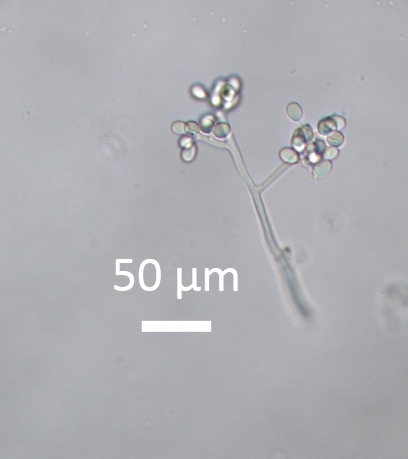

# Plant pathology

## Background

In global production, 40% loss is attributed to insect; disease results in 13% loss of yield overall.

## Plant pathology: historical events

**Irish famine**

In about 1800, the potato, which was introduced in Europe from south and central america around 1570 AD was a well established crop in Ireland. After strong objections against adopting it because (1) it was new and not mentioned in the Bible, (2) it was produced in the ground and, therefore, was unclean, and (3) because parts of it were poisonous, the potato was nevertheless adopted and its cultivation spread rapidly. Adoption of potato cultivation came as a result of it producing much more edible food per unit of land than grain crops, mostly wheat and rye, grown until then.

Irish farmers grew potato well for many years, free of any serious problems. In the early 1840s, potato crops began to fail to variying extents in several areas of Europe and Ireland. Most of the growing season of 1845 in Ireland was quite favorable for the growth of potato plants and for the formation of tubers.
 
Around 8 million people suffer from famine due to late blight of Potato by _Phytophthora infestans_. About 1.5 million people died of hunger and many emigrate to other countries, mostly North America.

**Ceylon srilanks**

Rust was first reported in the major coffee growing regions of Sri Lanka (then called Ceylon) in 1867. The causal fungus was first fully described by the English mycologist Michael Joseph Berkeley and his collaborator Christopher Edmund Broome after an analysis of specimens of a “coffee leaf disease” collected by George H.K. Thwaites in Ceylon. Berkeley and Broome named the _Hemileia vastatrix_ (Pucciniales, Basidiomycota), "Hemileia" referring to the half smooth characteristic of the spores and "vastatrix" for the devastating nature of the disease. Farmers completely burned down the orchard and restarted the cultivation.

```{r coffee-rust-symptom, fig.width=6, out.width="80%"}
knitr::include_graphics("./images/hemileia_vastatrix_coffee_leaf_rust.jpg")
```

**Downy mildew of grapes**

Class: Oomycota
Order: Peronosporales

_Plasmopara viticola_, also known as grape downy mildew, is considered to be the most devastating disease of grapevines in climates with relatively warm and humid summers. It was first observed in 1834 by Schweinitz on Vitis aestivalis in the southeastern United States. France was among the first of the European countries to gain experience in dealing with the pathogen. Within just a few years of the pathogen's introduction the French attempted to graft American root stock to their own vines in order to produce a more resistant strain of grape. Depending on the year, production of grapes in France has been estimated to have been reduced by as much as 50%.

```{r grape-downy-mildew, fig.width=6, out.width="80%"}

```

**Bengal famine of 1943**

The Bengal famine stroke Bengal province of British India during World war II. An estimated 2.1-3 million, out of a population of 60.3 million, died of starvation, malaria, or other diseases aggravated by malnutrition, population displacement and other causes. Affecting of winter rice with a severe outbreak of fungal brown spot disease ( _Helminthosporium oryzae_) is considered to have a major role in the exacerbation of famine besides, political and other causes, cyclone particularly.

## Rust

### Management

Macrocyclic disease: _Puccinia graminis_ is a macrocyclic heteroecious fungus that causes wheat stem rust disease. The repeating stage in this fungus occurs on wheat and not the alternate host, barberry. The repeating stage allows the disease to persist in wheat even though the alternate host may be removed. Planting resistant crops is the ideal form of disease prevention, however, mutations can give rise to new strains of fungi that can overcome plant resistance. Although the disease cannot be stopped by removal of the alternate host, the life cycle is disrupted and the rate of mutation is decreased because of reduced genetic recombination. This allows resistance bred crops to remain effective for a longer period of time.

Demicyclic Disease: Because there is no repeating stage in the life cycle of demicyclic fungi, removal of the primary or the alternate host will disrupt the disease cycle. This method, however, is not highly effective in managing all demicyclic diseases. Cedar-apple rust disease, for example, can persist despite removal of one of the hosts since spores can be disseminated from long distances. The severity of Cedar-apple rust disease can be managed by removal of basidiospore producing galls from junipers or the application of protective fungicides to junipers.

Sulphur powder is known to stop spore germination. Fungicides such as Mancozeb and Triforine may help but may never eradicate the disease.

### Common rust fungi in agriculture

- _Hemileia vastatrix_ (Coffee rust); Primary host is coffee plant; unknown alternate host. Heteroecious
- _Phakopsora meibomiae_ and _P. pachyrhizi_ (Soybean rust); Primary host is soybean and various legumes. Unknown alternate host. Heteroecious
- _Puccinia coronata_ (Crown Rust of Oats and Ryegrass); Oats are the primary host; Rhamnus spp. (Buckthorn) is alternate host. Heteroecious and macrocyclic
- _Puccinia graminis_ (Stem rust of wheat and Kentucky bluegrass, or black rust of cereals); Primary hosts include: Kentucky bluegrass, barley, and wheat; Common barberry is the alternate host. Heteroecious and macrocyclic
- _Puccinia hemerocallidis_ (Daylily rust); Daylily is primary host; Patrina sp is alternate host. Heteroecious and macrocyclic
- _Puccinia triticina_ (Brown Wheat Rust) in grains
- _Puccinia sorghi_ (Common Rust of Corn)
- _Puccinia striiformis_ (Yellow Rust) of cereals
- _Uromyces appendiculatus_ (Bean Rust) in common bean (Phaseolus vulgaris)[16]
- _Puccinia melanocephala_ (Brown Rust of Sugarcane)
- _Puccinia kuehnii_ (Orange rust of Sugarcane)

**UG99**

It is a lineage of wheat stem rust ( _Puccinia graminis f. sp. tritici_), which is present in wheat fields in several countries in Africa and Middle east and is predicted to spread rapidly through these regions and possibly further afield, potentially causing a wheat production disaster that would affect food security worldwide. It can cause up to 100% crop losses and is virulent against many resistance genes which have previously protected against stem rust.

### Citrus decline in Nepal

Citrus greening disease or HLB was first reported from China in 1919 by Reinking while evaluating diseases of economic plants in southern China and used English term “yellow shoot” of citrus in the report. At that time it was believed that the HLB was caused by abiotic factors like Zn deficiency/toxicity and poor drainage system. By 1967, it became established that greening was graft and insect transmissible with conclusion caused by virus (Bove 2006). In 1967, mycoplasm like organisms (MLOs) were believed to be associated with plant diseases mostly with "yellow" symptoms resembling with greening symptoms. On close examination, these organisms were seen to have bacterial cell wall in addition to cytoplasmic membrane, suggesting that they were gram negative true bacteria (Garnier and Bove 1977). Thus, it was concluded that the HLB agent was gram negative bacterium -- _Liberobacter asiaticus_.

Citrus decline was reported for the first time in Pokhara valley by Thrower (1968) in Nepal. Based on visual observation, Knorr et al (1970) suspected that the decline was caused by greening disease entered with the planting materials introduced to Horticulture Research Station, Pokhara from Saharanpur, India. About 55% of citrus trees in Pokhara valley and 100% in Horticulture Research Station were symptomatic to HLB in 1980s (Regmi 1982).

More recent PCR test showed that HLB is widespread in many citrus pockets of Kaski, Syanja, Tanahu, Lamjung and Dhading districts (Bove 2006 Regmi and Yadav 2007 Regmi et al 2010).

**Diagnosis of Citrus decline**

Visual symptoms are apparent on leaves and fruits. A tree infected with HLB in the field usually develops one or more yellow shoots with other parts of the tree healthy or symptomless. The affected leaves develop a pattern of yellow and green areas lacking clear limits between the colors, giving a "blotchy mottle" appearance. This is the most characteristic foliar symptom and the patterns are asymmetrical on the two halves of the leaf (Bove 2006). Leaves can also become thicker, with veins enlarged and corky in appearance. In later stages, Zn deficiency-like symptoms can be seen followed by leaf drop and twig dieback.

Currently, other methods besides visual diagnosis of Huanglongbang are molecular marker based test (quantative PCR), biological indexing, iodine test and spectroscopy. Based on severity of HLB symptoms and the ability to continue growth of the plants inoculation with _Ca._ L. _asiaticus_ Folimonova et al (2009) grouped citrus genotypes into four categories as 
i. sensitive: C. halimii, Nules clementine mandarin, Minneola tangelo, sweet oranges and grapefruit
ii. moderately tolerant: Sun Chu Sha mandarin, sour orange, volkamer lemon, C. macrophylla, wingle citrumelo, citron, Palestine sweet lime, acid lime, calamondin, and C. micrantha
iii. tolerant: Eureka lemon, Persian lime, Carrizo citrange, and Severinia buxifolia 
iv. variable (some branch sensitive and some branch tolerant): pummelos, C. amblycarpa, cleopatra mandarin, C. indica, and meiwa kumquat.

**Citrus greening control**

- Inoculum reduction and vector control: Planting of certified clean planting materials, effective control of its vector psyllid populations and removal of infected trees that serve as an inoculums source for psyllid acquisition are the methods of choice. Biological control of the psyllid vector is only possible in locations that do not favour build-up of psyllid populations and is often compromised when hyper-parasites are present.

- Chemical control: Combination of penicillin and streptomycin (PS) was effective in eliminating or supressing the bacterium.

- Nutrition: Preliminary results of the research showed that HLB-infected trees are consistently deficient in Ca, Mg, Mn, Zn and B, and in an orchard. The main cause of visible HLB symptoms, yield reduction, and tree decline appears to be disruption of phloem tissue, which blocks the flow of photosynthate and nutrients from source to sink tissue. Hence plant growth enhancers, mainly that of root system should, to some extent, alleviate the symptoms of HLB.

- Use of tolerant rootstocks: The citrus rootstock US-897 ( _Citrus reticulata_ Blanco x _Poncirus trifoliata_ L. Raf.) was observed to be tolerant to HLB in field plantings.

- Guava intercropping: An observation in Vietnam in 2000, noted that the normal life of sole citrus plantings in Mekon region was 2 to 4 years, but those interplanted with white guava were surviving for up to 15 years (Gottwald et al 2010). Raising guava as an intercrop reduced psyllid population in citrus orchards.

### Guava wilt

Causative agent: _Fusarium oxysporium f. psidi_, _Rhizoctonia spp._

Guava plants are attacked by wilt causing pathogen, which alone causes heavy losses in Nepalese guava trees. Yellowing and browning of leaves from the twigs tip. Leaves die off causing cracking in the twigs and trunk leading to the complete wilting and decline of entire tree. The incidence is more severe in alkaline soil and during winter season.

**Control measures**

- It is better to remove such trees as soon as the symptoms are identified to prevent the spread of disease.
- Apply 15 gm of bavistin at the basin of each plant after pruning in March, June and September.
- Liming of the pits.
- Use of resistant root stock such as chinese guava and wilt resistant variety like Allahabad safeda, Banarasi, Nasik etc.

### Fruit rot of guava

Causative agent: _Phomopsis psidi_

This is a serious disease especially during rainy seasons. The symptoms are manifested as development of dark brown circular spots at the blossom end of the immature green fruits.

Control measures: Application of Zineb (0.2%) or aureofungin (10 ppm) as monthly sprays during June to October can control the disease. Apply Kavach/Rovral (2g/ltr) and Carbendazim (1 g/ltr) during rainy season.

### Fruit canker 

Causative agent: _Pestalotiopsis psidi_

Cankerous growth on fruit leading to cracking of fruits.

Control measures: Apply Dilhan 278 (2g), Cuman L (4 ml/ltr) and Rovral (2g/ltr) during rainy season.

### Chirke and furket of Cardamom

### Downy mildew of cucumber

### Stemphyllium blight of lentil

### Root knot nematode of Tomato, Brinjal and Lady's finger


##

- A popular fungicide, generally used for seed treatment, called Carbendazim is available in commercial formualtion as KI-BESTIN (Carbendazim 50% WP).
  - The commercial seed treatment fungicide is composed of:
    - 51% Carbendazim 98% (at minimum) a.i.
    - 2% Surface acting agent
    - 2% Dispersing agent
    - 2% Sticking agent (Glue powder)
    - 43% Inert carrier (China clay)
  - In case of carbendazim poisoning medical charcoal preparation 6-10 times is recommended.
  - It has green colored warning level.
  - It is manufactured by Kisan Agro Chemicals, Parsa, Birgunj, Nepal.
  - KI-BESTIN is a broad spectrum systemic fungicide useful as both spray and wetted powder form.

## Biopesticides

- _Nisarga_
  - Active ingredient: _Trichoderma viridae_
  - Effectiveness: Stem rot, Root rot, Sett rot, Damping off, Ganoderma etc. Against _Fusarium_, _Sclerotium_, _Phytopthora_ and _Ganoderma_.
  - Utility crops: Potato, tomato, sweet pepper, garlic, cauliflower, onion, tea, coffee and pulses.
  - Dosage: Spray 5 gm Nisarga per liter of water solution. While applying in soil, 500 gm Nisarga is mixed with 2.5 kg of mature FYM or compost. This suffices for 1 ropani of land.

- _Pseudomonas_
  - Active ingredient: _Pseudomonas fluorescence_
  - Effectiveness: Onion smut, Paddy blast, Bacterial wilt of pepper and Dieback of tomato.
  - Useful against soil borne, seed borne and air borne pathogens.
  - Secondary metabolites, i.e. Auxin, Gibberelic acid and Cytokinins promote plant health.
  - Dosage: Spray 5 g of Pseudomonas commercial formula in 1 liter of water. While applying in soil, 500 gm Nisarga is mixed with 2.5 kg of mature FYM or compost. This suffices for 1 ropani of land.

- Verticillium fungicide is effective against sucking insects and nematodes.
  - In a ropani of land, use 500 gm of verticillium preparation with 2.5 kg of FYM/compost.

- Neem Baan
  - Contains Azadirachtin.
  - Effectiveness: Against phytophagous insects for deterrence. It inhibits oviposition and is ovicidal (kills larvae if hatched)
  - Most effective against sap sucking type insects (Aphid, mealy bug, white fly, thrips, etc.) and chewing type insects (Stem and fruit borer larvae)
  - Has contact and systemic property
  - Dosage: 2-5 ml liquid in 1 ltr of water is sprayed in 12 days interval, 2-3 times.
  - Composition: 0.03%, 0.15%, 1%, etc.

- Nuclear polyhedrosis virus (NPV)
- Granulosis virus (GVs)

## Pathogens

### Nematodes

- Nematode is derived from the Greek words, "Nema" = thread/fibre, "toda" = worm.
- In germany, there is a separate University of Nematology.
- Nematodes can be defined as unsegmented, bilaterally symmetrical, tryploblastic, pseudocoelomate, invertebrate, and thread like worms.
- So far 50000 nematode species are recorded worldwide. 10000 are found in fresh water and soil. 300 species are known to be plant parasites.
- Molya disease ( _Heterodera avenae_) causes 6-7 crore/year loss in Rajasthan and ear cockle ( _Anguina tritici_) causes 8 crore loss in India.
- _Radopholus similis_ was found associated with citrus decline in Florida, USA.
- In India, _Tylenchulus semipenetrans_ was associated with citrus decline.

- Plant parasitic nematodes are triploblastic, bilaterally symmetrical, unsegmented, pseudocelomate and vermiform animals.
- The body of the nematode may be elongated, spindle shaped, fusiform tapering towards the end but the cross section is always circular.
- Smallest nematode is 10mm long ( _Paralongidorus_).
- Female nematodes are more virulent and agressive than male in attacking and parasitizing the plants.
- Plant parasitic nematode possess spear or stylet.
- Nematodes are known to transmit viruses:
  - Two single stranded RNA virus genera, Nepovirus (NEPO) and Tobravirus (TOBRA).
  - 11 species of Xiphinema transmit 13 NEPO virus (Grapevine fan leaf virus)
  - 11 species of Longidorus transmit 10 NEPO virus
  - 14 species of Trichodorus transmit various strains of TOBRA virus: tobacco rattle and pea early browning

Insect transmitted viruses

```{r insect-transmissed-viruses}

tribble(~"Virus", ~"Nematode", 
        "Rice dwarf virus", "Nephotettix cincticeps", 
        "Rice tungro virus", "Nephotettix impicticeps", 
        "Rice grassy stunt virus", "Nilaparvata lugens", 
        "Tomato spotted wilt virus", "Thrips tabaci, Frankliniella spp.", 
        "Tomato yellow leaf curl virus", "Bemisia tabaci", 
        "Tomato yellow mosaic virus", "Bemisia tabaci", 
        "Soybean yellow mosaic", "Bemisia tabaci", 
        "Grapevine virus A", "Pseudococcus longispinus (Mealybugs)", 
        "Cowpea mosaic virus", "Epilachna varivestis", 
        "Potato virus X virus", "Melanoplus differentialis (Grasshopper)", 
        "Tobacco mosaic virus", "Liriomyza langei (Leafminer); Mechanical transmission", 
        "Onion mosaic virus", "Eriophyses tulipae (Mites)", 
        "Soybean mosaic virus", "Aphids", 
        "Potato leaf roll virus", "Myzus persicae") %>% 
  knitr::kable(booktabs = TRUE, caption = "Insect mediated virus transmission")
```


## Crop diseases

### Ergot (Wheat, barley, oats, rye, triticale)

Hosts: 
All grasses, particularly, blackgrass ( _Alopecurus myosuroides_)

Symptoms:
- Causal fungus only attacks ears of flowering, replacing the grain in a few spikelets by a hard, purple black sclerotium, known as ergot.
- Such ergots can be very large, upto 2 cm in length, and very obvious in the standing crop in contaminated grain samples.

Life cycle:
- Ergot is not truely a seed borne disease, however it can be spread by ergots in contaminated seeds.
- At or near harvest, ergots fall to the ground where they remain untill the following summer, when they germinate to produce club-shaped spore bearing structure (stroma). These ascospores are spread by the wind to nearly open flowers of grasses/cereals. The spores germinate in flower, infecting the ovaries. This infection leads to the production of secondary spores (condia) encased in sticky secretion commonly referred to as honeydew. This attracts insects which carry the spores to other flowers, where further infection can occur.
- Wheat and other cereals are less severely affected than rye although, occassionally more open-flowerd wheat variety can be badly affected.
- Disease is favored by cool, wet conditions during flowering which facilitate spore production and prolong the flowering period, making infection more likely.

Importance:
- Very little direct effect on yield.
- Affects stocks which when fed to flour made with cereals with large amount of toxic alkaloid containing ergot, possess health risks.

### Fusarium

Fusariusm head blight/ear blight, foot rot, seedling blight
Pathogen: _Fusarium spp._ and _Microdochium nivale_
Hosts: Wheat, barley, oats, rye triticale and grasses.

Symptoms:
- Form a complex of diseases on seeds, seedlings and adult plants.
- _Microdochium nivale_ (formerly known as _Fusarium nivale_) is seed-borne pathogen and causes seedling blight resulting in seedling death and thinning of plant stand.
- _M. spp_ (other than _M. nivale_) cause a range of symptoms including brown lesions on stem bases, often restricted to outer leaf sheath.
- _Fusarium lesions_ often begin in the leaf sheath at the stem base where crown roots split the leaf sheath when emerging.
- This infection can spread up the leaf sheath causing long dark brown streaks at the stem base. The other symptom in cooler regions is brown staining of lower nodes.
- In older plants, fusarium infection can produce a true foot rot, where the stem base becomes brown and rotten, resulting in lodging and white heads.
- Symptoms are prevalent in very dry seasons as well.
- Ear blight causing fungus: _F culmorum_ and _F graminearum_ are common. Other are, _F avenaceum_, _F poae_ and _F langsethiae_.
- Infection frequently results in the whole or part of the ear becoming bleached.
- Symptoms seen when ears become infected during the early flowering stages, later infection may result in infection of grain but without obvious bleaching of the ears.
- Important due to its mycotoxin that gets accumulated in grains.

Life cycle:
- Most important source is seed but fungus survives on debris in soil also.
- Spores are splashed in canopy causing ear blights and seed borne infection, in wet seasons, especially during flowering and grain formation.
- Most fusarium species have competative saprophytic abilities which allow them to colonize debris and stubble in soil.

Importance:
- When wet season coincides with flowering high levels of ear blight can occur.
- Due to seed borne nature of pathogen, seed treatment plays role in preventing seedling loss in wheat.

### Major diseases of rice

1. Blast

- Bavistin, Dorosal 2-3 g per kg seed treatment
- Tricyclazole 75% WP 0.75 g per ltr spray at 15 days interval
- Kasugamycin 3% SL 1.5 ml per ltr at 15 days interval

2. Bacterial leaf blight
  
- Use Agromycin-100 0.25 g per ltr for seed soaking for 30 minutes

3. Brown leaf spot disease

- Bavistin, Dorosal
- Apply Mancozeb 75% WP (Dithane M-45) 3 g per ltr water, Propineb 70% WP 3 g per ltr water at 15 days interval for 3 times.

4. Foot rot

- Carbendazim 50% WP seed treatment

5. Sheath blight

- Maintain spacing
- Validamycin 3% L 3 g per ltr water; Pencycuron 22.9 SC 1.5 ml per ltr; Carbendazim 70% WP 1.5 g per ltr spray at 10-12 days interval for two times.

6. Khaira disease

- 20 g $\mathrm{ZnSO_4}$ + 12% $\mathrm{CaCO_3}$ in 50 ltr water per ropani at 10 days interval for 2 times.

### Major diseases of Wheat

1. Leaf blight

- Small brown dots on leaves
- Later on the dots coalesce to cause wilting or blighted appearance
- Use Vitavex-200 2 gm per kg seed as presowing treatment
- Increase potassium fertilizer dosage

2. Brown rust

- Orange color spots on upper surface of leaves.
- Spots do not coalesce or merge
- Mancozeb (Dithane M-45 45 WP) 1.5-2 kg in 750 ltr water spray at interval of 15 days for 2-3 times.

3. Yellow rust

- Yelow colored spots, elongated and jointed to form stripes
- Cultivation of resistant varieties: WK-1204, Pasang Lhamu.

4. Loose smut

- Instead of grains black mass of fungal hyphae fills the panicle.
- Use of healhty seeds, Vitavex-200 2 g per kg seed treatment
- Bury the sick panicles in initial stage of disease appearance.
- Annapurna variety is relatively tolerant to disease.

5. Stinking smut/hill smut

- Diseased grains are rounded, black colored spores filled
- Spores only released after grain is crushed
- Smell of fish
- Crop rotaion for 2-3 years, Vitavex-200 2 g per kg seed treatment.

## Major diseases of jackfruit

1. Pink disease ( _Botryobasidium salmonicolor_)

# Entomology

## Pesticide toxicity

- A pesticide is any substance used to control pests. Pests may be target insects, vegetation, fungi, etc. Most control the pests by poisoning them. Unfortunately, pesticides can be poisonous to humans as well.

- Toxicity: The toxicity of a substance is its capacity to cause injury to a living system. A living system can be things such as a human body, parts of the body (lungs or respiratory system), a pond, a forest and those creatures that live in there. Toxicity represents the kind and extent of damange that can be done by chemical. In other words, if you know the toxicity of a pesticide, you know how poisonous it is.

- Dose-time relationship of pesticide toxicity
  - Dose is the quantity of a substance that a surface, plant or animal is exposed to.
  - Time means how often the exposure occurs.
  - This relationship gives rise to two types of toxicity.
  1. Acute toxicity: This refers to how poisonous a pesticide is to a human, animal or plant after a single-term exposure. It generally implies the effect that occurs within 24 hours of exposure.
  2. Chronic toxicity: This refers to delayed poisonous effects from exposure to substance.
  
- Routes of entry:
  1. Local: local effect refers to those that take place at the site of contact with material. e.g. skin irritation/inflammation on th hand in response to hand contact, irritation of mucous membrane lining the lungs due to inhalation of toxic fumes.
  2. Systemic: Effect that occur away from the original point of contact. These pesticides are distributed throughout the body once they enter. They function by blocking or stimulating a chemical signal, generally that of the nervous system (Cholinesterase).

- Pesticides may have following actions:
 - Additive, antagonistic or synergistic
 - Immediate or delayed
 - Reversible or irreversible action
 
- Exposure may result in following effects:
  - Reproductive effects
  - Teratogenic effects: Effect on unborn offspring, such a birth defects.
  - Carcinogenic effects: Cancer in living animal tissues.
  - Oncogenic effects: Tumor forming effect (not necessarliy cancerous)
  - Mutagenic effects: Permanent effect on genetic material that can be inherited
  - Neurotoxicity: Poisoning of nervous system, including the brains.
  - Immunosupression
  
Acute toxicity measures

To figure out how acutely toxic a pesticide is, scientists give laboratory animals short-exposure to does of pesticide being tested. Experimental doses are given orally, as well as put on eyes, skin, and in the air that test animals breathe. These animals are then carefully observed for the changes.

**LD50**

Amount of a pesticide that has killed half of the animals in a laboratory test. LD50 values are effective for both oral and dermal routes of exposure. But they do not tell us about how the chemical acts, nor about how sensitive different organs within an animal or human might be. LD50 for different chemicals can be compared if the same test animial was used. The LD50 values are measured in unit of weight called mg per kg (or interchangeably, parts per million).

**LC50**

This measure of toxicity gives the acute inhalation toxicity.

Chronic toxicity measures

There is no standard measure like LD50 for chronic toxicity studies. Often the length of the experiment is in days, months or years and the amount of each dose is stated. For e.g., a study of chronic oral toxicity might look like, "8 mg of pesticide to rats daily for two years. No symptoms of poisoning appeared."

- Two classes of pesticides, organophosphates and carbamates can slowly poison by attacking an essential body chemical called "cholinesterase". The chronic exposure to Organophosphate pesticides can be measured by monitoring changes in blood cholinesterase levels. In humans, decrease in cholinesterase levels are sure sign that exposure to these types of pesticides should be avoided untill the level is measured as being normal again.

Categories of pesticide toxicity

```{r pesticide-hazard-category}
tribble(~"Toxicity class", ~"Toxicity label", ~"Oral LD50 (mg/kg)", ~"Dermal LD50 (mg/kg)", ~"Inhalation LC50 (mg/L)", 
        "Highly toxic", "Danger", "0-50", "0-200", "0-0.2", 
        "Moderately toxic", "Warning!", "50-500", "200-2000", "0.2-2", 
        "Slightly toxic", "Caution!!", "500-5000", "2000-20000", "2-20", 
        "Relatively non-toxic", "Caution!!", ">5000", ">20000", ">20") %>% 
  kable(booktabs = TRUE, caption = "Categories of pesticide toxicity")
```

Status of pesticide use in Nepal

- Initially, DDT was imported in 1952 AD for control of Maleria.
- For the same purpose, DDT was reimported in 1955 AD
- For use in crops, DDT was imported in 1956 AD.
- According to Thapa, 2003, average pesticide use in Nepal is 142 gm/ha.
- In general, cropwise analysis of pesticide use signals alarming levels of residues, hence their current state of use being haphazard.
  - Tea: 2100 gm/ha
  - Cotton: 2560 gm/ha
  - Vegetables: 1400 gm/ha
  
- On environmental perspective, pesticides are of following types, based on bio-degradation:
  1. Environmentally degradable/non-persistent:
    - Dimethoate (Nuger, Roger, Dimet)
    - Dichlorovos (Dum, Vapon)
    - Fenitrothion (Folithion)
    - Malathion
  2. Environmentally non-degradable/persistent:
    - PoPs: Aldrin, chlordane, DDT, Dialdrin, Eldrin, Heptachlor, Mirex, Toxaphene, HCB, PCB, Dioxyn, Furan, etc.
    - These pesticides require special treatment facility for disposal.

## Major insects of rice

1. Seed bed bettle, mole cricket, field cricket
2. Borer
3. Rice hispa
4. Hoppers
5. Rice bug
6. Leaf roller
7. Mealy bug

## Major insects of wheat

1. Larvae of wireworm

- Similar to cutworm in Maize (damages the crop at night)
- Use Bt for control
- Malathion 5% DP 2 g per kg with wheat bran 1/2 kg per ropani, during evening
- Chlorpyrifos 10% Granule or Malathion 5% DP 1 kg per ropani for soil treatment

2. Aphid

- Lady bird beetle is its natural enemy
- Dimethoate 30% EC 1 ml per liter water

3. Pink stem borer

- Same as that for control of Maize stem borer

## Major insects of tomato

### Leaf miner of tomato ( _Tuta absoluta_)

The tomato leafminer (aka. Tomato pinworm and South American tomato moth) is a species of moth in family Gelechiidae. _T. absoluta_ was originally described in 1917 by Meyrick as _Phthorimaea absoluta_. The pest was finally described under the genus Tuta as _T. absoluta_ by Povolny in 1994. In India, Maharashtra state tomato cultivation were affected in Nov 2016.

Its life-cycle comprises four development stages: egg, larva, pupa and adult. Adults usually lay eggs on the underside of leaves or stems, and to a lesser extent on fruits. Adult female live 10-15 days and male live 6-7 days. 

After hatching, young larvae penetrate leaves, aerial fruits (like tomato) or stems, on which they feed and develop. Larvae drop to the ground in a silken thread and pupate in soil. Pupae (length: 5–6 mm) are cylindrical in shape and greenish when just formed becoming darker in colour as they are near adult emergence. Adults are 6–7 mm in length and present filiform antennae and silver to grey scales. Black spots are present on anterior wings, and the females are wider and more voluminous than the males. The adult moth has a wingspan around 1 cm. In favorable weather conditions eight to ten generations can occur in a single year. 

```{r tuta-larvae, fig.width=6, out.width="80%"}
knitr::include_graphics("./images/tuta_absoluta.jpeg")
```


The pest mainly presents nocturnal habits, and adults usually remain hidden during the day, showing greater morning-crepuscular activity with adults dispersing among crops by flying. Among a range of species within the Solanaceae, tomatoes ( _Lycopersicon esculentum_ Miller) appear to be the primary host of _T. absoluta_. 

**Management**

- Removing and destruction of infested plant parts. Tomato is the main host of the plant, but _T. absoluta_ also attacks other plants of the nightshade family -- Potato, eggplant, pepino, pepper and tobaccoo, including solanaceous weeds like _Datura stramonium_ and _S. nigrum_.
- Deep ploughing in spring season followed by solarization of field.
- Continuous irrigation and inundating of field can help prevent pupation.
- Crop rotation
- Use of exclusion net (especially in nursery condition); Mesh size of less than 1.6 mm is recommended.
- Use of sticky trap and light traps and yellow delta trap are useful in monitoring of _T. absoluta_ populations.
- Para-pheromone TLM lure in Wota-T traps. The para-pheromone traps are used to monitor the adult moths. 5 Wota-T traps/ropani or 1 light trap/ropani.
- Quarantine measures
- Neem based pesticides (Neem raj), Jholmol botanicals
- Imidacloprid, Emamectin benzoate (KINGSTAR, EMAR), Chlorantaniliprole (ALLCORA and CORAGEN) 18.5% EC 1 ml per 3 ltr of water sprayed every 10-15 days, Spinosad (TRACER) 45% SC 1 ml per 3 ltr water sprayed every 10-15 days, Chlorpyriphos and Cypermethrin.
- Chlorantaniliprole, Spinosad and Flubendiamide (ryanoid class) all have waiting period of 7 days, while Emamectin benzoate, ranked as Moderately hazardous has waiting period of 10 days.
- _Bacillus thuringiensis kurstaki_ (1% WP 2 g per 1 ltr water sprayed every 7 days) have shown some efficiacy in controlling outbreaks of this moth. Similarly, _Metarrhizium anisopliae_ ($1 \times 10^8$ CFU per gram ) 200-250 gm per ropani can be used for soil treatment.

**Monitoring of pest**

Crop damage should be monitored every two weeks. If noted abnormal minining in the leaf, with signs of mesophyll tissues being eaten and transparent veins exposed, suspect for presence of larvae of the pest. Tips of plant should show black massess, an indication of insect excreta. Fruits may show irregular strips of white coloration initially. In severe infestation, whole plant may appear as wilted. The larvae of Tuta will not enter diapause unless food is scarce. It is identifiable with characteristic pink colored body of 0.9 cm having half crescent rings like appearance in head.

## Major insects of guava

- Fruit fly ( _Dacus dorsalis_)
- Green shield scale ( _Chloropulvinaria psidii_)
- Mealy bugs ( _Ferrisia virgata_, _Plannococcus citri_)

## Major insects of jackfruit

1. Shoot and fruit borer ( _Diaphania caesalis_)
2. Giant mealy bug ( _Drosicha mangiferae_)

## Major insects of litchi

1. Fruit borer ( _Cryptophlebia illepida_, _Rapala varuna_, _Deudorix epijarbas_, _Deudorix isocrates_)
2. Fruit fly ( _Bactrocera dorsalis_)
