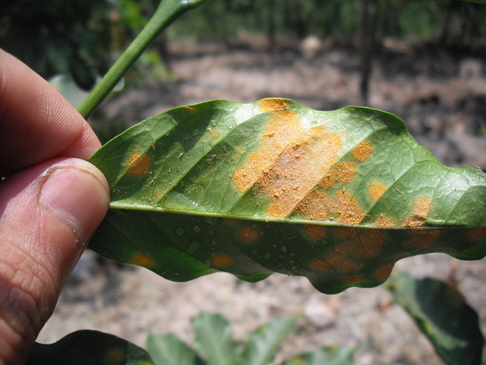
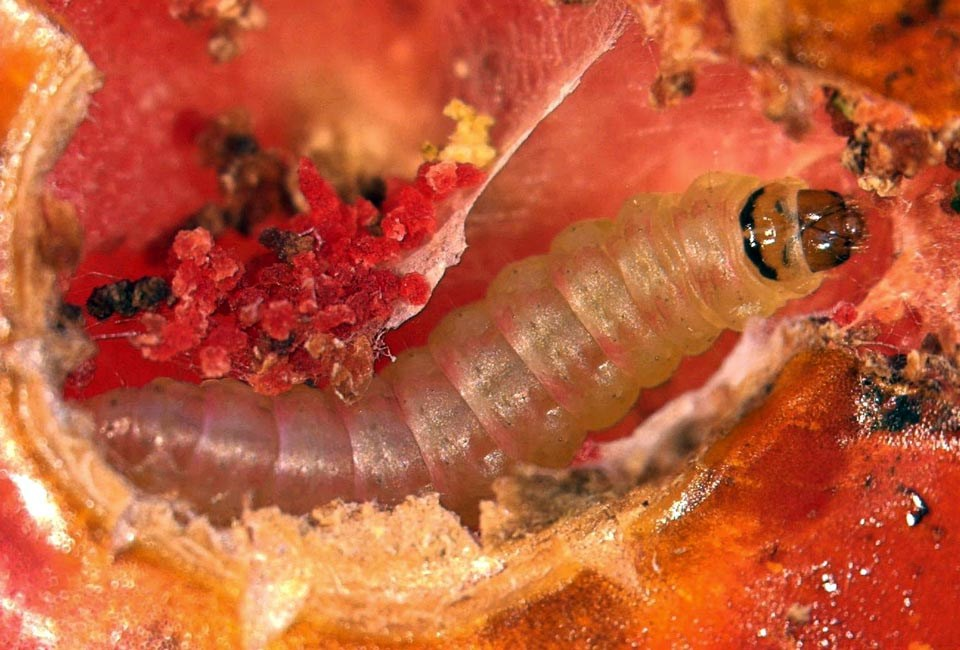

# Plant pathology

## Background

In global production, 40% loss is attributed to insect; disease results in 13% loss of yield overall.

## Historical outbreaks of diseases

**Irish famine**

In about 1800, the potato, which was introduced in Europe from south and central america around 1570 AD was a well established crop in Ireland. After strong objections against adopting it because (1) it was new and not mentioned in the Bible, (2) it was produced in the ground and, therefore, was unclean, and (3) because parts of it were poisonous, the potato was nevertheless adopted and its cultivation spread rapidly. Adoption of potato cultivation came as a result of it producing much more edible food per unit of land than grain crops, mostly wheat and rye, grown until then.

Irish farmers grew potato well for many years, free of any serious problems. In the early 1840s, potato crops began to fail to variying extents in several areas of Europe and Ireland. Most of the growing season of 1845 in Ireland was quite favorable for the growth of potato plants and for the formation of tubers.
 
Around 8 million people suffer from famine due to late blight of Potato by _Phytophthora infestans_. About 1.5 million people died of hunger and many emigrate to other countries, mostly North America.

**Ceylon srilanks**

Rust was first reported in the major coffee growing regions of Sri Lanka (then called Ceylon) in 1867. The causal fungus was first fully described by the English mycologist Michael Joseph Berkeley and his collaborator Christopher Edmund Broome after an analysis of specimens of a “coffee leaf disease” collected by George H.K. Thwaites in Ceylon. Berkeley and Broome named the _Hemileia vastatrix_ (Pucciniales, Basidiomycota), "Hemileia" referring to the half smooth characteristic of the spores and "vastatrix" for the devastating nature of the disease. Farmers completely burned down the orchard and restarted the cultivation.

```{r coffee-rust-symptom, out.width="50%", fig.cap="Coffee leaf showing rust pustules due to fungus"}

```

**Downy mildew of grapes**

Class: Oomycota
Order: Peronosporales

_Plasmopara viticola_, also known as grape downy mildew, is considered to be the most devastating disease of grapevines in climates with relatively warm and humid summers. It was first observed in 1834 by Schweinitz on Vitis aestivalis in the southeastern United States. France was among the first of the European countries to gain experience in dealing with the pathogen. Within just a few years of the pathogen's introduction the French attempted to graft American root stock to their own vines in order to produce a more resistant strain of grape. Depending on the year, production of grapes in France has been estimated to have been reduced by as much as 50%.

```{r grape-downy-mildew, out.width="45%", fig.cap="Electron micrograph image of downy mildew fungus (\\textit{Plasmopara vitticola})"}
knitr::include_graphics("./images/Plasmopara_vitticola.jpg")
```

**Bengal famine of 1943**

The Bengal famine stroke Bengal province of British India during World war II. An estimated 2.1-3 million, out of a population of 60.3 million, died of starvation, malaria, or other diseases aggravated by malnutrition, population displacement and other causes. Affecting of winter rice with a severe outbreak of fungal brown spot disease ( _Helminthosporium oryzae_) is considered to have a major role in the exacerbation of famine besides, political and other causes, cyclone particularly.

\bquestions

\question Classify various natural enemies and the nature of their effects on plants.

\bsolution

```{r natural-enemy-classification}
tribble(
  ~"Taxonomic group", ~"Enemy group", ~"Effect on plant", 
  "Virus", "Pathogen", "Disease infection",
  "Phytoplasma", "Pathogen", "Disease infection",
  "Fungus", "Pathogen", "Disease infection",
  "Higher plant", "Parasite", "Infestation",
  "Nematode", "Parasite", "Infestation",
  "Insect", "Parasite", "Infestation",
  "Insect", "Herbivores", "Infestation",
  "Snail and slug", "Herbivores", "Infestation",
  "Vertebrate", "Herbivores", "Biting damage"
) %>% 
  knitr::kable(booktabs = TRUE, caption = "Taxonomic group of organisms and nature of damage to crops", longtable = TRUE) %>% 
  kableExtra::kable_styling(latex_options = "striped", font_size = 8)
```


\esolution

\equestions

## Disease pests

### Rust

**Management**

Macrocyclic disease: _Puccinia graminis_ is a macrocyclic heteroecious fungus that causes wheat stem rust disease. The repeating stage in this fungus occurs on wheat and not the alternate host, barberry. The repeating stage allows the disease to persist in wheat even though the alternate host may be removed. Planting resistant crops is the ideal form of disease prevention, however, mutations can give rise to new strains of fungi that can overcome plant resistance. Although the disease cannot be stopped by removal of the alternate host, the life cycle is disrupted and the rate of mutation is decreased because of reduced genetic recombination. This allows resistance bred crops to remain effective for a longer period of time.

Demicyclic Disease: Because there is no repeating stage in the life cycle of demicyclic fungi, removal of the primary or the alternate host will disrupt the disease cycle. This method, however, is not highly effective in managing all demicyclic diseases. Cedar-apple rust disease, for example, can persist despite removal of one of the hosts since spores can be disseminated from long distances. The severity of Cedar-apple rust disease can be managed by removal of basidiospore producing galls from junipers or the application of protective fungicides to junipers.

Sulphur powder is known to stop spore germination. Fungicides such as Mancozeb and Triforine may help but may never eradicate the disease.

**Common rust fungi in agriculture**

- _Hemileia vastatrix_ (Coffee rust); Primary host is coffee plant; unknown alternate host. Heteroecious
- _Phakopsora meibomiae_ and _P. pachyrhizi_ (Soybean rust); Primary host is soybean and various legumes. Unknown alternate host. Heteroecious
- _Puccinia coronata_ (Crown Rust of Oats and Ryegrass); Oats are the primary host; Rhamnus spp. (Buckthorn) is alternate host. Heteroecious and macrocyclic
- _Puccinia graminis_ (Stem rust of wheat and Kentucky bluegrass, or black rust of cereals); Primary hosts include: Kentucky bluegrass, barley, and wheat; Common barberry is the alternate host. Heteroecious and macrocyclic
- _Puccinia hemerocallidis_ (Daylily rust); Daylily is primary host; Patrina sp is alternate host. Heteroecious and macrocyclic
- _Puccinia triticina_ (Brown Wheat Rust) in grains
- _Puccinia sorghi_ (Common Rust of Corn)
- _Puccinia striiformis_ (Yellow Rust) of cereals
- _Uromyces appendiculatus_ (Bean Rust) in common bean (Phaseolus vulgaris)[16]
- _Puccinia melanocephala_ (Brown Rust of Sugarcane)
- _Puccinia kuehnii_ (Orange rust of Sugarcane)

**UG99**

It is a lineage of wheat stem rust ( _Puccinia graminis f. sp. tritici_), which is present in wheat fields in several countries in Africa and Middle east and is predicted to spread rapidly through these regions and possibly further afield, potentially causing a wheat production disaster that would affect food security worldwide. It can cause up to 100% crop losses and is virulent against many resistance genes which have previously protected against stem rust.

### Citrus decline in Nepal

Citrus greening disease or HLB was first reported from China in 1919 by Reinking while evaluating diseases of economic plants in southern China and used English term “yellow shoot” of citrus in the report. At that time it was believed that the HLB was caused by abiotic factors like Zn deficiency/toxicity and poor drainage system. By 1967, it became established that greening was graft and insect transmissible with conclusion caused by virus (Bove 2006). In 1967, mycoplasm like organisms (MLOs) were believed to be associated with plant diseases mostly with "yellow" symptoms resembling with greening symptoms. On close examination, these organisms were seen to have bacterial cell wall in addition to cytoplasmic membrane, suggesting that they were gram negative true bacteria (Garnier and Bove 1977). Thus, it was concluded that the HLB agent was gram negative bacterium -- _Liberobacter asiaticus_.

Citrus decline was reported for the first time in Pokhara valley by Thrower (1968) in Nepal. Based on visual observation, Knorr et al (1970) suspected that the decline was caused by greening disease entered with the planting materials introduced to Horticulture Research Station, Pokhara from Saharanpur, India. About 55% of citrus trees in Pokhara valley and 100% in Horticulture Research Station were symptomatic to HLB in 1980s (Regmi 1982).

More recent PCR test showed that HLB is widespread in many citrus pockets of Kaski, Syanja, Tanahu, Lamjung and Dhading districts (Bove 2006 Regmi and Yadav 2007 Regmi et al 2010).

**Diagnosis of Citrus decline**

Visual symptoms are apparent on leaves and fruits. A tree infected with HLB in the field usually develops one or more yellow shoots with other parts of the tree healthy or symptomless. The affected leaves develop a pattern of yellow and green areas lacking clear limits between the colors, giving a "blotchy mottle" appearance. This is the most characteristic foliar symptom and the patterns are asymmetrical on the two halves of the leaf (Bove 2006). Leaves can also become thicker, with veins enlarged and corky in appearance. In later stages, Zn deficiency-like symptoms can be seen followed by leaf drop and twig dieback.

Currently, other methods besides visual diagnosis of Huanglongbang are molecular marker based test (quantative PCR), biological indexing, iodine test and spectroscopy. Based on severity of HLB symptoms and the ability to continue growth of the plants inoculation with _Ca._ L. _asiaticus_ Folimonova et al (2009) grouped citrus genotypes into four categories as 
i. sensitive: C. halimii, Nules clementine mandarin, Minneola tangelo, sweet oranges and grapefruit
ii. moderately tolerant: Sun Chu Sha mandarin, sour orange, volkamer lemon, C. macrophylla, wingle citrumelo, citron, Palestine sweet lime, acid lime, calamondin, and C. micrantha
iii. tolerant: Eureka lemon, Persian lime, Carrizo citrange, and Severinia buxifolia 
iv. variable (some branch sensitive and some branch tolerant): pummelos, C. amblycarpa, cleopatra mandarin, C. indica, and meiwa kumquat.

**Citrus greening control**

- Inoculum reduction and vector control: Planting of certified clean planting materials, effective control of its vector psyllid populations and removal of infected trees that serve as an inoculums source for psyllid acquisition are the methods of choice. Biological control of the psyllid vector is only possible in locations that do not favour build-up of psyllid populations and is often compromised when hyper-parasites are present.

- Chemical control: Combination of penicillin and streptomycin (PS) was effective in eliminating or supressing the bacterium.

- Nutrition: Preliminary results of the research showed that HLB-infected trees are consistently deficient in Ca, Mg, Mn, Zn and B, and in an orchard. The main cause of visible HLB symptoms, yield reduction, and tree decline appears to be disruption of phloem tissue, which blocks the flow of photosynthate and nutrients from source to sink tissue. Hence plant growth enhancers, mainly that of root system should, to some extent, alleviate the symptoms of HLB.

- Use of tolerant rootstocks: The citrus rootstock US-897 ( _Citrus reticulata_ Blanco x _Poncirus trifoliata_ L. Raf.) was observed to be tolerant to HLB in field plantings.

- Guava intercropping: An observation in Vietnam in 2000, noted that the normal life of sole citrus plantings in Mekon region was 2 to 4 years, but those interplanted with white guava were surviving for up to 15 years (Gottwald et al 2010). Raising guava as an intercrop reduced psyllid population in citrus orchards.

### Guava wilt

Causative agent: _Fusarium oxysporium f. psidi_, _Rhizoctonia spp._

Guava plants are attacked by wilt causing pathogen, which alone causes heavy losses in Nepalese guava trees. Yellowing and browning of leaves from the twigs tip. Leaves die off causing cracking in the twigs and trunk leading to the complete wilting and decline of entire tree. The incidence is more severe in alkaline soil and during winter season.

**Control measures**

- It is better to remove such trees as soon as the symptoms are identified to prevent the spread of disease.
- Apply 15 gm of bavistin at the basin of each plant after pruning in March, June and September.
- Liming of the pits.
- Use of resistant root stock such as chinese guava and wilt resistant variety like Allahabad safeda, Banarasi, Nasik etc.

### Fruit rot of guava

Causative agent: _Phomopsis psidi_

This is a serious disease especially during rainy seasons. The symptoms are manifested as development of dark brown circular spots at the blossom end of the immature green fruits.

Control measures: Application of Zineb (0.2%) or aureofungin (10 ppm) as monthly sprays during June to October can control the disease. Apply Kavach/Rovral (2g/ltr) and Carbendazim (1 g/ltr) during rainy season.

### Fruit canker 

Causative agent: _Pestalotiopsis psidi_

Cankerous growth on fruit leading to cracking of fruits.

Control measures: Apply Dilhan 278 (2g), Cuman L (4 ml/ltr) and Rovral (2g/ltr) during rainy season.

### Chirke and furket of Cardamom

### Downy mildew of cucumber

### Stemphyllium blight of lentil

### Root knot nematode of Tomato, Brinjal and Lady's finger


## Pesticides

### History

- The oldest available record is Homer's mention (about 1000 BC) that Odysseus burned sulfur to purge the hall and the house and the court.
- In 1669, the earliest known record of arsenic as an insecticide in the western world mentioned its use with honey as an ant bait.
- Use of tobacco as contact insecticide was mentioned later in the same century.
- Copper compounds were known since 1807 to have fungicidal value, and the Bordeaux mixture (hydrated lime and copper sulfate) was first used in France in 1883.
- Hydrocyanic acid, known to the egyptians and the Romans as a poison, was used as a fumigant in 1877 to kill museum pests in insect collections.
- Carbon disulfide has been used as an insect fumigant since 1854.
- Mercury chloride was extensively used as fungicide since 1891, and was slowly replaced by its organic forms such as phenylmercury (1915), alkylxyalkylmercury (1920s).
- First synthetic organic insecticides that appeared for public use was probably dinitro compounds and thiocyanates (in early 1930s)
- These led to proliferation of new synthetic pesticides including DDT, organophosphates and pyrethroids.
- Paul Muller (awarded nobel prize in Medicine for his discoveries) in 1939 found dichlorodiphenyltrichloroethane (DDT) acted as a contact poison on flies, mosquitores, and other insects. In 1945, monsanto begins manufacturing 2,4-D.
- In 1949, case of human exposure to dioxin causing severe skin lesions was first documented.
- Organic sulfur fungicides such as captan, maneb and others were introduced in late 1950's, however some are known to have toxicological problems.
- In 1972 EPA banned DDT.
- In developing countries where the risk of contracting malaria is extremely high, DDT is permitted as a tool for mosquito population control. The benefit of suppressing the malaria-transmitting mosquitoes outweighs the risk of DDT exposure.
- Production of DDT in the USA peaked in the early 1960's and gradually declined. 
- In 1962 Rachel Carson published the book Silent Spring, an impassioned denouncement of the consequences of chemical contamination of the environment, with particular emphasis on the bioaccumulation of DDT and its effects on bird reproduction.
- Pyrethroids derive from molecules originally isolated from pyrethrum flowers which were used by Gaucasian tribes and in Persia since the early 1800's to control body lice. The flower extracts contain six closely related insecticidal esters, collectively referred to as the pyrethrins, whose main structures were elucidiated between 1910 and 1924.
- Some of the most commonly used pyrethroid insecticides, such as permethrin, cypermethrin, decamethrin and fenvalerate, were synthesized in the 1970s.


```{r historical-accidents-pesticide-release}
tribble(~"Year", ~"Event", 
        "1930s", "'Ginger jake' paralysis in the US caused by cresyl phosphates", 
        "1962", "Silent spring by Rachel Carson published", 
        "1970-73", "Restriction in the use of DDT in Sweden and US for its ecological effects", 
        "1971-72", "Outbreak of poisoning in Iraq due to alkylmercury fungicides", 
        "1976", "Poisoning of spraymen in Pakistan by malathion due to its potentiation by impurities", 
        "1977", "Restriction on the use of dibromochloropropane for its toxicity on the male reproductive system", 
        "1984", "Accidents in Bhopal during the manufacture of carbaryl", 
        "1986", "Over 1000 tons of pesticides are spilled in the Rhine river") %>% 
  knitr::kable(booktabs = TRUE, caption = "Some toxicologically-related events involving pesticides") %>% 
  kableExtra::kable_styling(latex_options = "striped", font_size = 8) %>% 
  kableExtra::column_spec(1:2, width = c("6em", "20em"))
```

### Brief history of DDT

DDT (dichloro-diphenyl-trichloroethane) was developed as the first of the modern synthetic insecticides in the 1940s. It was intially used with great effect to combat malaria, typhus, and the other insect-borne human diseases among both military and civilian populations adn for insect control in crop and livestock production, institutions, homes and gardens. DDT's quick success as a pesticide and broad use in the US and other countries led to the develpment of resistance by many insect pest species. The US Department of Agriculture, the federal agency responsible for regulating pesticides before the formation of the US Environmental Protection Agency in 1970, began regulatory actions in the late 1950s and 1960s to prohibit many of DDT uses because of mounting evidence of the pesticide's declining benefits and environmental and toxicological effects. Rachel Carson's book Silent Spring in 1962 stimulated widespread public concern over the dangers of improper pesticide use and the need for better pesticide controls. DDT was firstly banned in 1972 by many European nations.

### Stockholm convention

The stockholm convention was brought about as a global treaty to protect human health and the environment from persistent organic pollutants (POPs). The convention seeks the elimination or restriction of production and use of all intentionally produced POPs (i.e. industrial chemical pesticides), and the continuing minimization and, where feasible, ultimate elimination of releases of unintentionally produced POPs, such as dioxins and furans. Stockpiles must be managed and disposed off in a safe, efficient, environmentally sound manner. The convention was finalized at the 5th Intergovernmental Negotiating Committee (INC) Meeting in Johannesburg in December, 2000. The signing and adoption of the Stolkholm Convention took place in Stolkholm on 23 May 2001 with entry into force following on 17th May 2004 after the fiftieth ratification. Currently, 176 countries are parties to the Convention.

```{r banned-pesticides}
tribble(
  ~"sn", ~"pesticide", ~"year_banned", ~"remark",
  5, "Aldrin", 2001, NA,
  9, "BHC", 2001, NA,
  1, "Chlordane", 2001, NA,
  3, "Dieldrin", 2001, NA,
  2, "DDT", 2001, NA,
  4, "Endrin", 2001, NA,
  6, "Heptachlor", 2001, NA,
  10, "Lindane", 2001, NA,
  12, "Organo mercury fungicides", 2001, NA,
  7, "Mirex", 2001, NA,
  11, "Phosphamidon", 2001, NA,
  8, "Toxaphene", 2001,  NA,
  14, "Monocrotophos", 2007,  NA,
  13, "Methyl parathion", 2007, NA,
  15, "Endosulfan", 2014, NA,
  16, "Phorate", 2015, "Use and distribution allowed untill 2077-09-16", 
  17, "Benomyl", 2018, "Use and distribution allowed untill 2077-09-16",
  18, "Carbofuran", 2018, "Use and distribution allowed untill 2077-09-16",
  19, "Triozophos", 2018, "Use and distribution allowed untill 2077-09-16",
  20, "Dichlorovus", 2018, "Use and distribution allowed untill 2077-09-16",
  21, "Carbaryl", 2018, "Use and distribution allowed untill 2077-09-16",
  22, "Carbosulfan", 2019, "Use and distribution allowed untill 2078-04-19",
  23, "Dicofol", 2019, "Use and distribution allowed untill 2078-04-19",
  24, "Aluminium Phosphide", 2019, "Use and distribution allowed untill 2078-04-19",
) %>% 
  arrange(sn) %>% 
  rename_all(function(x)str_replace_all(x, "_", " ") %>% str_to_sentence()) %>% 
  knitr::kable(booktabs = TRUE, caption = "List of pesticides banned in Nepal.") %>% 
  kableExtra::kable_styling(latex_options = "striped")
```


### Additional information

Annotations used in describing formulations:
- GR: Granule
- CG: Encapsulated granule
- SP: Soluble powder
- DP: Dusting powder
- WP: Wettable powder

### Chemical fungicides

- A popular fungicide, generally used for seed treatment, called Carbendazim is available in commercial formualtion as KI-BESTIN (Carbendazim 50% WP).
  - The commercial seed treatment fungicide is composed of:
    - 51% Carbendazim 98% (at minimum) a.i.
    - 2% Surface acting agent
    - 2% Dispersing agent
    - 2% Sticking agent (Glue powder)
    - 43% Inert carrier (China clay)
  - In case of carbendazim poisoning medical charcoal preparation 6-10 times is recommended.
  - It has green colored warning level.
  - It is manufactured by Kisan Agro Chemicals, Parsa, Birgunj, Nepal.
  - KI-BESTIN is a broad spectrum systemic fungicide useful as both spray and wetted powder form.

### Biopesticides

- _Trichoderma viridae_ (Nisarga, Nicoderma, Bio-Powder-F)
  - Available as 1% or 1.15% AI WP formulation.
  - Effectiveness: Stem rot, Root rot, Sett rot, Damping off, Ganoderma etc. Against _Fusarium_, _Sclerotium_, _Phytopthora_ and _Ganoderma_.
  - Utility crops: Potato, tomato, sweet pepper, garlic, cauliflower, onion, tea, coffee and pulses.
  - Dosage: Spray 5 gm Nisarga per liter of water solution. While applying in soil, 500 gm Nisarga is mixed with 2.5 kg of mature FYM or compost. This suffices for 1 ropani of land.

- _Pseudomonas_
  - Active ingredient: _Pseudomonas fluorescence_
  - Effectiveness: Onion smut, Paddy blast, Bacterial wilt of pepper and Dieback of tomato.
  - Useful against soil borne, seed borne and air borne pathogens.
  - Secondary metabolites, i.e. Auxin, Gibberelic acid and Cytokinins promote plant health.
  - Dosage: Spray 5 g of Pseudomonas commercial formula in 1 liter of water. While applying in soil, 500 gm Nisarga is mixed with 2.5 kg of mature FYM or compost. This suffices for 1 ropani of land.

- *Beauveria bassiana* (BABA, BIO-Powder)
  - Active ingredient 1.15%
  - Available in WP formulation

- *Verticillium lecani* (Mealikil(TM))
  - Available as 1.15% WP formulation
  - Verticillium fungicide is effective against sucking insects and nematodes.
  - In a ropani of land, use 500 gm of verticillium preparation with 2.5 kg of FYM/compost.

- Azadirachtin (Nimbicidine, Multineem, Multinemor, Niconeem, Neemate-10, Ozoneem Trishul)
  - Effectiveness: Against phytophagous insects for deterrence. It inhibits oviposition and is ovicidal (kills larvae if hatched)
  - Most effective against sap sucking type insects (Aphid, mealy bug, white fly, thrips, etc.) and chewing type insects (Stem and fruit borer larvae)
  - Has contact and systemic property
  - Dosage: 2-5 ml liquid in 1 ltr of water is sprayed in 12 days interval, 2-3 times.
  - Composition: 0.03%, 0.15%, 1%, etc.

- *Metarhizium anisopliae* (Pacer (TM))
  - Available as 1.15% WP formulation

- Nuclear polyhedrosis virus (NPV)
- Granulosis virus (GVs)

### Rodenticides

- Bromadiolone (Ratonil, Krazy ratmaar, Roban) available as 0.005-0.25% RB, WP and CB formulation.
- Zinc phosphide (All commando, Commando, K-rat, Ratal, Ratfre, Ratil, Ratox) available as 80% WW formulation.

### Waiting periods of some pesticides

```{r}
tribble(~"sn", ~"waiting_period (days)", ~"group", ~"common_name", 
        1, "1", "Bactericide", "Streptomycin sulphate + Tetracycline hydrochloride", 
        2, "3", "Botanical", "Azadirachtin, Metarhizium anisopliae, Pseudomonas flurescens", 
        3, "3-5", "Insecticide", "Dichlorovos", 
        4, "4", "Insecticide", "Beta-cyfluthrin", 
        5, "5", "Insecticide", "Novaluron, Buprofezin", 
        6, "5", "Miticide", "Fenpyroximate", 
        7, "6", "Insecticide", "Bifenthrin", 
        8, "6", "Miticide", "Dicofol",
        9, "6", "Fungicide", "Metiram",
        10, "3-7", "Insecticide", "Fenpyroximate", 
        11, "7", "Insecticide", "Cyfluthrin, Alphamethrin, Cypermethrin, Cyromazine, Deltamethrin, Diflubenzuron, Fenvalarate, Thiodicarb", 
        12, "7", "Botanical", "Beuveria bassiana, Trichoderma viride, Verticillium lecani", 
        13, "7", "Weedicide", "2-4 D NA salt, Pyrazosulfuron ethyl",
        14, "10", "Insecticide", "Emamectin benzoate", 
        15, "10", "Fungicide", "Zineb", 
        16, "14", "Insecticide", "Abamectin, Alphacypermethrin, Carbofuran, Ethion, Lambdacyhalothrin, Lufenuron, Malathion, Profenofos, Triazophos", 
        17, "14", "Miticide", "Propargite", 
        18, "14", "Fungicide", "Carbendazim, Chlorothalonil, Copper hydrochloride, Copper hydroxide, Cymoxanil, Dimethomorph, Iprobenfos, Kresoxim, Methyl sulphur, Thiophanate methyl", 
        19, "15", "Insecticide", "Acephate, Acetamiprid, Dimethoate", 
        20, "15", "Weedicide", "Oxyfluorfen"
        ) %>% 
  rename_all(function(x)str_replace_all(x, "_", " ") %>% str_to_sentence()) %>% 
  knitr::kable(booktabs = TRUE, caption = "Waiting period of some commonly used pesticides", longtable = TRUE) %>% 
  kableExtra::kable_styling(latex_options = "striped") %>% 
  kableExtra::column_spec(column = 1:4, c("4em", "6em", "6em", "20em"))
```


## Pathogenic Nematodes

- Nematode is derived from the Greek words, "Nema" = thread/fibre, "toda" = worm.
- In germany, there is a separate University of Nematology.
- Nematodes can be defined as unsegmented, bilaterally symmetrical, tryploblastic, pseudocoelomate, invertebrate, and thread like worms.
- So far 50000 nematode species are recorded worldwide. 10000 are found in fresh water and soil. 300 species are known to be plant parasites.
- Molya disease ( _Heterodera avenae_) causes 6-7 crore/year loss in Rajasthan and ear cockle ( _Anguina tritici_) causes 8 crore loss in India.
- _Radopholus similis_ was found associated with citrus decline in Florida, USA.
- In India, _Tylenchulus semipenetrans_ was associated with citrus decline.

- Plant parasitic nematodes are triploblastic, bilaterally symmetrical, unsegmented, pseudocelomate and vermiform animals.
- The body of the nematode may be elongated, spindle shaped, fusiform tapering towards the end but the cross section is always circular.
- Smallest nematode is 10mm long ( _Paralongidorus_).
- Female nematodes are more virulent and agressive than male in attacking and parasitizing the plants.
- Plant parasitic nematode possess spear or stylet.
- Nematodes are known to transmit viruses:
  - Two single stranded RNA virus genera, Nepovirus (NEPO) and Tobravirus (TOBRA).
  - 11 species of Xiphinema transmit 13 NEPO virus (Grapevine fan leaf virus)
  - 11 species of Longidorus transmit 10 NEPO virus
  - 14 species of Trichodorus transmit various strains of TOBRA virus: tobacco rattle and pea early browning

**Insect transmitted viruses**

```{r insect-transmissed-viruses}

tribble(~"Virus", ~"Nematode", 
        "Rice dwarf virus", "Nephotettix cincticeps", 
        "Rice tungro virus", "Nephotettix impicticeps", 
        "Rice grassy stunt virus", "Nilaparvata lugens", 
        "Tomato spotted wilt virus", "Thrips tabaci, Frankliniella spp.", 
        "Tomato yellow leaf curl virus", "Bemisia tabaci", 
        "Tomato yellow mosaic virus", "Bemisia tabaci", 
        "Soybean yellow mosaic", "Bemisia tabaci", 
        "Grapevine virus A", "Pseudococcus longispinus (Mealybugs)", 
        "Cowpea mosaic virus", "Epilachna varivestis", 
        "Potato virus X virus", "Melanoplus differentialis (Grasshopper)", 
        "Tobacco mosaic virus", "Liriomyza langei (Leafminer); Mechanical transmission", 
        "Onion mosaic virus", "Eriophyses tulipae (Mites)", 
        "Soybean mosaic virus", "Aphids", 
        "Potato leaf roll virus", "Myzus persicae") %>% 
  knitr::kable(booktabs = TRUE, caption = "Insect mediated virus transmission") %>% 
  kableExtra::kable_styling(latex_options = "striped")
```


## Crop diseases

### Ergot (Wheat, barley, oats, rye, triticale)

Hosts: 
All grasses, particularly, blackgrass ( _Alopecurus myosuroides_)

Symptoms:

- Causal fungus only attacks ears of flowering, replacing the grain in a few spikelets by a hard, purple black sclerotium, known as ergot.
- Such ergots can be very large, upto 2 cm in length, and very obvious in the standing crop in contaminated grain samples.

Life cycle:

- Ergot is not truely a seed borne disease, however it can be spread by ergots in contaminated seeds.
- At or near harvest, ergots fall to the ground where they remain untill the following summer, when they germinate to produce club-shaped spore bearing structure (stroma). These ascospores are spread by the wind to nearly open flowers of grasses/cereals. The spores germinate in flower, infecting the ovaries. This infection leads to the production of secondary spores (condia) encased in sticky secretion commonly referred to as honeydew. This attracts insects which carry the spores to other flowers, where further infection can occur.
- Wheat and other cereals are less severely affected than rye although, occassionally more open-flowerd wheat variety can be badly affected.
- Disease is favored by cool, wet conditions during flowering which facilitate spore production and prolong the flowering period, making infection more likely.

Importance:

- Very little direct effect on yield.
- Affects stocks which when fed to flour made with cereals with large amount of toxic alkaloid containing ergot, possess health risks.

### Fusarium

Fusariusm head blight/ear blight, foot rot, seedling blight
Pathogen: _Fusarium spp._ and _Microdochium nivale_
Hosts: Wheat, barley, oats, rye triticale and grasses.

Symptoms:

- Form a complex of diseases on seeds, seedlings and adult plants.
- _Microdochium nivale_ (formerly known as _Fusarium nivale_) is seed-borne pathogen and causes seedling blight resulting in seedling death and thinning of plant stand.
- _M. spp_ (other than _M. nivale_) cause a range of symptoms including brown lesions on stem bases, often restricted to outer leaf sheath.
- _Fusarium lesions_ often begin in the leaf sheath at the stem base where crown roots split the leaf sheath when emerging.
- This infection can spread up the leaf sheath causing long dark brown streaks at the stem base. The other symptom in cooler regions is brown staining of lower nodes.
- In older plants, fusarium infection can produce a true foot rot, where the stem base becomes brown and rotten, resulting in lodging and white heads.
- Symptoms are prevalent in very dry seasons as well.
- Ear blight causing fungus: _F culmorum_ and _F graminearum_ are common. Other are, _F avenaceum_, _F poae_ and _F langsethiae_.
- Infection frequently results in the whole or part of the ear becoming bleached.
- Symptoms seen when ears become infected during the early flowering stages, later infection may result in infection of grain but without obvious bleaching of the ears.
- Important due to its mycotoxin that gets accumulated in grains.

Life cycle:

- Most important source is seed but fungus survives on debris in soil also.
- Spores are splashed in canopy causing ear blights and seed borne infection, in wet seasons, especially during flowering and grain formation.
- Most fusarium species have competative saprophytic abilities which allow them to colonize debris and stubble in soil.

Importance:

- When wet season coincides with flowering high levels of ear blight can occur.
- Due to seed borne nature of pathogen, seed treatment plays role in preventing seedling loss in wheat.

### Major diseases of rice

1. Blast

- Bavistin, Dorosal 2-3 g per kg seed treatment
- Tricyclazole 75% WP 0.75 g per ltr spray at 15 days interval
- Kasugamycin 3% SL 1.5 ml per ltr at 15 days interval

2. Bacterial leaf blight
  
- Use Agromycin-100 0.25 g per ltr for seed soaking for 30 minutes

3. Brown leaf spot disease

- Bavistin, Dorosal
- Apply Mancozeb 75% WP (Dithane M-45) 3 g per ltr water, Propineb 70% WP 3 g per ltr water at 15 days interval for 3 times.

4. Foot rot

- Carbendazim 50% WP seed treatment

5. Sheath blight

- Maintain spacing
- Validamycin 3% L 3 g per ltr water; Pencycuron 22.9 SC 1.5 ml per ltr; Carbendazim 70% WP 1.5 g per ltr spray at 10-12 days interval for two times.

6. Khaira disease

- 20 g $\mathrm{ZnSO_4}$ + 12% $\mathrm{CaCO_3}$ in 50 ltr water per ropani at 10 days interval for 2 times.

### Major diseases of Wheat

1. Leaf blight

- Small brown dots on leaves
- Later on the dots coalesce to cause wilting or blighted appearance
- Use Vitavex-200 2 gm per kg seed as presowing treatment
- Increase potassium fertilizer dosage

2. Brown rust

- Orange color spots on upper surface of leaves.
- Spots do not coalesce or merge
- Mancozeb (Dithane M-45 45 WP) 1.5-2 kg in 750 ltr water spray at interval of 15 days for 2-3 times.

3. Yellow rust

- Yelow colored spots, elongated and jointed to form stripes
- Cultivation of resistant varieties: WK-1204, Pasang Lhamu.

4. Loose smut

- Instead of grains black mass of fungal hyphae fills the panicle.
- Use of healhty seeds, Vitavex-200 2 g per kg seed treatment
- Bury the sick panicles in initial stage of disease appearance.
- Annapurna variety is relatively tolerant to disease.

5. Stinking smut/hill smut

- Diseased grains are rounded, black colored spores filled
- Spores only released after grain is crushed
- Smell of fish
- Crop rotaion for 2-3 years, Vitavex-200 2 g per kg seed treatment.

6. Wheat blast

- Wheat blast caused by _Magnaporthe oryzae_ (synonym _Pyricularia oryzae_) pathotype Triticum. was first discovered in Brazil in 1985 and limited to South America until 2016.
- Appeared in Bangladesh for the first time in february 2016.
- Spread to several south-western and southern districts.
- Covering 15% of the total wheat area in Bangladesh.
- About 15,000 ha was affected.
- Emerged as a serious threat to the country's aggregate wheat production.
- Initial symptoms appeared in mid February and worsened within 2 weeks.
- Infected spikes were partially or wholly beached above the infection point on the rachis.
- Infected samples were collected and examined at Wheat Research Centre, BARI, Dinajpur.
- The identification is done based on typical:
  - Symptoms reported in South America
  - Fungal growth on infected rachis in moist blotters
  - Pyriform 2-septate conidia of P. oryzae.
- Blast infected grains are smaller in size.

**Disease epidemiology**

- The disease is seed-borne/transmitted
- Disease develops in patches then spreads to whole plot by wind and or rain splash.
- Heads are severely infected, while the canopy remains green.
- ...

### Major diseases of jackfruit

1. Pink disease ( _Botryobasidium salmonicolor_)

# Entomology

## Pesticide toxicity

- A pesticide is any substance used to control pests. Pests may be target insects, vegetation, fungi, etc. Most control the pests by poisoning them. Unfortunately, pesticides can be poisonous to humans as well.

- Toxicity: The toxicity of a substance is its capacity to cause injury to a living system. A living system can be things such as a human body, parts of the body (lungs or respiratory system), a pond, a forest and those creatures that live in there. Toxicity represents the kind and extent of damange that can be done by chemical. In other words, if you know the toxicity of a pesticide, you know how poisonous it is.

- Dose-time relationship of pesticide toxicity
  - Dose is the quantity of a substance that a surface, plant or animal is exposed to.
  - Time means how often the exposure occurs.
  - This relationship gives rise to two types of toxicity.
  1. Acute toxicity: This refers to how poisonous a pesticide is to a human, animal or plant after a single-term exposure. It generally implies the effect that occurs within 24 hours of exposure.
  2. Chronic toxicity: This refers to delayed poisonous effects from exposure to substance.
  
- Routes of entry:
  1. Local: local effect refers to those that take place at the site of contact with material. e.g. skin irritation/inflammation on th hand in response to hand contact, irritation of mucous membrane lining the lungs due to inhalation of toxic fumes.
  2. Systemic: Effect that occur away from the original point of contact. These pesticides are distributed throughout the body once they enter. They function by blocking or stimulating a chemical signal, generally that of the nervous system (Cholinesterase).

- Pesticides may have following actions:
 - Additive, antagonistic or synergistic
 - Immediate or delayed
 - Reversible or irreversible action
 
- Exposure may result in following effects:
  - Reproductive effects
  - Teratogenic effects: Effect on unborn offspring, such a birth defects.
  - Carcinogenic effects: Cancer in living animal tissues.
  - Oncogenic effects: Tumor forming effect (not necessarliy cancerous)
  - Mutagenic effects: Permanent effect on genetic material that can be inherited
  - Neurotoxicity: Poisoning of nervous system, including the brains.
  - Immunosupression
  
Acute toxicity measures

To figure out how acutely toxic a pesticide is, scientists give laboratory animals short-exposure to does of pesticide being tested. Experimental doses are given orally, as well as put on eyes, skin, and in the air that test animals breathe. These animals are then carefully observed for the changes.

**LD50**

Amount of a pesticide that has killed half of the animals in a laboratory test. LD50 values are effective for both oral and dermal routes of exposure. But they do not tell us about how the chemical acts, nor about how sensitive different organs within an animal or human might be. LD50 for different chemicals can be compared if the same test animial was used. The LD50 values are measured in unit of weight called mg per kg (or interchangeably, parts per million).

**LC50**

This measure of toxicity gives the acute inhalation toxicity.

Chronic toxicity measures

There is no standard measure like LD50 for chronic toxicity studies. Often the length of the experiment is in days, months or years and the amount of each dose is stated. For e.g., a study of chronic oral toxicity might look like, "8 mg of pesticide to rats daily for two years. No symptoms of poisoning appeared."

- Two classes of pesticides, organophosphates and carbamates can slowly poison by attacking an essential body chemical called "cholinesterase". The chronic exposure to Organophosphate pesticides can be measured by monitoring changes in blood cholinesterase levels. In humans, decrease in cholinesterase levels are sure sign that exposure to these types of pesticides should be avoided untill the level is measured as being normal again.

Categories of pesticide toxicity

```{r pesticide-hazard-category}
tribble(~"Toxicity class", ~"Toxicity label", ~"Oral LD50 (mg/kg)", ~"Dermal LD50 (mg/kg)", ~"Inhalation LC50 (mg/L)", 
        "Highly toxic", "Danger", "0-50", "0-200", "0-0.2", 
        "Moderately toxic", "Warning!", "50-500", "200-2000", "0.2-2", 
        "Slightly toxic", "Caution!!", "500-5000", "2000-20000", "2-20", 
        "Relatively non-toxic", "Caution!!", ">5000", ">20000", ">20") %>% 
  kable(booktabs = TRUE, caption = "Categories of pesticide toxicity") %>% 
  kableExtra::kable_styling(latex_options = "striped", font_size = 8) %>% 
  kableExtra::column_spec(1:5, width = c("6em", "6em", "8em", "8em", "8em", "8em"))
```

Status of pesticide use in Nepal

- Initially, DDT was imported in 1952 AD for control of Maleria.
- For the same purpose, DDT was reimported in 1955 AD
- For use in crops, DDT was imported in 1956 AD.
- According to Thapa, 2003, average pesticide use in Nepal is 142 gm/ha.
- In general, cropwise analysis of pesticide use signals alarming levels of residues, hence their current state of use being haphazard.
  - Tea: 2100 gm/ha
  - Cotton: 2560 gm/ha
  - Vegetables: 1400 gm/ha
  
- On environmental perspective, pesticides are of following types, based on bio-degradation:
  1. Environmentally degradable/non-persistent:
    - Dimethoate (Nuger, Roger, Dimet)
    - Dichlorovos (Dum, Vapon)
    - Fenitrothion (Folithion)
    - Malathion
  2. Environmentally non-degradable/persistent:
    - PoPs: Aldrin, chlordane, DDT, Dialdrin, Eldrin, Heptachlor, Mirex, Toxaphene, HCB, PCB, Dioxyn, Furan, etc.
    - These pesticides require special treatment facility for disposal.

## Farmers' field school (FFS)

Farmers' field school (or Farmer field school) is a widely used extension approach to educate farmers in agriculture. This approach was initated in Nepal with the FAO supported TCP project on community IPM in 1998 for the integrated management of BPH in rice fields. In addition, FFS curricula have been developed for the integrated pest management in different crops including maize. Different levels of facilitators (Officer, assistant level staff and farmers themselves) have been developed for different pests specific to crops.

While it may be worthwhile to train and aware local farmers on localized sporadic insect outbreaks, mass information campaign, rural radio broadcast, participatory video exhibition and community action plans may be needed to contain widespread regional outbreak of pests (like Fall armyworm outbreak in late 2019).

Integrated pest management (IPM) is the careful consideration of all available pest control techniques and subsequent integration of appropriate measures that discourage the development of pest populations, and keep pesticides and other interventions to levels that are economically justified and reduce or minimize risks to human and animal health and/or the environment. IPM emphasizes the growth of a healthy crop with the least possible disruption to agro-ecosystems and encourages natural pest control mechanisms (definition from the International Code of Conduct on Pesticide Management, FAO/WHO, 2014). In order to support this, IPM implementation in Farmer Field Schools is based on four practical principles.

- Grow a healthy crop in a healthy farming system
- Conserve natural enemies
- Observe fields regularly
- Farmers become experts

These principles describe the main actions of IPM implementation through FFS. Specific processes that take into consideration the variation of each field and farm family backup each principle, so that management can be done on a field-by-field, season-by-season basis. IPM is not a "packaged technology", but also a decision-making process that is adopted by farmers and farming community it is gradually improved with greater ecological knowledge and observation skills.


## Crop insects

### Major insects of rice

1. Seed bed bettle, mole cricket, field cricket
2. Borer
3. Rice hispa
4. Hoppers
5. Rice bug
6. Leaf roller
7. Mealy bug

### Major insects of wheat

1. Larvae of wireworm

- Similar to cutworm in Maize (damages the crop at night)
- Use Bt for control
- Malathion 5% DP 2 g per kg with wheat bran 1/2 kg per ropani, during evening
- Chlorpyrifos 10% Granule or Malathion 5% DP 1 kg per ropani for soil treatment

2. Aphid

- Lady bird beetle is its natural enemy
- Dimethoate 30% EC 1 ml per liter water

3. Pink stem borer

- Same as that for control of Maize stem borer

### Major insects of leguminous crops

#### Soybean hairy caterpillar (Spilosoma obliqua)

- Larvae is hairy with black and red hair (3-9 weeks)
- Feeds gregariously in foliage upto 3rd instar and feeds whole foliage part of plant after 4th instar.
- Adults have light yellow wings, larger spot in hind wings and small black spot in fore wings. They bear red abdomen.

(...Continue from note copy)

### Major insects of tomato

#### Leaf miner of tomato ( _Tuta absoluta_)

The tomato leafminer (aka. Tomato pinworm and South American tomato moth) is a species of moth in family Gelechiidae. _T. absoluta_ was originally described in 1917 by Meyrick as _Phthorimaea absoluta_. The pest was finally described under the genus Tuta as _T. absoluta_ by Povolny in 1994. In India, Maharashtra state tomato cultivation were affected in Nov 2016.

Its life-cycle comprises four development stages: egg, larva, pupa and adult. Adults usually lay eggs on the underside of leaves or stems, and to a lesser extent on fruits. Adult female live 10-15 days and male live 6-7 days. 

After hatching, young larvae penetrate leaves, aerial fruits (like tomato) or stems, on which they feed and develop. Larvae drop to the ground in a silken thread and pupate in soil. Pupae (length: 5–6 mm) are cylindrical in shape and greenish when just formed becoming darker in colour as they are near adult emergence. Adults are 6–7 mm in length and present filiform antennae and silver to grey scales. Black spots are present on anterior wings, and the females are wider and more voluminous than the males. The adult moth has a wingspan around 1 cm. In favorable weather conditions eight to ten generations can occur in a single year. 

```{r tuta-larvae, out.width="60%"}

```


The pest mainly presents nocturnal habits, and adults usually remain hidden during the day, showing greater morning-crepuscular activity with adults dispersing among crops by flying. Among a range of species within the Solanaceae, tomatoes ( _Lycopersicon esculentum_ Miller) appear to be the primary host of _T. absoluta_. 

**Management**

- Removing and destruction of infested plant parts. Tomato is the main host of the plant, but _T. absoluta_ also attacks other plants of the nightshade family -- Potato, eggplant, pepino, pepper and tobaccoo, including solanaceous weeds like _Datura stramonium_ and _S. nigrum_.
- Deep ploughing in spring season followed by solarization of field.
- Continuous irrigation and inundating of field can help prevent pupation.
- Crop rotation
- Use of exclusion net (especially in nursery condition); Mesh size of less than 1.6 mm is recommended.
- Use of sticky trap and light traps and yellow delta trap are useful in monitoring of _T. absoluta_ populations.
- Para-pheromone TLM lure in Wota-T traps. The para-pheromone traps are used to monitor the adult moths. 5 Wota-T traps/ropani or 1 light trap/ropani.
- Quarantine measures
- Neem based pesticides (Neem raj), Jholmol botanicals
- Imidacloprid, Emamectin benzoate (KINGSTAR, EMAR), Chlorantaniliprole (ALLCORA and CORAGEN) 18.5% EC 1 ml per 3 ltr of water sprayed every 10-15 days, Spinosad (TRACER) 45% SC 1 ml per 3 ltr water sprayed every 10-15 days, Chlorpyriphos and Cypermethrin.
- Chlorantaniliprole, Spinosad and Flubendiamide (ryanoid class) all have waiting period of 7 days, while Emamectin benzoate, ranked as Moderately hazardous has waiting period of 10 days.
- _Bacillus thuringiensis kurstaki_ (1% WP 2 g per 1 ltr water sprayed every 7 days) have shown some efficiacy in controlling outbreaks of this moth. Similarly, _Metarrhizium anisopliae_ ($1 \times 10^8$ CFU per gram ) 200-250 gm per ropani can be used for soil treatment.

**Monitoring of pest**

Crop damage should be monitored every two weeks. If noted abnormal minining in the leaf, with signs of mesophyll tissues being eaten and transparent veins exposed, suspect for presence of larvae of the pest. Tips of plant should show black massess, an indication of insect excreta. Fruits may show irregular strips of white coloration initially. In severe infestation, whole plant may appear as wilted. The larvae of Tuta will not enter diapause unless food is scarce. It is identifiable with characteristic pink colored body of 0.9 cm having half crescent rings like appearance in head.

### Major insects of guava

- Fruit fly ( _Dacus dorsalis_)
- Green shield scale ( _Chloropulvinaria psidii_)
- Mealy bugs ( _Ferrisia virgata_, _Plannococcus citri_)

### Major insects of jackfruit

1. Shoot and fruit borer ( _Diaphania caesalis_)
2. Giant mealy bug ( _Drosicha mangiferae_)

### Major insects of litchi

1. Fruit borer ( _Cryptophlebia illepida_, _Rapala varuna_, _Deudorix epijarbas_, _Deudorix isocrates_)
2. Fruit fly ( _Bactrocera dorsalis_)

### Fall armyworm (FAW)

The FAW life cycle is completed in 28-48 days depending on temperature and food availability but in laboratory conditions it has been observed to complete in 27-32 days at average daily temperature of $27^\circ$ C. Heavy rainfalls are reported to break the life cycle of FAW. The insect is not reported to have the ability to diapause.

In Nepal, considering the low winter temperatures, migratory FAW are supposed to arrive if allowed by conducive environmental conditions.

**Life cycle**

1. Egg: Creamy white or grey in color covered by light brown wool like material imparting a moldy appearance. The total eggs are dome shaped. The number of eggs per mass varies considerably but is often 100-200, and total egg production per female averages about 1500 with a maximum of over 2000. The female normally deposits most of her eggs during the first 4-5 days of life, but some oviposition continues to occur for upto 3 weeks. On average, adults live for 12-14 days. Egg continues unhatched for 2 days in warm laboratory conditions.

2. Larvae: The FAW has six larval instars. The first instar are whitish in color which later change into greenish color with black head. The larvae measures 30-35 mm long, and their color varies from brown, gray, yellowish, pinkish to greenish with granulated texture all over the body. The total larval period lasts 14-15 days in aforementioned laboratory conditions. Inverted 'Y' shaped whitish marking is present on the head. The best identifying feature of the FAW is a set of four large spots (pinacular) that form a square on the upper surface of 8th segment of body. The late instar larvae also have three creamy yellow stripes on the dorsal surface which run in parallel manner from thorax to last abdominal segment. Larvae tend to hide themselves in the plant whorls during the sunny day.

3. Pupa: The FAW normally pupates in the soil at a depth of about 2-8 cm. The larvae constructs a loose cocoon by tying together particles of soil with silk. The pupae is reddish brown in color, measuring 14-18 mm in length and about 4.5 mm in width. Duration of pupal stage is 6-8 days in lab conditions.

4. Adult: Moths have a wingspan of 32-40 mm. Hind wings in both male and female are white with black lines on inner margins. Adult male moth of the insect has distinct markings on the forewings whereas markings on female forewings are not distinct. In male moth, the forewing generally is shaded gray and brown, with triangular white spots at the tip. Brown and oval shaped spot is present at the center of forewings. The forewings of females are less distinctly marked, ranging from a uniform grayish brown to a fine mottling of gray and brown. Adults are nocturnal, and are most active during warm, humid evenings. Duration of adult life cycle (as observed in laboratory conditions in Nepal) is 5-7 days.

**Feeding behavior and damage**

The larvae can feed and damage entire plant including leaves, whorls, tassels, silk and ears. Early instars (1st and 2nd) feed by scrapping the leaf surface leaving the epidermis intact which results in the appearance of elongated papery windows of different size. They also bore into the whorl resulting into small pin holes.

Larvae of 3rd and 4th instars voraciously feed on foliage showing ragged and elongated holes on plant and size of holes increase with the growth of the larvae. Both 5th and 6th instars feed extensively and result in leaf area loss or defoliation overall. Severe feeding gives the appearance of maize plant that has been damaged by hail. After feeding, the larvae leave behind large amounts of moist saw dust like frass near the whorl and upper leaves.

In the maize crops' reproductive stage, taseel and ear are vulnurable to being bore into. The larvae can feed on kernels of ear affecting the yield, or cause quality deterioration due to mycotoxin contamination.

**List of pesticides that can be of potential use against FAW management**

1. Azadirachta indica extracts (Margo NF), Azadirachtin (Agriguard, astan-killer, astha neem super-1, etc.)
2. Bacillus thuringiensis (Chandani-5 WP, Lipel, Mahastra-0.5 WP)
3. Chlorantranilipole 18.5% SC (Allcora, Nicora gold, coragen, ferterra 0.4% GR) at the rate 0.4 ml/ltr of water.
4. Emamectin benzoate (Aberkiller, Allclaim) 5% SG at the rate 0.4 g/ltr of water.
5. Metarhizium anisopliae (Biocide manic, Emerald, Lalichakra, Pacer, Peak moti, Recharge, Varunastra)
6. Spinetoram (Delegate) 11.7% SC at the rate 0.5 ml/ltr of water
7. Spinosad (Tracer) (Registered in 2019) 45% SC at the rate 0.3 ml/ltr of water.

**Monitoring of FAW**

1. Trap selection: Suitable trap, it could be Funnel trap or Bucket trap
2.Lure selection: Procure FAW specific pheromone lure, and store lures in a Refrigerator ($4-5^\circ$C); change the lure once every 4-6 weeks.
3. Trap placement and setup: 
  - Establish the pheromone trap two weeks before planting at a height of approximately 1.25 meters from the ground level. 
  - Place the trap in or next to the maize field
  - Install the trap from a long pole in a vertical orientation to prevent water entering into it and adjust the trap height to at least 30 cm above plant height. 
4. Install 3 traps per cluster at the distance of at least 50 meters apart.
5. Trap monitoring and recording: Weekly intervals throughout the season
6. Monitoring and crop phenology/stage
7. Area-wide and community-based approaches in terms of pheromone traps could be more effective than at the individual farm level
8. Record the weather record(temperature, humidity, rainfall, etc.),wherever possible.
9. Share and use the FAW monitoring data with extension agents.

**Scouting pattern**

_W pattern_

- Scouting in the field is done in a semi-systematic manner to determine the risk of yield depression associated with foliar feeding and density of small and large larvae. It is one of the approaches that follow a "W" pattern to cover the entire field.
- While entering into the field for scouting at least two outer rows should be left. This is practiced to avoid border effect.
- At every point, inspect 10-20 plants in a row or around the central plant of the point (in case of scattered planting).
- Observe the signs in upper 3-4 leaves for damage or fresh frass carefully in each plant. Fresh frass indicates the presence of living larvae in the whorl.

_Ladder pattern_

**IPM options for FAW**

- Seed and varieties (Seed treatment with Imidachlorpid 48% FS at the rate of 4 ml per kg). This protects plant upto 2-3 after germination.
- Select maize varieties with tight husk cover.


**Cultural management practices**

- Avoid late and staggered planting. Early planting often helps to escape the peak migration and incidence of FAW adults.
- Use of recommended dose of manures and fertilizers.
- Maintain adequate soil moisture for producing vigorous and healthy plants which can withstand pest infestation and damage.
- Ploughing the field to a depth of 10 cm helps to expose FAW pupae to sunshine and natural enemies. Allow soil to be open for 2-3 after plowing for promoting this natural control.
- Adopt push-pull technology incorporating Desmodium grass and other legume crops such as pigeonpea, beans, groundnuts as intercrops for push and border crop of Napier grass for pull.
- Destroy crop residues after harvest for destroying sheltering eggs, larvae and pupae of FAW.
- Practice crop rotation with alternate crops to minimize the attack of FAW.

**Mechanical control**

- Hand picking and crushing of FAW egg masses and young larvae (if found in field) or emmerse them into soap water.

**Biological control**'

- Natural enemies in field should be conserved with a provision of sheltering and pollen resourceful flowering plants around. Some naturally occurring biological organisms identified as effective control agents against FAW include:

1. Predators (Earwigs, Ladybird beetles, Ground beetles, Assassin and flower bugs, predatory wasps, Spiders and Ants)
2. Parasitoids (*Telenomus remus*, *Chelonus insularis*, *Cotesia marginiventris*, *Trichogramma* spp., Fly parasitoids: *Archytas*, *Winthemia*, *Lespesia*)
3. Parasites and microbial pathogens (NPV, MNPV, BT, *Nomuraea rileyi*, Entomopathogenic nematodes (*Heterorhabditis, Steinernema*))

**Botanicals and indigenous management options**

- Use of local botanicals (neem, hot pepper, titepati, timur and other plant extracts) act as antifeedant and repellant against FAW.
- Sugary sprays, oil, "fish soup" or other materials can also be used to attract ants and wasps to the maize plants.

**Use of chemical pesticides**

## Pesticide and use registration in Nepal

Pesticides management act, 2076 (2019) defines "pesticide" as:

Any organic, vegetation, biological and chemical material which is used to protect plants, agricultural products, forest and forest products, living beings, livestock, human health, storage, packaging and construction works from any harmful disease, insect, mite, nematode, weed grass and rat, and this term also indicates the following substance:

1. substance that reduces the growth of insects (harmful living beings) by preying on them, being predator, being parasite or causing disease on them and pheromone, attractant, repellent and deterrent,
2. insect growth regulator, inhibitor,
3. plant growth inhibitor,
4. defoliant,
5. dessicant,
6. thinning agent,
7. agent for preventing problems including the premature fall of fruit,
8. substance in labs related to crops and agro-products to make disinfection (Disinfectant).

There are 2 methods to pesticide registration -- Analogous and Comprehensive. Method in use for registration in Nepal is the Analogous method. Chapter 2 of the act details the procedure as well as criteria for registration of pesticides.

### Registration procedure

1. Any person, institution or body shall register any pesticide and its active element with the Plant Quarantine and Pesticides Management Center, prior to making its production, synthesis, export, import, commercial use, storage, sale,distribution, transportation, packaging or re-packaging.
2. Any person, institution or body that wishes to make registration, should submit an application (accompanied by the details (refer to Table \ref{tab:application-details}) in the form prescribed).

```{r application-details}

```

3. After examination (based on the criteria detailed in Table \ref{tab:pesticide-examination-criteria}), if the prescribed terms are found to have been met, it shall register such pesticide and grant the certificate thereof.

```{r pesticide-examination-criteria}

```

4. The certificate shall be valid for 3 years.
5. Provisions relating to the fee required for the registration of a pesticide are as indicated in Table \ref{tab:pesticide-registration-fees}

```{r pesticide-registration-fees}

```

6. The ministry shall publish the name of the pesticides registered in the Nepal Gazette.

The act has provisions for following:

- Prohibition on use of pesticide not registered
- Power revoked or suspend registration
- Re-registration of the pesticide
- Renewal of registered pesticide (Renewal of registration is valid for another 3 years)

Similar to pesticide registration, Chapter 3 of the act has provisions relating License of the pesticide for:

- Production
- Synthesis
- Export
- Import
- Transport
- Packaging
- Repacking

The validity of the license is for 3 years, and further provisions relating to licensing, constitute:

- Application by entity (Person, institution or body) for obtaining the license in the prescribed format with details
- Examination by the Center
- Provisions relating to the license for sale, distribution, spraying of pesticides, granting of license for sale, distribution of pesticide and business of spraying of pesticides, renewal and revocation thereof shall be as provided in the Provincial law of the concerned Province.
- The license not renewed shall be deemed to have been revoked ipso-facto.
- Qualification of the person, institution or body wishing to obtain the license are as follows:

???

- License may be revoked by the Centre in case of violation of the terms specified at the time of granting the license.

The act (under Chapter 4) provisions formation of Pesticides Management Committee. There shall be a Pesticides Management Committee in order to provide opinion, suggestion and advice to the Government of Nepal on matters including the formulation of necessary policy related to the management of pesticides. The committee will be chaired by Secretary of the Ministry. The tenure of the members nominated shall be 3 years. The committee shall meet at least once in six months.

Following are the functions, duties and powers of the committee:

1. To  formulate  the  policy  on  pesticides  and  submit  it  to the Government of Nepal,
2. To encourage the private seector to make investment in organic, vegetation based and safe chemical pesticides industries,
3. To do, or cause to be done, acts relating to the setting of standards of pesticides and management of pesticides,
4. To give necessary suggestion to the Government of Nepal for the ratification and implementation of international treaties and agreements on pesticides,
5. To restrict the pesticides that cause adverse effect on human and animal health, health of living creatures and the environment,
6. To hear complaints made against the decisions made by the Inspector or the Chief,
7. To ascertain, or cause to be ascertained, if any substance or good is a pesticide or not,
8. To approve the standards on the management of pesticides and enforce, or cause to be enforced, the same,
9. To delegate the power as and when required to the Center and sub-committee,
10. To perform such other functions as prescribed.

The committee may, as required, form a sub-committee for the carrying out of acts of production, synthesis, import, export, commercial use, storage, sale, distribution, transportation, packaging or re-packaging of pesticides easily and smoothly.

The committee may delegate some of its powers to the Provincial Pesticide Management Committee.

There shall be a Plant Quarentine and Pesticides Management Center under the Ministry for carrying out the functions including the control, regulation, registration and management of pesticides. The Center has following functions, duties and powers:

1. To carry out necessary functions as the secretariat of the Committee,
2. To arrange for the registration or re-registration of pesticides,
3. To specify the process and procedure to be followed for the registration of pesticides,
4. To examine the applications received for the registration, re-registration of pesticides or renewal of the registered pesticides,
5. To issue the certificate upon registration and re-registration of pesticides and renew the same,
6. To issue the license for carrying out work relating to pesticides and renew the same,
7. To prepare such infrastructures as prescribed for the use of pesticides, 
8. To specify the standards for the equipment required for using pesticides,
9. To carry out such other functions as specified by the Committee,
10. To carry out such other functions as prescribed.

Chapter-6 of the act contains provisions for use and management of pesticides and provides explanation of following sections:

- Use of pesticides
- Use of domestic pesticides
- Production and use of vegetation based and organic pesticides to be encouraged
- Production and synthesis of pesticides
- Use of pesticides to be restricted
- Management of the expired pesticides
- Inspector to be appointed
- Functions, duties and powers of the Inspector
- Samples to be collected
- Establishment of laboratory
- Prohibition on advertisement of unregistered and restricted pesticides
- Disposal of pesticides
- Records to be maintained
- Code of conduct may be formulated

Chapter 7 and 8 contain sections on offence, punishment and compensation, and miscellaneous sections, respectively.


## Chemical control of insect pests

\scalebox{0.6}{\begin{minipage}{1.0\textwidth}

```{r chemical-control-insects}
read_csv("./data/chemical_control_insects.csv", skip = 1) %>% 
  rename_all(function(x)str_replace_all(x, "_", " ")) %>% 
  knitr::kable(booktabs = TRUE, caption = "List of chemical compounds used for pest control", longtable = TRUE) %>% 
  kableExtra::kable_styling(font_size = 8, latex_options = "striped") %>% 
  kableExtra::column_spec(column = 1:10, width = c("6em", "7em", "4em", "4em", rep("5em", time = 6)))
```

\end{minipage}}

## Pesticides and their effects on health

```{r pesticide-effects}
tribble(
  ~"Insecticides", ~"Effects",
  "Organochlorines", "Cause cancer, tumors, birth defects, mutations, blood disorders, spontaneous abortion, and damage to the brain, nerves and kidneys", 
  "Aldrin (Class II, 100 mg/kg) ", "Cumulative in animal tissue but rapidly eliminated when exposure is terminated, short-lived on foliage, half life in soil is approximately 1-4 months, shorter in tropical conditions.",
  "Lindane (gamma HCH, gamma BHC; Class II, 88 mg/kg)", "Stored in body fat",
  "Chlordane (Class II, Oral 460 mg/kg)", "Stored in body fat, highly residual. Harmful to fish.",
  "DDT (Class II, Oral 113 mg/kg)", "Stored in body fat, highly residual. Harmful to fish.",
  "Endosulfan (Class II, Oral 80 mg/kg)", "Not cumulative in body tissues, moderately persistent on foliage. 50 percent residue is lost from plant tissue in 3-7 days.", 
  "Organophosphates", "Build-up in humans with repeated exposure can cause irrversible nerve damage, loss of muscle functions. Spontaneous abortion, psychiatric disorders, and death. One teaspoonful of methy parathion spilled on the skin can be fatal",
  "Demeton-s-methyl", "Does not accumulate in the body tissue, relatively short lived -- 14-21 days.",
  "Diazinon", "Diazinon and its metabolities are rapidly excreted from the body, mainly in the urine, residue on foliage 5-10 days, and in the soil 2-3 weeks.",
  "Dichlorovos (Class IB, 56 mg/kg)", "Non cumulative in the body tissue",
  "Dimethoate (Class II, 150 mg/kg)", "Non cumulative in body tissue, as it is rapoidly excreted via the urine.",
  "Fenitrothion (Class II, 500 mg/kg)", "Does not accumulate in body tissue",
  "Malathion (Class III, 2100 mg/kg)", "Does not accumulate in body fat, residual properties are moderate",
  "Monocrotophos (Class Ib, 14 mg/kg)", "Does not accumulate in body fat, persistance 7-14 days. Half life in soil is 10-20 days.",
  "Parathion, methyl (Class Ib, 14 mg/kg)", "Does not accumulate in body tissue, non-persistent",
  "Phorate (Class IB, 2 mg/kg)", "Does not accumulate in body fat, residues in the soil approximately 14 weeks",
  "Phospahmidon (Class IA, 7 mg/kg)", "Does not accumulate in body tissues, half life on plants about 2 days",
  "Carbamates", "Cause nerve damage, spontaneous loss of muscle function, and death",
  "Carbaryl (Class III, > 300 mg/kg)", "Residual half life of 3-5 days",
  "Carbofuran (Class III, 8 mg/kg)", "Half life in the soil, 30-60 days, metabolised in the liver",
  "Pyrethroids", "Affects central nervous system",
  "Cypermethrin (Class III, > 4000 mg/kg)", "Does not accumulate in the tissues, residues on foliage 10-14 days but several weeks in the soil.",
  "Fenvalerate (Class III, 32000 mg/kg)", "Persistent in fat tissue but does not accumulate, short residual life on foliage (10-14 days) but several weeks in the soil.",
  "Copper oxychloride (Class III, 1440 mg/kg)", "Does not accumulate in animal tissues, relatively short life",
  "Mancozeb (Class II, 8000 mg/kg)", "Does not accumulate in body fats, residual-moderately persistent",
  "Tridemorph (Class II, 650 mg/kg)", "Residual properties 20-28 days, does not accumulate in animal tissues",
  "2,4-D (Class II, Oral 375 mg/kg in rats)", "Relatively short-lived dry residue, breaks down quite rapidly",
  "Atrazine (Class III, 7500 mg/kg)", "Residue approximately 6-12 months in soil depending on the soil type, slightly toxic to fish."
) %>% 
  knitr::kable(booktabs = TRUE, caption = "Effects of pesticides on health", longtable = TRUE) %>% 
  kableExtra::kable_styling(latex_options = "striped", font_size = 8) %>% 
  kableExtra::column_spec(column = 1:2, width = c("12em", "28em"))
```


## Integrated pest management

IPM is ecologically sound, environmentally non-pollutive, and sustainable to the economies of poor nations.

Integrated Pest Management aims to suppress pest populations below the economic injury level (EIL). The UN's Food and Agriculture Organization defines IPM as "the careful consideration of all available pest control techniques and subsequent integration of appropriate measures that discourage the development of pest populations and keep pesticides and other interventions to levels that are economically justified and reduce or minimize risks to human health and the environment. IPM emphasizes the growth of a healthy crop with the least possible disruption to agro-ecosystems and encourages natural pest control mechanisms."

An American IPM system is designed around six basic components:

1. Acceptable pest levels
2. Preventive cultural practices
3. Monitoring
4. Mechanical controls
5. Biological controls
6. Responsible use

The Plant Protection Center and the International Rice Research Institute (IRRI) have been encouraging farmers to grow flowers, okra and beans on rice paddy banks, instead of stripping vegetation, as was typical. The plants attract bees and a tiny wasp that eats planthopper eggs, while the vegetables diversify farm incomes.

### Development of resistance in insects

Nepal has been using chemical pesticides since 1955. In the beginning, they were considered to be boon for the farmers with sightings of dramatic yield increases, as well as being useful against of serious tropical diseases like malaria.

It was soon found that new chemicals were also responsible for environmental damage. People were poisoned through land, water and food. Indiscriminate use of pesticides was found to be responsible for creating new biotypes -- "super bugs".

Pyrethroid, endosulfan, organophosphate and carbamate insecticides created a resistance to them in the larvae of _Helicoverpa armigera_ in Nepal. _H. armigera_ strains from Pokhara showed a 12-fold resistance to pyrethroids in 1993 and that in 1995 in Nepalgunj was 103-fold. During the same period, 2-3 fold tolerance to endosulfan was recorded in Pokhara.

### IPM in Nepal

- In 1997, Nepal adopted the Community IPM (CIPM) and first project of that was implemented in 1998 as Farmer's Field School (FFS) in Chitwan (Kumroj and Kathar area) for the management of pest (Brown Plant Hopper) in spring rice.
- From the 9th five year plan (1997-2002), Government of Nepal listed IPM-FFS on the top priority.
- Nepal received additional financial support from the Norwegian Government under the technical support of FAO Regional Community IPM (CIPM) of Asia for 1998 - 2000.
- In 1999, one year after the first IPM-FFS lunched, two INGOs (CARE and World Education) also joined the CIPM program in Nepal.
- National IPM program (2003)
- Support to National IPM-FFS program (SNIPM) Phase-I (2004-2007)
- National Agriculture Extension Strategy (2006) of Department of Agriculture (DOA) has also given priority to IPM-FFS model. 
- Support to National IPM-FFS program (SNIPM) Phase-II (2008-2012)

### IPM techniques in pest control

1. Cropping system change
2. Mechanical control

#### Some traps used in pest monitoring and control

```{r pest-traps}
tribble(
  ~"sn", ~"trap", ~"use",
  1, "Light trap", "Nocuturnal insects with flight",
  2, "Yellow sticky trap", "Small insects with flight like, aphid, white fly, leaf minor",
  3, "Steiner trap", "Methyl eugenol, Cu-lure pheromone", 
  4, "Funnel trap", "Heli-lure, Spodi-lure, Lucinoid-lure, Pectino-lure, Scirpolure", 
  5, "Delta trap", "DBM and Protula-lure",
  6, "Ottati trap", "DBM, Protula-lure, PTM-lure",
  7, "McPhail trap", "Can be used with different pheromone based lures",
  8, "Pitfall trap", "Surface dwelling/crawling insects"
) %>% 
  knitr::kable(booktabs = TRUE, caption = "Some traps and lures for pest monitoring and management", longtable = TRUE) %>% 
  kableExtra::kable_styling(latex_options = "striped", font_size = 8) %>% 
  kableExtra::column_spec(column = 2:3, width = c("16em", "25em"))
```

```{r pheromone-traps-graphics, fig.cap="Different types of pheromone traps used in field; traps used in crop field (a-e), traps with trapped pest insects (f-h). a. one lure septum hanged with crop plant, b. net trap, c. water trap, d. bucket trap, e. bucket with window trap, f. delta trap, g. Yellow sticky trap, h. wing trap", out.width="50%"}

```

#### Some pheromone based traps and lures

```{r pheromone-lures}
tribble(
  ~"sn", ~"Trap name", ~"Use", ~"Crop",
  1, "Methyl eugenol", "Fruit fly larvae", "Citrus, mango", 
  2, "Cu-lure", "Fruit fly larvae", "Cucurbitaceous crops",
  3, "Bactrocera dorsalis", "Fruit fly larvae", "Citrus, mango and cucurbitaceous crops",
  4, "Heli lure", "Tomato fruit borer", "Tomato, chickpea, pigeonpea",
  5, "Spodo lure", "Tobaccoo leaf worm", "Tobaccoo, crucifer, potato and tomato",
  6, "DBM and protula lure", "Diamond back moth", "Crucifer",
  7, "Leucinoid lure", "Fruit and stem borer", "Brinjal", 
  8, "PTM lure", "Miner", "Potato",
  9, "Scirpo-lure", "Yellow borer", "Rice",
  10, "Pectino-lure", "Pink borer", "Cotton",
  11, "TLM-lure", "Tomato leaf miner", "Tomato"
) %>% 
  knitr::kable(booktabs = TRUE, caption = "Some commonly used phenomone traps and lures for respective crops", longtable = TRUE) %>% 
  kableExtra::kable_styling(latex_options = "striped", font_size = 8) %>% 
  kableExtra::column_spec(column = 1:4, width = c("5em", "6em", "8em", "8em"))
```

3. Biological control

- Tabulate ... botanicals (Azadirachtin, Bt, Pseudomonas ...)

4. Legal method
5. Use of botanicals
6. Chemical method


## Estimated crop loss owing to different causes

- Post-harvest loss: 10-12\%
- Loss during storage: 7-10\%
- Post-harvest loss in vegetables: 25\%
- Post-harvest loss in tomato: 22\%
- Post harvest loss in cereal grains: 10-30\%
- Post harvest loss in potato: 32\%
- Post harvest loss in fruits: 20\%
- Post harvest loss in cruciferous vegetables: 12-15\%
- Crop loss due to rodents: 7-10\%
- Crop loss during harvesting/cutting: 2-7\%
- Loss during seed storage: 4-5\%
- Crop loss due to diseases: 14\%

## Bee keeping (Apiary)

```{r life-cyle-bee}
tribble(
  ~"Type", ~"Reproductive maturity", ~"Egg", ~"Larvae", ~"Pupa", ~"Time to adult", ~"Length of body", ~"Hatching weight", ~"Average span of life",
  "Queen", "23 days", "3 days", 
  "8 days", "8 days or time to emergence", "16 days",
  "8-22 mm", "200 mg", "2-5 years",
  "Worker", NA, "3 days", "9 days", "10 days or time to emergence", "24 days", "12-15 mm", "100 mg", "5-6 months",
  "Drone", "38 days", "3 days", "9.5 days", "10 days or time to emergence", "21 days", "15-17 mm", "200 mg", "Untill first mating"
) %>% 
  knitr::kable(booktabs = TRUE, caption = "Life cycle of various types of bees", longtable = TRUE) %>% 
  kableExtra::kable_styling(latex_options = "striped", font_size = 8) %>% 
  kableExtra::column_spec(column = 1:9, width = c("3em", "4em", "3em", "4em", "6em", "5em", "4em", "4em", "5em"))
```

### Nepalese honey bees

1. _Apis cerana_

- Domestic species
- Suitable for hilly region
- Can be successfully reared upto the elevation of 3400 masl
- Also called "asian bee"
- Average productivity: 15 kg/year/hive

2. Apis melifera

- Imported from europe durign FY 2051/52
- Can be successfully reared upto the elevation of 1500 masl
- Also called "european bee"
- Extensively adopted kind for commercial apiary
- Average productivity: 40 kg/year/hive

3. Apis laboriosa

- Found in wild form in forests of Nepal
- Adapted to locations ranging upto 1200-1500 masl
- Also called "rock honey"
- Average productivity: 2-5 kg/year/hive


4. Apis dorsata

- Found in wild form in forests of Nepal
- Adapted to locations within 1000 meters above sea level
- Also called "Giant bee"
- Average productivity: 2-5 kg/year/hive

5. Apis florea

- Found in wild form in the forests of Nepal
- Can be found in regions upto 300-500 masl
- Also called "Small bee"
- Average productivity: 1 kg/year/hive

### Historical events related to apiary

1. 2022/23 BS -- Department of Agriculture started providing general services regarding beekeeping.
2. 2029 BS -- Entomology division established at Khumaltar, Lalitpur
3. 2040 BS -- Apiary development section under Department of Agriculture.
4. 2057 BS -- Apiary development section was renamed into commercial insect development directorate.
5. 2051/52 BS -- Modern apiary began in Nepal
6. 2075 BS -- Commercial insect development directorate was renamed as commercial insect development centre.

### Some facts related to bee keeping

- The feed of the queen is called Royal jelly.
- Worldwide, recorded history of bee keeping dates back to 1835.
- The optimal number of bees in a beehive ranges 30000-40000, out of which queen there is a single queen and 1000-2000 drones (male) and the rest are worker bees.
- Flight ability of a bee: 22 mph (10 meter per second)
- At any given time a bee hauls 25-40 ml of flower nectar.

```{r bee-behavior}
tribble(
  ~"Swarming", ~"Absconding",
  "Swarming is a honey bee colony's natural means of reproduction.", "The act of all adult honey bees permanently leaving their nest is called Absconding.", 
  "In the process of swarming, a single colony splits into two or more distinct colonies", "This usually occurs because the colony is stressed: possible causes are poor ventilation, too much heat, moisture, predators such as mites, moths, ants, or beetles, lack of food, or other intolerable problems.",
  "Swarming is mainly a spring phenomenon, usually within a two- or three-week period depending on the locale, but occasional swarms can happen throughout the producing season.", "Absconding may occur at any time of the year, owing to the stressing factors", 
  "A prompt sign of swarming is excessive increase in hive population. Likewise, when the hive is getting ready to swarm, the queen lays eggs into the queen cups. New queens are raised and the hive may swarm as soon as the queen cells are capped", "These are a few things that may be a sign of bees that may abscond -- Spotted brood pattern, Decreasing population, Bees with deformed wings, Lack of honey stores, Empty combs, Small hive beetles, Wax moth, Ant invasion, Wasps", 
  "This usually results in establishment of new and healthy colony", "Absconding results in loss of existing colony as well as the resources as the bees tend to exhaust honey during the course.",
  "If there is suitable hive to relocate nearby swarming bees may be safely captured", "Absconding bees take a tall flight and drive away quick without even scouting; they cannot be captured or propagated."
) %>% 
  knitr::kable(booktabs = TRUE, caption = "Difference between Absconding and Swarming behavior of bee", longtable = TRUE) %>% 
  kableExtra::kable_styling(latex_options = "striped", font_size = 8) %>% 
  kableExtra::column_spec(column = 1:2, width = c("18em", "18em"))
```

### Nepalese standard of honey

- Fructose/glucose: > 1\%
- Sucrose: < 6\%
- Sugar: > 65\%
- Moisture: 20\%
- Free acid: < 0.2\%
- European Union banned the import of Nepalese honey in 2002 AD.

### Diseases of honeybee

1. European foul brood
- Both _A. melifera_ and _A. cerana_ species of bees are affected, with sympotoms prominent in larval stage.
- Causative organism: _Melisococcus plutorious_ (bacteria)
- Once the bacteria infects the larvae, the body of the insect turns yellow, initially and brown later on, eventually the larvae decays.

2. Thai sac brood
- Observed in both _A. melifera_ and _A. cerana_ species.
- Causative agent: Thai Sac Brood Virus
- This disease was first observedin Thailand.
- Sacbrood virus causes an uneven brood pattern with discoloured, sunken or perforated cappings scattered throughout the brood.
- The virus multiplies within the infected larvae, which cause the larvae to sit in the cell with their heads raised and causes the larvae to die shortly after capping.
- The superficial layer of the infected larvae becomes tender and sac-like, with yellow fluid inside.
- The Sacbrood virus may remain viable in dead larvae, honey or pollen for up to four weeks.

3. Chalk brood
- Causative agent: _Ascosphaera apis_ (fungus)
- Mostly affects colonies during winter season
- As infection progresses, larvae grows stiff and eventually appears whitish chalk-like.

4. American foul brood
- Affects larval stage of the insect
- As of recent, it has not been observed in Nepal
- Causative agent: _Paenibacillus larvae_ (bacteria)

5. Nosima
- Affects adult form of the insect
- Causative agent: _Nosema apis_ (unicellular parasitic fungus)
- The dormant stage of _N. apis_ is a long-lived spore which is resistant to temperature extremes and dehydration, and cannot be killed by freezing the contaminated comb.
- This disease causes unusually heavy intestine injuries in the bees, no diarrhea, preferential affliction of older collecting bees. Bees die far away from the dwellings, as when they leave they are too weak to return.

6. Paralysis
- Disease affects adult stage of life form of the insect.
- Bees crawl with loss of flight ability when affected.
- Causative agent: Chronic bee paralysis virus

## Semiochemicals

**Allomones** are communication compounds that function in interspecific communication. They fall within the broad classes of chemical signals referred to as allelochemicals or allelomones. On contact with an individual of another species, an allomone evokes a behavioral and/or a physiological response in the receiver. Allomones are of benefit to the releaser, usually to the detriment of the receiver. Key among these are their roles as defensive secretions against predators or other natural enemies, such as the formic acid sprayed by formicine ants and the venom from many social wasps, social bees, and ants. Compounds including organic acids, alcohols, ketones, aldehydes, esters, hydrocarbons, phenolics, quinones, amines, alkaloids, sulfides, steriods, and proteins have all been identified as allomones in various social insects.

**Kairomones** a chemical substance emitted by an organism and detected by another of a different species which gains advantage from this, e.g. a parasite seeking a host. This "eavesdropping" is often disadvantageous to the producer (though other benefits of producing the substance may outweigh this cost, hence its persistence over evolutionary time). The kairomone improves the fitness of the recipient. In the Ponderosa Pine tree (Pinus ponderosa), a terpene called myrcene is produced when it is damaged by the Western pine beetle. Instead of deterring the insect, it acts synergistically with aggregation pheromones which in turn act to lure more beetles to the tree.
