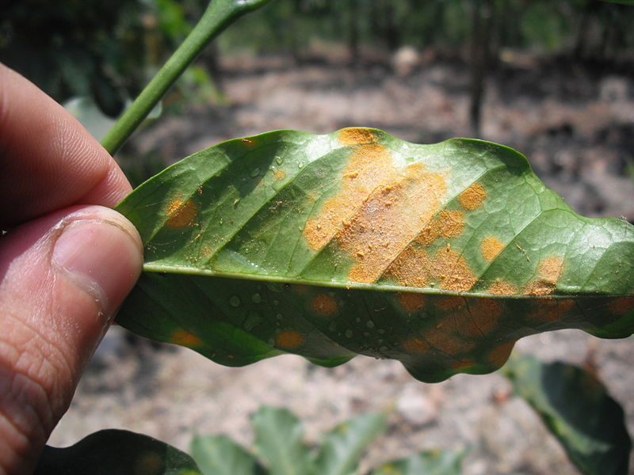
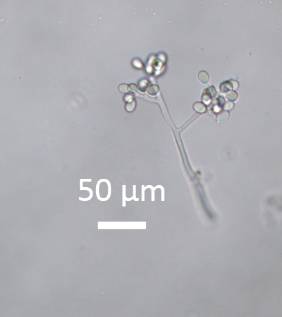

--- 
title: "Comprehensive Crap Guide"
author: "Deependra Dhakal, Samita Paudel"
date: "November, 2019"
site: bookdown::bookdown_site
output: bookdown::gitbook
documentclass: book
classoption: openany # this will force for 2 side layout of book to open chapter at any side
bibliography: [bibliography/vegetable.bib, bibliography/bib.bib]
biblio-style: apalike
link-citations: yes
# github-repo: deependrad/comprehensive_agriculture_guide
description: "This is a guide book for agriculture and general knowledge."
header-includes: 
  - \usepackage{fancyhdr}
---

```{r setup, include=FALSE, message=FALSE}
require(knitr)
knitr::opts_chunk$set(tidy = TRUE, cache = FALSE, 
                      echo = FALSE, 
                      tidy.opts = list(width.cutoff=50), 
                      eval = TRUE, warning = FALSE, message = FALSE,
                      # fig.show = "hold", 
                      fig.align = "center", fig.width = 6,
                      fig.asp = 0.9, out.width = "0.85\\linewidth")
options(knitr.kable.NA = "", digits = 3, knitr.table.format = "latex")
options(kableExtra.latex.load_packages = FALSE)
require(kableExtra)
require(tidyverse)
theme_set(theme_bw())
```

```{r include=FALSE}
# automatically create a bib database for R packages
knitr::write_bib(c(
  .packages(), 'bookdown', 'knitr', 'rmarkdown', "dplyr", "purrr"
), './bibliography/bib.bib')
```


# Introduction

This is a reference manual for self purpose only.


<!--chapter:end:index.Rmd-->


# General agriculture

## Nepal agriculture and geography

**Ecological regions**

- Himalayan region: 35%
- Hilly region: 41.67%
- Terai region: 23.11%

**Agricultural land**

- Cultivated land: 3091000 ha (21%)
- Cultivated land uncultivated: 1030 (6.99%)
- Jungle and shrubs: 5828 (39.597%); Shrub alone: 1560
- Pasture land: 1766000 (11.99%)
- Total Jungle = Shrub + Pasture

**GDP of Agriculture and releated sector/subsectors**

```{r}
dplyr::tribble(~"sector", ~"fy_2074-75", ~"fy_2073-74", ~"fy_2072-73", 
               "Agriculture and forestry", 27.10, 28.25, 31.08,
               "Fishery", 0.49, 0.51, 0.53,
               "Non-agriculture", 72.41, 71.24, 68.39) %>% 
  knitr::kable(booktabs = TRUE, caption = "Percentage contribution of different sector and subsectors to total national GDP", col.names = c("Sector", "FY 2074/75", "FY 2073/74", "FY 2072/73")) %>% 
  kableExtra::kable_styling(latex_options = "striped")
```

**Agricultural growth rates**

```{r}
dplyr::tribble(~"Year", ~"Growth rate (%)", 
               2072/73, 0.01, 
               2073/74, 5.14,
               2074/75, 2.72) %>% 
  knitr::kable(caption = "Agriculture growth rates of recent years in Nepal.", booktabs = TRUE) %>% 
  kableExtra::kable_styling(latex_options = "striped")
```

## Chronology of Agriculture development in Nepal

```{r agriculture-chronology}
readxl::read_xlsx("./data/agriculture_development_chronology.xlsx", skip = 1) %>% 
  select(-1) %>% 
  knitr::kable(caption = "Chronology of Agriculture development in Nepal", booktabs = TRUE) %>% 
  kableExtra::kable_styling(latex_options = c("striped", "HOLD_position"))
```


## Development of cooperatives in Nepal

- Traditionally, custom of _Parma_, _Mankakhal_, _Dharmabhakari_, _Dhikuri_/ _Dhukuti_ were on place very early.
- In 2010, Cooperative development department was established.
- In 2013, government implemented executive guidelines.
- In 2016, Cooperative organization act came into force.
- In 2018, Cooperative organization regulations came into force.
- In 2019, Cooperative training center was established.
- In 2020, Cooperative bank was established.
- In 2024, "Village return campaign" was initiated under cooperative program.
- In 2027, Agriculture development bank started managing cooperative organizations.
- In 2033, "Sajha" program was implemented in 30 districts establishing multipurpose cooperatives in VDCs.
- In 2035, Agriculture development bank handed over the managerial responsibility of cooperatives to management board.
- In 2041, Cooperative ("Sajha") organization act came into force.
- In 2048, National cooperative development board was set up.
- In 2048, Cooperative act came into force (new)
- In 2049, National Cooperative Association was established.
- In 2069, Ministry of cooperative and poverty alleviation was formed.

- Cooperative campaign was first initiated when implementing first five year plan (In 2013), wherein Rapti Dunn Project was launched and 378 cooperative organizations were established in the course.

Importance of cooperatives

- Poverty alleviation
- Social and economic support to low income households
- Combines efforts of small producers and consumers and leads them to a larger scale commercial operation
- Reduces transaction cost, when compared to individual efforts
- Reduces chances of suppression and exploitation by large scale acting merchants
- Effective utilization of available resources and supplies
- Empowerment of local community
- Qualitative development of labor
- Improves bargaining power
- Has a bigger role in operationizing in market demand and supply forces
- Members have ownership in rural development
- Promotion of community welfare
- Community development based on justice and equality
- Produce can have more accessible market
- Quality service could be delivered
- Effective mobilization of consumable goods
- Support in national economy

- 10th five year plan focused on emphasized agriculture based commerce and industries, cooperative farming, cooperative based agriculture input supply, and cooperative based small farmer irrigation project implementation, dairy collection and supply and other cooperative based approach to community development.
- The plan promoted active participation of cooperative groups and private sectors for the efforts.
- National agriculture policy, 2061 has prioritized cooperative based agriculture industries and commerce promotion, farmer group cooperative formation and agriculture wholesale market and haat bazzar established and management via cooperatives.
- To legalize a cooperative organization establishment, it should be registered:
  - Under Organization act in District Administration Office, or
  - According to Cooperative act and regulations under Cooperative Division Office.

## Budget speech, 2076-77 BS

Total budget announced was Rs 1.53 trillion for fiscal year 2019/20 (76/77). Economic growth rate was set at 7% as target. The budget focuses on social justice, increment of export to reduce trade deficit and increase in general productivity.

NRs 130 billion is to be distributed from revenue between provincial and local levels. Education will be freed upto secondary level. In terms of literacy, 70 districts will be designated the status of fully literate districts. To that end, NRs 2 billion will be appropriated for colorful textbooks for primary level. Day meals for 2.2 million school children will be provisioned and sanitary pads will be free for female students attending public schools.

Over 10 billion was allocated for Madan Bhandari science and technology university. It is also stated that science and technology laboratory will be established in each province.

NRs 6 billion will be allocated for free insurance in all districts.

Health grants will be increased for treatment of 8 types of severe illnesses. Likewise, NRs 2.2 billion is appropriated for new-mothers travel expenses. 52000 female community health volunteers will be provided Rs 3000 annual allowance. NRs 5 billion is dedicated to establish health service providing facilities at local levels. Similarly, Rs 400 milion is allocated for Ramraja Prasad Singh Hospital in Rajbiraj. Rs 400 million appropriated for betterment of Bir Hospital.

Addressing issue of public health, smoking and drinking will be banned in public places. 92% of the population will be provided full access to drinking water in coming fiscal year. NRs 7 billion is allocated for completion of Melamchi drinking water project. Over 43 billion NRs is allocated for drinking water and hygiene.

Social security allowance to pregnant women and elderly senior citizens allowance sees an increment of Rs 1000 (increased from Rs 2000 to 3000). There have been betterment of employment schemes for the peoples with disabilities.

Coming fiscal year to marked as youth mobilization year. Youth scientists conference to be held in the coming year.

In agriculture, grants will be provided for purchase of agricultural products and technology. Schemes for achieving self sufficiency in dairy, poultry and fresh vegetables will be prepared and implemented. Grants will be provided for fertilizer input purchase. Organic farming wil be encouraged. With the dubling of fruit cultivation in next 5 years, food quality labs will also be set in every province. Rs 500 million is appropriated for community farming. Rs 34 billion is allocated for agriculture.

A budget of 23.6 billion is allocated for irrigation programmes. 960 million allocated for irrigation programmes in Terai. Sunkoshi Marine to be developed as a national pride project, with 2.05 billion NRs allocated for program initiation. NRs 5.6 billion is allocated for construction of dams.

Next fiscal year will be marked as tree plantation year. Security to be beefed up in forest areas. Newer programs/practices to be launced in livestock management. Rs 1 billion is dedicated for 'Rastrapati Chure Programme'.

Under land management, a revised land management act will be introduced for sustainable utilization of land. Encroached public lands will be brought under government management within next fiscal year. Online issuance of land ownership certificate will have been started by next two years.

Tourism sector will be prioritized, with stress on infrastructure development of main tourist areas. Trail connecting Darchula to taplejung to be developed. Operation of cable cars will be encouraged in mountainous regions.

Government officials will be mandated to only gift homemade (domestic) products as and when needed.

Private and cooperative sector to be encouraged for production of necessary commodities. Local cement and wire frames to be encouraged in construction. To be self sufficient in production of at least 2 dozen products.
  - Hetauda and Udayapur cement factories to be made more efficient 
  - Local products will be promoted in construction inputs
  - Import of luxury goods and health unfriendly products to be discouraged
  - Economic zone to be established in Kavre and Nuwakot. 50% concession to Nepali textile industry on electricity.

Infrastructure development at trade transit points in the north. Business with third countries to begin via Chinese port. Completion of pending works on pipeline by the next year to facilitate import of petroleum products.

In energy, at least two big hydropower projects will be embarked on in all seven provinces. NRs 13 billion is allocated for Budigandaki, 2.02 for Budhiganga-Tamor project to be a national pride project. Province 2, Karnali province and Sudurpaschim province to have full access to electricity. Rs. 4.5 billion allocated for rural electrification. Waste-to-energy programmes will be encouraged.

Rs 163 billion is appropriated for railway and waterways. Digital payment system will be installed in public transport. 1.5 billion for transport management. Electric buses to be introduced in "major" cities. NEA to install charging stations. Additional budget is allocated for development of Narayani and Koshi waterways.

Under urban development, feasibility study will be conducted for development of mega-city and smart city. 530 million allocated to replace thatched roofs of 20000 houses. 4.3 billion for construction of 30000 houses under housing project.

Convention center with a capacity to accomodate 3000 people to be constructed in the valley, this year. City halls to be constructed in local levels. Compulsory footpath, underground cable management. Rs 47.7 billion allocated for housing and urban development. MP's constituency budget (MP fund) increased to Rs 60 million. 1 billion for Dharahara reconstruction (to be completed within the next two years). 141 billion appropriated for reconstruction. Rs 9 billion isolated for infrastructural development in each electoral constituency.

Online visa services will be furnished for foreign nationals. National Defence University to be established. 18-20% (non-gazetted and gazetted) increment in salaries of public service personnel. National knowledge centre to be established at Khumaltar, Tribhuvan International Airport to be upgraded to a boutique airport. Gautam Buddha International airport to come into operation next year. Contractors to be held responsible for the upkeep of their projects for years after completion.

VAT and other taxes to be made more effective through improved taxation system VAT rates to stay intact changes in customs rate. Import reliance will be significantly reduced. 

The budget size is 1.53 trillion, recurrent budget is 957.1 billion, capital expenditure is 408.59 billion and financing 167.5 billion.

## Food security

For a more fundamental discussion of food security topic, refer to [lecture handout](https://github.com/DeependraD/life_science_presentations/raw/master/food_security.pdf), in link to life science presentations.

FAO defined food security in 1996 A.D. In 1996, convention held in Rome approved seven points of food soverignty. Nepal has been a member of FAO since 2007 BS (1950 AD).

McMichael's projection:
  - 2 billion people suffer hidden hunger
  - 1.5 billion people suffer over nutrition related problems

Since 1981 (2038 BS), FAO started celebrating World Food Day on October 16th. In Nepal, 34th World Food Day was celebrated in 2014 with the slogan: "Feeding the world, caring for the earth".

According to FAO's projection, 52% of the population in South Asia are dependent on Agriculture while agriculture contributes 22% to the total GDP in the region.

Pillars of food security:

1. Food availability
2. Food access
  - Nepal's poverty rate in 2001/2002 AD: 30%
  - Nepal's poverty rate in 2010 AD: 26%
  - Nepal's poverty rate at the end of 12th plan: 23.8%
3. Food utilization
  - Per person per day recommendation by WHO: 250 ml milk (91 ltr per year)
  - Nepal's aim for per day milk consumption: 156 ml (57 ltr per year)
  - Nepal's aim for per year meat consumption: 14 kg
  - Nepal's aim for per year egg consumption: 48
  - 30% of total daily protein requirement should be met by animal sources.
4. Food stability
  
- In 2011 AD, Nepal ranked 157th among 187 nations in HDI
- In 2014 AD, Nepal ranked 145th in HDI
- Poverty rate at village/rural areas: 27% (Survey, 2012)
- Poverty rate at cities: 15% (Survey, 2012)
- Monthly poverty:
  - Maximum at Chaitra-Baisakh
  - Minimum at Mangsir-Poush
  
State of food security in Nepal:

- Untill 2042 BS (1985), production was twice that satisfied the population's need.
- Upto 2047 BS, food insufficieny was absent.
- Currently 40 districts are declared food minimum and more than 27 districts of high hill and mountain districts are food insecure.
- Calorie deficiency is prevalent in 41% of population.
- In 19 districts of Midwestern Development Region and Eastern Development Region, food security project is launched.
- 46% of the total cultivated area is under rice.
- Of the total food production, contribution of respective crops are:
  - Rice: 56%
  - Maize: 24%
  - Wheat: 17%
  - Millet: 3.6%
  - Barley: 0.29%

## Nepal agriculture research council

- Has following organizational structure:
  - Executive director
  - Director, Planning and cooperation
  - Director, Crop and horticulture research
  - Director, Livestock and fisheries research
  - Director, Employee administration
  - Director, Economic adminsistration
  - Head, Planning commission
  - Communication, publication and inventory commission
  - Socio-economic and agricultural research policy commission
  - External research directorate
  - Agriculture environment directorate
  
- Programs under Agronomic and horticultural crop research programs
  - Rice crop research program, Baniniya, Dhanusha
  - Maize research program, Rampur, Chitwan
  - Wheat crop research program, Bhairahawa, Rupandehi
  - Legume crop research program, Nepalgunj
  - Oil crop research program, Nawalpur, Sarlahi
  - Hilly crop research program, Kavre, Dolakha
  - Sugarcane research program, Jitpur, Bara
  - Potato research program, Khumaltar
  - Ginger research program, Salyan
  - Orange variety research program, Dhankuta
  - Jute crop research program, Itahari, Sunsari
  - National commercial agriculture research program, Pakhribas, Dhankuta

- Divisions situated in Khumaltar
  - Crop science division
  - Crop disease science division
  - Entomology science division
  - Soil science division
  - Agri-engineering division
  - Agri-botany division
  - Horticulture research division
  - Food research division
  - Biotechnology division
  - Commercial crop division
  - Seed science and technology research division

Regional agriculture research centres and programs

1. Regional agriculture research centre, Nepalgunj
  - ARC, Surkhet
  - ARC, Doti
  - ARC, Jumla, Bijayanagar
  - ARC, Jumla, Rajikot
  - ARC, Dolakha

2. Regional agriculture research centre, Lumle
  - ARC, Baidam, Pokhara $\rightarrow$ Aquaculture
  - ARC, Begnas, Pokhara $\rightarrow$ Aquaculture
  - ARC, Malepatan, Pokhara $\rightarrow$ Horticulture
  - ARC, Bandipur, Tanahun $\rightarrow$ Goat

3. Regional agriculture research centre, Parwanipur
  - ARC, Rasuwa $\rightarrow$ Pasture
  - ARC, Ranighat, Birgung, Parsa $\rightarrow$ Agri-machinery
  - ARC, Trishuli $\rightarrow$ Acquaculture
  - ARC, Belachhapi, Dhanusha $\rightarrow$ Tobaccoo

4. Regional agriculture research centre, Tarahara
  - Pakhribas, Dhankuta
  - Tarahara $\rightarrow$ Aquaculture

## ADS

- MoAD, ADB, Rastriya Kishan Sanjal etc. including 12 development cooperatives (technical team) were involved in preparation of the strategy. 
- Vision (7 sub heads):
  - Self reliance
  - Sustainablity
  - Competition
  - Inclusive
  - Growth
  - Livelihood
  - Food and nutrition security

- There are 16 indicators ??

## National Farmers Commission

- Chariman: Chitra Bahadur Shrestha
- Members: 7 total
- 2073/10/06: National Farmers' Commission organization directives
- Has central office in Hariharbhawan, Lalitpur

## Prime minister agriculture modernization project

Initiation, project details ...

### Zones and superzones


## Crop and livestock insurance

## One village one commodity (ODOP)

## One district one commodity

## History of Agricultural Insitutions in Nepal

Institute of Agriculture and Animal Science (IAAS)

- Began as a school of Agriculture under ministry of Agriculture in 1957 to train JTA's in agriculture.
- School of agriculture was upgraded to college level in 1968.
- It was entitled IAAS in 1972 as a constituent institute of Tribhuwan University and located the specific place at Rampur in the same year.
- The institute has 230 ha of land for its academic and research programs at Rampur.
- Lamjung Campus located at Sundarbazar, Lamjung was established in 1975 and has about 18 hac of land.
- Paklihawa Campus at Rupandehi established in 1978 with area of about 22 hac of land.
- In 1998 the institute started M.Sc.Ag program.
- In 2001 the semester system of study in bachelor level was introduced.
- Ph.D degree course started in 2002.
- IAAS day: 4th of Bhadra
- Logo of IAAS was designed by Thakur Prasad Mainali

Agriculture and Forestry University (AFU)

- The first agriculture university in Nepal.
- Established in June 2010 at Rampur Chitwan.
- University formed merging the then IAAS Rampur and the then IOF Hetauda.
- Rampur academic complex extends to an areas of 280 hac
- Hetauda forestry campus has an area of 95 hac.
- 17th June (3rd Ashad) is celebrated as AFU day.
- Chancellor: Prime Minister of Nepal.
- 1st VC of AFU: Prof.Dr Kailash Nath pyakural
- 1st Registrar: Dr.Surya Kant Ghimire
- Vice-Chancellor: Ishwori Prasad Dhakal
- Registrar: Man Raj Kulakshyapati

## National Commodity Research Programs under NARC and their locations

- National Rice Research Program; Hardinath, Dhanusa
- National Wheat Research Program; Bhairahawa, Rupandehi
- National Maize Research Program; Rampur, Chitwan
- National Grain Legume Research Program; Khajura,Banke (recently transferred from Rampur, Chitwan)
- National Potato Research Program; Khumaltar, Lalitpur
- National Swine and Avian Research Program; Khumaltar, Lalitpur
- National Sheep and Goat Research Program; Jumla
- National Oil Seeds Research Program; Nawalpur, Sarlahi
- National Sugarcane Research Program; Jitpur, Bara
- National Citrus Research Program; Paripatle, Dhankuta
- National Jute Research Program; Itahari, Sunsari
- National Ginger Research Program; Kapurkot, Salyan
- Hill Crop Research Program; Kavre, Dolakha
- National Bovine Research Program; Khumaltar, Lalitpur
- National Tobacco Research Program; Belachapi, Janakpur
- Apple Processing Centre; Jumla
- Cotton Research Centre; Khajura, Banke

## Miscellaneous

- Nepal ranks 18th position among rice cultivating nation in the world.
- Father of Agronomy in Nepal: Netra Bahadur Basnyat
- Golden rice is genetically modified rice with yellow colored seeds rich in vitamin A
- Date palm is the oldest fruit.
- Rye is known as grain of poverty.
- Tomato is known as poor man's orange.
- DDT was the first discovered insecticide by Paul Muller.
- Maximum amount of sugar in honey is 73%.
- Mandarin is alled fancy fruits.
- Cardamom production highest in Nepal in the world.
- Dance of bee is called waggle dance.
- Apple production is highest in China.
- King of cereals is Wheat and Queen of cereals is Maize.
- Orchidaceae is the largest family among flowering plants.
- National Agriculture Policy in 2061 BS
- Gaurab hybrid and Rampur hybrid are the only hybrid varieties in Nepal in maize.
- Halo kranti started in 2006 BS from Duradanda, Lamung.
- OVOP (One Village One Product) practice in Nepal base on PPP (Public Private Partnership) approach started from Japan.
- One Village Two Product practice is prevailing in Bhutan.
- Year of Family farming: 2014
- Yellow color of Papaya is due to Cryptoxanthin.
- Edible part of apple is enlarged thalamus and edible part of cabbage is bud while that of cauliflower is inflorescence.
- Earthworm is farmer's friend.
- 39.6% of area of Nepal's land is covered by forest.
- Japan is Nepal's largest bilateral donor.
- Lentil is a major pulse crop with efficient export.
- Crop and livestock insurance started in Nepal in 2069 Magh 1
- Triticale is artificial cereal crop.
- China is the world's highest rice producer and Vietnam is the world's highest rice exporter.
- Azolla is widely used bio - fertilizer in Rice Crop.
- Amendment of acid soil is done by lime and of alkaline soil is done by CaSO4
- Tomato is known as poor man's orange.
- Air layering in litchi is to epicotyl grafting in Mango
- Anadi, Jumli Marshi, Pokhreli Jetho Budo are indigenous variety of Rice in Nepal.
- Readily available form of water to plants is capillary water.
- Limiting amino acid in Cereals are Lysine and threonine whereas limiting amino acid in legumes are methionine and tryptophan.
- Stubble is the portion of stem that is left on the field during harvest.
- Leguminous crop is considered as biological plough.

Contributors in Agriculture

- Sociology: Auguste Comte
- Statistics: R.A. Fisher
- Economics: Adam Smith
- Soil Science: V.V. Dokuchaev
- Tillage: Jethro Tull
- Green Revolution: Norman E Borlaug
- Modern Agronomy: Peter De Crescent
- Organic Farming: Rudolf Steiner

- Dr. Norman E. Borlaug is the pioneer of Green Revolution and was awarded Nobel Peace Prize in 1970.
- Rice, wheat and maize are cereal crops while buckwheat and amaranthus are pseudocereals.
- Wheat and maize show hypogeal germination but soyabean and chickpea show epigeal germination.

- Tree of Paradise/wisdom: Banana
- King of Fruits/ Bathroom Fruit: Mango
- Bitter taste of Bitter Gourd due to: Cucurbitacin/ Bitter Glucoside
- Rice is semi - aquatic in nature.
- Critical stage for irrigation in wheat is CRI
- Cotton fiber is also known as White Gold.
- Apple of tropics/Poor man's apple: Guava
- Poor man's meat: Soyabean
- Poor man's friend/ King of Vegetable: Potato
- World's highest cereal production: Wheat
- Nepal's highest cereal production: Rice
- Queen of spice crops: Cardamom
- King of spice: Black pepper
- Queen of Flower: Gladiolus
- King of flower: Dahlia
- Butter fruit: Avocado
- Queen of Beverage: Tea
- King of Temperate fruit: Apple
- Drosophila of crop plants: Maize
- Vegetable meat: Cowpea

**NPK Content of fertilizer**

- Urea: 46%  Nitrogen
- DAP(Diammonium Phosphate): 18% N, 46% Phosphorus
- MoP(Muriate of Potash): 60% potash
- SSP(Single Superphosphate): 16% P
- DSP(Double Sugar Phosphate): 32% P
- TSP(Triple Sugar Phosphate): 48% P
- ZnSO4: 22-35% Zinc

**Kishan call center**

- Phone number: 1660-5652-999
- Active hours: 10 AM - 4:30 PM

- Goat is called poor man's cow.
- Male adult of horse is stallion and female adult of horse is mare.
- Heifer is young female cattle.
- Young male poultry is cockrel and young female poultry is pullet.
- Black gold: Buffalo
- Yellow gold: colostrums milk
- King of fodder: Elephant grass/Napier
- Queen of fodder: Leucerne
- Freshly drawn milk has the PH value in range of 6.5-6.7
- Evening milk is higher in fat than morning milk
- Amount of milk left in udder after normal milking is called residual milk.
- Water content of milk is 87-88%
- Gizzard in poultry is used grinding of food whereas proventiculus in poultry is the true stomach.
- Abomasum is true stomach in ruminants.
- Omasum is absent in camel and rumen is water storing sac.
- Sweetness in milk is due to Lactose.
- Milk holiday is the day when the dairy does not buy milk from the farmers.
- Milk storage is done at $5^\circ C$.
- 1 lit of milk can be synthesized by 500 lit. of blood circulation in body.
- Milk is complete nutrient. It lacks only Fe.
- Meat of calf is k/a veal.
- Ear notching is the best identification method in pig.
- Gall bladder is absent in horse.
- Elephant has longest gestation period i.e. 18-23 months(624days)
- Kavrepalanchowk is the highest milk producing district in Nepal.
- Semen is stored in liquid Nitrogen in $-196^\circ C$; the process of storage is k/a Cryopreservation.

Common animal diseases

- Bacterial diseases: Anthrax, Brucellosis (Bang's disease), Black Quarter(Black leg), Haemorrhagic Septicaemia, Mastitis
- Fungal diseases: Aspergillosis, Candidiasis, Ringworm
- Protozoal diseases: Coccidiosis, Babasiosis
- Viral diseases: Foot and Mouth disease, Swine fever(hog cholera), New castle disease, Marek's


Common Poultry Diseases

- New Castle Disease/Ranikhet
- Mareck's Disease (MD)
- Gumboro
- Coccidiosis
- Chronic Respiratory Disease (CRD)
- Avian Influenza/Bird Flu- H5N1, H9N2

<!--chapter:end:01-body_general_agriculture.Rmd-->


# Horticulture

## Plant growth hormones

### Abscissic acid

Physiological effects of ABA

1. Induction of dormancy of plant organs
2. Water balance of plants

- Additionally, ABA plays roles as antagonist of other phytohormones.
- Stratification causes reduction in ABA content and so promotes germination (eg. walnut)
- Inhibition of seed germination by ABA may be reversed by GA application.
- ABA induces formation of storage proteins in seed.
- Bud dormancy is frequently correlated with increase in ABA concentration.
- During vernalization, however, ABA content falls.
- ABA regulates water balance (causes stomatal closure and increase in root growth and hydraulic conductivity rise in water deficit).

## Growth stages of cabbage (9 distinguishible)

1. Cotyledons: No true leaves present
2. Seedling: Upto 5 true leaves
3. 6-8 true leaf
4. 9-12 true leaf: Base of stem still visible from above
5. Precupping: Approximately 13-19 leaves. By the end of this stage, the base of stem and the bases of all leaves are concealed when plant is viewed from above. The innermost heart leaves are growing in an upright fashion and are visible without moving any of the surrounding leaves.
6. Cupping: Approximately 20-26 leaves. The innermost heart leaves, which are still growing in an upright fashion, are concealed by the larger, older leaves surrounding them. All visible leaves will later become the frame leaves (leaves not touching the mature head) of the mature plant.
7. Early head formation: Approximately 2.5-4 inch diameter head. The inner heart leaves, now quickly developing as a ball-like structure of overlapping leaves, are concealed by the surrounding larger leaves. These leaves do not press tightly against the developing head and will later unfold to become frame leaves.
8. Head fill: Approximately 3-8 inch diameter head. A firm round head is visible within the wrapper leaves (the 4 outer loose leaves that touch the mature head). The head has not yet fully developed and thus, is not of harvestable size.
9. Mature: Approximately 6-12 inch diameter head. No new visible leaf production will occur after the head has attained maximum hardness and size. The head is ready for harvest and may split if not harvested in time.

## Citrus cultivation

### Principal rootstocks

Today, five types of rootstock predominate in relatively not cool climates where cold or freezing weather is not probable, especially Florida and southern Europe.

Sour orange rootstock: it is the only rootstock that truly is an orange (the Citrus ? aurantium or bitter orange). It is vigorous and highly drought-resistant.

Poncirus trifoliata: it is a close relative of the Citrus genus, sometimes classified as Citrus trifoliata. It is especially resistant to cold, the tristeza virus, and the fungus Phytophthora parasitica (root rot) and grows well in loam soil. Among its disadvantages are its slow growth-it is the slowest growing rootstock-and its poor resistance to heat and drought. It is primarily used in China, Japan, and areas of California with heavy soils.

Swingle citrumelo: it is tolerant of tristeza virus and Phytophthora parasitica and moderately resistant to salt and freezing. This rootstock selection was hybridized from the Duncan grapefruit (Citrus paradisi Macfadyen) and the Poncirus trifoliata (L.) Raf. by Walter Tennyson Swingle in Eustis, Florida, in 1907. It was released by the US Department of Agriculture to nurserymen in 1974.

Troyer citrange and Carrizo citrange: these reasonably vigorous rootstocks are resistant to Phytophthora parasitica, nematodes, and tristeza virus and show good cold tolerance. They also are highly polyembryonic, so growers can obtain multiple plants from a single seed. Citrange, however, does not do well in clay, calcareous or high-pH soils, and is sensitive to salinity. It is not feasible as rootstock for mandarin scions, as it overgrows them by producing branches of its own in competition with the grafted budwood.[3] Citranges are hybrids of the Washington navel orange and the Poncirus trifoliata. The original crosses, made in the early 1900s by the U.S. Department of Agriculture with the intention of producing cold tolerant scion varieties, were later identified as suitable for use as rootstocks. The commercial use of these rootstocks began in Australia in the 1960s. The Troyer variety generally is found in California, while the Carrizo variety is used in Florida.

Cleopatra mandarin: it is tolerant of salinity and soil alkalinity and also suitable for shallow soils. It is used primarily in Spain, Australia, and Florida. Dade County, for example, has 85% calcareous soil, a typical trait of land that has been under water.[4] The Cleopatra mandarin, originated in India and introduced into Florida from Jamaica in the mid-nineteenth century, has been distributed and tested as a rootstock throughout the world. Nowadays, however, it is considered an inferior rootstock because it is sensitive to many diseases, grows slowly, and is difficult to propagate.

## Guava cultivation

- _Psidium guajava_ (Myrtaceae)
- Origin: Tropical america; originated in the warm, lowland tropics
- Contains low energy, low fat and high amounts of vitamin C.
- Commercial trade is smaller in volume compared to other fruits.

### Morphology and Botany

- Photoperiod insensitive
- Can be forced to flower by pruning
- Woody is hardy; resistant to strong winds.
- The rhythmic flushing of vegetative growth and flowering influences when and how pruning is
carried out.
- Guavas are forced to produce year round, and normally the actively growing shoots are tipped once they become too large. This tipping forces regrowth and new flowers to be induced, to keep production high and constant.
- As soon as the harvest is finished, a peripheral pruning of the canopy is performed, in order to force new shoots that will bear flowers.

### Climate and soil

- Temperature lower than $8\ ^\circ C$ is inappropriate for commercial cultivation.
- Moderately tolerant to saline conditions.

### Varieties

- Lucknow-49, Allahabad safeda, Seedless

### Propagation 
- Stem and root cuttings, Air layering and Budding
- Guava trees propagated by grafting have tap roots that provide substantial anchorage. 
- Trees propagated by cuttings have weaker root
systems.

### Planting and orchard establishment

- Spacing with fillers: 3.1 x 7.6 (424 trees/ha)
- Permanent spacing: 6.2 x 7.6 (212 trees/ha), or 4.6 x 7.6 (286 trees/ha)

```{r climac-vs-nonclim}
cl_ncl <- data.frame(climacteric = c("Avocado", "Banana", "Guava", "Mango", "Papaya", "Sapota"), 
                     non_climacteric = c("Litchi", "Mangosteen", "Pineapple", "Mountain apple (Bayer)", NA, NA))
knitr::kable(cl_ncl, booktabs = TRUE, caption = "Climacteric and non climacteric fruits commonly cultivated in Nepal") %>% 
  kableExtra::kable_styling(latex_options = "striped", position = "center")
```

### Post-harvest

- High moisture loss occurs
- No dramatic change in taste during storage at higher temperatures (10-15 $\ ^o C$)

Horticulture development and plans and policies

Q. Government plans and policies have given priority on horticulture. However, the potentiality of fruit sector (an important component of horticulture) has not been exploited properly. In this context, discuss the current problems relating to fruit crop development in Nepal.

A. $\longrightarrow$ Although the long term Agriculture Perspective Plan fared well with the set target in horticulture sector (along with roads and community forest) during the implementation period of 1995-2015, overall history of horticulture sector is less than satisfying in Nepal.

The total area, productive area, production and productivity of fruits in the Fiscal Year (FY) 2014/15 are 150387 ha, 110802 ha, 992703 mt and 8.96 mt/ha respectively (Table \ref{tab:horticulture-fruits-veg}). Recent data shows that contribution of horticulture sector amounts to 15% of the Agriculture GDP. Fruit sub-sector contributes 5.24 ??(when) percent in Agricultural GDP. Besides government engaging in active production of fruit seedlings and provisioning gardening tools, many private firms are working on production of quality planting materials. 

Out of total area occupied by fruits 57% are tropical, 26% are citrus and only 17% are temperate fruit species. Similarly, total area covered by fruits is 4.79% of total cultivated area. It was found that the productivity trend is increasing from 2005/06 (9.47mt/ha) to 2011/12 AD (10.17 mt/ha) and decreasing in 2012/13 (9.25 mt/ha) and in 2013/14 (8.77mt/ha). There is huge gap between exported (24812.17 mt) and imported (2,27,00,266 mt) scenario of different fruits which indicates the immense scope of fruit development in Nepal. Out of 470 fruit nurseries 272 were registered and 198 were non registered.

Currently, more than 90% of the citrus seedlings are annually distributed by private fruit nurseries. Technical support services to the fruit growers are also being provided by government farms in their command areas and to the pocket areas of the targeted districts through the extension service.

```{r horticulture-fruits-veg}
readr::read_csv("./data/vegetable_fruits_production_area_nepal.csv", skip = 1) %>% 
  select(`Description`, `Component`, `2013-14`, `2014-15`, `2015-16`) %>% 
  filter(Description %in% c("Fruit", "Vegetable")) %>% 
  knitr::kable(booktabs = TRUE, caption = "Status of fruits and vegetable production and area during recent 3 years.")
```

About 3-4 percent of cultivated land is under fruit acreage. This could be observed from the table below showing the annual cultivation trend since 2005-06 AD. There is an increasing trend in area coverage and fruit production but the yield per hectare is low in comparison with other fruit producing countries. The fruit production needs to be increased to meet the increasing demand for domestic consumption and for exports as well. There are some important issues like infrastructure, physical and environmental, agronomic and technical support post harvest losses, problem oriented research and transfer of technology, which need to be addressed to promote fruit development in the country.

There are 45 species belonging to 37 genera of wild edible fruits. Even seasonal fruits harvested from forests can be seen in several local markets. Despite of increasing area and production and huge potential of fruit cultivation in the country, the quantity and value of foreign import of fruits is increasing in recent years due to higher rate of the increasing internal demand in comparison to rate of increasing domestic production and supply. The per capita availability of fruit in the fiscal year 2014/15 was 34 kg/year.

Major problems relating to development of fruit crops in particular, and horticulture sector in general, are as follows:

1. Despite immense potential of hoticultural crops, upto 80% of the cultivated land in Nepal is used to grow cereal crops. Out of remaining 20% cultivated land, most of which are located in more northern latitudes, suitability of fruit farming in those lands is fringe. Most are rocky terrains with steep slopes and young soil. In addition, hilly regions of Nepal suffer a major setback on soil moisture management, which is critical for a fruit orchard. Without a proper buffer against hailstorm and snowfall, substantial amounts of fruit drops and wastage have been noted.

2. Since a long time past, unavailability of inputs like inorganic fertilizers, progagation materials have hindered progressive farming. Rural farmers are forced to opt for low input management which only give marginal yields and limits the productivity improvement. Furthermore, as fruit crops are given an inferior status relative to cereals, farmhold themselves are negligent about timely provisioning of agricultural inputs for fruit orchard.

3. Irrigation management

4. Postharvest handling

5. Marketing and transport

6. APP was based on a narrow viewpoint of technology -- excessively focused on green revolution perspective that is not appropriate for large parts of Nepalese agroecology. Horticulture sector in particular is largely hurt by this conservative view point of technology adoption. This sector has poorly prospered in terms of access to infrastructure and is one of the least industrially benefitting ones. As hills and rural parts of country are infact the major hubs of vegetable and fruit production, policy emphasis on adoption of more capital intensive technology i.e., that which characterizes green revolution, is just a dream chase afterall. On the other hand, Nepal has areas where specialized farming systems, such as organic citrus and apple production system, could flourish. These regions would have sought mostly technical support for quality assurance, policy support for certification, and basic resource support. All of this were lacking in places such as Mustang, Dolpa and Jumla, where organic apple production could have comparative advantage.

7. With the diverse agroecology, we have southern terai regions suited for cultivation of tropical fruits while mid-hills and high-hills towards north being suitable for sub-tropical to warm and cold temperate fruit and nut species. Research and development programs are not found to have exerted impact on all agroecologies, mostly that of Far Western Development Region of Nepal.

8. There still are several fruit and nut crops that have a greater local demand but are not being integrated into mainstream research and crop development process. Fruit nuts such as chestnut ( _Castanea_ spp.), Sapota, Rubus berry are underutilized while some are at best only identified. Thus, in meeting increasing need of human nutrition and feeding urban population, these minor fruits could play an important role.

Policy level and action oriented strategies that have been or could potentially be taken by Government to uplift horticulture sector include improvement in mainly following aspects:

1. The Decentralization strategy of ADS foresees a decentralized structure of Nepalese Agricultural Research, with establishment of new national research institutes (eg, a National Horticultural Research Institute, National Animal Health Research Institute, and National Aquaculture and Fisheries Research Institute), establishment of a National Agricultural Research Fund (NARF) under NARC, and the establishment of research stations in all regions, including the far western region.

2. Nutritional aspect of food security has a prominent role of hoticultural crops. Because fruits and vegetables supply the bulk of fiber, minerals and vitamins, meeting nutritional need of growing urban cummunity is possible only through empowering of horticulture sector.

3. ADS highlights following key strategies in improvement of fruit sub-sector of horticulture:
  - Formulation and implementation of appropriate land use policy which will significantly help area expansion of horticulture and plantation crops.
  - Rejuvenation of old, unproductive, senile plantations through substitution of old varieties with improved high yielding varieties.
  - Development of demand-driven technology on improved varieties, cultural operations, pest management, harvesting, post-harvest handling, marketing and processing; promotion of value chain approach in extension and development.
  - Public private partnership in developing irrigation schemes including the micro-irrigation, collection centers, wholesale markets, cold storage, processing industries, and encouragement and promotion of packaging and grading centers
  - Planning and prioritization of HHVCs' development in the form of projects on the basis of domestic and external demands, economic viability, comparative advantage, employment and income generation, environmental sustainability and use of local resources.
  - Enforcement of laws and regulations to ensure adherence to safety, hygiene and other standards as per SPS through relevant public institutions and local authorities.
  - Strengthening of present organizations responsible for horticultural and HVC development in the country to be made more accountable to carry out the work responsibilities with new vision, or preferably a separate competent horticulture authority established to coordinate inter and intra ministerial, institutional and departmental agencies and programs.
  - Deployment of technically skilled and capable manpower in adequate numbers on the basis of research, extension and training in relation to area of operation and volume of production; and
  - Formulation of long-term commodities development plans with program wise investment plans and encouraging significant participation and investment of private sectors in promotion, processing and marketing of HHVCs.
  - Increased productivity of fruit proposed for ADS implementation period is from 10 to 15 Mt/ha

## Litchi

**Taxonomy** 

Family: Nepheleae. Family contains about 150 genera and 2000 species. Related species of the family are Rambuton ( _Nephelium lappaceum_) and pulsan ( _N mutabile_). The genus Litchi has 3 species:

  - Sub species chinensis -- Commercial litchi.
  - Sub species philippinensis -- Developed in Philippines. It has long, oval shaped fruit with inedible flesh and long thorn like protuberances which can be used as root stock.
  - Sub species Javenensis bears fruit similar to Chinensis but the aril is thinner.
  
**Varieties**

Mazzafarpur (Bears profusely, fruits are deep orange to pink, pulp is sweet, tough, moderately juicy, good flavored and pulp:seed ratio is high), Deshi (Bearing is moderate and regular, fruit is oval, oblong or oblong conical in shape), Rose scented (Fruits are delicious rosy flavor in the aril. Trees are vigorous. Fruits are mostly oblong or oblong conical in shape, deep rose pink in color, pulp grayish white, and soft and very sweet), Shahi, Dehradun, Culcuttia, Seedless late, Saharanpur, etc.

Origin: Originated from northern China, Northern Vietnam and Malaysia

Uses: Fruit makes excellent canning. The preservation of fruit can be done in honey.

Botany: Long lived, medium to large, brached, round topped, evergreen tree reaching upto 10 m or more height with short stocky trunk. Leaves are compound, alternate, consists of 4-7 oblong leaflets, glossy dark green. Bark is grayish brown and rough. Vegetative growth is rhythmic and occurs in 3-4 recurrent flushes alternating with period of rest. The inflorescence is compound raceme developing both from terminal and axillary buds. Flowers are small, male, pseudo hermaphrodite (functional male) and hermaphrodite. The edible portion is aril. The seed is dark brown in color.

Climate: The litchi is adapted to the warm sub-tropic, cool, dry, frost free winter, and long, hot summer with high rainfall and high humidity. The litchi usually likes low elevation but can be grown upto 800 masl. The optimum temperature requirement for flowering is 16-20 degree C. High temperatures, more than 30 degree C and low relative humidity (less than 60%) during fruit development stage cause the fruit cracking in litchi. The hot winds in summer cause fruit cracking and subsequently damage the pulp (aril). Sometimes it limits the expansion of litchi cultivation. Wet spring, dry summer and light winter are desirable conditions for fruiting in litchi.

The litchi can grow under wide variety of soild including alluvial soil, loams, and heavy clays with rich source of organic matter. Litchi can withstand water for a considerable period, provided the water does not stagnate, but will die after prolonged immersion. It is suggested that new plant should be grown in soil taken from the vicinity of old trees to introduce the mycorrhiza. The optimum pH range is 5.5-6.5


## National fruit development directorate (Institutional development of fruits)

The agro-ecological conditions of Nepal are very much suitable for the successful cultivation of large number of fruit species. Growing of fruits in homestead gardens is a traditional practice in Nepal since time immemorial. The systematic fruit development program in Nepal was initiated in a planned manner since 1960.

Agriculture Perspective Plan (APP) stressed development activities for commercial production of two major high value fruit crops such as Apple in high hills & Citrus (especially Mandarin) in mid-hills. The emphasis was given on pocket-package development strategy, which must be carried out as a campaign on a participatory basis from the grass-root level to higher ups. The other fruits of the commercial importance such as Mango, Litchi and Banana etc. are also addressed near/along the highway corridors of Terai and inner Terai belts so as to meet the fruit requirements in the country. However, horticulture sector has not gained the level of expected industrialization/commercialization due to various constrains.

Fruit Development Directorate (FDD) was first established as Horticulture Section in 1955, which evolved as Fruit Development Section in 1966, Fruit Development Division in 1990 and the directorate in 2000. FDD is the central body responsible for the development of fruits, coffee, tea and ornamental crops in the country. National Centre for Fruit Development was established in 2018 after restructure under federal system for Fruit Development Directoriate, National Citrus Development Programme and Coffee and Tea Development Section.

## Environmental stress factors in horticulture

Q. What are the important climatic factors that are considered as extreme environmental stress? Suggest their possible control measures.

A. $\longrightarrow$ Climate is a combination of aboveground environmental factors -- temperature, moisture, sunlight and air -- and is characteristic of a region. It determines what crops can be cultivated in a given area. However, alike climate belowground environmental factors -- soil temperature, soil moisture, soil physical characteristics, soil chemical properties, organic matter, etc., also play a role in determining success of a crop in a given agricultural region.

Environmental stresses play crucial role in the productivity, survival and reproductive biology of fruit plants as well as crops. Biotic and abiotic stresses, including drought, extreme temperature, scarcity of water, reducing quality of irrigation water and salinity in soil and water are problems which are becoming really acute. Due to their rapid and unpredictable effects, it is becoming very difficult for horticultural scientists and farmers to respond to challenges posed by biotic and biotic stresses.

Some of the climatic parameters and the stress associated with them, influencing crop development and yield are:

- Water and moisture stress: Required in several stages of crop's life cycle -- germination. Much of the water requirement is met from the precipitation (including the rain and the snow) and evaporation. Lack of moisture in the aboveground environment makes the air less humid, thereby increasing its drying power. The rates of plant processes such as transpiration, diffusion, and evaporation are affected directly by the vapor pressure of the air (the part of the total air pressure attributable to the water molecules present in the air). As previously indicated, if air temperature is increased but the amount of water vapor in the air stays the same, the relative humidity of the air decreases. Excessive moisture in the microclimate of plants predisposes them to disease.

- Temperature and temperature stress: Temperature is the intensity of heat energy and very vital in regulating the plant's biological, chemical and physiological processes, mostly by regulating rate of chemical reactions. Several crops show temperature dependent growth periodicity, i.e. some crops tend to flower in higher temperature of summer season while fruits like apple and ornamental bulbs such as daffodil ( _Narcissus_) and hyacinth ( _Hyacinthus_)require a period of chiling temperature to break the dormancy and initiate flowering. Similarly hardiness of a crop is defined for various temperature scales within a range of $0-50 ^\circ C$. Extremely high temperature kills plants ouright or reduces production severely, when such prevalence coinicides with flowering and fruiting periods. actively growing, succulent tissue in plant parts such as flower buds are more susceptible than dormant tissue to cold damage. Frost damage is critical when flower buds start to open. Warm-season crops are more prone to frost damage.

- Light and light associated stress: The role of light in the growth and development of horticultural plants depends on its quality, quantity, and daily duration. olar radiation is electromagnetic in nature. Radiant energy is described by its wavelength and frequency. The shorter the wavelength and higher the frequency, the higher the energy transmitted. Sunrise and sunset patterns differ from one season to another. Incident light angles are wider in summer than in winter and hence the light intensity is higher in summer months. Even the daily light-dark duration varies over an annual cycle. In winter months dark hours are longer and light hours are shorter, and vice versa for summer months. This gives rise to a physiological behavior in some plants called photoperiodism, which is characterized by the flowering time variation of crop plants based on the light-dark period. One one extreme end, plants exposed continually to very low light intesities exibhit tall statures, yellowing of leaves and lean stem, a condition called etiolation. Likewise light quality affects color development and tillering and branching behavior in grass crops.

Four photoperiodic responses in plants are a basis for classifying horticultural plants:

  - Short-day plants (or long-night plants). Short-day plants will not flower under continuous light. They require a photoperiod of less than a certain critical value within a 24-hour daily cycle. For example, strawberry (Fragaria x ananasia) requires 10 hours of light or less and violet (Viola papilionacea) requires 11 hours. Poinsettia (Euphorbia pulcherrima) requires 12.5 hours of daylight and cocklebur (Xanthium strumarium) requires about 16 hours or less of light. When planted in the field, short-day plants flower in early spring or fall.
  
  - Long-day plants (or short-night plants). Long-day plants are plants that flower only when light periods are longer than a certain critical length. These plants flower mainly in summer and include annuals such as henbane (Hyoscyamus niger), which requires more than 10 hours of light, and spinach (Spinacia oleracea), which requires 13 hours of light. Baby’s breath (Gypsophila paniculata) requires 16 hours or more of daylight in order to flower.
  
  - Day-neutral plants. Day-neutral plants are not responsive to photoperiod and flower according to the developmental stage. Plants in this category include tomato, corn, and cucumber.
  
  - Intermediate-day plants. Certain grasses such as Indian grass do not flower if the days are too short or too long. These plants are said to have two critical photoperiods and are categorized as intermediate-day plants.

Some strategies can be duely adopted to minimize the effects of climate associated stress. There are many approaches like:

- Growers should make use of weather forecast,
- Stubble/plastic mulching to check competative weed growth and conserve moisture.
- Drip and sprinkler irrigation to continually maintain required moisture
- Mist irrigation to maintain appropriate level of atmospheric humidity
- Physiological drought resistance of plants through the use of growth retardants, and anti-transpirants
- Construction of specialized structure such as hot beds, hot caps, polyethylene tunnels, shelterbelts, wind machines, etc. based on necessity.
- Proper orchard geometry and nutrient management, and
- Use of rootstocks tolerant to physiological stresses.

Beside climatic factors themselves, geographical processes such as relief, orientation and exposure of the fruit orchard, presence or absence of water bodies and vegetation in the vicinity, etc. vastly influence growth of fruit crops. As an example, Colder and heavier air occurring at higher altitudes moves down and pushes the warmer and lighter air upward. This air convection leaves the higher band of land warmer. This thermal belt is warm and permits the culture of frost-sensitive crops on certain parts of slopes in areas that are normally too cold for growing crops.

## Tissue culture and significance in Nepal

Q. What do you understand by tissue culture? Describe it's role in fulfiling the need of seed requirement to Nepalese farmers.

A. $\longrightarrow$ The branch of biology in which tissues or cells of higher animals and plants are grown artificially in a controlled environment.

As a method of propagation of horticultural crops, from amongst a range of options available to propagate a plant, tissue culture is one of the major biotechnology activity of public as well as private sectors. Protocols have been developed for in vitro propagation of different species (both animals and plants) elsewhere in the world to be used readily or with some modifications.

The first extracted tissue (also called _explant_) changes into a mass of undifferentiated cells called callus, from which differentiation into shoot and root or embryos may later occur. This method of propagation is commercially adopted in herbaceous (e.g., strawberry, banana, gladiolus, tobacco, carnation, and gloxinia) and woody plants (e.g., apple, rose, and rhododendron).

In several asexually reproducing crops, maintenance of their quality and adequate quanity over period has been a challenge. This amounts to a large number of seed material (propagule) import from neighboring countries for instant use of Nepalese farmers. However, this situation of excessive reliance on import of basic input can be remedied if tissue culture of relevant crops were practiced in Nepal itself.

- Mainly focusing on propagule generation of high value and bulky propagule seems to be a profitable venture as fruit and flower crops like those mentioned above can be successfully regenerated in a simply established tissue culture laboratory. 
- A tissue culture laboratory can host seedling at a very small storage space
- Large number of planting materials can be obtained by establishing cultures and subcultures of different varities/cultivars of crops at the same time, on demand. Typically within a couple of weeks thousands of usable seedlings can be recovered from a single explant.
- Tissue culture laboratory can be operated at a relatively cheap cost if basic infrastructure like culture medium, sterilants, working and housing facility could be assured.
- Tissue culture technology using meristem culture can be used to raise virus and pathogen free seedlings, which is not guarenteed by conventional plant part based propagation.
- Development of hybrid cultivars i.e., that of _Brassica napus_ and _B calabrese_, exploits an use case of tissue culture called embryo rescue to obtain viable hybrids.

## River basin/bed farming and guidelines

Q. If a farmer from a river basin area (600 m) comes to you and request for summer season cucumber cultivation technology what would be your advice to him ?

A. $\longrightarrow$ Riverbed farming can be used to increase household income and to improve the food security of landless and land-poor households in the Terai area of Nepal. It is estimated that about 8,000 hectares of riverbed land would be suitable for agricultural cultivation in the Kailali and Kanchanpur Districts in the Western Terai areas of Nepal. After the river water recedes in the post-monsoon season, vegetables are planted in ditches dug into the seasonal sand banks; the crops are harvested before the onset of the next monsoon. 

General guidelines for performing riverbed farming:

- On average, the water table should not be lower than 1 m; when the water table is lower than this, too much labor is required.
- Ditches are up to 1 m deep and 1 m wide. The length depends on how much land is available.
- A row-to-row spacing of 2-3 m (between the ditches) and plant-to-plant spacing of 0.5-1 m is required depending on the crop.
- The ditches are dug in an east-west orientation to maximize the amount of sunshine they receive and to minimize the collection of sand carried by the prevailing winds.
- Farmers may build shelter close to their plots so that they can be close at hand to fend off thieves and wild animals.
- Apply fertilizer: farmyard manure/compost about 12 tonnes; urea about 100 kg; di-ammonium phosphate (DAP) about 120 kg; and potash about 30 kg per ha.
- Plant seeds/seedlings using the appropriate row-to-row (RXR) and plant-to-plant (PXP) distance for at least one crop. Following planting distances are applicable for the crops mentioned herein:

  - 3 m x 1 : Bottle gourd, pumpkin, and water melon and 
  - 2 m x 0.5: Bitter gourd and cucumber
- Following establishment and maintenance inputs are required (per hectare):

  - Labor to prepare plots, irrigation, and to collect mulching materials (165 person days)
  - Equipment: Sprayers, watering can, spades
  - Materials: Polythene bags, sheets, mulching materials
  - Agricultural seeds, chemical fertilizer, farmyard manure, compost, bio-pesticides, micronutrients.

## Potato tuber storage systems

Q. Describe various types of storage systems used in Nepal to store potato tubers.

A. $\longrightarrow$ By Samita!

## True potato seed, scope and technology adoption improvement

Q. Define True Potato Seed (TPS). Do you see its scope in supplementing the requirement of potato seeds in Nepal ? Is so, how can it be improved ?

A. $\longrightarrow$ Potatoes are most often propagated from vegetative tissues, either whole tubers or cut pieces of tubers. Tubers used for propagation are typically called seed tubers, seed potatoes, or seed pieces. Potato plant can be produced from botanical or sexual seeds, but these "true" potato seeds (TPS) are seldom used, because they are genotypically variable and give rise to plants with traits thay may be completely different from those of the parent plants.

A single plant may produce 50-100 berries and single berry contains about 150-200 seeds. TPS is mainly used to develop new potato cultivars and now gaining popularity to raise the commercial crops. About 100-150 g of seed is required to raise the crop in 1 hectare of land. 

_Scope_: 
  - Non-availability of good quality seed tuber, 
  - High seed cost, 
  - Virus infilteration in seed tubers causing degeneration of seed stocks 
  - Problem of long distance transport of tuber seeds from seed producing areas 
  
All these constraints have led to the development of TPS technology of crop production. Further benefits TPS technology are:

- Unlike seed tuber, stocking density of TPS seed much more, hence from the same parcel of land, more of TPS can be recovered than seed tuber.
- An additional benefit with the use of TPS is process to obtaining application ready seed is substantially shortened as several post-harvest processess such as curing and tuber treatment can be avoided.

```{r}
readr::read_csv("./data/potato_seed_crop_production_specification.csv", skip = 1) %>% 
  pivot_longer(cols = starts_with(c("Recommended")), 
               names_to = "Region", 
               values_to = "Time of year") %>% 
  mutate(`Region` = str_replace_all(`Region`, "Recommended time_", "")) %>%
  dplyr::select(-1) %>%
  dplyr::select(`Crop`:`Production tons per ropani`, `Region`, `Time of year`, `Remarks`) %>%
  rename_all(function(x)str_replace_all(x, "_", " ")) %>%
  knitr::kable(caption = "Potato production technology for various purposes", booktabs = TRUE) %>% 
  kableExtra::kable_styling(font_size = 8) %>% 
  kableExtra::column_spec(1:13, width = c(rep("4.8em", 10), "5.5em", "5.5em","11em")) %>% 
  kableExtra::landscape(margin = "1.2cm")
```


## What is PBS ? Differentiate PBS and TPS. How is PBS is produced in Potato ?

$\longrightarrow$ Pre-basic seed (PBS) potatoes are disease free potato minitubers produced by transplanting pathogen free in vitro potato plantlets under protected condition in aphid-proof glasshouse and/or screen house.

Potato crop variety is very susceptible to degeneration as it is vegetatively propagated, and tends to accumulate virus load over generation of cropping. Therefore, routine maintenace of seed should be carried out to ensure variety stands to the promised useful features. Following set of steps are usually carried out for production of PBS:

- Virus elimination
  - Tubers are allowed to sprout for 2-3 weeks under thermal treatment at  $37^\circ$
  - Shoot tips excised from the sprouts and washed in detergent water
  - Under laminar airflow chamber, shoot surface are sterilized (treated with 70% Ethanol for 30 seconds, washed with sterile distilled water and then sterilized with 2% sodium hypochlorite solution for five minutes and again washed at least three times with sterile distilled water). 
  - The apical meristem (with one or two leaf premordia, about 0.2-0.3 mm in diameter) are excised from the shoot tip by viewing under a stereoscopic microscope, and placed on top of a filter paper bridge on a liquid MS medium (Murashige and Skoog 1962) supplemented with $0.5 mg l^{-1}$ IAA, $0.4 mg l^{-1}$ Kinetin and $0.1 mg l^{-1}$ $GA 3$ (Mellor and Stace-Smith 1977). 
  - The meristem are then cultured in an incubation room under $20\pm 2^\circ C$ with proper illumination (2000 lux) and 16 h photoperiod. 
  - After few weeks of culturing, when green pigmentation and stem and leaf tissues are observable, it is transferred to a solid MS medium for proper rooting and shooting. 
  - These plantlets can be multiplied into several clones by nodal cuttings.
- Virus testing: ELISA or related techniques to screen for virus free clones. Assayed clones are further validated for them being virus free with field tests of standing crops in greenhouse.
- Germplasm maintenance: Virus free clones could be maintained with subsequent subcultures after testing in germplasm laboratory.
- Rapid propagation: Maintained mother plantlets can be propagated by single nodal cutting on modified MS solid media with supplement. To enhance differentiation and production of apical part including leaves, culture should be incubated in growth chamber with culture conditions of 16 h photoperiod, 2000 lux light intensity and $20 \pm 2^\circ C$ temperature.
- PBS production under controlled conditions: Four to six weeks old in-vitro plantlets are transplanted into sterile mixture of 2:1 sand and soil substrate under aphid-proof glasshouse. Special cultivation techniques assure the quality of propagules. They include:
  - 20 x 10 cm spacing
  - UV sterilized water irrigation and proper irrigation schedule
  - Precise dose fertilizer application
  - Earthing up
  - Plant protection

Since the technique used in producing PBS focuses on maintenance of asceptic environment and provides minimum nutrients for early stage plant development, the tuber produce are expected to be low. First generation culture will generally produce small sized tubers. However, a large number of seedlings could be recovered from a tissue cultured plantlets.

Since 1990, National Potato Research Program has been producing about 200,000 pre-basic seeds annually. So far, PBS of 19 different recommended and released potato cultivars has been produced. There cultivars have been tested for major potato viruses like PLRV, PVS, PVX, PVY, PVA and PVM.

## Montly crop calendar

- Baisakh

  - Intercropping of spring season rice, irrigate it and fertilizer application
  - In order to improve soil fertility status of rice field where previously wheat was grown, raise green manuring crop Dhaincha 50 kg per hectare.
  - For establishment of evergreen fruit and flower orchard, perform layout, pit preparation, fertilizer and soil mixing.
  - Okhle-1 and Kavre kodo-1 nursery bed establishment in upper hills.
  - Interculture, earthing up fertilization and irrigation of maize in hills.
  - Application of botanical pesticides (Neem, Timur, Bojho, Artemisia, Thyme, Mustard oil) for control of storage pests.
  - Planting of rainy season maize in terai and inner terai.
  - Planting of forage grass like Teosinte, sorghum, sudan grass, bajra and dinanath grass.
  - Since this time of the year is conducive to spead of Brucellosis and _Bhyakute rog_, case should be taken to prevent the infection from occuring in cattle shed.

- Jestha

  - Nursery bed raising of rice
  - Transplanting fingermillet as mixed crop in standing maize field in mid hills
  - Desuckering of fruit orchard
  - Spraying of fungicides in evergreen flowers and fruits
  - Broadcast seed of perinnial grassess in terai and mid hills
  - Control of gundhi bug in spring season rice
  - Planting of Hill, Seti, Ransom and Lumle-1 variety of soybean in hils.
  - Citrus orchard sanitation by application of bordeaux paste in Mandarin and Sweet orange.
  
## Offseason onion production

Owing to the lack of Cold storage facilities and due to reigning high temperature during the months of Ashoj and Kartik, the onion harvested during months of Bhadra and Ashoj months is unlikely to meet demands for later Mangsir and later months. This shortcoming can conveniently be avoided if offseason cultivation of Onion could be done. When onion is grown for fresh leaves and bulbs during the Kartik and Mangsir, such seasonal demand meeting produce is often called offseason. Adding to the availability feature, when sold around these months, produce fetches premium price in the market.

Off season onion farming could be done in regions ranging from terai to mid-hills (upto elevation of 1600 masl), however profitable production is being done on lower hills (at 500-1600 masl). Offseason onion farming could basically be done in following ways:

  1. Seed to set and set to bulb
  2. Seed to bulb

Vegetative onion can be obtained directly from seedling cultivation, which is generally established in bulk in nursery bed and disseminated among growers. For simplicity, here is discussed the method of fresh leaf onion and bulb onion production:

  1. Selection of land: Onions will grow satisfactorily on soils with a pH of 6.0-6.8. The ratio of N:P:K applied during seedbed preparation is 1:2:2, although some bulb producers increase the nitrogen ratio according to the soil status. Work by Ahmed (1982) showed that N, P and K applications equivalent to 150 kg/ha produced the largest bulbs and highest total bulb yield at the end of the first year, and that supplementary nitrogen application not exceeding 100 kg/ha in the second year applied during anthesis enhanced seed quality. The higher potassium levels during bulb production were carried over to the second year and also enhanced seed quality.
  Additionally, the land should not permit water stagnation and should drain as early as possible to avoid fungal diseases.
  2. Selection of off season cultivar: The best cultivar for raising crop directly from seed is the Agrifound Dark Red. But Nasik-53 is favored when sets are to be raised to obtain bulbs.
  3. Seedling raising: Seedling is ready for transplanting within 30-40 day of sowing.
  
```{r offseason-onion-seed-bed}
tribble(~"Region", ~"Seedling raising time", ~"Transplanting time", 
        "Lower hills", "Early Ashar", "Early Shrawan", 
        "Mid hills", "Jestha", "Ashar") %>% 
  knitr::kable(booktabs = TRUE, caption = "Timing of seed seed preparation and seedling transplanting for offseason onion production.") %>% 
  kableExtra::kable_styling(font_size = 10)
```
  
  4. Seed requirement: 500 g per ropani
  5. Raising of seedling bed:
    - 10 msq of seed bed is enough to raise seedlings for 1 ropani of land. Each meter square of bed optimally receives 50 g.
    - For healthy seedling raising, bed should be 1 m wide and be raised 30 cm above the ground.
    - Application of 5 kg: 10 g: 10 g: 10 g FYM:Urea:DAP:MoP per 1 msq seed bed.
    - If the seed bed is moisture deficit, irrigate it 2-3 days prior to seed placement.
    - Seed placement in rows of 8-10 cm apart in the bed.
    - Seed should be thoroughly covered with FYM or fine soil after sowing. Bed should be mulched and be moistened to avoid dessication of seeds underneath.
    - Healthy seedlings can be obtained if they are primed in sugar+jathropa solution (5:5 g in 20 ml water) and dried.
    - To prevent seed borned diseases, like seedling rot, spray solution of 2.5 g Dithane-M45, 1 g Bavistin and 1 g Nuvan in 1 ltr water after 1-2 days in seed bed.
    - Seed bed should always be kept moist.
    - Apply Micronutrients for healthy and vigorous seedlings.
    - Seed bed shoudld have provision of drainage to let excess of water.
    - If early bed is to be constructed in rainy season, bed should be protected from spattering rain by sheltering with polythene.
  6. Seedling transplanting
    - Seedlings become ready for transplantation 30-40 DAS. Only healthy seedlings should be selected for planting. This is fulfiled by roguing out unhealthy ones.
    - Prior to seedling uprooting, bed should be softened with water.
    - Based on moisture reign of the land where seedling will be futher grown, provision of irrigation or drainage should be made. Land should be parcelized (into beds) in order to ease operation.
    - R-R: 20 cm x P-P: 10-15 cm

## Offseason tomato production

## Offseason cucumber production

## Offseason production of other vegetable crops

## What do you understand by tissue culture. Describe its principles and techniques suitable to horticultural crops.

## Breeder seed production of Onion

## Describe the process of seed formation with illustration.

## What is fruit? Discuss various causes of poor fruit setting in Mango and suggest suitable measures for overcoming them.

## Discuss in brief post-harvest deterioration of fruits and vegetables and suggest measures to minimize postharvest losses.

<!--chapter:end:02-body_horticulture.Rmd-->


# Agronomy

## Released, registered and denotified varieties overview

## Recent addition to notified varieties

## Recently denotified varieties

- For a more complete listing, refer to publicdata repository for the [list of denotified varieties](https://raw.githubusercontent.com/DeependraD/publicdata/master/crop_varieties/denotified_varieties.csv).

<!-- - Paddy: -->
<!--   - IR-8 -->
<!--   - IR-20 -->
<!--   - IR-22 -->
<!--   - IR-24 -->
<!--   - Jaya -->
<!--   - Khajura-2 -->
<!--   - Barkhe-2 -->
<!--   - Mallika -->
<!--   - Candina -->
<!--   - Laxmi -->
<!--   - Durga -->
<!--   - Parwanipur-1 -->

<!-- - Wheat: -->
<!--   - NL-30 -->
<!--   - Nepal 251 -->
<!--   - Lerma Roho 64 -->
<!--   - Lumbini -->
<!--   - S 331 -->
<!--   - Siddartha -->
<!--   - Pitik 62 -->
<!--   - Vaskar -->
<!--   - Binayak -->
<!--   - HD-1982 -->
<!--   - Annapurna 2 -->
<!--   - Kalyan Sona -->
<!--   - Triveni -->

<!-- - Maize: -->
<!--   - Janaki Seto -->
<!--   - Kakani Yellow -->
<!--   - Rampur Yellow -->
<!--   - Makalu 2 -->
<!--   - Sarlahi Seto -->
<!--   - Hetauda Composite -->
<!--   - Rampur 1 -->

<!-- - Chickpea: -->
<!--   - Trishul -->

<!-- - Soybean: -->
<!--   - Hill -->

<!-- - Mustard: -->
<!--   - Type-9 -->

## Varietal description of some common rice varieties

```{r rice-varieties}
read_csv("./data/rice_variety_description.csv", skip = 2) %>% 
  knitr::kable(booktabs = TRUE, caption = "Varietal description of recently released rice varieties", escape = FALSE) %>% 
  kableExtra::kable_styling(font_size = 8, latex_options = "striped") %>% 
  kableExtra::column_spec(column = 3:11, c(rep("5em", times = 7), "8em", "12em")) %>% 
  kableExtra::landscape(margin = "1.5cm")
```

```{r maize-varieties}
read_csv("./data/maize_variety_description.csv", skip = 2) %>% 
  knitr::kable(booktabs = TRUE, caption = "Varietal description of recently released maize varieties", escape = FALSE) %>% 
  kableExtra::kable_styling(font_size = 8, latex_options = "striped") %>% 
  kableExtra::column_spec(column = 3:12, rep("5em", times = 10)) %>% 
  kableExtra::landscape(margin = "1.5cm")
```

## Seed technology

1. Breeder seed
  - Genetic purity of the variety: 99.9%
  - Golden yellow tag (as of new seed certification guidelines, it is ?brown) with breeder's signature.
2. Foundation seed
  - Not available for sales/purchase at farmer's level
  - SQCC or specialized organization having granted permit from the SQCC performs the field inspection and certification
  - White colored tag with black letters
2. Certified seed
  - In self pollinated crops two generations may be grown, however only one generation is allowed in cross pollinated species
  - CS-I and CS-II (Blue letters in white tag and blue border, and green letters in white tag with green borders, respectively)
3. Improved seed
  - In cross pollinated and highly CP species, direct production of improved seed from foundation seed is also practiced (Maize, vegetable, pigeonpea).
  - Production takes place in farmer's field or by seed producing organizations.
  - Yellow colored tag

- Normally, genetic purity of FS is 99.5 and that of CS is 99%.
- For longer storage in cereals, vegetables, legumes and oilseeds, and orthodox seeds, optimum moisture content: 12% or less.
- In recalcitrant seeds, moisture content is best kept close to 20%.
- In the moisture regime between 5-14%, for every drop in 1% storage life of the seed is doubled (Jems F Herington)
- Forbidden diseases of crops:
  - Cauliflower: Black rot, Alternaria leaf spot

```{r number-of-seed-per-ten-g}
require(tidyverse)

tribble(~"Crop", ~"Number of seeds", 
        "Carrot", 8280, 
        "Chinese cabbage", 6480,
        "Turnip", 5400, 
        "Tomato", 4140,
        "Onion", 3420, 
        "Pea", 3263,
        "Cabbage, cauliflower", 3240,
        "Brinjal", 2340,
        "Capsicum", 1620,
        "Radish", 1440,
        "Chukandar", 576,
        "Muskmelon", 470,
        "Cucumber", 400,
        "Okra", 180,
        "Watermelon", 75,
        "Luffa gourd", 40
        ) %>% 
  knitr::kable(booktabs = TRUE, caption = "Number of seeds per 10 gram of vegetable crops") %>% 
  kableExtra::kable_styling(latex_options = "striped")
```

## Seed certification system

- Seed act was first enacted in 2045 BS. Since then it's first amendment came into being in 2064.

Two step certification/authentication system is practiced in Nepal:

1. Seed certification: Official body responsible for certifying seed in the SQCC. Three classes of seeds are identified: Foundation, Certified-I, Certified-II and Improved under this system.

Following activities are carried out in various stages of a crop are crucial for inspection by a seed inspector:

  - Standing crop: By licenced inspector, for field inspection check for crop's source and seed class, purity, isolation distance, seed affecting diseases, weed and type of varieties.
  - At harvest: Threshing, processing, transporation and storage.
  - After processing: To verify that minimun quality meets, insect damage (In legume: and maize: 1% and other crops: 0.5%), seed moisture, weed and off type seeds, germination percentage
  - Seed is sampled and taken to lab
  - Lab should return results within 30 days of receiving a sample.
  - If suspected, sample may be subjected to grow out test by the tester.
  - If farmer isn't convinced of the results of the seed testing, s/he may file for recertification.

- Tagging storage container with certification tag, with signature of certifying inspector.
- If the seed is to be stored for more than 1 season, the storage sample must be re-certified for quality standards.
- There are some steps to be followed in prolonging the validity of certification. 

- There are two main types of certification:
  1. Minimum standard certification:
    - Location and land requirement fulfilment certification
      - In terai, a minimum of 1 hectares is required for cereal and cash crops.
      - In terai, for vegetables, a minimum of 0.25 hectares is required.
      - In hills, for cereal, a minimum of 0.25 hectare is the necessary criterion.
      - In hills, for vegetables, a minimum of 0.1 ha land should be cultivated with seed under the question.
      - Maximum distance between plots of same certification lot should not exceed 50 m.
  2. Location and locality of specification
  3. Source of seed verification
  4. Timing of inspector assignment

## Grain legumes

- "Legume" comes from "legere" meaning "to gather".
- Soybean cultivation recorded in China 3000 to 2000 BC
- Globallyh 70.6 million hectares (production: 61.5 million mt) of legumes are planted
- In Nepal, 0.32 million hectares producing 0.26 million mt was grown (when ?)
- Consumption trend of legumes in Nepal is 9 kg per person per year. However, the recommended annual intake is 36 kg.
- Legumes are an important part of natural soil fertility maintainance system -- fixing atmospheric nitrogen.
  - Cowpea: 73-354 kg
  - Chickpea: 103 kg
  - Lentil: 88-114 kg
  - Pigeon pea: 168-280 kg
  - Broad bean: 45-552 kg
- Energy expended per gram of seed (i.e. gram photosynthate):
  - 0.74-0.96 in cereals
  - 2.03-2.09 in pulses/oilseeds

# Breeding

## Why and how can a plant breeder increase genetic variability in crop plants ? Explain.

Breeding objectives are realized by combining the favorable genes of different sources (parents). That is, one cannot breed, for example, disease resistance if the gene conferring resistance of disease of interest does not occur in the base population.

As genetic variation is heritable and results in permanent change in phenotype (trait) of organism, it is the variability of interest of breeder, since breeder can predictably control it through selection. Moreover, genetic variation is detectable at molecular as well as gross morphological level but the variation due to environment cannot be. It is also possible for the source of variation to be channeled through carefully designed mating system.

Primarily there are 3 types of sources of genetic variability:
  1. Gene recombination
  2. Modification of chromosome number
  3. Mutation
  
Plant breeder can increase genetic variability by use of following tools:

1. Hybridization: Crossing un-identical plants to transfer genes or achieve recombination (creating non-parental type through physical exchange of chromosomal segments). In hybridization, effects of segregation and indepenent assortment in crosses between individual heterozygous for given number of gene pairs is evident. If we take 2 alleles for any 'n' of genes, following indicators of variation can be deduced:

  - Different number of gametes produced by $F_1$ heterozygotes: $2^n$
  - Number of combinations of $F_1 \times F_1$ gametes (perfect population size): $4^n$
  - Different kinds of genotypes in $F_2$ = $3^n$
  - Different kinds of $F_2$ genetypes that are homozygous: $2^n$
  - Different kinds of $F_2$ genotypes that are heterozyous: $3^n-2^n$
  - Different types of phenotypes in $F_2$ (complete dominance): $2^n$
  

2. Wide crossing: Crossing of distantly related individuals for desirable gene introgression. Generally wild relatives of native agricultural crops contain such genes for biotic and abiotic stress tolerance. For example in tomato breeding, program resistance to Oidium neolycopersici (powdery mildew of tomato) monogenic resistance was found in _S peruvianum_ accession, _S habrochaites_ accession and polygenic resistance in _S neorikii_ accessions.

Both of these breeding methods depend upon the number of allele variants per loci. In a gene system involving two alleles, 3 genetic variants (genotypes) are possible, while for a triallelic system 6 individuals may arise from hybridization.

3. Polyploidization: It is accomplished through chromosome doubling, which can occur naturally (through modification of chromosome number as a result of hybridization or abnormalities in nuclear division process) or can be induced using spindle disrupter Colchicine. 

4. Mutagenesis: Also known as ultimate source of biological variation, mutation may arise spontaneously in nature of as a result of errors in cellular process such as DNA replication (or duplication) and by chromosomal abberations (deletion, duplication, inversion and translocation). Mutations may too be induced artificially by using mutagenic agents: irradiation and chemicals. Commonly occuring mutations are those for dwarfing and nutritional quality. However, most mutations being deleterious in nature are selected against. Although, recessive mutations may remain hidden until much later, when they are expressed in homozygous combination.

## What are the different factors that affect the amount of natural crossing or selfing ? Explain about the mechanisms that enforce self and cross pollination in field crops.

Species differ in the degrees to which they self pollinate or cross pollinate. Mechanisms promoting self pollination or autogamy are:

1. Cliestomgamy (flowers fail to open), or flowers open only after pollination (chasmogamy)
2. Close proximity of anthers to stigma

Mechanisms that prevent autogamy:

1. Self-incompatibility: In spite of viable and normal pollen and ovule development pollen from a flower is non receptive on the stigma of the same flower, hence incapable of setting seed. This mechanism of reproduction control is conditioned by a single locus "S" with multiple alleles. There are two main type of self incompatibility systems:

  - Heteromorphic: Differences in lengths of stamen and style (heterostyly).
  - Homomorphic:
    1. Gametophytic incompatibility: Ability of the pollen to function is determined by its own genotype and not the plant that produces it.
    2. Sporophytic incompatibility: Incompatibility character of pollen are determined by plant (sporophyte) that produces it.
    
    The self incompatibility mechanism promotes heterozygosity.
    
2. Male sterility: Anther or pollen are non-functional.
  1. Genetic (nuclear/genic): Barley, cotton, soybean, tomato, potato, etc. The system is under control of "ms" gene.
  2. Cytoplasmic male sterility: Controlled by mitochondrial gene. Transmitted only through maternal line.
  3. Cytoplasmic genetic male sterility: Presence of "Rf" gene (nuclear) that overcomes cytoplasmic MS.

3. Dichogamy: Maturing of pistils and stamens of a flower at differnt times. Reduces intensity of self pollination and fertilization. It includes protandry and protogyny.

Factors that affect cross and self pollination are:

1. Environment: 
  - Pollinators: Wind, water, insect, animals (Anemophily, hydrophily, entomophily, zoophily)
  - Temperature: High temperature or low temperature may temporarily overcome SI
  - Light: It induces pollen inviable.
2. Flower appearance: Shape of petal, color radiance, size of flower, olfactory cues, chemical signaling, etc.


## Gene action and methods of breeding

- Self pollinated species: When additive gene action predominates in a self-pollinated species, breeders should consider using selection methods such as pure line selection, mass selection, progeny selection and hybridization. However, when non-additive gene action predominates, effective methods of breeding are the exploitation of heterosis in breeding hybrid cultivars.

- Cross pollinated species: When additive gene action predominates in a cross-pollinated species, recurrent selection may be used to achieve general combining ability (GCA). Specific breeding products to pursue include synthetic varieties and composites. In the case of non-additive gene action, heterosis breeding just like in self pollinated species is recommended for breeding hybrid cultivars. Alternatively, breeders may consider recurrent selection for specific combining ability (SCA) for poulation improvement. Where both additive and non-additive gene action occur together, reciprocal recurrent selection may be used for population improvement.

<!--chapter:end:03-body_agronomy_breeding.Rmd-->


# Soil and irrigation

- Study of soil is known as pedology
- Water holding capacity is highest in clayey soil but better aeration in sandy soil.
- Soil = 5% of OM(organic matter) + 25% soil water + 25% soil air + 45% mineral/inorganic matter
- Study of soil: pedology (soil genesis)/ edaphology (soil in relation to plant production)
- Clayey soil is the bank of plant nutrient.
- Naturally formed soil aggregate is ped and artificially formed soil aggregate is clod.
- Red soil is due to presence of Fe.

**Soil textural classes**


## Crop water requirement

```{r crop-water-requirement}
read_csv("./data/crop_water_requirements.csv", skip = 2) %>% 
  dplyr::rename_all(list(~str_replace_all(., "_", " "))) %>% 
  knitr::kable(booktabs = TRUE, caption = "Crop water requirement and growth duration of major crops of Nepal", longtable = TRUE) %>% 
  kableExtra::kable_styling(latex_options = "striped") %>% 
  kableExtra::column_spec(column = 1:5, width = c("6em", "6em", "8em", "8em", "20em")) %>% 
  kableExtra::landscape()
```


## Crop coefficients

These are the properties of plants used in predicting evapotranspiration (ET). The most basic crop coefficient, $k_c$, is simply the ratio of ET observed for the crop studied over that observed for the well calibrated reference crop under the same conditions.

$$
\mathrm{PET} = K_c \times \text{RET}
$$

Potential evapotranspiration (PET) is the evaporation and transpiration that potentially could occur in a field of the crop had an ideal unlimited water supply. RET is the reference ET often denoted as $ET_0$.

Even in agricultural corps, where ideal conditions are approximated as much as is practical, plants are not always growing (and therefore transpiring) at their theoretical potential. Plants have growth stages and stages of health induced by a variety of environmental conditions.

RET usually represents the PET of the reference crop's most active growth. $K_c$ then becomes a function or series of values specific to the crop of interest through its growing season. These can be quite elaborate in the case of certain maize varieties, but tend to use a trapezoidal leaf area index (LAI) curve for common crop or vegetation canopies.

Stress coefficients, $K_s$, account for diminished ET due to specific stress factors. These are often assumed to combine by multiplication.

$$
\mathrm{ET_{estimate}} = K_w \times K_{s_1} \times K_{s_2} \times K_c \times ET_0
$$

Water stress is the most ubiquitous stress factor, often denoted as $K_w$. Stress coefficients tend to be functions ranging between 0 and 1. The simplest are linear, but thresholds are appropriate for some toxicity responses. Crop coefficients can exceed 1 when the crop evapotranspiration exceeds that of RET. 

Below are given estimates of the crop coefficient for multiple crops commonly cultivated in Nepal

```{r krop-coefficient}
read_csv("./data/crop_coefficient.csv", skip = 2) %>%
  tidyr::pivot_longer(cols = `Jan_first half`:`December_second half`, 
                      names_to = c("Month", "Month half"), 
                      names_pattern = "(.*)_(.*)", 
                      values_to = "Crop coefficient") %>%
  dplyr::mutate(`Month half` = str_to_sentence(`Month half`)) %>% 
  tidyr::pivot_wider(names_from = Month, values_from = `Crop coefficient`) %>% 
  knitr::kable(caption = "Crop coefficients", escape = FALSE, booktabs = TRUE) %>% 
  kableExtra::kable_styling(latex_options = "striped") %>%
  kableExtra::column_spec(column = 1:15, width = c("10em", "5em", "5em", rep("2em", times = 7), rep("3em", 5))) %>% 
  kableExtra::landscape(margin = "1.25cm")
```


## Estimates of potential evaporation

**Thornthwaite equation (1948)**

$$
PET = 16 \left(\frac{L}{12}\right) \left(\frac{N}{30}\right) \left(\frac{10 T_d}{I}\right)^\alpha
$$

Where,

  - PET is the estimated potential evapotranspiration (mm/month)
  - $T_d$ is the average daily temperature (degree C; if this is negative, use 0) of the month being calculated
  - N is the number of days in the month being calculated
  - L is the average day length (hours) of the month being calculated
  - $\alpha = (6.75 \times 10^{-7})I^3 - (7.71 \times 10^{-5})I^2 + (1.792 \times 10^{-2})I + 0.49239$
  - $I = \sum^{12}_{i = 1} {\left(\frac{T_{m_i}}{5}\right)}^{1.514}$ is the heat index which depends on the 12 monthly mean temperatures $T_{m_i}$.
  
Somewhat modified forms of this equation appear in later publications (1955 and 1957) by Thornthwaite and Mather.

**Penman equation (1948)**

The penman equation describes evaporation (E) from an open water surface, and was developed by Howard Penman in 1948. Penman's equation requires daily mean temperature, wind speed, air pressure, and solar radiation to predict E. Simpler hyrdometeorological equations continue to be used where obtaining such data is impractical, to give comparable results within specific contexts, e.g. humid vs arid climates.

**Penman-Monteith equation (1965)**

## Irrigation development in Nepal

```{r irrigation-development-nepal}
read_csv("./data/irrigation_development.csv", skip = 2) %>% 
  dplyr::rename_all(list(~str_replace_all(., "_", " "))) %>% 
  dplyr::mutate(`Plan period` = str_replace_all(`Plan period`, "_", " ")) %>% 
  knitr::kable(caption = "Irrigation development in Nepal during different period plans", 
               booktabs = TRUE, escape = FALSE) %>% 
  kableExtra::kable_styling(font_size = 8, latex_options = "striped") %>% 
  kableExtra::column_spec(column = 1:9, width = c("18em", rep("7em", 4), "5em", "5em", "5em", "5em")) %>% 
  kableExtra::landscape(margin = "1.5cm")
```

<!--chapter:end:04-body_soil_sciences_irrigation_farm_structure.Rmd-->


# Extension and sociology

- Department of Agriculture is headed by the Director General (DG). There are 3 deputy DGs (DDGs).
  - DDG, Planning and Human Resource
  - DDG, Monitoring, Evaluation and Management
  - DDG, Technology Transfer and Coordination
- Under DoA there are:
  - Program directorates: 12
  - National programs: 5
  - Regional directorates of Agriculture: 5
  - Regional agriculture training center: 5
  - Regional seed laboratory: 5
  - Regional soil testing laboratory: 5
  - Soil testing laboratory: 1
  - Regional crop protection laboratory: 5
  - Horticulture center: 12
  - Vegetable development farm/center: 9
  - Fishery development and training center: 11
  - Central fisher laboratory: 1
  - Regional plant quarentine office: 5
  - District agriculture development office: 75
  - Agriculture service center: 378

## Multidimensional poverty index (MPI)

MPI is a composite index of three dimensions of poverty -- health, education each with two indicators (nutrition, child mortality, for health, and years of schooling and school attendance, for education) and living standard with six indicators (cooking fuel, improved sanitaiton,improved drinking water, electricity, flooring and roofing and asset ownership). The percentage of people under deprivation is the outcome of equal weight of all dimensions and their respective indicators. The MPI is used to identify a person as multi-dimensionally poor is he or she is deprived in at least one third of the dimensions.

- MPI of nepal:
  - 2011 $\longrightarrow$ 0.217
  - 2014 $\longrightarrow$ 0.127 (NPC, 2019). This means that multidimensionally poor people in Nepal experience 12.7% of the total deprivations that would be experienced if all people were deprived in all indicators.
  
- $MPI = H \times A$
  - H: The incidence of poverty (or poverty rate; The proportion of people identified as multidimensionally poor).
  - A: The intensity of poverty (of the average proportion of weighted indicators in which the poor are deprived)
  - Values of H and A are, respectively, 28.6% and 44.2% (as of 2014 survey).
- Provincewise MPI values:
  - Province 1: 0.085
  - Province 2: 0.217
  - Province 3: 0.051
  - Province 4: 0.061
  - Province 5: 0.133
  - Province 6: 0.230
  - Province 7: 0.146

## Human Development Index

The HDI is a simple, approximate statistic devised to introduce non-income factors and rival traditional economic indicators within a framework of international development. Formula produces composite statistic of life expectancy, education and income indices, which are used to rank countries into four tiers of human development, well-being concept based on capability approach. It is annually published by the UNDP since 1990. The index has been developed as a broad proxy intending to stimulate political changes and according to UNDP shall not be considered the only measure of a country's level of development in general nor the ultimate measure within the concept of human development. Despite shortcommings, HDI is reported to greatly influence policy-makers all around the world, thus contributing to reduction of global poverty.

- HDI of Nepal was 0.463 (157th position globally), while it was 0.955 (1st position globally) for Norway.
- HDI of Nepal was 0.54 (145th position globally)

## Gender Development Index (GDI) and Gender Empowerment Index (GEI)

The GDI and GEI were introduced in 1995 in the Human Development Report written by the UNDP. The aim of these measurements was to add a gender-sensitive dimension to the Human Development Index (HDI). The GDI is defined as a distribution-sensitive measure that accounts for the human development impact on existing gender gaps in the three components of the HDI (Klasen, 1995). The GDI takes into account not only the average or general level of well-being and wealth within a country, but focuses also on how this wealth and well-being is distributed between different groups within society. The HDI and the GDI were created to rival the more traditional general income-based measures of development such as GDP and GNP. GDI, on the other hand, addresses gender-gaps in life expectancy, education, and incomes. It uses an "inequality aversion" penalty, which creates a development score penalty for gender gaps in any of the categories of the HDI which include life expectancy, adulty literacy, school enrollment, and logarithmic transformations of per-capita income.

Only the gap between the HDI and GDI can be accurately considered; the GDI on its own is not an independent measure of gender-gaps.

- The GDI and HDI (women) of Nepal are, respectively, 0.925 and 0.552 as of 2017. This ranks Nepal in 115th position globally.

<!--chapter:end:05-body_agricultural_extension_sociology.Rmd-->


# Plant pathology

## Background

In global production, 40% loss is attributed to insect; disease results in 13% loss of yield overall.

## Plant pathology: historical events

**Irish famine**

In about 1800, the potato, which was introduced in Europe from south and central america around 1570 AD was a well established crop in Ireland. After strong objections against adopting it because (1) it was new and not mentioned in the Bible, (2) it was produced in the ground and, therefore, was unclean, and (3) because parts of it were poisonous, the potato was nevertheless adopted and its cultivation spread rapidly. Adoption of potato cultivation came as a result of it producing much more edible food per unit of land than grain crops, mostly wheat and rye, grown until then.

Irish farmers grew potato well for many years, free of any serious problems. In the early 1840s, potato crops began to fail to variying extents in several areas of Europe and Ireland. Most of the growing season of 1845 in Ireland was quite favorable for the growth of potato plants and for the formation of tubers.
 
Around 8 million people suffer from famine due to late blight of Potato by _Phytophthora infestans_. About 1.5 million people died of hunger and many emigrate to other countries, mostly North America.

**Ceylon srilanks**

Rust was first reported in the major coffee growing regions of Sri Lanka (then called Ceylon) in 1867. The causal fungus was first fully described by the English mycologist Michael Joseph Berkeley and his collaborator Christopher Edmund Broome after an analysis of specimens of a “coffee leaf disease” collected by George H.K. Thwaites in Ceylon. Berkeley and Broome named the _Hemileia vastatrix_ (Pucciniales, Basidiomycota), "Hemileia" referring to the half smooth characteristic of the spores and "vastatrix" for the devastating nature of the disease. Farmers completely burned down the orchard and restarted the cultivation.

```{r coffee-rust-symptom, fig.width=6, out.width="80%"}

```

**Downy mildew of grapes**

Class: Oomycota
Order: Peronosporales

_Plasmopara viticola_, also known as grape downy mildew, is considered to be the most devastating disease of grapevines in climates with relatively warm and humid summers. It was first observed in 1834 by Schweinitz on Vitis aestivalis in the southeastern United States. France was among the first of the European countries to gain experience in dealing with the pathogen. Within just a few years of the pathogen's introduction the French attempted to graft American root stock to their own vines in order to produce a more resistant strain of grape. Depending on the year, production of grapes in France has been estimated to have been reduced by as much as 50%.

```{r grape-downy-mildew, fig.width=6, out.width="80%"}

```

**Bengal famine of 1943**

The Bengal famine stroke Bengal province of British India during World war II. An estimated 2.1-3 million, out of a population of 60.3 million, died of starvation, malaria, or other diseases aggravated by malnutrition, population displacement and other causes. Affecting of winter rice with a severe outbreak of fungal brown spot disease ( _Helminthosporium oryzae_) is considered to have a major role in the exacerbation of famine besides, political and other causes, cyclone particularly.

## Rust

### Management

Macrocyclic disease: _Puccinia graminis_ is a macrocyclic heteroecious fungus that causes wheat stem rust disease. The repeating stage in this fungus occurs on wheat and not the alternate host, barberry. The repeating stage allows the disease to persist in wheat even though the alternate host may be removed. Planting resistant crops is the ideal form of disease prevention, however, mutations can give rise to new strains of fungi that can overcome plant resistance. Although the disease cannot be stopped by removal of the alternate host, the life cycle is disrupted and the rate of mutation is decreased because of reduced genetic recombination. This allows resistance bred crops to remain effective for a longer period of time.

Demicyclic Disease: Because there is no repeating stage in the life cycle of demicyclic fungi, removal of the primary or the alternate host will disrupt the disease cycle. This method, however, is not highly effective in managing all demicyclic diseases. Cedar-apple rust disease, for example, can persist despite removal of one of the hosts since spores can be disseminated from long distances. The severity of Cedar-apple rust disease can be managed by removal of basidiospore producing galls from junipers or the application of protective fungicides to junipers.

Sulphur powder is known to stop spore germination. Fungicides such as Mancozeb and Triforine may help but may never eradicate the disease.

### Common rust fungi in agriculture

- _Hemileia vastatrix_ (Coffee rust); Primary host is coffee plant; unknown alternate host. Heteroecious
- _Phakopsora meibomiae_ and _P. pachyrhizi_ (Soybean rust); Primary host is soybean and various legumes. Unknown alternate host. Heteroecious
- _Puccinia coronata_ (Crown Rust of Oats and Ryegrass); Oats are the primary host; Rhamnus spp. (Buckthorn) is alternate host. Heteroecious and macrocyclic
- _Puccinia graminis_ (Stem rust of wheat and Kentucky bluegrass, or black rust of cereals); Primary hosts include: Kentucky bluegrass, barley, and wheat; Common barberry is the alternate host. Heteroecious and macrocyclic
- _Puccinia hemerocallidis_ (Daylily rust); Daylily is primary host; Patrina sp is alternate host. Heteroecious and macrocyclic
- _Puccinia triticina_ (Brown Wheat Rust) in grains
- _Puccinia sorghi_ (Common Rust of Corn)
- _Puccinia striiformis_ (Yellow Rust) of cereals
- _Uromyces appendiculatus_ (Bean Rust) in common bean (Phaseolus vulgaris)[16]
- _Puccinia melanocephala_ (Brown Rust of Sugarcane)
- _Puccinia kuehnii_ (Orange rust of Sugarcane)

**UG99**

It is a lineage of wheat stem rust ( _Puccinia graminis f. sp. tritici_), which is present in wheat fields in several countries in Africa and Middle east and is predicted to spread rapidly through these regions and possibly further afield, potentially causing a wheat production disaster that would affect food security worldwide. It can cause up to 100% crop losses and is virulent against many resistance genes which have previously protected against stem rust.

### Citrus decline in Nepal

Citrus greening disease or HLB was first reported from China in 1919 by Reinking while evaluating diseases of economic plants in southern China and used English term “yellow shoot” of citrus in the report. At that time it was believed that the HLB was caused by abiotic factors like Zn deficiency/toxicity and poor drainage system. By 1967, it became established that greening was graft and insect transmissible with conclusion caused by virus (Bove 2006). In 1967, mycoplasm like organisms (MLOs) were believed to be associated with plant diseases mostly with "yellow" symptoms resembling with greening symptoms. On close examination, these organisms were seen to have bacterial cell wall in addition to cytoplasmic membrane, suggesting that they were gram negative true bacteria (Garnier and Bove 1977). Thus, it was concluded that the HLB agent was gram negative bacterium -- _Liberobacter asiaticus_.

Citrus decline was reported for the first time in Pokhara valley by Thrower (1968) in Nepal. Based on visual observation, Knorr et al (1970) suspected that the decline was caused by greening disease entered with the planting materials introduced to Horticulture Research Station, Pokhara from Saharanpur, India. About 55% of citrus trees in Pokhara valley and 100% in Horticulture Research Station were symptomatic to HLB in 1980s (Regmi 1982).

More recent PCR test showed that HLB is widespread in many citrus pockets of Kaski, Syanja, Tanahu, Lamjung and Dhading districts (Bove 2006 Regmi and Yadav 2007 Regmi et al 2010).

**Diagnosis of Citrus decline**

Visual symptoms are apparent on leaves and fruits. A tree infected with HLB in the field usually develops one or more yellow shoots with other parts of the tree healthy or symptomless. The affected leaves develop a pattern of yellow and green areas lacking clear limits between the colors, giving a "blotchy mottle" appearance. This is the most characteristic foliar symptom and the patterns are asymmetrical on the two halves of the leaf (Bove 2006). Leaves can also become thicker, with veins enlarged and corky in appearance. In later stages, Zn deficiency-like symptoms can be seen followed by leaf drop and twig dieback.

Currently, other methods besides visual diagnosis of Huanglongbang are molecular marker based test (quantative PCR), biological indexing, iodine test and spectroscopy. Based on severity of HLB symptoms and the ability to continue growth of the plants inoculation with _Ca._ L. _asiaticus_ Folimonova et al (2009) grouped citrus genotypes into four categories as 
i. sensitive: C. halimii, Nules clementine mandarin, Minneola tangelo, sweet oranges and grapefruit
ii. moderately tolerant: Sun Chu Sha mandarin, sour orange, volkamer lemon, C. macrophylla, wingle citrumelo, citron, Palestine sweet lime, acid lime, calamondin, and C. micrantha
iii. tolerant: Eureka lemon, Persian lime, Carrizo citrange, and Severinia buxifolia 
iv. variable (some branch sensitive and some branch tolerant): pummelos, C. amblycarpa, cleopatra mandarin, C. indica, and meiwa kumquat.

**Citrus greening control**

- Inoculum reduction and vector control: Planting of certified clean planting materials, effective control of its vector psyllid populations and removal of infected trees that serve as an inoculums source for psyllid acquisition are the methods of choice. Biological control of the psyllid vector is only possible in locations that do not favour build-up of psyllid populations and is often compromised when hyper-parasites are present.

- Chemical control: Combination of penicillin and streptomycin (PS) was effective in eliminating or supressing the bacterium.

- Nutrition: Preliminary results of the research showed that HLB-infected trees are consistently deficient in Ca, Mg, Mn, Zn and B, and in an orchard. The main cause of visible HLB symptoms, yield reduction, and tree decline appears to be disruption of phloem tissue, which blocks the flow of photosynthate and nutrients from source to sink tissue. Hence plant growth enhancers, mainly that of root system should, to some extent, alleviate the symptoms of HLB.

- Use of tolerant rootstocks: The citrus rootstock US-897 ( _Citrus reticulata_ Blanco x _Poncirus trifoliata_ L. Raf.) was observed to be tolerant to HLB in field plantings.

- Guava intercropping: An observation in Vietnam in 2000, noted that the normal life of sole citrus plantings in Mekon region was 2 to 4 years, but those interplanted with white guava were surviving for up to 15 years (Gottwald et al 2010). Raising guava as an intercrop reduced psyllid population in citrus orchards.

### Guava wilt

Causative agent: _Fusarium oxysporium f. psidi_, _Rhizoctonia spp._

Guava plants are attacked by wilt causing pathogen, which alone causes heavy losses in Nepalese guava trees. Yellowing and browning of leaves from the twigs tip. Leaves die off causing cracking in the twigs and trunk leading to the complete wilting and decline of entire tree. The incidence is more severe in alkaline soil and during winter season.

**Control measures**

- It is better to remove such trees as soon as the symptoms are identified to prevent the spread of disease.
- Apply 15 gm of bavistin at the basin of each plant after pruning in March, June and September.
- Liming of the pits.
- Use of resistant root stock such as chinese guava and wilt resistant variety like Allahabad safeda, Banarasi, Nasik etc.

### Fruit rot of guava

Causative agent: _Phomopsis psidi_

This is a serious disease especially during rainy seasons. The symptoms are manifested as development of dark brown circular spots at the blossom end of the immature green fruits.

Control measures: Application of Zineb (0.2%) or aureofungin (10 ppm) as monthly sprays during June to October can control the disease. Apply Kavach/Rovral (2g/ltr) and Carbendazim (1 g/ltr) during rainy season.

### Fruit canker 

Causative agent: _Pestalotiopsis psidi_

Cankerous growth on fruit leading to cracking of fruits.

Control measures: Apply Dilhan 278 (2g), Cuman L (4 ml/ltr) and Rovral (2g/ltr) during rainy season.

### Chirke and furket of Cardamom

### Downy mildew of cucumber

### Stemphyllium blight of lentil

### Root knot nematode of Tomato, Brinjal and Lady's finger


##

- A popular fungicide, generally used for seed treatment, called Carbendazim is available in commercial formualtion as KI-BESTIN (Carbendazim 50% WP).
  - The commercial seed treatment fungicide is composed of:
    - 51% Carbendazim 98% (at minimum) a.i.
    - 2% Surface acting agent
    - 2% Dispersing agent
    - 2% Sticking agent (Glue powder)
    - 43% Inert carrier (China clay)
  - In case of carbendazim poisoning medical charcoal preparation 6-10 times is recommended.
  - It has green colored warning level.
  - It is manufactured by Kisan Agro Chemicals, Parsa, Birgunj, Nepal.
  - KI-BESTIN is a broad spectrum systemic fungicide useful as both spray and wetted powder form.

## Biopesticides

- _Nisarga_
  - Active ingredient: _Trichoderma viridae_
  - Effectiveness: Stem rot, Root rot, Sett rot, Damping off, Ganoderma etc. Against _Fusarium_, _Sclerotium_, _Phytopthora_ and _Ganoderma_.
  - Utility crops: Potato, tomato, sweet pepper, garlic, cauliflower, onion, tea, coffee and pulses.
  - Dosage: Spray 5 gm Nisarga per liter of water solution. While applying in soil, 500 gm Nisarga is mixed with 2.5 kg of mature FYM or compost. This suffices for 1 ropani of land.

- _Pseudomonas_
  - Active ingredient: _Pseudomonas fluorescence_
  - Effectiveness: Onion smut, Paddy blast, Bacterial wilt of pepper and Dieback of tomato.
  - Useful against soil borne, seed borne and air borne pathogens.
  - Secondary metabolites, i.e. Auxin, Gibberelic acid and Cytokinins promote plant health.
  - Dosage: Spray 5 g of Pseudomonas commercial formula in 1 liter of water. While applying in soil, 500 gm Nisarga is mixed with 2.5 kg of mature FYM or compost. This suffices for 1 ropani of land.

- Verticillium fungicide is effective against sucking insects and nematodes.
  - In a ropani of land, use 500 gm of verticillium preparation with 2.5 kg of FYM/compost.

- Neem Baan
  - Contains Azadirachtin.
  - Effectiveness: Against phytophagous insects for deterrence. It inhibits oviposition and is ovicidal (kills larvae if hatched)
  - Most effective against sap sucking type insects (Aphid, mealy bug, white fly, thrips, etc.) and chewing type insects (Stem and fruit borer larvae)
  - Has contact and systemic property
  - Dosage: 2-5 ml liquid in 1 ltr of water is sprayed in 12 days interval, 2-3 times.
  - Composition: 0.03%, 0.15%, 1%, etc.

- Nuclear polyhedrosis virus (NPV)
- Granulosis virus (GVs)

## Pathogens

### Nematodes

- Nematode is derived from the Greek words, "Nema" = thread/fibre, "toda" = worm.
- In germany, there is a separate University of Nematology.
- Nematodes can be defined as unsegmented, bilaterally symmetrical, tryploblastic, pseudocoelomate, invertebrate, and thread like worms.
- So far 50000 nematode species are recorded worldwide. 10000 are found in fresh water and soil. 300 species are known to be plant parasites.
- Molya disease ( _Heterodera avenae_) causes 6-7 crore/year loss in Rajasthan and ear cockle ( _Anguina tritici_) causes 8 crore loss in India.
- _Radopholus similis_ was found associated with citrus decline in Florida, USA.
- In India, _Tylenchulus semipenetrans_ was associated with citrus decline.

- Plant parasitic nematodes are triploblastic, bilaterally symmetrical, unsegmented, pseudocelomate and vermiform animals.
- The body of the nematode may be elongated, spindle shaped, fusiform tapering towards the end but the cross section is always circular.
- Smallest nematode is 10mm long ( _Paralongidorus_).
- Female nematodes are more virulent and agressive than male in attacking and parasitizing the plants.
- Plant parasitic nematode possess spear or stylet.
- Nematodes are known to transmit viruses:
  - Two single stranded RNA virus genera, Nepovirus (NEPO) and Tobravirus (TOBRA).
  - 11 species of Xiphinema transmit 13 NEPO virus (Grapevine fan leaf virus)
  - 11 species of Longidorus transmit 10 NEPO virus
  - 14 species of Trichodorus transmit various strains of TOBRA virus: tobacco rattle and pea early browning

Insect transmitted viruses

```{r insect-transmissed-viruses}

tribble(~"Virus", ~"Nematode", 
        "Rice dwarf virus", "Nephotettix cincticeps", 
        "Rice tungro virus", "Nephotettix impicticeps", 
        "Rice grassy stunt virus", "Nilaparvata lugens", 
        "Tomato spotted wilt virus", "Thrips tabaci, Frankliniella spp.", 
        "Tomato yellow leaf curl virus", "Bemisia tabaci", 
        "Tomato yellow mosaic virus", "Bemisia tabaci", 
        "Soybean yellow mosaic", "Bemisia tabaci", 
        "Grapevine virus A", "Pseudococcus longispinus (Mealybugs)", 
        "Cowpea mosaic virus", "Epilachna varivestis", 
        "Potato virus X virus", "Melanoplus differentialis (Grasshopper)", 
        "Tobacco mosaic virus", "Liriomyza langei (Leafminer); Mechanical transmission", 
        "Onion mosaic virus", "Eriophyses tulipae (Mites)", 
        "Soybean mosaic virus", "Aphids", 
        "Potato leaf roll virus", "Myzus persicae") %>% 
  knitr::kable(booktabs = TRUE, caption = "Insect mediated virus transmission")
```


## Crop diseases

### Ergot (Wheat, barley, oats, rye, triticale)

Hosts: 
All grasses, particularly, blackgrass ( _Alopecurus myosuroides_)

Symptoms:

- Causal fungus only attacks ears of flowering, replacing the grain in a few spikelets by a hard, purple black sclerotium, known as ergot.
- Such ergots can be very large, upto 2 cm in length, and very obvious in the standing crop in contaminated grain samples.

Life cycle:

- Ergot is not truely a seed borne disease, however it can be spread by ergots in contaminated seeds.
- At or near harvest, ergots fall to the ground where they remain untill the following summer, when they germinate to produce club-shaped spore bearing structure (stroma). These ascospores are spread by the wind to nearly open flowers of grasses/cereals. The spores germinate in flower, infecting the ovaries. This infection leads to the production of secondary spores (condia) encased in sticky secretion commonly referred to as honeydew. This attracts insects which carry the spores to other flowers, where further infection can occur.
- Wheat and other cereals are less severely affected than rye although, occassionally more open-flowerd wheat variety can be badly affected.
- Disease is favored by cool, wet conditions during flowering which facilitate spore production and prolong the flowering period, making infection more likely.

Importance:

- Very little direct effect on yield.
- Affects stocks which when fed to flour made with cereals with large amount of toxic alkaloid containing ergot, possess health risks.

### Fusarium

Fusariusm head blight/ear blight, foot rot, seedling blight
Pathogen: _Fusarium spp._ and _Microdochium nivale_
Hosts: Wheat, barley, oats, rye triticale and grasses.

Symptoms:

- Form a complex of diseases on seeds, seedlings and adult plants.
- _Microdochium nivale_ (formerly known as _Fusarium nivale_) is seed-borne pathogen and causes seedling blight resulting in seedling death and thinning of plant stand.
- _M. spp_ (other than _M. nivale_) cause a range of symptoms including brown lesions on stem bases, often restricted to outer leaf sheath.
- _Fusarium lesions_ often begin in the leaf sheath at the stem base where crown roots split the leaf sheath when emerging.
- This infection can spread up the leaf sheath causing long dark brown streaks at the stem base. The other symptom in cooler regions is brown staining of lower nodes.
- In older plants, fusarium infection can produce a true foot rot, where the stem base becomes brown and rotten, resulting in lodging and white heads.
- Symptoms are prevalent in very dry seasons as well.
- Ear blight causing fungus: _F culmorum_ and _F graminearum_ are common. Other are, _F avenaceum_, _F poae_ and _F langsethiae_.
- Infection frequently results in the whole or part of the ear becoming bleached.
- Symptoms seen when ears become infected during the early flowering stages, later infection may result in infection of grain but without obvious bleaching of the ears.
- Important due to its mycotoxin that gets accumulated in grains.

Life cycle:

- Most important source is seed but fungus survives on debris in soil also.
- Spores are splashed in canopy causing ear blights and seed borne infection, in wet seasons, especially during flowering and grain formation.
- Most fusarium species have competative saprophytic abilities which allow them to colonize debris and stubble in soil.

Importance:

- When wet season coincides with flowering high levels of ear blight can occur.
- Due to seed borne nature of pathogen, seed treatment plays role in preventing seedling loss in wheat.

### Major diseases of rice

1. Blast

- Bavistin, Dorosal 2-3 g per kg seed treatment
- Tricyclazole 75% WP 0.75 g per ltr spray at 15 days interval
- Kasugamycin 3% SL 1.5 ml per ltr at 15 days interval

2. Bacterial leaf blight
  
- Use Agromycin-100 0.25 g per ltr for seed soaking for 30 minutes

3. Brown leaf spot disease

- Bavistin, Dorosal
- Apply Mancozeb 75% WP (Dithane M-45) 3 g per ltr water, Propineb 70% WP 3 g per ltr water at 15 days interval for 3 times.

4. Foot rot

- Carbendazim 50% WP seed treatment

5. Sheath blight

- Maintain spacing
- Validamycin 3% L 3 g per ltr water; Pencycuron 22.9 SC 1.5 ml per ltr; Carbendazim 70% WP 1.5 g per ltr spray at 10-12 days interval for two times.

6. Khaira disease

- 20 g $\mathrm{ZnSO_4}$ + 12% $\mathrm{CaCO_3}$ in 50 ltr water per ropani at 10 days interval for 2 times.

### Major diseases of Wheat

1. Leaf blight

- Small brown dots on leaves
- Later on the dots coalesce to cause wilting or blighted appearance
- Use Vitavex-200 2 gm per kg seed as presowing treatment
- Increase potassium fertilizer dosage

2. Brown rust

- Orange color spots on upper surface of leaves.
- Spots do not coalesce or merge
- Mancozeb (Dithane M-45 45 WP) 1.5-2 kg in 750 ltr water spray at interval of 15 days for 2-3 times.

3. Yellow rust

- Yelow colored spots, elongated and jointed to form stripes
- Cultivation of resistant varieties: WK-1204, Pasang Lhamu.

4. Loose smut

- Instead of grains black mass of fungal hyphae fills the panicle.
- Use of healhty seeds, Vitavex-200 2 g per kg seed treatment
- Bury the sick panicles in initial stage of disease appearance.
- Annapurna variety is relatively tolerant to disease.

5. Stinking smut/hill smut

- Diseased grains are rounded, black colored spores filled
- Spores only released after grain is crushed
- Smell of fish
- Crop rotaion for 2-3 years, Vitavex-200 2 g per kg seed treatment.

## Major diseases of jackfruit

1. Pink disease ( _Botryobasidium salmonicolor_)

# Entomology

## Pesticide toxicity

- A pesticide is any substance used to control pests. Pests may be target insects, vegetation, fungi, etc. Most control the pests by poisoning them. Unfortunately, pesticides can be poisonous to humans as well.

- Toxicity: The toxicity of a substance is its capacity to cause injury to a living system. A living system can be things such as a human body, parts of the body (lungs or respiratory system), a pond, a forest and those creatures that live in there. Toxicity represents the kind and extent of damange that can be done by chemical. In other words, if you know the toxicity of a pesticide, you know how poisonous it is.

- Dose-time relationship of pesticide toxicity
  - Dose is the quantity of a substance that a surface, plant or animal is exposed to.
  - Time means how often the exposure occurs.
  - This relationship gives rise to two types of toxicity.
  1. Acute toxicity: This refers to how poisonous a pesticide is to a human, animal or plant after a single-term exposure. It generally implies the effect that occurs within 24 hours of exposure.
  2. Chronic toxicity: This refers to delayed poisonous effects from exposure to substance.
  
- Routes of entry:
  1. Local: local effect refers to those that take place at the site of contact with material. e.g. skin irritation/inflammation on th hand in response to hand contact, irritation of mucous membrane lining the lungs due to inhalation of toxic fumes.
  2. Systemic: Effect that occur away from the original point of contact. These pesticides are distributed throughout the body once they enter. They function by blocking or stimulating a chemical signal, generally that of the nervous system (Cholinesterase).

- Pesticides may have following actions:
 - Additive, antagonistic or synergistic
 - Immediate or delayed
 - Reversible or irreversible action
 
- Exposure may result in following effects:
  - Reproductive effects
  - Teratogenic effects: Effect on unborn offspring, such a birth defects.
  - Carcinogenic effects: Cancer in living animal tissues.
  - Oncogenic effects: Tumor forming effect (not necessarliy cancerous)
  - Mutagenic effects: Permanent effect on genetic material that can be inherited
  - Neurotoxicity: Poisoning of nervous system, including the brains.
  - Immunosupression
  
Acute toxicity measures

To figure out how acutely toxic a pesticide is, scientists give laboratory animals short-exposure to does of pesticide being tested. Experimental doses are given orally, as well as put on eyes, skin, and in the air that test animals breathe. These animals are then carefully observed for the changes.

**LD50**

Amount of a pesticide that has killed half of the animals in a laboratory test. LD50 values are effective for both oral and dermal routes of exposure. But they do not tell us about how the chemical acts, nor about how sensitive different organs within an animal or human might be. LD50 for different chemicals can be compared if the same test animial was used. The LD50 values are measured in unit of weight called mg per kg (or interchangeably, parts per million).

**LC50**

This measure of toxicity gives the acute inhalation toxicity.

Chronic toxicity measures

There is no standard measure like LD50 for chronic toxicity studies. Often the length of the experiment is in days, months or years and the amount of each dose is stated. For e.g., a study of chronic oral toxicity might look like, "8 mg of pesticide to rats daily for two years. No symptoms of poisoning appeared."

- Two classes of pesticides, organophosphates and carbamates can slowly poison by attacking an essential body chemical called "cholinesterase". The chronic exposure to Organophosphate pesticides can be measured by monitoring changes in blood cholinesterase levels. In humans, decrease in cholinesterase levels are sure sign that exposure to these types of pesticides should be avoided untill the level is measured as being normal again.

Categories of pesticide toxicity

```{r pesticide-hazard-category}
tribble(~"Toxicity class", ~"Toxicity label", ~"Oral LD50 (mg/kg)", ~"Dermal LD50 (mg/kg)", ~"Inhalation LC50 (mg/L)", 
        "Highly toxic", "Danger", "0-50", "0-200", "0-0.2", 
        "Moderately toxic", "Warning!", "50-500", "200-2000", "0.2-2", 
        "Slightly toxic", "Caution!!", "500-5000", "2000-20000", "2-20", 
        "Relatively non-toxic", "Caution!!", ">5000", ">20000", ">20") %>% 
  kable(booktabs = TRUE, caption = "Categories of pesticide toxicity")
```

Status of pesticide use in Nepal

- Initially, DDT was imported in 1952 AD for control of Maleria.
- For the same purpose, DDT was reimported in 1955 AD
- For use in crops, DDT was imported in 1956 AD.
- According to Thapa, 2003, average pesticide use in Nepal is 142 gm/ha.
- In general, cropwise analysis of pesticide use signals alarming levels of residues, hence their current state of use being haphazard.
  - Tea: 2100 gm/ha
  - Cotton: 2560 gm/ha
  - Vegetables: 1400 gm/ha
  
- On environmental perspective, pesticides are of following types, based on bio-degradation:
  1. Environmentally degradable/non-persistent:
    - Dimethoate (Nuger, Roger, Dimet)
    - Dichlorovos (Dum, Vapon)
    - Fenitrothion (Folithion)
    - Malathion
  2. Environmentally non-degradable/persistent:
    - PoPs: Aldrin, chlordane, DDT, Dialdrin, Eldrin, Heptachlor, Mirex, Toxaphene, HCB, PCB, Dioxyn, Furan, etc.
    - These pesticides require special treatment facility for disposal.

## Major insects of rice

1. Seed bed bettle, mole cricket, field cricket
2. Borer
3. Rice hispa
4. Hoppers
5. Rice bug
6. Leaf roller
7. Mealy bug

## Major insects of wheat

1. Larvae of wireworm

- Similar to cutworm in Maize (damages the crop at night)
- Use Bt for control
- Malathion 5% DP 2 g per kg with wheat bran 1/2 kg per ropani, during evening
- Chlorpyrifos 10% Granule or Malathion 5% DP 1 kg per ropani for soil treatment

2. Aphid

- Lady bird beetle is its natural enemy
- Dimethoate 30% EC 1 ml per liter water

3. Pink stem borer

- Same as that for control of Maize stem borer

## Major insects of tomato

### Leaf miner of tomato ( _Tuta absoluta_)

The tomato leafminer (aka. Tomato pinworm and South American tomato moth) is a species of moth in family Gelechiidae. _T. absoluta_ was originally described in 1917 by Meyrick as _Phthorimaea absoluta_. The pest was finally described under the genus Tuta as _T. absoluta_ by Povolny in 1994. In India, Maharashtra state tomato cultivation were affected in Nov 2016.

Its life-cycle comprises four development stages: egg, larva, pupa and adult. Adults usually lay eggs on the underside of leaves or stems, and to a lesser extent on fruits. Adult female live 10-15 days and male live 6-7 days. 

After hatching, young larvae penetrate leaves, aerial fruits (like tomato) or stems, on which they feed and develop. Larvae drop to the ground in a silken thread and pupate in soil. Pupae (length: 5–6 mm) are cylindrical in shape and greenish when just formed becoming darker in colour as they are near adult emergence. Adults are 6–7 mm in length and present filiform antennae and silver to grey scales. Black spots are present on anterior wings, and the females are wider and more voluminous than the males. The adult moth has a wingspan around 1 cm. In favorable weather conditions eight to ten generations can occur in a single year. 

```{r tuta-larvae, fig.width=6, out.width="80%"}

```


The pest mainly presents nocturnal habits, and adults usually remain hidden during the day, showing greater morning-crepuscular activity with adults dispersing among crops by flying. Among a range of species within the Solanaceae, tomatoes ( _Lycopersicon esculentum_ Miller) appear to be the primary host of _T. absoluta_. 

**Management**

- Removing and destruction of infested plant parts. Tomato is the main host of the plant, but _T. absoluta_ also attacks other plants of the nightshade family -- Potato, eggplant, pepino, pepper and tobaccoo, including solanaceous weeds like _Datura stramonium_ and _S. nigrum_.
- Deep ploughing in spring season followed by solarization of field.
- Continuous irrigation and inundating of field can help prevent pupation.
- Crop rotation
- Use of exclusion net (especially in nursery condition); Mesh size of less than 1.6 mm is recommended.
- Use of sticky trap and light traps and yellow delta trap are useful in monitoring of _T. absoluta_ populations.
- Para-pheromone TLM lure in Wota-T traps. The para-pheromone traps are used to monitor the adult moths. 5 Wota-T traps/ropani or 1 light trap/ropani.
- Quarantine measures
- Neem based pesticides (Neem raj), Jholmol botanicals
- Imidacloprid, Emamectin benzoate (KINGSTAR, EMAR), Chlorantaniliprole (ALLCORA and CORAGEN) 18.5% EC 1 ml per 3 ltr of water sprayed every 10-15 days, Spinosad (TRACER) 45% SC 1 ml per 3 ltr water sprayed every 10-15 days, Chlorpyriphos and Cypermethrin.
- Chlorantaniliprole, Spinosad and Flubendiamide (ryanoid class) all have waiting period of 7 days, while Emamectin benzoate, ranked as Moderately hazardous has waiting period of 10 days.
- _Bacillus thuringiensis kurstaki_ (1% WP 2 g per 1 ltr water sprayed every 7 days) have shown some efficiacy in controlling outbreaks of this moth. Similarly, _Metarrhizium anisopliae_ ($1 \times 10^8$ CFU per gram ) 200-250 gm per ropani can be used for soil treatment.

**Monitoring of pest**

Crop damage should be monitored every two weeks. If noted abnormal minining in the leaf, with signs of mesophyll tissues being eaten and transparent veins exposed, suspect for presence of larvae of the pest. Tips of plant should show black massess, an indication of insect excreta. Fruits may show irregular strips of white coloration initially. In severe infestation, whole plant may appear as wilted. The larvae of Tuta will not enter diapause unless food is scarce. It is identifiable with characteristic pink colored body of 0.9 cm having half crescent rings like appearance in head.

## Major insects of guava

- Fruit fly ( _Dacus dorsalis_)
- Green shield scale ( _Chloropulvinaria psidii_)
- Mealy bugs ( _Ferrisia virgata_, _Plannococcus citri_)

## Major insects of jackfruit

1. Shoot and fruit borer ( _Diaphania caesalis_)
2. Giant mealy bug ( _Drosicha mangiferae_)

## Major insects of litchi

1. Fruit borer ( _Cryptophlebia illepida_, _Rapala varuna_, _Deudorix epijarbas_, _Deudorix isocrates_)
2. Fruit fly ( _Bactrocera dorsalis_)

<!--chapter:end:06-body_crop_protection.Rmd-->


# Biochemistry and biotechnology


<!--chapter:end:07-body_biochemistry_biotechnology.Rmd-->


# International organizations, treaties, conventions and agreements

## United Nations and International Organizations

\begin{questions}

\question World conference on Women, 1975

\begin{solution}

The conference was held between 19 June and 2 July 1975 in Mexico City, Mexico. It was the first international conference held by the United Nations to focus solely on women's issues and marked a turning point in policy directives. After this meeting, women were viewed as part of the process to develop and implement policy, rather than recipients of assistance. The conference was one of the events established for International Women's Year and led to the creation of both the United Nations Decade for Women and follow-up conferences to evaluate the progress that had been made in eliminating discrimination against women and their equality. Two documents were adopted from the conference proceedings, the World Plan of Action which had specific targets for nations to implement for women's improvement and the Declaration of Mexico on the Equality of Women and Their Contribution to Development and Peace, which discussed how nations foreign policy actions impacted women. It also led to the establishment of the International Research and Training Institute for the Advancement of Women to track improvements and continuing issues and the United Nations Development Fund for Women to provide funding for developmental programs. The conference marked the first time that the parallel Tribune meeting was successful in submitting input to the official meeting and became a catalyst for women's groups to form throughout the world.

\end{solution}

\question United Nations Commission on Status of Women

\begin{solution}

The Commission on the Status of Women (CSW or UNCSW) is a functional commission of the United Nations Economic and Social Council (ECOSOC), one of the main UN organs within the United Nations. CSW has been described as the UN organ promoting gender equality and the empowerment of women. Every year, representatives of Member States gather at United Nations Headquarters in New York to evaluate progress on gender equality, identify challenges, set global standards and formulate concrete policies to promote gender equality and advancement of women worldwide. In April 2017, ECOSOC elected 13 new members to CSW for a four-year term 2018–2022. One of the new members is Saudi Arabia, which has been criticised for its treatment of women.

The commission was formed on 21 June 1946 and is headquartered in NY, USA.

\end{solution}

\end{questions}

## Rio convention (UN Conference on Environment and Development, UNCED) 

- Relates to three conventions, which are results of the Earth Summit held in Rio de Janeiro in 1992 (June 3rd to 14th).
- The convention documented the following:
  - Agenda 21 (a non-binding action plan of the UN promoting sustainable development),
  - The statement of Forest Principles,
  - The Rio Declaration on Environment and Development
  62. Following conventions were formed:
  - UNFCCC, UN Framework Convention on Climate Change
  - CBD, Convention on Biological Diversity
  - UNCCD, UN Convention to Combat Desertification

## The CBD

With 196 ratified parties, the CBD aims to conserve and protect biodiversity, biological resources and safeguard life on Earth, as an integral part of economic and social development. Considering biological diversity as a global asset to current and future generations and populations across the planet, the Convention works to prevent species extinction and maintain protected habitats. As well, the CBD promotes the sustainable use of components of biological diversity, and works to maintain the environmental and sustainable process of access and benefit sharing, derived from genetic resource use.

The convention was established on December 29th, 1993. It has following objectives:
  1. The conservation of biological diversity
  2. The sustainable use of components of biological diversity
  3. The fair and equitable sharing of benefits arising out of the utilization of genetic resources.
	
The CBD currently follows the Strategic Plan for Biodiversity 2011-2020 and its Aichi Biodiversity Targets, used as a vehicle to maintain synergies at National levels. Its mission is to "take effective and urgent action to halt the loss of biodiversity to ensure that by 2020, ecosystems are resilient and continue to provide essential services, thereby securing the planet's variety of life, and contributing to human well-being, and poverty eradication.

## The UNFCCC

With 197 ratified parties, the United Nations Framework Convention on Climate Change is committed to the objective of "[stabilizing] greenhouse gas concentrations in the atmosphere at a level that would prevent dangerous anthropogenic interference with the climate system. Such a level should be achieved within a time frame sufficient to allow ecosystems to adapt naturally to climate change, to ensure that food production is not threatened and to enable economic development to proceed in a sustainable manner." Following the adoption of the Paris Agreement in 2015 and previously the Kyoto Protocol in 1997, the UNFCCC Secretariat works to maintain the goals and objectives of the Convention, as the primary United Nations body whose role functions to address the threat of climate change.

- The Paris Agreement, 2015:

## The UNCCD

An international agreement that ties the sustainability of land management and the issues of land degradation to the environment. Among the areas of consideration, the Convention focuses on restoring degraded ecosystems found in dryland areas. The United Nations Convention to Combat Desertification (UNCCD), consisting of 197 parties works towards creating 'a future that avoids, minimizes, and reverses desertification/land degradation and mitigates the effects of drought in affected areas at all levels.'

Legislatively, the UNCCD is committed to achieving Land Degradation Neutrality (LDN) and combat pressing environmental issues of Desertification, land degradation and drought (DLDD) through a newly created 2018-2030 Strategic Framework, consistent with the 2030 Agenda for Sustainable Development. This framework follows the 10-year strategic plan and framework for 2008-2018 that aimed to establish global partnerships in working toward the reversal and prevention of desertification and land degradation. The UNCCD aims to restore the productivity of degraded land, while improving livelihoods and aiding populations that are vulnerable because of environmental destruction. "The Convention's 197 parties work together to improve the living conditions for people in drylands, to maintain and restore land and soil productivity, and to mitigate the effects of drought."

## Rio +20 Summit (Rio Earth Summit, 2012; June 13th-June 22nd)

The issues addressed included:

	- systematic scrutiny of patterns of production -- particularly the production of toxic components, such as lead in gasoline, or poisonous waste including radioactive chemicals
	- alternative sources of energy to replace the use of fossil fuels which delegates linked to global climate change
	- new reliance on public transportation systems in order to reduce vehicle emissions, congestion in cities and the health problems caused by polluted air and smoke
	- the growing usage and limited supply of water
- UNFCCC led to Kyoto Protocol and the Paris Agreement.

## Nagoya Protocol

The Nagoya Protocol on Access to Genetic Resources and the Fair and Equitable Sharing of Benefits Arising from their Utilization to the Convention on Biological Diversity, also known as the Nagoya Protocol on Access and Benefit Sharing (ABS) is a 2010 supplementary agreement to the 1992 Convention on Biological Diversity (CBD). Its aim is the implementation of one of the three objectives of the CBD: the fair and equitable sharing of benefits arising out of the utilization of genetic resources, thereby contributing to the conservation and sustainable use of biodiversity. However, there are concerns that the added bureaucracy and legislation will, overall, be damaging to the monitoring and collection of biodiversity, to conservation, to the international response to infectious diseases, and to research.

The protocol was adopted on 29 October 2010 in Nagoya, Japan, and entered into force on 12 October 2014. It has been ratified by 114 parties, which includes 113 UN member states and the European Union. It is the second protocol to the CBD; the first is the 2000 Cartagena Protocol on Biosafety. 

The Nagoya protocol applies to genetic resources that are covered by the CBD, and to the benefits arising from their utilization. The Nagoya Protocol sets out obligations for its contracting parties to take measures in relation to access to genetic resources, benefit-sharing and compliance. Implementation of the protocol deals with follwing major points:

  - The Nagoya Protocol's success will require effective implementation at the domestic level. A range of tools and mechanisms provided by the Nagoya Protocol will assist contracting parties including: 
  1. Establishing national focal points (NFPs) and competent national authorities (CNAs) to serve as contact points for information, grant access, or cooperate on issues of compliance 
  2. An Access and Benefit-sharing Clearing-House to share information, such as domestic regulatory ABS requirements or information on NFPs and CNAs 
  3. Capacity-building to support key aspects of implementation.

## The Ramsar Convention 

Abbreviated form for "The Ramsar Convention on Wetlands of International Importance especially as Waterfowl Habitat"; a.k.a. Convention on Wetlands)

It is an international treaty for conservation and sustainable use of wetlands. It is named after the city of Ramsar, Iran where convention was signed in 1971.

Every three years, representatives of the Contracting Parties meet as the conference of the Contracting Parties (COP), the policy-making organ of the Convention which adopts decisions (Resolutions and Recommendations) to administer the work of the Convention and improve the way in which the Parties are able to implement its objectives. COP12 was held in Punta del Este, Uruguay, in 2015. COP13 was held in Dubai, United Arab Emirates, in October 2018. 

List of Wetlands of International Importance include 2331 Ramsar sites in May 2018 covering over 2.1 million sqkm. The country with highest number of Sites is the UK with 170, and the country with the greatest area of listed wetlands is Bolivia, with over 140, 000 sqkm.

The Ramsar Convention works closely with six other organisations known as International Organization Partners (IOPs). These are:
  - Birdlife International
  - International Union for Conservation of Nature (IUCN)
  - International Water Management Institute (IWMI)
  - Wetlands International
  - WWF International
  - Wildfowl & Wetlands Trust (WWT)

These organizations support the work of the Convention by providing expert technical advice, helping implement field studies, and providing financial support. The IOPs also participate regularly as observers in all meetings of the Conference of the Parties and as full members of the Scientific and Technical Review Panel. 

Following bodies are established by the Convention: 1. Conference of contracting parties (COP), 2. The Standing Committee, 3. The Scientific and Technical Review Panel (STRP), 4. The Secretariat.

The secretariat is based at the headquarters of the IUCN, Gland, Switzerland. Martha Rojas Urrego is the sixth secretary of the Ramsar Convention on wetlands.

The 2nd of February each year is World Wetlands Day, marking the date of the adoption of the Convention on Wetlands on 2 February 1971. WWD was celebrated for the first time in 1997 and has grown remarkably since then. In 2015 World Wetlands Day was celebrated in 59 countries. 

## Cartagena Protocol on Biosafety to the Convention on Biological Diversity

Drafted: 29 Jan, 2000; Signed: 15 May, 2000; Location: Montreal, Quebec; Effective: 11 September, 2003; Signatories 103; Parties: 171; Depositary: Secretary-General of the United Nations – Record retrieved: September, 2019

It is supplement to the Convention on Biological Diversity effective since 2003. The Biosafety Protocol seeks to protect biological diversity from the potential risks posed by genetically modified organisms resulting from modern biotechnology.

The Biosafety Protocol makes clear that products from new technologies must be based on the precautionary principle and allow developing nations to balance public health against economic benefits. It will for example let countries ban imports of genetically modified organisms if they feel there is not enough scientific evidence that the product is safe and requires exporters to label shipments containing genetically altered commodities such as corn or cotton.

The required number of 50 instruments of ratification/accession/approval/acceptance by countries was reached in May 2003. In accordance with the provisions of its Article 37, the Protocol entered into force on 11 September 2003. As of February 2018, the Protocol had 171 parties, which includes 168 United Nations member states, the State of Palestine, Niue, and the European Union.
The precautionary approach is contained in Principle 15 of the Rio Declaration on Environment and Development.

The main features of the Cartagena Protocol on Biosafety are:
  1. Promotes biosafety by establishing rules and procedures for the safe transfer, handling, and use of LMOs, with specific focus on transboundary movements of LMOs.
  2. It features a set of procedures including one for LMOs that are to be intentionally introduced into the environment called the advance informed agreement procedure (AIA), and one for LMOs that are intended to be used directly as food or feed or for processing.
  3. Parties to the Protocol must ensure that LMOs are handled, packaged and transported under conditions of safety.
  4. The shipment of LMOs subject to transboundary movement must be accompanied by appropriate documentation specifying, among other things, identity of LMOs and contact point for further information.
  These procedures and requirements are designed to provide importing Parties with the necessary information needed for making informed decisions about whether or not to accept LMO imports and for handling them in a safe manner.

The Party of import makes its decisions in accordance with scientifically sound risk assessments. The Protocol sets out principles and methodologies on how to conduct a risk assessment. In case of insufficient relevant scientific information and knowledge, the Party of import may use precaution in making their decisions on import. Parties may also take into account, consistent with their international obligations, socio-economic considerations in reaching decisions on import of LMOs.

Parties must also adopt measures for managing any risks identified by the risk assessment, and they must take necessary steps in the event of accidental release of LMOs.

To facilitate its implementation, the Protocol establishes a Biosafety Clearing-House for Parties to exchange information, and contains a number of important provisions, including capacity-building, a financial mechanism, compliance procedures, and requirements for public awareness and participation. (Article 20 of the Protocol, SCBD 2000). The Biosafety Clearing-House was established in a phased manner, and the first meeting of the Parties approved the transition from the pilot phase to the fully operational phase, and adopted modalities for its operations (Decision BS-I/3, SCBD 2004). 

## The Kyoto Protocol 

Signed: 11 December, 1997; Location: Kyoto, Japan; Effective: 16 February, 2005, Condition: Ratificaiton by at least 55 states to the convention; Expiration: In force (first commitment period expired 31 December, 2012; Signatories: 84; Parties: 192)

This Protocol extends the 1992 UNFCCC that commits state parties to reduce GHG emissions, based on the scientific consensus that global warming is occurring and it extremely likely that human-made CO2 emissions have predominantly caused it. 

The Kyoto Protocol applies to the six greenhouse gases listed in Annex A: Carbon dioxide (CO2), Methane (CH4), Nitrous oxide (N2O), Hydrofluorocarbons (HFCs), Perfluorocarbons (PFCs), and Sulphur hexafluoride (SF6).

Canada withdrew from the Protocol in December, 2012. The protocol's second commitment period was agreed in 2012, known as Doha Amendment to the Kyoto Protocol, in which 37 countries have binding targets. As of September 2019, 132 states have accepted the Doha Amendment, while entry into force requires the acceptance of 144 states. Of the 37 countries with binding commitments, 7 have ratified.

Negotiations were held in the framework of the yearly UNFCCC Climate Change Conferences on measures to be taken after the second commitment period ends in 2020. This resulted in the 2015 adoption of the Paris Agreement, which is a separate instrument under the UNFCCC rather than an amendment of the Kyoto Protocol. 

On 8 December 2012, at the end of the 2012 United Nations Climate Change Conference, an agreement was reached to extend the Protocol to 2020 and to set a date of 2015 for the development of a successor document, to be implemented from 2020. The outcome of the Doha talks has received a mixed response, with small island states critical of the overall package. The Kyoto second commitment period applies to about 11% of annual global emissions of greenhouse gases. Other results of the conference include a timetable for a global agreement to be adopted by 2015 which includes all countries. At the Doha meeting of the parties to the UNFCCC on 8 December 2012, the European Union chief climate negotiator, Artur Runge-Metzger, pledged to extend the treaty, binding on the 27 European Member States, up to the year 2020 pending an internal ratification procedure.

Ban Ki Moon, Secretary General of the United Nations, called on world leaders to come to an agreement on halting global warming during the 69th Session of the UN General Assembly on 23 September 2014 in New York. UN member states have been negotiating a future climate deal over the last five years. A preliminary calendar was adopted to confirm "national contributions" to the reduction of CO2 emissions by 2015 before the UN climate summit which was held in Paris at the 2015 United Nations Climate Change Conference. 

## WTO

The WTO agreements cover a wide range of activities such as agriculture, textiles and clothing, banking, telecommunications, government purchases, industrial standards and product safety, food and sanitation regulations and intellectual property. GATT is now the WTO's principal rule-book for trade in goods. The Uruguay Round also created new rules for dealing with trade in services, relevant aspects of intellectual property, dispute settlement, and trade policy reviews. The complete set runs to some 30,000 pages consisting of about 30 agreements and separate commitments (called schedules) made by individual members in specific areas such as lower customs duty rates and services market-opening (WTO, 2008).

Agreement related to Agriculture Sector in WTO

Agreement on Agriculture (AOA)

The AOA was the outcome of the Uruguay Round (UR) negotiations that started in 1986 and concluded in 1994. The long-term objectives set by the AOA are to establish a fair and market oriented agricultural trading system through substantial reductions in agricultural support and protection.

AOA deals all the matters of tariff, domestic support and export subsidies. It is rightly identified that the root cause of distortion of international trade in agriculture is the massive domestic subsidies given by industrialized countries over the decades (WTO, 1995). In order to minimize such dumped exports and to keep their markets open for efficient agricultural producers of the world, the starting point has to be the reduction of the domestic production subsidies given by the industrialized countries, followed by reduction of export subsidies and the volume of subsidized exports, and minimum market access opportunity for foreign agricultural producers".

Domestic Support

Domestic support provides commitments to reduce agricultural subsidies and other programmes including those raise or guarantee farm gate prices and farmers' incomes. These supports are divided by the AOA into different boxes in tricky way.

Implications of AOA Domestic measures to Nepal

The agricultural businesses are linked to trade and hence to WTO in several ways. The agribusiness needs imported inputs, machineries and technology from abroad. The major inputs imported by Nepal are chemical fertilizers, pesticides, hormones, veterinary medicines, seeds and packaging materials. As the market is liberalized and imports are not restricted, the agribusiness also needs to compete in domestic markets with imported goods. Some agribusinesses generate exportable goods. The export can be done either under bilateral agreements (such as with India), regional agreements (like with Bangladesh and Pakistan) and multilateral agreements (like with the countries not involved in bilateral and regional agreements such as USA, European Union, Japan). All such activities of agribusiness like import of inputs, export of outputs and competition in domestic markets are affected Agreement on Agriculture (AOA), Application of Sanitary and Phytosanitary (SPS) measures, Agreement on Technical Barriers to Trade (TBT) and Agreement on Trade Related Aspects of Intellectual Property Rights (TRIPS) primarily.

Market Access

Market access is one of the three main pillars of the AOA – the other two being domestic support measures and export competition. It deals with rules and commitments related to import of goods. Its purpose is to expand trade by preventing various non-tariff barriers and by binding and reducing tariffs. Besides tariffs, other trade policy instruments covered by the market access pillar include Tariff Rate Quotas (TRQs) and Special Safeguard (SSG) as a trade remedy measure (Sharma and Karki, 2004).

In the WTO context, market access is about both obligations and rights. Nepal's obligation is to provide market access to other Members in return for her right of access to others' markets for Nepalese goods on multilaterally agreed terms. Thus, a balanced analysis of market access provisions would cover both obligations and rights.

The AoA provisions on market access
  - Prohibition of quantitative restrictions on imports
  - Tariff binding and reduction
  - Bound versus applied tariffs
  - Tariff Rate Quota
  - Special Safeguard Measures
  - Export subsidies and export restrictions

In common with all least developed countries (LDCs) and a majority of the developing countries, Nepal does not subsidize exports. At the time of the WTO accession, it committed not to subsidize exports in future also. One of the conclusions of the study is that this commitment is unlikely to have any negative implications for the Nepalese agriculture for two reasons. First, export subsidization is not a sound economic policy. Second, Nepal could not afford export subsidies at its low level of economic development. On the other hand, there were several instances in the past when export subsidization by other countries had some negative effects on the Nepalese agriculture. Therefore, it is in Nepal's interest to tighten WTO rules on export subsidy (Tiwari et al, 2004).

Implication on Nepalese Agriculture:
  - Nepal can promote exports through various incentive measures of the WTO Subsidies Agreement.
  - Limited implications of the WTO rules on export restriction and taxation policies.
  - Nepal is occasionally affected negatively by export subsidization by others
  - Domestic policy issues and analytical needs

Sanitory and Phyto Sanitory (SPS)

Food quality and safety issues have entered into a new era of evolution as it involves integrated effort linking production to consumption in the entire food chain. The traditional domain of inspecting and analysing the end product does not necessarily meet the requirement of emerging trade regime of WTO and related agreements such as the SPS.

The main objectives of the SPS Agreement are the following (Karki et al, 2004).
  - Protect and improve the current human health, animal health, and phytosanitary situation of all Member countries; and
  - The entry, establishment or spread of pests, disease, disease-carrying organisms or disease-causing organisms;
  - Additives, contaminants, toxins or disease-causing organisms in foods, beverages or feedstuffs;
  - Carried by animals, plants or products thereof, or from the entry, establishment or spread of pests; or
  - Prevent or limit other damage within the territory of the Member from the entry, establishment or spread of pests.

The following are the main elements of the SPS Agreement (Karki et al, 2004).
  1. Harmonization
  2. Equivalence
  3. Risk assessment
  4. Transparency
  5. Consultation and dispute settlement:
  6. Technical cooperation and Special and Differential Treatment

The SPS Agreement and Trade In Live Animals and Animal Products

The SPS Agreement recognizes the International Office of Epizootics (OIE) as the relevant international organisation responsible for the development and promotion of international animal health standards, guidelines, and recommendations affecting trade in live animals and animal products. Similarly, the official (Public) Veterinary Services of a country are recognized as the relevant authority with ultimate responsibility for animal health matters involving international trade in live animals and animal products.

The OIE provides detailed Guidelines for the Evaluation of Veterinary Services (Chapter 1.3.4. of the Terrestrial Animal Health Code). According to these guidelines, the national Veterinary Services should be able to demonstrate capacity, supported by appropriate legislation, in the following areas (Mahato et al, 2004).
- Exercise control over all animal health matters
- Prescribe methods for control and to exercise systematic control over the import and export processes of animals and animal products in so far as this control relates to sanitary and zoo-sanitary matters.
- Control imports and transit of animals, animal products and other materials that may introduce animal diseases.
- Present a functional animal disease reporting system which covers all regions of the country
- Provide accurate and valid certification for exports of animals and animal products.

The SPS Agreement: Trade in Plants and Plant Products

With increasing trade in plant and plant products, the risk of the spread of harmful pests and diseases has also increased. The negative impact on plant health and plant products could be substantial, e.g. an imported harmful pest could destroy entire orange production in a country or a region, or could result into reduced yield, quality deterioration and environmental pollution.

In the case of Nepal, export and import of agricultural and forest-based products through the long and porous borders had been taking place almost without any phytosanitary considerations until recently. To a large extent the practice continues even now. As the potential negative effects are being increasingly recognized and as WTO Members started to implement the SPS Agreement since 1995 the situation is changing. Nepal also had its share of the deleterious effects of the harmful pests that came with imported plants and the difficulties in exporting plants and products, particularly to India in recent years. In view of this, and her commitment to implement provisions of the SPS agreement by 1 January 2007 timely action in this direction has become necessary ( KC et al, 2004).

Agreement on Technical Barriers to Trade

Agreement on Technical Barriers to Trade (TBT) establishes disciplines on technical regulations, standards and conformity assessment procedures for agricultural and well as non-agricultural products. Technical regulations and standards deal with product characteristics, processes and production methods related to a product, and may also bear upon terminology, symbols, packaging, marking or labelling. Conformity assessment procedures, such as testing, inspection, evaluation and approval, are employed to determine compliance with technical regulations and standards.

The TBT agreement encourages members to give positive consideration to accepting as equivalent technical regulations of other members, even if those regulations differ from their own, provided they are satisfied that these regulations adequately fulfil the objectives of their own regulations. Under this provision, members retain the discretion to determine whether equivalence will adequately satisfy their legitimate regulatory objectives. This will lead to smoother trade of goods produced by the agribusiness as well (Pant, 2004).

Trade-related Aspects of Intellectual Property Rights

Agreement on Trade-related Aspects of Intellectual Property Rights (TRIPS) protects and enforces the rights of inventors. Its main objectives are promoting, transferring and disseminating the technological innovations for the advantages of both producers and users. In agriculture sector, it includes definition of specific genes and modifications of genes. Such genes modified organisms are commonly called genetically modified organisms (GMO). The major concern in TRIPS concerning to agriculture is the exploitation of plant genetic resources and claiming rights for gene spliced plants and animals. Therefore, seed related the TRIPS would affect businesses and seed using businesses in one or the other way (Pant, 2007).

Lastly, the TRIPS agreement provides that geographical indications, hitherto used for alcoholic products, can be used in agribusiness as well. This will be helpful to create and protect agricultural products having geographical reputations like Ilam tea, Sindhuli junar, Marpha apple, Nepal honey, etc. Such reputations of the names of the place will be protected by the law and produce of other geographic areas and foreign countries cannot use such indications.

General Agreement on Trade in services (GAT)

This Agreement opens the door for foreign investment in different sectors while accessing the membership of WTO by Nepal, had agreed on 74 different sectors and sub-sectors for trade out of which only 2 sectors are related to agriculture. They include
1. Animal medical services
2. Technical Experiment and investigation services

WTO and Emerging Issues in Nepalese Agriculture

Keeping eyes on the benefits that can arise from the agreements of WTO, we need to address major issues in agricultural sector. The issues at hand include scale sensitivity, trade restriction at disguise, resource mobility and technology transfer (Pant, 2004 & 2007).

1. Scale Sensitivity of WTO Provisions

It is usually believed that the WTO Agreement on Agriculture (AOA) does not focus on addressing the development needs and concerns of the small-scale subsistence farmers in developing countries. It rather tends to emphasize on commercial agriculture and trade. For example, rules under WTO say that the fees and charges on the services from the public sector should match the amount of the service provided and not be based on the volume of transactions.

2. Disguised Protection in the Name of Quality Standard

The AOA commits reductions in protection measures and trade distorting subsidies. The experience shows that the agricultural trade has become more protected in the developed countries after the establishment of WTO. In Nepal the agriculture is exposed to market forces in the name of economic liberalization.

3. Competitiveness

The major problem in international competition is our small scale and high cost of production. Low technology production makes our product less competitive in terms of quality. In addition, our trading partners may prevent entry of our products in the name of protecting animal, plant and human health and life in their country. We have competitiveness in the products with low capital and high labour inputs. Some of such products are, for example, hybrid vegetable seeds, flower seeds, medicinal herbs, silk, honey, dry fruits and cottage cheese.

4. Labour Mobility

Nepal's agriculture sector is labour surplus. As the surplus labour comes out of it, farms will experience labour shortage. This will have two effects. First, wage rate in the farm will increase. That will not only make agriculture workers better of but also make technological interventions like mechanization financially viable to adopt. Second, some farms will not be able to afford for higher wage or mechanization. Such financially non-viable farms need to go for enterprise transformation for increasing productivity. This will increase the efficiency of the farm sector.

5. Land Mobility

There are two issues in land mobility. First, moving land from low productive enterprises to high productive enterprises is experienced for centuries. The speed is gaining in recent years. Some examples of such movements of land (generally referred as change in cropping pattern) are as follows.
  - maize/millet farming upland is getting shifted to summer vegetables, ginger and cardamom
  - fallow lands during winter is moved to winter vegetables
  - pasture lands in hills are shifter to tea, coffee and fruits

6. Technology Transfer in Agribusiness

The TRIPS measure is expected to accelerate the pace of generation of agricultural technology. However, the royalty rights of the inventors will make the technology costlier to the users. On the other hand, the agribusiness can make better choice of technology for adoption and it will increase the productive efficiency and net gain of the agribusiness.

Increase in the price of agricultural products due to reduction in the farm subsidies in developed countries will increase the demand of agricultural products from developing countries and is expected to facilitate investment in agriculture in LDCs. It ultimately will help in the modernization of agriculture sector.

7. Service Sector Openings

Nepal has opened some services to foreign investment with some conditions like compulsory incorporation of certain portion of equity to domestic investors, and employment of local staff except a certain fraction of high level experts and managers. Among the services opened, those directly concerned with the agribusiness are (a) veterinary services, (b) research and development services and (c) technical testing and analysis services. Opening of these services is expected to attract foreign direct investment in such agribusiness. In addition, availability of the better services will help domestic agribusinesses to expand. It will also help promote the product quality for export.

8. Effects of Policy Changes Abroad

Reductions in the domestic and export subsidies on agriculture in developed and developing counties is expected to increase the international prices of food items. In fact the increase in food prices will encourage the private investment in agricultural sector to increase its productivity.

Conclusions

The major provisions of WTO relating to the agribusiness are in the Agreement on Agriculture, SPS/TBT agreements and TRIPS agreements. Other agreements of WTO affect the agribusiness indirectly. Several provisions of these agreements can be used to support agricultural production, marketing and trade. For this purpose, we need to revise our domestic policies in standards setting and certification, increasing the production scale and making our resources mobile.

Nepal is concerned with the food security and safeguarding rural employment, for which we need some flexibility under the provisions for domestic support. We are also questioning the extremely high subsidies and tariff walls even now being maintained by the developed countries, although they are committed to reduction of both under the Uruguay round. We are seeking better market access for our agricultural products for integration to multilateral trading system.

Because of the large dependency on agriculture for employment, even minor changes in agricultural employment opportunities, commonly prices or trade conditions can have major socio-economic ramifications in Nepal. To comply with the principles of WTO without compromising our development needs and livelihood of the farmers we need some additional facilities like
  - Maximum improvement of opportunities and terms of access (like duty free quota free access to the markets in developed countries) for agricultural products of our production potential
  - Meaningful and practical special and differential treatment to LDCs to enable them to take appropriate domestic policy measures to address growth and development needs in agriculture; and
  - In the meantime, it is absolutely necessary to protect the resource poor subsistence farmers from surges of cheap subsidized imports.

## Trade agreements

The Nagoya protocol relates to Preferential Trade Agreements (PTAs), which include provisions relating to access to genetic resources or to the sharing of the benefits that arise out of their utilization.

- PTA is a trading bloc that gives preferential access to certain products from the participating countries. This is done by reducing tariff but not by abolishing them completely. A PTA can be established through a trade pact. It is the first stage of economic integration. The line between a PTA and a FTA may be blurred, as almost any PTA has a main goal of becoming a FTA in accordance with the General Agreement on Tariffs and Trade.
- These tariff preference have created numerous departures from the normal trade relations principle, that WTO members should apply the same tariff to imports from other WTO members.
- With the recent multiplication of bilateral PTAs and the emergence of Mega-PTAs (wide regional trade agreements such as the Transatlantic Trade and Investment Partnership; TTIP) or Trans Pacific Partnership (TPP)), a global trade system exclusively managed within the framework of the WTO now seems unrealistic and the interactions between trade systems have to be taken into account. The increased complexity of the international trade system generated by the multiplication of PTAs should be taken into account in the study of the choice of for a used by countries or regions to promote their trade relations and environmental agenda.

- A free trade area is basically a preferential trade area with increased depth and scope of tariffs reduction. All free trade areas, customs unions, common markets, economic unions, customs and monetary unions and economic and monetary unions are considered advanced forms of a PTA, but these are not listed below. 

Multilateral

- Economic Cooperation Organization (ECO) (1992)
- Generalized System of Preferences
- Global System of Trade Preferences among Developing Countries (GSTP) (1989)
- Latin American Integration Association (LAIA/ALADI) (1981)[3]
- Melanesian Spearhead Group (MSG) (1994)
- Protocol on Trade Negotiations (PTN) (1973)
- South Pacific Regional Trade and Economic Cooperation Agreement (SPARTECA) (1981)[4]

Bilateral

Several hundred bilateral PTAs have been signed since the early 20th century. The TREND project of the Canada Research Chair in International Political Economy lists around 700 trade agreements, the vast majority of which are bilateral.

- European Union – ACP countries, formerly via the trade aspects of the Cotonou Agreement, later via Everything But Arms (EBA) agreements
- India – Afghanistan (2003)
- India – Mauritius
- India – Nepal (2009)
- India – Chile (2007)
- India – MERCOSUR (2009)
- ASEAN – PR China (2005)
- Laos – Thailand (1991)

## Most favoured nation (MFN) 

It is a status or level of treatment accorded by one state to another in international trade. The term means the country which is the recipient of this treatment must nominally receive equal trade advantages as the "most favoured nation" by the country granting such treatment (trade advantages include low tariffs or high import quotas). In effect, a country that has been accorded MFN status may not be treated less advantageously than any other country with MFN status by the promising country. There is a debate in legal circles whether MFN clauses in bilateral investment treaties include only substantive rules or also procedural protections. The members of the World Trade Organization (WTO) agree to accord MFN status to each other. Exceptions allow for preferential treatment of developing countries, regional free trade areas and customs unions.

Trade experts consider MFN clauses to have the following benefits:

- Increases trade creation and decreases trade diversion. A country that grants MFN on imports will have its imports provided by the most efficient supplier if the most efficient supplier is within the group of MFN. Otherwise, that is, if the most efficient producer is outside the group of MFN and additionally, is charged higher rates of tariffs, then it is possible that trade would merely be diverted from this most efficient producer to a less efficient producer within the group of MFN (or with a tariff rate of 0). This leads to economic costs for the importing country, which can outweigh the gains from free trade.
- MFN allows smaller countries, in particular, to participate in the advantages that larger countries often grant to each other, whereas on their own, smaller countries would often not be powerful enough to negotiate such advantages by themselves.
- Granting MFN has domestic benefits: having one set of tariffs for all countries simplifies the rules and makes them more transparent. Theoretically, if all countries in the world confer MFN status to each other, there will be no need to establish complex and administratively costly rules of origin to determine which country a product (that may contain parts from all over the world) must be attributed to for customs purposes. However, if at least one nation lies outside the MFN alliance, then customs cannot be done away with.
- MFN restrains domestic special interests from obtaining protectionist measures. For example, butter producers in country A may not be able to lobby for high tariffs on butter to prevent cheap imports from developing country B, because, as the higher tariffs would apply to every country, the interests of A's principal ally C might get impaired.
- As MFN clauses promote non-discrimination among countries, they also tend to promote the objective of free trade in general. 

MFN: A case of India
  
As per the obligation under the World Trade Organization (WTO), the member countries of WTO shall extend Most Favored Nation (MFN) status to each other automatically, unless otherwise specified in the agreement or schedule notified to the WTO by the member country. Pursuant to this Provision, in case of goods, India has extended MFN status to member countries of WTO. As regards SAARC countries, Bangladesh, Maldives, Nepal, Pakistan and Sri Lanka are members of WTO and except the Islamic Republic of Pakistan, these countries have extended MFN status to India. India has extended MFN status to all these SAARC countries including Pakistan. So far as exception to MFN status, if any, in services is concerned, each member country has indicated the same in the schedule of commitments in services notified to WTO. The mfn status was finally withdrawn for pakistan on 15 February 2019 in response to the Pulwama attack.

## BIMSTEC

## Sustainable development goals: Policy background, challanges and progress in Nepal

Nepal's social and political progress has been highly progressive. Economic growth remained sluggish but picking up now. Nepal's natural vulnerabilities, from earthquakes to climate change, lie unmitigated. Building on the gains so far, the challenge for Nepal is to swiftly complete the unfinished agenda of the Millennium Development Goals (MDGs), and embrace a much more ambitious aspiration of fulfilling the SDGs. Furthermore, Nepal expects to become a vibrant middle income country by 2030. However, the country is resource constrained, and it needs to forge a diverse alliance for SDGs. 

Policy and Institutional Context

The goal of leaving no one behind fits well with the inclusive political order that Nepal has been building. The new Constitution (2015) aspires to create a prosperous, egalitarian and pluralistic society, and serves as the overarching guide to all development policies, plans and programs. The current (14th) periodic plan (2016/17-2018/19), and other sectoral plans, policies and their targets are being aligned with SDGs. specific SDGs codes are assigned for all national programs in the national budget. Three high-level committees have been formed to help implement SDGs. A steering committee is chaired by the Prime Minister; a coordination committee is chaired by the Vice Chairman of the National Planning Commission (NPC) and nine thematic committees are headed by NPC Members. The membership of the coordination and working committees is broadly representative of the public and private sectors, as well as civil society and development partners. 

National Targets and Progress of Selected SDGs

Nepal was probably one of the first countries to produce a SDG baseline study in 2015, before the formal adoption of the SDGs. Nepal has halved extreme poverty (SDG 1) in the past 15 years, and is on track to bring it d0wn to less than 5 percent by 2030. SDG 2 targets include the reduction in the prevalence of undernourishment to 3 percent and prevalence of underweight children under five years of age to 5 percent by 2030. Similarly, SDG 3 targets include reducing the maternal mortality rate to less than 70 per 100,000 live births by 2030. Other targets include the virtual elimination of the prevalence of HIV, TB, Malaria, other tropical diseases, and water borne diseases. In Nepal today, there is gender parity at all levels of education. The targets for SDG 5 includes the elimination of wage discrimination, physical/sexual violence, and all harmful social practices, such as child marriages. Nepal expects women to fill 40 percent of all elected seats in local governments, and at least one-third of the seats in the national parliament. In the civil service, women in public decision-making positions will have increased four-fold of total employees by 2030.

The targets for SDG 9 are to increase road density to 1.5 km per square km and paved road density to 0.25 km per square km, and to connect all districts, municipalities and village councils to the national road network. In industries, the target by 2030 is to increase the share of employment to 25 percent; within the subset of manufacturing, employment is to reach 13 percent. SDG 17, on the means of implementation, expects adherence by all stakeholders, from resource mobilization and capacity development to shared responsibility and accountability. Nepal's progress in revenue mobilization is impressive, but also vulnerable to likely swings in the large volumes of inward remittances which bolster import-based taxation. The aim is to increase the share of revenue from about 22 percent today to 30 percent of Gross Domestic Product (GDP) by 2030. Domestic expenditures financed by revenue is estimated to reach 80 percent. For meeting the private sector investment financing gap, foreign direct investment (inward stock) is expected to increase to 20 percent of GDP in 2030 from less than 3 percent in 2015.

Challenges in SDGs Implementation

SDGs are interlinked, indivisible, and ambitious posing major implementation challenges in a low-income country like Nepal, which has limited resources. As the country embarks on implementing a new federal structure of governance, a prominent challenge will be to quickly mainstream SDGs into the provincial and local level planning and budgeting systems. Weak database and lack of availability of disaggregated data by sex, age, social groups, disability status, geography, income and sub-national level will hinder monitoring of progress. In addition to the realignment of policies, financing challenges will loom large, particularly to trigger and sustain job-creating economic growth, enhance the quality of social service provisioning and to invest adequately to reduce risks from disasters.

Way Forward

Positive lessons learned from the MDGs era will need to be scaled up. For example, in health, education, water and sanitation, the Sectorwide Approach yielded better results because of coordinated resource mobilization. Similarly, the triangular partnership between the government, private sector and development partners proved quite effective in some areas, but will need to be augmented significantly especially to spur reforms that attract substantial private capital and entrepreneurship. Nepal will need to constantly update its targets and indicators contained in sectoral master plans, medium term plans and strategies. Many SDG goals and indicators do not yet have a quantitative baseline. This needs an urgent redress, and the data that do exist need further disaggregation, particularly based on new political jurisdictions. Monitoring SDGs progress within the existing institutional framework of data generation and management needs an overhaul. Above all, SDGs are interconnected and the achievement of one goal has a synergetic effect on others. These integrated challenge needs a matching response in terms of fiscal, managerial and institutional capacities. 

Source:

\url{https://sustainabledevelopment.un.org/content/documents/15896Nepal_Main_Message_HLPF_2017.pdf}

For main document, refer to: \url{https://www.npc.gov.np/images/category/Sustainable_Devlopment_Agenda_Eng.pdf}

<!--chapter:end:22-body_international_organizations_treaties.Rmd-->


# Plans and policies

## General

- MOA has issued an "Implementation Guidelines on PPS for Agriculture Development, 2055 (1998)" to ensure common framework for implementation of pocket package strategy in order to carry out APP at field level. The guidelines have presented the pocket package program under two categories namely Crop production and Livestock production.
- Agriculture fair is based on the concept of "Seeing is believing".
- Department of Agriculture first broadcasted improved production technology in agriculture through radio for the first time in 2016 B.S.
- Agriculture program broadcast over radio was stopped for a few years and later resumed back in 2023 Mangsir 20.
- In group approach of extension is used in convincing a farmer to use a technology when s/he has been made aware of it through mass media approach.

## Periodic planning

- The nineth plan considered poverty reduction and other development goals. The main target of this plan was to reduce the headcount poverty in the headcount poverty index from as high as 42% to 32%, 23%, 15% and 10 by 2002, 2007, 2012 and 2017, respectively. However, it could not be realized as the poverty rate in 2011 was 25%. 
- The tenth plan (2002-2007) is considered as a comprehensive plan designed for the reduction of poverty to a desired level. Designed as the poverty reduction strategy paper (PRSP), the tenth plan incorporated the involvement of the private sector in the market economy with the facilitation from the government side. Because of the bad political situation and existing conflict inside the country, reduction of poverty was a daunting task and this was reflected in the level of poverty that country was facing by the end of this plan.
- Instead of eleventh plan, interim plan for 3 years was launched from 2007/08-2009/10. The main objective of this plan was to generate an experience of a direct feeling of change in the lives of the general public by supporting in the establishment of peace and reducing the existing unemployment, poverty and inequality. This plan was designed in a critical state of transition where the country was formulating a new constitution to restore peace and reconstruction and reintegration among people suffering from the conflict.
- The twelve three year plans (2010/11-2012/13) has kept poverty alleviation as its major agenda and inclusive employment generation and equitable economic growth are considered two important pillars for realizing poverty alleviation. The purpose of this plan is to incorporate every community from all around the country to make sure that every underprivilaged and marginalized group is included. This plan has mobilized volunteers through National Development Volunteer Services (NDVS). NDVS has been implemented by district development committees. The purpose of this program is to mobilize volunteers as moderators in disadvantaged communities such as poor, ethnic, Dalit communities so that they will help them as facilitator in education, health, infrastructure, social mobilization and other areas.

## National planning commission

Introduction & History

The National Planning Commission (NPC) is the specialised and apex advisory body of the Government of Nepal for formulating a national vision, development policy, periodic plans and sectoral policies for overall development of the nation.
 
- It is headed by the Right Honorable Prime Minister. The NPC assesses resource needs, identifies sources of funding, and allocates budget for socio-economic development. 
- It serves as a central agency for monitoring and evaluating development policy, plans and programs. 
- The NPC also serves as an intellectual hub for the exchange of new development ideas and proposals from scholars, private sector, civil society, and development partners.

Membership

At present, the NPC has 
	- one full-time Vice-Chairman, 
	- six members, and 
	- one Member-Secretary who also heads a fully staffed secretariat.

The Chief-Secretary and the Finance Secretary are ex-officio members of the Commission. The national statistical organization of Nepal, the Central Bureau of Statistics (CBS), functions as a specialized entity of the NPC, headed by a Director-General.

The Commission consists of four functional divisions each headed by a Joint-Secretary: 

i. Economic Management; 
ii. Infrastructure and Production;
iii. Research and Evaluation; and 
iv. Good Governance and Social Development. 

Each division is further divided into Sections headed by an Under-Secretary.

Historical Background

The Planning Commission was first created in Nepal in 1956. It was soon renamed in accordance with the Yojana Mandal Act of 1957. Following the introduction of the partyless Panchayat system in 1961, the National Planning Council was formed under the then King. In 1963, the Council was dissolved and a new planning body, with an identical name, was constituted under the Chairman of the Council of Ministers. All the Ministers became ex-officio members of the Council; and the Ministry of Economic Affairs was renamed the Ministry of Economic Planning.

In 1968, all tasks related to development budget and foreign aid hitherto carried out by the Ministry of Economic Planning were assigned to the Ministry of Finance. The National Planning Council then morphed into the National Planning Commission (NPC) under the Chairmanship of the Rt. Hon'ble Prime Minister. A 1972 study on the functions and responsibilities of the central planning agency resulted in the reconstitution of the NPC.

After the historic restoration of multiparty democracy in 1990, the newly elected government reconstituted the NPC again with the Prime Minister as Chair, a full-time Vice-Chairman, five Members, and a Member-Secretary. The current organization and functions of the NPC draw on the Executive Order issued by the cabinet in 2018.


## National tea policy, 2000

- GoN approved and implemented National Tea Policy, 2000 as per intention of National Tea and Coffee Development Board Act, 1992 for:
  - Income generation (enhancing employment, earning foreign currency)
  - Participation in private sector in production, processing and commercial transaction through systematic and sustainable utilization of resources in country.
- Working policies:
  A. Production and processing
    - Banks to provide priority credit
    - Upto 80% loan of total project cost to registered tea plantation industry
    - 7 years grace for orthodox tea and 5 years for green tea on loan in hills and terai respectively.
    - Interest on loan not capitalized in grace period
    - Income tax not levied within grace period
    - Interest and principal to be fully paid up within 10 years from the end of grace period
    - Exemption of 75% on land registration fee
    - Land revenue exemption
  B. Market and trade promotion
  C. Institutional arrangement
  D. Manpower development
  E. Development and promotion of auxillary industries

## 14th plan (FY: 2073/74-2075/76)

- Recently proposed projects: 13
- 21.6% of the population is below poverty line by the end of 13th plan

```{r forteenth-periodic-plan}
read_csv("./data/periodic_plans.csv", skip = 1) %>% 
  knitr::kable(booktabs = TRUE, caption = "Goals and achievements of 13th periodic plan (2073/74-75/76) for selected indicators") %>% 
  kableExtra::kable_styling(latex_options = "striped") %>% 
  kableExtra::column_spec(column = 1, width = "18em")
```

- Gross national income in 13th periodic plan was expected to rise by 6.0 percentage, however by 2070/71 it was 5.72%, in 2071.72 2.32% and in 2072/73 it remained 0.77%. Hence resulting in average economic growth of 2.92%.
- There was a projection for an increase in 4.5% in agriculture sector, however, in years 2070/71, 71/72 and 72/73 respectively, 4.55%, 0.81% and 1.33% growth were achived. Hence resulting in average growth of 2.22%
  - Food grain production was projected to reach 1,08,81,000 mt annually. However at the second year of the plan only 92,66,000 mt were realized.
  - There was an estimation of 12,60,000 mt production of fruits. But only 11,86,000 mt were produced.
  - There was an estimation of 36,00,000 mt production of vegetables. However, 36,23,000 mt were produced of it, surpassing the set target.


## National agricultural policy, 2004

Vision

- To bring about an improvement in the standard of living through a sustainable agricultural development to be achived by transforming the current subsistence oriented farming system into a commercial and competative farming system.

Objectives

Broad

To ensure food security and poverty alleviaion by achieving a high and sustainable economic growth through commercial and competative farming system:

Specific

- Agricultural production and productivity shall be increased
- The bases of a commercial and competative farming system shall be developed and made competative in regional and world markets
- Natural resources, as well as the environment and biodiversity shall be conserved, promoted and properly utilized

Policies

Objective 1

- Increasing of agricultural production and productivity
  1. Utilize local potentialities, comparative advantage and special opportunities; Ensure development, extension and utilization of agricultural technology; Commercialization and diversification of agriculture
  2. Scientific land use system
  3. Irrigation, agricultural roads, rural electrification and appropriate agriculture technology development and epansion
  4. Pocket development of HVAP
  5. Entrust local body for formulating, implementing and monitoring agricultural plans suitable to local needs and priorities. Conditional basis of grant.
  6. Multi-district projets to promote agricultural produciton and enterprises operated and suppored at implementation level through central departments and directorates.
  7. Farmer's group appraoch for on-site extension service
    - Agriculture and frest colleges to extend agriculture technologies through package programs
    - IT and mass communication development
  8. National agricultural resource centres for high quality inputs
    - based on development regions and geo-graphical subdivisions
    - NARC to be converted to integrated centre
  9. Participatory and competative agricultral research and development system promotion
    - Technology exchange encouraged between organizations
  10. Private and foreign investment in agriculture research and development encouraged
  11. Input supply monitoring and regulating guarenteed
  12. Surveillance system to assess impact of excessive rains, droughts and calamities.
  13. Emphasis on farmer's training programs
  14. Linkage of agricultural production and enterprises' return to ensure agriculture credit flow.
  15. Establishment of agriculture and forestry university. Quality of agriculture human resource to be increased by arranging cooperation and exchange of technicians and experts among universities/colleges, agriculture research centre and national agriculture resource center.
  16. System development for collecting, analyzing and projecting data required for formulation of plans, determining policies and carrying out monitoring and evaluation of activities related to agriculture sector shall be strengthened.
  17. Women's participation in all fields of agriculture upto 50%
  18. Resource poor farmers (with less than 4 hectares of land) will be identified and classified.

Objective 2

- Special facilities for target groups: For farmer's having less than 0.5 hectares and unirrigated lands, dalit and utpidit classes of farmers and other marginal farmers
  1. Opportunity of gaining access to lands
    - Legal ceilings on landholdings and exemptions
    - Progressive taxation
    - Legal provision for contractual farm lands.
  2. Land bank establishment
    - Local body as information provider
    - Concessional loans
  3. Forest upgradation and other land will be handed to the traget communities under lease.
  4. Special facilities to target groups to build and install infrastructures: small irrigation (pedal pumps, power pumps, sprinklers, drips and water harvesting ponds)
  5. Utilization of means to increase production and income to mitigate food deficit. Network for food mobilization development.
  6. Government services based on priority from food security viewpoint.
  7. Food safety nets development for farmers with less than 0.5 hectares of land.
  
Objective 3

- Development of commercial and competative farming system
  1. Large production pockets, priority for comparative advantage products. Technology and technical sevices as well as infrastructure mobilized in integrated manner.
  2. Local production of food grains will be encouraged under food supply programme
  3. Double track management system will be adopted in government farms and centres
  4. Livestock insurance programmes extension. Poultry insurance and HVAP and seed crops insurance.
  5. Organic farming will be encouraged; certification support
  6. Production of hybrid seeds and improved seeds will be encouraged, GMOs will be regulated.
  7. Traditional, local original agriculture products and technologies will be registered and promoted.
  8. Agriculture training classification
    - Capacity improvement training for agriculture workers and farmers
    - Enterprise promotion training
  9. Training educated but unemployed youths
  10. Local production, sale and distribution of improved agriculture resource inputs (seeds, plants, saplings, breeds, fingerlings, etc.) and manure, insecticides, pesticides, regulated and quality control.
    - Private agriculture lab services will be regulated and accreditated
    - High quality product processing facilites and services will be offered
  11. Agriculture and livestock quarentine services will be systematized and strengthened in order to ensure the production of high quality agriculture products and raise their credibility in local and external markets.
  12. Participation of local bodies will be strengthened in determining, controlling, certifying, and regulating standards of food stuffs.
  13. Regulatory services will be upgraded as per international treaties and agreements and the national requirements.
  14. Promotion of cooperative based agriculture industries and enterprises
  15. Mobilize agriculture industry and enterprise promotion board
    - To analyze and provide outlet to complaints and suggestions
  16. Commodity and subject specific policies equipped with incentives developed in order to attract cooperative and private sectors to make investments in commercial production, processing and marketing
  17. Agricultural industry development policy formulation
    - Interlink agriculture research + production + processing industries + internal and external export markets
  18. Free-based agricultural technology extension services in areas of commercial agricultural production
  19. Private sectors engaged to operate suitable farms/centers through contract lease agreements.
  20. Developing and extending market information system and disseminating such information shall be carried out in private + cooperative + local bodies partnership
  21. Collection centres close to production centres (Hat bazzars, well equipped wholesale and seasonal markets as well as private cooperatives)
  22. Agriculture enterprise promotion board to provide capital and incentives/facilities to industries and enterpreneurs for:
    - import substitution
    - export promotion
  23. Cooperative promotion of potential farmer groups and enterprenuers by mobilizing and promoting local small capital and other resources
    - Rural cooperatives as local delivery points
  
Objective 4

- Conservation, promotion and utilization of natural resources and environment
  1. Impact minimization of agro-chemicals
  2. Organic fertilizer promotion
  3. Gene banks and insitu conservation. Participatory biodiversity parks
  4. Biodiversity conservation, promotion and utilization to improve condition of degraded forests and natural reservoirs.
  5. Conservation oriented farming system
    - Watershed management through local participation
    - Soil erosion control through local participation
  6. Checking cultivable land fragmentation and ensure scientific mangement
  
Objective 5

- Implementation and monitoring arrangement
  1. Participatory involvement of stakeholders in process of formulating, monitoring and evaluating plans connected with agriculture sector from local to central level.
  2. Role of national agricultural development board (Central agriculture development committee and Regional agriculture development committee) devolution for policy implementation to local bodies (VDCs and DDCs) to ensure formulation, implementation, monitoring and evaluation of plans in accordance to LSGA, to:
    - DADC (District agriculture development committee) with technical feedbacks to CADC and RADC
    - ADC (Village level ADCs) with technical feedbacks to CADC and RADC.
  3. Concerned ministries shall implement this policy on their related sectors
    - NADC to monitor the implementation on national level
    - Strategies, programs and responsible bodies of related matters may be implemented by concerned ministries upon approval.

## 15th plan
    
\begin{questions}

\question Describe the 15th plan approach paper:
% \makeemptybox{1.5in} % use this to provide a box in question

\begin{solution}

The 15th plan approach paper is a piece of shit.

\end{solution}

\end{questions}

<!--chapter:end:23-body_plans_policies_strategies.Rmd-->

# Constitution

## Contents of constitution

\begin{questions}
\question What are the major contents of Constitution of Nepal, 2072
  \begin{solution}
  \begin{itemize}
  \item Preamble
  \item Part-1 Preliminary
  \item Part-2 Citizenship
  \item Part-3 Fundamental Rights and Duties
  \item Part-4 Directive Principles, Policies and Obligations of the State
  \item Part-5 Structure of State and Distribution of State Power
  \item Part-6 President and Vice-President
  \item Part-7 Federal Executive
  \item Part-8 Federal Legislature
  \item Part-9 Federal Legislative Procedures
  \item Part-10 Federal Financial Procedures
  \item Part-11 Judiciary
  \item Part- 12 Attorney General
  \item Part -13 State Executive
  \item Part-14 State Legislature
  \item Part-15 State Legislative Procedures
  \item Part -16 State Financial Procedures
  \item Part-17 Local Executive
  \item Part-18 Local Legislature
  \item Part-19 Local Financial Procedures
  \item Part-20 Interrelations between Federation, State and Local Level
  \item Part-21 Commission for the Investigation of Abuse of Authority
  \item Part-22 Auditor General
  \item Part -23 Public Service Commission
  \item Part-24 Election Commission
  \item Part-25 National Human Rights Commission
  \item Part-26 National Natural Resources and Fiscal Commission
  \item Part- 27 Other Commissions
  \item Part-28 Provisions Relating to National Security
  \item Part-29 Provisions Relating to Political Parties
  \item Part-30 Emergency Power
  \item Part-31 Amendment to the Constitution
  \item Part-32 Miscellaneous
  \item Part-33 Transitional Provisions
  \item Part-34 Definitions and Interpretations
  \item Part-35 Short Title, Commencement and Repeal
  \item Schedule-1 National Flag of Nepal
  \item Schedule-2 National Anthem of Nepal
  \item Schedule-3 Coat of Arms of Nepal
  \item Schedule-4 States, and Districts to be included in the concerned States.
  \item Schedule-5 List of Federal Power
  \item Schedule-6 List of State Power
  \item Schedule-7 List of Concurrent Powers of Federation and State
  \item Schedule-8 List of Local Level Power
  \item Schedule-9 List of Concurrent Power of Federation, State and Local level
  \end{itemize}
  \end{solution}
\end{questions}

## Fundamental rights

\begin{questions}

\question What does Part-3 of Consitution of Nepal, 2072 -- Fundamental rights and duties, include ?
\begin{solution}

Fundamental rights and duties start at article 16.

\begin{enumerate}
\addtocounter{enumiii}{16} % for nested enumerations use enumii, enumiii and enumiv
\item Right to live with dignity:
\begin{enumerate}
\item Every person shall have the right to live with dignity.
\item No law shall be made providing for the death penalty to any one.
\end{enumerate}
\item Right to freedom:
\begin{enumerate}
\item No person shall be deprived of his or her personal liberty except in accordance with law.
\item Every citizen shall have the following freedoms:
\begin{enumerate}
\item freedom of opinion and expression,
\item freedom to assemble peaceably and without arms,
\item freedom to form political parties,
\item freedom to form unions and associations,
\item freedom to move and reside in any part of Nepal,
\item freedom to practice any profession, carry on any occupation, and establish and operate any industry, trade and business in any part of Nepal.
\end{enumerate}
\end{enumerate}
\item[] Provided that:
\begin{enumerate}
\item Nothing in sub-clause (a) shall be deemed to prevent the making of an Act to impose reasonable restrictions on any act which may undermine the sovereignty, territorial integrity, nationality and independence of Nepal or the harmonious relations between the Federal Units or the people of various castes, tribes, religions or communities or incite castebased discrimination or untouchability or on any act of disrespect of labour, defamation, contempt of court, incitement to an offence or on any act which may be contrary to public decency or morality.
\item Nothing in sub-clause (b) shall be deemed to prevent the making of an Act to impose reasonable restrictions on any act which may undermine the sovereignty, territorial integrity, nationality and independence of Nepal or the harmonious relations between the Federal Units or public peace and order.
\item Nothing in sub-clause (c) shall be deemed to prevent the making of an Act to impose reasonable restrictions on any act which may undermine the sovereignty, territorial integrity, nationality and independence of Nepal, constitute an espionage against the nation or divulge national secrecy or on any act of rendering assistance to any foreign state, organization or representative in a manner to undermine the security of Nepal or on an act of sedition or on any act which may undermine the harmonious relations between the Federal Units or on any act of incitement to caste-based or communal hatred or on any act which may undermine the harmonious relations between various castes, tribes, religions and communities, or on any act of acquisition of, or restriction on, membership of any political party on the basis solely of tribe, language, religion, community or sex or on any act of formation of a political party with discrimination between citizens or on incitement to violent acts or on any act which may be contrary to public morality. (4) Nothing in sub-clause (d) shall be deemed to prevent the making of an Act to impose reasonable restrictions on any act which may undermine the sovereignty, territorial integrity, nationality and independence of Nepal, or on any act which may constitute espionage against the nation or on any act of divulgence of national secrecy or on any act assisting any foreign state, organization or representative in a manner to undermine the security of Nepal or on an act of sedition or on any act which may undermine the harmonious relations between the Federal Units or on any act of incitement to caste-based or communal hatred or on any act which may undermine the harmonious relations between various castes, tribes, religions and communities or on incitement to violent acts or on any act which may be contrary to public morality.
\item Nothing in sub-clause (e) shall be deemed to prevent the making of an Act to impose reasonable restrictions on any act which may undermine the interest of the general public or which may undermine the harmonious relations between the Federal Units or the harmonious relations between the peoples of various castes, tribes, religions or communities or which may constitute or incite violent acts.
\item Nothing in sub-clause (f) shall be deemed to prevent the making of an Act to prevent any act which may undermine the harmonious relations between the Federal Units or any act which may be contrary to public health, decency or morality of the general public or to confer on the State the exclusive right to undertake any specific industry, trade or service, or to prescribe any condition or qualification for carrying on any industry, trade, occupation, employment or business.
\end{enumerate}

\item Right to equality:
\begin{enumerate}
\item All citizens shall be equal before law. No person shall be denied the equal protection of law.
\item No discrimination shall be made in the application of general laws on grounds of origin, religion, race, caste, tribe, sex, physical condition, condition of health, marital status, pregnancy, economic condition, language or region, ideology or on similar other grounds.
\item The State shall not discriminate citizens on grounds of origin, religion, race, caste, tribe, sex, economic condition, language, region, ideology or on similar other grounds. Provided that nothing shall be deemed to prevent the making of special provisions by law for the protection, empowerment or development of the citizens including the socially or culturally backward women, Dalit, indigenous people, indigenous nationalities, Madhesi, Tharu, Muslim, oppressed class, Pichhadaclass, minorities, the marginalized, farmers, labours, youths, children, senior citizens, gender and sexual minorities, persons with disabilities, persons in pregnancy, incapacitated or helpless, backward region and indigent Khas Arya.
Explanation: For the purposes of this Part and Part 4, "indigent" means a person who earns income less than that specified by the Federal law.
\item No discrimination shall be made on the ground of gender with regard to remuneration and social security for the same work.
\item All offspring shall have the equal right to the ancestral property without discrimination on the ground of gender.
\end{enumerate}

\item Right to communication:
\begin{enumerate}
\item No publication and broadcasting or dissemination or printing of any news item, editorial, feature article or other reading, audio and audio-visual material through any means whatsoever including electronic publication, broadcasting and printing shall be censored. Provided that nothing shall be deemed to prevent the making of Acts to impose reasonable restrictions on any act which may undermine the sovereignty, territorial integrity, nationality of Nepal or the harmonious relations between the Federal Units or the harmonious relations between various castes, tribes, religions or communities, or on any act of sedition, defamation or contempt of court or incitement to an offence, or on any act which may be contrary to public decency or morality, on any act of hatred to labour and on any act of incitement to caste-based untouchability as well as gender discrimination.
\item No radio, television, on-line or other form of digital or electronic equipment, press or other means of communication publishing, broadcasting or printing any news item, feature, editorial, article, information or other material shall be closed or seized nor shall registration thereof be cancelled nor shall such material be seized by the reason of publication, broadcasting or printing of such material through any audio, audio-visual or electronic equipment. Provided that nothing contained in this clause shall be deemed to prevent the making of an Act to regulate radio, television, online or any other form of digital or electronic equipment, press or other means of communication.
\item No means of communication including the press, electronic broadcasting and telephone shall be interrupted except in accordance with law.
\end{enumerate}

\item Rights relating to justice:
\begin{enumerate}
\item No person shall be detained in custody without informing him or her of the ground for his or her arrest.
\item Any person who is arrested shall have the right to consult a legal practitioner of his or her choice from the time of such arrest and to be defended by such legal practitioner. Any consultation made by such person with, and advice given by, his or her legal practitioner shall be confidential. Provided this clause shall not apply to a citizen of an enemy state. Explanation: For the purpose of this clause, "legal practitioner" means any person who is authorized by law to represent any person in any court.
\item Any person who is arrested shall be produced before the adjudicating authority within a period of twenty-four hours of such arrest, excluding the time necessary for the journey from the place of arrest to such authority; and any such person shall not be detained in custody except on the order of such authority. Provided that this clause shall not apply to a person held in preventive detention and to a citizen of an enemy state.
\item No person shall be liable for punishment for an act which was not punishable by the law in force when the act was committed nor shall any person be subjected to a punishment greater than that prescribed by the law in force at the time of the commission of the offence.
\item Every person charged with an offence shall be presumed innocent until proved guilty of the offence.
\item No person shall be tried and punished for the same offence in a court more than once.
\item No person charged with an offence shall be compelled to testify against himself or herself.
\item Every person shall have the right to be informed of any proceedings taken against him or her.
\item Every person shall have the right to a fair trial by an independent, impartial and competent court or judicial body.
\item Any indigent party shall have the right to free legal aid in accordance with law.
\end{enumerate}

\item Right of victim of crime:
\begin{enumerate}
\item A victim of crime shall have the right to get information about the investigation and proceedings of a case in which he or she is the victim.
\item A victim of crime shall have the right to justice including social rehabilitation and compensation in accordance with law.
\end{enumerate}

\item Right against torture:
\begin{enumerate}
\item No person who is arrested or detained shall be subjected to physical or mental torture or to cruel, inhuman or degrading treatment.
\item Any act mentioned in clause (1) shall be punishable by law, and any person who is the victim of such treatment shall have the right to obtain compensation in accordance with law.
\end{enumerate}

\item Right against preventive detention:
\begin{enumerate}
\item No person shall be held under preventive detention unless there is a sufficient ground of the existence of an immediate threat to the sovereignty, territorial integrity or public peace and order of Nepal.
\item Information about the situation of a person who is held under preventive detention pursuant to clause (1) must be given immediately to his or her family members or relatives. Provided that this clause shall not apply to a citizen of an enemy state.
\item If the authority making preventive detention holds any person under preventive detention contrary to law or in bad faith, the person held under preventive detention shall have the right to obtain compensation in accordance with law.
\end{enumerate}

\item Right against untouchability and discrimination:
\begin{enumerate}
\item No person shall be subjected to any form of untouchability or discrimination in any private and public places on grounds of his or her origin, caste, tribe, community, profession, occupation or physical condition.
\item In producing or distributing any goods, services or facilities, no person belonging to any particular caste or tribe shall be prevented from purchasing or acquiring such goods, services or facilities nor shall such goods, services or facilities be sold, distributed or provided only to the persons belonging to any particular caste or tribe.
\item No act purporting to demonstrate any person or community as superior or inferior on grounds of origin, caste, tribe or physical condition or justifying social discrimination on grounds of caste, tribe or untouchability or propagating ideology based on untouchability and caste based superiority or hatred or encouraging caste-based discrimination in any manner whatsoever shall be allowed.
\item No discrimination in any form shall be allowed at a workplace with or without making untouchability on the ground of caste.
\item Any act of untouchability and discrimination in any for committed in contravention of this Article shall be punishable by law as a severe social offence, and the victim of such act shall have the right to obtain compensation in accordance with law.
\end{enumerate}

\item Right relating to property:
\begin{enumerate}
\item Every citizen shall, subject to law, have the right to acquire, own, sell, dispose, acquire business profits from, and otherwise deal with, property. Provided that the State may levy tax on property of a person, and tax on income of a person in accordance with the concept of progressive taxation. Explanation: For the purposes of this Article, "property" means any form of property including movable and immovable property, and includes an intellectual property right.
\item The State shall not, except for public interest, requisition, acquire, or otherwise create any encumbrance on, property of a person. Provided that this clause shall not apply to any property acquired by any person illicitly.
\item The basis of compensation to be provided and procedures to be followed in the requisition by the State of property of any person for public interest in accordance with clause (2) shall be as provided for in the Act.
\item The provisions of clauses (2) and (3) shall not prevent the State from making land reforms, management and regulation in accordance with lawfor the purposes of enhancement of product and productivity of lands, modernization and commercialization of agriculture, environment protection and planned housing and urban development.
\item Nothing shall prevent the State from using the property of any person, which it has requisitioned for public interest in accordance with clause (3), for any other public interest instead of such public interest.
\end{enumerate}

\item Right to freedom of religion:
\begin{enumerate}
\item Every person who has faith in religion shall have the freedom to profess, practice and protect his or her religion according to his or her conviction.
\item Every religious denomination shall have the right to operate and protect its religious sites and religious Guthi (trusts).
\item[] Provided that nothing shall be deemed to prevent the regulation, by making law, of the operation and protection of religious sites and religious trusts and management of trust properties and lands.
\item No person shall, in the exercise of the right conferred by this Article, do, or cause to be done, any act which may be contrary to public health, decency and morality or breach public peace, or convert another person from one religion to another or any act or conduct that may jeopardize other's religion and such act shall be punishable by law.
\end{enumerate}

\item Right to information: Every citizen shall have the right to demand and receive information on any matter of his or her interest or of public interest. Provided that no one shall be compelled to provide information on any matter of which confidentiality must be maintained in accordance with law.
\item Right to privacy: The privacy of any person, his or her residence, property, document, data, correspondence and matters relating to his or her character shall, except in accordance with law, be inviolable.
\item Right against exploitation:
\begin{enumerate}
\item Every person shall have the right against exploitation.
\item No person shall be exploited in any manner on the grounds of religion, custom, tradition, usage, practice or on any other grounds.
\item No one shall be subjected to trafficking nor shall one be held in slavery or servitude.
\item No one shall be forced to work against his or her will. Provided that nothing shall be deemed to prevent the making of law empowering the State to require citizens to perform compulsory service for public purposes.
\item Act contrary to clauses (3) and (4) shall be punishable by law and the victim shall have the right to obtain compensation from the perpetrator in accordance with law.
\end{enumerate}

\item Right to clean environment:
\begin{enumerate}
\item Every citizen shall have the right to live in a clean and healthy environment.
\item The victim shall have the right to obtain compensation, in accordance with law, for any injury caused from environmental pollution or degradation.
\item This Article shall not be deemed to prevent the making of necessary legal provisions for a proper balance between the environment and development, in development works of the nation.
\end{enumerate}

\item Right relating to education:
\begin{enumerate}
\item Every citizen shall have the right of access to basic education.
\item Every citizen shall have the right to get compulsory and free education up to the basic level and free education up to the secondary level from the State.
\item The citizens with disabilities and the economically indigent citizens shall have the right to get free higher education in accordance with law.
\item The visually impaired citizens shall have the right to get free education through brail script and the citizens with hearing or speaking impairment, to get free education through sign language, in accordance with law.
\item Every Nepalese community residing in Nepal shall have the right to get education in its mother tongue and, for that purpose, to open and operate schools and educational institutes, in accordance with law.
\end{enumerate}

\item Right to language and culture:
\begin{enumerate}
\item Every person and community shall have the right to use their languages.
\item Every person and community shall have the right to participate in the cultural life of their communities.
\item Every Nepalese community residing in Nepal shall have the right to preserve and promote its language, script, culture, cultural civilization and heritage.
\end{enumerate}

\item Right to employment:
\begin{enumerate}
\item Every citizen shall have the right to employment. The terms and conditions of employment, and unemployment benefit shall be as provided for in the Federal law.
\item Every citizen shall have the right to choose employment.
\end{enumerate}

\item Right to labour:
\begin{enumerate}
\item Every labourer shall have the right to practice appropriate labour. Explanation: For the purposes of this Article, "labourer" means a labourer or worker who does physical or mental work for an employer in consideration for remuneration.
\item Every labourer shall have the right to appropriate remuneration, facilities and contributory social security.
\item Every labourer shall have the right to form and join trade unions and to engage in collective bargaining, in accordance with law.
\end{enumerate}

\item Right relating to health:
\begin{enumerate}
\item Every citizen shall have the right to free basic health services from the State, and no one shall be deprived of emergency health services.
\item Every person shall have the right to get information about his or her medical treatment.
\item Every citizen shall have equal access to health services.
\item Every citizen shall have the right of access to clean drinking water and sanitation.
\end{enumerate}

\item Right relating to food:
\begin{enumerate}
\item Every citizen shall have the right relating to food.
\item Every citizen shall have the right to be safe from the state of being in danger of life from the scarcity of food.
\item Every citizen shall have the right to food sovereignty in accordance with law.
\end{enumerate}

\item Right to housing:
\begin{enumerate}
\item Every citizen shall have the right to an appropriate housing.
\item No citizen shall be evicted from the residence owned by him or her nor shall his or her residence be infringed except in accordance with law.
\end{enumerate}

\item Rights of women:
\begin{enumerate}
\item Every woman shall have equal lineage right without gender based discrimination.
\item Every woman shall have the right to safe motherhood and reproductive health.
\item No woman shall be subjected to physical, mental, sexual, psychological or other form of violence or exploitation on grounds of religion, social, cultural tradition, practice or on any other grounds. Such act shall be punishable by law, and the victim shall have the right to obtain compensation in accordance with law.
\item Women shall have the right to participate in all bodies of the State on the basis of the principle of proportional inclusion.
\item Women shall have the right to obtain special opportunity in education, health, employment and social security, on the basis of positive discrimination.
\item The spouse shall have the equal right to property and family affairs.
\end{enumerate}

\item Rights of the child:
\begin{enumerate}
\item Every child shall have the right to name and birth registration along with his or her identity.
\item Every child shall have the right to education, health, maintenance, proper care, sports, entertainment and overall personality development from the families and the State.
\item Every child shall have the right to elementary child development and child participation.
\item No child shall be employed to work in any factory, mine or engaged in similar other hazardous work.
\item No child shall be subjected to child marriage, transported illegally, abducted/kidnapped or taken in hostage.
\item No child shall be recruited or used in army, police or any armed group, or be subjected, in the name of cultural or religious traditions, to abuse, exclusion or physical, mental, sexual or other form of exploitation or improper use by any means or in any manner.
\item No child shall be subjected to physical, mental or any other form of torture in home, school or other place and situation whatsoever.
\item Every child shall have the right to juvenile friendly justice.
\item The child who is helpless, orphan, with disabilities, conflict victim, displaced or vulnerable shall have the right to special protection and facilities from the State.
\item Any act contrary to in clauses (4), (5), (6) and (7) shall be punishable by law, and a child who is the victim of such act shall have the right to obtain compensation from the perpetrator, in accordance with law.
\end{enumerate}

\item Rights of Dalit:
\begin{enumerate}
\item The Dalit shall have the right to participate in all bodies of the State on the basis of the principle of proportional inclusion. Special provision shall be made by law for the empowerment, representation and participation of the Dalit community in public services as well as other sectors of employment.
\item Provision of free education with scholarship, from primary to higher education, shall be made by law for the Dalit students. Special provision shall be made by law for the Dalit in technical and vocational education.
\item Special provision shall be made by law in order to provide health and social security to the Dalit community.
\item The Dalit community shall have the right to use, protect and develop their traditional occupation, knowledge, skill and technology. The State shall accord priority to the Dalit community in modern business related with their traditional occupation and provide skills and resources required therefore.
\item The State shall once provide land to the landless Dalit in accordance with law.
\item The State shall, in accordance with law, arrange settlement for the Dalit who do not have housing.
\item The facilities conferred by this Article to the Dalit community must be distributed in a just manner so that the Dalit women, men and Dalit in all communities can obtain such facilities proportionately.
\end{enumerate}

\item Rights of senior citizens: The senior citizens shall have the right to special protection and social security from the State.

\item Right to social justice:
\begin{enumerate}
\item The socially backward women, Dalit, indigenous people, indigenous nationalities, Madhesi, Tharu, minorities, persons with disabilities, marginalized communities, Muslims, backward classes, gender and sexual minorities, youths, farmers, labourers, oppressed or citizens of backward regions and indigent Khas Aryashall have the right to participate in the State bodies on the basis of inclusive principle.
\item The indigent citizens and citizens of the communities on the verge of extinction shall have the right to get special opportunities and benefits in education, health, housing, employment, food and social security for their protection, upliftment, empowerment and development.
\item The citizens with disabilities shall have the right to live with dignity and honour, with the identity of their diversity, and have equal access to public services and facilities.
\item Every farmer shall have the right to have access to lands for agro activities, select and protect local seeds and agro species which have been used and pursued traditionally, in accordance with law.
\item The families of the martyrs who have sacrificed their life, persons who were forced to disappear, and those who became disabled and injured in all people's movements, armed conflicts and revolutions that have been carried out for progressive democratic changes in Nepal, democracy fighters, conflict victims and displaced ones, persons with disabilities, the injured and victims shall have the right to get a prioritized opportunity, with justice and due respect, in education, health, employment, housing and social security, in accordance with law.
\end{enumerate}

\item Right to social security: The indigent citizens, incapacitated and helpless citizens, helpless single women, citizens with disabilities, children, citizens who cannot take care themselves and citizens belonging to the tribes on the verge of extinction shall have the right to social security, in accordance with law.

\item Rights of the consumer:
\begin{enumerate}
\item Every consumer shall have the right to obtain quality goods and services.
\item A person who has suffered injury from any substandard goods or services shall have the right to obtain compensation in accordance with law.
\end{enumerate}

\item Right against exile: No citizen shall be exiled.
\item Right to constitutional remedies: There shall be a right to obtain constitutional remedies in the manner set forth in Article 133 or 144 for the enforcement of the rights conferred by this Part.
\item Implementation of fundamental rights: The State shall, as required, make legal provisions for the implementation of the rights conferred by this Part, within three years of the commencement of this Constitution.
\item Duties of citizens:
\begin{enumerate}
\item[] Every citizen shall have the following duties:
\item to safeguard the nationality, sovereignty and integrity of Nepal, while being loyal to the nation,
\item to abide by the Constitution and law,
\item to render compulsory service as and when the State so requires,
\item to protect and preserve public property.
\end{enumerate}
\end{enumerate}
\end{solution}


\end{questions}

## Division of power among federation, state and local government (Schedule 5, 6, 7, 8, 9)
\sectionmark{Division of power among government levels}

```{r power-division-federation}

read_csv("./data/constitution_power_federation.csv", skip = 2) %>% 
  separate(Topics, into = c("SN", "Topic"), sep = "(?<=[0-9]\\. )") %>%
  mutate(SN = as.numeric(SN)) %>% 
  knitr::kable(caption = "List of power of federation of Nepal. (Schedule 5)", booktabs = TRUE, longtable = T, format = "latex") %>% 
  kableExtra::kable_styling(font_size = 10, latex_options = "striped") %>% 
  kableExtra::column_spec(column = 2, width = "35em")
```

```{r power-division-province}

read_csv("./data/constitution_power_province.csv", skip = 2) %>% 
  separate(Topics, into = c("SN", "Topic"), sep = "(?<=[0-9]\\. )") %>% 
  mutate(SN = as.numeric(SN)) %>% 
  knitr::kable(caption = "List of power of provinces of Nepal. (Schedule 6)", booktabs = TRUE, longtable = T, format = "latex") %>% 
  kableExtra::kable_styling(font_size = 10, latex_options = "striped") %>% 
  kableExtra::column_spec(column = 2, width = "35em")
```

```{r power-division-fed-prov}

read_csv("./data/constitution_power_province.csv", skip = 2) %>% 
  separate(Topics, into = c("SN", "Topic"), sep = "(?<=[0-9]\\. )") %>% 
  mutate(SN = as.numeric(SN)) %>% 
  knitr::kable(caption = "List of common power of federation and provinces of Nepal. (Schedule 7)", booktabs = TRUE, longtable = T, format = "latex") %>% 
  kableExtra::kable_styling(font_size = 10, latex_options = "striped") %>% 
  kableExtra::column_spec(column = 2, width = "35em")
```

\begin{questions}

\question What are the development related policies mentioned in constitution of Nepal ?

\question (Long answer type) What type of relationship have been envisioned between federal, state and local levels in the constitution of Nepal ? Explain.

\end{questions}

<!--chapter:end:31-body_constitution_nepal.Rmd-->

# General knowledge elaborate

\begin{questions}

\question Discuss about the major impacts on people's lifestyle due to the geographic conditions of Nepal.

% \makeemptybox{1.5in} % use this to provide a box in question
\begin{solution}

Physical geography is the study of natural features and phenomena on the planet's surface and our interactions with them. These features include vegetation, climate, the local water cycle, and land formations. Geography doesn't just determine whether humans can live in a certain area or not, it also determines people's lifestyles, as they adapt to the available food and climate patterns. As humans have migrated across the planet, they have had to adapt to all the changing conditions they were exposed to. At first, particular cultures develop because of the physical landscape. Over time, those cultures exert their own influence on the landscape around them.

Life cannot be the same in arctic regions as in the tropics; nor upon deserts of drifting sand as upon the grassy steppes which afford the natural home for wandering shepherds and their herds; nor upon the seacoast with its fisheries and commerce as among the mountains with their forests and mines. But it is not alone the extreme and unusual manifestations of nature which affect the life of man. So relatively inconspicuous a fact as the presence of a creature adapted to become a beast of burden might enable one people to grow into a triumphant race, contributors to a dominant civilization, and the absence of such a creature might condemn another race to backwardness and final extinction.

Geography, in overall, affects socio-economic lifestyle of people in following ways:

\begin{enumerate}
\item Geographic conditions determine the size of populations.
\item The economic occupations of a people are determined by their geographic environment.
\item Stagnation or progression are conditioned largely by geographic surroundings.
\item Lawlessness is the natural consequence of geographic inaccessibility
\item The form of government is affected by geographic conditions
\item Tastes and social and domestic customs are influenced by geographic conditions: Football is out of place in the tropics, and ice-skating is impossible. Athletic sports are indigenous to cool climates, and are the objects of amazement to inhabitants of torrid regions. The long evenings of the northern winter call into being suitable pastimes.
\item Ethical differences are largely influenced by geographic environment
\item Mythologies and religions are influenced by geographic environment: What the nature-myths of a people shall be depends in part upon what aspects of nature in their neighborhood are most impressive, whether they live by the sea, upon the banks of a great river, among the mountains, in the depths of the forest, or on a plain where the overarching sky with sun and stars chiefly command the gaze. The existing form of earthly power and authority tends to shape man's notion of divine rule.
\item Geographic conditions affect the moods and psychic tendencies of a people: General vital processes, upon which the action of the brain and nervous system depends, affected by conditions of heat, light, and moisture, but the nerves themselves are directly stimulated or depressed. To this cause has been ascribed the fact that the cradles of civilization have been found in dry regions like the Egyptian oasis in the desert, and the plains of Iran and of Central America. Not only does climate affect the permanent tendencies of races, but passing changes of the seasons affect the moods of men. Alternations of the seasons give variety to life and stimulation to the imagination.
\item Routes followed by migration, war and commerce have been marked out by geographic highways, and these have been the great distributers of human populations, customs, and commodities.
\end{enumerate}

\textbf{Land Formation}
Land formation is the physical shape of an area and the several processes that help form that shape. One process that makes a big impact is plate tectonics: the movements of crustal plates on the Earth's surface. These plates are constantly sliding past and colliding into one another. Plate movements can affect the availability of water by disrupting rivers and they disturb land formations that humans have settled on, like an earthquake ravaging a major city. Animals hunted by humans for food can be displaced as well, forcing people to move to another area to survive. Thronging cities are found at points of geographical advantage.

\textbf{Soil}
Soil carries out several functions that profoundly impact human activity. Soil recycles nutrients, regulates water quality, sustains life, and provides structural support for buildings. Without healthy soil, a previously fertile area turns into a desert, making it difficult to sustain vegetation and prevent massive loss of life. Soil doesn't just provide for agriculture, it also helps modern life because it contains minerals. These minerals include ore, which contains metals used for electronics and peat used for heating. People may move temporarily to more fertile areas to provide for their families, especially if they live in poorer countries like Kenya.

\textbf{Water Access}
Water is purified by evaporation into the atmosphere, from where it falls back to land and the oceans through rainfall. All humans need water to survive, and depend on regular rainfall and other sources of clean water for drinking and agriculture. Water is found above, on, and under the ground. People tend to settle near bodies of water such as oceans, rivers, and lakes for easy access to large amounts of water. For example, nearly the entire population of Egypt is concentrated around the delta of the Nile River because the rest of the country is an arid desert.

\textbf{Climate}
Climate is the pattern of variation in temperature, humidity, and pressure over an area for long periods of time. There are several types of climates: tropical with high rainfall and temperatures over 18 degrees Celsius, dry, subtropical with mild winters, continental with cold winters, and polar. People have not only adjusted their clothing and housing based on temperature, but their bodies have also adapted. The Masai people have longer limbs that help them lose body heat in the warm climate of East Africa. Arctic-dwelling Inuit adapted by storing more body fat and increasing metabolic rates.
\end{solution}

\question What is the current status of languages used in Nepal according to Language Commission ?

\begin{solution}

Six new languages have been added to the list of 123 languages spoken in Nepal. These newly discovered one include:

Kanchanpur: Rana Tharu,
Manang: Nar Phu,
Gorkha: Chum (Syaar) and Nubri (Larke),
Dolpa: Poike, and
Mustang: Serake (Seke)

Current Chairman of the Language Commission Dr. Lava Dev Awasthi submitted the annual report to President in her Office at SheetalNiwas. Prior to it, the national census 2068 had enlisted 123 languages as the languages spoken in Nepal. The list then had grouped 68 languages of the Sino-Tibetian family, 48 languages of Indo-European family and one each of Dravidian family (Uraon-Kudukh) and Austroasiatic family (Santhali) and a language with anonymous identity (Kusunda) as in different language families.

There are 19 languages with more than 100,000 speakers. This consists of 95.91\% of the total population. Among other languages spoken by the rest of the population 24 languages like Dura, Kusunda, Tilunga have a small number of speakers which has ultimately led them on the verge of extinction.

Among others at stake are: Pali, Sankskrit and Bhot.

The report blames excessive craze for English, colonial mindset and the illusions generated by the global market substituting the local one for endangering glorious linguistic diversity and multicultural lifestyle of Nepal.

To facilitate its activities the commission has prepared the list of experts of 101 languages.

The Commission has suggested to form a High-Level Linguistic Policy Determination Committee and assign it the task of coordinating and facilitating various activities related to the constitutional and other legal provisions related to language.

\end{solution}

\question What is budget? Describe the weakness of Nepal's budgetary system.

\begin{solution}

National (Government) budget is a document prepared by the government or other political entity presenting its anticipated revenues and proposed spending for coming fincancial year. Nepal's budgeting system is a combination of top-down and bottom-up approach, which brings about a synergy between the national level plans and local level needs; and ensures that the budget fulfills the demands of both the state and the locals.

Normally, the process of budget formulation in Nepal would begin in January and end in July, when the fiscal year starts. However, with the provision of the Constitution of Nepal, 2015, the budget cycle has been moved forward to be presented on the date of 15th Jestha (May 28).

The budget formulation steps can be generalized into four phases:
\begin{enumerate}
\item Preparation
\item Enactment/legislation
\item Execution
\item Auditing
\end{enumerate}

The first step in formulating a budget is forecasting, wherein the sources of revenues and tentative areas of expenditures are identified. The process of forecasting is led by a Resource Committee (RC), which is chaired by the Vice Chairperson of National Planning Commission (NPC), and includes other members from NPC, members from Ministry of Finance (MoF), Central Bank of Nepal and the Financial Comptroller General Office (FCGO). The RC determines the size of budget by analyzing overall economic situation of the country with the help of macro-economic indicators. Once the forecast has been prepared, it is presented to the budget committee comprising of the members of the NPC and the MoF. The committee, after thourough discussion sets the budget ceiling, which limits the budget expenditure based on sectors and availability of resources. The committee also prepares the working guidelines for budget formulation. Thereafter, each of the line ministries is asked to submit their programs and budget estimates (both capital and recurrent) in accordance to the guidelines and sectoral budget ceilings. The line ministries then forward the guideline along with the budget ceiling and priorities to respective departments and agencies functioning under it, either at the district level or at the central level. Based on the guidelines, these agencies prepare the forthcoming year's programs and budget and send it back to the concerned departments. The departments compile the programs and budget of all agencies under them and submit it to the respective line ministries. Some negotiations can take place between Ministries and the departments before it is vetted and consolidated by the Ministers and forwarded to the MoF and NPC for finalization.

Planning -- Devolved programs are financed by the center but fall under the administrative purview of the District Development Committees (DDC), hence the process of budget formulation is different from top-down budgeting. The NPC sends guidelines to DDCs for district level plans and programs. The guideline is passed down to the VDCs and Municipalities, who hold village/town council meetings to discuss and prepare sector-wise development programs and projects. Interest groups such as the consumer committees, NGOs, political leaders, and citizens are included in these discussions. Their plans are then forwarded to the VDC/municipality where it gets accumulated. Once the VDC scrutinizes and gives a green signal to the plan, it moves up to the District Council which re-examines the budget and forwards it to the DDC. The DDC then hold meetings with district offices and finalizes district budget and priorities, which is then sent to the NPC and the Ministries. While this is the process that should be theoretically followed, it is not necessarily fully operated because of absence of popularly elected offcials. As departments are not given a sectoral budget ceiling, they generally do not take expenditure limitations into account; insted they look at project-specific targets as a guide for the budget.

Enactment -- Once the MoF receives the budget from all line ministries, inter-ministerial meetings are held to vet and finalize the national budget. Similarly, the NPC discusses all the programs submitted by the Ministries, and finalized those programs in consideration of the relevancy, budget allocation, and budget handling capacity of the Ministry. Before the budget is presented in the parliament, the parliamentarians are presented with a draft budget document for them to discuss the sector-wise specifics. The comments and queries that arise during the ministry-specific discussions are discussed in detail until the relevant ministry and parliamentarians are satisfied with the clarifications provided to their queries. The budget is presented by the government only after the ministry level budget discussion ends. If the majority agrees with the budget then it is approved and is presented to the national Parliament in the form of a Budget Speech by the Minister of Finance.

Execution -- It is also called the procedure of releasing budget. The process of fund release starts with the approval of the budget by the parliament. Two further steps are required after the parliamentary approval of the budget:

\begin{itemize}
\item Finalization of work programs consistent with the ratified budget for each spending unit by the respective line Ministries and their approval by NPC
\item The formal delgation (through official notification) of authority to spend by the Secretary of Finance to sectoral Ministries and then to project managers.
\end{itemize}

Immediately after completion of the discussion on the underlying principles and policies, the Finance Ministries puts before the parliament the Vote on Account Bills, which authorizes the government to spend a specified amount in advance. The process of releasing budget is as follows:

\begin{enumerate}
\item Whereas up to one-third of the previous year's expenditure was often released under the advance bill past fiscal years, the government can now advance up to one-third of the budget for core projects, two-third or one-sixth for remote projects and one-sixth for regular and other programs. Subsequent release can follow after the Appropriation bill gets of the Head of the State assent. Budget release will be made on monthly basis. In the past, trimester budget release was in practice. However, the Financial Comptroller General Office (FCGO) has maintained the trimester and lump sum system for subsidies (DDC, VDC, Education, health, Public corporation, Companies), controlled budget (Medical care, gratuities and others).
\item For donor-funded projects, budget will be released on a pre-funding (donors have to put deposit to GoN, treasury in advance) and reimbursement basis (applied for loan-financed projects and to some extent for bilateral donor-financed projects depending upon the agreement.)
\item The system of imprest account established under ADB and WB-financed projects have also been maintained under which the project authority can withdraw directly from the said account.
\end{enumerate}

After the approval of the Appropriation bill, MoF will inform the entire sector ministries on the project details of the approved budget, and send the sources book on foreign aided projects and letter of authority for all expenditures to all ministries, FCGO and Auditor General's Offices (AGO). Line ministries also forward such budget details and authority latter for expenditure through their concerned Department/Project Coordinator Offices (PCO) to the district line agencies with copies to the FCGO and each District Treasury Offices (DTO).

\begin{itemize}
\item The Department/PCO prepares the unit/wise program supported by budgetary details both source-wise and items-wise and forward it to the NPC and line agencies. In that process, the central level projects will be approved by the NPC and the district level projects by the ministries concerned.
\item After the approval of the program as maintained in (a) the Department/PCO make available to each unit under it the program and budgetary detail. Then each project unit and PCO submit the monthly release reports along with copies of the approved program and authority letters giving budgetary details to the nearest DTO.
\end{itemize}

The FCGO and DTO play important role in the budget release process. The DTOs process all request and will release the funds requested to respective agency's bank account. DTO releases the fund upon the receipt of the following documents:

\begin{enumerate}
\item Authority letter from the concerned ministry,
\item Release order to DTO by FCGO,
\item Project/program duly approved by NPC and document in the budget,
\item The FCGO release funds on a monthly basis, provided the above mentioned conditions are fulfilled and the budget requests tally with the sources book,
\item DTO release the fund only after receiving the statement of expenditure of the previous month from the requesting agency,
\item DTO is also empowered to release the donor portion budget on a reimbursement basis, if so provisioned in the sources book,
\item In the case of pre-funding arrangement in the sources book, budget is released to the extent of donor contribution available.
\end{enumerate}

Auditing -- The final phase of budget cycle is auditing. This is the overall responsibility of the Auditor General (AG) to prepare the annual report after accomplishing auditing of all government transaction. The AG presents its annual report to GoN, which is later forwarded to parliament for discussion and implementation.

\end{solution}

\question What are different types of budget? What are the needs and importances of government budget ?

\begin{solution}

A budget can be of three types
\begin{itemize}
\item Balanced budget: when government receipts are equal to the government expenditure.
\item Deficit budget: when government expenditure exceeds government receipts. A deficit can be of 3 types: revenue, fiscal and primary deficit. A budget deficit occurs when an individual, business or government budgets more spending than there is revenue available to pay for the spending, over a specific period of time.
\item Surplus: when government receipts exceed expenditure.
\end{itemize}

Need and importance of a government budget
\begin{enumerate}
\item Planned approach to government's activities
\item Integrated approach to fiscal operations
\item Affecting economic activities
\item Instrument of economics policy
\item Index of government's functioning
\item Public accountability
\item Allocation of resources
\item GDP growth
\item Elimination of poverty
\item Reduce inequality in distribution of income
\item Tax and non-tax receipt
\end{enumerate}

\end{solution}

\question What is drug abuse ? What are the effects and consequences of drug abuse ?

\begin{solution}

The substance that affects our mind and organs and damages our body if used in uncontrolled amount is drug. The habit of taking drug regularly is drug abuse or drug addition. Drug abuse and addiction have negative consequences on individuals and society as well. In reality, drug addiction is a complex disease, and quitting it takes more than good intentions or a strong will. Drug abuse is a serious public health problem that affects almost every community and family in some way. Each year drug abuse causes millions of serious illnesses or injuries. Drug abuse also plays a role in many social problems, such as drugged driving, violence, stress, and child abuse. It can lead to homelessness, crime, loss of employment, failure in school, domestic violence, etc.

Generally, drugs are illegal. Some of the drugs used and supplied by the drug users and drug traffickers are herion, smack, cocaine, cannabis, etc. Selling of such substance is illegal subject to criminal offense. Although strict laws are in place for punishing those who are involved in drug trafficking business, several people are involved in it. Below are some of the reasons that make it very difficult to stop drug trafficking:

\begin{enumerate}
\item The traffickers run this business in an organized way.
\item The traffickers use their private means of transportation for supply.
\item They have good link in customs, airport, etc.
\item There is good deal of money in this business.
\item The traffickers have link and wide network with high ranking officials and politicians.
\end{enumerate}

\textbf{Causes of taking drug}

The use and trend of using drugs is increasing rapidly in the world. About 4\% of the world's population use drug of some form. Many adolescents, teenagers and youth easily fall to drug abuse than elders because they are easily motivated by traffickers. The causes of drug taking are:
\begin{enumerate}
\item Due to influence of bad company, they trust their peer groups and under peer pressure, youths start using drugs.
\item Drug traders abuse them for their criminal purpose.
\item Attraction to advertisement and promotional activities that youths are inclined to imitate.
\item Due to lack of peace in family environment.
\item Lack of love and care from family members or related peers (girl/boy friends)
\item Teenagers have high expectations and when they are not fulfilled they feel frustrated and take drugs as resort.
\end{enumerate}

\textbf{Effects of drugs to and individual}
\begin{enumerate}
\item Cannot continue education
\item Failure and setbacks in exams and cannot develop career
\item Loose jobs due to decreased attention to work
\item Possibility of contracting diseases like AIDS, Cancer, etc
\item Suffers from financial crisis
\item Increase in criminal attitude
\end{enumerate}

\textbf{Effects of drugs in a family and society}
\begin{enumerate}
\item Emotional stress in the family
\item Family loses peace and prestige
\item Financial crisis in the family
\item Kids are victimized
\item Squabble and conflict with neighbors
\item Accident, robbery, murder, kidnapping and criminal activities increase in the society
\item Society struggles with economic and infrastructure development
\item Society loses active and creative manpower
\end{enumerate}

\textbf{Solution to the problem of drug abuse}
\begin{enumerate}
\item Strict laws should be made and implemented against drug traffickers.
\item Mass awareness programmes should be conducted to aware general public about the consequences of drug abuse
\item Various social organizations should play an active role in raising awareness against the drug abuse
\item Children and youths should receive proper counselling
\item Children should be raised in a good environment with proper love and care from parents
\item Rehabilitation centres should be provisioned for those seeking institutional support
\item Family and society should develop positive attitude towards those individuals committed to refrain drug use.
\end{enumerate}
\end{solution}

\question What is social conflict? Discuss about the causes and consequences of social conflict in Nepal.

\begin{solution}

A society composed of diverse of individuals and groups. Each individual or group within a society have their unique ethnicity, language, culture and religion and socio-economic background. Similarly, it is hard to find individuals with common pursuit of interests, hobbies, habits and perspective. Therefore, in a ways, diversity itself gives way to conflict. Individuals differing for various interpersonal attributes and socio-cultural background can have a sense of amusement, non-acceptance, dispute/debate and disagreement in simple to moderate manifestation. In extremes of those, feelings of envy and grudge as well as tendency to exploit physical means of harm arises. All these happenings are characteristic of social conflict.

Following factors give rise to social conflict in Nepal

\begin{enumerate}
\item An individual loses trut in other and fails to respect his rights and authorities
\item Unemployment
\item Increase in poverty
\item Economic inequality
\item Indifference to social customs and values
\item Drug abuse and intoxication
\item Lack of social justice
\item Lack of education and awareness
\end{enumerate}

Although there are some \underline{positive} consequences of social conflict, including progression of socio-economic transformation, increase in awareness, improvement of social justice system and occassional enrichment of solidarity, several \underline{negative} consequences of it exit. Some of which are:

\begin{enumerate}
\item Disruption of social peace and order
\item Increase in criminal activities of robbery, murder, kidnapping
\item Encroachment of personal rights and feedom of individuals
\item Social tradition will be replaced by wrong social customs and values
\item Socio-economic development and physical development will be stalled.
\end{enumerate}

Acknowledging that social conflict has a wide reach within multiple socio-economic, religious and political sphere of a community and a nation as a whole, the situation should be resolved creatively rather than forcibly. A peaceful debate and a harmonious mindset with the feeling of tolerance are the pre-requisite for social order setting.
\end{solution}

\question How can we control the deforestation that might be caused by socio-economic factors ? Explain

\begin{solution}

Deforestation is the clearence of forest or woodland for extracting natural forest product such as timber, firewood, medicinal herbs, or any other form of human or human induced activities that result in loss of forest species. Such activities may include encroaching forest space and overgrazing, etc.

Most of the population of Nepal dwell in rural areas with minimum access to urban infrastructure -- easy transportation, well developed alternative sources of fuel, means of communication and specialized occupation. This means people are excessively reliant on natural unprocessed products derived mainly from forest, for making their living. The 2011 AD forest survey indicated that Nepal has more than 40% of its land area covered with forest, thus highlighting significant interaction of forest ecosystem with people, communities, biodiversity and economy. The relationship is more profound when the context is rural, which most of the Nepal is composed (82.93% according to 2068 BS census).

Still today, people use firewood as major source of fuel for cooking food to handling chores. In a lack of permanent residence building, several families still make thatched homes out of forest timber and tree cuttings. The latter is also fed to cattle as an important part of roughage diet since villages do not have reach to concentrate feed for the animals. Depleting an important reservior of human livelihood maker and animal provider in rural topography of Nepal will only make residents of these areas more vulnerable to economic shocks. When a household is engaged in forest timber accrual and supply as a source of earning, this dependence will lead to economic setbacks and overall lower quality of life during periods of lean supply from forest. Interestingly, the relationship applies conversely also, because regions like inner terai districts of Nepal, with inherently rich forest resources, are found to be progressing very quickly.

An accelerating rate of forest clearence can be controlled by one or more of the following measures:

1. Protection, utilization and benefit sharing scheme should be developed for community managed forest. Community participation in planning and execution of such schemes will make them have the feeling of ownership.
2. Alternative sources of energy should be promoted for fuel.
3. Marginal lands and shrublands should be disallowed for intensive agriculture and livestock grazing.
4. Acknowledging that every 1 hectare of arable land should be accompanied by 3 hectares of forestland, programmes for forest reclaimation and plantation should be intensified.

\end{solution}

\question What are the provisions in Constitution of Nepal, 2072 for activities, rights and duties of Commission for Abuse of Authorities ?

\begin{solution}

\end{solution}

\question What are the major reseasons for deforestation in Nepal ? What are the consequences of it ?

\begin{solution}

Deforestation is occuring in Nepal due to human and natural causes. Forest encroachment, illegal forest clearance, clearance due to waterway entry (river passage), land slide, forest fires, uncontrolled grazing, unchecked extraction of forest floor resources such as stones, pebbles, sand and minerals, lack of public awareness, etc are the major reasons for deforestation in Nepal. Several factors contributing to deforestation can be summarized as below:
\begin{itemize}
\item Excessive utilization of forest resources in physical infrastructure development.
\item Forest protection, conservation and promotion activities are not having impact.
\item Afforestation programmes and forest conservation endevours are not well organized and effective.
\item Very feeble participation of stakeholders in overall development of forest sector.
\end{itemize}

Deforestation in Nepal has wide consequences, some of them are:

\begin{itemize}
\item Most important factor causing large-scale floods is deforestation in Tarai and Siwalik regions. Large-scale deforestation of northern Tarai and Chure range has aggravated flood problems in Tarai. Forest and vegetation obstruct the flow of water and reduces flow speed. Water is absorbed underground, resulting in less runoff and fewer floods. Also, forestland upstream provides a natural buffer for Tarai thus providing more response time. Deforestation has thus left the Tarai people with less reaction time, frequent and intense flooding, filling of agricultural lands with sand, diminishing ground water and high concentration of soluble minerals such as arsenic in tube well water.
\end{itemize}

\end{solution}

\question Explain the role of tourism sector in the economic development of Nepal.

\begin{solution}
Tourism is one of the highly potential sectors for economic development of Nepal as it expands the opportunities for employment, income generation through indirect involvement and direct earning of the foreign currency.

The home country to 8 of the world's top 10 highest peaks, birthplace of the Gautam Buddha and a center of faith for large swathe of hindu piligrims around the world, Nepal, also hosts numerous culturally rich societies as well as world heritage sites.

According to World Travel and Tourism Council (WTTC) annual report in 2018, travel and tourism is one of the world's booming industries, generating approximately 8.8 trillion USD annually. Over 600 million international tourists visit different parts of the world every year.

According to Lonley Planet, Kathmandu is the 5th top travel destination in the world for the year 2019. Recent years have seen positive signs of progressing tourism industry with the increase in inflow of foreign tourists after the devastating 2015 Earthquake. According to economic survey, 2018/19, the number of tourists arrivals in 2018 (not counting tourists who arrived by land) was 1173072, which is 25% more than 2017. The tourism industry brought in foreign currency equivalent to 76.09 billion NRS in the FY 2017/18.

In 2018, the number of registered travel agencies reached 3508 and trekking agencies 2649. Government has formulated policies and allocated a budget of Rs 2.68 billion for the FY 2019/20 to support tourism sector in developing infrastructure and encouragin environment-friendly tourism activities. Rs 15.85 billion has been allocated for aviation sector improvement in the same year. Unfortunately worldwide spreading of COVID-19 pandemic, which reinstated nationwide lockdowns and tightened travel restrictions, caused government to retract its plans for launching a Visit Nepal 2020 campaign.

\end{solution}

\question What do you mean by periodic plan ? What are the major strategies adopted by the ongoing periodic plan (2073/74-2075-76) ?

\question What do you mean by environment management ? Describe the interrelationship between environment management and sustainable development.

\begin{solution}

Environment management is concerned with the description and monitoring of environmental changes, with predicting future changes and with attempts to maximise human benefit and to minimise environmental degradation due to human activities. Environmental managers are a diverse group of people including academics, policy-makers, non-governmental organisation (NGO) workers, company employees, civil servants and a wide range of individuals or groups who make decisions about the use of natural resources (such as fishers, farmers and pastoralists). Yet, characteristically, environmental management is about decision-making -- and it is especially concerned with the process of decision-making in relation to the use of natural resources, the pollution of habitats and the modification of ecosystems. Fundamentally, then, environmental management is a political activity because those decisions - about resources, pollution and ecosystems - are never neutral or objective.

Rural parts of Nepal (home to 81.75\% population) are traumatized by the poor geographical terrain wherein majority of household are reliant on forest (constitute 44.74\% of total area), biodiversity and natural watershed resources -- to the extent that these resources are already seeing a peril. The environment here is subject to the stresses and strains of deforestation, lossof top soil, misuse of pesticides or insecticides, soil contamination, a decrease in productivity, watershed disruption, a shortage of resources, landslides, flooding and indoor pollution. The general environmental problems in urban cities and municipalities are air and water pollution, unmanaged solid waste, the lack of land-use planning, inefficient urban infrastructure, a conglomeration of manufacturing establishments, resource shortages, over-crowding and loss of vegetation.

Currently there are 5,646 industries in operation in Nepal (Registered at DoI 2013/14), composed of agriculture and forestry, energy, manufacturing, service, construction, mining and tourism sectors. Capital wise, there are 686 large, 1330 medium and 3630 small industries.

Thus, in this context with need of rapid economic development through extensive resource mobilization, amidst the pushbacks from changing global climate, environment management and its conceptual ties with sustainability at the core, holds much greater importance. The human and infrastructure losses due to the earthquake of April 25, 2015 have become a great threat and challenge for environmental management in the present scenario of our country. Some interventions are already in place. Those constitute:

\begin{itemize}
\item Constitution of Nepal, 2015; Article 30: Right to Clean Environment
\item SDG Goal, 2030
\item Environment Protection Act, 1997: The main thrusts of the Act and the Regulation are pollution control and environment assessment (EA). Regarding environmental pollution prevention and control, a pollution control permit system is conceived in the regulation. Detailed procedural approaches including environmental standards are identified by MOEP and executed through concerned line agencies. EA, the other environmental tool, is categorized into two parts: initial environmental examination (IEE) and environmental impact assessment (EIA). Development projects under the scope of IEE will be cleared by the concerned line agency, whereas MOEP will concentrate on the EIA category projects. Here again, monitoring of the EA-granted projects by MOEP has to be carried out by the concerned line agencies. Similarly, a provision of a revolving fund for pollution control, environment and heritage conservation, awareness creation, research and award business exists in the regulation. In addition to these, a compensation claim of damage due to environmental pollution caused by any sources could create controversies because of its vagueness and complaint handling procedures.
\item Nepal has adopted the notion of green development to minimise stress on environment and to mitigate the impacts on climate change. National policy has stressed environment and climate change. It has mainly focussed on strengthening and updating environmental policy, existing laws, rules and mechanisms. It also focuses on enhancing institutional capacities.
\item ISO 9001 Quality Management System: more than 600 companies registered
\item ISO 14001 Environmental Management System: more than 30 companies registered
\item ISO 14006
\item Status and Assessment of EMS Implemented Industries of Kathmandu Valley, MoI, 2009 
\item Environment Sector Programme Support (ESPS) 2000
\end{itemize}

\end{solution}

\question What is the role of public, private and community institutions in environment management ?

\begin{solution}
The act of describing, monitoring, predicting changes and maximizing human benefits from natural resources by maintaining a balance in their use and conservation without negatively affecting their quality and availability for future generations is called environment management. The role of public, private and community institutions in environment mangement is highlighted below:

\textbf{Public sector}

\begin{enumerate}
\item Forest, watershed, ponds and water reservoir conservation
\item Reducing negative impacts of climate change and introduction of green development concept
\item Mandatory provisioning of environmental impact assessment in development and construction projects
\item Air pollution, water pollution, sound pollution, soil pollution, food pollution and industrial pollution control and setting threshold in place for keeping them on check
\end{enumerate}

\textbf{Private sector}

\begin{enumerate}
\item Respecting and implementing plans, policies and laws-bylaws set forth by government
\item Proper management of industrial and manufacturing wastes
\item Public construction projects should be environment friendly
\item Bearing of social responsibility
\end{enumerate}

\textbf{Community sector}
\begin{enumerate}
\item Emphasis on organic farming and synthetic chemical-free fertilizer management in farming
\item Increase awareness on sanitization and proper waste disposal in society
\item Increase role in deforestation control
\item Lauch campaign on waste management and develop community level infrastructure such as public toilet and waste treatment unit for the activity
\end{enumerate}

\end{solution}

\question (Long answer type) Briefly analyse the existing situation of poverty in Nepal. Also mention the measures to be taken for poverty reduction in future.

\begin{solution}

Poverty alleviation

The state of economic and social backwardness is called the poverty. A set of economic and humanitarian measures, strategies and activities intended to permanently lift people out of poverty is known as poverty alleviation/reduction. There are policy, legal and institutional efforts being made in Nepal to reduce poverty.

The consitution of advocates and the sustainable development goals have highlighted social security and justice for people of all gender, regions while lending special emphasis to economically backwarded group of people in the society. Several programmes launched in the past two decades attempted to address the issue of poverty reduction and since the 10th five year plan, the issue was tackled systematically. Povery was categorized in three dimensions -- income poverty, human poverty and social deprivation. Currently more than 50 programmes aimed at lifting poor of their status are launched. In order to ensure that such programmes recognize true poverty stricken households and provide require interventions, a task of poor household identification and issuance of identity card to those has been on-going. Consequently, Nepal has made a significant progress in addressing poverty and improving human development index (HDI). Still, currently 18.7% of the population lie below poverty line and 28.6% of population is poor according to multidimentional poverty index (2018/19). This means we are still far from being established as a affluent nation.

Sustainable development goals envisages, all multi-dimensional indicators of poverty addressed, which includes increament of per capita income and reduced economic inequality among classes of people of different geographical locations, gender and social sectors and reformed national efforts towards this end in future. Similary, efforts of public, private and community and NGO, INGO, including development stakeholders need to be concerted and streamlined with strong cooperation for poverty reduction.

The 15th plan foresees a reduced absolute poverty rate to 11% and multidimensional poverty indicator to 13% by the end of planning period. Likewise it approaches for significant improvement of economic inequality between different income group of people.

Apart from strategic and working course of action set forth by government for current planning period, a general framework of measures for poverty alleviation are given below:

\begin{itemize}
\item Income generation is the major safeguard against poverty, henceforth activities promoting employment and skill development should be promoted
\item The distribution of poor households -- location, size and status should be recorded and database updated regularly
\item Identity card should be distributed among the identified households in order to facilitate easy launching of programmes to the target group.
\item Policy amendments with allowance package for truly poor individuals should be made
\item Programmes and projects aimed at skill enrichment of different sectors of people should be launced based on priority
\item Settlement plans for refugees should ensure their upliftment
\item Street children, disabled and elder citizen should be granted special support
\item Equal opportunity for employment to all classes of citizens
\item Government should aim for improving livelihoods of the poor through their self-reliance
\item Promote activities that increase self-employment. For this, agriculture commercialization and diversification should be done at policy level and supply of fertilizer, improved seeds and chemicals should be assured.
\item Investment environment should be improved for increased investment in agriculture, manufacturing, trade, tourism, health and education.
\item Fostering of inter-agency cooperation between government organizations in the fight against poverty.
\end{itemize}

A state of poverty reflects weak privilage for a nation and its citizens. It also means that the economy is underdeveloped and unhealthy for modern infrastructure attainment. Thus a targeted approach, that identifies and arranges basic facilities for the poor so as to enable them uplift their livelihood through skill generation and income generation enterprise is the current necessity in nationwide fight against poverty.

\end{solution}

\question Mention the problems for achieving good governance in Nepal.

\question What do you mean by rule of law ? Explain.

\question What is the meaning of reservation ? Why is it necessary in government services ? Mention.

Recent census of 2011 has categorized 125 caste as well as ethnic communities in Nepal out of 26.5 million population. Over 92 spoken languages and more than 10 religions are identified in the country, although Nepali language and hindu religion characterize the largest fraction of the population. Social exclusion is known to be one of the main setbacks for inclusive democracy to prosper.

Women cut across all categories irrespective of caste, ethnicity, individuals with disabilities, or children. Six categories, based on sex, caste, ethnicity, religion, religious and physical condition, have been listed as excluded groups.

Excluded groups confront different sets of developmental challenges that more or less relate to securing basic rights to living a quality life. Marginalization from mainstream development, discrimination, under-representation in politics and beureaucracy and lack of competent power are some of the major problems.

Measures are being institutionalized to secure for these groups the active participation in social, economic and political development with Nepal's endorsement of international human development agendas. One of those indlude the ratification of treaty on Ellimination of all Forms of Discrimination Against Women which came into effect on Sept 1981. Over the years pacts like the Indian Poona Pact, have created an obligation on the government to protect minority rights. Recent policy reforms target promotion of equality, participatory development, social security, positive discrimination, reservation on beureaucracy, gender budgeting and targeted program.

Constitution of Nepal, 2072 defines Nepal as a multi ethnic, multi linguistic and multi religious country, and home to people of diverse races, religions, castes, socio economic conditions and languages. It has done fair justice to those holding small numbers in terms of population by ensuring their representation in all institutions of the country. It is said that a country’s diversity should be reflected in every sector, only then can its diversity or heterogeneity be preserved. Minority rights serve as a basis for their representation in diverse sectors of the society. 

- As per Article 42 of the constitution, socially backward women, Dalit, indigenous people, indigenous nationalities, Madhesi, Tharu, minorities, persons with disabilities, marginalised communities, Muslims, backward classes, gender and sexual minorities, youths, farmers, labourers, the oppressed and citizens of backward regions and indigent Khas Arya qualify for reservation in government jobs.

- The second amendment of Civil Service Act, 1993 in order to increase participation in civil service through introduced reservation system, has allocated (pursuant to Chapter 3, Subsection 7, Clause 1 and 2)) 45% of the total posts to fulfilled by open competition to be set aside by having separate competition between the following candidates only (by considering the percentage into cent percent):

  - Women: 33%
  - Adiwasi/Janjati: 27%
  - Dalit: 9%
  - Disabled: 5%
  - Backward area: 4% (Comprising Accham, Kalikot, Jajarkot, Jumla, Dolpa, Bajhang, Bajura, Mugu and Humla districts only)
  
The act also has made an arrangement for reviewing the impact of the above provision in a period of ten years. Moreover, the act has fixed 40 years as the age bar for women candidates to enter in the civil service, whereas the same is set to 35 years for men. Besides that individuals recruited through the reservation may be eligible for promotion only one year after working on a post.

- Government initiated a project named Governance reform program 2001-2005. One of the responsibilities of this program was to explore the level of marginalization and to suggest corrective measures for the government. The project report, for the first time in Nepal, proposed quota reservation for marginalized people in Nepal.

Through inclusivity and affirmative action, representation of the most deprived community is ensured. However, there have been criticisms that mishandling of privilage may tarnish merit based system in civil service. Again, it can be misused by those in charge of power in the deprived community itself. Here however is an opportunity for us to set an worldly example if the reforms are to avail themselves in a decade or so, but undoubtedly till then implementation of this democratic constitution remains the key challenge.

\question Although Nepal is an agricultural country, what are the reasons for decreasing productivity of arable land in recent years.

\begin{solution}

Some of the reasons for decreasing productivity of arable land in recent years in Nepal are:

\begin{itemize}
\item Recent years have seen depletion of soil fertility. Besides leach and runoff of major nutrients, intensification of mono-cropping, mainly that of cereals, has accelerated exhaustion of these essential supplies. Likewise, farmers have not been, since early farming days, supplementing the land with micronutrient fertilizers. It should be noted that micronutrient deficiencies can have serious limitting effects in yield.
\item Haphazard use of chemical fertilizers have resulted in acidity and salinity build-up in soil. The crops exhibit symptoms of toxicity when growth therein. Trace to almost null measures of soil amendment adds to this problematic scenario.
\item Excessive reliance on seasonal rain has turned to become counterproductive. Monsoon streams and water bodies have not been able to fend for agricultural water needs. In some instances they have even dried down in recent years, mainly due to changing seasonal patterns and climate extremes.
\item In recent years, size of land holding have decreased. This means that in average a farmer own less area of land than what he used to crop previously, currently 0.5 ha per household. This is in comparison to more advanced nations, less by ten to hundreds of order magnitude. This has a rippling effect. Today farmers are practicing farming only as a side gig as well as being less willing to invest in technology introduction. This translates into lesser input consumption and ultimately to lower yield. At the same time transition from traditional practices of diverse cropping to mono-cropping leads to a greater loss in diversity and deprivation from essential ecosystem services of natural environment. For example, natural enemies of insects are indiscriminately being eradicated while trying to turn the wheels against insect-pests. 
\item While most development plans give high priority to agriculture - which contributes 30 percent to GDP - government investment in the Ministry of Agricultural Development (MOAD) - has declined from 3.7 percent of all government spending 10 years ago to around 3.0 during recent years. Meanwhile, overall government spending has doubled since 2006.

\end{itemize}
\end{solution}

\question What is climate change ? What are the negative impacts or such impacts possible due climate change in Nepal ? Mention.

\begin{solution}

Climate is usually defined as the "average weather" in a place. It includes patterns of temperature, precipitation (rainfall or snow), humidity, wind and seasons. Climate patterns play fundamental role in shaping natural ecosystems, and the human economies and culture that depend on them.

The planet's climate has been constantly changing over geological time. The global temperature today is about 15 $^\circ C$, though geological evidence suggests it has been much higher and lower in the past. However, in light of the global temperature records, scientists today are concerned that the natural fluctuation, or variability, is being overtaken by a rapid human-induced warming that has serious implications for the stability of the planet's climate. For example, notable events including drought and heat waves in Russia in 2010, drought in China in 2012, and droughts in the US in 2011 and 2012, have all had a major impact on agricultural production in these areas.

Climate change is a change in the state of the climate that can be identified (e.g., by using statistical tests) by changes in the mean or the variability of climate properties and that persists for an extended period, typically decades or longer. Climate change may be due to natural internal processes or external forces or due to persistent anthropogenic changes in the composition of the atmosphere or in land use by factors such as biotic processes, variations in solar radiation received by Earth, plate tectonics, and volcanic eruptions. Certain human activities have been identified as primary causes of ongoing climate changes, often referred to as global warming.

Observations of temperature have shown that 10 of the warmest 11 years have occurred since 2001. Coupled with these changes is the decrease in the number of frost days by 10\% in the eastern half of the US and an increase in the length of the growing season by over 10 days.

Trends in precipitation are more difficult to assess; however, overall precipitation amounts and heavy precipitation events have increased in most regions of the world; while occurances of drought has been increasing, particularly since 1970 (IPCC, 2007). 

\textbf{Impacts of climate change for human society}

\begin{itemize}
\item Melting glaciers, early snowmelt, and severe droughts will cause dramatic water shortages and increase the risk of wildfires in the American West.
\item Rising seas levels will lead to coastal flooding on the Eastern Seaboard, especially in Florida, and in other areas such as the Gulf of Mexico. 
\item Forests, farms and cities will face troublesome new pests, heat waves, heavy downpours, and increased flooding. All those factors will damage or destroy ecosystems which human excessively rely on -- Agriculture and fisheries.
\item Disruption of habitats such as coral reefs and alpine meadows could drive many plant and animal species to extinction.
\item Allergies, asthma, and infectious disease outbreaks will become more common due to increased growth of pollen-producing ragweed, higher levels of air pollution, and the spread of conditions favorable to pathogens and mosquitoes.
\end{itemize}

Examples of observed climatic changes

\begin{itemize}
\item During the past 50 years there has been an increase in $CO_2$ concentration from 325 to 390 ppm with a projection of further increases to nearly 500 ppm by the middle of the twenty-first century (IPCC, 2007).
\item During the twentieth century, global average air temperatures increased by approximately 0.74 $^\circ C$ (0.56–0.92 $^\circ C$) (IPCC, 2007a) with projections of further increases in surface air temperatures of between 1.1 and 2.9 $^\circ C$ by 2100 under emission scenarios, which have adopted aggressive methods to reduce $CO_2$ emissions, and by up to 2.0–5.4 $^\circ C$ under scenarios with higher emission rates. 
\item Winter temperatures have increased more rapidly than summer temperatures, and night time minimum temperatures have warmed more than daytime maximums. Across the US (and elsewhere), record high temperatures are three times higher than the number of record cold events.
\item Decrease in snow cover and sea ice extent and the retreat of mountain glaciers in the latter half of the 20th century.
\item Rise in global average sea level and the increase in ocean water temperatures. Between 1900 and 2016, the sea level rose by 16–21 cm (6.3–8.3 in). The accelerated decrease in coastal areas is attributed mostly to human induced global warming.
\item Likely increase in average precipitation over the middle and high latitues of the northern hemisphere, and over tropical land areas.
\item Increase in frequency and intensity of extreme precipitation events in some regions of the world.
\end{itemize}

Examples of observed physical and ecological changes

\begin{itemize}
\item Thawing permafrost
\item Lengthening of the growing season in middle and high latitudes
\item Pole-ward and upward shift of plant and animal ranges
\item Decline of some plant and animal species
\item Earlier flowering of trees
\item Earlier and frequent emergence of insects-pests
\item Disruption of seasonal pattern of migratory birds and egg laying animals.
\end{itemize}

Source: Encyclopedia of Agriculture and Food Systems

\end{solution}

\question What is green house effect ? Mention its implications of green house gases in global warming.

\begin{solution}

The earth's climate is warming as a consequence of the accumulation of greenhouse gases in the atmosphere. Warming of the atmosphere is actually happerning because the atmosphere is continuing to trap the heat that radiates from the earth and traps it between the earth and space.

The most important greenhouse gases contributing to this warming are carbon Water vapor, dioxide ($CO_2$), methane ($CH_4$), and nitrous oxide ($N2O$). Although these gases are present in the atmosphere naturally, human activity has been responsible for a rapid increase in their concentration over the past century. Greenhouse gases are released by a variety of processes, the most important of which is fossil fuel consumption, which currently adds more than 9 billion tons of $CO_2-C$ to the atmosphere each year.

Chlorofluorocarbons (CFCs), which are basically synthetic compounds that are created in the industrial setting, also play a part in green house conditioning. They are usually what plays a part in depletion of the ozone layer. The more the ozone layer is depleted, the hotter our earth will get.

Globally, IPCC (2007d) estimates that 69\% of the GHGs originate from energy consumption, whereas 14\% arise from food production and 17\% from deforestation. Meanwhile, energy use, food use, and land use change, and thus emissions generally expand with incomes and population. In fact, historical emission data show that global GHG emissions and concentrations have been increasing at an increasing rate.

Agriculture too is a major source of the greenhouse emissions. Practices such as deforestation, cattle feedlots, and fertilizer used currently account for approximately 25\% of greenhouse gas emissions. When broken down in total, this amounts to 14\% of carbon dioxide emissions, 48\% of methane, and 52\% of nitrous oxide emissions.

\end{solution}

\question Write about the "Chepang" ethnic group.

\begin{solution}

Chepangs are an indigenous Tibeto-Burman group of people from the south-central region of Nepal. Over the past two or three generations, the Chepang have begun to slowly shift from a semi-nomadic (slash-and-burn) lifestyle to a more settled way of life, relying increasingly upon the production of permanent fields of maize, millet and bananas. The severe topography, however, has made permanent farming difficult (and usually insufficient), and the forest has remained an important (although decreasingly so) source of food for the Chepang. Historically, the collection of wild yams and tubers, fish caught from nearby rivers, bats and wild birds, and periodically wild deer hunted from nearby forests, have supplemented their need for carbohydrates and protein. With increasing populations, lack of arable land and few irrigation options, malnutrition has been a historic problem for the Chepang despite forest supplements. 

The Chepang have often been characterized as the poorest of Nepal's poor.
According to the recent Nepal Living Standard Survey, almost 90 percent of Chepangs live below the poverty line, earning around 6,000 Nepali rupees per capita annually. Forced teenage pregnancies are common among this community members. Chepang men and women are basically egalitarian and no social ranking exists as it does in caste Nepalese society. Many Chepang cannot read and write due to a lack of education beyond elementary school, and this illiteracy stands in contrast to the great gains Nepal has been making in reducing illiteracy. According to the 2001 Nepal Census, there are 52,237 Chepang in the country, of which 67.63\% were Hindu, 23.38\% were Buddhists, 7.74\% were Christians, and 1.25\% others. They are mostly located in Dhading District, Chitwan District, Gorkha District, Makwanpur District, and Tanahu District.

The Chepangs themselves follow Animism, although they are strongly influenced by both Hinduism and Buddhism, which came from the Tamangs just north of them. They observe all the Hindu festivals of Dashain, Tihar and Sakrantis besides their own tribal festival Nwagi or Chhonam, which is performed on a Tuesday during third week of Bhadra (some day in August and September). Chhonam is the auspicious day for eating a new crop. Before the celebration of this festival, eating certain agricultural products is prohibited.

In the 5th National Gathering of Chepang, 2004, it was stated they practiced Prakriti (Nature), with ancestor worship as most important. They worship many deities including Bhumi, Aita Bare, Gaidu, Namrung etc. (earth deity) etc. They also observe other different festivals like, Maghe Sakranti, Saune Sakranti, Dashain, Tihar.

The language is also known as Chepang but is called Chyo-bang by the people themselves. These people are also called "Praja" meaning "political subjects". The people speak 3 different dialects of this Tibeto-Burman language that is closely related to Raute and Raji, two undocumented languages spoken in western Nepal.

Chepang language is one of the few languages which uses a duodecimal (base 12) counting system rather than the decimal (base 10). 

Over the last decade, there has been increasing awareness among Nepalis regarding the plight of the Chepang people. Simultaneously, there has also been an rise in the number of NGOs working to support and uplift the livelihoods of Chepang communities.


source: \url{https://kathmandupost.com/miscellaneous/2016/01/02/the-chepang-people-of-chitwan-and-their-conversion-to-christianity}; \url{https://en.wikipedia.org/wiki/Chepang_people}
\end{solution}

\question Write short notes on:

\begin{enumerate}[label=(\roman*)]
\item Ethnic groups of Nepal
\item Biodiversity
\end{enumerate}

\question What are the measures that should be taken to conserve forest resources in Nepal ?

\question Write in brief about the Lhosar festival celebrated in Nepal.

\question What is the accounting system in practice in Nepal ? What are the features of double entry system of bookkeeping ?

\begin{solution}

An accounting system allows a business to keep track of all types of financial transactions, including purchases (expenses), sales (invoices and income), liabilities (funding, accounts payable), etc. and is capable of generating comprehensive statistical reports that provide management or interested parties with clear set of data to aid in the decision-making process.

The \textbf{new accounting system} is the present accounting system of government of Nepal which keeps the systematic record of all revenues and expenditures of the government offices performed through the bank. It is the systematic and scientific system for recording all the revenue and expenditures of government offices. It was implemented since 2019/20 in phase wise basis. In 1993 BS, Biratnagar Jute Mill used the double entry system for the first time in private sector. This system emphasizes on banking transactions and is based on double entry system, which keeps the record, according to budget heads in prescribed forms.

The objectives of new accounting system, as recommended by the Account Committee, 2017 are:

\begin{itemize}
\item Maintenance of systematic accounting of financial transactions
\item To provide information about funds and their utilization
\item Safeguarding physical properties
\item To make auditing simple and economical
\end{itemize}

Double Entry System Concept

If each and every financial activity is recorded by using the rule of debit and credit then such modern, systematic, scientific and fundamental concept of accounting is called double entry system. It has a two-fold effect on the accounting process. The double entry system is a modern system of bookkeeping based on duality principle propounded by Luca De Pacioli on 1494 A.D. from his book "Summa de Arithmetica" on "Accounting of Venice" chapter. Double entry system prevents accounting frauds errors.

Accounting principle in double entry system of bookkeeping is based on Equation \ref{eq:double-entry-equation} :

\begin{equation}
Assets = Equity + Liabilities
(\#eq:double-entry-equation)
\end{equation}

Features of double entry system of bookkeeping are:

\begin{enumerate}
\item It has a double effect of every financial transaction
\item Equal effect on both sides
\item A complete, scientific and reliable method of accounting
\item Helpful to prevent frauds and errors
\item Flexible for the correction in the process
\item Useful for internal control system
\item Concept of debit the receiver, credit the giver.
\item It keeps the full recording of economic transactions
\item Helpful to make final accounts
\item Easy to analyze and help to make comparable financial statements
\item Complex to understand, time-consuming, expensive and not suitable for small organizations
\item A universally accepted rule of accounting
\end{enumerate}
\end{solution}

\question Explain about soil erosion, status and its consequences for Nepal. 

\begin{solution}
According to a United Nations-backed study, a third of the planet's land is severely degraded and fertile soil is being lost at the rate of 24 billion tonnes a year. In Nepal, the situation is even worse because two-thirds of the country's total area is geologically fragile where soil erosion is exceedingly high. Topsoil loss has been reported as high as 87 tonnes per hectare per year on sloping terraces. When the top soil is lost, the land is degraded.

Poor land management in Nepal has caused soil erosion each year with impacts not just on food production but also on biodiversity loss, carbon loss and disaster resilience. Forecasts on land in South Asia indicate that countries like Nepal will have to face the greatest challenges if better land regulation and improved farming technologies are not put in place.

When farmland is ploughed and tilled, the exposed topsoil is often blown away by wind or washed away by rain. Erosion due to faulty practices in crop production, for example, has resulted in the loss of millions of tonnes of topsoil every year. This leads to reduced soil fertility and degraded land.

Unscientific farming in the hills (steep slope) is one of the causes of soil erosion in Nepal. Shifting cultivation and unnecessary tillage practices also lead to land degradation and damage the ground vegetation and natural ecosystems. Cultivation on the steep slope without taking improved farming practices such as terracing, selection of appropriate crops and use of organic manures into consideration have contributed to increased soil erosion. Furthermore, agricultural intensification produces certain by-products and side effects that are unfriendly to the environment. Ways must, therefore, be found to minimise the effects of these by-products and side effects on the quality of soil.

Maintenance and enhancement of soil fertility are vital for food security and environmental sustainability. Ecologically sound agroforestry systems such as inter-cropping and growing tree crops in the sloppy lands can be helpful for the sustainability of farming. Many farming practices have been developed to improve efficiency in the use of resources and strengthen research on sustainable agriculture in developed countries and have made us hopeful about scientific and technological innovation in the management of soil.

The practice of tilling sloped land along lines of consistent elevation in order to conserve rainwater and to reduce soil losses from surface erosion is called contour farming. It acts as reservoirs to catch and retain rainwater, thus permitting increased infiltration and more uniform distribution of water. The contour farming is a traditional practice in the hilly areas of Nepal.

Another good practice to control soil erosion is the creation of windbreakers by planting evergreen trees around farmland in windy areas like Mustang. It helps prevent the wind blowing away the soil from the farmland. Windbreakers also help in protecting crops from damage caused by strong and severe wind and improve plant health, quality and yield. Crops protected from wind are able to retain significantly more moisture. Matting is the process of covering the soil with biodegradable materials that include mulch, straw, coconut fibre and wood chips. These are held together with biodegradable netting made from coco coir.

Crop rotation with non-hosts of the pathogens that require control is considered one of the most important cultural factors for reducing overall disease problems of crops as well as minimising soil erosion. Beneficial organisms can be added directly, or the soil environment can be made more favourable for them through use of compost and other organic amendments. Soil pH, calcium level, nitrogen form and the availability of nutrients can all play major roles in soil disease management. Adequate crop nutrition makes crops more tolerant of or resistant to disease.

Trees are often considered to be the universal answer to control soil erosion. Tree roots help prevent landslides on steep slopes and streambank erosion. Horticultural crops, particularly fruit trees, have positive implications for the future development of mountain agriculture in terms of minimising soil erosion, harnessing mountain niches and comparative advantages.

Agro-forestry is a sustainable land use system and practice in which woody perennials (trees, shrubs) are grown with herbaceous annuals (crops, pasture grass). It supports the livelihood of billions of people worldwide and provides a wide range of products such as food, fuel, fibre, fodder and forage for livestock. Even the landless farmers sustain their livelihood with this system.

According to a case study of agro-forestry from the mid-hills of Nepal, it is possible to earn Rs 45,490 per hectare from carbon sequestration per household if a payment scheme is introduced. It prevents the further degradation of the undulated fragile land of hilly areas.

Soils and agro-ecosystems are essential for sustainable production, hence farmers, social workers, politicians and agriculturists should come together to develop soil management strategies for sustainable production. Farmers should try to keep their farmland productive for generations to come.
\end{solution}

\question Describe tourism and its prospects in context of Nepal.

\begin{solution}
Nepal with rich ancient cultures set against the most dramatic scenery in the world is a land of discovery and unique experience. For broad minded individuals who value an experience that is authentic and mesmerizing, Nepal is the ideal destination. Come and revel in the untouched and the undiscovered and uncover yourself.

It is unsurpassed that the sheer diversity Nepal boasts, from steamy jungle and Terai to the icy peaks of the world’s highest mountains means that the range of activities on offer. Trekking, mountaineering, rafting in spectacular scenery are just three things Nepal is famous for. Activities as diverse as Elephant Polo and a micro-light flight through the Himalayas show that in Nepal, the only boundary is your imagination. With 15 National and Wildlife Parks (two are UNESCO Heritage sites) Nepal is one of the last places on earth you can spot the Asiatic rhinoceros and the Royal Bengal Tiger.

For many, Nepal’s greatest attraction is its people. The traditions and famous hospitality of its many different groups are indeed a major part of what makes Nepal so special. From remote mountain villages to medieval hill-towns and the ancient cities of the Kathmandu Valley, the people of Nepal are always welcoming. Come and experience the strong and unique flavors of Nepalese cuisine, prepared with love and a depth of flavor or join in and celebrate at one of the many festivals year round. In fact, with more festivals than days of the year, there is nowhere else in the world that can offer as many festivities as Nepal.

Tourism is one of the mainstay of Nepalese economy. It is also a major source of foreign exchange and revenue. Possessing 8 of the 10 highest mountains in the world, Nepal is a hotspot destination for mountaineers, rock climbers and people seeking adventures. The Hindu, Buddhist and other cultural heritage sites of Nepal, and around the year fair weather are also strong attractions.

Nepal is the country of the Mount Everest, the highest mountain peak in the world, and the Birthplace of Gautama Buddha- Lumbini. Mountaineering and other types of adventure tourism and ecotourism are important attractions for visitors. There are other important religious pilgrimage sites throughout the country for the followers of various sects and religions.

According to statistics from Nepal Tourism Board (NTB), a total of 598,204 foreign tourists entered the country via aerial route in 2012. The government of Nepal declared 2011 to be Nepal Tourism Year, and hoped to attract one million foreign tourists to the country during that year. The tourist industry is seen as a way to alleviate poverty and achieve greater social equity in the country.

Wilderness tourism

Nepal’s major tourist activities include wilderness and adventure activities such as mountain biking, bungee jumping, rock climbing and mountain climbing, trekking, hiking, bird watching, mountain flights, ultralight aircraft flights, paragliding and hot air ballooning over the mountains of the Himalaya, hiking and mountain biking, exploring the waterways by raft, kayak or canoe and jungle safaris especially in the Terai region.

Religious sites

Nepal is a multi-religious society. The major religion in Nepal is Hinduism, and the Pashupatinath Temple, which is the world’s one of the main Hindu religious sites is located in Kathmandu, attracts many pilgrims and tourists. Other Hindu pilgrimage sites include the temple complex in Swargadwari located in the Pyuthan district, Lake Gosainkunda near Dhunche, the temples at Devghat, Manakamana temple in the Gorkha District, and Pathibhara near Phungling, Mahamrityunjaya Shivasan Nepal in Palpa District where biggest metallic idol of Lord Shiva is located.

Buddhism is another main religion. The World Heritage site Lumbini, which is the birthplace of Gautama Buddha, is an important pilgrimage site. Another prominent Buddhist site is Swayambhunath, the Monkey Temple, in Kathmandu. Dang valley is also a sacred place for Hindus as well as other religions. Kalika and Malika Devi in Chhillikot hill, Ambekeshawori temple, Krishna temple, Dharapani temple etc. are sacred place in Dang district. Chillikot hill is also a good place for sightseeing and also an ancient palace of a king. Muktinath is a sacred place for Hindus as well as Buddhists. The site is located in Muktinath Valley, Mustang district.

Culture and Heritage Sites

Kathmandu the capital city of Nepal is the city of temple and very rich in cultural heritage. Within 7 km radius there are 7 world heritage sites (Pashupatinath Temple, Baudhanath Stupa, Swayambhunath Stupa, Changunarayan Temple, Kathmandu Durbar Square, Patan Durbar Square and Bhaktapur Durbar Square) which cannot be found anywhere. Museums in Kathmandu have rich collections of archaeological, historical and artistic importance and galleries display art work of the past and present. Full of art, architecture and culture, the Kathmandu Valley is the prime destination for the tourists. As Nepal is a land of festivities and celebrations, visitors can experience how a culturally diverse and rich society of Nepal grooms in harmony.

Major Tourism Activities in Nepal

Mountain Climbing

The 800 km stretch of the Nepal Himalayan is the greatest in the world with eight peaks that rise above 8,000m including the highest in the world, Mt. Everest. Ever since the country opened its peaks to climbers in 1994, the Nepal Himalayan has become a great theatre of mountaineering activity and the drama of success and failure have provided impetus to thousands of men and women to meet the ultimate challenge. The Nepal Himalayan has been an attraction to many people, be they saints, philosophers, researchers or adventures.

Trekking

The best way to experience Nepal’s unbeatable combination of natural beauty and culture riches is to walk through them. One can walk along the beaten trails or virgin tracks. Either way you are in for an experience for a lifetime. Along with forests of rhododendron, isolated hamlets, and small mountain villages, birds, animals, temple, monasteries and breathtaking landscapes, you will also encounter friendly people of different cultures offering a fascinating glimpse of traditional rural life.

Bird Watching

Nepal is a paradise for bird lovers with over 646 species (almost 8% of the world total) of birds, and among them almost 500 hundred species are found in Kathmandu Valley alone. The most popular bird watching spots in Kathmandu are Phulchoki, Godavari, Nagarjun, Bagmatiriver, Taudaha and so on. Get your binoculars and look forward to a rewarding experience.

Rafting/Kayaking/Canyoning

Rafting  is one of the best ways to explore the typical cross section of natural as well as ethno-cultural heritage of the country. There are numerous rivers in Nepal which offer excellent rafting or canoeing experience. You can glide on calm jade waters with munificent scenery all about or rush through roaring white rapids, in the care of expert river-men employed by government authorized agencies. One can opt for day of river running or more. So far, the government has opened sections of 10 rivers for commercial rafting. The Trisuli river  is one of the most popular of Nepal’s raftable rivers. The Kali Gandaki winds through remote canyons and deep gorges for five days of intense rapids. The BhoteKoshi is 26km of continuous white water and the raging Marshyanghi is four days of uninterrupted white water. The Karnaliriver provides some of the most challenging rapids in the world. The Sun Koshi , 27km, requiring 8-10 days to complete, is a big and challenging river. Adventurers are provided with world-class services by rafting agents. Agencies here provide life jackets, camping and the standard rafting paraphernalia needed by world-class rafting. An extremely popular sport in Europe, cannoning is now available in Nepal. Cannoning gives you the freedom to explore some of the most ruggedly beautiful, yet forbidden places in the world.

Hot Air Ballooning

Hot air ballooning is very popular with tourists for it affords the most spectacular bird's-eye view of the Kathmandu valley and the Himalayan ranges towering in the background. On a clear day it's a superb way to view the Himalayan (from over 6000m up), and the view of the valley is equally breathtaking.

Bungee Jumping

The ultimate thrill of a bungee jump can now be experienced in Nepal at one of the best sites that this sport can boast of anywhere in the world. Nepal's first bungee jumping site is situated 160m. Over the BhoteKoshiriver, inviting you to experience the ultimate adrenaline rush in the surroundings of this amazing place. The jump, at 160m., is staffed and operated by some of the most experienced jumpmasters in the business.

Paragliding

Paragliding in Nepal can be a truly wonderful and fulfilling experience for the adventure seeking. A trip will take you over some of the best scenery on earth, as you share airspace with Himalayan griffins vultures, eagles, kites and float over villages, monasteries, temples, lakes and jungle, with a fantastic view of the majestic Himalayas.

Ultralight Aircraft

Ultralight aircraft take off from Pokhara and offer spectacular views of the lakes, mountains and villages. This is an ideal way to see life from a new perspective. The choice of Pokhara Valley for ultra-light aircraft is appropriate chiefly because of the proximity of the mountains, and the scenic lakes. For those who wished they could fly birds when growing up, this flight is a must. It might be lonely at the top, but this flight is a must. It might be lonely at the top, but the spectacular view from up high certainly makes it all worth it. Flights are from the Pokhara airport beginning September through June. The flights take place from sunrise to 11 a.m. and from 3 p.m. to sunset every day during these months.

Mountain Biking

The best way to explore the Kathmandu Valley is on a mountain bike. Nepal’s diverse terrain is a mountain biker’s dream adventure comes true. Mountain biking offers an environmentally sound way of exploring this magnificent country, its landscape and living heritage. There are plenty of dirty roads and trails in Nepal to meet every mountain biker’s wildest fantasy. Mountain biking is specially recommended if you wish to explore urban centers of Nepal such as Pokhara and Kathmandu as well as the countryside. Adventurous souls may plan extended trips to such exotic locals as Namche Bazaar, and western Nepal. You could even do the entire length of Nepal across the plains. Mountain bikes are available for rent by the day or longer in many of the bicycle rental outlets in Nepal and around the city.

Jungle Safari

National Parks located specially in the Terai region in Nepal attract visitors from all over the world. A visit to these parks involves game- stalking by a variety of means-foot, dugout canoe, jeep, and elephant back. One is bound to sight a one - horned rhino or two at every elephant safari. Besides the rhinos, wild boars, samburs, spotted deer, sloth bear, four-horned antelope are also usually seen. A Royal Bengal tiger may surprise you by his majestic appearance.

Mountain Flight

Only awe-stricken silence can come close to matching the experience of going on a mountain flight to encounter the tallest mountains on earth. Mountain flights offer the closest possible aerial views of Mt. Everest, Kanchenjunga and the Tibetan Plateau. Mountain flights appeal to all category of travelers and have become a popular tourist attraction of Nepal. For those who are restricted by time or other considerations from going for a trek, these flights offer a panoramic view of the Himalayan in just one hour.

Rock Climbing

For all those cliffhangers out there, Kathmandu offers a roster of stone walls that make for an experience of a lifetime. Now of late, Rock climbing has become a popular sport in Kathmandu, which offers some really terrific places for rock climbing. Nagarjun, Balaju, Shivapuri and Budhanilkantha are some of the places where you can try this sport.

source: \url{https://mofa.gov.np/about-nepal/tourism-in-nepal/}
\end{solution}

\question Write in brief about culture and society of Nepal.

\begin{solution}

Culture and Society of Nepal

The culture of Nepal is rich and unique. The cultural heritage of Nepal has evolved over the centuries. This multi-dimensional heritage encompasses the diversities of Nepal’s ethnic, tribal, and social groups, and it manifests in music and dance; art and craft; folklore and folktales; languages and literature; philosophy and religion; festivals and celebration; foods and drinks.

Dance and music

Legends state that dances in the Indian subcontinent originated in the abode of Lord Shiva — the Himalayas and the Himalayan Kingdom of Nepal — where he performed the tandava dance. This indicates that dance traditions of Nepal are very ancient. With altitudes and ethnicity, the dances of Nepal slightly change in style as well as in the costumes. The Dishka, a dance performed at weddings, includes intricate footwork and arm movements. Accompanying music and musical instruments change in tune with the themes, which revolve around topics like harvesting of crops, marriage rites, war stories, a lonely girl’s yearning for her love, and several other themes and stories from everyday life in the villages.
Languages and literature

As per the 2011 census, 123 languages are spoken in Nepal. Nepal’s linguistic heritage has evolved from three major language groups: Indo-Aryan, Tibeto-Burman, and indigenous. The major languages of Nepal (percent spoken as mother tongue) are Nepali (44.6%), Maithili (11.7%), Bhojpuri (6%), Tharu (5.8%), Tamang (5.1%), Nepal Bhasa (3.2%), Magar (3%) and Bajjika (3%).

Nepali, written in Devanagari script, is the official national language and serves as lingua franca among Nepalese ethno-linguistic groups. Maithili language that was originated in Mithila region of Nepal is the de facto official language of Nepal and Madhesh as a whole. Maithili is spoken in Nepal as a second language. Extinct languages of Nepal include Kusunda, Madhesiya and Waling.

Religions and philosophy

The 2001 census identified 80.6% of the population being Hindu. Buddhism was practiced by about 11% of the population (although many people labelled Hindu or Buddhist often practice a syncretic blend of Hinduism, Buddhism, and/or animist traditions). About 3.2% practice Islam and 3.6% of the population follows the indigenous Kirant religion. Christianity is practiced officially by less than 0.5%.

Hindu and Buddhist traditions in Nepal go back more than two millennia. In Lumbini, Buddha was born, and Pashupatinath temple, Kathmandu, is an old and famous Shiva temple of Hindus. Nepal has several other temples and Buddhist monasteries, as well as places of worship of other religious groups. Traditionally, Nepalese philosophical thoughts are ingrained with the Hindu and Buddhist philosophical ethos and traditions, which include elements of Kashmir Shaivism, Nyingma school of Tibetan Buddhism, works of Karmacharyas of Bhaktapur, and tantric traditions. Tantric traditions are deep rooted in Nepal, including the practice of animal sacrifices. Five types of animals, always male, are considered acceptable for sacrifice: water buffalo, goats, sheep, chickens, and ducks. Cows are very sacred animals and are never considered acceptable for sacrifice.
Festivals and celebrations

Several of the festivals of Nepal last from one to several days. Dashain is the longest and the most important festival of Nepal. Generally Dashain falls in late September to mid-October, right after the end of the monsoon season. It is “a day of Victory over Demons”. The Newars celebrate the festival as Mohani. Tihar or Swanti and Chhath are another important festivals of Nepal. New Year’s Day of the lunar calendar Nepal Sambat occurs at this time.

Other important festivals include Buddha Jayanti (the celebration of the birth of Buddha)Maha Shivaratri (a festival of Lord Shiva) and during Maha Shivaratri festivities, some people consume excessive drinks and smoke charas.Sherpas, mostly located at higher altitudes and in the Mount Everest region, celebrate Mani Rimdu, for the good of the world.

Most festivals include dancing and music, and a variety of foods are consumed during festivals and on special occasions.

The Sagan ceremony is the ritualized presentation of five food items (boiled egg, smoked fish, meat, lentil cake and rice wine) to a person which is done to bring good fortune as per Tantric tradition.

Architecture and archeology

Nepal Sumpada Sangha (Nepal Heritage Society) has compiled an inventory of 1,262 significant architectural and archeological sites in Nepal outside Kathmandu Valley.

source: \url{https://mofa.gov.np/about-nepal/culture-society/}

\end{solution}

\end{questions}

<!--chapter:end:32.1-body_general_knowledge_elaborate.Rmd-->

## Essay writing on issue (800 to 1000 words)

1. We live in a world besieged by media and technology. Every sector of our life is impacted by the presence of modern forms of communication system. Write an essay discusses the influence of modern forms of communications on everyday life.

\begin{solution}

The very nature of human being as a social creature underlines the importance of communication in one's day-to-day life. Human beings interact, possibly much effectively and efficiently than any other life forms in this planet. Much of the achievements we are relishing today, from kitchen utensils to high performance computers are all, in a way, fruits of reliable communication. This is to say that innovations are triggered in several ways through communication. It is also true that modern day communication, we use in the form of media and technology, have been made possible by the feats of human innovation -- once again guided by state of the art communication systems.

Early developments in communication technology consisted of invention of telegram and telephone, which extensively relied on electrical signals on copper wire. As the search for better communication infrastructure continued, data (including video and audio) sharing over wireless frequencies and optical cables are on upsurge today. To recapitulate the role of communication channel, we can refer to an event that is purported to have put an end to the World War II. Invention of cipher (a tool that decrypts hidden messages) on those days became a landmark in intercepting German radio communication channels and gaining the information about overhanging threat military assault. In the retrospect, communication development during World War might not seem as much of a feat when we consider high performing broadband facilites that are at our disposal today.

Communication system today pervades all spheres of life be it physical or socio-economic. It wasn't uncommon, just a few decades earlier, for people to commute great deal of distance just for the sake delivering information through postal services. Proliferation of telecommunication services in every major inhabitated part of world has made it non-essential for the paper mail services to physically transport tremendous amounts of exchanges people are making. This trend in frequent exchange of ideas and even general information among peoples -- families, friend, scholars, researchers, etc., is expected to only expand in future. The imperative is that, as means of communication gets cheaper and accessible, people need not be constrained to utilize information wealth due to their physical distance.

More often than not, means of communication exert their importance at times of crisis. Remote areas are remote for more than a reason but one of those consistently includes them not being able to communicate with authorities on time. This is a situation that typically results in greater marginalization, as individuals from distant localities lacking proper communication methods are increasingly unheard of their problems and scarcities. For example, when a disease outbreak occurs in such an area, relief package and medical interventions become delayed, resulting in significant losses of life. In contrast, well-connected areas where government can quickly initiate a rescue operation will have more lives saved.

When looked at for side-effects on an individual, communication affects even the mundane aspects of life. Citizens of 21 century take toolsets of communication for granted. There is little to how every day engagements of families are ran without crediting to modern communication technologies. Grocery stores and dairy shops have the communication network set to have knowledge of market; A dairy handler has to know who are his customers for what products. Daily updates on traffic and weather to work are all televised through various news channels so that commuters can be punctual to their work. Furthermore, in the workplace, all commercial startups communicate over telephone or email to their clients. This, in comparison to early days approach of door to door visit for sales promotion and order acquistion, is a stark gain in efficiency and scale. A supply order could be made over a phone call while also provisioning for accumulated order the previous day for the same household equipment to areas nearby thereby significantly cutting down the cost of repeated transportation.

Our social thread forms a web of close circle of friends and families along with tendencies to keep-on-touch with them. This emotional and social sphere of our lives too is strung more tightly together than ever before with the advent of new communication technologies. Rashid can now ask what the weather is like in Australia to one of his friends from Nepal in a video call, while also hoping some days to see them there in person. His mother can make a quick appointment with a doctor in a phone call after knowing that Birat is ill. In addition to surfing a personalized news-stand online right before the meeting, one is now also able to address a meeting which includes a mass of 50 people. This is made possible due to wide projection and affordable cinema technology which allow people to conduct presentations as well as entertain with movie.

Besides trivial occurances of everyday life, various channels of communication are used by government organizations to address public and state their vision for country. Likewise, several government insitutions have made social media formum also a platform for obtaining public feedback and outcries, while also attempting to address them. For example, if suspected for a criminal activity, goverment can call for a surveillance of an individual or a group through the use of closed circuit cameras (CCTV) or the GPS system of suspected's smartphone. Although for the case it is clear that criminal threat outweights the expectation that government action hurts individual privacy, there can be scenarios where this application of technology can be subjected to debate. Meanwhile, there is always a chance that political groups may misuse media to propagandize their statements to only gain popularity, while masking up facts that give different flavor.

With all the merits it has brought to individual and societal lives, modern communication technologies can well be thought of as integral part of development. While it has connected people for good, indiscriminate retrieval and exchange of some information can have detrimental consequences -- With great power, comes a greater responsibility.

\end{solution}

2. Write an essay that discusses how different cultures maintain their distinctive tradition in your community. In what ways does this cultural diversity have a positive impact on your community ?

3. Diplomacy has been defined as "the management of relations between independent states by the process of negotiation". Write an essay citing some major events of modern international diplomacy that have resolved conflict through the process of negotiation and have shaped the world in which we live.

## Miscellaneous

\begin{questions}

\question Discuss in brief the political history of Nepal.

\begin{solution}
Records mention the Gopalas and Mahishapalas believed to have been the earliest rulers with their capital at Matatirtha, the south-west corner of the Kathmandu Valley. From the 7th or 8th Century B.C. the Kirantis are said to have ruled the valley. Their famous King Yalumber is even mentioned in the epic, ‘Mahabharat’. Around 300 A.D. the Lichhavis arrived from northern India and overthrew the Kirantis. One of the legacies of the Lichhavis is the Changu Narayan Temple near Bhaktapur, a UNESCO World Heritage Site (Culture), which dates back to the 5th Century. In the early 7th Century, Amshuvarma, the first Thakuri king took over the throne from his father-in-law who was a Lichhavi. He married off his daughter Bhrikuti to the famous Tibetan King Tsong Tsen Gampo thus establishing good relations with Tibet. The Lichhavis brought art and architecture to the valley but the golden age of creativity arrived in 1200 A.D with the Mallas.

During their 550 year rule, the Mallas built numerous temples and splendid palaces with picturesque squares. It was also during their rule that society and the cities became well organized; religious festivals were introduced and literature, music and art were encouraged. After the death of Yaksha Malla, the valley was divided into three kingdoms: Kathmandu (Kantipur), Bhaktapur (Bhadgaon) and Patan (Lalitpur). Around this time, the Nepal as we know it today was divided into about 46 independent principalities. One among these was the kingdom of Gorkha with a Shah ruler. Much of Kathmandu Valley’s history around this time was recorded by Capuchin friars who lived in the valley on their way in and out of Tibet.

An ambitious Gorkha King named Prithvi Narayan Shah embarked on a conquering mission that led to the defeat of all the kingdoms in the valley (including Kirtipur which was an independent state) by 1769. Instead of annexing the newly acquired states to his kingdom of Gorkha, Prithvi Narayan decided to move his capital to Kathmandu establishing the Shah dynasty which ruled unified Nepal from 1769 to 2008.

The history of the Gorkha state goes back to 1559 when Dravya Shah established a kingdom in an area chiefly inhabited by Magars. During the 17th and early 18thcenturies, Gorkha continued a slow expansion, conquering various states while forging alliances with others. Prithvi Narayan dedicated himself at an early age to the conquest of the Kathmandu Valley. Recognizing the threat of the British Raj in India, he dismissed European missionaries from the country and for more than a century, Nepal remained in isolation.

During the mid-19th Century Jung Bahadur Rana became Nepal’s first prime minister to wield absolute power relegating the Shah king to mere figureheads. He started a hereditary reign of the Rana Prime Ministers that lasted for 104 years. The Ranas were overthrown in a democracy movement of the early 1950s with support from the-then monarch of Nepal, King Tribhuvan. Soon after the overthrow of the Ranas, King Tribhuvan was reinstated as the Head of the State. In early 1959, Tribhuvan’s son King Mahendra issued a new constitution, and the first democratic elections for a national assembly were held. The Nepali Congress Party was victorious and their leader, Bishweshwar Prasad Koirala formed a government and served as prime minister. But by 1960, King Mahendra had changed his mind and dissolved Parliament, dismissing the first democratic government.

After many years of struggle when the political parties were banned, they finally mustered enough courage to start a People’s Movement in 1990. Paving way for democracy, the then-King Birendra accepted constitutional reforms and established a multiparty parliament with King as the Head of State and an executive Prime Minister. In May 1991, Nepal held its first parliamentary elections. In February 1996, the Maoist parties declared People’s War against monarchy and the elected government.

Then on 1st June 2001, a horrific tragedy wiped out the entire royal family including King Birendra and Queen Aishwarya with many of their closest relatives. With only King Birendra’s brother, Gyanendra and his family surviving, he was crowned the king. King Gyanendra abided by the elected government for some time and then dismissed the elected Parliament to wield absolute power. In April 2006, another People’s Movement was launched jointly by the democratic parties focusing most energy in Kathmandu which led to a 19-day curfew. Eventually, King Gyanendra relinquished his power and reinstated the Parliament. On November 21, 2006, Prime Minister Girija Prasad Koirala and Maoist chairman Prachanda signed the Comprehensive Peace Agreement (CPA) 2006, committing to democracy and peace for the progress of the country and people. A Constituent Assembly election was held on April 10, 2008. On May 28, 2008, the newly elected Constituent Assembly declared Nepal a Federal Democratic Republic, abolishing the 240 year-old monarchy. Nepal today has a President as Head of State and a Prime Minister heading the Government.

The Constituent Assembly made significant progress to accomplish the mandate of writing a new democratic constitution of Nepal during its first 4 years term. The country also had an extensive democratic exercise in that direction including collection of public inputs on the contents of the new constitution and intense deliberations in the Assembly. However, due to political disagreements on some of the contentious issues like federal provinces and form of government, the first CA could not accomplish the historic task and there was natural termination of its mandate in 2012. The election of CA II was held in November 2013 and in its first meeting, leaders of political parties set the timeline of 1 year to complete the task of writing the new constitution.

Devastating earthquake of 7.8 magnitude hit Nepal in April 2015 followed by several powerful aftershocks causing loss of life, infrastructure and property in an unimaginable scale. Most mid hill districts of Nepal including Kathmandu valley saw massive devastation. This terrible experience created a sense of urgency among political parties to expedite the constitution writing so that a political process would come to a meaningful conclusion and country can divert all its focus on post disaster reconstruction.

After weeks of zeroing in on most contentious issues, political parties sorted them out paving the way to finalize the constitution. The new constitution of Nepal was promulgated through an overwhelming majority of the votes of CA members on September 20, 2015. With this historic achievement, the decades-long dream of Nepali people to have a constitution made through an elected representative body has now been realized. As per the provisions of the new constitution, elections of the new President, Prime Ministers and some other State positions have been successfully held.

source: \url{https://mofa.gov.np/about-nepal/history-of-nepal/}
\end{solution}

\question Law and ethics are considered to be the two tools for controlling human conduct so as to make it conducive to civilized social existence. Discuss how they achieve this objective. Giving examples, show how the two differ in their approaches.

\begin{solution}

Law are the system of rules which a particular country or community recognizes as regulating the actions of its members and which it may enforce by the imposition of penalties.
Ethics seeks to resolve questions of human morality by defining concepts such as good and evil, right and wrong, virtue and vice, justice and crime.

How law and ethics help in conductive social existence

By moulding human character

Ethics tries to mould human character into morally sound individual so that he/she follows set of rules that uphold good values. These values see to it that the individual does not indulge in unethical and non acceptable activities.

Fear of punishment

Laws are designed on the principles of generating fear in an individual for violating certain regulations imposed by the state. These regulations have to be followed in all conditions so that society is free from chaos. The laws have the ability to create virtual boundaries for human behaviour.

Clarity of thought process

The ultimate idea of law and ethics is to create a clarity in thought process of individuals so that they can understand what is good and bad. This will enable them to take the right decision, which will be beneficial for civilised society.

How ethics and law differ from each other

Explicit and implicit nature

Laws are basically codified by either the state or relevant authorities and explicitly defined, making its interpretation and understanding easier. Ethics do not have a fixed version and is basically case to case basis when it comes to interpretation. Ethical in one case may not be ethical in another.

Ex: Murder is a crime that is explicitly given in law and does not vary on case to case basis.
    Lying is unethical in some cases whereas it is acceptable in some cases.
    
General vs Specific

Ethics is based on general idea of good and bad, correct and wrong and is thusvague when it comes to exact relevance. Law is usually specific for a specific case and applies for that case only.

Ex: When a particular crime occurs, ethics tries to understand the underlying circumstances to say whether it is ethical or unethical. In law there is no focus on circumstances but instead only sees whether the act was crime under the law.

Thus, laws and ethics may have different reasons for its existence but the underlying idea of both is to maintain socially conductive practices.

source: \url{https://www.upsciq.com/law-and-ethics-considered-two-tools-controlling-human/}
\end{solution}

\question What is water-use efficiency? Describe the role of micro-irrigation in increasing the water-use efficiency.

\begin{solution}

Water use efficiency is the ratio of water used for plant metabolism to the water lost by plant through transpiration. It can be understood as a measure to reduce water wastage from plants by providing only the necessary amount.

Role of micro-irrigation in increasing water-use efficiency

Reduces excess water accumulation
    
In conventional irrigation system water is used in bulk without proper understanding of the requirement of the crop. This will result in accumulation of water without proper utilisation leading to wastage. In micro-irrigation, the water needed for the plant to grow is given in right amount so as to reduce wastage.

Recycling of expelled water

In micro-irrigation system such as greenhouse farming, the plant canopy is covered in plastic to prevent transpiration water from escaping. The water is then diverting back to the plant. This will ensure that water wastage from plant will be lower in comparison to the input.

Reduces run-off

Water irrigation in conventional methods like canals and tube well will result in water runoff from the fields without getting utilised. This will contribute towards wastage especially in areas where there is shortage of water. In micro-irrigation techniques, water will be targeted at the root of the crops so that wastage is as low as possible.

Way forward
It is necessary to device methods to make water use efficiency high and address shortage of water across the globe.

Thus, micro-irrigation is a very important idea when it comes to sustainable use of water resources. The initial investment once recovered will make agriculture a profitable venture.

source: \url{https://www.upsciq.com/what-is-water-use-efficiency/}
\end{solution}

\question Anger is a harmful negative emotion. It is injurious to both personal life and work life. Discuss how it leads to negative emotions and undesirable behaviours. How can it be managed and controlled?

\begin{solution}
Anger can be termed as a extreme behaviour, an intense emotional state involving a strong uncomfortable and hostile response to a perceived provocation, hurt or threat. This is considered a negative emotion because it has potential to hurt someone or cause any physical or mental damage to ourselves or others.

How anger leads to negative emotions and undesirable behaviours

By blocking our emotional intelligence

Anger has the power of blocking the right thinking process that usually allows us to make right judgement. This state will influence us to make certain decision that would not have taken place if we would have calmly handled the situation. This will result in actions that are both undesirable and unworthy.

Ex: Slapping a friend in public for a small action that was accidental or unintentional.
    Creating sense of disappointment

Negative emotions are developed in an individual if a sense of disappointment prevails due to anger. This disappointment will create a strong sense of negative emotions such as disgust and hate, which will force us to display undesirable behaviour.

Ex: when you find out that your colleague is indulging in unethical action, you sense a feeling of anger. This anger will make you develop negative emotions like hate and disgust towards the colleague without hearing the other side of the argument.

How to control and manage anger

Mind calming techniques

The best method to control anger is using techniques to introduce calmness in thinking process. This can be achieved by practicing yoga, meditation and other forms of natural healing. This will provide that required moment of calmness that prevents our anger to overshoot, which otherwise leads to negative emotions and unruly behaviour.

Physical activities

Physical activities such as exercise, jogging etc will help in reducing the frustration that builds up and is responsible for anger. By getting rid of underlying and hidden feeling, we can atleast prevent ourselves from overreacting to a situation through unruly behaviour.

Way forward

Anger in a certain amount is beneficial as it keeps the spirits of an individual high. But exceeding the limit will usually create chances of negative emotions.

Thus, anger management is an important component in the life of an individual. It not only keeps negative emotions from emerging, it also ensures that energy of an individual is used productively and  not spent on emotional angry outbursts.

source: \url{https://www.upsciq.com/anger-harmful-negative-emotion-injurious-both-personal-life/}
\end{solution}

\question The global lockdown imposed due to COVID-19 pandemic has turned out to be beneficial for environment on short term. Validate.

\begin{solution}
The major countries of the world, including India have self imposed a lockdown to tackle spread of COVID-19 pandemic. This has impacted economy of the world in an adverse manner causing slowdown. But the silver lining in the situation is improvement in environmental conditions that we have observed.

Environmental benefits due to global lockdown

Reduction in air pollution levels

The major environmental concern in this century is climate change, that has been caused due to air pollution across major human settlements. Due to the lockdown the pollutant level in air such as CO2, NO3, SO4, ozone, PM 10, PM 2.5 have seen a drastic drop. This has made the air cleaner for breathing and reducing health concerns.

Reduction in water pollution levels

Water pollution in developing countries is mainly due to factories dumping their waste in water bodies. The lockdown has forced the factories to shutdown and cut production. This has reduced or completely cut off waste discharge from factories.

Reduction in solid municipal waste

With low outdoor activities and travel, the household waste produced in cities have seen reduction. The reduced level makes it easier to dispose off the waste more effectively. Dumping grounds have a chance to recover if this trend continues.

Increase in biodiversity

Withdrawal of humans from outdoors have opened the spaces for biodiversity to recover their lost territories. Sea mammals like dolphins have returned back to the shores due to lack of disruption from humans in their territories.

Reduction in sound and light pollution

Cities have turned silent due to stoppage of vehicular movement and industrial activities. This has made the environment suitable for calmness. Excessive usage of light has been reduced too due to the same reasons.

Way forward

This restriction has to be converted into a habit for people to follow in future so that environmental pollution is kept in check.

So, the global lockdown has helped the environment to recover upto certain extent. What needs to be seen is the impact that return of normality is expected to bring.

source: \url{https://www.upsciq.com/the-global-lockdown-imposed/}
\end{solution}

\question What is the better form of government -- Parliamentary, Presidential and Semi-presidential ?

\begin{solution}

Parliamentary systems, such as of Nepal, United Kingdom and India, combines the lawmaking and executive functions, which allows the national legislature to select and remove the head of government and cabinet.

Presidential systems, such as of Mexico and Nigeria, feature a cabinet that is mostly responsible to the elected executive, with a legislature that can only remove cabinet members through impeachment. An example of a presidential system would be a country in which the president holds the roles of head of the state and head of government, selects the executive cabinet, and is elected in a direct, popular election while members of the lower and upper houses are elected by voters in the respective districts and regions. These systems have separate fixed-term, popular elections for the national legislature, and a top executive leader serving as both head of state and head of government.

Semi-presidential systems, such as Russia, feature separate popular elections for the president and for the national legislature, allowing the president to nominate a prime minister (who must be approved by the legislature); members of the cabinet are held accountable by both the president and legislature.

Although parliamentary systems have fewer institutional obstacles to enact policy than presidential systems (presidential systems have divided branch powers), parliamentary systems have their own checks on the executive branch. Parliaments may censure cabinet ministers, refuse to pass executive proposed legislation, question the executive and cabinet ministers, and impose time deadlines on calling new elections.

Presidential and semi-presidential systems have divided powers among governmental branches which allows the legislature to more commonly change or reject executive policy proposals. For instance, Nigeria's senate rejected the president's proposed budget in 2016 that relied too heavily on borrowing from foreign sources.

source: \#APCompGov2020
\end{solution}

\question Discuss about the advantages and disadvantages of Unitary and Federal government systems.

\begin{solution}

Unitary government advantages

Unitary government do have some significant strengths. Most common of those over federal system are:

\begin{enumerate}
\item National direction is clear; Policies can be made by a single government without the need for negotiation or cooperation with subnational states.
\item There can be no confusion as to accountability. It is clear to voters which level of government is responsible for a particular problem or function. (Legislators who wish to spend money must raise it; it is not possible for legislators to seek to shift the blame for failure to another level of government.)
\item Duplication of legislatures, bureaucracies, and programs is avoided with significant savings in direct costs -- and the more subtle but no less real costs of needless duplication.
\item Issues of fairness in raising and spending money between levels of government (vertical fiscal imbalance) simply do not arise.
\end{enumerate}

Federal government advantages

Unitary government also have major drawbacks, which in turn correspond to the major strengths of federal systems. These include:

\begin{enumerate}
\item A federal system has greater scope of diversity and experimentation in policy.
\item The need to debate issues rather than enact them instantly may provide a more considered and viable policy outcome. This tendency toward incrementalism is seen as integral to democracy.
\item A federal system must consider the different ethnic or cultural groupings that may predominate in a particular state and wish to pursue a distinct cultural policy -- such as the French Canadians in Quebec. (As the cases of Quebec and Bosnia show, membership in a federation may still fail to fulfill the nationalist aspirations of many people.)
\item The danger always exist in a large country that a unitary government may be too remote for appropriate democratic participation by regional centers located away from the capital; a federal system encourages -- indeed demands -- regional participation in governance.
\item The danger exists in a unitary government that the stronger regions, the larger racial groups, or more powerful interests will provide insufficient allowance for the needs of minorities or weaker groups.
\end{enumerate}
\end{solution}

\question What are the provisions in Nepal relating on the "Right to Information" ? Discuss in detail.

\begin{solution}
Government of Nepal enacted the Right to Information Act, 2064 (2007)

\textbf{Preamble}

1. To make the functions of the state open and transparent in accordance with the democratic system and to make responsible and accountable to the citizen
2. To make the access of citizens simple and easy to the information of public importance held in public bodies
3. To protect sensitive information that could make adverse impact on the interest of the nation and citizen, and for the necessity to have legal provisions to protect the right of the citizen to be well-informed and to bring it into practice.

\textbf{Right to information}

1. Every citizen shall have the right to information subject to RTI act.
2. Every citizen shall have access to the information held in the public bodies.

\textbf{Provision regarding commission}

1. An independent national information commission will be established for the protection, promotion and practice of right to information.
2. A Chief Information Commissioner and two other information commissioners will be in the commission.
3. In order to appoint Chief Information Commissioner and Information Commissioners, there will be a committee comprised as follows:
  a. The speaker -- Chairman
  b. Minister of state minister for information and commission -- Member
  c. President, federation of Nepalese journalists -- Member
4. The Government of Nepal on the recommendation of the Committee under Sub-Section (3), will appoint a Chief Information Commissioner and Information Commissioners; while appointing in this way, at least one female will have to be included.
5. The Committee in accordance with Sub-Section (3) will follow inclusive principles as much as possible with recommending for appointment of Chief Information Commissioner and Information Commissioners.
6. The procedures of recommendation in accordance with Sub-Section (3) will be as determined by the Recommendation Committee itself.

Why RTI

RTI Act 2007 gives you the right to ask for and receive information about any activity from a public body. Public bodies include the following entities:

1. Bodies formed under the constitution
2. Bodies established by the Act
3. Bodies constituted by the government of Nepal
4. Public service provider organizations or foundations established as per the law
5. Political party and organization registered under prevalent laws
6. Organized institutions under the full or partial ownership or under control of the GoN, or organized bodies receiving grants from the GoN
7. Organized institutions formed by the Bodies established by the GoN or any other agencies lawfully formed through an agreement
8. NGOs/Institutions directly or indirectly funded by the GoN or foreign government or international organizations/institutions
9. Other bodies or institutions defined as public bodies by the GoN through a notice published in Nepal gazette.

The seeker of information has to submit a written application to the concerned information officer. It is important for the applicant to clearly specify the information sought. Unclear requests make things difficult to provide correct information. Hence, requests for information should be as clear and specific as possible.

No fees will be charged for the first half hour of monitoring in public bodies or getting information from work place, getting records, or undertaking records inspection and observation. After that the charge in Rs 50 per person, per hour. Likewise, there are no fees for inspection in public libraries and public places where information is made available.

Public bodies will nominate a staff as an information officer for the public's ease of access to information. The head of the office should provide information to the PIO to disseminate it in accordance to sub-section (I) of RTI act. An information section will be set up in all public bodies to disseminate information. The PIOs regularly update their information and keeps records regarding their work plans, expenditure, financial transactions, rules, regulations, laws, and directives. The RTI act anticipates that public bodies store (archive) their information going as far back as 20 years from the commencement of the RTI act. Unless there are resonable and sufficient grounds to validate those exceptions, public bodies cannot evade the responsibility to disclose information. Following information, however, shall not be obliged to be made available:

1. Information harmful to soverignty, integrity, national security public security, law and order of the country; and information that can jeopardize international relations;

2. Information that could have direct bearing on research, investigation and prosecution of a criminal case

3. Information harmful to economic, financial, monetary wellbeing or posing threat to someone's intellectual property rights, as also to banking and financial secrecy.

4. Information that could jeopardize the harmonious realations subsisting between various castes and communities.

5. Information posing threat to a person's right to privacy, personal security, health and property.


In case decision rendered by the Chief of Public body is not satisfactory, one can file the appeal (within 35 days of decision received) to the commission either by directly approaching the commission office or getting it registered in the concerned office or through the concerned District Administration Office. Alternatively, one can also mail the appeal directly to NIC, via any postal services.

Centre for Law and Democracy, Canada has published a comparative study report on existing RTI laws of 111 countries in the world, in which Nepal has been ranked 27th in the world with the score of 104 out of 150. The worldwide experience shows that RTI supports good governance and helps to reduce corruption. The National Information Commission had completed its first RTI Audit in 2016 through ex-secretaries of the government. The second RTI Audit was completed in 2017 through senior journalists.

After analysing all aspects, it was found that 11 ministries (35\%) were found working as per law. Similarly, 20 ministries (65\%) were partially satisfactory. The commission has made 10 suggestions, including adding "imparting information" in Article 27 of the constitution, taking out of the word "secret" from the employees' oath, amongst other, to the government on the basis of the results of this RTI audit.

\end{solution}

\question According to Army Act, 2063 what are the punishment provisioned through Court Marshall ?

\begin{solution}
According to the Army Act, 2063 (Chapter-11; Section (dafa) 101), 

1. Following penalties may be imposed by court marshall:

\begin{itemize}
\item Life imprisonment along with confiscation of entire property,
\item Confiscation of his or her entire share of ancestral property,
\item Imprisonment of upto Fourteen years,
\item Removing from service without prejudicing eligibility for any governmental service in the future, or dismissing with ineligibility for any governmental service in the future,
\item Demotion to a lower rank,
\item Freezing of promotion for Five years,
\item Deduction of salary and allowances for Three months in case the offence has been committed in the course of military action,
\item Freezing of salary and allowances until the recovery of compensation,
\item Freezing of salary increments for a period not  exceeding Two years,
\item Warning (Nasihat).
\end{itemize}

2. The following penalties shall be imposed for the following offences:

\begin{enumerate}
  \item Life imprisonment along with confiscation of entire property for the commission of offences as referred to in Section 38, 39 or Clause (a) of Sub-section (1) of Section 42.
  \item A maximum Fourteen years of imprisonment shall be imposed for the commission of the following offences:
  \begin{enumerate}
    \item Offences provided in Section 40,
    \item Offences provided in Section 41 and Clause (a) of Section 45 during a military operations,
    \item Offences provided in Section 43 or 46 if committed intentionally,
    \item Offences provided in Clause (a) or (b) of Section 44 committed against a person while discharging his/her duties during a military operation,
    \item Offences provided in Section 47.
  \end{enumerate}
  \item A maximum Ten years of imprisonment shall be imposed for the commission of the following offences:
  \begin{enumerate}
    \item Offences provided in Clauses (a) or (b) of Section 44 committed against a person not during the military operation,
    \item Offences provided in Section 48, 49 or 50, (3) Offences provided in Clause (a) of Section 51 or Clause (a) of Section 52.
  \end{enumerate}
  \item The penalty of confiscation of entire property or maximum of Seven years of imprisonment shall be imposed for the commission of offences provided in Clause (b) of Sub-section (1) of Section 42.
  \item A maximum of Seven years of imprisonment shall be imposed for the commission of the following offences:
  \begin{enumerate}
    \item Offences provided in Section 41 committed not during military operation,
    \item Offences provided in Section 46 that are committed unintentionally,
    \item Offences provided in Clauses (b), (c), (d), (e), (f) or (g) of Section 52,
    \item Offences provided in Section 43, 54 or 63.
  \end{enumerate}
  \item A maximum of Five years of imprisonment shall be imposed for the commission of the following offences:
  \begin{enumerate}
    \item Offences provided in Clause (c) of Section 44, (2) Offences provided in Clause (a) of Section 45 committed not during the period of a military operation,
    \item Offences provided in Clauses (b) or (c) of Section 51 or Sections 45, 56 or 57.
  \end{enumerate}
  \item A maximum Three years of imprisonment shall be imposed for the commission of offences provided in Clauses (c) or (d) of Sub-section (1) of Section 42 or Sections 58, 59 or 60.
  \item A maximum of Two years of imprisonment shall be imposed for the commission of the following offences:
  \begin{enumerate}
    \item Offences provided in Clauses (e), (f), (g) or (h) of Sub-section (1) of Section 42,
    \item Offences provided in Clause (b) of Section 45,
    \item Offences provided in Clause (h) of Section 52 committed by personnel below the rank of officer while discharging duties during a military operation,
    \item Offences provided in Section 43 that are committed unintentionally,
    \item Offences provided in Section 61.
  \end{enumerate}
  \item A maximum of Six months imprisonment shall be imposed if a personnel below the rank of officer commits offences provided in Clause (h) of Section 52 except in the period of military operation or while on duty.
  \item A person who commits offences provided in Clauses (i) and (j) of Section 52 shall be removed from the service.
  \item A person who commits offences provided in Clause (k) of Section 62 shall be barred from Two salary increments or promotion for Two years.
  \item A person who attempts to commit such offences as referred to in Chapter-7 or induces another person to commit such offences shall, unless there is specific provision in this Act, be imposed the following penalties:
  \begin{enumerate}
    \item A maximum of Fourteen years of imprisonment for attempting to commit an offence for which a penalty of life imprisonment along with confiscation of entire property may be imposed, and half of the maximum (range) imprisonment for other offences which have been attempted,
    \item Equal penalty for inducement (incitement) to commit an offence as imposed for committing an offence,
    \item A maximum of Fourteen years of imprisonment for inducement to commit an offence which has not been committed (completed), and half of the maximum (range) punishment for inducement to commit any other offence which had not actually been committed (completed).
    \item If a person who committed an offence provided in Clause (b) of Sub-section (1) of Section 42 has absconded and is not found (traced) does not produce him/herself within Thirty Five days, his/her partition share to ancestral property shall be frozen from being transacted. If such person does not appear him/herself or could be found through making a search within Three years, his/her partition share to ancestral property shall be confiscated and auctioned, and the money therefrom shall be deposited to the Government Treasury.
    \item After confiscation of partition share to ancestral property, if the  offender is found, he/she may be imposed life imprisonment along with confiscation of the entire property.
    \item A person who is dismissed from service and disqualified for any governmental job in future pursuant to Clause (j) of Sub-section (2), shall not be paid his/her remaining salary or allowances and pension which he/she is entitled and other facilities except the money accumulated in his/her provident fund.
  \end{enumerate}
\end{enumerate}

Besides these there is Battlefield penalty (Section 104) and Departmental action (Section 105) and Collective fine (Section 107).

\end{solution}

\question What provisions and guidelines have Forest act, 2049 set for utilization and management of forest in Nepal? Mention.

\begin{solution}

The Forest Act, 1992, defines national forest, state-managed forest, protected forest, community forest, leasehold forest, religious forest and private forest as well as ownership of different types of forest, and their management. The Act encourages people to own and to use forest, rather than depend on national or state-owned forest. The Forest Regulation, 1994, fixes users' price rates for timber, fuel-wood, medicinal plants and herbs, flowers and furs, fruits and seeds, bark, logs, and allied forest products. Likewise, charges for animal and cattle grazingare also fixed by the regulation.

Similarly, separate regulations for national parks such as the Royal Chitwan National Park and Royal Bardia National Park make it possible to charge different fees for entrance and recreational activities such as safari, hunting game species and fishing. Another milestone in the forestry sector is the Buffer Zone Management Regulation, 1995, which aims to harmonize relation between national parks and the people around those parks. This regulation also encourages the communities around parks to form users' groups so that they can mange and use the buffer zone resources.

\end{solution}

\question What are the current acts and laws in Nepal ?

\begin{solution}
\begin{enumerate}
\item Nepali Language Publication Corporation Act, 2021 (1964)
\item Nepal Ship (Registration and Logbook) Act, 2027 (1971)
\item Nepal Special Service Act, 2042 (1985)
\item Non-resident Nepali Act, 2064
\item Passports Act, 2024 (1967)
\item The Consumer Protection Act, 2075 (2018)
\item Work Operation Fund Act, 2043 (1986)
\item Water Tax Act, 2023 (1966)
\item Nepal Treaty Act, 2047 (1990)
\item Supreme Court Act, 2048 (1991)
\item Regional Development Plans (Implementation) Act,2013 (1956)
\item Rajya Rajauta (Petty States and Rulers) Act, 2017 (1961)
\item Periodic Tax Recovery Act, 2012 (1955)
\item The University Grants Commission Act, 2050 (1993 A.D.)
\item The Stamp Duty Act, 2019 (1963)
\item The Pesticides Act, 2048 (1991)
\item Radio Act, 2014 (1957)
\item Act Restricting Investment Abroad, 2021(1964)
\item Act to Provide for Enhancement of the Circulation of Nepalese Currency, 2014(1957)
\item The Administrative Procedures (Regulation) Act, 2013 (1956)
\item Animal Health and Livestock Services Act, 2055 (1999)
\item Animal Slaughterhouse and Meat Inspection Act, 2055(1999)
\item Anti Defection Act, 2054 (1997)
\item Contingency Fund Act, 2016 (1959)
\item Drugs Act, 2035, (1978)
\item Nepal Tourism Board Act, 2053
\item Public Security Act, 2046 (1989)
\item Associations Registration Act, 2034 (1977)
\item AUDIT ACT, 2048 (1991)
\item banking-offence-and-punishment-act-2064-2008
\item Child Labor (Prohibition and Regulation) Act, 2056 (2000)
\item Commissions of Inquiry Act, 2026 (1969)
\item Infectious Disease Act, 2020(1964)
\item Immovable Property Requisition Act, 2013 (1956)
\item Human Trafficking and Transportation (Control) Act, 2064
\item The Copyright Act, 2059 (2002)
\item Development Board Act, 2013 (1956)
\item Domestic Postal Goods (Insurance) Act, 2019 (1962)
\item Foreign Investment Tax Act, 2019 (1963)
\item Judicial Fund Act, 2043 (1986)
\item Nepal Citizenship Act, 2063 (2006)
\item Essential Services Operation Act, 2014 (1957)
\item Export and Import (Control) Act, 2013 (1957)
\item Essential Goods Protection Act, 2012 (1955)
\item Extradition Act, 2045 (1988)
\item Legal Aid Act, 2054 (1997)
\item Nepal Agency Act 2014
\item International Financial Transactions Act, 2054 (1998)
\item National Judicial Academy Act, 2063 (2006)
\item Mother's Milk Substitutes (Control of Sale and Distribution) Act, 2049 (1992)
\item Compensation Relating to Torture Act, 2053 (1996)
\item Multimodal Transportation of Goods Act, 2063(2006).
\item National Trust for Nature Conservation Act, 2039 (1982)
\item Electricity Act, 2049 (1992)
\item Interpretation of Laws Act, 2010(1954)
\item Lottery Act, 2025 (1968)
\item Nepal Electricity Authority Act, 2041 (1984)
\item Constitutional Council (Functions, Duties, Powers and Procedures) Act, 2066 (2010)
\item Feed Act, 2033 (1976)
\item Jhora Area Land Act, 2028 (1971)
\item National Parks and Wildlife Conservation Act, 2029 (1973)
\item National Guidance Act, 2018 (1961)
\item Loan and Guarantee Act, 2025(1968)
\item Narcotic Drugs (Control) Act, 2033 (1976)
\item Motor Vehicle Tax Act, 2031 (1974)
\item Nepal Health Research Council Act, 2047 (1991)
\item Competition Promotion and Market Protection Act, 2063 (2007)
\item Evidence Act, 2031
\item Money Laundering Prevention Act, 2063 (2008)
\item Motion Picture (Production, Exhibition and Distribution) Act, 2026 (1969)
\item Arbitration Act, 2055 (1999)
\item Domestic Violence (Offence and Punishment) Act, 2066 (2009)
\item Donations Act, 2030 (1973)
\item National Cooperatives Development Board Act, 2049 (1992)
\item Insurance Act, 2049 (1992)
\item Aquatic Animal Protection Act, 2017(1960)
\item National Dairy Development Board Act, 2048(1992)
\item Explosives Act, 2018 (1961)
\item Essential Commodities Control (Authorization) Act, 2017 (1961)
\item Impeachment (Regulation of Procedure) Act, 2059 (2002)
\item Birth, Death and Other Personal Events (Registration) Act, 2033 (1976)
\item The Foreign Investment and Technology Transfer Act, 2019 (2075)
\item House and Land Tax Act, 2019 (1962)
\item The Industrial Enterprises Act, 2049 (1992)
\item Nepal Standards (Certification Mark) Act, 2037 (1980)
\item National Tea and Coffee Development Board Act, 2049 (1993)
\item Bonded Labour ( Prohibition )Act, 2058 (2002)
\item Diplomatic Privilege and Immunities of the Foreign States and Representatives Act, 2027 (1970)
\item The National Broadcasting Act, 1993
\item Industrial Enterprises Development Institute Act, 2053 (1996)
\item Lumbini Development Trust Act, 2042 (1985)
\item Act Prohibiting the Charging and Taking of Amount (Bhatti Charsa etc.) by Birta-holder on Birta, 2015 (1958)
\item Act Relating to Institutions Acting as Financial Intermediary, 2055 (1999)
\item Act Relating to Land of Jhora Area, 2028 (1971)
\item Nepal Agricultural Research Council Act, 2048(1992)
\item Agriculture and Forestry University Act, 2067 (2010)
\item Nepal Water Supply Corporation Act, 2046 (1989)
\item Nepal Trust Act, 2064 (2008)
\item Nepal Pharmacy Council Act, 2057 (2000)
\item Nepal Nursing Council Act, 2052 (1996)
\item Nepal Rastra Bank Act, 2058 (2002)
\item Nepal Medical Council Act, 2020 (1964)
\item Nepal Health Professional Council Act, 2053
\item Nepal Bar Council Act, 2050 (1993)
\item Nepal Law Commission Act, 2063 (2007 )
\item Nepal Airlines Corporation Act, 2019 (1963)
\item National Human Rights Commission Act, 2068 (2012)
\item National Insurance Corporation Act, 2025 (1968)
\item Nepal Administrative Staff College Act, 2020 (1982)
\item National News Agency Act, 2019 (1962)
\item National Foundation for Upliftment of Aadibasi/Janjati Act, 2058 (2002)
\item Nepal Music and Dance Academy Act, 2064 (2007)
\item Mines and Minerals Act, 2042 (1985)
\item Mediation Act, 2068 (2011)
\item Archives Preservation Act, 2046 (1989)
\item International Finance Corporations Membership Acquisition Act, 2022 (1965)
\item Corporations Act, 2021 (1964)
\item Black Marketing and Some Other Social Offenses and Punishment Act, 2032 (1975)
\item Caste Based Discrimination and Untouchability Offence and Punishment Act, 2068 (2011)
\item Forest Act, 2049 (1993)
\item Construction Business Act, 2055 (1999)
\item Bretton Woods Agreement Act, 2018 (1961)
\item Far-western University Act, 2067 (2010)
\item Negotiable Instruments Act, 2034 (1977)
\item Mid-western University Act, 2067 (2010)
\item Gorkhapatra Corporation Act, 2019 (1963)
\item Hotel Management and Sale and Distribution of Liquors (Control) Act, 2023 (1966)
\item The B. P. Koirala Institute of Health Sciences Act, 2049 (1993)
\item The Greater Janakpur Area Development Council Act, 2055 (1998)
\item Iodized Salt (Production, Sale and Distribution) Act, 2055(1998)
\item Amount and Governmental Contract Arrangement Act, 2020(1963)
\item Insolvency Act, 2063 (2006)
\item Land Acquisition Act, 2034 (1977)
\item Kathmandu University Act, 2048 (1991)
\item International Development Association’s Membership Acquisition Act, 2019 (1962)
\item Land Revenue Act, 2034 (1978)
\item Martyr Gangalal National Heart Disease Centre Act, 2057 (2000)
\item Lumbini Bouddha University Act, 2067 (2006)
\item Land (Survey and Measurement) Act, 2019 (1963)
\item Local Administration Act, 2028 (1971)
\item Local Development Training Academy Act, 2049 (1993)
\item International Centre for Integrated Mountain Development Act, 2040 (1983)
\item The Human Body Organ Transplantation (Regulation and Prohibition) Act, 2055 (1998)
\item The Guthi Corporation Act, 2033 (1976)
\item Ancient Monument Preservation Act, 2013 (1956)
\item The Electronic Transactions Act, 2063 (2008)
\item Armed Police Force Act, 2058 (2001)
\item Arms and Ammunition Act, 2019 (1962)
\item Ayurveda Medical Council Act, 2045 (1988)
\item The B.P. Koirala Memorial Cancer Hospital Act, 2053(1997)
\item Birta Abolition Act, 2016 (1959)
\item The Building Act, 2055
\item Nepal Chartered Accountants Act, 2053 (1997)
\item Citizen Investment Trust Act, 2047 (1991)
\item Commission for the Investigation of Abuse of Authority Act, 2048 (1991)
\item Communication Corporation Act, 2028 (1972)
\item Compensation Act, 2019 (1963)
\item The Lands Act, 2021(1964)
\item Construction Business Act, 2055 (1999)
\item Corporations Act, 2021 (1964)
\item Customs Act, 2064 (2007)
\item Decorations Act, 2064 (2007)
\item Education Act, 2028 (1971)
\item Electricity Theft Control Act, 2058 (2002)
\item Excise Duty Act, 2058 (2002)
\item Nepal Fine Arts Academy Act, 2064 (2007)
\item Privatization Act, 2050 (1994)
\item Water Resources Act, 2049 (1992)
\item Private Forests Nationalization Act, 2013 (1957)
\item The Social Welfare Act, 2049 (1992)
\item Notary Public Act, 2063
\item Right to Information Act, 2064 (2007 )
\item Trade Union Act, 2049 (1992)
\item Tax Settlement Commission Act, 2033 (1976)
\item Telecommunications Act, 2053 (1997)
\item Statistics Act, 2015 (1958)
\item Working Journalists Act, 2051(1993)
\item Wealth Tax Act, 2047 (1990)
\item Water Tariff Fixation Commission Act, 2063 (2006)
\item Water Supply Management Board Act, 2063 (2006)
\item Nepal Veterinary Council Act, 2055 (1999)
\item Ukhada Act, 2021 (1964)
\item Tribhuvan University Act, 2049(1992)
\item Town Development Fund Act, 2053 (1997)
\item Town Development Act, 2045 (1998)
\item Road Board Act, 2058 (2002)
\item Postal Act, 2019 (1963)
\item Partnership Act, 2020 (1964
\item Police Act, 2012 (1955)
\item The Patent, Design and Trade Mark Act, 2022 (1965)
\item Special Court Act, 2059 (2002)
\item [The] Kathmandu Valley Development Authority Act, 2045 B.S. (1988)
\item Technical Education and Vocational Training Council Act, 2045 (1988)
\item Summary Procedures Act, 2028 (1972)
\item Standard Measurement and Weight Act, 2025 (1968)
\item Sports Development Act, 2048 (1992)
\item Some Public Documents Authentication (Procedures) Act, 2063 (2006)
\item Solid Waste Management Act, 2068 (2011)
\item Soil and Watershed Conservation Act, 2039(1982)
\item Social Practices (Reform) Act, 2033 (1976)
\item Ship Registration Act, 2027 (1971)
\item Senior Citizens Act, 2063 (2006)
\item Seeds Act, 2045 (1988)
\item Tourism Act, 2035 (1978)
\item Tobacco Products (Control and Regulatory) Act, 2068 (2011)
\item [The] Ownership of Joint Housing Act, 2054 B.S. (1997)
\item Security of the Health Workers and Health Organizations Act, 2066 (2010)
\item Secured Transaction Act, 2063 (2006)
\item Scholarships Act, 2021 (1964)
\item Revenue Tribunal Act, 2031 (1974)
\item Securities Act, 2063 (2007)
\item Press Council Act 2048 (1992) 
\item Patan Academy of Health Sciences Act, 2064 (2008)
\item The Prevention of Corruption Act, 2059 (2002 A.D)
\item Purwanchal University Act, 2050 (1994)
\item Public Service Commission Act, 2066 (2010)
\item Public Roads Act, 2031 (1974)
\item The Public Procurement Act, 2063 (2007)
\item Public Debt Act, 2059 (2002)
\item Prisons Act, 2019 (1963)
\item Remuneration, Conditions of Service and Facilities of the Authorities of the Constitutional Bodies Act, 2053 (1997)
\item Press and Publication Act, 2048 (1991)
\item Poverty Alleviation Fund Act, 2063 (2006)
\item Pokhara University Act, 2053 (1996)
\item Plant Protection Act, 2064 (2007)
\item Nepal Petroleum Act, 2040 (1983)
\item Pasture Land Nationalization Act, 2031 (1974)
\item Mutual Legal Assistance Act, 2070 (2014)
\item Judicial Council Act, 2073 (2016)
\item Employee Provident Fund Act, 2019 (1962)
\item An Act to Regulate and Control International Trade in Endangered Wild Fauna and Flora
\item Administration of Justice Act, 2073 (2016)
\item Pashupati Area Development Trust Act, 2044 (1987)
\item Karnali Academy of Health Sciences Act, 2068 (2011)
\item Nepal Health Service Act, 2053 (1997)
\item Army Act, 2063 (2006 )
\item Civil Service Act, 2049 (1993)
\item Motor Vehicles and Transport Management Act, 2049 (1993)
\item Passports Act, 2024 (1967)
\item The Crime Victim Protection Act, 2075 (2018)
\item The Privacy Act, 2075 (2018)
\item The Public Health Service Act, 2075 (2018)
\item The Right to Employment Act, 2075 (2018)
\item The Act Relating to Rights of Persons with Disabilities, 2074 (2017)
\item The Right to Food and Food Sovereignty Act, 2075 (2018)
\item The Right to Housing Act, 2075 (2018)
\item The Right to Safe Motherhood and Reproductive Health Act, 2075 (2018)
\item The Social Security Act, 2075 (2018)
\item The Act Relating to Children, 2075 (2018)
\item The Act Relating to Compulsory and Free Education, 2075 (2018)
\item Bank and Financial Institution Act, 2073 (2017)
\end{enumerate}
\end{solution}

\question Write about the Inland Revenue Department of Nepal.

\begin{solution}

Background

Organizational Information

The Inland Revenue Department (IRD) is currently responsible for the enforcement of Tax Laws and administration of the following taxes: Income Tax, Value Added Tax, Excise Duty and duties like Entertainment fee (Film Development Fee). Value Added Tax Department was merged with Department of Taxation on April 15, 2001. Later it was renamed as Inland Revenue Department since July 16, 2001.
 
IRD is centrally located in Kathmandu. There are 59 field offices throughout Nepal including 1 Large Taxpayers Office, 1 Medium Level Taxpayer Office,  38 Inland Revenue Offices and 19 Taxpayer Service Offices. IRD carries out the following functions:
1. Tax Administration
2. Tax Policy
3. Tax Payer Services
4. Registration, Revenue Collection
5. Tax audit
6. Tax Enforcement and investigation
7. Review and Appeal
8. Tax Refund
9. Advance Ruling
10. Tax Treaty and International Taxation
11. Excises and Liquor Administration

TAXPAYERS RIGHTS AND ASSURANCES

In addition to the specific rights and assurances provided in the concerned Acts, taxpayers in general are assured of the following rights. These assurances will be strictly adhered to. The Taxpayers rights, among others, include:

A. Each taxpayer is treated with due respect and honor.

B. Each taxpayer will get an immediate receipt of return submission whilst a receipt of other correspondences is to be provided in ONE hour.

C. Each taxpayer willing to seek an advance ruling may apply either in the Department or through concerned Inland Revenue Office. There is a legal provision that a decision should be made within 45 days after the request is made.

D. Each taxpayer can represent or make any correspondence through an authorized person including legal assistants and the accounts specialist or auditors just in case if he/she is unable to represent or make any correspondence.

E. Each taxpayer is to get copies of the documents related with him/her or submitted to the IRO or documents or decisions affecting her/him generally within TWENTY FOUR hours of his/her request in the concerned IRO.

F. Each taxpayer is to get refund of his excess input tax (VAT) and other taxes. The exporter will get refund generally within 15 days in IROs and 30 days in IRD upon receiving application for refund along with required documents.

G. Each taxpayer is to get certificate/renewal of Excise/Liquor business generally within TWENTY FOUR hour after the request is made.

H. Each taxpayer is to get sales and purchase books certified by the Tax Officer generally within TWENTY FOUR hours after the request is made.

I. Each taxpayer is to get initials of the Tax Officer on stock transfer or sales to the non-registrants generally within TWENTY FOUR hours after the request is made.

J. Each taxpayer is to get Permanent Accounts Number (PAN) or the Certificate generally within 3 days after the request is made, and

K. Each taxpayer is to get Tax Clearance Certificate generally within TWENTY FOUR hours after the request is made.

\end{solution}

\end{questions}

## Events and programmes

### Nepal Investment Summit

Nepal hosted 3rd edition of Nepal Investment Summit on March 29-30, 2019 in the Kathmandu in an effort to further enhance Nepal's standing as a promising investment destination and to build on the recent encouraing developments. The 2nd summit was held in 2017, while the first one was held in 1992. 

Major Outcomes of Investment Summit, 2019

- Nepal Investment Summit 2019 has reportedly witnessed signing of 15 new deals and MoUs for new projects in Nepal
- Besides, the country has also received proposals, 17 applications for 10 other projects presented as part of the Summit
- Transport, hydropower, hospital, airport, convention center and agriculture infrastructure were among areas that received investment proposals
- India, Vietnam, United States, South Korea, China, Britain were among countries that represented participating investors
- International Finance Corporation, World Bank Group, Asian Development Bank, Multilateral Investment Guarantee Agency, were among the key multilateral donor agencies entered into separate investment and cooperation deals during the summit
- One of the world's largest solar development company SkyPower announced a new partnership with Nepal's Chaudhary Group for a 600-MW capacity renewable solar energy projects.
- PM and Finance Minister Khatiwada held 30 side-line bilateral meetings with investors and delegates as part of the Summit
- More than 1300 participants and around 735 foreign delegates from more 300 companies attended the Summit


The government, in an effort to attract foreign investors, has introduced three vital legislations—Foreign Investment and Technology Transfer Act, Public-Private Partnership and Investment Act, and Special Economic Zone Act (First Amendment).

### Nepal Infrastructure Summit

Nepal Infrastructure Summit (NIS) 2014, organized by CNI in collaboration with Government of Nepal and YCNC, with the theme "Accelerating Investment in Infrastructure" was 1st ever summit organized of its kind in Nepal. The Summit was successful as it was able to deliver high attendance, important and high-rated keynote speech, excellent speakers and panelists who knew their subject, well facilitated dialogue sessions, a great venue for networking and the presence of aspiring young participants.

The Summit provided a platform for exchange of relevant experience in selected topics including:

\begin{enumerate}
\item Outlook and Opportunities
\item Sustainable Infrastructure Development for Socio-Economic Growth
\item Investment Climate in Nepal
\item Infrastructure Financing Mechanisms
\item Enabling Policy Initiatives
\end{enumerate}

Accordingly, CNI has also been focusing on the resilience of the infrastructure of the country as the result of which CNI came out with a policy document of "Construction of Eco-Friendly Linear Infrastructure" with the assistance WWF Nepal. In nutshell, after the NIS 2014, the activities performed were:

- Formation and effective operationalization of Infrastructure Cell in CNI.
- Follow up workshops/seminars.
- Workshop on Infrastructure Financing - Opportunities and Challenges.
- Series of workshop on "Public-Private Partnerships".
- Workshop on financing of storage-based hydroelectricity projects
- Lobby on various issues:
  - Establishment of Infrastructure Development Bank.
  - Establishment of Project banks/Project Readiness.
  - Public-Private Partnership (PPP) Centre.
  - Other legal and institutional issues.

The 2nd Nepal Infrastructure Summit hosted by the Confederation of Nepalese Industries (CNI) facilitated discourse on the theme "Private Sector as indispensable Partner" for infrastructure development. The primary objective of the summit was to attract large scale private investment in areas of Nepal’s core needs and strengths; forge stronger networks and alliances in the region for seamless connectivity; and raise awareness on why investment in infrastructure needs an urgent push in the country.

The summit focused on the strategic vision of the infrastructure, value proposition, competitiveness, policy particularly on land acquisition and environmental clearance; and regulatory enablers and business environment. CNI in collaboration with Idea Studio will collect various infrastructure ideas from different sectors of the communities to come up with a creative and an innovative **infrastructure** (transportation, irrigation, energy, housing, digital, etc) **ideas** to solve the existing epic infrastructure deficit and address to the possible future need for our country’s development.

The Summit provided a platform for exchange of relevant experience in selected topics including:

- Infrastructure: The Big Picture
- Barriers and Constraints in attracting Private and Public Investment
- Expediting Public Private Partnership (PPP)
- Financing Resilient Infrastructure
- Successful PPP Model: Global and regional Perspective

### Relationship between climate change and energy use

- Energy use has close ties with climate change. India and china are among the greatest emitters of greenhouse gases and consumers of fossil fuel, and it is predicted that their consumption of coal as major source of energy will continue to rise for at least a decade (IEA, 2019).
- Into 2016 and we still have 80% of our total energy requirement met from fossil fuels (mostly, oil, coal and natural gases). International energy agency's report says that 30% of all energy-related carbon dioxide emission is related to coal as fuel, making it the biggest single contributor (2019).
- An individual effort to parsimoniously treat energy resources available to us determines individual footprint. We could choose to reuse a battery/cell, with minor power drops, in alternative electronic items compatible with it or just treat at a refuse at our home. The latter activity with unforeseen consequences might lead to the battery being disposed improperly and polluting an ecosystem due the leakage of its electrolyte chemicals.
- While electricity is lighting up most houses, its generation has been a markedly different process worldwide. The process basically depends with the resource endowment of a nation in their approach to choosing ways to explore it. Coal, for example, is used largely in China and the US despite its much tauted big contribution in greenhouse emission.


## Impacts of climate change

What are the impacts of climate change ? Discuss on detail about the initiative taken by Nepal Government in tackling the impacts of climate change.

Climate change is now affecting every country in every continent. It is disrupting national economies and affecting lives, of individuals, communities and countries today and is likely to do so in the ensuing future. Weather pattern are changing, snowline are melting due to global warming and sea level are rising. 

**Negative impacts**

1. Numerous mountains are seeing accelerated the melting of snow due to global warming.
2. Changes in monsoon patterns, such as erratic rainfall with alternate drought periods are the serious impacts of climate change in Nepal which hampers the agricultural production. The changes in monsoon pattern in Nepal greatly exacerbate the situation of poverty and food insecurity in the country.
3. Flood, landslides, forest fires, snow melt are the disasters that occur as a result of climate change without any prewarning and causes heavy loss.
4. High hills and mountains are more vulnerable to climate change compared to terai, thus climate change make large scale economic and ecolgical disruption in upper latitudes.
5. Loss of plant and animal biodiversity.
6. Increase in number of insects, pest and diseases and sporadic outbreaks becoming much frequent.

The positive impact of global warming, a characteristic feature of climate change, is that the crops that could in the past be only growth in certain low altitudes, requiring prolonged exposure to heat can now be growth in higher regions such as Manang and Mustang districts of Nepal. The is evidently due to increase average temperature of the region, thus allowing the crop to perform well. However, as noted earlier, there are more prominent negative impacts than the benifits we can derive from the climate change.

Nepal became signatory of UN Framework Convention on Climate Change (UNFCC) in 1994. Ever since then the issue of climate change has been routinely incorporated into policy and strategic frameworks by Government of Nepal. Following policies and strategies are currently in place to help mitigate the impacts of climate change in Nepal:

1. Constitutional approach

Article 30(1) of the constitution of Nepal guarantees a "clean environment" as fundamental right and elaborates that "every citizen shall have the right to live in a clean and healthy environment." Article 30(2) of the constitution also encourages the state to formulate necessary legal framework to balance environment and development.

2. Approaches in periodic plans
3. Climate change policy, 2067 (2011)
4. National climate change policy, 2076 (2019)
6. National adaptation plan of action (NAPA, 2010)
7. Framework for local adaptation plan for action (LAPA, 2011)

## Highlights of NCCP, 2076

Reasons for Nepal's vulnerability to climate change are Topographical fragility, fragile geological structure, sensitive ecosystems and diversity of climate and micro-climate zones prevalence in Nepal. Additionally, poverty, illiteracy, social disparity and high dependence of communities on natural resources for livelihood.

- Nepal National Red Strategy implemented to check greenhouse gases emmission from deforestation and forest destruction.
- Provision of climate change coordination committee in Chairmanship of Prime minister.
- Establishment of Climate change management section under Ministry of Forest and Environment as focal point for implementation of international treaty.
- Provision of Climate budget code by National planning commission.
- Alternative energy promotion center has established climate and carbon unit for executing Clean Development Mechanism (CDM) related activities.

**Goal**

To contribute to socio-economic prosperity of the nation by building a climate resilient society.

**Objectives**

a. To enhance climate change adaptation capacity of persons, families, groups and communities vulnerable to, and at risk of, climate change;
b. To build resilience of ecosystems that are at risk of adverse impacts of climate change;
c. To promote green economy by adopting the concept of low carbon emmission development;
d. To mobilize national and international financial resources for climate change mitigation and adaptation in just manner;
e. To conduct research, make effective technology development and information service delivery related to climate change;
f. To mainstream or integrate climate change issues into policies, strategies, plans and programs at all levels of State and sectoral areas;
g. To mainstream gender equality and social inclusion (GESI) into climate change mitigation and adaptation programs.

**Policies** (Sectoral policy, strategies and working policies)

1. Agriculture and food security
2. Forest, biodiversity and watershed conservation
3. Water resources and energy
4. Rural and urban habitats
5. Industry, transport and physical infrastructure
6. Tourism and natural and cultural heritage
7. Health and drinking water and sanitation
8. Disaster risk reduction and management
9. Gender equality and social inclusion, livelihoods and good governance
10. Awareness raising and capacity development
11. Research, technology development and expansion
12. Climate finance management

Policy number 9-12 are inter-thematic areas.

## Population census, 2068

```{r}
dplyr::tribble(~"Indicator", ~"Unit", ~"Value", 
               "Male", "count", 12849041,
               "Female", "count", 13645463,
               "Annual population growth rate", "percentage", 1.35,
               "Population density", "individuals per msq", 180,
               "Total engagement in agriculture", "percentage", 65.6,
               "Male engagement in agriculture", "percentage", 60.2,
               "Female engagement in agriculture", "percentage", 72.8, 
               "Crude birth rate", "per thousand", 21.8,
               "Crude death rate", "per thousand", 7.3,
               "Child death rate", "per thousand", 40.5,
               "Net fertility rate", "percentage", 2.5, 
               "Average life expectancy", "years", 66.6) %>% 
  knitr::kable(caption = "Population census, 2068 summary", booktabs = TRUE, longtable = T) %>% 
  kableExtra::kable_styling(latex_options = "striped")

```

## Hulaki rajmarga (Hulaki highway)

http://www.karma99.com/
http://www.karma99.com/2015/09/hulaki-rajmarga.html

## Demographics of Nepal

- Refer to wikipedia link \url{https://en.wikipedia.org/wiki/Demographics_of_Nepal}, for demographic statistics of Nepal. This includes
  - Population growth
  - Vital statistics: Live births per year, Deaths per year, Natural change per year, CBR, CDR, NC, TFR, IMR
  - Population structure: Based on age group
  - Ethnicity statisics
  - Languages
  - CIA factbook summary
  - Religion, etc.

## Madan puraskar

Madan puraskar is a literary honor in Nepal which Madan Puraskar Guthi confers annually for an outstanding book in Nepali language published within the calendar year. It is considered the most prestigious literature award in Nepal.

It was established by daughter in law of Prime Minister Chandra Shumsher JBR Queen Jagadamba Kumari Devi, in memory of her husband late General Madan Shumsher JBR, on September 26, 1955. Since then it has been presented every year, except in 1974 and 1977. At the time of its establishment, the award prize was NRS 4000. Since the Golden Jubilee year 2005 the award prize has been increased to NRs. 400,000.

List of winners

```{r winners-list}
# madan_puraskar <- read_html("https://en.wikipedia.org/wiki/Madan_Puraskar") %>% 
#   html_nodes(xpath = '//*[@id="mw-content-text"]/div/table[2]')
# 
# madan_puraskar %>% 
#   .[[1]] %>%
#   html_table() %>% 
#   as_tibble() %>% 
#   write_csv("./madan_puraskar_awardees.csv", na = "")

madan_puraskar <- read_csv("./data/madan_puraskar_awardees.csv")

madan_puraskar %>% 
  knitr::kable(booktabs = TRUE, caption = "List of Madan Puraskar winners till 2075", longtable = TRUE) %>% 
  kableExtra::kable_styling(latex_options = "striped", font_size = 8) %>% 
  kableExtra::column_spec(column = 2:3, width = c("14em", "24em"))
```


\begin{questions}

\question How does the management information system help in decision making process ?

Management information system (MIS) is an information system used for decision-making, and for the coordination, control, analysis, and visualization of information in an organization.

In public governance, MIS are the tools to promote transparency, accountability and participation. More specifically, recent approaches to delivering bureaucratic services are expeceted to meet their goals of public orientation and result based performace evaluation aided through information system. Establishment of computerised Integrated Financial Management Information System (IFMIS) is being mulled over to implement single platform central accouting system as a part of a public finance management reform initiative by Government of Nepal with support of World Bank. For example, under this system information about expenditure made by the Department of Roads and the revenue collected by the Inland Revenue Department will be disseminated via the same platform. Also the concept of digital National Identity Card based is a part of broader vison of government, currently under delegation of the National ID Management Center (NIDMC) under aegis of Ministry of Home Affairs, to aggregate vital information database of the citizens.

In a corporate setting, the ultimate goal of the use of a management information system is to increase the value and profits of the business. This is done by providing managers with timely and appropriate information allowing them to make effective decisions within a shorter period of time.

While management information systems can be used by any and every level of management, the decision of which systems to implement generally falls upon the chief information officers (CIO) and chief technology officers (CTO). These officers are generally responsible for the overall technology strategy of an organization including evaluating how new technology can help their organization. Once decisions have been made, IT directors, including MIS directors, are in charge of the technical implementation of the system. Upon implementation, the assigned users will have the appropriate access to relevant information. It is important to note that not everyone inputting data into MIS need necessarily be management level.

The role of MIS in public and private governance is further invigorated by widespread networking facilities made possible through internet. There are also multiple cases of MIS platform sharing across multiple business centres to benefit from cross enterprise information exchange.

The MIS represents the electronic automation of several different kinds of counting, tallying, record-keeping, and accounting techniques of which the by far oldest, of course, was the ledger on which the business owner kept track of his or her business. Automation emerged in the 1880s in the form of tabulating cards which could be sorted and counted. These were the punch-cards still remembered by many: they captured elements of information keyed in on punch-card machines; the cards were then processed by other machines some of which could print out results of tallies. 

Waves of innovation spread the fundamental virtues of coherent information systems across all corporate functions and to all sizes of businesses in the 1970s, 80s, and 90s. Within companies major functional areas developed their own MIS capabilities; often these were not yet connected: engineering, manufacturing, and inventory systems developed side by side sometimes running on specialized hardware. Personal computers ("micros," PCs) appeared in the 70s and spread widely in the 80s. Some of these were used as free-standing "seeds" of MIS systems serving sales, marketing, and personnel systems, with summarized data from them transferred to the "mainframe." In the 1980s networked PCs appeared and developed into powerful systems in their own right in the 1990s in many companies displacing midsized and small computers. Equipped with powerful database engines, such networks were in turn organized for MIS purposes. Simultaneously, in the 90s, the World Wide Web came of age, morphed into the Internet with a visual interface, connecting all sorts of systems to one another.

Midway through the first decade of the 21st century the narrowly conceived idea of the MIS has become somewhat fuzzy. Management information systems, of course, are still doing their jobs, but their function is now one among many others that feed information to people in business to help them manage. Systems are available for computer assisted design and manufacturing (CAD-CAM); computers supervise industrial processes in power, chemicals, petrochemicals, pipelines, transport systems, etc. Systems manage and transfer money worldwide and communicate worldwide. Virtually all major administrative functions are supported by automated system. Many people now file their taxes over the Internet and have their refunds credited (or money owning deducted) from bank accounts automatically. MIS was thus the first major system of the Information Age. 

Advantages and disadvantages

The following are some of the benefits that can be attained using MIS:

\begin{itemize}
\item Improve an organization's operational efficiency, add value to existing products, engender innovation and new product development, and help managers make better decisions.
\item Companies are able to identify their strengths and weaknesses due to the presence of revenue reports, employee performance records etc. Identifying these aspects can help a company improve its business processes and operations.
\item Giving an overall picture of the company.
\item Acting as a communication and planning tool.
\item The availability of customer data and feedback can help the company to align its business processes according to the needs of its customers. The effective management of customer data can help the company to perform direct marketing and promotion activities.
\item MIS can help a company gain a competitive advantage.
\item MIS reports can help with decision-making as well as reduce downtime for actionable items.
\end{itemize}

Some of the disadvantages of MIS systems:
\begin{itemize}
\item Retrieval and dissemination are dependent on technology hardware and software.
\item Potential for inaccurate information.
\end{itemize}

source: \url{https://www.inc.com/encyclopedia/management-information-systems-mis.html}; \url{https://en.wikipedia.org/wiki/Management_information_system}

\question What do you mean by inventory management ("Jinsi byabasthapan") ? Highlight about its importance in Nepalese public administration.

\question Write short notes on:
\begin{enumerate}[label*=\alph*., leftmargin=1cm]
\item Tax reduction at source
\item Civil service 
\end{enumerate}

source: \url{https://kathmandupost.com/money/2017/06/07/integrated-financial-info-system-mulled}

\question What are the geographical features of Nepal ? Mention in brief.


\question (Long answer type) What is energy crisis ? What are the measures that can be taken to solve the crisis ? What are the different sectors affected by energy crisis ?

\question Explain briefly on the prospect of hydroelectricity development in Nepal.

\question What is human development index (HDI) ? Explain in brief.

\question Discuss in brief the role of private sector in economic development of Nepal. 

\question What is poverty ? What is the difference between absolute and relative poverty ?

\question How are indigeneous and local ethnic groups prioritized in Nepal ? Mention what strategies are taken by government to that end.

\question (Long answer type) "Foreign employment significantly contibutes to customs earning of Nepal". Briefly elaborate the statement.

\question What are the different types of climates occuring in Nepal based on the geographical features ?

\question Write in brief about the importance of water resources of Nepal.

\question What are the major causes of deforestation in Nepal. Discuss.

\question What is the status of environmental pollution in Nepal ? Discuss about the efforts made by Government of Nepal in reducing effects of environmental pollution and preparing for climate change ?

\question What is meant by standard time ? Mention how is standard time of Nepal determined ?

\question Justify: Unplanned urbanization negatively impacts development of nation.

\end{questions}

<!--chapter:end:32.2-body_general_knowledge_elaborate.Rmd-->

## India-Nepal relations

The Republic of India and the Federal Democratic Republic of Nepal initiated their relationship with the 1950 Indo-Nepal Treaty of Peace and Friendship and accompanying secret letters that defined security relations between the two countries, and an agreement governing both bilateral trade and trade transiting Indian territory. The 1950 treaty and letters exchanged between the Indian government and Rana rulers of Nepal, stated that "neither government shall tolerate any threat to the security of the other by a foreign aggressor" and obligated both sides "to inform each other of any serious friction or misunderstanding with any neighboring state likely to cause any breach in the friendly relations subsisting between the two governments." These accords cemented a "special relationship" between India and Nepal. The treaty also granted Nepalese, the same economic and educational opportunities as Indian citizens in India, while accounting for preferential treatment to Indian citizens and businesses compared to other nationalities in Nepal. The Indo-Nepal border is open; Nepalese and Indian nationals may move freely across the border without passports or visas and may live and work in either country. However, Indians aren't allowed to own land-properties or work in government institutions in Nepal, while Nepalese nationals in India are allowed to work in Indian government institutions (except in some states and some civil services the IFS, IAS, and IPS). After years of dissatisfaction by the Nepalese government, India in 2014, agreed to revise and adjust the treaty to reflect the current realities. However, the modality of adjustment hasn't been made clear by either side.

Despite the close linguistic, marital, religious, and, cultural ties, at people to people level between Indians and Nepalese, since late 2015, political issues and border disputes have strained relations between the two countries with anti-Indian sentiment growing amongst the government and people of Nepal. Further because of border disputes between the two countries, a boundary agreement hasn't yet been ratified by either government.

Independent political history
1950-1970

This section possibly contains original research. Please improve it by verifying the claims made and adding inline citations. Statements consisting only of original research should be removed. (November 2019) (Learn how and when to remove this template message)
The foundation of relations between India and Nepal was laid with Indo-Nepalese friendship Treaty in 1950. In the 1950s, the Rana rulers of Nepal welcomed close relations with India, fearing a China-backed communist overthrow of their (Rana) autocratic regime.[citation needed] Rana rule in Nepal however collapsed within 3 months of signing the 1950 Indo-Nepal Treaty of Peace and Friendship, only to be replaced by the only pro-Indian party of the time - Nepali Congress. As the number of Indians living and working in Nepal's Terai region increased and the involvement of India in Nepal's politics deepened in the 1960s and after, so too did Nepal's discomfort with the special relationship.[citation needed] India's influence over Nepal increased throughout the 1950s. The Nepalese Citizenship Act of 1952 allowed Indians to immigrate to Nepal and acquire Nepalese citizenship with ease-a source of huge resentment in Nepal (This policy was not changed until 1962 when several restrictive clauses were added to the Nepalese constitution). Also in 1952, an Indian military mission was established in Nepal, which consisted of a Major General and 20 other Indian army personnel (later extended to 197 in total). At the same time, Nepal's Royal family's dissatisfaction with India's growing influence began to emerge, and overtures to China were initiated by Nepal as a counterweight to India. Further the Nepalese government, as a deliberate attempt to show pro-USA tilt in Nepalese foreign policy, established diplomatic ties with the state of Israel in June 1, 1960, while the Indian government supported Palestine and remained pro-USSR throughout the cold war.

Following the 1962 Sino-Indian border war, the relationship between Kathmandu and New Delhi thawed significantly. India suspended its support to India-based Nepalese opposition forces (opposing the dissolution of democratic government by King Mahendra). The defeat of Indian forces in 1962 provided Nepal with the breathing space and Nepal extracted several concessions in trade. In exchange, through a secret accord concluded in 1965, similar to an arrangement that had been suspended in 1963, India won a monopoly on arms sales to Nepal.

In 1969 relations again became stressful as Nepal challenged the existing mutual security arrangement and asked that the Indian security checkposts and liaison group be withdrawn. Resentment also was expressed against the 1950s TPF. India withdrew its military check-posts and liaison group consisting of 23 military personnel in 1970 from Nepal, although the treaty was not abrogated.

Tensions came to a head in the mid-1970s, when Nepal pressed for substantial changes in the trade and transit treaty and openly criticised Sikkim's 1975 annexation by India. In 1975 King Birendra Bir Bikram Shah Dev against the backdrop of Indian annexation of Nepal's close neighbor 'The Kingdom of Sikkim' proposed Nepal to be recognized internationally as a 'Zone of Peace' where military competition would be off limits. Nepal's proposal immediately received support from Pakistan and China, but not from India. In New Delhi's view, if the king's proposal did not contradict the 1950 treaty that the-then Indian government had signed with the Rana rulers of Nepal, it was unnecessary; if it was a repudiation of the special relationship, it represented a possible threat to India's security and could not be endorsed. In 1984 Nepal repeated the proposal, but there was no reaction from India. Nepal continually promoted the proposal in international forums and by 1990 it had won the support of 112 countries including the US, the UK, and France.

1970-1980
In 1978 India agreed to separate trade and transit treaties, satisfying a long-term Nepalese demand. However, much to the annoyance of Nepalese Royal Palace and in continued violation of the 1950s PFT, India consistently allowed the opposition parties of Nepal to use Indian soil to launch agitation against the Nepalese government and refused to endorse Nepal as a Zone of Peace. In 1988, when the two treaties were up for renewal, Nepal refused to accommodate India's wishes for a single trade and transit treaty stating that 'it violates the principle of freedom to trade'. Thereafter, both India and Nepal took a hard-line position that led to a serious crisis in India-Nepal relations. Nepalese leaders asserted the position that as per the UN charter, transit privileges were "a fundamental and a permanent right of a land-locked country" and thus India's demand for a single treaty was unacceptable. So, after two extensions, the two treaties expired on 23 March 1989, resulting in a virtual Indian economic blockade of Nepal that lasted until late April 1990. As time passed Indian economic sanctions over Nepal steadily widened. For example, preferential customs and transit duties on Nepalese goods entering or passing through India (whether imports or exports) were discontinued. Thereafter India let agreements relating to oil processing and warehouse space in Calcutta for goods destined to Nepal expire. Aside from these sanctions, India cancelled all trade credits it had previously extended to Nepal on a routine basis.

To withstand the renewed Indian pressure, Nepal undertook a major diplomatic initiative to present its case on trade and transit matters to the world community. The relationship with India was further strained in 1989 when Nepal decoupled its rupee from the Indian rupee which previously had circulated freely in Nepal. India retaliated by denying port facilities in Calcutta to Nepal, thereby preventing delivery of oil supplies from Singapore and other sources. In historian Enayetur Rahim's view, "the economic consequences of the dispute... were enormous. Nepal's GDP growth rate plummeted from 9.7% in 1988 to 1.5% in 1989. This had a lot to do with the decreased availability of goods. Shortly after the imposition of sanctions, Nepal experienced serious deficiencies of important goods such as coal, fuel, oil, medicine and spare parts. Nepal also suffered economically from higher tariffs, the closure of border points and the tense political atmosphere. From one of the most thriving economies in Asia, Nepal was now quickly finding itself in the league of World's poorest nation." Although economic issues were a major factor in the two countries' confrontation, Indian dissatisfaction with Nepal's decision to impose work permits over Indians living in Nepal and Nepal government's attempt to acquire Chinese weaponry in 1988 played an important role. India linked security with economic relations and insisted on reviewing India-Nepal relations as a whole. After failing to receive support from wider international community, Nepalese government backed down from its position to avoid the worsening economic conditions. Indian government, with the help of Nepalese opposition parties operating from India, managed to bring a change in Nepal's political system, in which the king was forced to institute a parliamentary democracy. The new government, led by pro-India parties, sought quick restoration of amicable relations with India.

1990s
The special security relationship between New Delhi and Kathmandu was re-established during the June 1990 New Delhi meeting of Nepal's prime minister Krishna Prasad Bhatarai and Indian prime minister V.P. Singh, after India ended its 13-month-long economic blockade of Nepal. During the December 1991 visit to India by Nepalese prime minister Girija Prasad Koirala, the two countries signed new, separate trade and transit treaties and other economic agreements designed to accord Nepal additional economic benefits.

Indian-Nepali relations appeared to be undergoing still more reassessment when Nepal's prime minister Man Mohan Adhikary visited New Delhi in April 1995 and insisted on a major review of the 1950 peace and friendship treaty which Nepal believed was enabling an ongoing demographic shift in Nepal's Terai region. In the face of benign statements by his Indian hosts relating to the treaty, Adhikary sought greater economic independence for his landlocked nation while simultaneously striving to improve ties with China.

In June 1990, a joint Kathmandu-New Delhi communique was issued pending the finalisation of a comprehensive arrangement covering all aspects of bilateral relations, restoring trade relations, reopening transit routes for Nepal's imports, and formalising respect of each other's security concerns. Essentially, the communiqu? announced the restoration of the status quo ante and the reopening of all border points, and Nepal agreed to various concessions regarding India's commercial privileges. Kathmandu also announced that lower cost was the decisive factor in its purchasing arms and personnel carriers from China and that Nepal was advising China to withhold delivery of the last shipment.

2000s
In 2005, after King Gyanendra took over, Nepalese relations with India soured. However, even after the restoration of democracy, in 2008, Prachanda, the Prime Minister of Nepal, visited India, in September 2008 only after visiting China, breaking the long-held tradition of Nepalese PM making India as their first port-of-call. When in India, he spoke about a new dawn, in the bilateral relations, between the two countries. He said, "I am going back to Nepal as a satisfied person. I will tell Nepali citizens back home that a new era has dawned. Time has come to effect a revolutionary change in bilateral relations. On behalf of the new government, I assure you that we are committed to make a fresh start."

In 2006, the newly formed democratic parliament of Nepal passed the controversial citizenship bill that led to distribution of Nepalese citizenship to nearly 4 million stateless immigrants in Nepal's Terai by virtue of naturalisation. While the Indian government welcomed the reformed citizenship law, certain section of Nepalese people expressed deep concerns regarding the new citizenship act and feared that the new citizenship law might be a threat to Nepalese sovereignty. The citizenship bill passed by the Nepalese parliament in 2006 was the same bill that was rejected by Late King Birendra in 2000 before he along with his entire family was massacred. Indian government formally expressed sorrow at the death of Late King Birendra of Nepal.

In 2008, Indo-Nepal ties got a further boost with an agreement to resume water talks after a 4-year hiatus. The Nepalese Water Resources Secretary Shanker Prasad Koirala said the Nepal-India Joint Committee on Water Resources meet decided to start the reconstruction of the breached Koshi embankment after the water level went down. During the Nepal PM's visit to New Delhi in September the two Prime Ministers expressed satisfaction at the age-old close, cordial and extensive relationships between their states and expressed their support and co-operation to further consolidate the relationship.

The two issued a 22-point statement highlighting the need to review, adjust and update the 1950 Treaty of Peace and Friendship, amongst other agreements. India would also provide a credit line of up to \$15 million to Nepal to ensure uninterrupted supplies of petroleum products, as well as lift bans on the export of rice, wheat, maize, sugar and sucrose for quantities agreed to with Nepal. India would also provide \$2 million as immediate flood relief.
In return, Nepal will take measures for the "promotion of investor friendly, enabling business environment to encourage Indian investments in Nepal."

2010s
In 2010 India extended a Line of credit worth US\$50 million & 80,000 tonnes of foodgrains. Furthermore, a three-tier mechanism at the level of ministerial, secretary and technical levels will be built to push forward discussions on the development of water resources between the two sides. Politically, India acknowledged a willingness to promote efforts towards peace in Nepal. Indian External affairs minister Pranab Mukherjee promised the Nepali Prime Minister Prachanda that he would "extend all possible help for peace and development."

However, in recent years, the increasing dominance of Maoism in Nepal's domestic politics, along with the strengthening economic and political influence of the People's Republic of China has caused the Nepalese government to gradually distance its ties with India, though Nepal still does support India at the UN. Prime Minister of India Narendra Modi visited Nepal in August 2014, marking the first official visit by an Indian prime minister in 17 years. During his visit, Indian government agreed to provide Nepal with US\$1 billion as concessional line of credit for various development purposes and a HIT formula, but he insisted that Indian immigrants in Nepal don't pose a threat to Nepal's sovereignty and therefore open border between Nepal and India should be a bridge and not a barrier. Nepal and India signed an important deal on 25 November 2014 as per which India will build a 900 MW hydropower plant at a cost of another US\$1 billion. An amount of US\$250 million has been granted to Nepal as a part of the agreements signed on 22 February 2016 for post-earthquake reconstruction.

A perpetual issue for many people of Nepali origin; the birthplace of Gautama Buddha has long been a cultural and social issue devoid from the political landscape of both Nepal and India. However, since the souring of relations between the two countries, the issue has been used to undermine relations between the two countries both politically and socially. The two-day-long International Buddhist conference in Kathmandu which ran from May 19-20, 2016 marked Vesak and the 2,560th birthday of the Buddha was also used to promote the Buddha's birthplace which lies in modern-day Nepal. The decision of the Nepal Culture Ministry to change the theme, "Preservation and Development of Buddhist Heritage of Nepal" with the sub-theme "Lumbini - Birthplace of Buddha" under the name "Lumbini - Fountainhead of Buddhism" was met with criticism from India which subsequently boycotted the conference due to this and on the back of China's supposed monetary involvement in the conference. Nepali Prime Minister, K.P. Oli told the media that the conference, "should help us make clear to the world that Buddha was born in Nepal and that Buddhist philosophy is the product of Nepal".

In early March 2017, the fatal shooting of a Nepali man who was protesting Indian-occupation on disputed territory between India and Nepal sparked protests in the capital Kathmandu. Indian troops had previously prevented a group of Nepalese farmers living along the border from completing a culvert in the disputed area which ultimately led to protests. It was considered rare for India to retaliate with gunfire.


Border disputes
Main article: Territorial disputes of India and Nepal
The Territorial disputes of India and Nepal include Kalapani 400 km2 at India-Nepal-China tri-junction in Western Nepal and Susta 140 km2 in Southern Nepal. Nepal claims that the river to the west of Kalapani is the main Kali river hence the area should belong to Nepal. But India claims that the river to the west of Kalapani is not the main Kali river, and, therefore the border there should be based on the ridge lines of the mountains Om Parvat to the east of the river. The river borders the Nepalese province of Sudurpashchim and the Indian state of Uttarakhand. The Sugauli Treaty signed by Nepal and British India on 4 March 1816 locates the Kali River as Nepal's western boundary with India. Subsequent maps drawn by British surveyors show the source of the boundary river at different places. This discrepancy in locating the source of the river led to boundary disputes between India and Nepal, with each country producing maps supporting their own claims. Indian government, however, from 1962 onward, forwarded the argument that border should be based on the ridge lines of the mountain Om Parvat. The Kali River runs through an area that includes a disputed area of about 400 km? around the source of the river although the exact size of the disputed area varies from source to source. The dispute intensified in 1997 as the Nepali parliament considered a treaty on hydro-electric development of the river. India and Nepal differ as to which stream constitutes the source of the river. Nepal has reportedly tabled an 1856 map from the British India Office to support its position. Kalapani has been controlled by India's Indo-Tibetan border security forces since the Sino-Indian War with China in 1962. In 2015, the Nepalese parliament objected an agreement between India and China to trade through Lipulekh Pass, a mountainous pass in the disputed Kalapani area, stating that the agreement between India and China to trade through Kalapani violates Nepal's sovereign rights over the territory. Nepal has called for the withdrawal of the Indian border forces from Kalapani area.

As the first step for demarcating Indo-Nepal border, survey teams from both countries located and identified missing pillars along the border, and, an agreement was reached to construct new pillars in some places. According to the Nepalese government estimates, of the 8000 boundary pillars along the border, 1,240 pillars are missing, 2,500 require restoration, and, 400 more need to be constructed. The survey teams conducted survey of the border pillars based on the strip maps prepared by the Joint Technical Level Nepal-India Boundary Committee (JTLNIBC). The JTLNIBC was set up in 1981 to demarcate the India-Nepal border and after years of surveying, deliberations and extensions, the Committee had delineated 98 per cent of the India-Nepal boundary, excluding Kalapani and Susta, on 182 strip maps which was finally submitted in 2007 for ratification by both the countries. Unfortunately neither country ratified the maps. Nepal maintained that it cannot ratify the maps without the resolution of outstanding boundary disputes, i.e. Kalapani and Susta. India, on the other hand, awaited Nepal's ratification while at the same time urging it to endorse the maps as a confidence building measure for solving the Kalapani and Susta disputes. In absence of a ratification, the process of completely demarcating the India-Nepal boundary could not be undertaken.

Border crossings
Main articles: Designated border crossings of India and Borders of India
Integrated check posts with immigration and customs facilities are:

Jogbani, Bihar
Sunauli, Uttar Pradesh
Rupaidiha, Uttar Pradesh
Taulihawa-Siddharthnagar (only for India and Nepalese citizens)
Jathi, Bihar

Since 2014 to enhance the collaborative relations between the two nations, Nepal and India started Trans-border bus services from New Delhi to Kathmandu connecting the nation's capital of both countries. The service is in operation by Delhi Bus Corporation (DTC) India and several other private Travel companies. At present(2019), Kathmandu to Delhi bus service, Kathmandu to Siliguri Bus service, Kathmandu to Varanasi, Delhi to Janakpur bus service are in operation.

Trade
India is Nepal's largest trade partner and the largest source of foreign investments, besides providing transit for almost entire third country trade of Nepal. India accounts for over two-third of Nepal's merchandise trade, about one-third of trade in services, one-third of foreign direct investments, almost 100% of petroleum supplies, and a significant share of inward remittances on account of pensioners, professionals and workers working in India In the year 2017-2018, Nepal's total trade with India was about US\$8.2 billion; Nepal's exports to India were about US\$446.5 million; and imports from India were about US\$7.7 billion.

Nepal's main imports from India are petroleum products (28.6%), motor vehicles and spare parts (7.8%), M. S. billet (7%), medicines (3.7%), other machinery and spares (3.4%), coldrolled sheet in coil (3.1%), electrical equipment (2.7%), hotrolled sheet in coil (2%), M. S. wires, roads, coils and bars (1.9%), cement (1.5%), agriculture equipment and parts (1.2%), chemical fertilizer (1.1%), chemicals (1.1%) and thread (1%). Nepal's export basket to India mainly comprises jute goods (9.2%), zinc sheet (8.9%), textiles (8.6%), threads (7.7%), polyester yarn (6%), juice (5.4%), catechue (4.4%), Cardamom (4.4%), wire (3.7%), tooth paste (2.2%) and M. S. Pipe (2.1%).

Human trafficking
Human trafficking in Nepal is a serious concern. An estimated 100,000-200,000 Nepalese in India are believed to have been trafficked. Sex trafficking is particularly rampant within Nepal and to India, with as many as 5,000-10,000 women and girls trafficked to India alone each year. The seriousness of trafficking of Nepalese girls to India was highlighted by CNN Freedom Project's documentary: Nepal's Stolen Children. Maiti Nepal has rescued more than 12,000 stolen Nepalese children from sex trafficking since 1993.

2015 Madhesi crisis and Nepal
Main article: 2015 Nepal fuel crisis

## What is foreign policy ? Describe in brief.

Foreign policy is the system of activities evolved by communities for changin the behavior of other states and for adjusting their own activities to the international environment -- George Modelski

Foreign policy is the substance of nation's efforts to promote its interest's vis-a-vis other nations -- Normal Hill

Foreign policy is the key element in the process by which a state translates its broadly conceived goals and interests into concrete courses of action and to attain these objectives and preserve its interests -- Padelford and Loncoln.

Foreign policy is based upon general conception of national requirements. A country's foreign policy is a set of goals that seek to outline how that particular country with interact with other countires of world and to a less extent non-state actors.

Forein policies are designed to help and protect a country's national interests, national security, ideological goals and economic prosperity

Foreign policy is an extension of domestic policy so one must recognize the fact that no nation state can preserve its independence, soverignity and territorial integrity without a policy to build its internal strength that comes from peace and prosperity enjoyed by the people.

Foreign policy of state is the ratifed legal policy aimed at establishing good mutual relationship with other states and international organizations.

Foreign policy of each nation contains:

- A set of principles, policies and decisions adopted and followed by the nation in international relations.
- Objectives, goals or aims of national interest which are to be secured.
- Means to be used for achieving the goals of national interest.
- Broad policy principles and decisions for conducting international relations.
- Assessement of the gains and failures of the nation in respect of its goals of national interest.
- Policies, decisions and action-programmes for maintaining continuity or change or both in international relations.

A student of foreign policy analyses the action of a state towards external environment (i.e. other states) and the conditions, usually domestic, under which those actions are formulated. -- Hlstei

The study of foreign policy includes both the study of national objectives to be achived and the means used for securing those. -- Ceeil V. Crabb

## Elements of foreign policy

1. Size of state territory
2. Geographical factors
3. Level and nature of economic development
4. Cultural and historical factors
5. Social structure
6. Governement structure
7. Internal situation
8. Values, talents, experiences and personalities of leaders
9. POlitical accountability
10. Ideology
11. Diplomacy
12. International power structure (Global strategic environment)
13. Public opinion
14. Technology
15. External environment
16. Alliances and international treaties (Bilateral and multilateral)

Domestic factors

1. Size and population composition
2. Geography
3. Culture and history
4. Economic development
5. Technology
6. National capacity
7. Public mood and opinion
8. Political organization
9. Role of press

External determinants

1. International law
2. International organizations

## Some terminologies and stories

Diplomatic immunity

Diplomatic immunity is a kind of legal immunity and a policy held between governments that ensure that diplomats are given safe passage and are considered not susceptible to lawsuit or prosecution under the host country's laws, but they can still be expelled.

Diplomatic Immunity finds its origin from as international law in the Vienna Convention on Diplomatic Relations (1961), though the concept and custom have a much longer history. Diplomatic immunity as an institution developed to allow for

Diplomatic asylum

Diplomatic asylum is not established in any international law. It derives its existence from Article 14 of the Universal Declaration of Human Rights, which states: "Everyone has the right to seek and to enjoy in other countries asylum from persecution."

The European Convention on Human Rights and the International Covenant on Civil and Political Rights also enshrine this law.

The International Court of Justice has emphasised that in the absence of treaty or customary rules to the contrary, a decision by a mission to grant asylum involves a derogation from the soverignty of the receiving state.

The Organization of American States agreed a convention in 1954.

In a broad sense, according to the UN, it is protection which is granted by a country outside its own borders, and particularly through its diplomatic missions.

A case of Julian Assange

Julian Assange, founder of whistleblowing website Wikileaks, is facing extradition from the US to Sweden over rape and sexual assault allegations. Recently he had spent a night in Ecuadorian embassy in London after claiming diplomatic asylum. The Government authorities said that by spending the night at the embassy he has breached his bail conditions and faces arrest, but Ecuadorian authorities said they were "studying and analysing" his request.

As per the customs, local police and security forces are not permitted to enter an embassy unless they have the express permission of the ambassador -- even though the embassy remains the territory of the host nation. This rule was set our in 1961 Vienna Convention on Diplomatic Relations when it codified a custom in place for centuries by establishing the "rule of inviolability". Thus, by being at the embassy, Assange was on diplomatic territory and beyond the reach of teh police. Assange fears if he is sent to Sweden it may then lead to him being sent to the US to face charges over Wikileaks, for which he could face the death penalty.

## History and Evolution of Non-Aligned Movement

August 22, 2012

History

The Non-Aligned Movement (NAM) was created and founded during the collapse of the colonial system and the independence struggles of the peoples of Africa, Asia, Latin America and other regions of the world and at the height of the Cold War. During the early days of the Movement, its actions were a key factor in the decolonization process, which led later to the attainment of freedom and independence by many countries and peoples and to the founding of tens of new sovereign States. Throughout its history, the Movement of Non-Aligned Countries has played a fundamental role in the preservation of world peace and security.

While some meetings with a third-world perspective were held before 1955, historians consider that the Bandung Asian-African Conference is the most immediate antecedent to the creation of the Non-Aligned Movement. This Conference was held in Bandung on April 18-24, 1955 and gathered 29 Heads of States belonging to the first post-colonial generation of leaders from the two continents with the aim of identifying and assessing world issues at the time and pursuing out joint policies in international relations.

The principles that would govern relations among large and small nations, known as the "Ten Principles of Bandung", were proclaimed at that Conference. Such principles were adopted later as the main goals and objectives of the policy of non-alignment. The fulfillment of those principles became the essential criterion for Non-Aligned Movement membership; it is what was known as the "quintessence of the Movement" until the early 1990s.

In 1960, in the light of the results achieved in Bandung, the creation of the Movement of Non-Aligned Countries was given a decisive boost during the Fifteenth Ordinary Session of the United Nations General Assembly, during which 17 new African and Asian countries were admitted. A key role was played in this process by the then Heads of State and Government Gamal Abdel Nasser of Egypt, Kwame Nkrumah of Ghana, Shri Jawaharlal Nehru of India, Ahmed Sukarno of Indonesia and Josip Broz Tito of Yugoslavia, who later became the founding fathers of the movement and its emblematic leaders.

Six years after Bandung, the Movement of Non-Aligned Countries was founded on a wider geographical basis at the First Summit Conference of Belgrade, which was held on September 1-6, 1961. The Conference was attended by 25 countries: Afghanistan, Algeria, Yemen, Myanmar, Cambodia, Srilanka, Congo, Cuba, Cyprus, Egypt, Ethiopia, Ghana, Guinea, India, Indonesia, Iraq, Lebanon, Mali, Morocco, Nepal, Saudi Arabia, Somalia, Sudan, Syria, Tunisia, Yugoslavia.

The Founders of NAM have preferred to declare it as a movement but not an organization in order to avoid bureaucratic implications of the latter.

The membership criteria formulated during the Preparatory Conference to the Belgrade Summit (Cairo, 1961) show that the Movement was not conceived to play a passive role in international politics but to formulate its own positions in an independent manner so as to reflect the interests of its members.

Thus, the primary of objectives of the non-aligned countries focused on the support of self-determination, national independence and the sovereignty and territorial integrity of States; opposition to apartheid; non-adherence to multilateral military pacts and the independence of non-aligned countries from great power or block influences and rivalries; the struggle against imperialism in all its forms and manifestations; the struggle against colonialism, neocolonialism, racism, foreign occupation and domination; disarmament; non-interference into the internal affairs of States and peaceful coexistence among all nations; rejection of the use or threat of use of force in international relations; the strengthening of the United Nations; the democratization of international relations; socioeconomic development and the restructuring of the international economic system; as well as international cooperation on an equal footing.

Since its inception, the Movement of Non-Aligned Countries has waged a ceaseless battle to ensure that peoples being oppressed by foreign occupation and domination can exercise their inalienable right to self-determination and independence.

During the 1970s and 1980s, the Movement of Non-Aligned Countries played a key role in the struggle for the establishment of a new international economic order that allowed all the peoples of the world to make use of their wealth and natural resources and provided a wide platform for a fundamental change in international economic relations and the economic emancipation of the countries of the South.

During its nearly 50 years of existence, the Movement of Non-Aligned Countries has gathered a growing number of States and liberation movements which, in spite of their ideological, political, economic, social and cultural diversity, have accepted its founding principles and primary objectives and shown their readiness to realize them. Historically, the non-aligned countries have shown their ability to overcome their differences and found a common ground for action that leads to mutual cooperation and the upholding of their shared values.

The ten principles of Bandung

Respect of fundamental human rights and of the objectives and principles of the Charter of the United Nations.
Respect of the sovereignty and territorial integrity of all nations.
Recognition of the equality among all races and of the equality among all nations, both large and small.
Non-intervention or non-interference into the internal affairs of another -country.
Respect of the right of every nation to defend itself, either individually or collectively, in conformity with the Charter of the United Nations.
A. Non-use of collective defense pacts to benefit the specific interests of any of the great powers.

B. Non-use of pressures by any country against other countries.
Refraining from carrying out or threatening to carry out aggression, or from using force against the territorial integrity or political independence of any country.
Peaceful solution of all international conflicts in conformity with the Charter of the United Nations.
Promotion of mutual interests and of cooperation.
Respect of justice and of international obligations.
Evolution

The creation and strengthening of the socialist block after the defeat of fascism in World War II, the collapse of colonial empires, the emergence of a bipolar world and the formation of two military blocks (NATO and the Warsaw Pact) brought about a new international context that led to the necessity of multilateral coordination fora between the countries of the South .

In this context, the underdeveloped countries, most of them in Asia and Africa, felt the need to join efforts for the common defense of their interests, the strengthening of their independence and sovereignty and the cultural and economic revival or salvation of their peoples, and also to express a strong commitment with peace by declaring themselves as "non-aligned" from either of the two nascent military blocks.

In order to fulfill the aims of debating on and advancing a strategy designed to achieve such objectives, the Bandung Asian-African Conference was held in Indonesia in April 1955. It was attended by 29 Heads of State and Government of the first postcolonial generation of leaders and its expressed goal was to identify and assess world issues at the time and coordinate policies to deal with them.

Although the Asian and African leaders who gathered in Bandung might have had differing political and ideological views or different approaches toward the societies they aspired to build or rebuild, there was a common project that united them and gave sense to a closer coordination of positions. Their shared program included the political decolonization of Asia and Africa. Moreover, they all agreed that the recently attained political independence was just a means to attain the goal of economic, social and cultural independence.

The Bandung meeting has been considered as the most immediate antecedent of the founding of the Movement of Non-Aligned Countries, which finally came into being six years later on a wider geographical basis when the First Summit Conference was held in Belgrade on September 1-6, 1961. This gathering was attended by the Heads of State and Government of 25 countries and observers from another three nations.

This First Summit of the Movement of Non-Aligned Countries was convened by the leaders of India, Indonesia, Egypt, Syria and Yugoslavia. On April 26, 1961, the Presidents of the Arab Republic of Egypt (Nasser) and Yugoslavia (Tito) addressed the Heads of State and Government of 21 "non-Aligned" countries and suggested that, taking recent world events and the rise of international tensions into account, a Conference should be held to promote an improvement in international relations, a resistance to policies of force and a constructive settlement of conflicts and other issues of concern in the world.

The Movement played an important role in the support of nations which were struggling then for their independence in the Third World and showed great solidarity with the most just aspirations of humanity. It contributed indisputably to the triumph in the struggle for national independence and decolonization, thus gaining considerable diplomatic prestige.

As one Summit after another was held in the 1960s and 1970s, "non alignment", turned already into the "Movement of Non-Aligned Countries" that included nearly all Asian and African countries, was becoming a forum of coordination to struggle for the respect of the economic and political rights of the developing world. After the attainment of independence, the Conferences expressed a growing concern over economic and social issues as well as over strictly political matters.

Something that attested to that was the launching at the Algiers Conference in 1973 of the concept of a "new international economic order."

By the end of the 1980s, the Movement was facing the great challenge brought about by the collapse of the socialist block. The end of the clash between the two antagonistic blocks that was the reason for its existence, name and essence was seen by some as the beginning of the end for the Movement of Non-Aligned Countries.

The Movement of Non-Aligned Countries could not spare itself difficulties to act effectively in an adverse international political situation marked by hegemonic positions and unipolarity as well as by internal difficulties and conflicts given the heterogeneity of its membership and, thus, its diverse interests.

Nevertheless, and in spite of such setbacks,the principles and objectives of non-alignment retain their full validity and force at the present international juncture. The primary condition that led to the emergence of the Movement of Non-Aligned Countries, that is, non-alignment from antagonistic blocks, has not lost its validity with the end of the Cold War. The demise of one of the blocks has not done away with the pressing problems of the world. On the contrary, renewed strategic interests bent on domination grow stronger and, even, acquire new and more dangerous dimensions for underdeveloped countries.

During the 14th Summit of the Non-Aligned Movement in Havana, Cuba in September 2006, the Heads of States and Governments of the member countries reaffirmed their commitment to the ideals, principles and purposes upon which the movement was founded and with the principles and purposes enshrined in the United Nations Charter.

The Heads of States and Governments stated their firm belief that the absence of two conflicting blocs in no way reduces the need to strengthen the movement as a mechanism for the political coordination of developing countries. In this regard they acknowledged that it remains imperative to strengthen and revitalize the movement. To do so, they agreed to strengthen concrete action, unity and solidarity between all its members, based on respect for diversity, factors which are essential for the reaffirmation of the identity and capacity of the movement to influence International relations.

They also stressed the need to promote actively a leading role for the movement in the coordination of efforts among member states in tackling global threats.

Inspired by the principles and purposes which were brought to the Non-Aligned Movement by the Bandung principles and during the First NAM Summit in Belgrade in 1961, the Heads of States and Governments of the member countries of the Non-Aligned Movement adopted in their 14th Summit in Havana the following purposes and principles of the movement in the present International juncture:

I. Purposes:

a. To promote and reinforce multilateralism and, in this regard, strengthen the central role that the United Nations must play.

b. To serve as a forum of political coordination of the developing countries to promote and defend their common interests in the system of international relations

c. To promote unity, solidarity and cooperation between developing countries based on shared values and priorities agreed upon by consensus.

d. To defend international peace and security and settle all international disputes by peaceful means in accordance with the principles and the purposes of the UN Charter and International Law.

e. To encourage relations of friendship and cooperation between all nations based on the principles of International Law, particularly those enshrined in the Charter of the United Nations.

f. To promote and encourage sustainable development through international cooperation and, to that end, jointly coordinate the implementation of political strategies which strengthen and ensure the full participation of all countries, rich and poor, in the international economic relations, under equal conditions and opportunities but with differentiated responsibilities.

g. To encourage the respect, enjoyment and protection of all human rights and fundamental freedoms for all, on the basis of the principles of universality, objectivity, impartiality and non-selectivity, avoiding politicization of human rights issues, thus ensuring that all human rights of individuals and peoples, including the right to development, are promoted and protected in a balanced manner.

h. To promote peaceful coexistence between nations, regardless of their political, social or economic systems.

i. To condemn all manifestations of unilateralism and attempts to exercise hegemonic domination in international relations.

j. To coordinate actions and strategies in order to confront jointly the threats to international peace and security, including the threats of use of force and the acts of aggression, colonialism and foreign occupation, and other breaches of peace caused by any country or group of countries.

k. To promote the strengthening and democratization of the UN, giving the General Assembly the role granted to it in accordance with the functions and powers outlined in the Charter and to promote the comprehensive reform of the United Nations Security Council so that it may fulfill the role granted to it by the Charter, in a transparent and equitable manner, as the body primarily responsible for maintaining international peace and security.

l. To continue pursuing universal and non-discriminatory nuclear disarmament, as well as a general and complete disarmament under strict and effective international control and in this context, to work towards the objective of arriving at an agreement on a phased program for the complete elimination of nuclear weapons within a specified framework of time to eliminate nuclear weapons, to prohibit their development, production, acquisition, testing, stockpiling, transfer, use or threat of use and to provide for their destruction.

m. To oppose and condemn the categorization of countries as good or evil based on unilateral and unjustified criteria, and the adoption of a doctrine of pre-emptive attack, including attack by nuclear weapons, which is inconsistent with international law, in particular, the international legally-binding instruments concerning nuclear disarmament and to further condemn and oppose unilateral military actions, or use of force or threat of use of force against the sovereignty, territorial integrity and independence of Non-Aligned countries.

n. To encourage States to conclude agreements freely arrived at, among the States of the regions concerned, to establish new Nuclear Weapons-Free Zones in regions where these do not exist, in accordance with the provisions of the Final Document of the First Special Session of the General Assembly devoted to disarmament (SSOD.1) and the principles adopted by the 1999 UN Disarmament Commission, including the establishment of a Nuclear Weapons Free Zone in the Middle East. The establishment of Nuclear Weapons-Free Zones is a positive step and important measure towards strengthening global nuclear disarmament and non-proliferation.

o. To promote international cooperation in the peaceful uses of nuclear energy and to facilitate access to nuclear technology, equipment and material for peaceful purposes required by developing countries.

p. To promote concrete initiatives of South-South cooperation and strengthen the role of NAM, in coordination with G.77, in the re-launching of North-South cooperation, ensuring the fulfillment of the right to development of our peoples, through the enhancement of international solidarity.

q. To respond to the challenges and to take advantage of the opportunities arising from globalization and interdependence with creativity and a sense of identity in order to ensure its benefits to all countries, particularly those most affected by underdevelopment and poverty, with a view to gradually reducing the abysmal gap between the developed and developing countries.

r. To enhance the role that civil society, including NGO´s, can play at the regional and international levels in order to promote the purposes, principles and objectives of the Movement.

II. Principles:

a. Respect for the principles enshrined in the Charter of the United Nations and International Law.

b. Respect for sovereignty, sovereign equality and territorial integrity of all States.

c. Recognition of the equality of all races, religions, cultures and all nations, both big and small.

d. Promotion of a dialogue among peoples, civilizations, cultures and religions based on the respect of religions, their symbols and values, the promotion and the consolidation of tolerance and freedom of belief.

e. Respect for and promotion of all human rights and fundamental freedoms for all, including the effective implementation of the right of peoples to peace and development.

f. Respect for the equality of rights of States, including the inalienable right of each State to determine freely its political, social, economic and cultural system, without any kind of interference whatsoever from any other State.

g. Reaffirmation of the validity and relevance of the Movement's principled positions concerning the right to self-determination of peoples under foreign occupation and colonial or alien domination.

h. Non-interference in the internal affairs of States. No State or group of States has the right to intervene either directly or indirectly, whatever the motive, in the internal affairs of any other State.

i. Rejection of unconstitutional change of Governments.

j. Rejection of attempts at regime change

k. Condemnation of the use of mercenaries in all situations, especially in conflict situations.

l. Refraining by all countries from exerting pressure or coercion on other countries, including resorting to aggression or other acts involving the use of direct or indirect force, and the application and/or promotion of any coercive unilateral measure that goes against International Law or is in any way incompatible with it, for the purpose of coercing any other State to subordinate its sovereign rights, or to gain any benefit whatsoever.

m. Total rejection of aggression as a dangerous and serious breach of International Law, which entails international responsibility for the aggressor.

n. Respect for the inherent right of individual or collective self-defense, in accordance with the Charter of the United Nations.

o. Condemnation of genocide, war crimes, crimes against humanity and systematic and gross violations of human rights, in accordance with the UN Charter and International Law.

p. Rejection of and opposition to terrorism in all its forms and manifestations, committed by whomever, wherever and for whatever purposes, as it constitutes one of the most serious threats to international peace and security. In this context, terrorism should not be equated with the legitimate struggle of peoples under colonial or alien domination and foreign occupation for self-determination and national liberation.

q. Promotion of pacific settlement of disputes and abjuring, under any circumstances, from taking part in coalitions, agreements or any other kind of unilateral coercive initiative in violation of the principles of International Law and the Charter of the United Nations.

r. Defense and consolidation of democracy, reaffirming that democracy is a universal value based on the freely expressed will of people to determine their own political, economic, social, and cultural systems and their full participation in all aspects of their life.

s. Promotion and defense of multilateralism and multilateral organizations as the appropriate frameworks to resolve, through dialogue and cooperation, the problems affecting humankind.

t. Support to efforts by countries suffering internal conflicts to achieve peace, justice, equality and development.

u. The duty of each State to fully and in good faith comply with the international treaties to which it is a party, as well as to honor the commitments made in the framework of international organizations, and to live in peace with other States. v. Peaceful settlement of all international conflicts in accordance with the Charter of the United Nations.

w. Defense and promotion of shared interests, justice and cooperation, regardless of the differences existing in the political, economic and social systems of the States, on the basis of mutual respect and the equality of rights.

x. Solidarity as a fundamental component of relations among nations in all circumstances.

y. Respect for the political, economic, social and cultural diversity of countries and peoples.

The movement has succeeded to create a strong front on the International level, representing countries of the third world in the International organizations on top of which the United Nations.

Current Challenges facing the NAM include the necessity of protecting the principles of International law, eliminating weapons of mass destruction , combating terrorism, defending human rights, working toward making the United Nations more effective in meeting the needs of all its member states in order to preserve International Peace , Security and Stability, as well as realizing justice in the international economic system.

On the other hand, the long-standing goals of the Movement remain to be realized. Peace, development, economic cooperation and the democratization of international relations, to mention just a few, are old goals of the non-aligned countries.

In conclusion, The Non-Aligned Movement, faced with the goals yet to be reached and the many new challenges that are arising, is called upon to maintain a prominent and leading role in the current International relations in defense of the interests and priorities of its member states and for achievement of peace and security for mankind.

source: https://mea.gov.in/in-focus-article.htm?20349/History+and+Evolution+of+NonAligned+Movement

## Non aligned movement

Yuba Nath Lamsal

As the 17th summit of the Non-Aligned Movement (NAM) was underway in Margarita Island of Venezuela on September 13-18, a real debate started outside on the role and relevance of the NAM in the changed global scenario. The NAM was created 55 years ago at the height of the Cold War marked by a stiff superpower rivalry and division of the world into two rival camps each led by a super power. The NAM was necessary at that time as many countries of the 'Third World' could not afford to side with any of the two rival blocs but chose to remain neutral. The NAM, therefore, became an appropriate forum for the countries wishing to have equal partnership and friendship with all countries irrespective of their ideological orientation and strategic alignment. But the international situation and scenario are markedly different at present. Now a question has arisen in the international forums and debates:  Is the NAM necessary in the present situation or is it just a waste of resources, energy and time?

 

Common platform

The founding principles of the NAM were anti-colonialism and anti-imperialism, which appealed to many countries in the world that had either recently been liberated or were still waging national liberation movements to free themselves from the yoke of colonialism and imperialism. The NAM, thus, became a common platform for them to push forward their common agendas as specter of imperialism, colonialism and neo-colonialism continued to hang around and afflict the countries around the world, more particularly the developing nations.

Immediately after the World War II, the global power scenario changed. Until the World War II, the United Kingdom was the center of international power as it used to boast that the sun never set in its empire. The fundamental bases of British power and wealth were its colonies. But after the war, the national liberation movement across the globe intensified so rapidly that the erstwhile colonies were liberated one after another, heavily weakening British power. As British power diminished, the United States emerged to fill the vacuum in the international power politics and became the dominant global power, while Soviet Union suddenly came into the international scene as a rival power challenging the domination of the Western powers.

In the juggling for influence and power in the international arena, two distinct rival camps emerged with the capitalist United States leading the North Atlantic Treaty Organisation (NATO) and the communist Soviet Union commanding another rival block called the Warsaw Pact. The rivalry between these two blocs was so intense that the proxy wars between the two rival blocs were more dangerous than the traditional wars fought ever in the history of mankind. This was a period called as the 'Cold War' during which many inter-state and intra-state wars were fought killing more people than the number of people killed in  five years during the World War II.

This new scenario caused dilemma to many developing countries. It was more dangerous situation than that of the past. Against this background, the non-aligned movement came into existence. An international conference of 25 developing countries in Belgrade of erstwhile Yugoslavia in 1961 formally gave birth to the NAM, and this gathering was dubbed as the first summit of the NAM. But the NAM did not come so easily and overnight.

There had been quite a lot hidden and otherwise exercises before than that. The Bandung Conference of Indonesia in 1955 was, in fact, a beginning of the NAM as 19 participating countries felt the necessity of an organisation of the neutral countries.  Gamal Abdel Nasser of Egypt, Kwame Nkrumah of Ghana, Jawaharlal Nehru of India, Sukarno of Indonesia and Josip Broz Tito of Yugoslavia were the mastermind behind this movement in which Nepal later joined as one of the founding members.

The Bandung Conference not only drew an outline of the NAM but also set some fundamental principles governing the new international organisation, which were later called as the "Ten Principles of Bandung". However, the 'Ten Bandung Principles' were later modified in the first NAM Summit in Belgrade and shortened to five points, which are famously known as the 'Five Principles of Peaceful Co-existence' or ' Panchasheel' as the fundamental basis of international relations.

The non-aligned movement was initiated at a time when the colonial system was in decline and independence struggles raged across Africa, Asia, Latin America and other regions of the world, which provided a hope of a better international world order for hitherto oppressed and exploited countries. Started humbly with 25 countries, NAM has now 120 members, although the organisation appears to be more in name rather than in action especially after the end of the Cold War.

Nepal is a founder member of the NAM. It participated in several rounds of formal and informal discussions on the need and modality of the NAM and its formal announcement in the Belgrade summit in 1961. The participating countries in the first NAM Summit were: Nepal, Afghanistan, Algeria, Yemen, Myanmar, Cambodia, Sri Lanka, Congo, Cuba, Cyprus, Egypt, Ethiopia, Ghana, Guinea, India, Indonesia, Iraq, Lebanon, Mali, Morocco, Saudi Arabia, Somalia, Sudan, Syria, Tunisia and Yugoslavia.

Nepal strictly adheres to the principles of the non-aligned movement in the conduct of its foreign policy, international relations and diplomacy. The Constitution of the Federal Democratic Republic of Nepal has incorporated these principles as the basic guiding principles of Nepal's foreign policy. This, in itself, is the testament of Nepal's unflinching faith and commitment to the NAM and its principles. Moreover, the fundamental principles of NAM or 'Panchaseela' are more important for Nepal as these principles have their original roots in Nepal. Lord Buddha, who was born in Nepal, propounded the 'Panchasheela' consisting of five codes of human conduct and international relations some 2500 year ago.

Lost charm

The NAM is, perhaps, the first international organisation that advocated the rights and interests of the oppressed and exploited countries of the South and raised voice against the countries of the north. After the collapse of the Soviet bloc and the end of the Cold War, there is no dearth of analysts both in the developed and developing countries alike who raise the question on the role and relevance of the non-aligned movement. The NAM has, of course, lost its original charm and but not its relevance.

The world and international balance of power definitely changed over the years and decades. The world is no longer bipolar nor will the present state of unipolarity stay forever. The world scenario has changed and is bound to keep on changing, continuously and steadily, in future, too, which is the law of nature.  Several poles are slowly emerging challenging the US-led unipolar state, thus, requiring even stronger international movements to bring the developing countries together into a common forum for collectively safeguarding their common and shared interests refraining from siding with any of the poles, groups and blocs.

The NAM may appear irrelevant at present given the state of global order, but situation will not always remain as it is now and different world order is sure to emerge in which the NAM may be more relevant. But Non-Aligned Movement (NAM) requires reforms in itself with newer strategies and concepts to work better in coping with the newly emerged international situation and in achieving the shared objectives of the member countries.

source: http://therisingnepal.org.np/news/14500

<!--chapter:end:32.5-body_general_knowledge_foreign_affairs.Rmd-->

\begin{questions}

\question What are the prospects of Foreign Investment in Nepal ?

\begin{solution}
Nepal has been pursuing a liberal foreign investment policy and been striving to create an investment- friendly environment to attract FDIs into the country. Our tax slabs one of the lowest and our position is fairly good in ease of doing business. Profitable areas of investment include hydropower, industrial manufacturing, services, tourism, construction, agriculture, minerals and energy.

Nepal encourages foreign investment both as joint venture operations with Nepalese investors or as 100 per cent foreign-owned enterprises. The few sectors that are not open to foreign investment are either reserved for national entrepreneurs in order to promote small local enterprises and protect indigenous skills and expertise or are restricted for national security reasons. Approval of the GoN is required for foreign investment in all sectors. No foreign investment is allowed in cottage industries. However, no restriction is placed on transfer of technology in cottage industries.

Most investment gurus believe that agriculture and mining will produce the best returns around the world in the next 20-30 years. Food prices are expected to go up because the growing middle class population in emerging markets will demand more expensive food including meat and more jewelry. Worldwide inflation will be higher than expected; so holding precious metals will be better than holding cash.

Nepal is close to India and China which will have the largest surge in the middle class population in the history of the world. As families become smaller and wealthier, they will start eating well. Meat consumption will rise. It will take more agricultural resources to produce more meat.

These families will also be more interested in traveling. Due to proximity, Nepal is a prime destination for both Chinese and Indian tourists.

Investment opportunities in Nepal

Land, Land and More Fertile Land

Although land prices in the Terai and rural areas in Nepal are starting to go up, they are still cheap. Land can provide dividends in terms of crops while waiting for the value to go up in a couple of decades.

Jeremy Grantham, a famous investor who predicted the 2007 financial meltdown, predicts that state-of-the-art organic farming is the best investment in the world now. In Nepal, we can combine both traditional and modern organic farming techniques to grow food in anticipation of the rapid food price increase.

Tourism Investments

Nepal is the country in the world which is sandwiched between two fastest growing large economies. India and China will have a huge growth in middle class population eager to travel. Nepal can tap the growing tourism market by anticipating where Chinese and Indian tourists may want to spend.

Buying shares in tourism-related stocks such as hotels, airlines or restaurants is a passive way to tap this potential. You can also open a resort or travel agency in anticipation of the boom. If you open up your own venture, the key to success is to be appealing and different from others.

Hydropower

Potential of hydropower in Nepal is huge. While investing in large-scale hydropower plants may need huge sum, it is possible to buy shares in related companies when they go public.

Several hydropower projects are underway in Nepal. In the next 10 years, several of them will become public. This will provide a good opportunity for an ordinary investor without millions of rupees to invest. For large scale investors, projects await in number. Nepal concluded a much awaited Power Trade Agreement with India in 2014 paving the way for trade of electric power just like other marketable commodities. This now ensures predictability of market once electricity is produced.

Outsourcing from US, Europe and Australia

Most foreign companies are looking to outsource programming, research or labor-intensive work to developing countries. These companies will save a substantial amount of money by doing so. Such outsourcing opportunities exist especially in web programming because of a large number of students interested in computer engineering in Nepal.

Medical Tourism

Nepal has produced some of the best doctors around the world. Surgeons from Nepali hospitals also do surgeries in Singapore, UK and USA. It is true that Nepali hospitals lack the infrastructure and equipment found in developed countries, but the quality of doctors is high.

So a good opportunity to invest is in medical tourism in Nepal. Healthcare services in the developed world is expensive. A simple bypass surgery costs around a hundred thousand dollars there, while the same surgery can be done in Nepal at a fraction of the price.

Since Nepal is a country endowed with natural beauty, visiting Nepal for pleasure as well as medical reasons should be an attraction.

Investment Board

With the view to attracting foreign as well as domestic Investment to boost the economy, the Government of Nepal has constituted a high level Investment Board, chaired by the Prime Minister of Nepal. The main objective of this board is to facilitate investors in investing in the potential sectors in Nepal. It provides one window facilities to the investors.

These are a number of investment ideas that can generate significant returns over the years. There will be even more opportunities in Nepal as the middle class population grow in Nepal. Rate of returns on investment in Nepal is high.

source: \url{https://mofa.gov.np/about-nepal/investment-in-nepal/}
\end{solution}

\question What is foreign policy ? Write about foreign policy of Nepal.

\begin{solution}

A country's foreign policy, also called foreign relations or foreign affairs policy, consists of self-interest strategies chosen by the state to safeguard its national interests and to achieve goals within its international relations milieu. The approaches are strategically employed to interact with other countries. In recent decades, due to the deepening level of globalization and transnational activities, states also must interact with non-state actors. These interactions are evaluated and monitored in seeking the benefits of bilateral and multilateral international cooperation. 

Foreign policies of countries have varying rates of change and scopes of intent, which can be affected by factors that change the perceived national interests or even affect the stability of the country itself. The foreign policy of a country can have a profound and lasting impact on other countries and on the course of international relations as a whole, such as the Monroe Doctrine, which began in December 1823, conflicting with the mercantilism policies of 19th-century European countries and the goals of independence of newly formed Central American and South American countries.

The fundamental objective of Nepal's foreign policy is to enhance the dignity of the nation by safeguarding sovereignty, territorial integrity, independence, and promoting economic wellbeing and prosperity of Nepal. It is also aimed at contributing to global peace, harmony and security.

Nepal's foreign policy is guided by the following basic principles:

\begin{enumerate}
\item Mutual respect for each other’s territorial integrity and sovereignty;
\item Non-interference in each other’s internal affairs;
\item Respect for mutual equality;
\item Non-aggression and the peaceful settlement of disputes;
\item Cooperation for mutual benefit;
\item Abiding faith in the Charter of the United Nations;
\item Value of world peace.
\end{enumerate}

Provisions of the Constitution of Nepal on National Interest and Foreign Policy

National Interest (Article 5.1)

Safeguarding of the freedom, sovereignty, territorial integrity, nationality, independence and dignity of Nepal, the rights of the Nepalese people, border security, economic wellbeing and prosperity shall be the basic elements of the national interest of Nepal.

Directive Principles (Article 50.4)

The State shall direct its international relations towards enhancing the dignity of the nation in the world community by maintaining international relations on the basis of sovereign equality, while safeguarding the freedom, sovereignty, territorial integrity and independence and national interest of Nepal.

State Policy (Article 51)

\begin{enumerate}
\item To conduct an independent foreign policy based on the Charter of the United Nations, non-alignment, principles of Panchasheel, international law and the norms of world peace, taking into consideration of the overall interest of the nation, while remaining active in safeguarding the sovereignty, territorial integrity, independence and national interest of Nepal,
\item To review treaties concluded in the past, and make treaties, agreements based on equality and mutual interest.
\end{enumerate}

Put simply, foreign policy is an activity whereby state actors act, react and interact in their bilateral and multilateral dealings with external actors. Its architects straddle two separate environments-internal or domestic environment and external or global environment. Internal political dynamics forms the background context against which a policy is crafted. Factors such as the state's resource base, its geographical position in relation to others, the level of development of its economy, its demographic structure and the political ideology it pursues form the domestic milieu. The international environment is where a nation's foreign policy is actually implemented. Regional perspectives, too, play an equally vital role in approaching the international environment because geopolitics sets the parameters in all aspects of foreign policy. 

Another important consideration is that political regimes may change at regular intervals, but a country’s independence, sovereignty and territorial integrity cannot be compromised at any cost. Nepal needs to maintain a judicious balance in its foreign policy posture vis-à-vis the neighbours and donor countries who practically wield a vital key to Nepal’s economic reconstruction and infrastructural development.

source: \url{https://mofa.gov.np/foreign-policy/}; \url{https://kathmandupost.com/opinion/2019/03/26/foreign-policy-dilemma}
\end{solution}

\question Terrorism is emerging as a competitive industry over the last few decades.”  Analyse the above statement.

\begin{solution}
The turn of the century has provided a new form of industry in form of terrorism. Various violent and religious groups have emerged and declared themselves as extremists. Considering the various perks of being a terrorist group has indeed made themcompetitive.

Reasons for terrorism emerging as competitive industry

Fear of losing financial benefits

Terrorism is associated with lots of money and financial resources in form of illegal taxes and profits from clandestine activities. These provide the required motivation for terrorism to thrive and evolve continuously over a period of time.

Fear of losing power

Terrorism provides individuals and groups to gather power and influence and rule over territories like legitimate government. They develop ability to control activities in a region, which will act as motivator for getting competitive. If they fail to evolve competitively, they fear of losing their territory and power.

Emergence of new groups

The initial terror groups were free from competition due to lack of opposition. But in recent times terrorism has become popular and large number of splinter groups have emerged out that threaten to occupy the void created due to failure of existing terror groups. This competition has kept the existing terror groups to keep evolving.

Increasing threat from security agencies

Earlier only a small number of resources were allocated for fighting terror groups, which allowed them to operate freely. But in recent times security forces have used newer techniques such as satellite tracking and drone attacks to eliminate these groups. In order to avoid getting destroyed, terror groups have turned competitive.

Thus, terrorism has indeed turned into a business venture with the illegitimate finances and power, that threaten to create problems for governments. Security forces have stepped up their presence in order to destroy their operation and maintain control.

source: \url{https://www.upsciq.com/terrorism-emerging-competitive-industry/}
\end{solution}

## International relations

1. Nepal and United Kingdom have celebrated 200 years of their relationship. How do you view this relationship and what recommendations, if you have, you wish to offer to take the subsisting relationship to the next level ?

\begin{solution}

Nepal established diplomatic relations with the United Kingdom in 1816. Treaty of Friendship between Great Britain and Nepal was signed in 1923 which further formalized relations between the two countries. Ever since the establishment of their diplomatic relations, friendship, mutual understanding, cordiality, cooperation and respect for each other's national interests and aspirations have characterized relationship between the two countries. The UK is also the first country in the world with which Nepal had established diplomatic relations and also the first to have established its Embassy in Kathmandu, the capital of Nepal. This is the country where Nepal had established its first diplomatic mission (Legation) back in 1934. It was elevated to the Ambassador level in 1947 AD.

The UK remained one of the top development partners of Nepal with the annual British aid on an increasing trend. Tourism, trade, education, and British Gurkha connection remained the key dimensions of the bilateral relations.

Since then, relations between the two countries have continued to grow, with a new Treay of Perpetual Peace and Friendship signed in 1950 which expanded areas of cooperation and an exchange of State Visits. Amicable relations continue today; Nepal continues to be the source of recruitment of Gurkha soldiers into the British army -- a tradition dating back to the nineteeth century but still an essential part of Britain's modern army -- and the UK remains one of the most significant providers of development assistance to Nepal.

As one of Great Britain's allies during the two world wars, Nepalese soldiers in hundreds of thousands fought and sacrificed their lives in many battlefields of the world, thus leaving a heritage of deep and sincere friendship in the history of two countries. The Gurkha soldiers are the most visible bridge between Nepal and the United Kingdom. It is to state that the Gurkha's service in the British army started on April 24, 1815, which is continuing till the date spanning over more than two hundred years. The solid foundation of the relation is built on the history of service, sacrifice and bravery of these Gurkha soldiers.

Nepal and United Kingdom are celebrating the bicentenary of bilateral relations between two countries. To mark the 200th year of the beginning of official contacts between the two countries in 1816, a number of programs and events from both sides have been organized in 2016-2017. There have been intermittent to and fro high level visits between Nepal and United Kindom since as early as 1960.

\textbf{Treaties/Memorandum of Understandings/Agreements between the UK and Nepal}

Bilateral consultation mechanism

With a view to enhancing the friendly cooperation and further promoting the bilateral relations Nepal and the United Kingdom have signed a MoU on 7th January, 2014. On behalf of Nepal and UK, Foreign secretary Mr. Arjun Bahadur Thapa and UK's Permanent Under Secretary Sir Simon Frazer signed the MoU for establishing the Consultation Mechanism at the Foreign and Commonwealth Office, London respectively. As per the MoU, both the parties will hold consultations at jointly decided intervals alternately in the capital of either country at an appropriate level as may be decided upon and hold discussion on all aspects of bilateral relations as well as on international or regional issues of mutual interest.

Finalized Agreements/MoU

- TIFA Agreement signed in 2011.
- An agreement on promotion and protection of investment between Nepal and UK signed on March 2, 1993
- Development Partnership Agreement between Nepal and UK, signed on December 2013. It supersedes the Technical cooperation agreement desiring to strengthen the traditional cooperation and cordial relation between Nepal and the UK signed on 31 May 1994.
- Trade Agreement signed in 1965.

Agreements/MoU in Progress

- Bilateral Agreement on Avoidance of Double Taxation

\textbf{Economic and Technical Cooperation (Development Cooperation)}

The UK aid to Nepal in various fields of activities started in 1961. The United Kingdom has been offering fellowships to the Government of Nepal since 1950s. British volunteers are engaged in Nepal since 1964. These programmes have contributed to Nepal's need for specialised and trained manpower and also have developed important links between the people of the two countries. In order to better understand and address the issues of poverty in Nepal, in April 1999 Department for International Development (DFID) established an in-country office staffed by a multi-disciplinary team of both UK nationals and staff appointed in country. DFID presence in Nepal has greatly assisted in working with Government of Nepal in the development of understanding and establishment of networks that will promote opportunities for change.

Recently Development Partnership Arrangement to provide a transparent and mutual accountability framework between Nepal and the United Kingdom on development assistance was signed on December 2013. The assistance of British Government generally comes through the Umbrella Agreement. The first such agreement of Pound Sterling 12 million was signed on 23 September 1979 for the implementation of various projects. The UK Government’s Department for International Development (DFID) prepared an Operational Plan for Nepal during 2011-2016. This plan commits up to Pound Sterling 413 million of UK official development assistance during the period 2011-2016. All bilateral aid with Nepal is on a grant basis.

As per Development Cooperation Report 2014-2015 by Ministry of Finance, UK remained the top ODA provider (based on disbursement) with a total assistance of US dollars 168.07 million in the Fiscal Year 2014/2015.

DFID Technical Support has been instrumental in promoting foreign direct investment especially in large hydropower project through Investment Board Nepal for the last few years. This very programme has provisioned of supporting IBN to promote private investment in the country. Likewise there are provisions of continuing support to the second and third phases of Financial Sector Reform Programme of the Government initiated few years back. The program will last for six years from 2015 to 2020.

The DFID Nepal's operational Plan is divided into four main areas: governance and security, inclusive wealth creation, human development (basic services including education and health), and climate change/disaster management. The UK has assisted Nepal in the areas of livelihoods, e.g. agriculture, forestry, transport and communications, local development; basic services, e.g. education, health, water supply and sanitation; good governance, human rights and peace building efforts.

\textbf{Earthquake, 2015}

Nepal received generous support and assistance from the Government of the United Kingdom in the aftermath of the earthquake of 25 April 2015. It responded to the Nepal earthquakes immediately with the deployment of Eight Disaster Response Specialists under Rapid Response Facility and with the release of GBP 5 million. The United Kingdom Government pledged USD 110 million for the reconstruction and rebuilding of Nepal. 

\textbf{Trade}

Nepal and UK signed trade agreement in 1965. Despite our extensive engagements and linkages, both at the level of government and, people in the backdrop of our long-standing friendly and cooperative relations, trade and investment relations between the two countries have largely remained way below its actual potential.

With high imbalance and elements of unpredictability, this is, of course, a typical feature of a trade relation between a developed and least developed country. Nepal faced a trade deficit of 142,182,856 Rupees in the first eight month of 2016. The total export to UK stands at 1,256,018,669 Rupees while the total import stands at 1,398,201,525. It is for this reason that Nepal places high importance to directing foreign development cooperation in areas which help enhancing our productive capacity. Aid for trade is, therefore, another preferred area for us in our development cooperation. 

The major items of import from UK are: Motor car, vehicle, parts of aeroplane and helicopter, Whiskies, Malt not roasted, Sweets biscuits, Chocolate in blocks, slab or bar etc. Major Nepalese exports to UK are Pashmina shawls, goatskin, leather goods, Nepalese paper and paper products, woollen carpets, handicrafts, ready-made garments, silverware and jewellery. Likewise, major imports from UK are copper scrap, hard drinks, cosmetics, medicine and medical equipment, textiles, copper wire rod, machinery and parts, aircraft and spare parts, scientific research equipment, office equipment and stationery.

Exchange of visits by trade delegations from Nepal and Britain has added a new dimension to the commercial relations between Nepal and Britain. Nepal-Britain Chamber of Commerce and Industry is active in promoting trade and investment between Nepal and UK.

\textbf{Tourism}

A sizeable number of British tourists come to Nepal every year for trekking and mountaineering and other leisurely activities. Given our historical linkages and increasing people-to-people contacts, the prospects for increasing the tourist arrival from UK in Nepal are quite promising.

UK's support and cooperation in line with our broader policy priorities will be much appreciated, especially in construction and upgradation of tourism infrastructure with focus on tourist safety. DIFID’s recent involvement and interest in tourist security, trekkers tracking, and maintenance of damaged trekking trails, including the Great Himalayan Trail, is most welcome.

Embassy of Nepal in London is planning to organize the many tourism promotional programme to increase the number of tourists from UK.

\textbf{Consular activities}

Embassy of Nepal in London involves in various consular service ranging from passports, visas, Travel Document, NRN Card, Verification, Attestation and Power of Attorney. During Fiscal Year 2075/76, Embassy of Nepal in London generated GBP 542048.72 (NRS 7,73,71,510.41) revenue.

\textbf{Investment}

Foreign investment commitment from UK stands at 1663 million rupees till 2013/14. The major investment is in the areas of banking, tourism, education, technology. An agreement for the promotion and protection of investment between Nepal and UK was signed on March 2, 1993.

There are some British joint ventures in the areas of hotel, travel and trekking, tea production, education, garment, bio-technology and consultancy. These are significant figures, but do not reflect the true potential. There are many British and Non Resident Nepalese (NRN) entrepreneurs who are still making trade and investment successes in Nepal. Standard Chartered Bank and Unilever are two major British companies who have made a huge return from their investment in Nepal in the last 20 years.

An agreement on promotion and protection of investment between Nepal and UK signed on 02 March 1993 provides a framework to further expand cooperation in this field. In this context, the proposal for signing another agreement on avoidance of double taxation will further help boost the flow of FDI between the two countries.

\textbf{Foreign employment and British Gurkha}

Thousands of Nepalese are working at service sectors like hospitals, university, hotels and restaurants in UK. About 200 Nepalese are recruited as Maritime Security Guards in UK. About 150,000 Nepalese are living in UK. Many Nepalese belong to Ex-Gurkha Servicemen and their families.

British Gurkhas is a fully integrated part of the British Armed Forces. It constitutes an important element in Nepal-Britain relations.  Over 160,000 Gurkhas were enlisted in the Gurkha Brigade and other units of the Indian Army during the First and Second World Wars. In recognition of their distinguished service, the British Gorkhas servicemen from Nepal have won 13 Victoria Crosses (VC), the highest British gallantry honour.

\textbf{Cultural Cooperation}

British Council in Nepal is working to extend cultural relations between UK and Nepal. Similarly, Nepalese diaspora and Gurkha soldiers are visible bond who have interlinked the Nepalese culture and traditions in UK.

\textbf{Education cooperation}

UK is supporting US dollars 260,012 for the education of marginalised girl in Kailali district of Nepal. DFID was the core education funding agency in Nepal, supporting the foundations of education values. Active as a School Sector Reform Plan (SSRP) pooling Development Partner. With Education for All overall goals, the SSRP objectives were to 
\begin{enumerate}
\item ensure access and equity in primary education; 
\item improve the efficiency and institutional capacity of primary education; and 
\item enhance the quality and relevance of basic primary education for children and illiterate adults.
\end{enumerate}

In 2013, DFID committed around GBP 2 million to establish 810 additional girls' toilet and water supplies/WASH facilities across 18 districts selected based on low indicators in hygiene and sanitation with an implementation date which was extended to July 2015.

The British Government has been regularly providing scholarships in different areas for the development of human resource in Nepal since 1950s. Britain is offering Chevening Award to Nepalese from many years. A lot of Nepalese students are pursuing higher level studies in the UK. 

\textbf{Security cooperation}

UK has provided support for upgrading of Nepal Army Birendra Peace Operations Training Centre (BPOTC) located at Panchkhal (45 km East of Kathmandu). It has also provided Explosive Ordinance Device (EOD) related Improvised Explosive Device Disposal (IEDD) related Special Training to Nepal Army. UK is continually providing the special training courses to Nepal Army officials.

High level visit from Nepal Army and British Army are regularly taking place in UK and Nepal respectively.

\textbf{Nepalese students in UK}

\end{solution}

\end{questions}

2. Discuss about the bilateral US relations with Nepal

**Solution:**

The United States recognized the Kingdom of Nepal on April 27, 1947, when Joseph C. Satterthwaite presented a letter from President Harry S. Truman to then king Tribhubana of Nepal. Satterthwaite was on a special diplomatic mission to Nepal as personal representative of the President. The two countries established diplomatic relations in 1948. Bilateral relations are friendly, and U.S. policy objectives toward Nepal center on helping it build a peaceful, prosperous, resilient and democratic society. Primary U.S. objectives in Nepal include supporting a stable, democratic Nepal that respects the rule of law; promoting investor-friendly economic development; and improving disaster risk management systems.

The United States enjoys a strong and positive relationship with Nepal. Years of diplomatic, development, and military engagement have advanced U.S. interests in transitioning Nepal into a more peaceful, stable democracy with significant economic potential. Since the end of its 10-year civil war in 2006 and the devastating earthquakes of 2015, Nepal has successfully transitioned into a full-fledged constitutional federal republic grounded in a constitution promulgated in 2015. With the recent formation of a new government, Nepal may now be on the cusp of a period of much-needed political stability.

Nepal has sought a bilateral consultation mechanism with the United States and has signed similar agreements with other countries like Australia in summer 2017. Such a forum might include as topics: Millenium Challenge Cooperation (MCC) coordination and implementation; trade (TPS, technical assistance, etc.); security and defense cooperation; and humanitarian assistance and disaster response.

To improve Nepal's economic situation, the MCC signed, in 2017, a \$500 million Compact with Nepal to expand Nepal’s electricity transmission infrastructure and improve its road maintenance regime. The Nepali government has committed another \$130 million for a program total of \$630 million. The Compact will build 300 kilometers (km) of high-voltage electric transmission lines, three substations, perform enhanced road maintenance on 305 km of strategic highways, and provide technical assistance to the national electric utility, the new electricity regulator, and the Department of Roads. The Compact is entered into force after the end of FY 2019.

U.S. assistance has been critical to helping Nepal rebuild after the devastating 2015 earthquake and remains committed to building Nepal's resilience in the event of any future disaster. The United States has provided over \$190 million for earthquake relief, recovery, and reconstruction. While these commitments have exceeded our initial pledge of \$130 million made at the International Conference on Nepal's Reconstruction in June 2015, significant recovery needs remain. To date, the United States has built 36 schools and hospitals; has directly helped rebuild over 16,000 homes; trained 260,000 people in safer construction; and developed policies, systems, and controls to ensure that $8.6 billion in reconstruction results in safer structures for all. In addition to rebuilding a safer Nepal, we are working to help Nepal institutionalize all lessons learned from the 2015 earthquake. We are also helping Nepal to implement its new disaster management law and stand up a new National Disaster Management Authority. We are further supporting Nepal as it introduces federalism by working with newly elected local governments to implement their own disaster management plans—thus helping local authorities meet commitments made to their constituencies. These efforts will help Nepal on its journey to self-reliance.

The United States has also committed security assistance to Nepal, working with the Nepali Army to strengthen their peacekeeping and disaster response capabilities.

The United States and Nepal have signed a trade and investment framework agreement, providing a forum for bilateral talks to enhance trade and investment, discuss specific trade issues, and promote more comprehensive trade agreements between the two countries. In 2016, Nepal became one of few countries in the world with a single-country trade preference program with the United States. Principal U.S. exports to Nepal include agricultural products, aircraft parts, optic and medical instruments and machinery. U.S. imports from Nepal include carpets, apparel and jewelry.

### Terrorism

Terrorism in its broadest sense, describes the use of intentionally indiscriminate violence as a means to create terror, or fear, to achieve political, religious or ideological aim. It is used in this regard primarily to refer to violence against peacetime targets or in war against non-combatants.

Terrorism has been practiced by political organizations with both rightist and leftist objectives, by nationalistic and religious groups, by revolutionarie, and even by state institutions such as armies, intelligence services, and police.

Terrorism is not legally defined in all jurisdictions; the statutes that do exist, however, generally share some common elements. Terrorism involves the use of threat of violence and seeks to create fear, not just within the direct victims but among a wide audience. The degree to which it relies on fear distinguishes terrorism from both conventional and guerilla warfare. Although conventional militiary foreces invariably engage in psychological warfare against the enemy, their principal means of victory is strength of arms. Similarly, guerrilla forces, which often rely on acts of terror and other forms of propaganda, aim at military victory and occassionally succeed (e.g. the Viet Cong in Vietnam and the Khmer Rouge in Cambodia). Terrorism proper is thus the systematic use of violence to generate fear, and thereby to achieve political goals, when direct military victory is not possible. This has led to some social scientists to refer to guerrilla warfare as the "weapon of the weak" and terrorism as the "weapon of the weakest".

Terrorism has been described variously as both a tactic and strategy; a crime and a holy duty; a justified reaction to oppression and an inexcusable abomination. Obviously, a lot depends on whose point of view is being represented. Terrorism has often been an effective tactic for the weaker side in a conflict. As an asymmetric form of conflict, it confers coercive power with many of the advantages of military force at a fraction of the cost. Due to secretive nature and small size of terrorist organizations, they often offer opponents no clear organization to defend against or to deter.

This is why pre-emption is being considered to be so important. In some cases, terrorism has been a means to carry out a conflict without the adversary realizing the nature of the threat, mistaking terrorism for criminal activity. Because of these characteristics, terrorism has become increasingly common among those pursuing extreme goals throughout the world. But despite its popularity, terrorism can be a nebulous concept.

The US Department of Defense defines terrorism as "the calculated use of unlawful violence or threat of unlawful violence to inculcate fear; intended to coerce or to intimidate governments or societies in pursuit of goals that are generally political, religious, or ideological."

The UN produced the following definition of terrorism in 1992; "An anxiety inspiring method of repeated violent action, employed by semi-clandestine individual, group or state actors, for idiosyncratic, criminal or political reasons, whereby -- in contrast to assassination -- the direct targets of violence are not the main targets."

The strategy of terrorists is to commit acts of violence that draws the attention of the local populace, the government, and the world to their cause. The terrorists plan their attack to obtain the greatest publicity, choosing targets that symbolize what they oppose.

The effectiveness of the terrorist act lies not in the act itself, but in the public's or governments reaction to the act. For example, in 1972 at the Munich Olympics, the Black September organization killed 11 Israelis. The Israelis were the immediate victims but the true target was the estimated 1 billion people watching the televised event. Those billion people watching were to be introduced to fear -- which is terrorism's ultimate goal. The introduction of this fear can be from the threat of physical harm/a grizzly death, financial terrorism from the fear of losing money or negative effects on the economy, cyber terrorism harming the critical technological infrastructures of society and psychological terrorism designed to influence people's behavior.

There are three perspectives of terrorism: the terrorist's, the victim's, and the general public's. The phrase "one man's terrorist is another man's freedom fighter" is a view terrorists themselves would gladly accept. Terrorists do not see themseleves as evil. They believe they are legitimate combatants, fighting for what they believe in, by whatever means possible to attain their goals. A victim of a terrorist act sees the terrorist as a criminal with no regard for human life. The general public's view though can be the most unstable. the terrorists tke great pains to foster a Robin Hood image in hope of swaying the general public's point of view towards their cause. This sympathetic view of terrorism has become an integral part of their psychological warfare and has been countered vigourously by governments, the media and other organizations.

Technolgical advances, such as automatic weapons and compact electrically detonated explosives, gave terrorists a new mobility and lethality, and the growth of air travel provided new methods and opportunities. Terrorism was virtually an official policy in totalitarian states such as those of Nazi Germany under Adolf Hitler and the Soviet Union under Stalin. In these states arrest, imprisonment, tourture, and execution were carried out without legal guidance or restraints to create a climate of fear and to encourage adherece to the national ideology and the declared economic, social, and political goals of the state.

One of the deadliest terrorist strikes to date were the September 11 attacks of 2001, in which suicide terrorists associated with al-Qaeda hijacked four commercial airplanes, crashing two of them into the twin towers of the World Trade Center complex in the New York city and the third into the Pentagon building near Washington D.C.; the fourth plane crashed near Pittsburgh, Pennsylvania. The crashes destroyed much of the World Trade Center complex and a large portion of one side of the Pentagon and killed more than 3000 people.

Terrorism appears to be an enduring feature of political life. Even prior to the September 11 attacks, there was widespread concern that terrorist might escalate their destructive power to vastly greater proportions by using weapons of mass destruction -- including nuclear, biological, or chemical weapons -- as was done by the Japanese doomsday cult AUM Shirnrikyo, which released nerve gas into a Tokyo subway in 1995.

Factors conducive to terrorism

1. Poverty
2. Globalization
3. Legitimate grievances and failure of governments.
4. Humiliation
5. Lack of democracy, and widespread and systematic violation of human rights
6. Lopsided foreign policy
7. Failed state governance and authority

Goals, strategies, adn weapons of terrorism

1. Social and political justice
2. Self determination
3. Racial superiority
4. Foreign policy
5. Publicty
6. Demoralized governments

Costs associated with terrorism are so widespread, complex, and intangible that they are virtually impossible to measure. Individuals, families, governments, companies and non-state actors bear the time, money and resource costs of terrorism to varying degrees. Migration, trade, travel and interpersonal relations are affected. It is generally believed that the financial crisis and the global recesssion were caused in by policies adopted by the Bush administration to fight global terrorism, including wars in Afganistan and Iraq.

Kinds of terrorism

Although the types of terrorism tend to overlap, they vary in their implications and affect us in different ways. For example, the indiscriminate nature of global terrorism contrasts sharply with domestic terrorism aimed at specific groups or governments.

1. Domestic terrorism occurs within the borders of a particular country and is associated with extremist groups.
2. Nationalist terrorism is closely associated with struggles for political autonomy and independence.
3. Religious terrorism grows out of extreme fundamentalist religous groups that believe that God is on their side and that their violence is divinely justified and inspired.
4. State terrorism is a cold, calculated, efficient and extremely destructive form of terrorism, partly because of the overwhelming power at the disposal of governments.

Leading terrorist organizations

- ISIS (part of northern Iraq and parts of Western Syria)
- Al-Qaeda (Afganistan)
- Taliban
- Boko Haram (now sworn to ISIS; Nigeria)
- Lashkar-e-toa (Pakstan)
- Hezbollah (Lebanon)
- Al-Shabaab
- Hamas (Palestine)
- Naxal/Naxalites (India)
- Irish Republican Army

No cause justified terrorism. The world must repond and fight vigillantly with this evil that is intent on threatening and destroying our basic feedoms and way of life. The complexity of terrorists requires employing a wide variety of instruments to combat it. It addition to military, traditional law enforcement, intelligent responses, and global cooperation has become obvious to counter terrorist attacks.

The most prevalent response to terrorism is the use of force, both domestically and internationally. Besides, reduction in the production of weapons of mass destruction and control over media and technology can be effective.

We must retaliate forcefully and successfully in order to reassure the world of our confidence as a great power, and our ability to retain that status. Lastly, and practically, we must explore the possibilities of terrorism that exist and attempt to grasp the actual threat that these possibilities realistically pose for us.

### Globalization

Globalisation is the process of interaction and integration among people, companies, and governments worldwide. As a complex and multifaceted phenomenon, globalization is considered by some as a form of capitalist expansion which entails the integration of local and national economies into a global, unregulated market economy. Globalization has grown due to advances in transportation and communication technology. With the increased global interactions comes the growth of international trade, ideas, and culture. Globalization is primarily an economic process of interaction and integration that's associated with social and cultural aspects. However, conflicts and diplomacy are also large parts of the history of globalization, and modern globalization.

Economically, globalization involves goods, services, the economic resources of capital, technology, and data. Also, the expansions of global markets liberalize the economic activities of the exchange of goods and funds. Removal of cross-border trade barriers has made formation of global markets more feasible.[citation needed] The steam locomotive, steamship, jet engine, and container ships are some of the advances in the means of transport while the rise of the telegraph and its modern offspring, the Internet and mobile phones show development in telecommunications infrastructure. All of these improvements have been major factors in globalization and have generated further interdependence of economic and cultural activities around the globe.

Though many scholars place the origins of globalization in modern times, others trace its history long before the European Age of Discovery and voyages to the New World, some even to the third millennium BC. Large-scale globalization began in the 1820s. In the late 19th century and early 20th century, the connectivity of the world's economies and cultures grew very quickly. The term globalization is recent, only establishing its current meaning in the 1970s.

Three major dimensions of globalization can be differentiated. They are:

Economic globalization

It is the increasing economic interdependence of national economies across the world through a rapid increase in cross-border movement of goods, services, technology, and capital. Whereas the globalization of business is centered around the diminution of international trade regulations as well as tariffs, taxes, and other impediments that suppresses global trade, economic globalization is the process of increasing economic integration between countries, leading to the emergence of a global marketplace or a single world market. Depending on the paradigm, economic globalization can be viewed as either a positive or a negative phenomenon. Economic globalization broadly comprises: globalization of production and market but also includes competition, technology, and corporations and industries.

Cultural globalization

Cultural globalization refers to the transmission of ideas, meanings, and values around the world in such a way as to extend and intensify social relations. This process is marked by the common consumption of cultures that have been diffused by the Internet, popular culture media, and international travel. This has added to processes of commodity exchange and colonization which have a longer history of carrying cultural meaning around the globe. The circulation of cultures enables individuals to partake in extended social relations that cross national and regional borders. The creation and expansion of such social relations is not merely observed on a material level. Cultural globalization involves the formation of shared norms and knowledge with which people associate their individual and collective cultural identities. It brings increasing interconnectedness among different populations and cultures. Cross-cultural communication, cultural diffusion and religious thought-schools are the major aspects of cultural globalization. Sports too bear the spirit of globalization; for eg., the FIFA World Cup is the most widely viewed and followed sporting event in the world, exceeding even the Olympic Games; a ninth of the entire population of the planet watched the 2006 FIFA World Cup Final.

Political globalization

Political globalization refers to the growth of the worldwide political system, both in size and complexity. That system includes national governments, their governmental and intergovernmental organizations as well as government-independent elements of global civil society such as international non-governmental organizations and social movement organizations. One of the key aspects of the political globalization is the declining importance of the nation-state and the rise of other actors on the political scene. Adherence to or practice of intergovernmentalism, multi-level governance and multiple citizenship reflect today's globalized politics, although it should also be noted that some countries, like North Korea, have embraced isolationist policies.

Aside from the the above mentioned aspects, globalization touches upon a wide range of issues including population migration, information exchange, environmental protection.

<!--chapter:end:32.6-body_general_knowledge_foreign_affairs.Rmd-->

## Some opinion essays

Defending the nation

The promulgation of the much-awaited constitution by the Constituent Assembly in September and the subsequent Madhes movement have revealed some complicated and sensitive security threats for Nepal as a nation-state. Ensuring national unity, territorial integrity, people’s sovereignty and citizens’ security have always been highly sensitive issues for Nepal. But the Madhes movement and subsequent ‘unofficial’ blockade by India have demonstrated some critical internal as well as external security threats for Nepal, undermining its sovereignty, independence and citizens’ security. Therefore, taking into consideration the emerging global, regional and domestic security and political contexts, Nepal needs to objectively identify its internal and external threats and should draft a comprehensive national security policy sooner than later, if Nepal is to survive as a nation-state and ensure security of its citizens.

External threats

Following the end of the Cold War and the successive wave of democracy and globalisation, the theoretical concept of security has significantly changed. There has been a redefinition of the traditional notions of security, threat perspectives and role of security agencies. Despite the changing definition of security, the principle external threats remain unchanged. Although Nepal has not fought a war with any country after the Sugauli Treaty excluding a brief war with Tibet in 1856, it is not an external threat-free country. The recent coercive diplomacy and blockade by India have proved it. The global and regional powers’ strategic rivalry vis-à-vis Nepal has significant internal and external security implications that have, to some extent, undermined Nepal’s sovereignty and independence.

External military intervention is less likely in the 21st century. But according to the realist school of thought, for powerful countries everything is fair to achieve their national interests against weak and developing countries; hence they can go to any extent. Protecting national interests, territorial integrity and people’s sovereignty are crucial issues for a buffer state like Nepal sandwiched between two emerging global powers —India and China. Nepal should take into account its geo-political sensitivity and geo-strategic importance while drafting national security and foreign policy without hurting their fundamental strategic and diplomatic interests. Therefore, Nepal should maintain diplomatic and strategic balance with both its neighbours and with other global powers. Otherwise, it may transform into a battleground for regional and global powerhouses.

Like military intervention and economic blockade, border encroachment, international terrorism, religious fundamentalism, refugee flows, migration, trans-border crimes, arms smuggling and climate change are equally serious external threats to Nepal. Nepal also has border disputes and a trade deficit with India, which  are not conducive to cordial Nepal-India relations. Therefore, Nepal needs to develop commercial as well as strategic physical infrastructure with both neighbours in line with its national interests and national security to achieve its strategic objectives.   

Internal threats

Nepal is not an external threat-free country, but analysing the emerging threats, internal threats seem more sensitive, complicated and challenging, as more than 17,000 Nepali people lost their lives in a decade-long internal conflict, and the ongoing violent Madhes movement has created some crucial threats. However, the current Madhes movement is a political movement; hence, the government should not suppress it. Instead, the government should resolve the problem through dialogue addressing the movement’s legitimate demands. But the movement has exemplified some critical security threats that the government needs to address urgently. If it fails to do so,  there is a high possibility of instigating another kind of conflict that may turn into a multidimensional (ideological, religious, communal, ethnic, regional) one sooner or later. The potential multidimensional conflict may weaken the centuries-old social, cultural and religious harmony of Nepal. If the government and political parties cannot deal with these very sensitive issues appropriately, there might be a turn towards religious and ethnic conflicts and secessionist movements.  

Violence and crime seem to be a legacy of the decade-long conflict, and they seem to have become an integral part of society, destroying the very Nepali identity of peace and harmonious existence. Analysing the facts and figures, there are some conventional threats like poverty, unemployment, economic disparity, armed-conflict, criminal groups, arms infiltration, impunity and domestic violence. But some threats like environmental degradation, climate change, natural disaster, food insecurity, migration, etc., are unconventional. Likewise, non-state actors have been weakening and paralysing the state agencies and causing threats that may well emerge as the most serious ones in the future.

Redefining security policy

National security and people’s security are very serious, challenging and complicated issues for Nepal. But, unfortunately, Nepal does not have a comprehensive written national security policy, and it has been following ad-hoc and outdated approaches even after the historic change of 2006. The successive governments and political parties did not pay heed to national as well as people’s security policy; they merely beat the drum of ultranationalism and national independence for public consumption. Following the promulgation of the constitution, it is high time Nepal drafted a comprehensive national security policy. The new policy should be redefined in line with the changed political and security contexts for three reasons.

First, Nepal is in the process of transforming into a federal republic state from a feudal and unitary kingdom, and the security threats for these two types of regimes are fundamentally different. Second, the new constitution has defined human security as a guiding principle of national security, according to which, the role of the state is not only limited to defending its territory, but also to ensure freedom, human rights, peace and security of its citizens. The concept of security, therefore, has shifted focus  from state to human-centric approaches. Third, the internal and external threats to Nepal seem to be more complicated and challenging than before, so the new policy should clearly identify both threats and outline strategies to  address them.

To conclude, the new government needs to draft and implement a national security policy to safeguard national unity, territorial integrity, people’s sovereignty and national interests based on national consensus. Moreover, the policy should embrace the fundamental principles of democracy, rule of law, human rights, and protect the long cherished identity, values and cultures of Nepal. The policy should also recognise the diversity and plurality of Nepali society, but it should not be used as a tool to suppress the people on the pretext of national security.

Wagle is a research fellow of Birmingham University, UK

source: \url{https://kathmandupost.com/opinion/2016/01/08/defending-the-nation}

Order on the border

Nepal and India have an open border of more than 1,700 km. India borders Nepal on three sides—east, west and north—while China’s Tibet Autonomous Region is to the north; thus sandwiching Nepal between the two Asian giants. In territorial, demographic, developmental and strategic terms, there is no comparison between Nepal and its two neighbours. For a variety of reasons, these asymmetries have also provided Nepal with a sense of national security, given that the quirks of today’s international politics is impacted as much by conventional strategic competition for great power status and hegemony as by rising non-state actors whose orientation is determined by religious fundamentalism, ethnicity and de-ideologised politics.

Open history

The open border between Nepal and India is neither a new phenomenon nor an imposition by the inequality of powers. It is not a porous border but it can be called an open border for a variety of reasons: unrestricted movement of the peoples of India and Nepal; more-or-less equal treatment meted out

to Nepalis in India and Indians in Nepal; and continuing historical relations in political, social, economic and other fields. The post Sugauli Treaty relationship cemented these political, economic and security relations in the absence of any third power in Nepal’s vicinity.

The de facto Chinese presence came much later in 1949, following the emergence of Red China. Yet, such a change did not disturb Nepal-India bilateral relations, although Nepal had to make some adjustments to the emergent geopolitical context. The Nepal-India Treaty of Peace and Friendship of 1950 was only a modified version of the 1923 Nepal-Britain Treaty. And as of today, the 1950 treaty continues to provide a framework for relationships despite being called an ‘unequal treaty’ concluded by the beleaguered Rana rulers.

It is interesting to note that this treaty does not specifically mention ‘open border’, as it simply deals with the special privileges to be granted to the citizens of both countries. Debates relating to the movement of peoples and its implications for changing the demographic balance in Nepal saw their peak in the 1980s and 90s with political party leaders, academics and policymakers trying to link up the open border with the free movement of peoples. Arguing that continuity for such a relationship would pose a serious threat to Nepal’s security, they demanded an end to the open border.

Contrary to such views, an American political scientist, Myron Weiner, had already made some observations on the basis of his research and had concluded India to be “a safety-valve” for Nepal. His article, ‘The Political Demography of Nepal’, was presented in a seminar in Nepal in 1971 and was published in Asian Survey (Berkeley) in 1973. From time immemorial, the movement of Nepalis and Indians has continued uninterruptedly without losing Nepal’s national identity, sovereignty or territorial integrity.

Continuity and change

Thus, taking an interest in the open border regime, the BP Koirala India-Nepal Foundation supported a field-based study of the open border in 2012-13. The Report deals with a variety of aspects, such as benefits and flaws; border management; encroachment controversy; use and misuse of the open border; No Man’s Land; human and drug trafficking; security/insecurity; smuggling and the role of state agencies of both countries; water logging due to dams and barrages; and the use of the border for mutual benefits in education, health, livelihood and other socio-cultural relations.

The open border arrangement has been marked by both continuity and change. Its characteristics and compelling reasons give it a permanent feature but emergent trends and imperatives also make it change. Culturally, historically, economically and practically, the open border has been beneficial for both peoples. However, continuity also needs to address the emerging complexity and the problems that arise from time to time. Taking these aspects into account, the two governments have taken steps to streamline the open border. The deployment of the Seema Surakshya Bal (SSB) by India along the entire Indo-Nepal border, the border duties given to the Armed Police Force (APF) by Nepal and the creation of Coordinating Committees that meet when the need arises have considerably improved the regulation problem.

But it has been felt that these coordination committees should meet regularly to both generate trust and cooperation as well as to address the immediate problems that can arise in the field. India’s SSB has six principal duties—stop smuggling, the movement of contraband goods and import/export without clearing custom duties; peace keeping and maintenance of internal security; control of criminals using the open border; security of custom and border areas, border pillars; prevent human trafficking; prevent transaction of arms and ammunition and fake currencies. SSB posts are placed along less than 4km intervals in order to enhance their role in regulating the border.

Nepal’s APF is less equipped due to a lack of resources, both material and human; hence, skeleton check posts exist only in the Tarai. Our study finds that by and large, there has been a cooperative spirit between the SSB and APF, who meet from time to time to resolve immediate problems. It should be understood that Nepal-India relations are not conducted only through formal mechanisms and practices. Informal cooperation and coordination between security agencies of the two countries has tackled some immediate security and criminal-related problems. Sometimes, such operations go beyond the established norms of cooperation and trigger controversies but efforts should be made to respect each others’ sensitivity while conducting such operations.

Delegate authority

Yet, local authorities and security agencies have no mandate to fix new pillars or maintain No Man’s Land. The two governments could delegate authority to place new pillars and demarcate the boundary once they decide to allocate such duties to local level authorities.

First, the border should be demarcated on the basis of longitude-latitude so that missing areas can be easily located. When rivers change their course during the monsoon or pillars get lost, such an approach would be useful. The Indo-Nepal border also has a human dimension as children, women and others work as carriers of goods for smugglers. Community-level awareness, the improvement of economic conditions and educational opportunities for children living near the border could help minimise the problem.

Border regulation has become much more streamlined in recent years. But some territories—such as Susta, Pashupatinagar in Ilam and Kalapani—continue to remain disputed. A prompt and cooperative attitude by both sides can resolve these issues. A scientific map prepared by the two sides and a willingness to act on the basis of such a map can settle the vexing problem. A taskforce can be created to finalise the map. Indian Prime Minister Narendra Modi’s visit to Nepal could be used as an opportunity to take such a decision and reach an agreement within a timeframe.
 
We should also realise that an international open border will not be completely free of occasional problems, as some pinpricks may arise from time to time without impairing the basics of the existing relationship. But vigilance on both sides and the delegation of authority to the local level can manage such recurring problems.  

Baral was Coordinator of the BPKF Open Border Study Team and is a former Nepali Ambassador to India.

source: \url{https://kathmandupost.com/opinion/2014/06/24/order-on-the-border}

<!--chapter:end:32.7-body_general_knowledge_foreign_affairs.Rmd-->

## Disease

A disease is a particular abnormal condition that negatively affects the structure or function of all or part of an organism, and that is not due to any immediate external injury.

Diseases are often known to be medical conditions that are associated with specific symptoms and signs. A disease may be caused by external factors such as pathogens or by internal dysfunctions. For example, internal dysfunctions of the immune system can produce a variety of different diseases, including various forms of immunodeficiency, hypersensitivity, allergies and autoimmune disorders.

In humans, disease is often used more broadly to refer to any condition that causes pain, dysfunction, distress, social problems, or death to the person afflicted, or similar problems for those in contact with the person.

There are four main types of disease: infectious diseases, deficiency diseases, hereditary diseases (including both genetic diseases and non-genetic hereditary diseases), and physiological diseases. 

Diseases can also be classified in other ways, such as communicable versus non-communicable diseases.

1. Communicable or infectious diseases: These are caused by a variety of pathogenic viruses, bacteria, protozoa, fungi and worms. The pathogens are generally carried with the help of a vector.

2. Non-communicable or non-infectious or degenerative diseases: These occur due to the malfunctioning of some organ or organ system in the body. The type of disease is defined as:

"Chronic condition that do not result from an (acute) infectious process and hence are "not communicable".


```{r human-diseases}
readxl::read_xlsx("./data/health_human_diseases_infectious.xlsx", sheet = "bacteria-virus", skip = 1) %>% 
  knitr::kable(caption = "Bacterial and viral diseases of humans", booktabs = TRUE) %>% 
  kableExtra::kable_styling(latex_options = "striped") %>% 
  kableExtra::collapse_rows(columns = 1) %>% 
  kableExtra::column_spec(column = 1:6, width = c("5em", "6em", "6em", "8em", "8em", "6em"))

readxl::read_xlsx("./data/health_human_diseases_infectious.xlsx", sheet = "fungi-nematode") %>% 
  knitr::kable(caption = "Fungal and nematode diseases of humans", booktabs = TRUE) %>% 
  kableExtra::kable_styling(latex_options = "striped") %>% 
  kableExtra::collapse_rows(columns = 1) %>% 
  kableExtra::column_spec(column = 1:6, width = c("5em", "6em", "6em", "8em", "8em", "6em"))
```


**Non communicable diseases**

- Non-communicable diseases (NCDs) include cardiovascular disease, diabetes, cancer, chronic lung diseases, genetic diseases, allery and nutritional deficiencies -- micronutrients, vitamins.
- People whose health is compromised by NCDs are more vulnerable to the stresses and disruptions of disaster
- Risk reduction of NCDs requires multisectoral action to promote healthy behaviors. NCDs are managed by a range of health services that address prevention, treatment, rehabilitation and palliative care
- Health infrastructure with resilience to disasters is necessary to ensure continuity of care for people with NCDs in emergencies. Specific measures may include protection of essential equipment and stockpiling of essential medicines.
- A significant number of deaths after a disaster are as a result of inadequate health care services to cater for pre-existing conditions and illnessess.

Characteristics of NCDs

- Complex etiology (causes)
- Multiple risk factors
- Long latency period
- Non-contagion origin (non communicable)
- Prolonged course of illenss
- Functional impairment of disability

Types of NCDs

- Cardiovascular disease (e.g., Coronary heart disease, stroke)
- Cancer: 7.6 million people died from cancer in 2008 and the deaths from this disease is estimated to reach 13.1 million by 2030. Breast cancer, prostate cancer and colorectal cancer are successively the most common types of cancer.
- Chronic respiratory disease
- Diabetes
- Chronic neurologic disorders (e.g. Alzheimer's dementias)
- Arthritis/Musculoskeletal disease
- Nutritional disorder
- Unintentional injuries (e.g. from traffic crashes)

Modifiable risk factors of NCDs

- Physical inactivity: Increases risk of type-2 diabetes, certain cancers, heart attacks, stroke, falls and early death.
- Tobacco use: Tobacco kills upto half of its users; globally 6 million people die each year. Following disease are common among smokers: Cancer, coronary heart disease, disease of lungs, peripheral vascular disease, stroke, fetal complications and stillbirth
- Alcohol use: 11.5% of all global drinkers are episodic, heavy users. Globally, 2.5 million people die from alcohol consumption per year. Has long term effects of liver diseases, cancers, hypertension, gastrointestinal disorders, neurological issues and psychiatric issues.
- Unhealthy diets (increased fat and sodium, with low fruit and vegetable intake)

Non-modifiable risk factors

- Age
- Gender
- Race
- Family history

Metabolic risk factors are generally modifiable risk factors refering to biochemical processes involved in the body's normal functioning. They include:

- Raised blood pressure

```{r blood-pressure-measure}
tribble(~"Measurement", ~"Normal", ~"Pre-hypertensive", ~"Hypertensive", 
        "Systolic (mgHg)", "<120", "120-139", "140+", 
        "Diastolic (mmHg)", "<80", "80-90", "90+") %>% 
  knitr::kable(caption = "Standardized blood pressure measurements", booktabs = TRUE) %>% 
  kableExtra::kable_styling(latex_options = "striped")

```

- Raise total cholesterol: Increases the risk of heart disease and stroke. A 10% reduction in serum cholesterol in men aged 40 has been reported to result in a 50% reduction in heart disease within 5 years.
- Elevated glucose
- Overweight and obesity: Abnormal or excessive fat accumulation that presents a risk to health. A Body Mass Index (BMI) of 30 or more indicated obesity in $BMI = \frac{Weight in kg}{Heigt in meters^2}$


Disease spread through blood transfusion

AIDS (Acquired Immuno Deficiency Syndrome): It destroys immune system of the body & is caused by the Human Immuno deficiency Virus (HIV).There are two types of HIV namely HIV-1 and HIV-2. The most common virus currently associated with AIDS is HIV-1. A virus found in the blood of wild African green monkey called the Simian Immuno deficiency Virus (SIV) is similar to HIV-2. HIV is a retrovirus. It can synthesize DNA from RNA. The major cell infected by HIV is the helper T-Iymphocyte that bears the CD-4 receptor site. HIV progressively destroys T-Iymphocytes. The patient occasionally will suffer from swollen lymph nodes, mild prolonged fever, diarrhoea or other non-specific symptoms.

HIV antibodies can be detected by the ELISA test (Enzyme-Linked Immuno Sorbent Assay). World AIDS Day is celebrated on 1st December.

## Nutritional deficiencies

Different types of vitamins and minerals enable healthy body function, such as cell and tissue repair, production of cells, and healthy brain function. Your body doesn't produce these vitamins and minerals on its own, and while you can get most of these from a supplement, your body reacts better when these vitamins and minerals come from food.

Water-soluble vitamins

Thiamine (Vitamine B1) deficiency is especially common in countries that do not require fortification of wheat and maize flour and rice to replace the naturally occurring thiamine content lost to milling, bleaching and other processing. Severe deficiency causes beriberi, which became prevalent in Asia as more people adopted a diet primarily of white rice. Wernicke encephalopathy and Korsakoff syndrome are forms of beriberi. Alcoholism can also cause vitamin deficiency. Symptoms of deficiency include weight loss, emotional disturbances, impaired sensory perception, weakness and pain in the limbs, and periods of irregular heart beat. Long-term deficiencies can be life-threatening. Deficiency is assessed by red blood cell status and urinary output.

Riboflavin (Vitamine B2) deficiency is especially common in countries that do not require fortification of wheat and maize flour and rice to replace the naturally occurring riboflavin lost during processing. Deficiency causes painful red tongue with sore throat, chapped and cracked lips, and inflammation at the corners of the mouth (angular cheilitis). Eyes can be itchy, watery, bloodshot and sensitive to light. Riboflavin deficiency also causes anemia with red blood cells that are normal in size and hemoglobin content, but reduced in number. This is distinct from anemia caused by deficiency of folic acid or vitamin B12, which cause anemia.

Niacin (Vitamine B3) deficiency causes pellagra, a reversible nutritional wasting disease characterized by four classic symptoms often referred to as the four Ds: diarrhea, dermatitis, dementia, and death. The dermatitis occurs on areas of skin exposed to sunlight, such as backs of hands and neck. Niacin deficiency is a consequence of a diet low in both niacin and the amino acid tryptophan, a precursor for the vitamin. Chronic alcoholism is a contributing risk factor. Low plasma tryptophan is a non-specific indicator, meaning it can have other causes. The signs and symptoms of niacin deficiency start to revert within days of oral supplementation with large amounts of the vitamin.
Pantothenic acid (Vitamine B5) deficiency is extremely rare. Symptoms include irritability, fatigue, and apathy.

Vitamin B6 deficiency is uncommon, although it may be observed in certain conditions, such as end-stage kidney diseases or malabsorption syndromes, such as celiac disease, Crohn disease or ulcerative colitis. Signs and symptoms include microcytic anemia, electroencephalographic abnormalities, dermatitis, depression and confusion.

Biotin (Vitamin B7) deficiency is rare, although biotin status can be compromised in alcoholics and during pregnancy and breastfeeding. Decreased urinary excretion of biotin and increased urinary excretion of 3-hydroxyisovaleric acid are better indicators of biotin deficiency than concentration in the blood. Deficiency affects hair growth and skin health.

Folate (Vitamin B9) deficiency is common, and associated with numerous health problems, but primarily with neural tube defects (NTDs) in infants when the mother's plasma concentrations were low during the first third of pregnancies. Government-mandated fortification of foods with folic acid has reduced the incidence of NTDs by 25% to 50% in more than 60 countries using such fortification. Deficiency can also result from rare genetic factors, such as mutations in the MTHFR gene that lead to compromised folate metabolism. Cerebral folate deficiency is a rare condition in which concentrations of folate are low in the brain despite being normal in the blood.

Vitamin B12 deficiency can lead to pernicious anemia, megaloblastic anemia, subacute combined degeneration of spinal cord, and methylmalonic acidemia, among other conditions. Supplementation with folate can mask vitamin B12 deficiency.

Vitamin C deficiency is rare. Consequently, no countries fortify foods as a means of preventing this deficiency. The historic importance of vitamin C deficiency relates to occurrence on long sea-going voyages, when the ship food supplies had no good source of the vitamin. Deficiency results in scurvy when plasma concentrations fall below 0.2 mg/dL, whereas the normal plasma concentration range is 0.4 to 1.5 mg/dL. Deficiency leads to weakness, weight loss and general aches and pains. Longer-term depletion affects connective tissues, severe gum disease, and bleeding from the skin.

Fat-soluble vitamins

Vitamin A deficiency can cause nyctalopia (night blindness) and keratomalacia, the latter leading to permanent blindness if not treated. It is the leading cause of preventable childhood blindness, afflicting 250,000 to 500,000 malnourished children in the developing world each year, about half of whom die within a year of becoming blind, as vitamin A deficiency also weakens the immune system. The normal range is 30 to 65 microg/dL, but plasma concentrations within the range are not a good indicator of a pending deficiency because the normal range is sustained until liver storage is depleted. After that happens, plasma retinol concentration falls to lower than 20 microg/dL, signifying a state of vitamin A inadequacy.

Vitamin D deficiency is common. Most foods do not contain vitamin D, indicating that a deficiency will occur unless people get sunlight exposure or eat manufactured foods purposely fortified with vitamin D. It is typically diagnosed by measuring the concentration of the 25-hydroxyvitamin D (25(OH)D) in plasma, which is the most accurate measure of stores of vitamin D in the body. Deficiency is defined as less than 10 ng/mL, and insufficiency in the range of 10-30 ng/mL. Serum 25(OH)D concentrations above 30 ng/mL are "not consistently associated with increased benefit." Serum concentrations above 50 ng/mL may be cause for concern. Vitamin D deficiency is a known cause of rickets, and has been linked to numerous other health problems.

Vitamin E deficiency is rare, occurring as a consequence of abnormalities in dietary fat absorption or metabolism, such as a defect in the alpha-tocopherol transport protein, rather than from a diet low in vitamin E. The US Institute of Medicine defines deficiency as a blood concentration of less than 12 micromol/L. Deficiency causes poor conduction of electrical impulses along nerves due to changes in nerve membrane structure and function.

Vitamin K deficiency as a consequence of low dietary intake is rare. A deficient state can be a result of fat malabsorption diseases. Signs and symptoms can include sensitivity to bruising, bleeding gums, nosebleeds, and heavy menstrual bleeding in women. Newborn infants are a special case. Plasma vitamin K is low at birth, even if the mother is supplemented during pregnancy, because the vitamin is not transported across the placenta. Vitamin K deficiency bleeding (VKDB) due to physiologically low vitamin K plasma concentrations is a serious risk for premature and term newborn and young infants. Untreated, consequences can cause brain damage or death. The prevalence of VKDB is reported at 0.25 to 1.7%, with higher risk in Asian populations. The recommended prevention treatment is an intramuscular injection of 1 mg of vitamin K at birth (called the Vitamin K shot.) There are protocols for oral administration, but intramuscular injection is preferred.

\begin{questions}

\question What are the causes of malnutrition ?

\begin{solution}

Malnutrition is a condition that results from eating a diet in which one or more nutrients are either not enough or are too much such that the diet causes health problems. Every year 406,000 people die globally due to malnutrition. In economically impoverished country like Nepal, majority cases of health related issues arise due to undernutrition, rather than due to excess of nutrition. Although, it is touted that Nepal is an agricultural country and its plains a storehouse of granary, prevalance of nutritional deficiency (an important factor setting back Nepal's food security achievement) is staggering. Following are the main factors contributing to malnutrition:

\begin{enumerate}
\item Lack of nutritious diet
\item General public lack awareness on importance of nutritious diet
\item Lack of skills and techniques on cooking and food storage with maximum nutrient retention
\item Inability of properly constituting a diet despite availavility of range of food items
\item Lack of proper installments for safe storate of food
\item Due to lack of suitable supply system for remote hilly and mountainous regions, general scarcity of adequate food is observed
\item Lacking awareness on general importance of food
\item Campaigns aimed at awaring the public have not been effective.
\end{enumerate}
\end{solution}

\question Discuss about the importance of environment on human health.

\begin{solution}
About one quarter of the diseases worldwide can be accredited to environmental causes, with 40\% of the sufferers being children under five.

Among the ten most significant dangers to the developing countries with high-mortality rate are unsafe water and sanitation and hygiene problems. Just about 80 per cent of each and every type of infectious disease is caused by unclean water. Globally, 1.1 billion people lack access to safe water supply and 2.4 billion to adequate sanitation.

In East Asia and the Pacific, 48 per cent of the population have access to improved hygiene while in South Asia, merely 37 per cent have such access. Inadequate water and insufficient hygiene lead to ill health.

Over 200 million people in nine Asian countries, more often than not living in rural areas, are at risk of arsenicosis, cancer and eventual death from the long-term use of groundwater infected with arsenic.

Arsenic toxicity has a pervasive effect on all systems in the body and long-term consequences on children, slowing their cognitive expansion and cerebral ability. There is no known medical cure for arsenicosis. The only sure way of preventing arsenicosis is to avoid drinking impure water. Furthermore, extreme fluoride in water causes dental and skeletal fluorosis. Lead emissions are also a serious problem in the region.

In the Asian and Pacific area, indoor air contamination poses the uppermost health risk. Contact with smoke from solid fuel like wood, dung, coal and agricultural remains increases the amount of contamination. Indoor air pollution causes an accumulation of pollutants, such as coarse and fine particulate matter, carbon monoxide, oxides of nitrogen, benzene, toluene and formaldehyde, in the bodies of those exposed to indoor air pollution. Epidemiological evidence suggests a link between indoor air toxic waste and respiratory infections, TB, cancers, low birth weight and greater infant and prenatal mortality. 

Nepal's performance seems to be worst when it comes to protecting environment and combating air pollution. Nepal is among the bottom five countries on the Environmental Performance Index 2018, plummeting 27 points from 149 in 2016, according to a biennial report by Yale and Columbia Universities along with the World Economic Forum. Air pollution in Nepal, particularly in the Kathmandu Valley, has emerged as a serious environmental health risk.

Rapid urbanisation, unplanned development activities, smoke from brick kilns, ongoing road widening drive and construction works for the Melamchi Water Supply project and increasing number of vehicles have contributed in making Kathmandu one of the most polluted cities in the world.

Furthermore, the concentration of particulate matter is observed higher during night in winter because of the formation of inversion layer which acts as the blanket to trap pollutants. The Particulate Matter (PM2.5) concentration in Kathmandu is five times more than the National Ambient Air Quality Standard of Nepal set by the government, and way more than the World Health Organisation (WHO) standard.

Most of air pollution-related deaths are from non-communicable diseases and in terms of global disease burden, air pollution is the cause of over one-third deaths from stroke, lung cancer and chronic respiratory diseases, says the WHO. One-quarter of deaths occur due to ischemic heart disease. According to a WHO report, nearly 740 people died from acute lower respiratory infection, 1,770 from chronic obstructive pulmonary disorder, 932 from lung cancer, 3,328 from ischemic heart disease and 3,183 from stroke in Nepal in 2016.

However, the number of vehicles being registered in Kathmandu is rapidly increasing. Weak institutions, corruption and lack of technology are also adding to Kathmandu’s air pollution. One of the key issues is monitoring of air quality by using standard, good quality and practically identical strategies and instruments.

WHO points to a lack of reliable public transport system. Transport system needs to be strengthened and alternative mode of transport such as cycling for short routes must be encouraged by creating safe cycling routes. In Kathmandu, 41 per cent of people travel by foot while 2 percent people use bicycles. So, walking and cycling should be made more convenient.

Apart from its instant toxic and carcinogenic effects, air contamination affect the environment and health in other ways. Some air pollutants descend as acid rain. Acid rain causes ecological degradation which impacts ecosystems, increasing health hazards. 

Ozone depletion, associated with use of ozone-depleting chemicals, is expected to augment UV-B radiation, resulting in the oppression of immune systems and skin cancer. In South East Asia, 70 million people are seasonally affected by air pollution due to forest fire.

A number of pesticides are associated with cancers, miscarriages and inborn malformations. Agrochemical poisoning and agro-machinery accidents cause diseases, injuries and death that are underreported.

Small-scale farmers are especially vulnerable to the exposure to chemical fertilisers and pesticides that are widely used in the region, and to equipment-related hazards aggravated by sustained hard physical labour with old and poorly maintained gear.

A lot of new infectious diseases have emerged because viruses have jumped the species fence from flora and fauna to humans. Undeveloped production systems, in particular intensive animal husbandry in densely populated areas, with livestock in close proximity to humans, are the perfect breeding ground for new diseases.

SARS as well as avian influenza are fresh examples. These diseases affect not only humans, but also flora and fauna and vegetation. They also threaten food safety and livelihood. Thus, these diseases have themselves turned out to be drivers of environmental alteration.

A notorious issue in foodstuff production is the use of genetically modified organisms. There is vigorous global debate on the large-scale use of genetically modified organisms in developed countries when their long-term penalty on human health has not been well-known.

Plastic is extensively used for wrapping food. These substances could be released if ingested. Vast quantities of microscopic plastic fragments are building up in oceans. The accumulation of plastic wreckage in parts of the central Pacific Ocean is six times greater than that of resident plankton, the very foundation of the food chain. There is indication that plastic debris is being ingested by marine organisms and might go into the food chain.

Haphazard waste disposal is a chief health danger. Non-biodegradable plastic waste constitutes a main part of waste. Plastic floats in water; it accumulates and absorbs toxic hydrophobic chemicals from other sources. Artificial waste also clogs sewerage systems, causing severe hygiene problems.

In spite of some progresses made since the Basel Convention on the Trans Boundary Movement of Hazardous Waste came into force, large amounts of hazardous waste, including electronic waste, are still exported to developing countries in the region. Recycling is often absent and the burning of plastic and dumping are common.

The unsafe disposal of hazardous domestic medical and manufacturing waste pose severe health risks to people in the region. Governments in the region should pay serious attention to ecological health.

\end{solution}

\end{questions}

<!--chapter:end:32.10-body_general_knowledge_human_health.Rmd-->

## Public policy

Public policy is the process by which governments translate their political vision into programmes and actions to deliver outcomes.

In his book 'Advanced Introduction to Public Policy', B. Guy Peters defines public policy as "the set of activities that governments engage in for the purpose of changing their economy and society", effectively saying that public policy is legislation brought in with the aim of benefiting or impacting the electorate in some way.

Author B. Dente in his book 'Understanding Policy Decisions' explains public policy as "a set of actions that affect the solution of a policy problem, i.e. a dissatisfaction regarding a certain need, demand or opportunity for public intervention. Its quality is measured by the capacity to create public value."

Public policy focuses on the decisions that create the outputs of a political system, such as transport policies, the management of a public health service, the administration of a system schooling and the organization of a defence force.

Rational choice theory, or now more frequently known as evidence-based policy, argues that focusing on scientific evidence, instead of history and culture, should guide our public policy making.

\begin{questions}

\question What is good governance ?

\begin{solution}

There are various definitions of the term \textit{good governance}. These definitions are based on normative assumptions about how decisions should be made within organizations and the functioning of formal and informal structures for implementing such decisions. The UN Commission on Human Rights identifies transparency, responsibility, accountability, participation, and responsiveness as key attributes of good governance. By linking good governance specifically to human rights and sustainable development, the UN explicitly recognizes that governance issues are global in nature and consequently require more nuanced and integrated approach. 

The Canadian International Development Agency defines good governance as "the exercise of ower by an organization (or government) in an effective, equitable, honest, transparent, and accountable way". This approach to governance focuses on how organizations are directed, controlled and shown to be acting responsibly.

UNDP defined good governance as: Good governance is (the striving for) rule of law, transparency, responsiveness, participation, equity, effectiveness and efficiency, accountability and strategic vision in the exercise of policical, economic and administrative authority.

The UNDP (1997) articulates eight principles of good governance. These principles are:

\begin{enumerate}
\item \textbf{Equality of participation in decision making.} All people, irrespect ve of sex, class, or race should be heard and allowed to participate in deliberations that affect them directly or indirectly. In democratic societies, citizens can participate in various ways, ranging from voting to involvement in acts of civil disobedience. In many instances, participation must be informed and organized through civil society actors who can often leverage resources more successfully. Good governance implies that organizations encourage participation from those who may both benefit or be harmed by any decisions taken. Participation also means that individuals have the rights of freedom of association and expression, and to participate in organized civil society without fear of retribution or the stigma of being labeled unfairly as a "special interest" group.
\item \textbf{Organizations must be responsive to the needs of all stakeholders in a reasonable timeframe.} On one level, this means that organizations must hire, train, and retain employees to achieve optimal response time and high quality outcomes. On a more general level, organizations must ensure that they have the capacity, and in some cases the autonomy, to implement changes to structure and management systems to maximize efficiency.
\item \textbf{Organizations must mediate differences between stakeholders to reach a broad consensus.} Good governance requires that organizations involved in divisive issues like abortion, stem-cell research, human cloning, euthanasisa, etc. enter such debates in the spirit of cooperation and mediation. To achieve this goal, organizations must treat all stakeholders consistently and fairly.
\item \textbf{Organizations must be accountable to the stakeholders they serve.} Good governance requires a broad definition of who such stakeholders may be. Many organizations limit intentionally the list of those they define as valid stakeholders to narrow the scope of decision-making authority, the range of topics addressed, and the nature of the decisions that are made. In general, organizations should be accountable to those affected by the entire range of decisions or actions made and implemented by an organization.
\item \textbf{Organizations must strive for transparency in their decision-making processes so that interested parties can understand the bases of decisions and monitor progress.} Good governance requires that organizations justify decisions made by demonstrating how such decisions respect the precedent from previous decisions.
\item \textbf{Organizations must work within legal frameworks that are crafted in fair ways, enforced impartially, and attuned to human rights issues.} Good governance means that a country’s legal environment should be conducive to development. Investors must feel comfortable that due process will be followed in all countries of interest, and that a wide range of issues including protection of intellectual property, fair application of trade subsidies and sanctions, and a regulated financial marketplace exist. Organizations must also follow the laws of the land and ensure that all decisions made are consistent with such laws.
\item \textbf{Decisionmakers should have a broad and long-term vision on how to better the processes of governance to ensure continued economic and social development.}
\item \textbf{Good governance involves guaranteeing the rights of all individuals to maintain and improve their well-being in an equitable and inclusive manner.} This principle conveys the message that good governance is about stewardship and care and that it involves the highest ethical positioning possible.
\end{enumerate}

Clearly, good governance is more political than technical in nature and emphisizes the primacy of equality and the value of vision, strategic thinking, and planning. Good governance is a tool for making organizations work more effectively in a world where trust is declining in government, industry, science, and other institutions. Good governance is based on democratic values that stimulate administrative reforms that affect a range of organizations.

The World Bank has compiled a list of six dimensions of public-sector governance that are used in an aggregate fashion to measure the quality of governance: voice and accountability, political stability and absence of violence, government effectiveness, regulatory quality, rule of law, and control of corruption. As new global standards of governance emerge, indicators like these can be used to diagnose failures and to suggest solutions to a range of performance and process issues.

Good governance is an ideal that is difficult to achieve. Although it is essential for ensuring national prosperity by increasing acccountability, reliability, and predictability of decision making in governments, corportations, and non-governmental organization. To ensure that good governance prevails, elected representatives, corporative executives and boards of directors, professional bodies, and civil society groups need to become more active in learning about the perils associated with "bad" governance (social inequality, development failures, and corporate scandals) and push for stronger laws and policies that protect the public interest.

Founding concept of good governance for Nepal began with the description of \textit{Ram Rajya}, meaning the ideal state. Vedic norms and values of Nepal were guided by this philosophy. As a model figure in statemanship, Ram, an ancient king of south asia, is famous in eastern society. He is well known for sacrificing his much loved wife addressing the public. Governance comprises the mechanisms, processes and institutions through which all the stakeholders, viz., the state, private sector, civil society and citizens articulate their interests.

Following series of events can be identified to have institutionalized the issue of good governance in Nepal:

\begin{itemize}
\item Before 1950s the developing countries' governments oversaw as their major responsibility the task of promoting peace and security and tax collection. After the second world war the focus shifted on the development management. Likewise, the developed countries showed interest in supporting lesser developed ones.
\item Developed countries offered support indifferenty of the aidee country's diversity and the receiver country could not execute planned development programmes due to variety of socio-economic problems.
\item During 1980 it was acknowledged that donor countries should alter their policies regarding development aid while the receiver country should strieve to resolve socio-economic hurdles.
\item For the purpose of maximum utilization of foreign aid, donor countries prepared an Aid Agenda which included good governance as a criteria for granting the support.
\item It was first defined by World Bank in 1989 which broadened the meaning of governance by incorporating the role and interconnection of three different actors: Government (state actors and institutions), Civil Society (civil alliances and non-governmental organizations) and Private Sector (households and companies).
\item 
\end{itemize}

However, not a single political party, regime or movement has been able to quash the contributing factors of bad governance. For the last six decades, Nepal has become the zenith of corruption that is leading Nepal toward a failed state. Many types of corruption are prevailing in Nepal that range from petty corruption, grand corruption, legal, moral and political corruption to organized crimes, which have become one of the impeding formidable forces in ensuring good governance. In Nepal, bureaucracy or public sectors have suffered most from the rampant corruption. In fiscal year 2015/16, Commission for the Investigation of Abuse of Authority (CIAA) Nepal received a total of 15,126 cases of corruption.  Furthermore, according to corruption perception index, Nepal ranks 131st out of 175 countries in the world. From 2004 to 2016, Nepal’s average rank on corruption index has been 133 out of 175 countries.

\end{solution}

\question What is the role of cooperative sector in economic development of Nepal ?

\begin{solution}

Cooperatives were initially established for raising income generating activities of group of peoples of common interest. Individuals organize into a cooperative voluntarily, cooperate for common good, and are righful to the benefits that arise.

\end{solution}

\question What are the current facilities and remunerations in place for public service personnels ?

\begin{solution}

The facilities and remunerations that public service employees receive are the benefits they are authorized to for dedicating their labor, skill and time in providing service on behalf of government. The reward-facilities may be monetary or non-monetary. The civil service act, 2049 and civil service regulations, 2050 provisions following reward and facilities to the employees:

Monetary reward-facilities

\begin{itemize}
\item Monthly salaray and allowance
\item Grade facilites (increment of salary) after serving for a year
\item Payed holiday service
\item Facility of retirement benefits upon phasing out of service
\item In event of heart, kidney and cancer diseases there is provision additional 5 lakhs support
\item Life insurance of upto 1 lakhs
\item Every year 1 month salary amount will be offered as festival benefit to working personnels
\item Retired personnels will receive a retirement benefit amount of 1 month in addition to regural amount every year as festival benefit
\item Saving of salary (10 percente) as provident fund and additional amount equal to the salaray fraction will be paid by government
\item Provision of payment for health treatment -- equalling 12 month salary for gazatted officer, 18 month and 21 months salary for non-gazatted personnels and personnels without level specification, respectively.
\item Two third of the increased salary will be available in retirement pension, in every raise in salary.
\item Family pension or retirement fund payment
\item Family will be granted Rs 150,000 in case the personnel dies while in service
\item For death of civic service personnel member in a family, child care allowance of 5000 for a child each (for 2 children) will be provided.
\item Monetary award in civil service day to awardees.
\item Allowance for uniform and dress
\item Educational fund, family fund and disabled personnel fund facilities
\end{itemize}

Non-monetary reward-facilities

\begin{itemize}
\item Relocation transfer every 2 years, alternating between rural and urban centres
\item If both husband and wife are employed on the same service they will be attempted for transfer to a common district
\item Non-gazatted personnels will most likely be transferred to nearest localities to their home.
\item Leaves of different kinds
\item For foreign residing ambassadors and personnels employed in consular offices, at most 5 years of unpaid leave will be provisioned
\item Employee service protection, service contract protection and employee protection related provisions
\item For advocating professional rights of personnels, freedom for alignment in trade union
\item For punishing a personnel on beaureucratic basis, provison of refarral to the public service commission.
\end{itemize}

\end{solution}

\question What are the recommendations for making public service more attractive in Nepal ?

\begin{solution}
\begin{itemize}
\item Update basic pay and salary features to reflect contemporary status
\item Develop "pay for performance" indicator and implement in all offices
\item Provision special facilities for personnels working in rural areas
\item Update allowance offerings on dressing and uniform
\item Construction of integrated residence facilities for personnels
\item Automate transfer and promotion system in order to make it more transparent and predictive
\item In order to provision personnels filing up vacant positions in public sector, employee recruitment system should be more responsive and expedient, possibly arraning for twice a year recruitment.
\item Improve workplace environment and render it free of unncessasry interferes.
\item Identification and punishment of wrongdoers amongs the recruited personnels in order to improve public image of the service.
\item Upgradation of public service act and regulations to reflect contemporary needs to make service modern and public friendly.
\end{itemize}

Finally, It should be acknowledged that public service personnels are the carriers of social change. Therefore the sector should be strengthened, efficient and progressive. For this to happen several fiancial, including monetory and non-monetory, amendments should be made. Recruitment process should be streamlined and moderninzed to allow easy entrance of competent individuals. It should be ensured that the personnels are efficiently mobilized. Only then, the public service sector can manifest its full potential. This develops both the service sector and its employees and improves the productivity of the service.

\end{solution}

\question What is devolution ?

\begin{solution}

Devolution is defined as the transfer of power from higher to lower units of any system. In its broad form devolution resembles decentralization, but is often regarded as being more complete and permanent than decentralization. Most frequently, devolution is used with reference to the transfer of responsibilities and authority from central to subnational (or regional to local) levels of government. The World Bank distinguishes between deconcentration, delegation, and devolution as three distinct modes of administrative decentralization of the redistribution of authority, responsibility, and financial resources for providing public services. The three types are differntiated according to the degree of transfer, with decentralization being the weakest form and delegation coming next. 

Hence, devolution is regarded as the strongest mode of decentralization in the sense that powers are devolved to political entities with a separate corporate status, such as local or regional governments. That is why devolution is also referred to as political decentralization. 

Motivations for devolution in that sense include the perception that devolved governments are best placed to develop and implement policies that exploit endogenous local or regional capabilities and are, hence, an appropriate reaction to increased competition between regions in a globalized economy.

To qualify as a devolved system, the subnational levels of government should be legally established as institutions that exercise power within clearly recognizable geographical boundaries. Other criteria include democratic institutions such as popular elections and the existents of assemblies.

Nepalese context ???

\end{solution}

\question What is E-governance ?

\begin{solution}

E-governance (electronic government) refers to the impact of information and communication technologies, particularly the Internet, on the values, processes, and outcomes of public bureaucracies.

Government-to-government interactions are concerned with the use of technologies to enhance the internal efficiency of public bureaucracies, through, for example, the automation of routine tasks and the rapid sharing of information between departments and agencies. Government-to-business interactions typically involve the use of the Internet to reduce the costs to government of buying and selling goods and services from firms. Government-to-citizen interactions involve using the Internet to provide public services and transactions online, and to improve the design and delivery of services by incorporating rapid electronic feedback mechanisms, such as instant polls, Web surveys, and e-mail.

Use of information and communication technology (ICT) in government first expanded during the 1950s and 1960s, the heyday of ideas of scientific administration. However, e-government as it is most commonly understood today emerged as an agenda for general reform of the public sectors of liberal democratic political systems during the early 1990s. U.S. President Bill Clinton's administration led the way with the 1993 National Performance Review of the federal bureaucracy.

The 2018 E-Government Development Index places Nepal in the 117th position among 193 countries. Although Nepal is said to be the first country to bring 3G in the south Asian region, it is still at crawling stage with regard to expansion compared to the rapid progress made by other asian countries.

The ubiquity of computer networks offers the potential to increase political participation and reshape the state into an open, interactive, network form, as an alternative to both traditional, hierarchical, bureaucratic organizations and more recent, marketlike forms of service delivery based on the contracting out of public-sector activities (usually termed the new public management). Government becomes a learning organization, able to respond to the needs of citizens, who are in turn able to influence public bureaucracies by rapid, aggregative feedback mecha- nisms such as e-mail, online discussion forums, and interactive Web sites.

Alternatively, e-government does not necessarily require greater public involvement in shaping how services are delivered, but instead, indirectly benefits citizens through the efficiency gains and cost savings produced by the reduction of internal organizational friction, chiefly via the automation of routine tasks. It joins and coordinates the activities of previously disparate government departments and services.

The critics of e-government suggest that changes are limited to a managerial agenda of service delivery more consistent with the new public management and that the opportunities offered by the Internet for invigorating democracy and citizenship might be missed.

\textbf{Status of e-Governance in Nepal}

e-Governance in Nepal has steadily evolved from computerization of Government Departments to initiatives that encapsulate the finer points of Governance, such as citizen centricity, service orientation and transparency. Lessons from previous e-Governance initiatives have played an important role in shaping the progressive e-Governance strategy of the country. Due cognizance has been taken of the notion that to speed up e-Governance implementation across the various arms of Government at National and Local levels, a programme approach needs to be adopted, guided by common vision and strategy. This approach has the potential of enabling huge savings in costs through sharing of core and support infrastructure, enabling interoperability through standards, and of presenting a seamless view of Government to citizens.

e-Governance Master Plan (e-GMP) takes a holistic view of e-Governance initiatives across the country, integrating them into a collective vision, a shared cause. Around this idea, a massive countrywide infrastructure reaching down to the remotest of villages is evolving, and large-scale digitization of records is taking place to enable easy, reliable access over the internet. The ultimate objective is to bring public services closer home to citizens, as articulated in the Vision Statement of eGMP.

"Make all Government services accessible to the common man in his locality, through common service delivery outlets, and ensure efficiency, transparency, and reliability of such services at affordable costs to realise the basic needs of the common man"

In an effort to improve e-governance, there are following institutional and policy arrangements in place in Nepal:

\begin{enumerate}
\item Department of Infromation Technology (DoIT)
  \begin{itemize}
  \item Established in 2013, under ministry of communication and information technology.
  \item Focuses on implementing e-governance and covers IT related laws and policies, Banepa IT park.
  \end{itemize}
\item Nepal IT center: Also working as GIDC of government agencies, with DR site in Hetauda
\item Controller of Certification (OCC): Formed to authorize to legalize digital signatures
\item National IT coordination council: Formed under chairmanship of Prime minister
\item Electronic transaction act, 2006
\item e-Governance master plan (eGMP), 2007
\item ICT Development Project (2008-2014). The project promised of:
\begin{itemize}
\item Rural e-community (wireless broadband, tele-centers)
\item Government network (GIDC, Groupware)
\item eGov Application (GEA, NID, PSC recruitment MS, Land record MS, VRS and Driving licence)
\item HR development (Awareness, training)
\end{itemize}
\item IT policy, 2067 (2010)
\item 10 year master plan (2011): initiated by NTA taking into account telecom acts
\item iCT in education master plan, 2013-17
\item IT Umbrella Act, 2014
\item National IT Roadmap (2015)
\item eGMP-2 (2015)
\item Broadband policy, 2071
\item ICT policy, 2072
\end{enumerate}

Despite its immense potential in achieving sustainable growth, objectivity and improved governance, and responsive service delivery, Nepal has been lagging to eliminate information poverty and keep pace with global digital revolution. Only 21 percent of the total population of Nepal has access to the internet. Digital transformation demands involvement of diverse stakeholders to meet specific socio-economic priorities.

source: \url{https://www.undp.org/content/dam/nepal/docs/2018_undpnepal/UNDP_NP-Tech4SDGs-NageshBadu.pdf}; The kathmandu post and other.
\end{solution}

\question What are the provisions in place for constituting a Press council in Nepal ?

\begin{solution}

The press council act, 2048 provisions under section 6 the following constitution of the council (The section has been edited in the course of enacting several other acts and laws since its first enactment; thrice in 2057 and twice in 2066) :

(1) Government of Nepal shall constitute a Council and the Council shall consist of the following persons,

\begin{itemize}
\item A retired Justice of the Supreme Court or a Senior Advocate or a person designated by Government of Nepal from among the persons who have rendered special contribution in the field of Newspaper --- Chairperson
\item Chairperson, Federation of Nepali Journalists --- Member
\item Six persons nominated by Government of Nepal in consultation with the Journalist Associations at the rate of two persons each from journalists, editors and publishers --- Member
\item One person nominated by Government of Nepal from among the working journalists --- Member
\item One person nominated by Government of Nepal from amongst the persons who have rendered distinguished service in the various fields including journalism --- Member
\item One person nominated by Government of Nepal from  amongst the journalists as recommended by Associations concerned with literary journalism --- Member
\item Director-General, Department of Press Information --- Member Secretary
\end{itemize}

(2) The tenure of office of the Chairperson and the members of the Council shall be Four years.

(3) If the Chairperson or any member desires to resign from his/her office before the expiary of his/her tenure, the Chairperson may submit his/her resignation in writing to the Government of Nepal and a member may submit his/her resignation in writing to the Chairperson.

\end{solution}

\question What is civil society ? Mention its role in good governance ?

In Nepal, the term civil society (Nagarik Samaj) has become very popular and hit the popular psyche with a comprehensive magnitude. Not only non-governmental organisations but even private and business organisation and corporate bodies often tend to claim themselves as being a part of the civil society.

It includes the entire range of organised groups and institutions. These institutions should be independent of the state. They should be voluntary, and at least to some extent self-generating and self-reliant. These, of course, include not only non-governmental organisations but also independent mass media, think tanks, universities, and social and religious groups.

Pluralism, diversity

In fact, to be part of the civil society, groups must meet some other conditions as well. In a democracy, civil society groups should have respect for the law, for the rights of individuals, and for the rights of other groups to express their interests and opinions.  In fact, the word "civil" implies tolerance and the accommodation of pluralism and diversity.

An important prerequisite for civil society groups is that they must keep and preserve their autonomy and independence of the state and private sector.

The first and most basic role of the civil society is to limit and control the power of the state. Of course, any democracy needs a well-functioning and authoritative state. Civil society actors should watch how state officials use their powers. They should raise public concern about any abuse of power. They should lobby for access to information, including freedom of information laws, and rules and institutions to control corruption.            

This constitutes a second important function of civil society:  to expose the corrupt conduct of public officials and lobby for good governance reforms. Even where anti-corruption laws and bodies exist, they cannot function effectively without the active support and participation of civil society. In this regard, the role of civil society organisations in Nepal has been very poor and lukewarm.

Moreover, civil society should help to promote political participation. NGOs can do this by educating people about their rights and obligations as democratic citizens, and encouraging them to listen to election campaigns and vote in elections. NGOs can also help develop citizens' skills to work with one another to solve common problems, to debate public issues and express their views.

Moreover,  civil society organisations can help to develop the  values of democratic life. The values of democratic life are tolerance, moderation, compromise and respect for opposing points of view. Without this deeper culture of accommodation, democracy cannot be stable. These values cannot simply be taught; they must also be experienced through practice.

The civil society can also help to develop programmes for democratic civic education in the schools as well. In Nepal, as we are at a very crucial stage of implementing the new  federal constitution, we need to inculcate the values of tolerance and accommodation in the citizens. The civil society organisations can be tapped for this very purpose.

What can be said is that the  civil society is an arena for the expression of diverse interests, and one role for civil society organisations is to lobby for the needs and concerns of their members, as women, students, farmers, environmentalists, trade unionists, lawyers, doctors and so on. NGOs and interest groups can present their views to the parliament and local governments by contacting individual members and testifying before parliamentary committees. They can also establish a dialogue with relevant government ministries and agencies to lobby for their interests and concerns.

Civil society is not simply to be in tension with the state. Just because civil society is independent of the state doesn't mean that it must always criticise and oppose the state. In fact, by making the state at all levels more accountable, responsive, inclusive, effective - and hence more legitimate - a vigorous civil society strengthens citizens' respect for the state and promotes their positive engagement with it.

A democratic state cannot be stable unless it is effective and legitimate, and has the respect and support of its citizens.  Civil society is a check, a monitor, but also a vital partner in the quest for this kind of positive relationship between a democratic state and its citizens.

The  civil society can strengthen democracy and provide new forms of interest and solidarity that cut across old forms of tribal, linguistic, religious and other identity ties. Democracy cannot be stable if people only associate with others of the same religion or identity. When people of different religions and ethnic identities come together on the basis of their common interests as women, artists, doctors, students, workers, farmers, lawyers, human rights activists and environmentalists, civic life becomes richer, more complex and more tolerant.

Parochial interests

However, in Nepal, the real danger lies in the fact that the political parties have promoted primordial identities so intensely that the ethnic groups have started to keep focus on their narrower and parochial interests. This will hurt the process of democracy building and state reorganisation in line with the provisions of the Constitution of Nepal.

\question What is civil society ? What are the role of civil society in democratic practices ?

\begin{solution}

Civil society can be understood as the "third sector" of society, distinct from government and business, and including the family and the private sphere. By other authors, civil society is used in the sense of 

\begin{enumerate}
\item the aggregate of non-governmental organizations and institutions that manifest interests and will of citizens or 
\item individuals and organizations in a society which are independent of the government.
\end{enumerate}

Sometimes the term civil society is used in the more general sense of "the elements such as freedom of speech, an independent judiciary, etc, that make up a democratic society" (Collins English Dictionary). Especially in the discussions among thinkers of Eastern and Central Europe, civil society is seen also as a normative concept of civic values.

The literature on relations between civil society and democratic political society have their roots in classical liberal writings of G.W.F. Hegel from whom they were adapted by Alexis de Tocqueville, Karl Marx, and Ferdinand Tönnies. They were developed in significant ways by 20th century researchers Gabriel Almond and Sidney Verba, who identified the role of political culture in a democratic order as vital.

They argued that the political element of political organizations facilitates better awareness and a more informed citizenry, who make better voting choices, participate in politics, and hold government more accountable as a result. The statutes of these political organizations have been considered micro-constitutions because they accustom participants to the formalities of democratic decision making.

More recently, Robert D. Putnam, an American political scientist, has argued that even non-political organizations in civil society are vital for democracy. This is because they build social capital, trust and shared values, which are transferred into the political sphere and help to hold society together, facilitating an understanding of the interconnectedness of society and interests within it.

Others, however, have questioned the link between civil society and robust democracy. Some have noted that the civil society actors have now obtained a remarkable amount of political power without anyone directly electing or appointing them. It has been argued that civil society aided the Nazi Party in coming to power in 1930s Germany. It has also been argued that civil society is biased towards the global north. Partha Chatterjee has argued that, in most of the world, "civil society is demographically limited." Finally, other scholars have argued that, since the concept of civil society is closely related to democracy and representation, it should in turn be linked with ideas of nationality and nationalism. Latest analyses suggest that civil society is a neoliberal ideology legitimizing antidemocratic attacks of economic elites on institutions of the welfare state through the development of the third sector as its substitute.

Civil society include among others, following institutions:

\begin{enumerate}
\item Academia
\item Activist groups
\item Charities
\item Clubs (Sports, social, etc.)
\item Community foundations
\item Community organizations
\item Consumer organizations
\item Cooperatives
\item Foundations
\item Non-governmental organizations
\item Non-profit organizations
\item Private voluntary organizations
\item Professional associations
\item Religious organizations
\item Social enterprises
\item Social movement organizations
\item Support groups
\item Trade unions
\item Volunatary associations
\end{enumerate}

\end{solution}

\question What are the problems in implementing public policy in Nepal ?

\question What is meant by public expenditure and financial accountability ?

\begin{solution}

About PEFA: Historical Overview

PEFA began in 2001 as a means to harmonize country level assessment of public financial management (PFM) across the organizations that established the program. Those organizations were the European Commission, International Monetary Fund, World Bank, and the governments of France, Norway, Switzerland, and the United Kingdom. They remain the custodians of the program and have supported PEFA through four phases of implementation.

PEFA was established as a means to reduce the duplication and costs of multiple assessments and to facilitate dialogue between government and others about how to improve the effectiveness of fiscal policies. PEFA was also aimed at improving the results of development cooperation as part of the global aid effectiveness agenda. It provided support for the Strengthening Approach established in 2005 through the Paris Declaration, then further developed in the Accra Agenda for Action in 2008, and the Busan Partnership for Effective Development Cooperation in 2011.

Effective institutions and systems of public financial management (PFM) play a crucial role in the implementation of national policies concerning development and poverty reduction. Good PFM is the linchpin that ties together available resources, delivery of services, and achievement of government policy objectives. If it is done well, PFM ensures that revenue is collected efficiently and used appropriately and sustainably.

PEFA introduced a standard methodology and reference tool for PFM diagnostic assessments. It was extensively discussed and tested between 2001 and 2005 with the aim of harmonizing the needs of government and their development partners for a common analytical tool and shared data. The first publicly available version of PEFA was launched in 2005 and reports for Afghanistan and Zambia were produced in that year. 

Since the early assessments in 2005 PEFA has been used more than 500 times in 150 countries. It has become the acknowledged standard for PFM assessments and has amassed a pool of data comprising over 40,000 individual performance scores.

PEFA Program Phases

To date there have been four phases of the PEFA program. The current phase began in July 2012.

Phase I (2002-2005): Development
Phase II (2006-2008): Dissemination
Phase 1II (2009-2012): Integration
Phase IV (2012-2017): Global Public Good

\end{solution}

\end{questions}

## Good governance (Management and operation) act, 2064 (2008)

- Date of authentication and publication: 2064/10/23 (Feb 6, 2008)

Preamble

Preamble: Whereas, it is expedient to make legal provision in relation to good governance by making public administration of the country pro-people, accountable, transparent, inclusive and participatory and make available its outcome to the general public; upon adopting the basic values of good governance like rule of law, corruption-free and smart (lean or smooth) administration, financial discipline, and efficient management of public work and resources to create situation for providing public services in speedy and cost-effective manner; by bringing into execution (enforcement) of the right of the citizens upon having good governance by translating it to practical reality; and transform the administrative mechanism into service delivery mechanism and facilitator;

Chapter-1: Preliminary
  - Short title and commencement
  - Definitions: Constitution, Minister, Secretary, Ministry, Head of department, Office in charge, Prescribed

Chapter-2: General provisions regarding to the Operation (execution) of governance
  \begin{itemize}
  \item Functions to be carried out at different levels
  \item Thematic (subject wise) ministry and department to be constituted
  \item Essential body may be constituted
  \item Basis for executing administrative functions
    \begin{itemize}
    \item Greater interest of nation and people
    \item Equity and inclusiveness
    \item Rule of law
    \item Guarentee of human rights
    \item Transparency, objectivity, accountability and honesty;
    \item Economic (financial) discipline, corruption-free, lean (smart) and people-oriented administration
    \item Impartiality and neutrality of administrative mechanism
    \item Access of people to administrative mechanism and its decision
    \item Decentralization and devolution of powers; and
    \item Popular participation and optimum utilization of local resources
    \end{itemize}
  \item Policies to be pursued by the Government of Nepal:
    \begin{itemize}
    \item Economic liberalization
    \item Poverty alleviation
    \item Social justice
    \item Sustainable and efficient management of natural and public resources
    \item Empowerment of women and promotion of gender justice
    \item Environmental protection
    \item Uplifting of ethnic groups, dalit, economically and socially backward classes
    \item Development of remote areas and balanced regional development
    \end{itemize}
  \end{itemize}

Chapter-3: Operation and responsibility of administrative function

  - Maintaining good governance to be the duty of concerned authority
  - Responsibility of the minister
  - Chief secretary and his/her responsibility (Functions, powers, duties and responsibilities):
  
  \begin{itemize}
  \item To perform or cause to perform the functions of the office of prime minister and council of ministers as an administrative chief of that office under the supervision and direction of the prime minister,
  \item To supervise the functions carried out by the secretaries and other special class officers of the Government of Nepal as a supervisor and issue necessary direction in relation to their administrative works,
  \item TO coordinate or cause to coordinate among the functions of different Ministries and other concerned bodies,
  \item To coordinate among the different Ministries and other institutions of the central level to implement or cause to implement goverance reform programme as an integral part of the country's public administration
  \item To act as the secretary of the Council of Ministers and authenticate the decisions of the council of minister in that capacity,
  \item To mobilize or cause to be mobilized the concerned ministries for the execution of the decisions of Government of Nepal (Council of Minister) and supervise the status of implementation of those decisions,
  \item To motivate the secretar yand other officials for making administrative mechanism of the country lean (smart) and effective,
  \item To convene the meeting of secretary, from time to time, to make functions of the Government of Nepal effective; and supervise the status of implementation of the decisions taken by such meetings,
  \item To moniter, inspect and supervise or cause to do so to administrative functions of the different ministries and other offices at the central level,
  \item To scrutinize (examine) the agenda/proposal submitted by the secretaries and present them for the decision of the Government of Nepal, Council of Ministers, and return or cause to return in case such agenda/proposal found to be incomplete,
  \item To moniter or cause to be monitored the state of enforcement (execution) of bilateral and multilateral treaty of which Nepal is a party,
  \item To perform other prescribed functions
  \end{itemize}
  
  - Responsibility of the secretary:
  
  \begin{itemize}
  \item Facilitate the concerned minister to formulate policy of the Government of Nepal
  \item Carry out the functions of the ministry or constitutional body or central level office of his/her incumbency under the direction and supervision of the concerned minister
  \item Present proposal before the concerned minister for necessary reform in policy matters in the ministry of constitutional body or central level office of his/her incumbency
  \item Control and supervise over the management, daily work performance and civil servant of the ministry or constitutional body or central level office of his/her incumbancy.
  \item Make necessary supervision and/or control of the functioning the ministry, constitutional body or central level office or departments of his/her incumbency or office subordinate to such office and give them necessary directives.
  \item Implement or cause to implement the policies and programmes approved by the Government of Nepal
  \item Submit a montly report to the Office of the Prime minister and Council of Minister, as prescribed, on the major works performed by the ministry or consitutional body or central level office of his/her incumbency and other concerned offices.
  \item Formulate and sumbit the annual programme of the ministry or consitutional body or central level office before the minister and implement, moniter, evaluate and make progress assessment or cause to do so to the approved programme.
  \item Prepare and submit annual report before the minister on major works performed by the ministry or constitutional body or central level office.
  \item Transfer, recruit or depute the personnel up to gazetted class two officers of the ministry or constitutional body or central level office of his/her incumbency or subordinate office. Provided that, transfer of civil servants from one ministry or constitutional body or central level office or other body or department or subordinate offices to another ministry or constitutional body or central level office or body or department or subordinate office shall be made according to the provision of the prevailing laws.
  \item Make nomination of the officers up to gazetted class two for foreign study, training, study tour, or for other such purposes on behalf of Government of Nepal and approve foreign visit deputation.
  \item Implement or cause to implement the decisions taken by the Government of Nepal (Council of Ministers) on matters related with the ministry, or constitutional body or central level office of his/her incumbency  and  supervise  the  state  of implementation of such decision.
  \item Implment the decisions made by the meeting of the secretaries.
  \item Honour  the  personnel  with  outstanding  or appreciable work performance with the reward of up to Three grade increment in salary or cash prize of up to Five Thousand Rupees with the detail description of the work performed by such personnel.
  \item Make frequent supervision of the projects run by the ministry, constitutional body or central level office or head of the department under these offices and give necessary direction.
  \item While making supervision pursuant to Clause (o), if it is found that the project has not been completed within stipulated time or the completed project found to be less than the quality, make necessary inquiry and take necessary action against the head of the department or project chief under whose authority the concerned project is operated.
  \item Undertake or cause to be undertaken the other functions, duties and powers as prescribed.
  \end{itemize}
  
  - Responsibility of the Head of the Department (10 points)
  - Responsibility of the Chief Office-holder (7 points)

Chapter-4: Procedure to be adopted while carrying out Administrative function
  
  - Certain procedure to be followed
  - Decision to be made within certain time
  - Transparency to be maintained while making decision
  - Basis and reason to be mentioned in the decision
  - Decision not to be made in conflict of interest
  - Performance contract may be made
  - Consultation may be made with Civil society or stakeholders while implementing the matters of public concern
  - Responsibility not to be set evaded
  - Power may be delegated
  - Provision relating to official or professional code of conduct

Chapter-5: Miscellaneous

  - Discharing official responsibility
  - Citizen's charter to be maintained
  - Mobile service may be operated
  - Provision of fixing reasonable service fees
  - Provision relating to public participation and ownership
  - Provision relating to establishment of governance reform unit
  - Public hearing to be held
  - Greivance management
  - Approval to be obtained to open an account in foreign bank
  - Not to encroach (interfere) on the authority of other officials
  - Advisor may be appointed
  - Spokesperson to be appointed
  - Constitutional body and local body shall comply the act
  - Information technology may be brought into practice
  - Monitoring and evalutation committee
  - Disposal of government function and supervision of government office
  - Facilities of service shall be prescribed
  - Annual report to be submitted
  - Work performance indicator
  - Saving of acts done in good faith
  - Power to frame rule
  - Directive or manual may be framed
  - To be governed as per the prevailing laws
  - The effect of repeal of good governance (Management and operation ordinance) 2062
  

<!--chapter:end:32.15-body_general_knowledge_public_relation_political_science.Rmd-->

# General knowledge

**CNN heroes**

```{r cnn-heroes}
tribble(~"year", ~"event", ~"hero", 
        2007, 1, "Pablo Fajardo, Ecuador",
        2008, 2, "Liz McCartney, Louisiana, US", 
        2009, 3, "Efren Penaflorida, Cavite city, Philadelphia, US", 
        2010, 4, "Anuradha Koirala, Kathmandu, Nepal", 
        2011, 5, "Robin Lim, Bali, Indonesia", 
        2012, 6, "Pushpa Basnet, Nepal", 
        2013, 7, "Chad Pregracke, US", 
        2014, 8, "Pen Farthing, UK", 
        2015, 9, "Maggie Doyne, New Jersey, US", 
        2016, 10, "Pushpa Basnet, Kathmandu, Nepal", 
        2016, 11, "Jeison Aristizabal, Cali, Columbia", 
        2017, 12, "Amy Wright", 
        2018, 13, "Ricardo Pun-Chong", 
        2019, 14, "Freweini Mebrahtu (Helped Ethiopian girls stay in school") %>% 
  knitr::kable(booktabs = TRUE, caption = "List of CNN hero award receipients", longtable = TRUE) %>% 
  kableExtra::kable_styling(latex_options = "striped") %>% 
  kableExtra::column_spec(column = 1:2, width = c("4em", "3em", "20em"))
```

## Days, year, decades and national and international observances

**Day observances**

```{r day-observances}
# retrieved: April 6, 2020
# read_html("https://en.wikipedia.org/wiki/List_of_minor_secular_observances") %>% 
#   html_table(fill = T) %>% 
#   .[3:(3+11)] %>% 
#   map_dfr(function(x)as_tibble(x, .name_repair = "universal")) %>% 
#   write_csv("./data/minor_secular_observances_international_days.csv", na = "")

# todo: remove square bracket citations
read_csv("./data/minor_secular_observances_international_days.csv") %>% 
  knitr::kable(booktabs = TRUE, caption = "List of minor secular observances (Days)", longtable = TRUE) %>% 
  kableExtra::kable_styling(latex_options = "striped") %>% 
  kableExtra::column_spec(column = 1:3, width = c("8em", "20em", "12em"))
```

**International year observances**

```{r international-years}
# retrieved: April 6, 2020
read_csv("./data/minor_secular_observances_international_year.csv") %>% 
  knitr::kable(booktabs = TRUE, caption = "List of minor secular observances (Years)", longtable = TRUE) %>% 
  kableExtra::kable_styling(latex_options = "striped") %>% 
  kableExtra::column_spec(column = 1:2, width = c("8em", "22em"))

```

**Decade observances**

```{r international-decades}
# retrieved: April 6, 2020
read_csv("./data/minor_secular_observances_international_decades.csv") %>% 
  knitr::kable(booktabs = TRUE, caption = "List of minor secular observances (Decades)", longtable = TRUE) %>%
  kableExtra::kable_styling(latex_options = "striped") %>% 
  kableExtra::column_spec(column = 1:3, width = c("8em", "20em", "12em"))

```

**Other observances**

- Greenery Day -- May 4
- Remembrance of the Dead -- May 4
- World Wide Day of Genital Autonomy -- May 7
- Teacher's Day -- May 8
- Victory in Europe Day -- May 8
- Military Spouse Day -- May 11
- Mother's Day -- May 13
- International Day of Families -- May 15
- Norwegian Constitution Day -- May 17
- World Inflammatory Bowel Disease (IBD) Day - May 19
- Labour Day (Jamaica) -- May 23
- World Orienteering Day -- May 24
- African Liberation Day -- May 25
- International Missing Children's Day -- May 25
- World Multiple Sclerosis Day -- May 25
- Menstrual Hygiene Day -- May 28
- Memorial Day -- last Monday of May

- Queen's Official Birthday -- first, second or third Saturday in June
- National Cancer Survivors Day (US) -- first Sunday of June
- Republic Day (Italy) -- June 2
- Danish Constitution Day -- June 5
- Coral Triangle Day -- June 9
- Independence Day (Philippines) -- June 12
- Juneteenth -- June 19 and/or third Saturday of the month
- World Hydrography Day -- June 21
- World Music Day -- June 21
- Fête Nationale du Québec -- June 24
- Tau Day -- June 28
- World Wide Knit in Public Day -- second Saturday in June

- National Doctors' Day (India) -- July 1
- Chartered Accountants' Day (India) -- July 1
- Tynwald Day (Isle of Man) -- July 5
- The Twelfth (Northern Ireland) -- July 12
- Kargil Vijay Diwas -- July 26
- Comic Sans Day - First Friday of July

- International Beer Day -- first Friday of August
- Emancipation Day (Jamaica) -- August 1
- Yorkshire Day -- August 1
- Friendship Day -- first Sunday of August
- Independence Day (Jamaica) -- August 6
- National Day (Singapore) -- August 9
- International Youth Day -- August 12
- International Lefthanders Day -- August 13
- Youm-e-Azadi (Pakistan Independence Day) -- August 14
- National day of mourning (Bangladesh) -- August 15
- Independence Day (India) -- August 15
- Victory over Japan Day (UK) -- August 15
- Bennington Battle Day -- August 16
- Indonesian Independence Day -- August 17
- World Mosquito Day -- August 20
- Indian Akshay Urja Day -- August 20
- International Day for the Remembrance of the Slave Trade and its Abolition -- August 23
- European Day of Remembrance for Victims of Stalinism and Nazism -- August 23
- Women's Equality Day -- August 26
- National Sports Day -- August 29
- Hari Merdeka (Malaysia Independence Day) -- August 31
- Friendship Day -- First Sunday of August

- Victory over Japan Day (US) -- September 2
- Skyscraper Day -- September 3
- Teachers' Day (India) -- September 5
- Defense Day (Pakistan) -- September 6
- Brazilian Independence Day -- September 7
- World Physical Therapy Day -- September 8
- Patriot Day -- September 11
- Onam (Kerala, India) -- September 4, 2017
- Hindi Day -- September 14
- Engineer's Day (India) -- September 15
- Start of Mexican Independence Day -- September 16
- Malaysia Day -- September 16
- World Car Free Day -- September 22
- Heritage Day (South Africa) -- September 24
- Botswana Day -- September 30
    
- World Habitat Day -- first Monday of October
- World Ballet Day -- a day in the first week of October
- World Sight Day -- second Thursday of October
- International Day of Older Persons -- October 1
- International Coffee Day -- October 1
- World Vegetarian Day -- October 1
- Gandhi Jayanthi -- October 2
- International Day of Non-Violence -- October 2
- German Unity Day -- October 3
- Stevie Ray Vaughan Day (Austin, Texas, US) -- October 3
- World Animal Day -- October 4
- World Teachers' Day -- October 5
- German-American Day -- October 6
- National Poetry Day (Britain) -- October 6
- World Post Day -- October 9
- World Mental Health Day -- October 10
- Fiji Day (Fiji) - October 10
- Coming Out Day -- October 11
- Fiesta Nacional de España -- October 12
- World Standards Day -- October 14
- Pregnancy and Infant Loss Remembrance Day -- October 15
- Global Handwashing Day -- October 15
- World Students' Day -- October 15
- World Food Day -- October 16
- International Day for the Eradication of Poverty -- October 17
- World Osteoporosis Day -- October 20
- Trafalgar Day (United Kingdom) -- October 21
- Mole Day -- October 23
- United Nations Day -- October 24
- Intersex Awareness Day -- October 26
- Labour Day (New Zealand) -- fourth Monday in October
- National Cat Day (US) -- October 29
- Halloween -- October 31
- Reformation Day -- October 31
- World Ballet Day -- a day during the first week in October
    
- Kerala Piravi -- November 1
- World Vegan Day -- November 1
- All Saints' Day -- November 1
- All Souls' Day -- November 2
- Guy Fawkes Day -- November 5
- Intersex Day of Remembrance -- November 8
- Iqbal Day -- November 9
- Armistice Day (also Remembrance Day) -- November 11
- National Independence Day (Poland) -- November 11
- World Pneumonia Day -- November 12
- World Kindness Day -- November 13
- World Diabetes Day -- November 14
- Children's Day (some countries) -- November 14
- International Day for Tolerance -- November 16
- World Prematurity Day -- November 17
- International Men's Day -- November 19
- World Toilet Day -- November 19
- Citizen's Day -- November 19
- Universal Children's Day -- November 20
- Transgender Day of Remembrance -- November 20
- World Television Day -- November 21
- Thanksgiving -- November 23
- International Day for the Elimination of Violence against Women -- November 25
- Law Day (India) -- November 26
- National Milk Day (India) -- November 26
- Constitution Day (India) -- November 26
- Cities for Life Day -- November 30
- World Philosophy Day -- third Thursday in November

- International Volunteer Day -- December 5
- Sinterklaas -- December 5 / 6
- Independence Day (Finland) -- December 6
- Feast of the Immaculate Conception -- December 8
- Bahrain National Day -- December 16
- International Tea Day -- December 15
- Day of Reconciliation -- December 16
- International Day to End Violence Against Sex Workers - December 17
- Christmas Eve -- December 24
- Christmas Day -- December 25
- Good Governance Day (India) -- December 25
- Quaid-e-Azam Day -- December 25
- Boxing Day -- December 26
- Kwanzaa -- December 26 to January 1
- Benazir Bhutto Memorial Day (Karachi, Pakistan) -- December 27
- New Year's Eve -- December 31
- Purnima Sukla Paksha -- full moon day -- December

**Some important days for Nepal**

- Loktantra Day: Baisakh 11
- Ganatantra Day: Jestha 15
- NARC Day: May 8
- National Rice Day: Ashad 15
- Cooperative Day: Chaitra 20

## United Nations

- World Population Day is observed on 11 July (since established by UNDP in 1989)
- Day of Five Billion was observed on 11 July, 1987.
- UN observes following International Years: https://www.un.org/en/sections/observances/international-years/
- A developing (of a low and middle income country; LMIC/LEDC) is a country with a less developed industrial base and low HDI relative to other countries.
- In the 2016 edition of its World Development Indicators, the World Bank made a decision to no longer distinguish between "developed" and "developing" countries in the presentation of its data, considering the two-category distinction outdated. Instead, the World Bank classifies countries into four groups, based on Gross National Income per capita, re-set each year on July 1. In 2016, the four categories in US dollars were:
  - Low income countries: $995 or less
  - Lower middle income countries: $996 to $3,895
  - Upper middle income countries: $3,895 to $12,055
  - High income countries: $12,056 and above
- Third world:
	Over the past few decades since the fall of the Soviet Union and the end of the Cold War, the term Third World has been used interchangeably with developing countries, but the concept has become outdated in recent years as it no longer represents the current political or economic state of the world. The three-world model arose during the Cold War to define countries aligned with NATO (the First World), the Communist Bloc (the Second World, although this term was less used), or neither (the Third World). Strictly speaking, "Third World" was a political, rather than an economic, grouping. 
- MoFA, Nepal has following Divisions/Sections (as of Sept, 2019):
  1. General Administration Division
  2. Regional Organization Division
  3. South Asia Division
  4. North East Asia
  5. South East Asia and the Pacific Division
  6. Europe America Division
  7. Central Asia, West Asia & Africa Division
  8. UN, Int'l Organizations & Int'l Law Division
  9. Protocol Division
  10. Policy Planning, Development Diplomacy and Overseas Nepali Affairs Division.
- UNDP defines HDI as a measure of country's development (http://hdr.undp.org/en/content/human-development-index-hdi). Technical notes for HDI calculation is available herewith (hdr2018_technical_notes.pdf). Human development index data is available at: (http://hdr.undp.org/en/data).
-  Greenwich is an area of South East London, England, located 8.9 km east-southeast of Charing Cross. Greenwich is notable for its maritime history and for giving its name to the Greenwich Meridian (0° longitude) and Greenwich Mean Time.
- Volcanoes: https://en.wikipedia.org/wiki/Volcano
- UN Secretariat cannot participate in ICJ.
- Nepal became member of Universal Postal Union in 2013 BS.
- UN flag came into use since 20 October, 1947. ?
- UN's Economic and Social Council (ECOSOC) has 5 regional offices. ?
- UN's budget allottment is done by General Assembly. ?
- UNESCO has contributed the most to Nepal's culture and art conservation. ?
- Nepal became member of UN Security council during 1969-70 and again during 1988-89. ?
- An extensive list of World Heritage can be found at: http://whc.unesco.org/en/list/
- The United Nations has an Office of the High Representative for the Least Developed Countries, Landlocked Developing Countries and Small Island Developing States (UN-OHRLLS)
- Current list of LLDCs: Africa: 16 (Botswana, Burkina Faso, Burundi, Central African Republic, Chad, Eswatini, Ethiopia, Lesotho, Malawi, Mali, Niger, Rwanda, South Sudan, Uganda, Zambia, Zimbabwe), Asia: 10 (Afghanistan, Bhutan, Kazakhstan, Laos, Mongolia, Nepal, Tajikistan, Uzbekistan), Europe: 4 (Armenia, Azerbaijan, Moldova, North Macedonia), Latin America: 2 (Bolivia, Paraguay)
- An extensive listing of Landlocked countries is available at: https://en.wikipedia.org/wiki/Landlocked_country
- Bangladesh acquired membership of UN in Jan 17, 1974
- ILO is the earliest specialized organization of the UN
- Poland is the 51st founder/original signatories of the UN declaration (October 15, 1945).
- English and French are the official languages of the UN
- The Treaty of Versailles established the UN.
- The Economic and Social Council (ECOSOC) assists the General Assembly in promoting international economic and social co-operation and development. ECOSOC has 54 members, which are elected by the General Assembly for a three-year term. The president is elected for a one-year term and chosen amongst the small or middle powers represented on ECOSOC. The council has one annual meeting in July, held in either New York or Geneva. Viewed as separate from the specialized bodies it co-ordinates, ECOSOC's functions include information gathering, advising member nations, and making recommendations.
- Refer to UN's page on Wikipedia for extensive listing of organizations and specialized agencies of UN: https://en.wikipedia.org/wiki/United_Nations
- Boutros Boutros-Ghali (6th UN General Secretary, 1 January 1992 – 31 December 1996) presented the "An Agenda for Peace" report in the UN in 1992.
- The Treaty of Versailles was signed in 28 June, 1919 and was effective since 10 January, 1920.
- Currently functionless organ of UN is the Trusteeship Council.
- For a detailed listing of UN organs: https://www.un.org/en/sections/about-un/main-organs/
- In order to establish UN, 8 meetings were held orignially ?
- Switzerland became member of the UN in 2002 AD
- In UN Security Council there are 5 nations from African-Asian region.
- United Nations Literacy Decade (UNLD) was launched under the slogan of "Literacy as Freedom" and is led by UNESCO. The program was launched at UN headquarters in 2003 and aims to increase literacy levels and to empower all people everywhere.
- Nepalese representative chosen in high level UN panel for monitoring of Sudan's referendum were Mr. Bhojraj Pokharel
- UN has set objective to reduce poverty by half by 2015 AD ?
- International Civil Aviation Organization was eastablished in 1944 in Montreal, Canada. It is specialized in codifying the principles and techniques of international air navigation and fostering the planning and development of international air transport to ensure safe and orderly growth.
- Universal Postal Union is a specialized agency of the UN that coordinates postal policies among member nations, in addition to the worldwide postal system. It was established by the Treaty of Bern of 1874. The World Post Day happens each year on October 9.
- Indonesia is the first nation to cancel UN membership
- According to International Telecommunication Union Nepal ranks ? In information technology development index.
- Word Bank was established in December 27, 1945.
- UN declaration of human rights is a historic document that was adopted by the UN General Assembly at its third session on 10 December 1948 as the Resolution 217 at the Palais de Chaillot in Paris, France. Declaration consists of 30 articles affirming an individual's rights. The Declaration was the first step in the process of formulating the International Bill of Human Rights, which was completed in 1966, and came into force in 1976, after a sufficient number of countries had ratified them.
- December 10 is commemorated as the Human Rights Day.
- Economic and social council of the UN prepared the Human Rights Declaration.
- COP 19 of UN (related to climate change) was conducted in Warsaw of Poland on Nov 11-22, 2013
- Nepal selected Mr. Durga Bhattarai as representative of COP21
- UN's constitutional paper has been amended 5 times.
- Human right's declation was approved as 217th decision of the UN.
- UN declared 2005-2014 as the international decade of water.
- Nepal first observed UN day on October 24, 1956.
- International Maritime Organization has its headquarters in London.
- First round of talks on establishment of WTO was carried out on 1948 at Geneva, Switzerland.
- During establishment of UN, Harry S Trumer was the president of the USA.
- UN declared Nelson Mandela day as July 18.
- UN population fund was founded on 1969.
- Prime minister B.P. Koirala first addressed the UN from the Nepal side.
- Asia and Pacific countries population convention organized by UNESCO every 10 years was last hosted in Bankok, Thailand on 2013 A.D.
- Indonesia is a nation to have dropped and readopted UN membership.
- Non alliance movement was first initiated in Belgrades in 1961 AD
- High commission for human rights was established in UN on 1981.
- UNICEF was established in 1946 AD.
- Women's Development Fund under UN was established in 1976 AD
- First international document expliciting equality of rights among men and women was "Human Rights Declaration"
- Nepal became member of ILO on 30th August, 1966 AD
- Nepal became member of WB/IBRD on 6th September, 1961 AD
- International Fund for Agriculture Development has its headquarters in Rome, Italy.
- IFAD was established on 1977 AD.
- ILO was established on 1919 AD.
- ILO has its headquarters at Geneva, Switzerland.
- FAO has its headquarters at Rome, Italy and was established on 1945 AD.
- In the request of former Maoists (Revolutionary) and government, UNMIN was established in 2063-10-9.
- WB first offered its technical support to Nepal on 1964 AD.
- WB first had its financial (loan) assistance to Nepal on 1968 AD
- WB first offered financial aid to Nepal for a telecommunication project.
- WB assisted in implementing 2nd five year plan of Nepal and has since then involved in development sector.
- Nepal obtained International Maritime Organization's membership oin January, 31, 1979.
- Nepal obtained IFAD membership on May 5, 1978.
- Nepal obtained World Meteorological Organization's (WMO) membership on August 12, 1966.
- Nepal became member of UPU on July 11, 1956.
- Nepal became member of International Telecommunication Union on December 5, 1957.
- Nepal became member of International Monetary Fund on September 6, 1961.
- Nepal became member of WHO on May 10, 1954.
- Nepal became member of FAO on November 27, 1951.
- International treaty against corruption was held on 31st October, 2003. Nepal ratified the treaty on Feb 23, 2011. The treaty came into force since December 14, 2005.
- Nepal ratified treaty for disability on 2006 AD.
- International year of family planning: 2014 AD
- UN started its environment programs on 1972 AD
- Nepal obtained membership of World Custom Organization on 22 July, 1985.
- Under organization of ILO, International convention of indigeneous and tribal communities was conducted on 1956 AD.
- UN declared 1993 AD as International Year of Indigeneous Tribes.
- UN declared 1995-2004 decade as international decade of indigeneous tribes.
- There is provision of specialized organization under UN in article 57.
- International treaty on child rights was agreed on 1989 AD
- Nepal first sent its soldiers under UN peace corps to Lebanon.
- UN first sent women only team of peace corps to Liberiya.
- The person to deliver the longest speech in UN general assembly was president Fidel Castro of Cuba, while Dawa Tshring (Bhutan) was the one to deliver the shortest (30 seconds).
- Nepal became member of FAO amongst specialized agencies of the UN, on earliest.
- South sudan, the youngest UN member nation obtained membership in July 14, 2011
- World Bank was established in Nov 14, 1947. 
- IAEA was established in 1957.
- Which among the given nations isn't the least developed country ? Srilanka, Bhutan, Afganistan, Bangladesh
- How many countries are there in UN's LDCs list ? 49
- UN initiated LDC categorization in 1971 AD.
- A minimum of 1990 USD has to be the GNI per capita in order for a country to ascend to developing country from LDC.
- James Eric Drummond was the first general secretariat of the League of Nations.
- SAARC and associated international organizations (Alliances) are established under Article 52 of the UN.
- ICAO (International Civil Aviation Organization) has its headquarters in Montreal, Canada.
- American president (Woodrow wilson) founded The League of the Nations.
- There are 9 members in the International Court of Justice.
- UN's declaration paper ("Badapatra") was signed in July 26, 1945. Exactly 51 member nations signed the document including Poland.
- UN was named as is by Franklin Rosevelt.
- There are 6 official languages in the UN.
- Arabian language was recognized by General Assembly as official language in 1973 and by security council in 1982.
- France was the first member nation to issue Veto. It was issued of withdrawl of Anglo-french millitants from Egypt.
- Advisory body of UN is General Assembly that provides guidelines.
- Language and nations:
  - Cambodia $\longrightarrow$ Khamer
  - Brunei $\longrightarrow$ Malay
- General assembly can take decisions based on Majority in general subject matters.
- There are 15 members in the security council.
- UN's security council's temporary membership status is granted for 2 years.
- In UN security council, election of members are from:
  - Eastern europe: 1
  - Western europe: 2
- In economic and social council, there are 54 member nations. These have a term of 3 years.
- In Economic and social council, following membership scheme is followed:
  - Asia: 11 countries
  - Latin america: 10 countries
  - East europe: 6 countries
  - Africa: 14 countries
  - Western europe: 13 countries
- Term of the International court of justice judges is 9 years.
- The term of Chief justice of ICJ is 3 years.
- UN's administrative body is the secretariat.
- UN's general secretary and judicial council (judges) is elected by the recommendation of security council and endorsed by 2/3rd majority of the General assembly.
- Trigbely (from Norway) was the first general secretary of the UN.
- Since the inception of UN, there have been 8 appointments of the general secretary.
- Nepal obtained the UN membership on Dec 14, 1955.
- 16 nations, including Nepal obtained the membership on the same day. The activity is known as package deal.
- Austria, Italy, Portugal, Cambodia along with only south asian nation to be alongside Nepal in becoming the member of the UN was Srilanka.
- UN flag came to practice since Oct 20, 1947.
- The largest budget contributors to the UN are known as the Big seven.
- Britain was the first country to execute veto in the Security council.
- USSR is the country to excise its veto the highest number of times in the Security council.
- UN observed 1967 as Tourism year.
- UN observed 1968 as Human rights year.
- UN observed 1975 as Women's year.
- UN observed 1985 as Youth's year.
- UN observed 1990 as International literacy year.
- UN observed 2002 as Mountainous year.
- Mr. Rishikesh Shah is the first permanent representative for Nepal to UN.
- "An agenda for peace, an agenda for development" reports was evaluatively implemented by Butroes Butroes Gholi.
- "Quiet revolution" working paper was presented by Kolfi Annan.
- There are 10000 words in the UN declaration and 111 articles and 19 chapters (?)
- Mr. Padam Bahadur Kshetri first brought forward the proposal to the UN for Nepal's accession.
- Nepal obtained confirmation of (endorsement) 57 nations while in the referendum for accession to the UN.
- Nepal deposited the letter for UN membership officially on 13th October 1949.
- Nepal selected Newari language in the script for the letter of membership.
- Mr. Tankaprasad Acharya was the Nepalses PM when Nepal obtained the membership.
- Nepal had been participating in the UN general assembly since 1956 AD
- While representing Nepal to UN for first time, Mr. Chuda Prasad Sharma led a 6 person team.
- Nepal army has been participating in UN peace force since 1958.
- Nepal has been nominated in Security council's temporary membership position two times.
- Nepal became first elected for temporary member of security council on 1969-70 AD.
- Nepal became elected as vice chair in General assembly in 1956 AD.
- First general assembly meeting was held in Jan 10, 1946 at London.
- World's "Nagarbhasa" (Also called UN charter) was prepared by Archibald Maclibs.
- UN peace corps are called blue helmets.
- "Utthanta" was the general secretariat who proposed that general secretaries should be allowed much previlage.
- Till now 3 women have chaired UN general assembly. The first of them is Bijay Laxmi Pandit (from India).
- UN's declaration of article 61 has been changed twice.
- UN university is situated at Tokyo, Japan.
- UN's secretary Wan Ki Moon has handled his position since Jan 1, 2007.
- UN's first vice General secretary was Louis Fracet.
- Trigbeli and Butroes Butroes Gholi are the only general secretaries to have chaired the office once.
- Nepal is UN's 72nd member nation.
- UN's general secretary to have died in air crash was Drag Hammer Sold.
- UNICEF received Nobel prize in 1965 while ILO received it in 1969.
- UNHCR Nansen Refugee Award is awarded annually by the UNHCR to an individual, group, or organization in recognition of outstanding service to the cause of refugees, displaced or stateless people. It was established in 1954.
- World Human Rights declaration was approved by UN's general assembly in 10 Dec, 1948.
- If a member nation does not pay membership fees for 2 years, it cannot participate in the election.
- In UN's declaration, article 1 describes about its objectives/goals.
- UN conducted at 18th yearly session of the Conference of Parties (COP) to the 1992 UNFCCC and the 8th session of the Meeting of the Parties (CMP) to the 1997 Kyoto protocol. The conference took place from monday 26 November to Saturday 8 December 2012, at the Quatar National Convention Centre in Doha.
- There were 27 nations (founder) in the League of Nations.
- India was the first among SAARC countries to obtain UN membership. Bangladesh was the last.
- South sudan is the 193rd nation to become UN member.
- UN recognized the Arabian language (most recently) as official language.
- Year 2011 AD was declared as International Year of Forest by UN.
- UNMIN was officially dismantled from Nepal in Magh 1, 2067.
- UN has 3 major organs.
- According to UN's official site, there are 15 specialized UN agencies.
- Member nations (temporary) of UN security council are elected based on geographical region and finally with support of the 2/3rd majority.
- In UN, there are 6 major committees at General Assembly.
- UN's general assembly meeting starts every year at 3rd Tuesday of October.
- Only permanent nations can veto in UN security council.
- Every member nation can select 5 candidate for general assembly election but only one can participate in election.
- Every decision of UN for important matters should be endored by 2/3rd majority.
- The security council of UN can issue veto.
- UNHCR is the organization which has been awarded the Nobel prize the highest number of times.
- UN's general secretary Ban Ki Moon held office for the second time during Jan, 2012-Dec, 2016.
- UN was established in October 24, 1945.
- According to UN's list of landlocked countries, there are 31 landlocked countries in total.
- Structural adjustment programs (SAPs) (a.k.a. structural reform) consists of loasns provided by the International Monetary Fund (IMF) and the World Bank (WB) to countries that experienced economic crises.
- SAPs are created with the goal of reducing the borrowing country's fiscal imbalances in the short and medium term or in order to adjust the economy to long-term growth.
- The World Bank and International Monetary Fund (IMF) are collectively called Bretton Woods institutions because they were created at Bretton Woods New Hampshire in 1944.
- Indian foreign service (IFS) currently conducts more than 162 Indian Diplomatic Missions. (Sept, 2019)
- IFS was created by the Government of India in October 1946 through a cabinet note.
- Career and rank structure of at IFS (in ascending order of rank):
  - At an embassy: Third Secretary (entry level), Second Secretary (promotion upon being confirmed in service), First Secretary, Counsellor, Minister, Deputy Chief of Mission/Deputy High Commissioner/ Deputy Permanent Representative, Ambassador/High Commissioner/Permanant Representative
  - At the Ministry of External affaris: Assistant Secretary/Under Secretary, Deputy Secretary, Director, Joint Secretary, Additional Secretary, Secretary, Foreign Secretary of India (India's Top Diplomat, Administrative Head of the Indian Foreign Service & Foreign Service Board)
- Satya Mohan Joshi turned 100 on 2019, May. To his honor, Lalitpur Metropolitan city unveiled the three coins of denominations Rs 100, Rs 1,000 and Rs 2,500. Banknotes will also feature his portray.
- UN celebrated 1974 as Word Population Year.
- International Court of Justice (ICJ; a.k.a World Courd) headquarters is at Peace Palance, The Hague, Netherlands.
- ICJ is the only principal UN organ not located in NYC, USA.
- Official languages of ICJ are English and French.
- President of ICJ, since 6 Feb, 2018 is Abdulqawi Yusuf (Somali national). He will lead the office till 5 Feb, 2021.
- Current vice president of ICJ is Xue Hanqin (Chinese national). 
- Former president of ICJ (before 6 Feb, 2018) was Ronny Abraham.
- ICJ is the successor of the Parliament Court of International Justice (PCIJ), which was established by the League of Nations in 1920. PCIJ began its first session in 1922.
- ICJ comprises a panel of 15 judges elected by the General Assembly and Security Council for nine-year terms.
- As of  September 15, 2019, Mr. Pradeep Kumar Gyawali is the Minister for Foreign Affairs.
- As of September 15, 2019, Mr. Shanker Das Bairagi is the Foreign Secretary of Nepal
- As of September 15, 2019, Mr. Lok Darsan Regmi is the Chief Secretary of Nepal
- There are 47 nations in UN's list of  Least Developed Countries (LDCs), as of September 15, 2019.
- The listing of LDCs is reviewed every three years by the Committee for Development (CDP).
- The listing of LDCs is available at:
  https://www.un.org/development/desa/dpad/wp-content/uploads/sites/45/publication/ldc_list.pdf

## Abbreviations and acronyms

- CDMA- Code Division Multiple Access
- CIMMYT- International Wheat and Maize Improvement Centre, Mexico
- IRRI- International Rice Research Institute, Los Bonus, Philippines (in some literature Manila)
- CIAT- International Center for Tropical Agriculture, Columbia
- CIP- International Potato Centre, Lima, Peru
- ILCA- International Livestock Centre of Africa, Ethiopia
- AVRDC- Asian Vegetable Research and Development Centre, Taiwan
- IUCN- International Union for Conservation of Nature and Natural resources
- ADB- Asian Development Bank
- DOTS- Directly Observed Treatment Shot Course
- FIFA- Federation of International Football Association
- ISBN- International Standard Book Number
- TOEFL- Test of English as a Foreign Language
- SIM- Subscriber Identification Module
- IPM- Integrated Pest Management
- INM- Integrated Nutrient Management
- ICIMOD- International Center for Integrated Mountain Development, Ktm, Nepal
- ICARDA- International Centre for Agriculture Research in Dry Area, Lebanon
- ICRISAT- International Crop Research Institute for Semi and Arid Tropics, Hyderabad, India
- IITA- International Institute of Tropical Agriculture, Nigeria
- SAARC- South Asian Association for Regional Co-operation
- SRI- System of Rice Intensification

## Famous books and authors

- Stolen Images: Lain Singh Wangdel
- Akash Bivajit Cha: book written by 10 authors of Nepal
- Palpasa Cafe/ Mayur Times: Narayan Wagle
- Seto Dharti/ Karodau Kasturi: Amar Neupane (2069 Madan Prize winner)
- Radha/ Jhola/ Adhabato: Krishna Dharabashi
- Jail Journal/ Babu Ama ra Chora/ Hitler ra Yahudi/ Doshi Chasma: B.P.Koirala
- Jiwan Kanda Ki Full: Jhamak Ghimire (2068 Madan Prize winner)
- Karnali Blues/ Phirpire: Buddi Sagar
- Damini Veer: Rajan Mukarung (2070 Madan Prize winner)
- Summer Love/ Saya: Subin Bhattarai
- Khalanga Ma Hamala: Radha Poudel (2071 Madan Prize winner)
- Zoya: Daniel Steel
- The Alchemist: Paulo Coelho
- War and Peace: Leo Tolstoy
- Mother: Maxim Gorkey
- Long Walk to Freedom: Nelson Mandela
- Paradise Lost: John Milton
- Harry Potter: J.K. Rowling
- Maile Dekheko Nepal: Dr. Harka Gurung
- The Three Mistakes of My Life: Chetan Bhagat
- Das Capital: Karl Marx
- My Experiment with Truth: Mahatma Gandhi

## Miscellaneous

- 1st Miss Nepal : Rakshya Rana [1994]
- Miss Nepal 2016: Ashmi Shrestha            
- Miss Nepal Earth: Roshani Khatri
- Miss Nepal International: Barsha Lekhi
- Miss World 2015: Mireia Lalaguna (Spain)
- Miss World 2016 is going to be held in Washington D.C., USA
- Miss Universe 2015: Pia Urtzbech (Philippines)
- Miss Universe 2016 is going to be held in Philippines.

- Kathmandu University was established in 2048 B.S.
- Province 2 has the highest population density.
- "Time zero" (Sunnya samaya) was written by Yubraj Ghimire.
- According to 2068 survey, there are 64.63% mobile phone users.
- Padmashree literature accolade of 2075 was handed to Ramesh Sayaan's "Chutteka Anuhar"
- Padmashree sadhana accolade of 2075 was handed to historian Maheshraj Panta.
- Minestrial cabinet first held their meeting with video conference in 2076, Bhadra 9.
- The hurricane that struck Bara-Parsa in Bhadra 8 was named Dhumrapat.
- Mr. Surendra Prasad Yadav was appointed chairman of Civil Service Commission of Province 2 on Bhadra 5.
- "Yuva Moti Puraskar" of 2075 was given to Shankar Chapagain (Dhankute Kancha) and Fulman Bal.
- Nepal Government's legal advisor is Chief Justice ("Mahanyadibakta")
- Gautam Buddha communicated his learnings for 45 years.
- Brazil is the country where sour honey can be found. ?
- In San Marino, there are two presidents.
- Moroccoo is the country where Red Salt is found.
- In the Shree-Swasthani Puran (a branch of Skanda puran), there are 8110 slokas.
- Full name of "Ohm" is George Simon Ohm.
- Nepals goals (by):
  - Ending child marriage: 2020 AD
  - Filariasis parasite eradication: 2020 AD
  - Transition to developing country status: 2022 AD
  - Birth rate substitution: 2022 AD
  - Doubling tiger's population: 2022 AD
  - Eradication of hunger: 2025 AD
  - Malaria eradication: 2025 AD
  - Hydroelectricity independence: 2027 AD
  - Ending of poverty: 2030 AD
  - Middle income status achievement: 2030 AD
- Which was the disease to be completely eradicated from the world: Measles.
- During Rana regime, transaction of gold, silver and valuables was done by "Bintipatra Niksari Adda".
- Ancientmost religion of Nepal is the "Saiba"
- Annual population growth rate was highest in 2038 BS.
- Article 242 of Nepal's constitution has provision for civil serivce commission.
- "Urab" is the caste that is recognized by its occupation of farming.
- India launched the Chandrayan-2 rocket on July 22, 2019.
- Madan puraskar, 2075 was awarded to Yogesh Raj's "Ranahar".
- Jagadamba shree prize, 2075 was awarded to Bairagi kaila (Til Bikram Nembang).
- Ministry of Civil Aviation and Tourism was chaired by Yogesh Bhattarai in Shrawan 15, 2076.
- International Youth Year, 2019 had slogan: "Transforming education"
- Shuvadra Adhikari (Actress) died in Shrawan 32, 2076.
- Indian foreign minister Shusma Shwaraj died on August 6, 2019.
- Province number 5 was the earliest among provinces to appoint Civil Service Commission chairman (Dr. Dilaram Bhattarai).
- Senior literary figure Madanmani Dixit died on Shrawan 30, 2076.
- 4th national forest day's slogan was "Samudayik Ban ma Nabintam Soch, Utpadan, Uddhyam ra Samriddhi ma Jodd"
- Indian government withdrew the special previlage it had been granting Kashmir based on constitutional article 370 on August 5, 2019.
- Indian national to be awarded Roman Magases prize in 2019 was Journalist Ravish Kumar.
- ICC world test championship started on Aug 1, 2019.
- Nepal first took map of the country via its satellite "Nepal Sat-1" on August 3, 2019.
- Gyanchandra Acharya was elected vice secretary of alliance of least developed and land locked countries of UN in August 14, 2012.
- According to UN report, 1/3 rd of the total food goes waste.
- Since 2008 AD, WHO started observing World Malaria day every 25th of April.
- The first female chief of the IMF was Christina Glagards (France).
- Country to first grow seedling in the outer space was China.
- Ramjanaki temple is in the Dhanusha district.
- Goitre is caused by the deficiency of iodine.
- Ten writers jointly wrote the publication: "Aakash bivajit chha"
- Simikot is the headquarters of Humla district, which also happens to be the headquarters at the highest altitude.
- Youngest mountaineer to have climbed the Mount Everest is Dorje Sherpa.
- Currently, local development minister is Lal Babu Pandit.
- Bamboo is the quickest growing plant.
- Madan Ashrit highway is 36.16 km in length.
- The inventor of parachute was Joe Blanchard.
- Water is heaviest at 40 degree F.
- Human blood is 6 times more viscous than water.
- A cat sleeps 16 hours in a day.
- Nepal's constitution day is celebrated on Ashoj 3.
- "Dying is begin born again": Shukraraj Shastri
- A person who transcribes others' writing word by word is called a ghost writer.
- Amar Singh Thapa died in the battle of Palanchowk.
- Mendel's pea had 7 pairs of contrasting characters.
- Nepal government initiated the cancer protocol on 25th Baisakh, 2074.
- Britain's first woman PM is Margaret Thatcher.
- An instrument for lie detection is called Polygraph.
- Amar Neupane wrote "Karodau Kasturi".
- Satya Mohan Joshi is a Nepali writer and scholar.
  -	He is famous for his research on history and culture of Nepal. 
  -	He is working now as the chancellor for Nepal Basa Academy
  -	He was born in 1920 in Lalitpur
  -	He has following publications: Haamro lok sanskriti, Kalakar Arniko, Sunkhesari, Majipa Lakhe.
- China and Nepal recently agreed upon opening up following borders for ? when ?:
  - Tinker: Darchula
  - Kimathanka: Sankhuwasabha
  - Yari: Humla
  - Kodari tatopani: Sindhupalchowk
  - Olangchungola: Taplejung
  - Rasuwagadhi: Rasuwa

**Nobel Prize-2016**

- Nobel Prize in Physics 2016 David J. Thouless, F. Duncan M. Haldane and J. Michael Kosterlitz "for theoretical discoveries of topological phase transitions and topological phases of matter"
- Nobel Prize in Chemistry 2016 Jean-Pierre Sauvage, Sir J. Fraser Stoddart and Bernard L. Feringa "for the design and synthesis of molecular machines"
- Nobel Prize in Physiology or Medicine 2016 Yoshinori Ohsumi "for his discoveries of mechanisms for autophagy"
- Nobel Prize in Literature 2016 Bob Dylan "for having created new poetic expressions within the great American song tradition"
- Nobel Peace Prize 2016 Juan Manuel Santos "for his resolute efforts to bring the country's more than 50-year-long civil war to an end"
- Sveriges Riksbank Prize in Economic Sciences in Memory of Alfred Nobel 2016 Oliver Hart and Bengt Holmström "for their contributions to contract theory"

**Important metric conversions**

- 1 hectare = 10000m2 = 30 katha = 20 ropani = 2.47 acre = 1.5 bigha
- 1 bigha = 20 katha = 13.31 ropani
- 1 ropani = 16 anna = 508.5m2
- 1 katha = 20 dhur = 338.6m2
- 1 pathi = 8 mana
- 1 mana = 568 ml
- 1 muri = 20 pathi
- 1 ton = 1000 kg
- 1 kg = 2.2 pound
- 1 pound = 16 ounce
- 1 inch = 2.54 cm
- 1 gallon = 4.5 ltr

**Some Revolutions**

- Black Revolution: Petroleum Production
- Green Revolution: (1965/66) in Agriculture
- White Revolution: Related to milk production or operation
- Blue Revolution: Fisheries production
- Brown Revolution: Leather/Cocoa production
- Golden Revolution: horticulture production/ honey production
- Golden Fiber Revolution: Jute production
- Gray Revolution: Fertilizer production
- Pink Revolution: Onion/ Prawn production
- Red Revolution: Meat/tomato production
- Silver Revolution: Egg/ Poultry production
- Yellow Revolution: production of oilseeds
- Round Revolution: Potato production
- Fibre Revolution: Cotton production
- Rainbow Revolution: Agriculture

- 1st Myagassae Prize Winner: Tulshi Mehar Shrestha
- Most comedy picture in Facebook: Chinese Basketball player Yaw Ming
- Director of movie Slumdog Millionaire: Dany Boyle
- Director of movie Titanic and Avatar: James Cameroon
- Number of national parks in the World is about 7000.
- Baburam Acharya coined the name Sagarmatha for Mt.Everest
- Number of pointed sides in the sun of national flag of Nepal is 12 and in the moon is 8.
- Bird found only in Nepal: Kande Bhyakur (Spiny babbler)
- Founder of Google: Larry Page and Sargey Brin (meaning of Google is 1000 zeros after one)
- Founder of Facebook: Mark Zuckerberg
- Founder of Yahoo: Jerry Yang and David Fillo
- First test tube baby: Louis Brown

<!--chapter:end:33.1-body_general_knowledge_objective.Rmd-->

## Sports records

Lawn Tennis

- US Open 2016 [men]: Stan Wawrinka; [Women] : Angelique Kerber
- French Open 2016[men]: Novak Djokovic; [women] : Gabrin Muguruza
- Australian Open [men]: Novak Djokovic; [women] : Angelique Kerber
- Wimbeldon [men]: Andy Murray; [women]: Serena Williams   
- World Table Tennis Championship: male and female both won by India

Football

- Champions League 2015/16: won by Real Madrid; Athletico Madrid (1st runner up)
- Premier League2015/16 : won by Leicester City
- FA Cup winner 2015/16 is Manchester United
- UEFA Player of the Year 2015/16 : Cristiano Ronaldo
- LA Liga 2015/16 winner - Barcelona
- Winner of Euro Cup 2016 is Portugal; France (runner up).
- Winner of Copa America 2016 is Chile

Cricket

- World Cup Cricket Winner 2015 - Australia, Runner-Up : New Zealand
- ICC U-19, ICC T-20, ICC T-20 Women's World cup Winner - West Indies
- T-20 World Cup2016 was held in India; Winner: West Indies, Runner-Up: England
- IPL 2016 winner - Sunrisers hyderbad, 1st runner-Up : Royal Challengers Banglore
- EPL 2016 winner - Tez Panchakanya (Captain Sharad Veswakar) held in TU, Kirtipur

Facts

- 12th South Asian Games 2016 was held in India
- Asian games 2018 will be held in Indonesia.
- 21st World Cup 2018 is going to be  held in Russia.
- 22nd World Cup 2022 is going to be held in Quatar.
- Olympic started in Greece in 1896 AD
- Olympic 2020 is going to be held in Tokyo, Japan
- Euro Cup 2016 was held in France.
- Formula One 2016 Winner - Nico Rosberg
- Moto GP 2016 Winner - Marc Marquez
- In Olympic 2016- USA finished first with medal count- 46 gold, total meadls 121
- UK finished  Second with 27 gold
- China third with26 gold
- Arnold Palmer died in the Sep. 25, 2016 who is legend in the field of Golf .
- Cope America is World's oldest football tournament.
- World Cup Football started in 1930 from Uruguay
- First winner of World Cup football Uruguay
- World Cup cricket started in 1975 from UK.
- Modern Olympic Games started in 1896 in Greece.
- ANFA related to Football, CAN related to Cricket
- Nepal Sports Council established in 2017.
- First National Game held on Bhadra 27, 2038 B.S. Kathmandu.
- Olympic held for physical disable : Paraolymic
- Sangina Baidya related to Taekwondo.
- Which is the place famous for Elephant polo in the world? (Chitwan, Nepal)
- Magician of Football : Pele of Brazil
- The largest organization in the world concerning football : FIFA
- World cup Football 2022 to be held @ Quatar and 2018 @ Russia
- Corner kick, free kick, dribble, goal kick, upside, penalty, throw in, etc related to football
- Pass, bye, wicket, cover drive, run out, catch, inning : cricket
- Fingering, digging, service, spike, block point : volleyball
- Tennis called Pingpong in China.
- Kabaddi & Dandibiyo the National game of our country.

**Number of players in different games**

```{r sport-num-players}
read_csv("./data/sports_number_of_players.csv") %>% 
  knitr::kable(caption = "Number of players in different sports.", booktabs = TRUE) %>% 
  kableExtra::kable_styling(latex_options = "striped")
```

**Sporting terminologies**

```{r sporting-terminologies}
read_csv("./data/sporting_terms.csv") %>% 
  knitr::kable(caption = "A glossary of sporting terms used worldwide.", booktabs = TRUE) %>% 
  kableExtra::kable_styling(latex_options = "striped")
```


**National games of some countries**

```{r national-games}
read_csv("./data/sports_national_games_countries.csv") %>% 
  knitr::kable(booktabs = TRUE, caption = "National games of some of countries", longtable = TRUE) %>% 
  kableExtra::kable_styling(latex_options = c("HOLD_position", "striped"))
```

### World Cup

**Individual records for World cup, 2018**

- Most goals scored by an individual: 6; Harry Kane
- Most assists provided by an individual: 2; Ever Banega, Nacer Chadli, Viktor Claesson, Philippe Coutinho, Kevin De Bruyne, Artem Dzyuba, Aleksandr Golovin, Antoine Griezmann, Eden Hazard, Lucas Hernandez, Lionel Messi, Thomas Meunier, Juan Fernando Quintero, James Rodríguez, Carlos Andrés Sánchez, Youri Tielemans, Wahbi Khazri
- Most goals and assists produced by an individual: 6
- Antoine Griezmann (4 goals, 2 assists), Harry Kane (6 goals)
- Most clean sheets achieved by a goalkeeper: 3
- Alisson, Thibaut Courtois, Hugo Lloris, Fernando Muslera, Robin Olsen
- Most consecutive clean sheets achieved by a goalkeeper: 3
- Alisson, Fernando Muslera
- Most goals scored by one player in a match: 3
- Harry Kane for England against Panama, Cristiano Ronaldo for Portugal against Spain
- Oldest goal scorer: 37 years, 120 days
- Felipe Baloy for Panama against England
- Youngest goal scorer: 19 years, 183 days
- Kylian Mbappé for France against Peru

**Win loss records for World cup, 2018**

- Most wins: 6 – Belgium, France
- Fewest wins: 0 – Australia, Costa Rica, Egypt, Iceland, Morocco, Panama
- Most losses: 3 – Egypt, England, Panama
- Fewest losses: 0 – Denmark, France, Spain
- Most draws: 3 – Denmark, Spain
- Fewest draws: 0 – Belgium, Egypt, Germany, Mexico, Nigeria, Panama, Peru, Poland, Saudi Arabia, Serbia, South Korea, Sweden, Tunisia, Uruguay
- Most points in the group stage: 9 – Belgium, Croatia, Uruguay
- Fewest points in the group stage: 0 - Egypt, Panama

## Olympic games

Olympic Games are the most important international athletic competition in the world. They are held every four years, each time in a different country. This world's oldest sports event brings together thousands of the world's finest athletes to compete against one another in a variety of individual and team sports. More than 10,000 athletes representing  over  190  nations participate in the Olympics. Millions of people attend the games and more than 1 billion people throughout the world watch the Olympics on television.Ancient Olympics The Olympics Games originated in ancient Greece and were held from 776 BC to AD 393. They were celebrated like religious festivals, honouring Zeus, the king of the gods. The Roman conquered Greece during the 140's BC, and the games soon lost their religious meaning.  In  AD  393,  Emperor Theodosius I banned the games.

Modern Olympics 

Baron Pierre de Coubertine, a french educator,  revived  the  games  to encourage world peace and friendship and  to  promote  healthy  sporting competition for the youth of the world. The first modern Olympic Games were held in Athens, Greece, in 1896. In the opening ceremony, the athletes of Greece march into the stadium first, in honour of the original games held in ancient Greece. The athletes of the host country enter last.

The International Olympic Committee

The International Olympic Committee (IOC) is the governing body of the Olympic Games. The IOC has its headquarters in Lausanne, Switzerland. The Committee approves the sports and events to be included in the games. The IOC also selects the host cities for the games, seven years in advance. Host cities  provide  a  special  housing compound called the Olympic Village for the athletes and coaches.

Olympic Flame

The flame symbolizes the light of spirit, knowledge and life, and it is a message of peace. The fire is ignited in Olympia, Greece, by using a mirror to concentrate the rays of the Sun. Runners transport the flame in a torch relay from Greece to the site of the games. The final runner carries the torch into the stadium, circles the tract and lights a huge cauldron (pot). The flame is kept burning throughout  the  games  and  then extinguished  during  the  closing ceremony.

Olympic Emblem and Flag

The Olympic Emblem, created in 1913, consists of five interlocking rings that represent the continents of Africa, Asia, Australia, Europe and the Americas. The flag of every nation competing in the games has at least one of these colours. The Olympic Flag is white in colour, originally made of cotton. The Emblem is placed in the middle of the flag.

```{r olympic-ring-symbolism}

tribble(~"Color of ring", ~"Continent represented",
        "Blue ring", "Europe",
        "Yellow ring", "Asia",
        "Black ring", "Africa",
        "Green ring", "Australia",
        "Red ring", "America") %>% 
  knitr::kable(caption = "Symbolism of olympic rings", booktabs = TRUE) %>% 
  kableExtra::kable_styling(latex_options = "striped") 
```

Olympic Motto

Citius, Altius, Fortius These are Latin words which are translated as: 'Swifter, Higher, Stronger'.

Olympic Epigram

"The essential thing in life is not conquering but fighting well."

Olympic Medals

The winners are awarded medals, but no prize money. The top three finishers in each event receive a medal and a diploma. The next five finishers get only a diploma. Each first-place winner receives a gold medal, which is actually made of silver and coated with gold.

The second-place medal is made of silver and the third-place medal is made of bronze. The design for the medal changes  for  each  Olympics. All members of a winning relay team get a medal. In team sports, all the members of a winning team who have played in at least one of the games during the competition receive a medal.

The Summer Games

The Olympic Games consist of the Summer Games and the Winter Games. The Summer Games are held during the summer season of the host city, usually between July and October. These games last 16 days. Athletes compete in more than 270 separate events during the Summer Games. Women  first participated in Olympics in 1900 in Paris.

The Winter Games

The Winter Games with over 60 events are usually held in February and last 16 days. The games attract approximately 2,000 athletes from around 60 countries. The Winter Games, established in 1924, took place the same year as the Summer Games. Beginning in 1994, the Winter and Summer Games were divided and scheduled on four-year cycles two years apart.

## World cup soccer

The World Cup Soccer Tournament, organized by the Federation of the International  Football  Association (FIFA), is one of the most popular sports tournaments in the world. It is held every four years to determine the world's soccer champion. The Cup given to the winner is made of pure solid gold and is 12 inches in height. Winners and the venues of the previous  World  Cup  Soccer Tournaments are as follows:

Year: Winner: Runner-up: Score

- Obtain relevant information from wiki

## World cup cricket

The World Cup Cricket Tournament is held every four years. The first tournament was held in 1975 in England in which England, Australia, West Indies, New Zealand, India and Pakistan took Part. The West Indies won this tournament and also the next one in 1979. The first three tournaments, for three consecutive occasions - 1975, 1979 and 1983, were held in England. The  ICC  (International  Cricket Council) is in charge of the overall administration of the World Cup Cricket Tournament, though the ruling bodies of the countries where the tournaments take place  are  responsible  for  local arrangements. The ICC was originally founded in 1909 as the Imperial Cricket Conference  but  was  renamed  the International Cricket Council in 1989. Winners and the venues of the previous World  Cup  Cricket Tournaments are as follows:

Year: Winner: Runner-up: Venue

## Trophies

Popular sporting events and trophies.

```{r sporting-trophies}
read_csv("./data/sporting_events_trophies.csv") %>% 
  knitr::kable(caption = "Popular sporting events and trophies", booktabs = TRUE, longtable = TRUE) %>% 
  kableExtra::kable_styling(latex_options = "striped")
```

**Association football**

Copa Libertadores Trophy - Known simply as Libertadores or Copa, awarded to the winners of the Copa Libertadores since 1960. It is one of the most prestigious laurels in the Western Hemisphere.

The FA Cup - Awarded to winners of the primary English domestic football knockout tournament, officially The Football Association Challenge Cup, often referred to as just the FA Cup. The FA Cup was inaugurated in 1871 and is therefore the oldest tournament in club football. The original trophy, however, was stolen in 1895 and the current trophy design, which was first awarded in 1911, is actually the fifth incarnation in total.

FIFA World Cup Trophy - Awarded to the winners of the FIFA World Cup from the 1974 FIFA World Cup onwards. Previous winners were awarded the Jules Rimet Trophy (known simply as Victory until 1949), which was awarded in perpetuity to Brazil after their 3rd win in the 1970 FIFA World Cup. Both are referred to colloquially as the World Cup

European Champion Clubs' Cup - colloquially the European Cup, awarded to the winners of the European Cup (before 1992-93) and the UEFA Champions League (since 1992-93). It is the most prestigious trophy in the Eastern Hemisphere. It is affectionately known as "old big ears" due to its shape.

Philip F. Anschutz Trophy - Awarded to the winners of the MLS Cup, the MLS' championship game

UEFA Super Cup - Awarded to the winners of the Uefa Champions League and the UEFA Europa League.

The Scottish Cup - Awarded to the winners of the primary domestic knockout cup tournament of Scotland (the Scottish Football Association Challenge Cup, or just Scottish Cup). The tournament was founded in 1873 and still presents the original trophy. The Scottish Cup is therefore the world's oldest national football trophy and second oldest national trophy, behind the Carlisle Bells race trophy dating back to 1599.

Other notable trophies in the sport includes the Jules Rimet Trophy. 

**Australian rules football**

AFL Premiership Cup - Awarded to the Australian Football League's Premier/ Winner of the AFL Grand Final

McClelland Trophy - Awarded to the Australian Football League's Home & Away season / Minor Premiership champion.

**Baseball**

Commissioner's Trophy - Awarded to Major League Baseball's World Series Champion

**Basketball**

Jun Bernardino Trophy - Awarded to the Philippine Basketball Association Philippine Cup champion

Larry O'Brien Championship Trophy - Awarded to the National Basketball Association's champion

Naismith Trophy - Awarded to the FIBA World Cup champions

**Cricket**

Cricket World Cup Trophy - Awarded to the Winners of the ICC Cricket World Cup.

The Ashes urn - Awarded to the winning team of the biennial cricket Test series between England and Australia. However, the urn itself has never been a trophy and remains in the MCC Cricket Museum at Lord's Cricket Ground. Only from 1998-99 were the winners of the Ashes presented with a replica (not to scale) of the urn in Waterford Crystal.

**Gaelic Football**

Sam Maguire Cup - Awarded to the winners of the All-Ireland Senior Football Championship

**American football**

BCS Trophy - Awarded to College Football's National Champion

College Football Playoff National Championship Trophy - Awarded to the winner of the College Football Playoff

Heisman Trophy - Awarded to the NCAA's Most Valuable Player in College Football

Vince Lombardi Trophy - Awarded to the National Football League's Super Bowl champion
Canadian football

Grey Cup - Awarded to the Canadian Football League's champion

Vanier Cup - Awarded to the U Sports Canadian football champion

**Golf**

Claret Jug - Awarded to the winner of The Open Championship.

Ryder Cup - Awarded to the winner of a biennial competition between Europe and the USA.

**Horse racing**

Arlington Million Trophy - Awarded to the winner of the Arlington Million

August Belmont Trophy - Awarded to the winner of the Belmont Stakes

Haskell Invitational Trophy - Awarded to the winner of the Haskell Invitational Stakes

Kentucky Derby Trophy - Awarded to the winner of the Kentucky Derby

Kentucky Oaks Trophy - Awarded to the winner of the Kentucky Oaks

Man o' War Cup - Awarded to the winner of the Travers Stakes

Triple Crown Trophy - Awarded to the winner of the United States Triple Crown of Thoroughbred Racing

Woodlawn Vase - Awarded to the winner of the Preakness Stakes. Most valuable trophy in sports at \$4,000,000+ US dollars. Designed by Tiffany & Co. in 1860

**Hurling**

Liam MacCarthy Cup - Awarded to the winners of the All-Ireland Senior Hurling Championship.

**Ice hockey**

- Aurora Borealis Cup - Awarded to the Naisten Liiga's playoff champion
- Clarkson Cup - Awarded to the top team in Canadian women's ice hockey
- Gagarin Cup - Awarded to the Kontinental Hockey League's playoff champion
- Kanada-malja - Awarded to the Liiga's playoff champion
- Le Mat Trophy - Awarded to the Swedish Hockey League playoff champion
- O'Brien Trophy - Awarded to the National Hockey Association playoff champion from 1910 to 1917. Awarded to the National Hockey League (NHL) playoff champion from 1921 to 1927. After the 1927 NHL playoffs, the trophy was re-purposed and awarded for other accomplishments, before it was retired from use in 1950.
- Memorial Cup - Awarded to the winner of the Canadian Hockey League
- Stanley Cup - Awarded to the NHL's playoff champion. Previously served as a challenge cup for Canadian clubs from 1893 to 1914, and as the trophy for interleague tournaments from 1914 to 1926. It became the de facto NHL playoff trophy in 1927, and the de jure NHL playoff trophy in 1947 through an agreement with the Stanley Cup trustees.
- Spengler Cup - Awarded to the winner of a invitational tournament hosted by HC Davos

**Lacrosse**

- Champion's Cup - Awarded to the National Lacrosse League champion
- Mann Cup - An Indoor Lacrosse trophy awarded to the senior men's lacrosse champions of Canada.
- Steinfeld Cup - Awarded to the Major League Lacrosse champion

**Motorsport**

-APBA Gold Cup - Awarded to the Detroit Gold Cup H1 Unlimited Champion. 
-British Grand Prix Trophy - Awarded to the winner of the Formula One British Grand Prix. 
-Borg-Warner Trophy - Awarded to the Indianapolis 500 Champion. 
-Harley J. Earl Trophy - Awarded to the Daytona 500 Champion. 
-Sprint Cup Trophy - Awarded to the NASCAR's Sprint Cup Series Champion 

**Tennis**

Wimbledon tennis trophies - although having no formal name, a cup is presented to the Wimbledon Men's (Gentlemen's) Singles Champion (The All England Lawn Tennis Club Single Handed Champion of the World, as stated on the cup itself). The women's (Ladies) Singles winner is presented with the Venus Rosewater Dish. Other trophies are presented to the winners of the Doubles and Mixed Doubles.

**Rugby football**

Rugby league

Challenge Cup - rugby league's oldest knock-out competition. Notable for the wide range of teams which start, some taken from amateur ranks, "developing nations" and university team

Paul Barrière Trophy - awarded to the champions of the Rugby League World Cup

Rugby union

Bledisloe Cup - Awarded annually to the winner between New Zealand and Australia.

Calcutta Cup - Awarded annually to the winner between England and Scotland in rugby union

Webb Ellis Cup - Awarded to rugby union's World Champion

**Sailing**

America's Cup - Awarded to Yacht Racing Champion

Jules Verne Trophy - Awarded to the any type of yacht that circumnavigate the world the fastest

**Military**

The United States military also issues a type of trophy which are known as "non-portable decorations". This indicates that the trophy carries the status of a military award, but is not meant to be worn on a uniform but rather is presented for static display. Such military trophies include athletic excellence awards, unit excellence awards, and superior service awards presented annually to the top service member of a command.

**Professional awards**

Several actors and actresses with "Oscar statuette" in hand. The award is issued by the Academy of Motion Picture Arts and Sciences.
Many professional associations award trophies in recognition of outstanding work in their respective fields. Some examples of such awards include:

- Academy Award - Awarded by the American Academy of Motion Picture Arts and Sciences for excellence in the Film Industry.
- Collier Trophy - Awarded by the US National Aeronautics Association for outstanding work in aviation engineering.
- Harmon Trophy - Awarded by the Clifford B. Harmon Trust for outstanding achievement in aviation or ballooning.
- Tony Award - Awarded by the American Theatre Wing and The Broadway League for excellence in live theater in New York City.
- Emmy Award - Awarded by the Academy of Television Arts & Sciences and National Academy of Television Arts and Sciences for excellence in the Television industry.
- Grammy Award - Awarded by the National Academy of Recording Arts and Sciences for excellence in the Music industry.
- Golden Globes - Awarded by the Hollywood Foreign Press Association recognizing excellence in film and television. The statuettes are manufactured by the New York firm Society Awards.
- MTV Video Music Award - Awarded by MTV to honor the best in the music video medium. The moonman is manufactured by the New York firm Society Awards.
- Academy of Country Music Awards - Awarded for achievements in country music. The "hat" trophy is manufactured by the New York firm Society Awards.
- Billboard Music Award - Awarded by billboard to honor outstanding chart performance. The trophy is manufactured by the New York firm Society Awards.
- NAACP Image Award - Awarded for excellence in film, television, music, and literature by outstanding people of color. The trophy is manufactured by the New York firm Society Awards.
- D\&AD Awards - Awarded for excellence within design and advertising


<!--chapter:end:33.2-body_general_knowledge_sports.Rmd-->

## Some countries, currencies and their capitals


## Strait

A strait is natural narrow water way that connects two large water bodies. In other words it can be also be defined as a thin channel of water way which separates comparatively two enormous water bodies.

Difference between strait and isthmus

Isthmus is just opposite to a Strait. A thin piece of land which connects two bigger lands is called Isthmus. For example Isthmus of Panama connects North America and South America. A canal is generally built across an isthmus artificially to promote navigation from one part to other part by water. Panama canal is such an example which connects Atlantic ocean to Pacific ocean.

Bering strait

http://www.quickgs.com/wp-content/uploads/2015/08/bering-strait-300x175.jpg

The narrow sea between the Bering strait connects Arctic ocean East Pacific ocean near the countries of USA (Alaska state) and Russia. In other terms it can also be said that this strait connects Asia to the America. It has been named after famous explorer Vitus Bering. At the narrowest point its width is 82 Km. On one side lies Cape Dezhnev, Russia while the other side lies cape Prince of Wales, Alaska, US. The international Date line passes through this states which makes either sides of the strait falling on different calendar dates.

Bosporus strait

http://www.quickgs.com/wp-content/uploads/2015/08/Bosporus-Dardanelles-Strait-300x191.jpg

This strait connects Black sea to Marmara sea which in turn is connected to Aegean sea and then Mediterranean sea. In other words it can be also said that it provides a passage from Black sea to strategically most important European  Mediterranean sea. This strait partially separates Asia from Europe. It is also the world's narrowest navigable strait. It is 31 Km long and average 3.3 Km wide. At the narrowest point the width is 800 m which makes this narrowest strait of world. It has average depth of about 65 mt. It is also known as Istanbul Strait and lies completely inside Turkish territory.

Strait of Dover

http://www.quickgs.com/wp-content/uploads/2015/08/Strait-of-Dover-300x226.jpg

This strait connects North Sea with English channel. Broadly speaking, it is the narrowest part of English channel which opens near the north sea. It separates Great Britain from France i.e. the mainland Europe. It is 33 Km wide and one can sea the opposite end with naked eye on a clear sunny day. On either sides lies Dover, county of England in north and Cape Gris Nez, Calais, France in south. Most of the swimmers who cross English channel use this strait for swimming across.

Strait of Gibraltar

http://www.quickgs.com/wp-content/uploads/2015/08/300x225xgibraltar-strait.jpg.pagespeed.ic.JRH3czD8Yz.webp

This strait connects the Mediterranean sea with Atlantic ocean. This strait geographically separates Europe from Africa. One side of the strait the strait lies Spain (Europe Continent) and on the other part lies Morocco (African Continent). This strait was called as Pillars of Hercules by Ancient Greeks. This strait is under administrative control of British (British overseas territory). The narrowest width of this strait (distance between Africa and Europe) is just 14.3 Km. Its depth varies between 300 to 900 mt. This is a strategic location as most of the international Cargo ship containers passes from this strait.

Strait of Malacca

http://www.quickgs.com/wp-content/uploads/2015/08/Malacca-and-Sunda.jpg

This strait separates Peninsular Malaysia from Sumatra island of Indonesia. This strait connects Pacific ocean at its south-east end to Indian ocean at its north-west end. It is about 800 Km long which runs from southern most point of Thailand up to the peninsular Malaysia in east part and Indonesian Sumatra in west. Its width is about 65 Km. It provides a shorter route for ships travelling from Indian Ocean (Andaman sea) to South China sea and saves thousands of kilometers and this is the reason why it is one of the busiest waterways.

Strait of Tartary

http://www.quickgs.com/wp-content/uploads/2015/08/599x369xTartary-strait.png.pagespeed.ic.741oQ8opiX.png

Strait of Tartary is also called as Tartar or Tatar strait. This is located in East Asia (north Pacific ocean). This strait separates Sakhalin island from mainland Russia. This strait connects Okhotsk sea and sea of Japan.

Plak strait

Sunda strait

Dardanelles strait

Hormuz and Bab-el-Mandeb strait

Interesting facts about straits of the world

- Longest strait of world - Strait of Malacca which separates Malay peninsula from Sumatra island of Indonesia. It is 800 Km long.
- Widest strait of world - Denmark strait (or Greenland strait) which separates Greenland from Iceland. It is 290 km wide at the narrowest point.
- Narrowest strait of world - Bosphorus strait, at the narrowest point the width is 800 m.
- Shallowest strait of world - Sunda strait, at the eastern part the depth decreases to about 20 mt making it very difficult for navigation.
- Strait that separates Asia from America - Bering strait.
- Strait that separates Australia from Tasmania - Bass strait
- Strait that separates Europe from Africa - Gibraltar strait

**List of straits of various continents**

```{r world-straits}
read_csv("./data/straits_world.csv") %>% 
  knitr::kable(caption = "Major straits of the world.", longtable = TRUE, booktabs = TRUE) %>% 
  kableExtra::kable_styling(latex_options = "striped") %>% 
  kableExtra::column_spec(1:4, width = c("6em", "8em", "8em", "5em"))
  
```

## Geographical and political division of Nepal

- Himalayan region 15% of land with 16 districts
- Hilly region 68% of land with 39 districts
- Terai region 17%of land with 20 districts.
- Land with the lowest altitude from sea level: Kechanakalan (Jhapa)
- Nepal covers an area of 0.03% of the world and 0.3% of Asia
- Largest district: Dolpa
- Smallest district: Bhaktapur
- Largest Lake of Nepal: Rara
- Deepest lake of Nepal: Shey - Phoksundo (Y - Shaped lake)
- The lake situated at highest altitude of the world: Tilicho (Manang)
- The total agricultural land in terai: 53% of the total
- Total national parks: 11
- Biggest national park: Shey - Phoksundo N.P. (3555 sq.km)
- Smallest national park: Rara N.P. (106 sq.km)
- First national Park: Chitwan N.P (listed in world heritage site) established in 1973 AD
- Last national park (recently established): Banke N.P.
- Langtang N.P. famous for Red Panda and Chitwan N.P. famous for One horned rhino
- Koshi Tappu Wildlife reserve famous for Wild buffalo (Arna)

**Political division and basic information**

- Total municipality in Nepal: 191
- Metropolitian Municipality: 1 (Ktm)
- Submetropolitian Municipality: 11
- Total Village Development Committee (VDC) in Nepal: 3276
- The districts without VDC: 2 (Kathmandu and Bhaktapur)
- Population of Nepal according to census 2068 BS: 26494504
- Male population 48.5% and female population 51.5%
- Population density, census 2068 BS: 180 population/sq.km
- Literacy rate, census 2068 BS: 65.9% (male: 75.1% and female: 57.4%)
- 1st president of Nepal: Dr. Ram Baran Yadav
- 1st Vice - President of Nepal: Parmananda Jha
- Present Prime Minister of Nepal: Puspa Kamal Dahal (39th Prime Minister of Nepal)
- Present Finance Minister of Nepal: Krishna Bahadur Mahara
- Present Energy Minister of Nepal: Janardan Sharma
- Present Health Minister of Nepal: Gagan Thapa
- Present Education Minister of Nepal: Dhaniram Poudel
- Present Forest Minister of Nepal àShankar Bhandari
- Present Agriculture Minister of Nepal: Gauri Shankar Chaudhary
- 1st Prime Minister of Nepal: Bhimsen Thapa
- 1st Lady Minister of Nepal: Dwarika Devi Thakurani
- 1st Census taken in Nepal: 1968 BS (1911 AD)
- 1st five year plan started in Nepal (1956-1961 AD): 2013, Asoj 01
- Districts linking both India and China: 2 (Darchula and Taplejung)
- District of Baunna Pokhari Tripanna Tal: Rukum
- Baglung district is known as district of Hanging bridges. It is the district with the boundary similar to map of Nepal.
- District of Terai not linked with Mahendra Highway: Parsa
- Famous district for production of Coffee: Gulmi
- Famous district of Orange production: Dhankuta
- Total budget allocated for Fiscal year 2072/73 BS: 8 Kharab 19 arab 64 crore and88 lakh.
- Severe earthquake on 12th Baisakh 2072 BS at 11:36 am took more than 8850 people.
- CEO of present Cricket Association Nepal: Bhawana Ghimire
- Constitution Asembly - 2 election at 2070/08/04

## Miscelleneous 

Geographical Nicknames

- Country of Midnight Sun: Norway
- Country of White Elephant: Thailand
- Country of Rising Sun: Japan
- Country of Thousand Elephants: Laos
- Country of Cakes: Scotland
- Pearl of the east: Srilanka

- Smallest continent: Australia
- World's Highest Mountain: Mt Everest (Nepal 8848m)
- Largest Ocean: Pacific Ocean
- Largest Desert: Sahara Desert
- Largest Country: Russia
- Largest river: The Amazon
- Highest Waterfall: Angel falls; Venezuala
- Longest River: Nile river; Egypt
- Deepest lake: Baikal Lake; Siberia, Russia
- Smallest Country: Vatican City
- Largest Island: Greenland
- Largest Canal: Suez Canal

- The first doctor to transplant heart: Christian Bernard
- Number of land locked countries in the world: 34 (largest: Mangolia, Smallest: Vatican city)
- The man made structure on Earth which can be seen from space: The Great Wall of China
- The first country to provide the written constitution to its people: USA
- Country which do not have its own coins: Paraguay
- Country with no national anthem: Switzerland

<!--chapter:end:33.3-body_general_knowledge_world_geography.Rmd-->

## Ancient world

Down to 500 AD (Bronze age civilizations)

```{r bronze-age}
readxl::read_xlsx("./data/bronze_age_civilization.xlsx", skip = 1) %>% 
  knitr::kable(caption = "A summary of eras representing Bronze age civilization", booktabs = TRUE)
```


Mesopotamian civilization: The oldest civilization of the world mesopotamia means 'land between the rivers'. Mesopotamia is the land between the Tigris and Euphrates rivers. Mesopotamia comprises four regions: Sumer (Southernmost region), Babylonia and Akkad (Middle region) and Assyria (Northernmost region).

Hammurabi (C. 2100 BC), the greatest Babylonian ruler, united the whole of what is now called Iraq into a single Kingdom. Hammurabi gave his people a code of laws. His code covered every aspect of life. His code was based on the law of "eye for eye" and "tooth for tooth", i.e., the law of "tit for tat".

Hittites, who came from Asia Minor (now Turkey) and destroyed the Babylonian kingdom, were the first to make regular use of horses for war chariots and to make iron implements.

The potter's wheel was perhaps first used in Mesopotamia.

The Mesopotamians also seem to have been the first to make glassware.

The sumerians were the first to evolve a proper system of writing. This system is called cuneiform. The cuneiform script was invented in C. 3400 BC. This script is found on clay tablets. The cuneiform script was deciphered by Henery Rawlinnson.

The Mesopotamian system of counting is known as sexagesimal because the Mesopotamian people counted by sixties as we count by tens (decimal system). Their sexagiesmal system is no longer in use but we still use it as the basis of division of time into minutes and seconds and of a circle into 360 degrees.

In geometry, the Mesopotamians had discovered what was later called the Pythagoras' theorem.

In astronomy, the Mesopotamians made astonishing progress. They could calculate the length of the day and the night. They divided the whole day into 24 hours. They divided the sky into 12 parts, each assigned a name. This has come down to us as the 12 signs of zodiac or rashis. Another remarkable achievement of the Mesopotamians was the invention of a lunar calender, based on the moon.

Egyptian civilization

- Egypt is called the "Gift of the Nile"
- Historians divide the history of Egypt into three periods: the Old kingdom, the Middle Kingdom and the New Kingdom.
- The old kingdom is also called the Age of the pyramids
- The Egyptian king was called the pharaoh.
- The Egyptian were the worshipper of the nature and the sun was their most important god.
- The Egyptians believed that after death both the body and the soul live while other people believed that only the soul lives and body perishes. So egyptian took great care in preserving the body of the dead. The body was embalmed in spieces and then wrapped in strips of the fine linen. Such a preserved body is called a mummy. The mummy was put in a wooden box and buried.
- The Pyramids and the Sphinx are the two specimens of Egyptian architectural excellence.
- The Pyramids were the tombs of kings and they contained the mummies of these monarchs. The most imposing of all is the Great Pyramid at Gizeh in Cairo, built by the king Cheops (Khufu) of the old kingdom. The great pyramid is one of seven wonders of the ancient world.
- The sphinx is a mythological animal with the body of a lion and the head of a man. Each sphinx was carved out of a single solid stone.
- The Egyptian script, known as hieroglyphic, was invented in C. 3100 BC. The script is found on papyrus sheets made of reeds. The Egyptian script-hieroglyphic script - was deciphered by Champollion.
- The Egyptians developed a decimal system of numeration.
- The crowining achievement of the Egyptians was the solar calender.

Harappan civilization (Indus valley civilization)

The Indus Valley Civilisation (IVC) was a Bronze Age civilisation in the northwestern regions of South Asia, lasting from 3300 BCE to 1300 BCE, and in its mature form from 2600 BCE to 1900 BCE. Together with ancient Egypt and Mesopotamia, it was one of three early civilisations of the Near East and South Asia, and of the three, the most widespread, its sites spanning an area stretching from northeast Afghanistan, through much of Pakistan, and into western and northwestern India. It flourished in the basins of the Indus River, which flows through the length of Pakistan, and along a system of perennial, mostly monsoon-fed, rivers that once coursed in the vicinity of the seasonal Ghaggar-Hakra river in northwest India and eastern Pakistan.

The civilisation's cities were noted for their urban planning, baked brick houses, elaborate drainage systems, water supply systems, clusters of large non-residential buildings, and new techniques in handicraft (carnelian products, seal carving) and metallurgy (copper, bronze, lead, and tin). The large cities of Mohenjo-daro and Harappa very likely grew to containing between 30,000 and 60,000 individuals, and the civilisation itself during its florescence may have contained between one and five million individuals. Gradual drying of the region's soil during the 3rd millennium BCE may have been the initial spur for the urbanisation associated with the civilisation, but eventually also reduced the water supply enough to cause the civilisation's demise, and to scatter its population eastward.

The Indus civilisation is also known as the Harappan Civilisation, after its type site, Harappa, the first of its sites to be excavated early in the 20th century in what was then the Punjab province of British India and now is Pakistan.


Chinese civilization

- The earliest Chinese civilization is the Shang civilization.
- The shan dynasty was overthrown by the Chou dynasty.
- The chinese script is a pictographic script. It is remarkable that the chinese script has changed very little since the earliest times.
- The chinese calender -- solar-lunar calender, was a combination of solar and lunar calender. The chinese were the first to calculate the length of the years as 365 1/4 days.
- In 3rd century BC, the Chin dynasty became important. To keep out invaders from the north, the emperor ??? began constructing a wall known as the Great wall.
- The Han dynasty followed the Chin dynasty in 202 BC and the Han emperors rule China for almost 400 years.
- The political practices of the Han rulers were greatly influenced by the teachings of Confucius. During Han rule, to quality for appointment, the youngmen had to pass through an elaborate system of examination before they were chosen. Such "scholar-officials" came to be known as mandarins. The chinese was the first civilization in history to have a system of selecting public officials on the basis of education and competative examination.
- Under the Hans, silk was a principal item of export.
- Two main roads were built across the Great wall to carry on trade with the West.
- The two major religions of ancient China are Taoism (based on the techings of Lao-tse: 604 BC) and Confucianism (based on the teachings of Confucius 551 BC-479 BC). Confucius was a contemporary of Mahavira adn Buddha.
- Buddhism was brought into China by Indian during the Han rule.
- The Great Wall is a mighty monument to the building skill of ancient China. This wall, built of stone and earth to a height of 6 m and extending over 2400 km.
- The Chinese script was standardized by the Chin ruler. The chinese script spread to other countries also. It influenced the Japanese, Korean and Vietnamese scripts.
- In the 1st century AD, paper was invented in China. The invention of paper and its importance in spreading knowledge within the outside China makes it one of the great contribution of China to the world.
- Some of the first historical works in the world were written in China. Each dyansty compiled its own history. The pattern of these histories was set by Ssuma Chien (1st or 2nd century BC), and is commonly remembered as the "Herodotus of China".
- The water clock, abacus, umbrella were invented by Chinese.
- In the 2nd century AD, Chinese invented a seismograph.

Iranian civilization

- In the middle of the 6th century BC, a powerful empire -- Achaaemenid empire arose in Iran (Persia). The founder of this empire was Cyrus with his capital at Pasargadae.
- He was succeeded by Darius I (522 BC - 486 BC). The empire reached its greatest extent under him and covered entire Iran, Mesopotamia, Syria, Egypt, Asia minor and north-western India. He build a new capital at Persepolis.
- Darius I and his successors were involved in wars with the Greek states. They were defeated by Greeks. Alexander dealt the empire a final blow during the reign of Darius III.
- In the 3rd century AD, a new and powerful empire -- Sassanid empire -- arose in Iran. This empire which was founded by Ardashiri in 226 AD held sway in Iran up to the middle of the 7th century AD.
- The Arabs, who emerged as a strong power after the rise of Islam, conquered Iran in 651 AD.
- The Achaemenids had introduced the use of money -- coins of gold and silver -- on a large scale throughout the empire.
- Iran in ancient times produced a number of famous sailors and explorers. One of them, scylax undertook a voyage from the mouth of Indus to Egypt on order of Darius.
- The main religion of the ancient Iranians was Zoroastrianism. This religion was founded by Zoraster (628-551 BC) as the Greeks called him in 7th century BC. The teachings of Zarathustra said that the world consists of two forces -- good and evil. The god, Ahura Mazda represents the forces of good and Ahirman, the forces of evil. The sun and the fire came to be worshipped as visible symbols of Ahura Mazda, who represents light. Both Judaism and Christianity indebted to Zoroastrianism.
- During the Achaemenid empire the official language was Aramaic. The Sassanids revived old persian and made it the official language of their empire. Buth then a new script called Pahlavi had also developed. The best known ancient literature of Iran is the Zend Avesta, which contains the work of Zarathustra.

Greek civilization

Ancient Greece was a civilization belonging to a period of Greek history from the Greek Dark Ages of the 12th-9th centuries BC to the end of antiquity (c. AD 600). Immediately following this period was the beginning of the Early Middle Ages and the Byzantine era. Roughly three centuries after the Late Bronze Age collapse of Mycenaean Greece, Greek urban poleis began to form in the 8th century BC, ushering in the Archaic period and colonization of the Mediterranean Basin. This was followed by the period of Classical Greece, an era that began with the Greco-Persian Wars, lasting from the 5th to 4th centuries BC. Due to the conquests by Alexander the Great of Macedon, Hellenistic civilization flourished from Central Asia to the western end of the Mediterranean Sea. The Hellenistic period came to an end with the conquests and annexations of the eastern Mediterranean world by the Roman Republic, which established the Roman province of Macedonia in Roman Greece, and later the province of Achaea during the Roman Empire.

Classical Greek culture, especially philosophy, had a powerful influence on ancient Rome, which carried a version of it to many parts of the Mediterranean Basin and Europe. For this reason, Classical Greece is generally considered to be the seminal culture which provided the foundation of modern Western culture and is considered the cradle of Western civilization.

Classical Greek culture gave great importance to knowledge. Science and religion were not separate and getting closer to the truth meant getting closer to the gods. In this context, they understood the importance of mathematics as an instrument for obtaining more reliable ("divine") knowledge. Greek culture, in a few centuries and with a limited population, managed to explore and make progress in many fields of science, mathematics, philosophy and knowledge in general.

- The early greeks (or Hellens), like the Aryans in India, lived in tribes, each composed of a number of families under a leader. A group of tribes had a king.
- The main occupation were agriculture and herding.
- The early Greeks had many gods whom they imagined to be like human beings, though more powerful and immortal. Zeus was the god of the sky and hence caused thunder. Poseidon, god of sea, raised stroms that sank ships.
- Appollo, the sun god, could reveal the future. Athena, was the goddess of victory and patroness of the arts. Dionysus was the god of wine and there were many others. The Greeks thought their gods live on Mount Olympus.
- Around 800 BC, groups of Greek villages began joining into larger units to form city-states. At the highest point in a city-state, an acropolis or citadel was built for defense and city spread out around the acropolis. Such cities were Sparta, Athens, Macedonia, Corinth, Thebes and others. Sparta and Athens were two most important city-states.
- The Spartan's main concern waws with militarism and war so much so that the word spartan is often used to mean militaristic.
- Spartans were fine soldiers, but they contributed little else to Greek culture.
- The city-state of Athens developed along lines quite different Sparta. The territories it ruled had been occupied gradually and peacefully and militarism had not developed. Athens had excellent harbours and mineral deposits. Athenians built a prosperous trade and culture. Pericles (469 BC - 429 BC) was the most important ruler of Athens.
- The Battle of Marathon (490 BC): The Greek defeated the Iranian (Persian) king Darius I at Marathon near Athens.
- The peloponnesian war, between Sparta adn Athens from 431 BC to 404 BC ended in tragedy for Athens.
- Philip of Macedonia conquered most of states in the years following Athens defeat.
- Then his son, Alexander, set our at the age of 20 -- to conquer the world.
- During the 13 years (336 BC - 323 BC), he compelled all Greece to accept his leadership and conquered the Achaemenid empire. This brought him to borders of India where he defeated king Porus on the Jhelum in 326 BC. He sailed down the Indus and then returned to Mesopotamia where he died of fever in 323 BC at the age of 32.
- Alexander's conquests brought many important changes to the world. Trade between Europe and Asia was developed. Many new cities were founded.
- In the 2nd century BC, the Roman empire started expanding eastward. As a result of Roman attacks, almost the entire territory of the Greeks and their empire became a part of the Roman empire.

Contributions of Greek Civilization
- The glory of Greece that the world has never forgotten was largely the glory of Athens at the time of Pericles.
- The Olympic games were first held in 776 BC by the Greeks in honour of God Zeus at Mount Olympus (Olympia) in Greece, hence the name, and they continued till 394 AD. From 394 AD these games started degenerating and by 580 they altogether vanished. They were banned by the Roman Emperor Theodosius as Pagan manifestations.
- It was the French Baron, Pierre de Coubertin, who (nearly over 1500 yeas after the lsat ancient Olympics) revived these games in 1894 and the modern series of the Olympic games started in 1896 at Athens and since then they are being held every fourth year.
- Homer's Illiad and Odyssey are among the best epics of the world. The Illiad is the story of seize and destruction of the city of Troy, as the western coast of Asia Minor. The Odyssey describes the adventure and home coming, from Troy, of a Greek hero, Odysseus.
- The founder of Greek tragedy was Aeschylus, author of "Promethus Bound" Sophoclesis considered the greatest of Greek tragedians. His famous plays are "Oedipus Rex", "Antigone" adn "Electra". Aristophanes is considered the master of greek comedy.
- Greece produced some of the world's earliest great historians e.g. Herodotus (known as "the father of History"), Thucydides, Plutarch etc.
- The most famous philosphers of Greece were socrates, Plato (disciple of Socrates and author of "Republic"), and Aristotle (disciple of Plato). Aristotle was both philosopher and scientist. He made important contribution to philosophy, medicine, biology and astronomy. He believed in the principle of the Golden Mean, that is, neither extreme luxary nor self-denial.
- The Greek made many contributions to mathematics, especially to geometry as is seen in the work of Euclid and Pythagoras.
- In medicine, Hippocrates laid the foundation of modern medicine. He is known as the "father of medicine".
- The most important astronomers were: Aristarchus, Ptolemy, Hipparchus, Eratosthenes, etc. Ptolemy's belief that the earth was the centre of the universe was accepted as truth untill the 16th century. Eratosthenes prepared a fairly accurate map of the globe and was the first to suggest that one could reach India from Europe by sailing west.
- The temple of Athena, the Parthenon, is the best example of Greek architecture. Myron and Phidias are two best-known sculptors of ancient Greece. It was Phidias whom Pericles appointed to supervise the construction of the Acropolis in Athens.

Roman civilization

- The centre of the Roman civilization was Italy, the peninsula that projects into the mediterranean sea in the west of Greece. The river Tiber on which the city of Rome is located runs through the central part of the peninsula.
- The city of Rome was founded about 1000 BC by Romulus, in the district of Latium. The language of the ancient Romans, Latin, gets its name from Latium.
- The early Romans had a king, an assembly and a senate.
- Towards the end of the 6th century BC the king was overthrown and a republic was established. Under the Rupublic the Romans conquered other parts of the peninsula, and by 265 BC controlled all of Italy. The political system of the Roman republic consisted of two consuls, the senate and the assembly.
- The Romans were involved in a series of wars with carthage, a city on the north coast of Africa. The dander of Carthaginian occupation of Sicily led the Romans to attak Carthage. The wars that followed, known as the Punic Wars, lasted from 264 BC to 146 BC. The Carthagininans were defeated in this war.
- By the beginning of the 1st century BC, the Roman had conquered Greece and Asia Minor and established a protectorate over Egypt.
- Rivalry for power grew between two generals, Pompey and Julius Caesar. War between them followed and Pompey was murdered by his enemies in Egypt. Caesar remained in Egypt for some time, attracted by the captivatin beauty of the Egyptian queen Cleopatra. On his return to Rome, in 46 BC, he made himself dictator. However, on the charge that Caesar intended to become king he was assassinated in 44 BC, in a senate meeting.
- After the assasination of Caesar, power passed into the hands of Mark Antony and Lpidus, Caesar's friends and Octavian, Caesar's grand-nephew. The leaders of the conspiracy, Brutus and Cassius, fled and organized a large army but they were captured and slain.
- In 37 BC, Octavian became the most powerful man in the Roman empire. He ruled for 44 years under the title of Augustus Imperator, meaning "holy victorious-general". He also called himself Princeps, "first citized of the state". The period of Roman history beginning with his rule up to 284 AD is called "the Principate". His rule and the period following it were peaceful and are known in history as Pax Romana, which means 'Roman peace'.
- In 284 AD, Diocletian became ruler. From this time on, Roman civilization declined more rapidly. One of Dioclectian's successor, Constantine, built a new capital called Constantinople, on the site of ancient Byzantium, in 330 AD.
- Not long after, the Roman empire was divided into two empires -- Western and Eastern. The Western part soon broke into many pieces. But eastern part called as Byzantine empire, continued for a thousand years more.
- The final blow to the Roman empire at the hands of northern invaders they were German tribes. By 476 AD, the once powerful Roman empire was no more.
- The Roman worshipped as many gods and goddesses as the Greeks. Jupiter sent rain for the crops; Mars helped them in war; Mercury carried their messaaes; Neptune was the god of sea; Vesta guarded the home; Juno protected their women.

Contributions of Roman Civilization

- Roman law and principles of governance are Rome's greatest contribution to the world.
- So complete was Rome's system of road linking all parts of empire that people could say "All roads lead to Rome".
- The Roman developed their own alphabet and the Latin language became language of all educated people in western Europe. Latin words are still widely used in science, and forms basis of several European languages -- especially French, Spanish and Italian.
- Lucretius, Cicero, Marcus Aurelius and Seneca were the famous Roman philosophers.
- Horace ('Odes') and Virgil ("Aeneid") were the famous Roman poets.
- Tacitus ("Annals" and "Histories") was the most famous Roman historian and Pliny the elder, was the another famous Roman historian.
- The Romans were the inventors of concrete and could firmly cement bricks and stones together. They also introduced two architectural improvements -- the arch and cupolas or domes.
- Fights between gladiators or between a gladiator and a wild animal, was a popular Roman amusement. Special arenas or amphitheatres were built for these contests. The ruins of the Colosseum, one of the greatest of arenas, can be seen in Rome.


Medieval world (500 AD - 1500 AD)

Medieval Europe

- The Eastern Roman empire or Byzantine empire was a vast empire and its capital Constantinople was the largest city of the time.
- The Byzantines built beautiful churches. The most famous of these is the church of St. Sophia in Constantinople. The church was built during the reign of Byzantine emperor Justinian in the 6th century AD.
- The Ottoman Turks conquered the Byzantine territories in 1453.


Feudalism

- The word "feudal" comes from feud which originally means a fief or land held on condition or service. In a feudal society, land was the source of power.
- Feudalism originated in the 8th and 9th centuries.
- First of all in western Europe the feudal system developed
- The main division in feudal society was between "feudal lords", who either got a share of the peasants' produce or had peasants to work on their lands without any payment, and "Peasants", who worked on the land.

Feudal Hierarchy

1. Feudal lords: a. Kings, b. Dukes and Earls c. Barons d. Knights
2. Peasants: Three categories of peasants -- Freeholders, villeins and serfs. In feudal hierarchy, the king stood at the top and peasant stood at the bottom.
- The economic life under the feudal system was predominantly rural. The use of land, which was like a village-farm, was called "manor".

Crusades (1095 AD -- 1291 AD)

- Crusades means the military expeditions, under the banner of the cross organized in western christendom primarily to recover the Holy Places of Palestine from Muslim occupation.
- Four crusades were fought by the European Christian to liberate Jerusalem from Selijuq Turks (Muslims) who did not permit Christian pilgrims to enter the holy land.
- The 1st Crusade (1095-99) was launched after the provoking preaching of Pope Urban II, Jerusalem was captured and the Crusader states of the kingdom of Jersusalem, the country of Edessa, Antioch and Tripoli were created.
- The fall of Edesa (1144) inspired the unsuccessful IInd crussade (1147-48).
- The capture of Jerusalem by Saladin in 1187 led the inconclusive IIIrd crusade (1189 - 92), led by Philip II Augustus of France, Frederich I Barbarossa of Germany, and Richard I (the "Lion Heart") of England.
- The IVth Crusade (1202 - 91) was diverted from its original objective, Egypt and sacked Constantinople (1204). This Crusade failed to recover lost ground and Acre, the last foothold of West is Palestine, was lost in 1291.

Arab civilization

- In the 7th century, a new religion, Islam, arose in Arabia, which led to the establishment of a big empire.
- Muhammad, the Prophet of Islam, was born in Mecca in 571 AD.
- When he was 40, he had 'visions of truth' and became a prophet.
- Muhammad's vision completely convinced him that Allah was the only god.
- He forbade the worship of idols and made many enemies. Ultimately, he had to leave Mecca and take refuge in Medina. This event took place in 622 AD and is known as the year of Hijira, or migration, and from it Muslims date their era (Hijira Samvat).
- The QUran, the holy book of Islam, is divided into a number of suras, or chapters, and contains the teachings of Muhammad. Besides the Quran, the life of a muslim is guided by the Sunna, the practices of Muhammad, and the Hadees, the sayin of the Muhammad.
- Muhammad was not only a religious leader but also a political leader.
- After his death (632 AD), his successor, were known as Caliphs, or Khalifas who held both religious and political authority.
- Nearly all Arabia had accepted the new religion and become a unified state before the detah of Prophet Muhammad in 632 AD.
- From Arabia, Islam spread very fast to many other parts of the world. Within a hundered years, the Khalifas and their generals, had conqured Iran, Syria, Egypt, Central Asia, North Africa and Spain. The Arab empire was the largest that world had so far seen.
- The first three Khalifas rule from the city of Medina. Then the capital was shiften Kufah.
- By 660 AD, when the Omayyad dynasty took over the reins of government, the principal city was Damascus.
- About 750, the Omayyad were overthrown by Abbasids, who made Baghdad their capital. Harun Rashid, famous in many legends, was an Abbasid ruler.
- The Abbasids ruled for about 300 years, till the Seljuq Turks took Baghdad and ended the Arab rule. During the next four centuries, the Turks dominated the Islamic world.
- In the 15th century, most of these territories came under the domination of the Ottoman Turks. It was the Ottoman Turks who took Constantinople and ended the Eastern Roman empire in 1453.

Contributions of Arab civilization

- The establishment of a vast empire facilitated the coming together of intellecutal and scientific traditions of various civilizations, particularly Greek, Iranian and Indian. The Arabs made all knowledge their own and developed in further.
- Al Razi (Rhazes), an Arab scientist discovered the true nature of small pox, and Ibn Sina (Avicenna) discovered that tuberculosis is infectious.
- In Mathematics, the Arab leaerned the Indian numerals (Hindsah) and spread their use far and wide, so that in the West they are to this day called Arabic numerals.
- Some of the famous literary work of the Arab civilization are the 'Rubaiyat' by Omar Khayyam, 'Shahnama' by Firdausi and the 'Arabian Nights', a collection of 1001 stories.
- The Arabs developed their own decorative designs. Their buildings had bulblike domes, small minarets, horse-shoe arches and twisted columns.
- The Arabs also developed a decorative style of writing called Calligraphy and made book-illumination an art.
- Arab carpets, leather work, beautiful swords, silks, inlays, metal-work, and enamelled glassware were prized everywhere.

### Seven wonders of ancient world

The seven wonders of the ancient world were seven outstanding objects that were built in ancient times. Today, only the pyramids are still standing. All the rest have been destroyed by earthquakes, fire or invaders. These seven wonders are arranged here in the order in which they were built.

The pyramids of egypt

(Giz, Egypt; built from 2700 to 2500 BC)

They were built as royal tombs for the Egyptian pharoahs. There are many ancient pyramids in Egypt, but the greatest are the three at Giza. The largest of these is the Great Pyramid of Cheops which stands about 146 m high.

The hanging gardens of Babylon

(Iraq; built around 580 BC)

These were spectacular gardens, rising in a series of terraces (rather than hanging). They were built by king Nebuchadnezzar II for his wife. Nothing remains of them.

The statue of Zeus at Olympia

(Greece; made around 457 BC)

It was a wooden statue of the king of the gods, Zeus, covered with gold and ivory. This 12 m high majestic seated figure was created by the sculptor Phidias.

The temple of Artemis (or Diana) at Ephesus

(Turkey; built around 400 BC)

It was one of the largest temples in the ancient world built mostly of marble in honor of a Greek goddess, Artemis. Some of its marble columns are in the British Museum in London.

The Tomb of Mausolus

(Turkey; built around 353 BC)

This was a magnificient tomb of Mausolus, a ruler of Caria, built at Helicarnassus by his widow. It was a very massive tomb of white marble.

The colossus of Rhodes

(Greece; built around 280 BC)

It was a huge, bronze statue of Sun god Helios, stood at the entrance of the harbour of Rhodes. It was about 30 m high.

The Pharos of Alexanderia

(Egypt; built around 270 BC)

This was the largest lighthouse of the ancient world, built on the island of Pharos in the harbour of Alexandria by Ptolemy II. It was about 135 m tall. It had a wood fire burning on top and its light could be seen 65 km away.


## World war I

```{r world-wari-timeline}

read_csv('./data/world_warI_1914-22_timeline.csv') %>% 
  mutate(Events = str_remove_all(Events, pattern = "\\[\\d*\\]")) %>%
  knitr::kable(caption = "A timeline of major events of the World War I", longtable = TRUE, booktabs = TRUE) %>% 
  kableExtra::kable_styling(latex_options = c("hold_position", "striped")) %>% 
  kableExtra::column_spec(column = 3, width = "22em")

```

## World war II

Causes

- Expansionism
- Militarism
- Nationalism/Jingoism
- Interrelations and economics
  - Problems with the treaty of versailles
  - French security guards
  - Paris peace conference, 1919
  - Germany's reaction to treaty of versailles
  - Japan's seizure of resources and markets
  - Failure of the leagure of nations
  - The Mason-Overy debate: "The flight into war" theory
- Specific developments
  - Nazi dictatorship
  - Re-militarization of the Rhineland
  - Italian invasion of Ethiopia (Abyssinia)
  - Spanish civil war
  - Second sino-japanese war
  - Anschluss
  - Munich agreement
  - German occupation and slovak independence
  - Italian invasion of Albania
  - Soviet-Japanese border war
  - Danzig crisis
  - Police alliance with the Entente
  - Molotov-Ribberntrop pact
  - Invasion of poland
  - Invasion of the Soviet Union
  - Attacks on Pearl Harbor, the Philippines, British Malaya, Singapore and Hong Kong
  
source: \url{https://en.wikipedia.org/wiki/Timeline_of_World_War_II}

For a complete discource refer to @woodruff2016concise. Also refer to Philip's atlas of World's history.

## Cold war

For more than 45 years following the end of World War II, the Cold War dominated political relations between the United States and the Soviet Union, as well as with many other nations of the world. It cast, moreover, a long shadow over the American domestic scene and became a central part of life in the Soviet Union and other communist nations. The state of political tension and military rivalry that was the Cold War, while it did not result in outright combat between the two principals, spawned numerous proxy wars and international incidents. It was a "war" like no other. Arising out of the chaos of postwar Europe and from US and USSR foreign policy aims, the Cold War was responsible for the nuclear arms race, the division of the world into Communist and non-Communist states (along with non-aligned states), violent confl icts in the developing world, and the polarization of political ideologies and wills. It created population shifts, major economic disruptions, and vast changes in the social, cultural, and intellectual landscapes of many of the nations involved. It loomed so large in the second half of the twentieth century that few, if any, of the world's inhabitants escaped its reach.

Emergence

At the start of World War II, six great powers existed in the world: Great Britain, France, Germany, the Soviet Union, Japan, and the United States. By the end of the war, none but the United States retained the kind of economic and military might that qualifi ed it as an undisputed global power. That status was reinforced by the fact the only the United States possessed-and had used-atomic weapons. America also had enormous manufacturing capacity, vast domestic and foreign oil reserves, and had endured none of the devastation of its homeland that the other countries had. The US-sponsored Marshall Plan for the reconstruction of Western Europe, and the subsequent US-led North American Treaty Organization (NATO), meant that key centers of political and economic growth and development were aligned with the United States against the Soviet Union and its Eastern Bloc of communist states. Japan, too, operated as a US client state during the postwar period and after. 

The Soviet Union, despite having been hard hit by the war, entered the postwar period with signifi cant territorial claims and prestige as a result of the role it had played in defeating Nazi Germany. It quickly imposed an "iron curtain," as Churchill (and some before him) memorably phrased it, around the areas it controlled in Central and Eastern Europe, namely, Poland, East Germany, Czechoslovakia, Hungary, Romania, and Bulgaria. (Yugoslavia became communist but kept its distance from Moscow; Albania, also communist, was aligned with the USSR.) Although these states were not comparable in their military-industrial potential to those in the west, the Soviets and their protégés made the most of what they had and sought to challenge Western claims to dominance, at least. The fact that movements inside countries such as Greece, Italy, China, Vietnam, and France were inspired by communist models of progress helped lend weight to the Soviet experiment. The Chinese Revolution of 1949, in particular, threw many Western observers for a loop. (Accusations over the "loss" of China remained a political staple for decades.) Inside the Soviet Union, technological advances came quickly enough to permit the testing of an atomic bomb in 1949. The arms race quickly advanced to the next level: development of a "super" bomb based on nuclear fusion and featuring greatly increased explosive power. The United States obtained such a weapon by 1952, and the Soviet Union by 1955.

Thus, through a combination of jostling for power in an unsettled postwar environment and seeking superiority in arms, US and Soviet leaders unleashed on the world the decades-long struggle known as the Cold War. Almost from the start, American offi cials came to rely on a policy of containment, meaning resistance on every front to the apparent expansionist goals of the Soviet Union. For their part, Soviet officials often found themselves constrained by the need to support or fight battles they would not have chosen on their own. For every communist uprising abroad there arose the need to provide backing for it and, therefore, to adjust Soviet strategy accordingly. The same type of constraining action also impacted US policymakers as the Korean and Vietnam wars, with all their pitfalls, gave clear witness. Sadly, too, the Cold War gave Communist leaders the means to justify their repressive internal policies by arguing that those policies were a necessary response in the face of a dangerous external enemy. A similar kind of ideological narrowing occurred in the United States, particularly in the immediate postwar years when the House Un-American Activities Committee (HUAC) and Senator Joseph McCarthy succeeded in whipping up a great Red Scare, or anti-communist frenzy, across the nation. Many lives were ruined as a result.

Entrenchment

Throughout the Cold War, relations between the Soviet Union and the West alternated between periods of tension and crisis followed by periods of lessened tension and modest cooperation. Such crises included the Soviet blockade of Berlin (1948-49), US and USSR (as well as Chinese) involvement in the Korean War, Soviet threats to cut off access to West Berlin (1958), the erection of the Berlin Wall (1961), the Cuban missile crisis (1962), the Vietnam War (1962-75), and crises in the Middle East (1970, 1973). Although the two superpowers never engaged each other militarily, the Soviet Union and the United States both were involved in confl icts aimed at either drawing smaller states to their side or preventing them from going over to the other side. The Russians, for example, sent troops into Berlin (1953) to halt a workers' revolt, into Hungary (1956) to quash a popular uprising, into Czechoslovakia (1968) to topple a reformist government, and into Afghanistan (1979) to fortify a faltering Soviet puppet regime. In the mid-1970s, Moscow assisted the Cubans in sending in troops into Angola and Ethiopia to prop up Marxist governments. In the early 1980s, the Soviets threatened to use force to quell the Solidarity movement in Poland and to keep a weakend communist leadership in place.

On the American side, the situation was not entirely different, even though the ostensible goal there was the preservation of democracy rather than the spreading of communism. The United States aided the overthrow of progressive or leftist governments in Iran (1953) and Guatemala (1954), supported a failed effort to overthrow Fidel Castro in Cuba (1961), sent troops to the Dominican Republic (1965) to prevent a communist government from taking power, and assisted in a military coup against a popular leftist government in Chile (1973), resulting in its replacement by a right-wing dictatorship. In 1983 the Reagan administration authorized the invasion of the tiny island nation of Grenada on anticommunist grounds, an action that took place just two days after the bombing of a US military barracks in Beirut. Critics viewed the Grenada attack as cover for an embarrassing US pullout in Beirut. The same administration also helped organize and maintain the contra movement in Nicaragua, aimed at felling the leftist Sandinista government there. 

Policy-wise, there were ups and downs. Relations between the Soviet Union and the United States enjoyed a brief period of improvement after the death of Soviet dictator Joseph Stalin in 1953. This was evident during the Nikita Khrushchev-Dwight Eisenhower years in the form of the Geneva Summit of 1955 and the "spirit of Camp David" meeting of 1959, though neither encounter produced much of substance. In the later Khrushchev years a strategy of 'peaceful coexistence' was followed, yielding two arms-control agreements - a partial nuclear test-ban treaty and a compact regarding the use of a crisis hotline-with the administration of John F. Kennedy. During the Leonid Brezhnev-Richard Nixon years a policy of détente prevailed, producing several notable arms-limitation agreements and a string of Soviet-American summit meetings. The most important of the détente agreements was SALT I, which banned certain anti-ballistic missile defense systems and imposed a fi ve-year moratorium on the building of new strategic ballistic missiles (ground-to-ground and sea-to-ground missiles).

Extinction

One key precedent to the SALT concord was President Nixon's visit to China in early 1972, followed by his visit to Moscow. That strategy, aimed at playing the two communist nations off against one another and setting up the United States as a potential third-party friend (within limits), was itself made possible by an earlier Sino-Soviet split. Beginning in the 1960s, the Chinese and Soviets went their separate ways ideologically, and in 1969 even engaged in a brief border war. Their increasingly divided positions made possible Nixon's "opening" to China and subsequent discussions with the Soviets regarding mutual arms limitations. The consequent global arrangement contributed to a period of relative calm (with exceptions) during the 1970s. 

With the Soviet invasion of Afghanistan in December 1979, however, and the election of conservative Ronald Reagan as US president in 1980, the Cold War seemed back on track. Troubles in Poland in 1980-81 added to that picture, even as some new twists occurred, such as the emergence of the fi rst trade union, Solidarity, not controlled by the Communist Party. Reagan fell back on describing the Soviet Union in biblical terms as an "evil empire" that surely must succumb to the righteous forces of the West. He proposed a space-age Strategic Defense Initiative toward ensuring that outcome, but the idea of sealing off the United States from missile attack was never accepted by the Soviets and proved technologically unfeasible in any event. Partly as a result of the war in Afghanistan, and defi nitely as a result of the arms race and the need to maintain its vast military, the Soviet Union found itself in a technological and economic downswing by the mid-1980s. The incoming premier at the time, Mikhail Gorbachev, undertook to implement major reforms, suggested by the bywords perestroika (reconstruction), glasnost (openness), and democratization. Gorbachev partnered with Reagan in 1986-87 to abolish all intermediate-range nuclear missiles; he pulled out Soviet forces from Afghanistan; he scaled-back or ended Soviet support of regimes in conflict situations worldwide; and he announced a brand of "new thinking" under which old rivalries and stale political formulas were to be abandoned in favor of a new era of ideological pluralism and positive international relations. All of this was unprecedented in Soviet-and world-history.

In reaction to Gorbachev's loosening of central control, a series of popular uprisings occurred in Eastern and Central Europe between 1989 and 1990. Poland ended 40 years of Communist rule in August 1989 as a newly elected government came into power. Hungary, having permitted thousands of East German "holiday visitors" to pass through its territory on their way (covertly) to West Germany, then declared itself a democratic republic. In East Germany, after initially unleashing a hard-line response to popular disturbances, authorities relented and allowed citizens to exit the country; Berlin's Brandenburg Gate was opened on December 22 and the Berlin Wall soon came down. Likewise, hundreds of thousands of Latvians, Lithuanians, and Estonians joined hands in a human chain stretching across the three Soviet republics-and won their freedom. Elsewhere, Georgians, Ukrainians, Czechoslovaks, Romanians, and numerous other peoples across the Soviet Bloc pushed for radical reform, and got it. In Russia itself, voters brought in a group of reform candidates to a newly reconstituted parliament in 1989; after two additional years of great political upheaval, the Soviet Union was fi nally dissolved. Only in China was a student revolt (June 1989) in Beijing's Tiananmen Square put down permanently and a full-scale crackdown implemented to preserve complete Communist Party control. (In contrast, North Korea and Cuba, among other Communist states, never experienced-or allowed-unrest.)

The Cold War ended with the extinction of the Soviet Union and, along with it, the competition between the two superpowers. The world suddenly became a more complex, multifaceted place in which the United States remained the sole global power. American politicians touted this as a "victory," even while the Soviet collapse was more likely a combination of external political pressures and internal social and economic factors. Despite the Cold War's end, however, no "calm and sober world" was forthcoming. Instead, new challenges and threats arose, including ethnic violence and the spread of terrorism. Russia under Vladimir Putin took a hard turn away from any rapprochement with the West, making moves to capture Eurasian territories reminiscent of the Soviet Union. While there may no longer be a Cold War today, there is certainly no widespread peace and prosperity, either.

Source: Michael Shally-Jensen, PhD (Editor's introduction, The Cold War)

## World language


```{r world-language}

read_csv('./data/world_top_20_spoken_languages.csv') %>% 
  mutate_all(list(~str_remove_all(., pattern = "\\[\\d*\\]"))) %>%
  knitr::kable(caption = "A list of top 20 spoken languages worldwide", longtable = TRUE, booktabs = TRUE) %>% 
  kableExtra::kable_styling(latex_options = "striped")
```

Source: Ethnologue (2019, 22nd edition)


## Highest military decorations

Victoria cross

Victoria cross is the highest among all awards in the United Kingdom and supersedes the civilian awards too. It is a gallantry award bestowed to British Armed Forces. The second award in merit and degree after Victoria Cross is George Cross  which is awarded to civilians as well as Army personnel. Earlier Victoria Cross awards were given to Armies of Commonwealth countries but it no longer in practice now as most of commonwealth countries have established their own award system. This award was established in year 1856 by Queen Victoria herself to honor the heroes of Crimean War. Since then this award has been conferred to 1355 individuals.

Order of Saint George

Highest military decoration of Russia. This is one of the oldest Military Awards among countries of world and was established in 1769 during Russian Empire. The Order of Saint George is categorized in four classes: First class, Second class, Third class and Fourth class while first class being the highest order.

Nishan-e-Haider

Highest military decoration of Pakistan. Nishan-e-Haider means mark of lion. This honor is conferred to military personnel for showing exemplary courage and outstanding bravery in presence of enemy. This award was established in year 1957 and since its inception only ten people have been awarded all posthumously.


Param vir Chakra

Highest military decoration bestowed to Indian Armed Forces for extreme bravery and acts of supreme sacrifice in war time against enemy. The medal is made up of bronze disc 3.49 cm in dia. National emblem is engraved in center surrounded by four sets of Vajra (the mytical weapon). The medal was designed by Savitri Khanolkar, wife of Indian Army Officer Vikram Khanolkar. 21 Indian Armed Forces personnel have been awarded so far out of which 14 were honored posthumously.

Legion of Honor

Common highest Military award of France. This is to note that Legion of Honor is also the highest civilian award of France too. Unlike other countries who follow different awards for civilian and military, France uses the same award. This award has five categories with different ranks. These categories in descending rank (from top to bottom) are - i) Grand Cross, ii) Grand Officer, iii) Commander, iv) Officer, v) Knight.

Order of the Heroic Exemplar

Highest military decoration awarded by Government of People's Republic of China. This award was established in 1951 to set examples for military men and to give inspiration and encouragement. At that time there were three classes of this medal - Special Class, First Class and Second Class. In 1988 Special class was eliminated by the People's Republic Army.

Victoria cross (Canada)

Highest military decoration and honor awarded to Canadian Forces or allies for most conspicuous bravery, daring or pre-eminent acts of valour, self sacrifice or extreme devotion towards duty in presence of enemy. The Canadian Victoria Cross is similar to the Victoria Cross award of other Commonwealth countries in design, shape and appearance. The only difference is that Canadian Victoria Cross is awarded for action not necessarily in war time situations but also for action against hostile forces, mutineers, pirates etc. Till date (March 2017) since the inception in 1993, no one has received this award.


```{r military-accolades}
read_csv("./data/highest_military_decorations_countrywise.csv") %>% 
  mutate_all(list(~str_remove_all(., pattern = "\\[\\d*\\]"))) %>%
  knitr::kable(caption = "Highest military decorations of different countries and their brief history", 
               longtable = TRUE, booktabs = TRUE) %>% 
  kableExtra::kable_styling(latex_options = "striped") %>% 
  kableExtra::column_spec(column = 1:5, width = c("4em", "6em", "5em", "5em", "6em"))
```


## French revolution

The social and political upheavals in France, spreading subsequently to most Europe over the generation after 1789, constitute the classic revolution of modern times. 

The trigger for the French revoultion was a financial crisis. The government of King Louis XVI, already burdened by substantial debts incurred to finance midcentury wars, intervened between 1778 and 1783 in the American War of Independence in the hope of destroying the power of Great Britain. Taxing too little and borrowing too much on disadvantageous terms the king found himself by 1786 facing bankrupcy. To avoid it, an ambitious plan of reform was formulated, but when the plan was laid before a handpicked Assembly of Notables in 1787, members claimed, after much detailed criticism, that the only body competent to approve such far-reaching changes was the elected Estates-General, which had not met since 1614. From the dissolution of the Notables (May 1787) until August 1788 the government struggled to avoid convening a body that seemed bound to diminish hitherto absolute royal power. Financial paralysis, however, forced Louis XVI to convoke the Estates for 1789.

The composition being three houses representing the orders of clergy, nobility, and third estate (comprising everyone else in the kingdom), numerically equal in membership but voting by order. Thus the first two "privileged orders" could outvote the third estate, even though it represented the vast majority of the nation. By the time of the elections in spring 1789, in reponse to massive publicity campaign, double representation had been conceded to the third estate, but it remained undecided whether votes would be counted by order, preserving the dominance of the clergy and nobility, or by head, which would give the third estate -- now doubled -- an equal vote. The issue, unresolved until six weeks after the Estates convened, dominated the elections, producing a groundswell of hostility toward the nobility.

Frustrated by noble ineptitude, on June 17 the third estate, reinforced by a few renegade clergy, declared itself the National Assembly, with full soverign powers. Attempts by the king and certain nobles to resist the claims of the third estate, ultimately with the threat of military force, produced rising popular alarm, which culminated on July 14 with a revolt in Paris as a terrified, hungry populace scoured the city for arms. With the help of military mutineers, the people stormed the main state prison, the Bastille. Unsure of his troops' reliability, the king abandoned his resistance to the seizure of soverignty by the French nation's elected representatives.

... continue

source: \url{The Encyclopedia of Political Revolutions}

## American revolution

The American Revolution was a colonial revolt which occurred between 1765 and 1783. The American Patriots in the Thirteen Colonies defeated the British in the American Revolutionary War (1775–1783) with the assistance of France, winning independence from Great Britain and establishing the United States of America.

The American colonials proclaimed "no taxation without representation" starting with the Stamp Act Congress in 1765. They had no representatives in the British Parliament and so rejected Parliament's authority to tax them. Protests steadily escalated to the Boston Massacre in 1770 and the burning of the Gaspee in Rhode Island in 1772, followed by the Boston Tea Party in December 1773. The British responded by closing Boston Harbor and enacting a series of punitive laws which effectively rescinded Massachusetts Bay Colony's rights of self-government. The other colonies rallied behind Massachusetts, and a group of American Patriot leaders set up their own government in late 1774 at the Continental Congress to coordinate their resistance of Britain; other colonists retained their allegiance to the Crown and were known as Loyalists or Tories.

Tensions erupted into battle between Patriot militia and British regulars when King George's forces attempted to destroy American military supplies at Lexington and Concord on April 19, 1775. The conflict quickly escalated into war, during which the Patriots (and later their French allies) fought the British and Loyalists in the Revolutionary War. Each of the thirteen colonies formed a Provincial Congress which assumed power from the former colonial governments, suppressed Loyalism, and recruited a Continental Army led by General George Washington. The Continental Congress declared King George a tyrant who trampled the colonists' rights as Englishmen, and they declared the colonies free and independent states on July 2, 1776. The Patriot leadership professed the political philosophies of liberalism and republicanism to reject monarchy and aristocracy, and they proclaimed that all men are created equal.

The Patriots attempted to invade Canada during the winter of 1775–76 without success, expecting like-minded colonists in British Canada to rally to the cause. The newly created Continental Army forced the British military out of Boston in March 1776, but the British captured New York City and its strategic harbor that summer, which they held for the duration of the war. The Royal Navy blockaded ports and captured other cities for brief periods, but they failed to destroy Washington's forces. The Continental Army captured a British army at the Battle of Saratoga in October 1777, and France then entered the war as an ally of the United States. Britain then refocused its war to make France the main enemy. Britain also attempted to hold the Southern states with the anticipated aid of Loyalists, and the war moved south. Charles Cornwallis captured an army at Charleston, South Carolina in early 1780, but he failed to enlist enough volunteers from Loyalist civilians to take effective control of the territory. Finally, a combined American and French force captured a second British army at Yorktown in the fall of 1781, effectively ending the war. The Treaty of Paris was signed September 3, 1783, formally ending the conflict and confirming the new nation's complete separation from the British Empire. The United States took possession of nearly all the territory east of the Mississippi River and south of the Great Lakes, with the British retaining control of Canada, and Spain taking Florida.

Among the significant results of the Revolution were American independence and friendly economic trade with Britain. The Americans adopted the United States Constitution, establishing a strong national government which included an elected executive, a national judiciary, and an elected bicameral Congress representing states in the Senate and the population in the House of Representatives. Around 60,000 Loyalists migrated to other British territories, particularly to British North America (Canada), but the great majority remained in the United States. 

<!--chapter:end:33.4-body_general_knowledge_world_history_language_religion.Rmd-->

<!-- ## Multiple Choice -->

\includepdf[pages=2-,pagecommand={},width=1.2\textwidth]{./latex_book/main.pdf}


<!--chapter:end:34-body_general_knowledge_objective_include.Rmd-->

